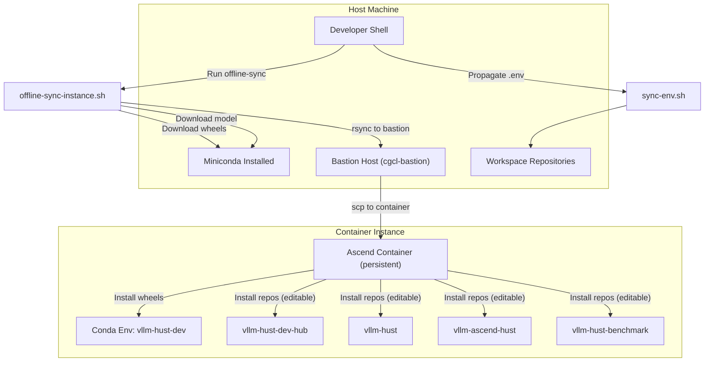
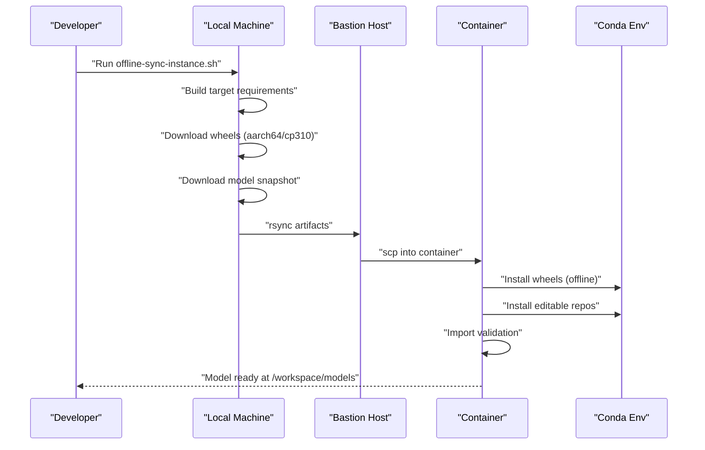
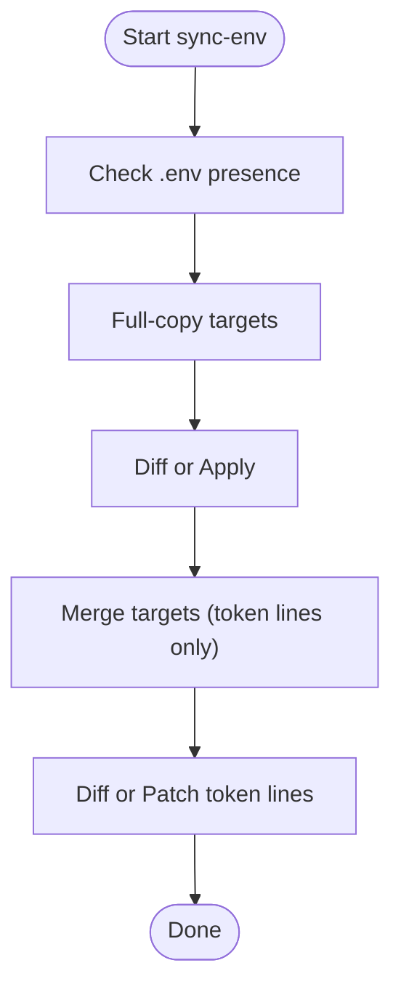
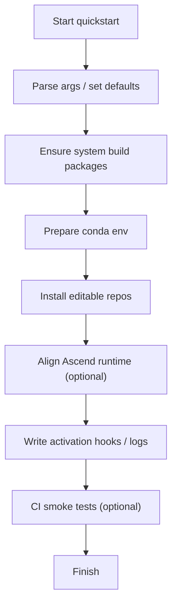
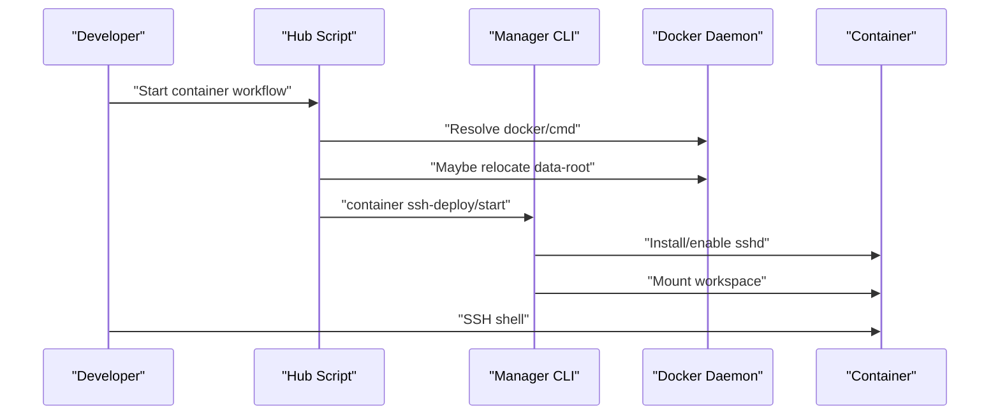
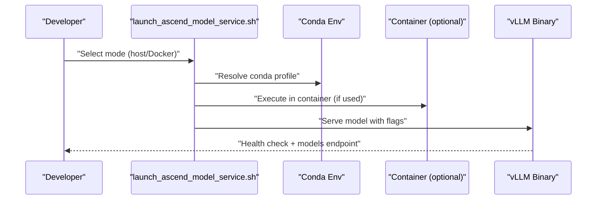
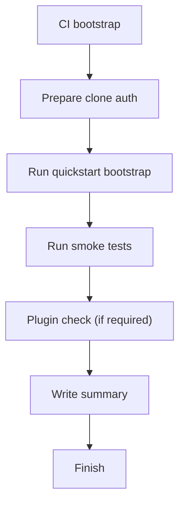
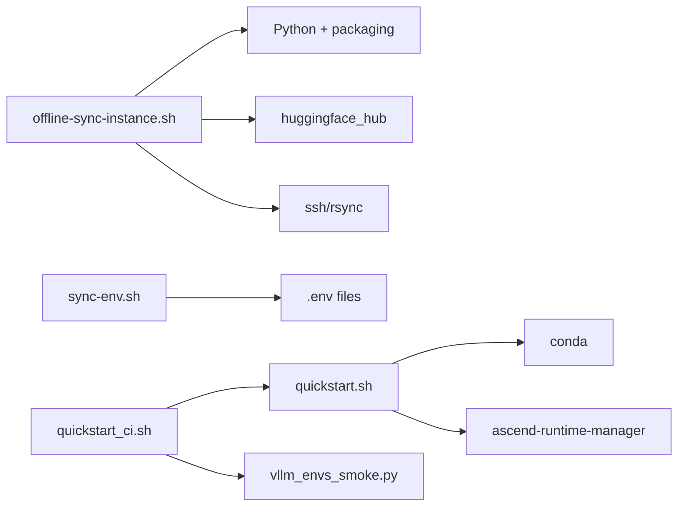

# Advanced Topics

<cite>
**Referenced Files in This Document**
- [README.md](file://README.md)
- [offline-sync-instance.sh](file://scripts/offline-sync-instance.sh)
- [sync-env.sh](file://scripts/sync-env.sh)
- [quickstart.sh](file://scripts/quickstart.sh)
- [install-miniconda.sh](file://scripts/install-miniconda.sh)
- [clone-workspace-repos.sh](file://scripts/clone-workspace-repos.sh)
- [ascend-official-container.sh](file://scripts/ascend-official-container.sh)
- [enable-existing-container-ssh.sh](file://scripts/enable-existing-container-ssh.sh)
- [ssh-into-ascend-container.sh](file://scripts/ssh-into-ascend-container.sh)
- [launch_ascend_model_service.sh](file://scripts/launch_ascend_model_service.sh)
- [quickstart_ci.sh](file://scripts/ci/quickstart_ci.sh)
- [vllm_envs_smoke.py](file://scripts/ci/vllm_envs_smoke.py)
- [team-onboarding.md](file://docs/team-onboarding.md)
- [contribution-git-workflow.md](file://docs/contribution-git-workflow.md)
- [github-actions-self-hosted-runner.md](file://docs/github-actions-self-hosted-runner.md)
- [ROADMAP.md](file://ROADMAP.md)
</cite>

## Table of Contents
1. [Introduction](#introduction)
2. [Project Structure](#project-structure)
3. [Core Components](#core-components)
4. [Architecture Overview](#architecture-overview)
5. [Detailed Component Analysis](#detailed-component-analysis)
6. [Dependency Analysis](#dependency-analysis)
7. [Performance Considerations](#performance-considerations)
8. [Troubleshooting Guide](#troubleshooting-guide)
9. [Conclusion](#conclusion)
10. [Appendices](#appendices)

## Introduction
This document focuses on advanced topics within the VLLM-HUST Development Hub, covering offline development setup, custom environment configuration, and plugin development approaches. It explains offline synchronization workflows, environment propagation mechanisms, and advanced configuration options. It also documents relationships with development workflows and team collaboration patterns, and addresses common issues such as offline setup problems, configuration conflicts, and extension integration.

## Project Structure
The VLLM-HUST Development Hub is a lightweight meta repository that orchestrates a multi-repo workspace and provides bootstrap scripts for environment setup, containerized development, and CI workflows. Key areas:
- Scripts for environment bootstrapping, offline sync, container orchestration, and CI
- Documentation for onboarding, contribution workflow, and self-hosted runners
- Benchmarks and performance roadmap supporting advanced development tasks

```mermaid
graph TB
subgraph "Meta Repository"
hub["vllm-hust-dev-hub"]
ws["vllm-hust-dev-hub.code-workspace"]
end
subgraph "Scripts"
qs["scripts/quickstart.sh"]
im["scripts/install-miniconda.sh"]
cr["scripts/clone-workspace-repos.sh"]
osi["scripts/offline-sync-instance.sh"]
syncenv["scripts/sync-env.sh"]
asccont["scripts/ascend-official-container.sh"]
enabssh["scripts/enable-existing-container-ssh.sh"]
sshin["scripts/ssh-into-ascend-container.sh"]
launchsvc["scripts/launch_ascend_model_service.sh"]
qcish["scripts/ci/quickstart_ci.sh"]
smokepy["scripts/ci/vllm_envs_smoke.py"]
end
subgraph "Docs"
onboard["docs/team-onboarding.md"]
contrib["docs/contribution-git-workflow.md"]
runnerdoc["docs/github-actions-self-hosted-runner.md"]
roadmap["ROADMAP.md"]
end
hub --> ws
hub --> qs
hub --> im
hub --> cr
hub --> osi
hub --> syncenv
hub --> asccont
hub --> enabssh
hub --> sshin
hub --> launchsvc
hub --> qcish
hub --> smokepy
hub --> onboard
hub --> contrib
hub --> runnerdoc
hub --> roadmap
```

**Diagram sources**
- [README.md:34-49](file://README.md#L34-L49)
- [offline-sync-instance.sh:1-763](file://scripts/offline-sync-instance.sh#L1-L763)
- [sync-env.sh:1-129](file://scripts/sync-env.sh#L1-L129)
- [quickstart.sh:1-800](file://scripts/quickstart.sh#L1-L800)
- [install-miniconda.sh:1-169](file://scripts/install-miniconda.sh#L1-L169)
- [clone-workspace-repos.sh:1-466](file://scripts/clone-workspace-repos.sh#L1-L466)
- [ascend-official-container.sh:1-388](file://scripts/ascend-official-container.sh#L1-L388)
- [enable-existing-container-ssh.sh:1-172](file://scripts/enable-existing-container-ssh.sh#L1-L172)
- [ssh-into-ascend-container.sh:1-14](file://scripts/ssh-into-ascend-container.sh#L1-L14)
- [launch_ascend_model_service.sh:1-680](file://scripts/launch_ascend_model_service.sh#L1-L680)
- [quickstart_ci.sh:1-321](file://scripts/ci/quickstart_ci.sh#L1-L321)
- [vllm_envs_smoke.py:1-69](file://scripts/ci/vllm_envs_smoke.py#L1-L69)
- [team-onboarding.md:1-384](file://docs/team-onboarding.md#L1-L384)
- [contribution-git-workflow.md:1-501](file://docs/contribution-git-workflow.md#L1-L501)
- [github-actions-self-hosted-runner.md:1-202](file://docs/github-actions-self-hosted-runner.md#L1-L202)
- [ROADMAP.md:1-83](file://ROADMAP.md#L1-L83)

**Section sources**
- [README.md:15-49](file://README.md#L15-L49)

## Core Components
- Offline synchronization pipeline: prepares wheels and model assets locally, transfers them through a bastion host, and installs them inside a container without public network access.
- Environment propagation: synchronizes a canonical .env across sibling repositories with selective token merges and full copies.
- Bootstrap and environment setup: creates conda environments, installs core and optional repositories, manages Ascend runtime alignment, and integrates with CI.
- Containerized development: starts and configures official Ascend containers, supports SSH access, and provides helpers for offline container setups.
- Plugin and runtime integration: validates and loads Ascend platform plugins, sets environment variables for offline model serving, and configures kernel compilation behavior.

**Section sources**
- [README.md:242-288](file://README.md#L242-L288)
- [offline-sync-instance.sh:1-763](file://scripts/offline-sync-instance.sh#L1-L763)
- [sync-env.sh:1-129](file://scripts/sync-env.sh#L1-L129)
- [quickstart.sh:1-800](file://scripts/quickstart.sh#L1-L800)
- [ascend-official-container.sh:1-388](file://scripts/ascend-official-container.sh#L1-L388)
- [launch_ascend_model_service.sh:1-680](file://scripts/launch_ascend_model_service.sh#L1-L680)

## Architecture Overview
The advanced development architecture centers on three pillars:
- Offline-first workflows: prepare artifacts locally and deploy them into restricted environments via bastion hosts.
- Environment propagation: maintain a single source of truth for tokens and secrets across sibling repositories.
- Containerized development: streamline container lifecycle, SSH access, and runtime alignment for Ascend platforms.

**Diagram sources**
- [offline-sync-instance.sh:1-763](file://scripts/offline-sync-instance.sh#L1-L763)
- [sync-env.sh:1-129](file://scripts/sync-env.sh#L1-L129)
- [README.md:242-288](file://README.md#L242-L288)

## Detailed Component Analysis

### Offline Synchronization Pipeline
The offline synchronization script coordinates:
- Artifact preparation: builds a target requirement bundle, downloads wheels for aarch64/Python 3.10, and optionally skips optional dependencies on aarch64.
- Model preparation: downloads a Hugging Face model snapshot locally or reuses an existing directory.
- Transfer: rsyncs artifacts to a bastion host staging area, then securely copies them into the container.
- Installation: installs prepared wheels and editable repositories inside the container’s conda environment, validates imports, and surfaces model location.

**Diagram sources**
- [offline-sync-instance.sh:510-733](file://scripts/offline-sync-instance.sh#L510-L733)

**Section sources**
- [offline-sync-instance.sh:128-198](file://scripts/offline-sync-instance.sh#L128-L198)
- [offline-sync-instance.sh:343-543](file://scripts/offline-sync-instance.sh#L343-L543)
- [offline-sync-instance.sh:550-623](file://scripts/offline-sync-instance.sh#L550-L623)
- [offline-sync-instance.sh:625-655](file://scripts/offline-sync-instance.sh#L625-L655)
- [offline-sync-instance.sh:657-733](file://scripts/offline-sync-instance.sh#L657-L733)

### Environment Propagation (.env)
The environment propagation script ensures a single source of truth for tokens and secrets:
- Identifies full-copy targets and merge targets.
- Compares source and target .env files; shows diffs and applies changes when requested.
- Merges only token lines for merge targets, preserving other settings.

**Diagram sources**
- [sync-env.sh:19-129](file://scripts/sync-env.sh#L19-L129)

**Section sources**
- [sync-env.sh:22-47](file://scripts/sync-env.sh#L22-L47)
- [sync-env.sh:57-121](file://scripts/sync-env.sh#L57-L121)

### Bootstrap and Environment Setup
The bootstrap script automates:
- Cloning workspace repositories in parallel with robust retry and SSH/HTTPS fallback.
- Creating/updating conda environments, installing editable packages, and aligning Ascend runtime stacks.
- Managing environment activation hooks, mirror selection for Hugging Face, and optional manager env exports.
- Supporting CI with dedicated CI bootstrap and smoke tests.

**Diagram sources**
- [quickstart.sh:144-189](file://scripts/quickstart.sh#L144-L189)
- [quickstart.sh:278-376](file://scripts/quickstart.sh#L278-L376)
- [quickstart.sh:749-793](file://scripts/quickstart.sh#L749-L793)
- [quickstart_ci.sh:232-321](file://scripts/ci/quickstart_ci.sh#L232-L321)

**Section sources**
- [quickstart.sh:144-189](file://scripts/quickstart.sh#L144-L189)
- [quickstart.sh:278-376](file://scripts/quickstart.sh#L278-L376)
- [quickstart.sh:749-793](file://scripts/quickstart.sh#L749-L793)
- [quickstart_ci.sh:232-321](file://scripts/ci/quickstart_ci.sh#L232-L321)

### Containerized Development and SSH Access
The container orchestration script:
- Resolves Docker availability and migrates Docker data-root when needed.
- Prepares authorized keys and enables SSH in the container.
- Mounts workspace roots and symlinks external targets.
- Provides helpers for enabling SSH on existing containers and entering shells.

**Diagram sources**
- [ascend-official-container.sh:108-217](file://scripts/ascend-official-container.sh#L108-L217)
- [ascend-official-container.sh:303-386](file://scripts/ascend-official-container.sh#L303-L386)
- [enable-existing-container-ssh.sh:58-172](file://scripts/enable-existing-container-ssh.sh#L58-L172)

**Section sources**
- [ascend-official-container.sh:108-217](file://scripts/ascend-official-container.sh#L108-L217)
- [ascend-official-container.sh:303-386](file://scripts/ascend-official-container.sh#L303-L386)
- [enable-existing-container-ssh.sh:58-172](file://scripts/enable-existing-container-ssh.sh#L58-L172)
- [ssh-into-ascend-container.sh:10-14](file://scripts/ssh-into-ascend-container.sh#L10-L14)

### Plugin and Runtime Integration
The model service launcher:
- Supports host mode (via hust-ascend-manager) and Docker mode (via /workspace mount).
- Applies preset configurations for common models and quantization.
- Sets environment variables for offline model serving and kernel compilation.
- Validates health endpoints and captures logs.

**Diagram sources**
- [launch_ascend_model_service.sh:366-500](file://scripts/launch_ascend_model_service.sh#L366-L500)
- [launch_ascend_model_service.sh:576-680](file://scripts/launch_ascend_model_service.sh#L576-L680)

**Section sources**
- [launch_ascend_model_service.sh:366-500](file://scripts/launch_ascend_model_service.sh#L366-L500)
- [launch_ascend_model_service.sh:576-680](file://scripts/launch_ascend_model_service.sh#L576-L680)

### CI and Smoke Testing
The CI bootstrap script:
- Creates a dedicated conda environment per runner flavor and run ID.
- Runs smoke tests for Python, CLI, runtime checks, and benchmark tests.
- Validates Ascend plugin installation when required by runner flavor.

**Diagram sources**
- [quickstart_ci.sh:146-178](file://scripts/ci/quickstart_ci.sh#L146-L178)
- [quickstart_ci.sh:232-321](file://scripts/ci/quickstart_ci.sh#L232-L321)
- [vllm_envs_smoke.py:30-69](file://scripts/ci/vllm_envs_smoke.py#L30-L69)

**Section sources**
- [quickstart_ci.sh:146-178](file://scripts/ci/quickstart_ci.sh#L146-L178)
- [quickstart_ci.sh:232-321](file://scripts/ci/quickstart_ci.sh#L232-L321)
- [vllm_envs_smoke.py:30-69](file://scripts/ci/vllm_envs_smoke.py#L30-L69)

## Dependency Analysis
- Offline sync depends on:
  - Local Python and packaging utilities for requirement bundling and wheel downloads.
  - Hugging Face Hub client for model snapshots.
  - SSH and rsync for bastion and container transfer.
- Environment propagation depends on:
  - Presence of .env files and targeted directories.
  - Controlled merging of token lines to preserve non-token settings.
- Bootstrap depends on:
  - Conda availability and environment isolation.
  - Ascend runtime manager for Python stack reconciliation.
  - CI scripts for smoke testing and plugin validation.

**Diagram sources**
- [offline-sync-instance.sh:315-341](file://scripts/offline-sync-instance.sh#L315-L341)
- [offline-sync-instance.sh:545-548](file://scripts/offline-sync-instance.sh#L545-L548)
- [sync-env.sh:19-129](file://scripts/sync-env.sh#L19-L129)
- [quickstart.sh:278-295](file://scripts/quickstart.sh#L278-L295)
- [quickstart.sh:728-752](file://scripts/quickstart.sh#L728-L752)
- [quickstart_ci.sh:208-226](file://scripts/ci/quickstart_ci.sh#L208-L226)
- [vllm_envs_smoke.py:12-41](file://scripts/ci/vllm_envs_smoke.py#L12-L41)

**Section sources**
- [offline-sync-instance.sh:315-341](file://scripts/offline-sync-instance.sh#L315-L341)
- [offline-sync-instance.sh:545-548](file://scripts/offline-sync-instance.sh#L545-L548)
- [sync-env.sh:19-129](file://scripts/sync-env.sh#L19-L129)
- [quickstart.sh:278-295](file://scripts/quickstart.sh#L278-L295)
- [quickstart.sh:728-752](file://scripts/quickstart.sh#L728-L752)
- [quickstart_ci.sh:208-226](file://scripts/ci/quickstart_ci.sh#L208-L226)
- [vllm_envs_smoke.py:12-41](file://scripts/ci/vllm_envs_smoke.py#L12-L41)

## Performance Considerations
- Offline sync reduces network overhead by preparing artifacts locally and transferring them in bulk.
- Containerized development ensures consistent runtime alignment and avoids public network dependencies.
- CI bootstrap isolates environment creation and testing to minimize flakiness and speed up feedback loops.
- Ascend-specific flags and environment variables are tuned for optimal performance in containerized and host modes.

[No sources needed since this section provides general guidance]

## Troubleshooting Guide
Common issues and resolutions:
- Offline setup problems:
  - Ensure required commands (ssh, rsync) are available and bastion connectivity is configured.
  - Verify local Python and packaging modules are installed; the script can prompt to install user-site packages.
  - Confirm artifact directories and container destinations are writable.
- Configuration conflicts:
  - Use environment propagation to synchronize .env; selectively merge token lines to avoid overwriting non-token settings.
  - Validate conda environment isolation and avoid PYTHONPATH interference during operations.
- Extension integration:
  - Confirm Ascend plugin installation and entry points; CI can validate plugin presence when required by runner flavor.
  - For containerized environments, ensure model paths and environment variables are set for offline serving.

**Section sources**
- [offline-sync-instance.sh:123-127](file://scripts/offline-sync-instance.sh#L123-L127)
- [offline-sync-instance.sh:327-341](file://scripts/offline-sync-instance.sh#L327-L341)
- [sync-env.sh:49-53](file://scripts/sync-env.sh#L49-L53)
- [quickstart.sh:287-295](file://scripts/quickstart.sh#L287-L295)
- [quickstart_ci.sh:218-226](file://scripts/ci/quickstart_ci.sh#L218-L226)

## Conclusion
The VLLM-HUST Development Hub provides a robust foundation for advanced development workflows. Offline synchronization streamlines artifact preparation and deployment, environment propagation maintains consistency across repositories, and containerized development accelerates iteration. Together with CI and plugin integration, these capabilities support scalable, reliable, and collaborative development.

[No sources needed since this section summarizes without analyzing specific files]

## Appendices

### Advanced Configuration Options and Environment Variables
- Offline sync:
  - TARGET_* variables define platform and Python targeting for wheel downloads.
  - CACHE_ROOT controls local artifact cache location.
  - BASTION_ALIAS, CONTAINER_* variables configure bastion and container destinations.
  - Model options include model-id, model-revision, model-path, and pattern filters.
- Environment propagation:
  - TOKEN_KEYS lists managed tokens; FULL_COPY_TARGETS and MERGE_TARGETS define destinations.
- Bootstrap and CI:
  - HUST_DEV_HUB_* flags control mirror selection, manager env hooks, and logging.
  - CI runner flavor and environment naming are derived from environment variables.
- Container and service:
  - Container SSH user/port, workspace roots, and model paths are configurable.
  - Service launcher supports presets, quantization, and offline flags.

**Section sources**
- [offline-sync-instance.sh:10-32](file://scripts/offline-sync-instance.sh#L10-L32)
- [offline-sync-instance.sh:37-42](file://scripts/offline-sync-instance.sh#L37-L42)
- [sync-env.sh:22-47](file://scripts/sync-env.sh#L22-L47)
- [quickstart.sh:108-110](file://scripts/quickstart.sh#L108-L110)
- [quickstart.sh:130-136](file://scripts/quickstart.sh#L130-L136)
- [quickstart_ci.sh:10-18](file://scripts/ci/quickstart_ci.sh#L10-L18)
- [launch_ascend_model_service.sh:50-79](file://scripts/launch_ascend_model_service.sh#L50-L79)

### Team Collaboration Patterns
- Onboarding:
  - Official container creation, SSH configuration, and workspace bootstrap are streamlined via documented scripts and workflows.
- Contribution:
  - Fork-branch workflow with PR creation safety and post-merge cleanup procedures.
- Self-hosted runners:
  - One-line installation and management of GitHub Actions runners as user services.

**Section sources**
- [team-onboarding.md:25-100](file://docs/team-onboarding.md#L25-L100)
- [team-onboarding.md:301-314](file://docs/team-onboarding.md#L301-L314)
- [contribution-git-workflow.md:304-371](file://docs/contribution-git-workflow.md#L304-L371)
- [github-actions-self-hosted-runner.md:36-97](file://docs/github-actions-self-hosted-runner.md#L36-L97)

### Performance Roadmap References
- Short-term goals focus on quantifying KV admission optimizations, output cadence, and targeted profiling to validate end-to-end improvements.

**Section sources**
- [ROADMAP.md:23-83](file://ROADMAP.md#L23-L83)