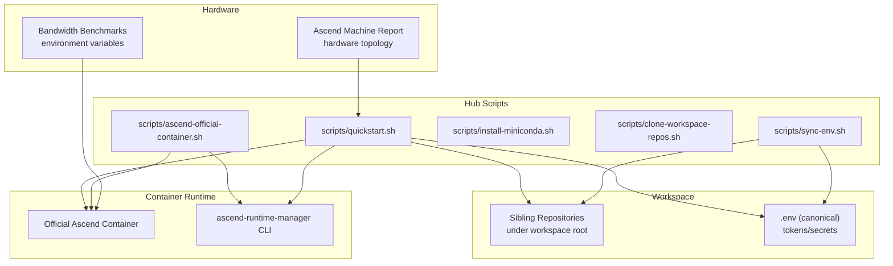
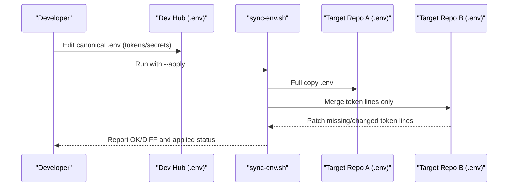
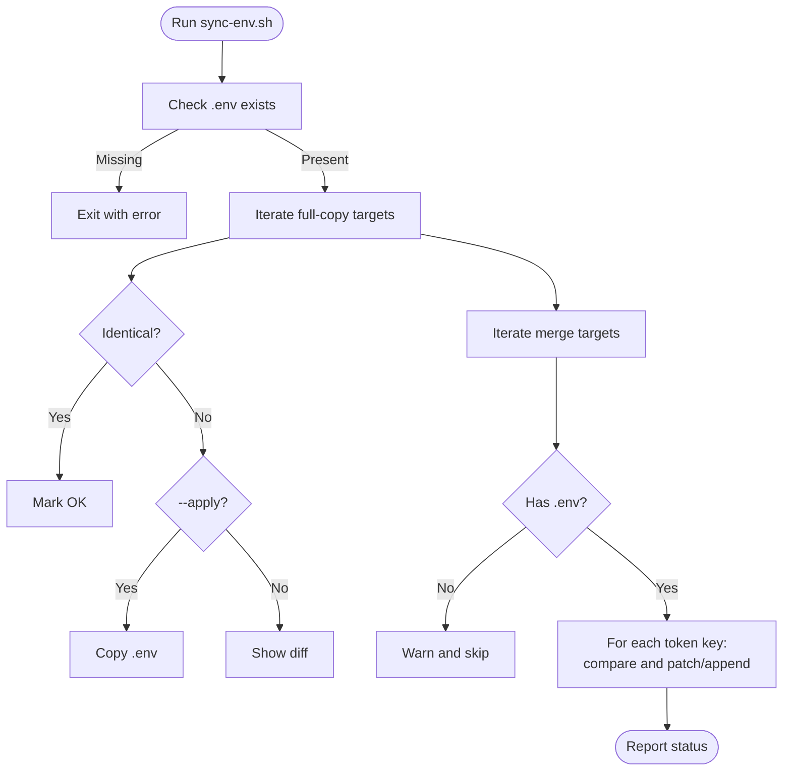
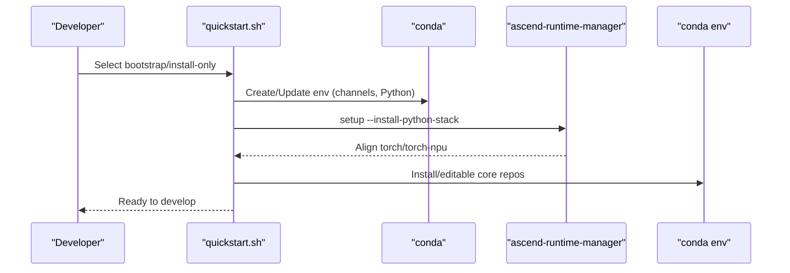
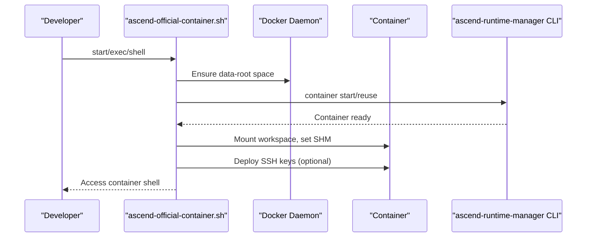
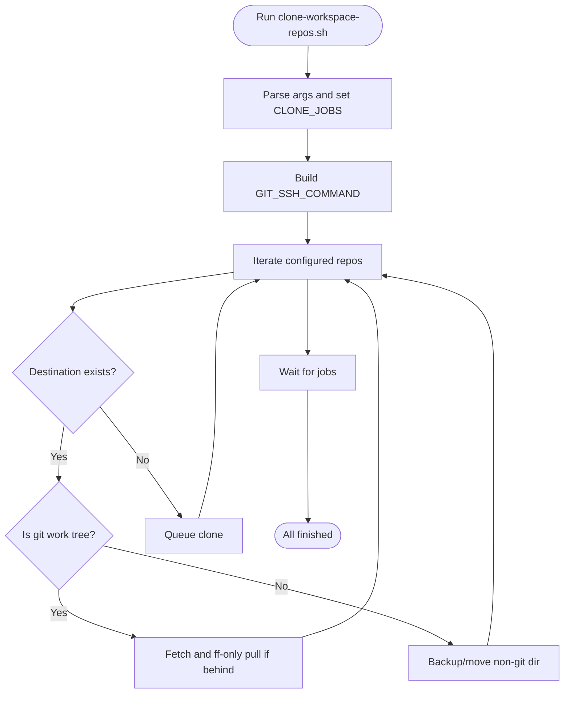
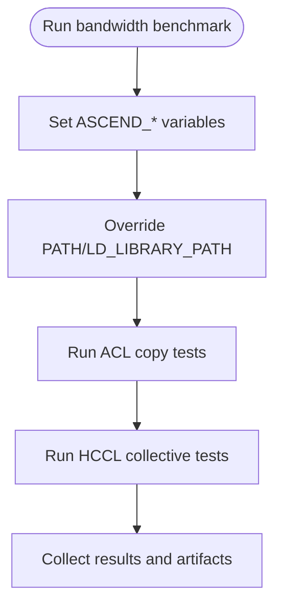
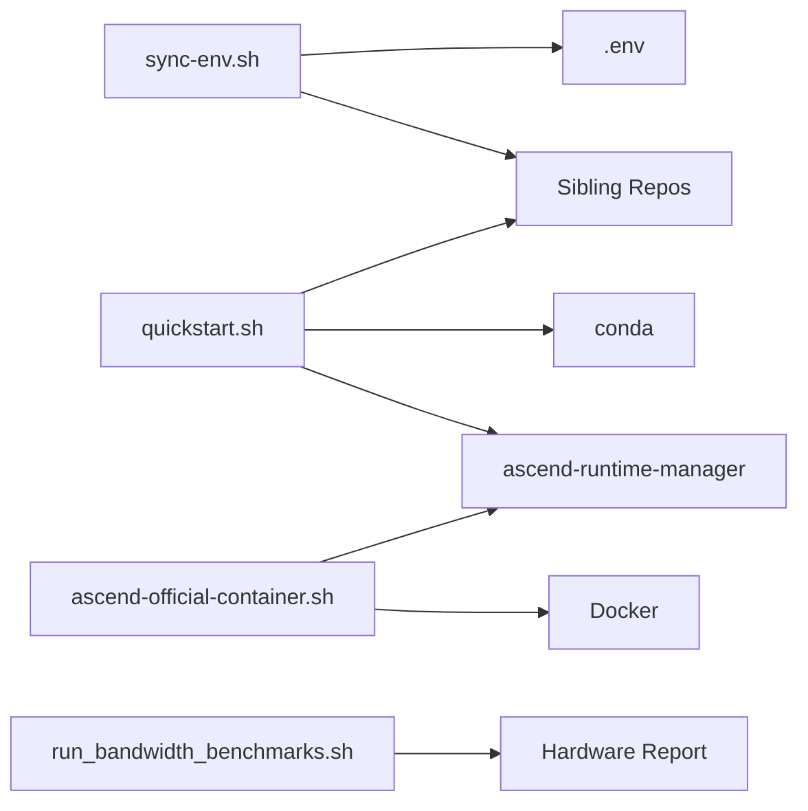

# Custom Environment Configuration

<cite>
**Referenced Files in This Document**
- [README.md](file://README.md)
- [scripts/sync-env.sh](file://scripts/sync-env.sh)
- [scripts/quickstart.sh](file://scripts/quickstart.sh)
- [scripts/install-miniconda.sh](file://scripts/install-miniconda.sh)
- [scripts/clone-workspace-repos.sh](file://scripts/clone-workspace-repos.sh)
- [scripts/ascend-official-container.sh](file://scripts/ascend-official-container.sh)
- [Ascend-Machine/HARDWARE_REPORT_20260407.md](file://Ascend-Machine/HARDWARE_REPORT_20260407.md)
- [docs/team-onboarding.md](file://docs/team-onboarding.md)
- [Ascend-Machine/benchmarks/run_bandwidth_benchmarks.sh](file://Ascend-Machine/benchmarks/run_bandwidth_benchmarks.sh)
</cite>

## Table of Contents
1. [Introduction](#introduction)
2. [Project Structure](#project-structure)
3. [Core Components](#core-components)
4. [Architecture Overview](#architecture-overview)
5. [Detailed Component Analysis](#detailed-component-analysis)
6. [Dependency Analysis](#dependency-analysis)
7. [Performance Considerations](#performance-considerations)
8. [Troubleshooting Guide](#troubleshooting-guide)
9. [Conclusion](#conclusion)
10. [Appendices](#appendices)

## Introduction
This document explains how to customize and maintain the development environment within the VLLM-HUST Development Hub. It focuses on environment variable customization, propagation across repositories, configuration file management, and advanced setup options for Ascend NPU platforms. It also documents the sync-env.sh script for propagating canonical tokens and secrets, environment inheritance patterns, validation mechanisms, and best practices for migration and maintenance.

## Project Structure
The Development Hub organizes environment configuration across:
- Bootstrap and environment orchestration scripts
- Workspace synchronization and repository management
- Containerized Ascend development lifecycle
- Hardware-specific environment variables and performance tuning
- Documentation for onboarding and operational procedures

**Diagram sources**
- [scripts/quickstart.sh](file://scripts/quickstart.sh)
- [scripts/sync-env.sh](file://scripts/sync-env.sh)
- [scripts/clone-workspace-repos.sh](file://scripts/clone-workspace-repos.sh)
- [scripts/ascend-official-container.sh](file://scripts/ascend-official-container.sh)
- [Ascend-Machine/HARDWARE_REPORT_20260407.md](file://Ascend-Machine/HARDWARE_REPORT_20260407.md)
- [Ascend-Machine/benchmarks/run_bandwidth_benchmarks.sh](file://Ascend-Machine/benchmarks/run_bandwidth_benchmarks.sh)

**Section sources**
- [README.md](file://README.md)
- [docs/team-onboarding.md](file://docs/team-onboarding.md)

## Core Components
- Canonical environment propagation via .env
  - sync-env.sh reads a single source .env and synchronizes it to sibling repositories with two strategies:
    - Full copy to specific targets
    - Token-line merging into existing .env files for workstation-local overrides
- Conda environment bootstrap and Python stack alignment
  - quickstart.sh creates or updates a named conda environment, selects Python version, mirrors channels, and reconciles Ascend stacks via ascend-runtime-manager.
- Containerized Ascend development
  - ascend-official-container.sh manages container lifecycle, SSH deployment, workspace mounting, and optional relocation of Docker data-root.
- Workspace synchronization
  - clone-workspace-repos.sh clones and updates related repositories in parallel, with Git SSH defaults and retries.
- Hardware-aware environment variables
  - Bandwidth benchmarks and hardware reports define environment variables for toolkit paths and runtime visibility.

**Section sources**
- [scripts/sync-env.sh](file://scripts/sync-env.sh)
- [scripts/quickstart.sh](file://scripts/quickstart.sh)
- [scripts/ascend-official-container.sh](file://scripts/ascend-official-container.sh)
- [scripts/clone-workspace-repos.sh](file://scripts/clone-workspace-repos.sh)
- [Ascend-Machine/benchmarks/run_bandwidth_benchmarks.sh](file://Ascend-Machine/benchmarks/run_bandwidth_benchmarks.sh)

## Architecture Overview
The environment configuration pipeline integrates repository-level .env propagation, conda environment management, and containerized Ascend runtime setup. It enforces a single source of truth for secrets and tokens while allowing local overrides in specialized repositories.

**Diagram sources**
- [scripts/sync-env.sh](file://scripts/sync-env.sh)

## Detailed Component Analysis

### Environment Variable Propagation with sync-env.sh
- Single source of truth
  - The script defines a canonical list of token keys and two categories of targets:
    - Full copy targets: identical .env replacement
    - Merge targets: token lines patched in place, preserving non-secret settings
- Dry-run vs apply
  - Without arguments, it diffs and prints differences; with --apply it copies or patches.
- Safety checks
  - Validates presence of source .env and existence of target directories.
  - Skips missing directories and warns for missing .env in merge targets.

**Diagram sources**
- [scripts/sync-env.sh](file://scripts/sync-env.sh)

**Section sources**
- [scripts/sync-env.sh](file://scripts/sync-env.sh)

### Conda Environment Setup and Python Stack Alignment
- Environment creation and updates
  - quickstart.sh detects system build prerequisites, creates or updates a named conda environment with a specified Python version, and configures mirror channels.
- Ascend stack reconciliation
  - On Ascend-capable hosts, quickstart coordinates with ascend-runtime-manager to align torch and torch-npu versions via manifests and validates runtime imports.
- Environment hooks and mirrors
  - Conda activate hooks set Hugging Face mirror endpoints conditionally and preserve/restored previous values.

**Diagram sources**
- [scripts/quickstart.sh](file://scripts/quickstart.sh)

**Section sources**
- [scripts/quickstart.sh](file://scripts/quickstart.sh)
- [scripts/install-miniconda.sh](file://scripts/install-miniconda.sh)

### Containerized Ascend Development Lifecycle
- Container orchestration
  - ascend-official-container.sh starts/reuses the official Ascend container, mounts the workspace, and optionally relocates Docker data-root to /data when needed.
- SSH automation
  - Collects host SSH keys and deploys authorized_keys into the container, aligning SSH user and port for seamless access.
- Integration with runtime manager
  - Uses ascend-runtime-manager CLI to perform container actions and SSH deployment.

**Diagram sources**
- [scripts/ascend-official-container.sh](file://scripts/ascend-official-container.sh)

**Section sources**
- [scripts/ascend-official-container.sh](file://scripts/ascend-official-container.sh)
- [docs/team-onboarding.md](file://docs/team-onboarding.md)

### Workspace Synchronization and Repository Management
- Parallel cloning and updates
  - clone-workspace-repos.sh clones or updates repositories in parallel, with configurable concurrency and robust retry logic.
- Git SSH defaults
  - Builds a sanitized GIT_SSH_COMMAND and handles fallbacks between SSH and HTTPS protocols.

**Diagram sources**
- [scripts/clone-workspace-repos.sh](file://scripts/clone-workspace-repos.sh)

**Section sources**
- [scripts/clone-workspace-repos.sh](file://scripts/clone-workspace-repos.sh)

### Hardware-Specific Environment Variables and Tuning
- Toolchain and runtime visibility
  - Bandwidth benchmarks define environment variables for toolkit paths and runtime visibility (e.g., ASCEND_RT_VISIBLE_DEVICES), ensuring clean environments for ACL/HCCL tests.
- Hardware topology awareness
  - Hardware report documents NUMA topology, PCIe domains, and NPU placement, informing environment decisions for process affinity and device selection.

**Diagram sources**
- [Ascend-Machine/benchmarks/run_bandwidth_benchmarks.sh](file://Ascend-Machine/benchmarks/run_bandwidth_benchmarks.sh)
- [Ascend-Machine/HARDWARE_REPORT_20260407.md](file://Ascend-Machine/HARDWARE_REPORT_20260407.md)

**Section sources**
- [Ascend-Machine/benchmarks/run_bandwidth_benchmarks.sh](file://Ascend-Machine/benchmarks/run_bandwidth_benchmarks.sh)
- [Ascend-Machine/HARDWARE_REPORT_20260407.md](file://Ascend-Machine/HARDWARE_REPORT_20260407.md)

## Dependency Analysis
- sync-env.sh depends on:
  - Presence of a canonical .env in the dev-hub root
  - Existence of sibling repositories under the workspace root
  - Bash POSIX features and diff/sed for patching
- quickstart.sh depends on:
  - Conda availability and proper channels
  - ascend-runtime-manager for Python stack reconciliation
  - System build tools for compiling C/C++ extensions
- ascend-official-container.sh depends on:
  - Docker availability and permissions
  - ascend-runtime-manager CLI for container actions
  - SSH key material for container access

**Diagram sources**
- [scripts/sync-env.sh](file://scripts/sync-env.sh)
- [scripts/quickstart.sh](file://scripts/quickstart.sh)
- [scripts/ascend-official-container.sh](file://scripts/ascend-official-container.sh)
- [Ascend-Machine/benchmarks/run_bandwidth_benchmarks.sh](file://Ascend-Machine/benchmarks/run_bandwidth_benchmarks.sh)

**Section sources**
- [scripts/sync-env.sh](file://scripts/sync-env.sh)
- [scripts/quickstart.sh](file://scripts/quickstart.sh)
- [scripts/ascend-official-container.sh](file://scripts/ascend-official-container.sh)
- [Ascend-Machine/benchmarks/run_bandwidth_benchmarks.sh](file://Ascend-Machine/benchmarks/run_bandwidth_benchmarks.sh)

## Performance Considerations
- Clean environment testing
  - Bandwidth benchmarks emphasize running in a clean environment to avoid interference from conda LD_LIBRARY_PATH pollution, ensuring reliable ACL/HCCL measurements.
- NUMA and PCIe-aware device selection
  - Hardware report details NUMA/node affinity and PCIe domain distribution for NPU cards, guiding process placement and multi-device aggregation strategies.
- Mirror and channel configuration
  - quickstart.sh configures conda mirrors and fallback channels to accelerate installations and reduce transient failures.

**Section sources**
- [Ascend-Machine/benchmarks/run_bandwidth_benchmarks.sh](file://Ascend-Machine/benchmarks/run_bandwidth_benchmarks.sh)
- [Ascend-Machine/HARDWARE_REPORT_20260407.md](file://Ascend-Machine/HARDWARE_REPORT_20260407.md)
- [scripts/quickstart.sh](file://scripts/quickstart.sh)

## Troubleshooting Guide
- sync-env.sh issues
  - Missing source .env: script exits early with an error. Ensure the canonical .env exists in the dev-hub root.
  - Missing target directories: script skips and logs a warning; create or restore the target directory.
  - Merge target without .env: script warns and skips patching; initialize .env in the target repository.
- Conda environment problems
  - Broken or unusable Miniconda prefix: quickstart.sh detects and backs up the prefix before reinstalling.
  - Channel ToS acceptance: quickstart.sh prompts only when creating a new environment; subsequent runs reuse recorded acceptance.
  - Conflicting torch packages: quickstart.sh removes known conflicting packages before reconciliation.
- Container SSH and workspace issues
  - Missing SSH keys: script warns and skips automatic SSH configuration; provide host keys or extra keys via the documented mechanism.
  - Docker data-root space: script can relocate Docker data-root to /data when free space is insufficient.
- Hardware test failures
  - aclInit failures in polluted environments: run tests in clean environments as documented in the bandwidth benchmarks.
  - HCCL collective errors: ensure correct toolchain and runtime paths; the hardware report documents tested configurations and workarounds.

**Section sources**
- [scripts/sync-env.sh](file://scripts/sync-env.sh)
- [scripts/quickstart.sh](file://scripts/quickstart.sh)
- [scripts/ascend-official-container.sh](file://scripts/ascend-official-container.sh)
- [Ascend-Machine/benchmarks/run_bandwidth_benchmarks.sh](file://Ascend-Machine/benchmarks/run_bandwidth_benchmarks.sh)

## Conclusion
The VLLM-HUST Development Hub provides a robust framework for custom environment configuration:
- Use sync-env.sh to propagate canonical tokens and secrets across repositories with controlled merging.
- Leverage quickstart.sh for conda environment creation, Python stack alignment, and Ascend runtime reconciliation.
- Employ ascend-official-container.sh for containerized development with automated SSH and workspace mounting.
- Follow hardware-aware environment practices for ACL/HCCL testing and NUMA/PCIe device selection.
- Adhere to the troubleshooting guidance to resolve common issues and maintain a healthy development environment.

## Appendices

### A. Environment Variable Customization Examples
- Customize Python version and environment name
  - Use quickstart.sh options to specify environment name and Python version.
- Configure mirrors and channels
  - quickstart.sh sets mirror channels and falls back to a standard channel when mirrors fail.
- Ascend runtime visibility
  - Use ASCEND_RT_VISIBLE_DEVICES and related variables to control device visibility in containerized runs.

**Section sources**
- [scripts/quickstart.sh](file://scripts/quickstart.sh)
- [scripts/ascend-official-container.sh](file://scripts/ascend-official-container.sh)
- [Ascend-Machine/benchmarks/run_bandwidth_benchmarks.sh](file://Ascend-Machine/benchmarks/run_bandwidth_benchmarks.sh)

### B. Configuration Validation and Hooks
- Conda activate hooks
  - quickstart.sh sets Hugging Face mirror endpoints conditionally and preserves/restores previous values.
- Runtime import validation
  - quickstart.sh validates torch/torch-npu and custom ops to ensure the environment is functional.

**Section sources**
- [scripts/quickstart.sh](file://scripts/quickstart.sh)

### C. Migration Best Practices
- Maintain a canonical .env in the dev-hub root and propagate via sync-env.sh.
- Keep conda environments minimal and deterministic; rely on quickstart.sh for updates.
- Use containerized workflows for Ascend development to isolate system-level dependencies.
- Document hardware-specific environment variables and device selections for reproducibility.

**Section sources**
- [scripts/sync-env.sh](file://scripts/sync-env.sh)
- [scripts/quickstart.sh](file://scripts/quickstart.sh)
- [docs/team-onboarding.md](file://docs/team-onboarding.md)