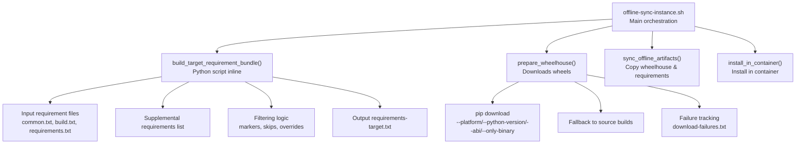
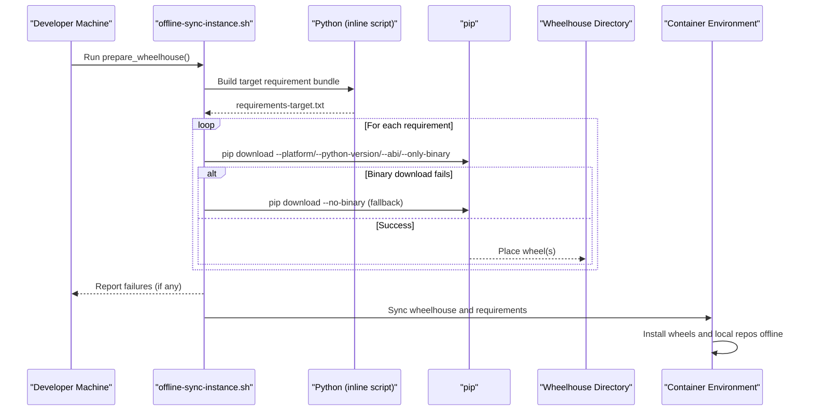
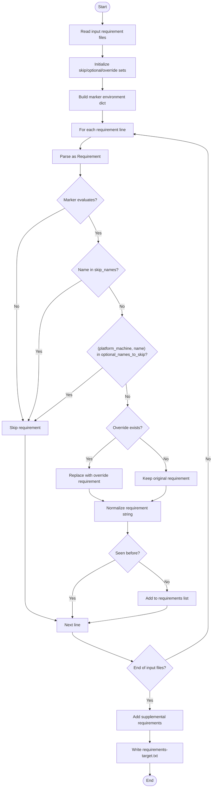
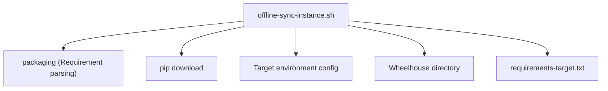

# Artifact Preparation

<cite>
**Referenced Files in This Document**
- [offline-sync-instance.sh](file://scripts/offline-sync-instance.sh)
- [README.md](file://README.md)
</cite>

## Table of Contents
1. [Introduction](#introduction)
2. [Project Structure](#project-structure)
3. [Core Components](#core-components)
4. [Architecture Overview](#architecture-overview)
5. [Detailed Component Analysis](#detailed-component-analysis)
6. [Dependency Analysis](#dependency-analysis)
7. [Performance Considerations](#performance-considerations)
8. [Troubleshooting Guide](#troubleshooting-guide)
9. [Conclusion](#conclusion)

## Introduction
This document explains the offline artifact preparation workflow used to build a wheelhouse and a target-platform-specific requirement bundle for environments without public network access. It focuses on the prepare_wheelhouse function and the build_target_requirement_bundle Python script, detailing how requirements are collected, filtered, and normalized, and how platform-specific configuration influences the resulting artifacts. It also covers configuration options such as TARGET_PLATFORM, TARGET_PYTHON_VERSION, and ABI, and provides practical guidance for preparing wheels for different architectures (aarch64 vs x86_64), handling optional dependencies, and managing download failures.

## Project Structure
The offline preparation is implemented in a single Bash script that orchestrates:
- Building a target requirement bundle from workspace requirements and supplemental packages
- Downloading wheels into a wheelhouse directory respecting platform and ABI constraints
- Packaging the wheelhouse and requirement bundle for container installation
- Installing local repositories in the container without network access

**Diagram sources**
- [offline-sync-instance.sh](file://scripts/offline-sync-instance.sh)

**Section sources**
- [offline-sync-instance.sh](file://scripts/offline-sync-instance.sh)
- [README.md](file://README.md)

## Core Components
- prepare_wheelhouse: Orchestrates building the requirement bundle and downloading wheels into the wheelhouse directory. It handles optional dependency skipping for aarch64 and failure reporting.
- build_target_requirement_bundle: An inline Python script that reads input requirement files, evaluates markers against the target environment, filters out unwanted packages, applies platform-specific overrides, and writes a deduplicated target requirements file.
- download_requirement: Attempts binary-only downloads first, then falls back to source builds if necessary.
- Configuration: TARGET_PLATFORM, TARGET_PYTHON_VERSION, TARGET_ABI, TARGET_IMPLEMENTATION, TARGET_PLATFORM_MACHINE, TARGET_SYS_PLATFORM, TARGET_PLATFORM_SYSTEM, TARGET_PYTHON_FULL_VERSION, TARGET_PYTHON_VERSION_DOTTED define the target environment for wheel selection and filtering.

**Section sources**
- [offline-sync-instance.sh](file://scripts/offline-sync-instance.sh)

## Architecture Overview
The offline preparation pipeline follows a predictable sequence: collect and normalize requirements, resolve platform constraints, download artifacts, and deliver them to the container for offline installation.

**Diagram sources**
- [offline-sync-instance.sh](file://scripts/offline-sync-instance.sh)

## Detailed Component Analysis

### prepare_wheelhouse
Purpose:
- Ensures the wheelhouse directory exists.
- Builds the target requirement bundle.
- Iterates over the generated requirements and attempts to download compatible wheels.
- Skips optional dependencies on aarch64 by design.
- Records any failures to a dedicated file and exits with an error if any downloads fail.

Key behaviors:
- Optional dependency skipping for aarch64 is explicit and logged.
- Failure tracking writes a file listing failed requirements for later inspection.
- Uses platform and ABI flags to constrain wheel selection.

Operational flow:
- Creates wheelhouse directory.
- Invokes the inline Python script to produce requirements-target.txt.
- Reads each requirement and calls download_requirement.
- Aggregates failures and writes download-failures.txt.

**Section sources**
- [offline-sync-instance.sh](file://scripts/offline-sync-instance.sh)

### build_target_requirement_bundle (Python)
Purpose:
- Aggregate requirements from workspace files and supplemental packages.
- Filter requirements based on markers, skip lists, and optional dependency sets.
- Apply platform-specific overrides.
- Output a deduplicated, normalized requirements list.

Inputs:
- Workspace root path
- Output requirements file path
- Target environment metadata: platform_machine, sys_platform, platform_system, python_version, python_full_version

Processing logic:
- Reads input files: common.txt, build.txt, and requirements.txt.
- Defines skip_names, optional_names_to_skip for aarch64, and target_specific_overrides.
- Evaluates markers against the target environment dictionary.
- Applies overrides when a platform-specific mapping exists.
- Deduplicates entries and writes the final requirements-target.txt.

**Diagram sources**
- [offline-sync-instance.sh](file://scripts/offline-sync-instance.sh)

**Section sources**
- [offline-sync-instance.sh](file://scripts/offline-sync-instance.sh)

### download_requirement
Purpose:
- Attempt to download a wheel for a given requirement using platform and ABI constraints.
- Fall back to a source distribution build if binary-only download fails.

Behavior:
- First tries binary-only download with platform and ABI flags.
- If that fails, retries with source build disabled.
- Returns success/failure to the caller.

**Section sources**
- [offline-sync-instance.sh](file://scripts/offline-sync-instance.sh)

### Configuration Options
Target environment configuration keys:
- TARGET_PLATFORM: Platform tag used for wheel selection (e.g., manylinux2014_aarch64).
- TARGET_PYTHON_VERSION: Short-form Python version used for ABI selection (e.g., 310).
- TARGET_ABI: Full ABI tag (e.g., cp310).
- TARGET_IMPLEMENTATION: Implementation identifier (e.g., cp).
- TARGET_PLATFORM_MACHINE: CPU architecture (e.g., aarch64).
- TARGET_SYS_PLATFORM: System platform identifier (e.g., linux).
- TARGET_PLATFORM_SYSTEM: System name (e.g., Linux).
- TARGET_PYTHON_FULL_VERSION: Full Python version (e.g., 3.10.20).
- TARGET_PYTHON_VERSION_DOTTED: Dotted Python version (e.g., 3.10).

How they are used:
- Passed to the inline Python script to evaluate markers and to pip download commands.
- Influence which wheels are considered compatible and whether binary-only or source builds are attempted.

**Section sources**
- [offline-sync-instance.sh](file://scripts/offline-sync-instance.sh)

### Platform-Specific Overrides and Filtering
- Optional dependencies for aarch64 are explicitly skipped during preparation.
- A platform-specific override is applied for a specific package when targeting aarch64.
- Markers are evaluated against the target environment to include/exclude requirements.

Practical impact:
- Ensures the wheelhouse is tailored to the target architecture and runtime constraints.
- Reduces unnecessary downloads and potential build failures.

**Section sources**
- [offline-sync-instance.sh](file://scripts/offline-sync-instance.sh)

## Dependency Analysis
The offline preparation relies on:
- Python packaging library to parse and normalize requirements.
- pip to resolve and download wheels or build from source distributions.
- Target environment configuration to constrain wheel selection.

**Diagram sources**
- [offline-sync-instance.sh](file://scripts/offline-sync-instance.sh)

**Section sources**
- [offline-sync-instance.sh](file://scripts/offline-sync-instance.sh)

## Performance Considerations
- Prefer binary-only downloads when possible to minimize build time and resource usage.
- Deduplication in the requirement bundle reduces redundant downloads.
- Using supplemental requirements helps ensure a minimal baseline of packages is available even if some are not explicitly declared in workspace requirements.
- Parallelism in the broader workflow (e.g., model download) is handled by the underlying tooling invoked by the script.

[No sources needed since this section provides general guidance]

## Troubleshooting Guide

Common issues and resolutions:
- Download failures:
  - Review the recorded failures file to identify problematic requirements.
  - Verify that TARGET_PLATFORM, TARGET_PYTHON_VERSION, and TARGET_ABI match the intended target environment.
  - Confirm that the inline Python script’s marker evaluation aligns with the target environment.
  - Retry with source builds if binary-only downloads fail; note that this increases build time.
- Optional dependencies on aarch64:
  - Some optional packages are intentionally skipped for aarch64. If a package is essential, adjust the filtering logic or provide a platform-specific override.
- Platform compatibility:
  - Ensure TARGET_PLATFORM_MACHINE and TARGET_PLATFORM match the container’s architecture and base image.
  - Validate TARGET_PYTHON_VERSION_DOTTED and TARGET_PYTHON_FULL_VERSION reflect the container’s Python installation.
- Container installation:
  - Confirm that the wheelhouse and requirements were synced to the container and that the container environment has the necessary prerequisites (e.g., torch/torch_npu) installed prior to offline installation.

**Section sources**
- [offline-sync-instance.sh](file://scripts/offline-sync-instance.sh)

## Conclusion
The offline artifact preparation workflow centers on a robust wheelhouse creation process driven by a target requirement bundle built from workspace inputs and supplemental packages. The build_target_requirement_bundle Python script applies filtering, marker evaluation, and platform-specific overrides to produce a precise set of requirements. The prepare_wheelhouse function enforces platform constraints, attempts binary downloads, falls back to source builds when necessary, and reports failures for remediation. By tuning TARGET_PLATFORM, TARGET_PYTHON_VERSION, and ABI, teams can reliably prepare wheels for diverse architectures such as aarch64 and x86_64, manage optional dependencies, and ensure smooth offline installation in restricted environments.