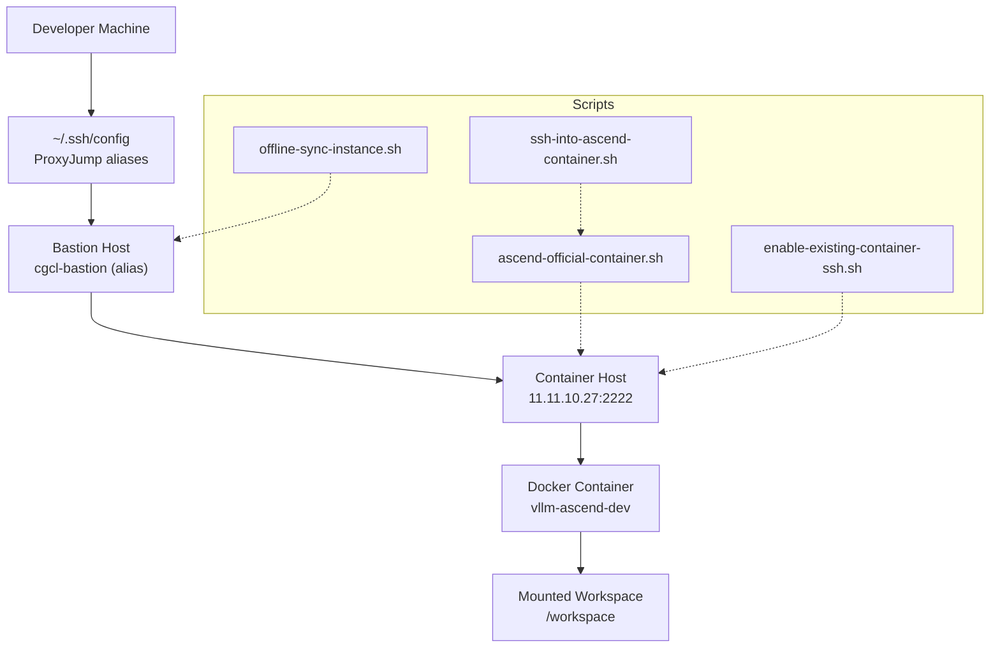
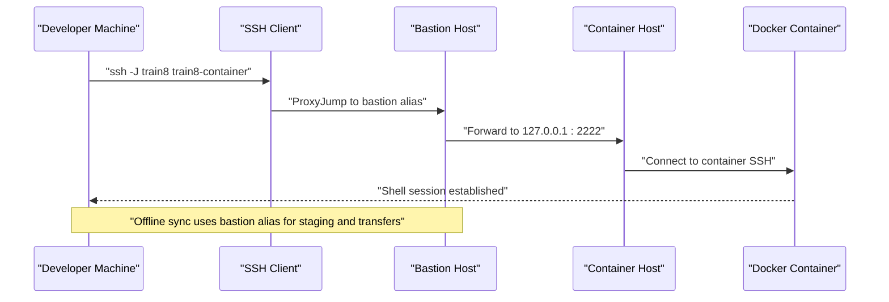
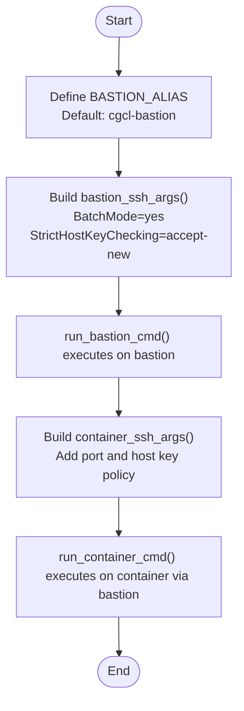
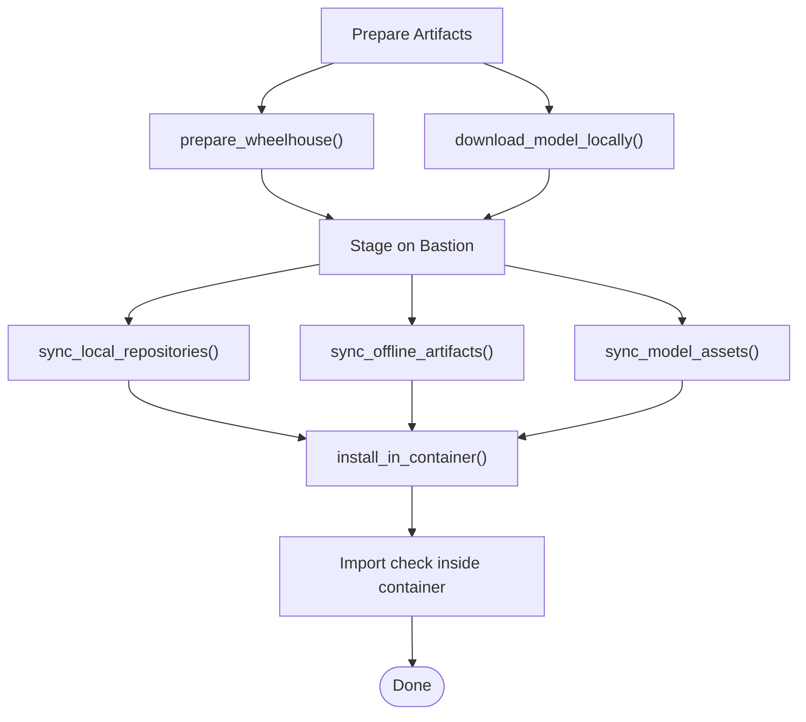
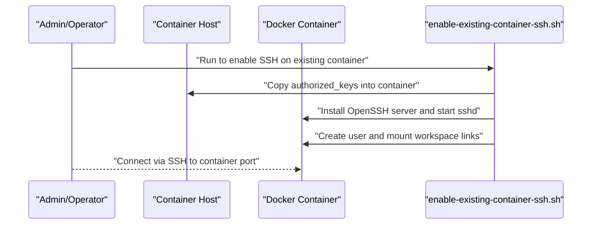
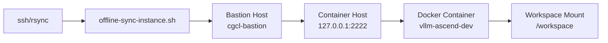

# Bastion Host Configuration

<cite>
**Referenced Files in This Document**
- [offline-sync-instance.sh](file://scripts/offline-sync-instance.sh)
- [ascend-official-container.sh](file://scripts/ascend-official-container.sh)
- [enable-existing-container-ssh.sh](file://scripts/enable-existing-container-ssh.sh)
- [ssh-into-ascend-container.sh](file://scripts/ssh-into-ascend-container.sh)
- [README.md](file://README.md)
- [team-onboarding.md](file://docs/team-onboarding.md)
- [train8-container-quickstart.md](file://docs/train8-container-quickstart.md)
</cite>

## Table of Contents
1. [Introduction](#introduction)
2. [Project Structure](#project-structure)
3. [Core Components](#core-components)
4. [Architecture Overview](#architecture-overview)
5. [Detailed Component Analysis](#detailed-component-analysis)
6. [Dependency Analysis](#dependency-analysis)
7. [Performance Considerations](#performance-considerations)
8. [Troubleshooting Guide](#troubleshooting-guide)
9. [Conclusion](#conclusion)

## Introduction
This document explains how to configure and operate a bastion host for secure offline development synchronization. It focuses on the bastion host architecture, SSH tunneling setup, and the offline synchronization workflow that transfers wheels, models, and source repositories into an Ascend Docker container without exposing the container to the public Internet. It covers the BASTION_ALIAS variable, SSH arguments for secure connections, and the bastion_ssh_args function implementation. It also documents SSH key management, host key verification settings, and practical troubleshooting steps for connectivity and security.

## Project Structure
The bastion host and offline synchronization functionality is implemented primarily in the scripts directory and documented in the repository’s documentation. The key files involved are:
- scripts/offline-sync-instance.sh: orchestrates offline preparation and transfer via the bastion host
- scripts/ascend-official-container.sh: manages container SSH deployment and host key alignment
- scripts/enable-existing-container-ssh.sh: enables SSH on an already-running container and mounts workspace directories
- scripts/ssh-into-ascend-container.sh: convenience wrapper to enter the container shell
- docs/team-onboarding.md and docs/train8-container-quickstart.md: client-side SSH configuration and ProxyJump guidance
- README.md: high-level overview of offline container sync and bastion host usage

**Diagram sources**
- [offline-sync-instance.sh:10-18](file://scripts/offline-sync-instance.sh#L10-L18)
- [offline-sync-instance.sh:211-222](file://scripts/offline-sync-instance.sh#L211-L222)
- [ascend-official-container.sh:10-22](file://scripts/ascend-official-container.sh#L10-L22)
- [enable-existing-container-ssh.sh:10-16](file://scripts/enable-existing-container-ssh.sh#L10-L16)
- [ssh-into-ascend-container.sh:10-14](file://scripts/ssh-into-ascend-container.sh#L10-L14)
- [README.md:242-252](file://README.md#L242-L252)

**Section sources**
- [README.md:44-46](file://README.md#L44-L46)
- [README.md:242-252](file://README.md#L242-L252)

## Core Components
- BASTION_ALIAS variable: defines the bastion host alias used for offline synchronization. Defaults to cgcl-bastion.
- bastion_ssh_args(): prints SSH arguments for bastion connections with batch mode and host key checking set to accept-new.
- container_ssh_args(): prints SSH arguments for container connections, including port and host key checking.
- run_bastion_cmd(): executes commands on the bastion host using bastion_ssh_args().
- run_container_cmd(): executes commands on the container via the bastion host using container_ssh_args().
- copy_bastion_stage_to_container(): copies staged artifacts from bastion staging to the container using scp with the container port.
- sync_to_container() and sync_repo_to_container(): rsyncs local artifacts to bastion staging and then copies to the container.

These components collectively implement a secure, offline-first synchronization pipeline that avoids public network exposure for the container.

**Section sources**
- [offline-sync-instance.sh:10-18](file://scripts/offline-sync-instance.sh#L10-L18)
- [offline-sync-instance.sh:211-222](file://scripts/offline-sync-instance.sh#L211-L222)
- [offline-sync-instance.sh:224-240](file://scripts/offline-sync-instance.sh#L224-L240)
- [offline-sync-instance.sh:242-262](file://scripts/offline-sync-instance.sh#L242-L262)
- [offline-sync-instance.sh:264-292](file://scripts/offline-sync-instance.sh#L264-L292)
- [offline-sync-instance.sh:294-313](file://scripts/offline-sync-instance.sh#L294-L313)

## Architecture Overview
The offline synchronization workflow uses a bastion host as a controlled relay to stage and transfer artifacts into the container. The container exposes SSH on a dedicated port on the host, and client machines connect via ProxyJump through the bastion host.

**Diagram sources**
- [offline-sync-instance.sh:10-18](file://scripts/offline-sync-instance.sh#L10-L18)
- [offline-sync-instance.sh:211-222](file://scripts/offline-sync-instance.sh#L211-L222)
- [offline-sync-instance.sh:224-240](file://scripts/offline-sync-instance.sh#L224-L240)
- [train8-container-quickstart.md:140-161](file://docs/train8-container-quickstart.md#L140-L161)
- [team-onboarding.md:124-137](file://docs/team-onboarding.md#L124-L137)

## Detailed Component Analysis

### Bastion Host Alias and SSH Arguments
- BASTION_ALIAS defaults to cgcl-bastion and is used to stage artifacts on the bastion host before copying to the container.
- bastion_ssh_args() sets BatchMode and StrictHostKeyChecking to accept-new for automated, non-interactive bastion operations.
- container_ssh_args() adds the container port and similar host key checking policy for container connections.
- run_bastion_cmd() and run_container_cmd() encapsulate argument passing and command execution through the bastion.

**Diagram sources**
- [offline-sync-instance.sh:10-18](file://scripts/offline-sync-instance.sh#L10-L18)
- [offline-sync-instance.sh:211-222](file://scripts/offline-sync-instance.sh#L211-L222)
- [offline-sync-instance.sh:224-240](file://scripts/offline-sync-instance.sh#L224-L240)

**Section sources**
- [offline-sync-instance.sh:10-18](file://scripts/offline-sync-instance.sh#L10-L18)
- [offline-sync-instance.sh:211-222](file://scripts/offline-sync-instance.sh#L211-L222)
- [offline-sync-instance.sh:224-240](file://scripts/offline-sync-instance.sh#L224-L240)

### Offline Artifact Preparation and Transfer
- prepare_wheelhouse(): builds a target-specific requirements bundle and downloads compatible wheels into a local wheelhouse.
- download_model_locally(): optionally downloads a Hugging Face model snapshot locally for offline installation.
- sync_local_repositories(), sync_offline_artifacts(), sync_model_assets(): rsync artifacts to bastion staging and copy to container destinations.
- install_in_container(): runs an offline install script inside the container using the prepared wheelhouse and editable installs.

**Diagram sources**
- [offline-sync-instance.sh:510-543](file://scripts/offline-sync-instance.sh#L510-L543)
- [offline-sync-instance.sh:550-614](file://scripts/offline-sync-instance.sh#L550-L614)
- [offline-sync-instance.sh:625-655](file://scripts/offline-sync-instance.sh#L625-L655)
- [offline-sync-instance.sh:641-646](file://scripts/offline-sync-instance.sh#L641-L646)
- [offline-sync-instance.sh:648-655](file://scripts/offline-sync-instance.sh#L648-L655)
- [offline-sync-instance.sh:657-733](file://scripts/offline-sync-instance.sh#L657-L733)

**Section sources**
- [offline-sync-instance.sh:510-543](file://scripts/offline-sync-instance.sh#L510-L543)
- [offline-sync-instance.sh:550-614](file://scripts/offline-sync-instance.sh#L550-L614)
- [offline-sync-instance.sh:625-655](file://scripts/offline-sync-instance.sh#L625-L655)
- [offline-sync-instance.sh:641-646](file://scripts/offline-sync-instance.sh#L641-L646)
- [offline-sync-instance.sh:648-655](file://scripts/offline-sync-instance.sh#L648-L655)
- [offline-sync-instance.sh:657-733](file://scripts/offline-sync-instance.sh#L657-L733)

### Container SSH Deployment and Access
- ascend-official-container.sh: prepares authorized keys, optionally enables container SSH, and suggests a direct SSH command using the container port.
- enable-existing-container-ssh.sh: installs OpenSSH server in the container, creates a user, injects authorized keys, and starts sshd bound to the container port.
- ssh-into-ascend-container.sh: launches the container shell via the official container script.

**Diagram sources**
- [ascend-official-container.sh:303-328](file://scripts/ascend-official-container.sh#L303-L328)
- [ascend-official-container.sh:351-360](file://scripts/ascend-official-container.sh#L351-L360)
- [enable-existing-container-ssh.sh:58-172](file://scripts/enable-existing-container-ssh.sh#L58-L172)
- [ssh-into-ascend-container.sh:10-14](file://scripts/ssh-into-ascend-container.sh#L10-L14)

**Section sources**
- [ascend-official-container.sh:303-328](file://scripts/ascend-official-container.sh#L303-L328)
- [ascend-official-container.sh:351-360](file://scripts/ascend-official-container.sh#L351-L360)
- [enable-existing-container-ssh.sh:58-172](file://scripts/enable-existing-container-ssh.sh#L58-L172)
- [ssh-into-ascend-container.sh:10-14](file://scripts/ssh-into-ascend-container.sh#L10-L14)

## Dependency Analysis
The offline synchronization depends on:
- SSH availability on the developer machine and bastion host
- Rsync availability for staging and transfer
- Properly configured SSH aliases with ProxyJump
- Authorized keys present on the host for container SSH
- Container SSH listening on the configured port

**Diagram sources**
- [offline-sync-instance.sh:740-742](file://scripts/offline-sync-instance.sh#L740-L742)
- [offline-sync-instance.sh:10-18](file://scripts/offline-sync-instance.sh#L10-L18)
- [offline-sync-instance.sh:211-222](file://scripts/offline-sync-instance.sh#L211-L222)
- [offline-sync-instance.sh:224-240](file://scripts/offline-sync-instance.sh#L224-L240)
- [train8-container-quickstart.md:140-161](file://docs/train8-container-quickstart.md#L140-L161)

**Section sources**
- [offline-sync-instance.sh:740-742](file://scripts/offline-sync-instance.sh#L740-L742)
- [offline-sync-instance.sh:10-18](file://scripts/offline-sync-instance.sh#L10-L18)
- [offline-sync-instance.sh:211-222](file://scripts/offline-sync-instance.sh#L211-L222)
- [offline-sync-instance.sh:224-240](file://scripts/offline-sync-instance.sh#L224-L240)
- [train8-container-quickstart.md:140-161](file://docs/train8-container-quickstart.md#L140-L161)

## Performance Considerations
- Parallelism: Control rsync progress and delete behavior to balance speed and disk usage during staging and transfer.
- Artifact filtering: Exclude unnecessary caches and build artifacts to reduce transfer volume.
- Wheel targeting: Use target-specific wheels to minimize post-installation rebuilds inside the container.
- Network efficiency: Prefer local caching of wheels and models to avoid repeated downloads.

[No sources needed since this section provides general guidance]

## Troubleshooting Guide
Common issues and resolutions:
- Host key mismatch after container rebuild:
  - Clear cached entries for the alias and the container host: use ssh-keygen to remove old entries for the alias and the container host address/port.
- No SSH access to container:
  - Ensure container SSH is enabled and sshd is running on the configured port; verify authorized_keys were injected and user/group ownership is correct.
- Bastion connectivity failures:
  - Confirm BASTION_ALIAS resolves to the intended bastion host and that bastion_ssh_args() settings match the bastion’s configuration.
- ProxyJump failures:
  - Validate SSH config aliases and ensure the bastion allows ProxyJump to the container host on the configured port.
- Firewall and network isolation:
  - Ensure the container host accepts inbound connections on the container port from the bastion host and that outbound traffic from the bastion host is permitted to the container host.

**Section sources**
- [team-onboarding.md:147-152](file://docs/team-onboarding.md#L147-L152)
- [enable-existing-container-ssh.sh:120-148](file://scripts/enable-existing-container-ssh.sh#L120-L148)
- [offline-sync-instance.sh:211-222](file://scripts/offline-sync-instance.sh#L211-L222)
- [train8-container-quickstart.md:140-161](file://docs/train8-container-quickstart.md#L140-L161)

## Conclusion
The bastion host configuration provides a secure, offline-first pathway to synchronize wheels, models, and source repositories into a container without exposing the container to the public Internet. By leveraging bastion_ssh_args(), container_ssh_args(), and staged transfers, the workflow minimizes risk while enabling efficient development in isolated environments. Proper SSH configuration, host key verification policies, and container SSH deployment are essential for reliable operation.