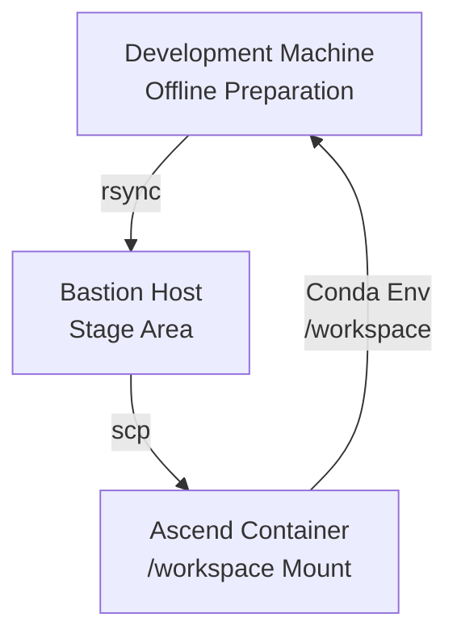
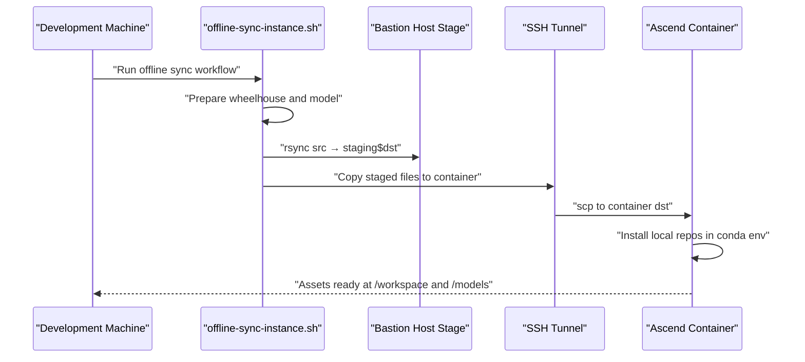
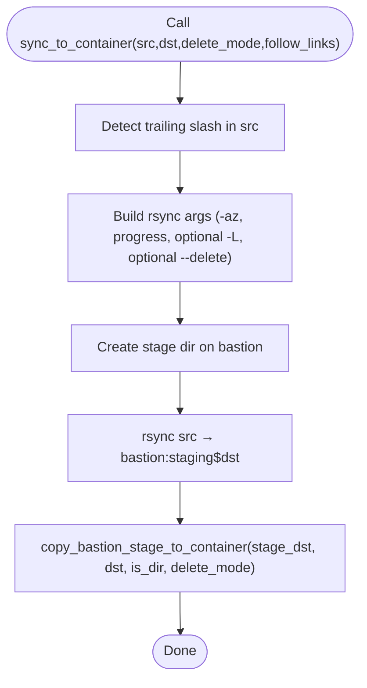
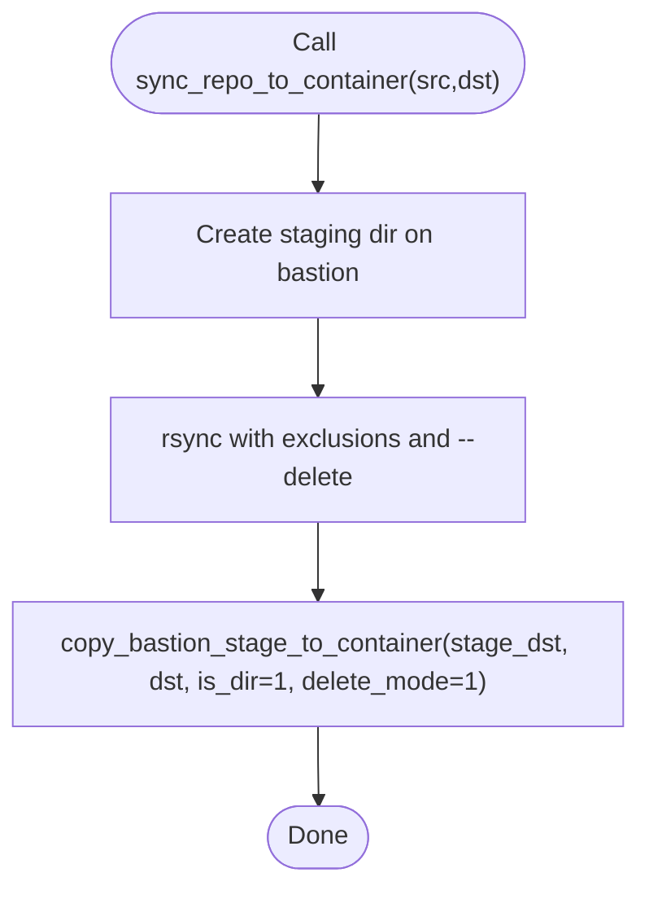
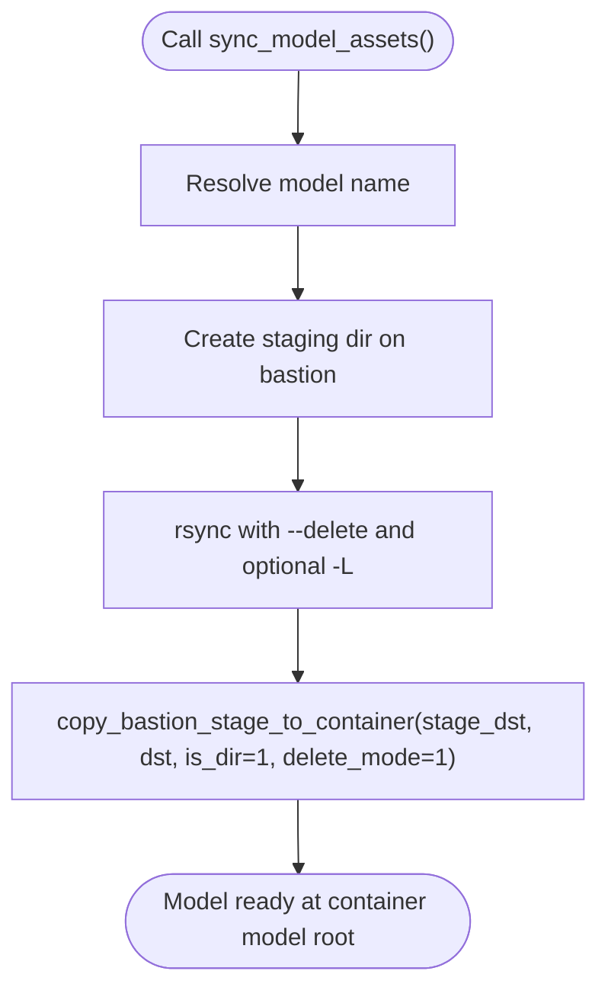
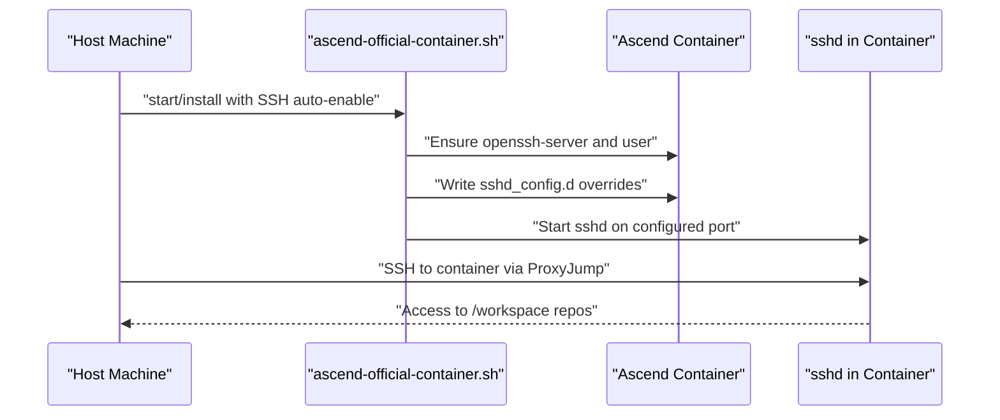
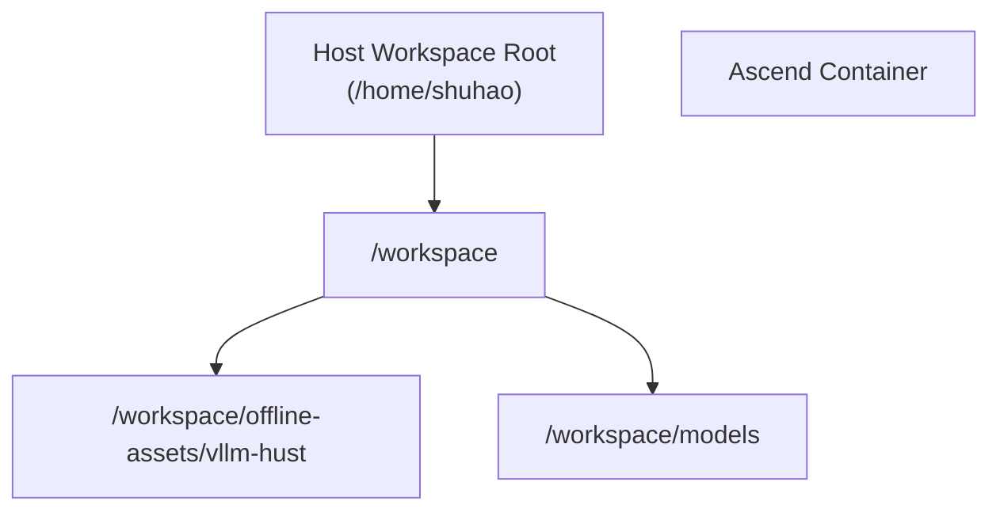
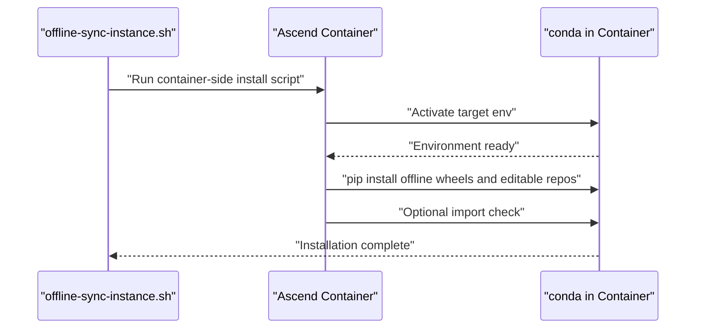
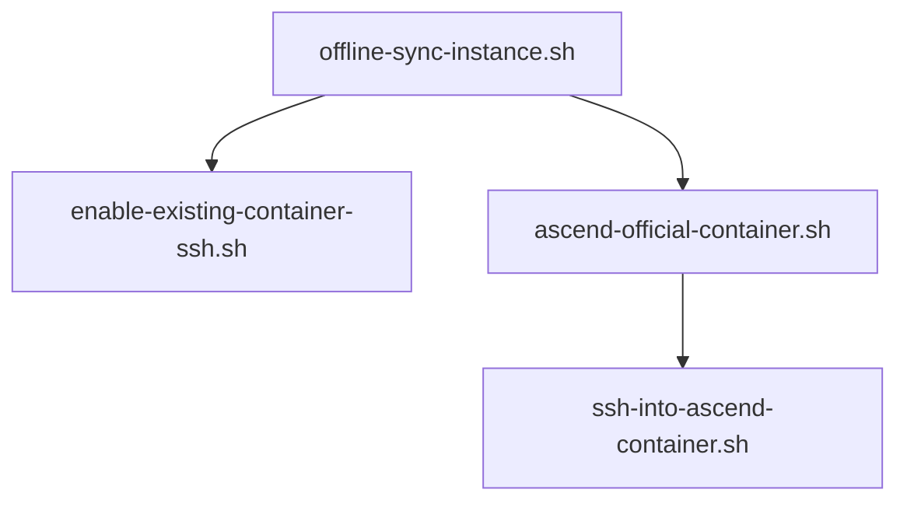

# Container Synchronization

<cite>
**Referenced Files in This Document**
- [offline-sync-instance.sh](file://scripts/offline-sync-instance.sh)
- [enable-existing-container-ssh.sh](file://scripts/enable-existing-container-ssh.sh)
- [ascend-official-container.sh](file://scripts/ascend-official-container.sh)
- [ssh-into-ascend-container.sh](file://scripts/ssh-into-ascend-container.sh)
- [README.md](file://README.md)
- [train8-container-quickstart.md](file://docs/train8-container-quickstart.md)
- [train8-user8-container-repair-20260502.md](file://docs/train8-user8-container-repair-20260502.md)
</cite>

## Table of Contents
1. [Introduction](#introduction)
2. [Project Structure](#project-structure)
3. [Core Components](#core-components)
4. [Architecture Overview](#architecture-overview)
5. [Detailed Component Analysis](#detailed-component-analysis)
6. [Dependency Analysis](#dependency-analysis)
7. [Performance Considerations](#performance-considerations)
8. [Troubleshooting Guide](#troubleshooting-guide)
9. [Conclusion](#conclusion)

## Introduction
This document explains the end-to-end container synchronization workflow for transferring offline artifacts (Python wheels, local repository sources, and model assets) into an Ascend container without public network access. It focuses on the offline synchronization script and its supporting container SSH and runtime helpers, detailing:
- The sync_to_container and sync_repo_to_container functions, including rsync configuration, staging area management, and deletion modes
- Container SSH configuration, port forwarding setup, and container-side asset organization
- The sync_model_assets process for model directories, repository synchronization excluding git metadata, and workspace mounting
- Troubleshooting network connectivity issues, permission problems, and synchronization failures
- Performance optimization for large datasets and incremental synchronization strategies

## Project Structure
The synchronization workflow spans three primary scripts and documentation:
- scripts/offline-sync-instance.sh: orchestrates offline artifact preparation and transfer into the container
- scripts/enable-existing-container-ssh.sh: enables SSH access for an already-running container and surfaces mounted repos
- scripts/ascend-official-container.sh: manages the official Ascend container lifecycle and SSH configuration
- scripts/ssh-into-ascend-container.sh: convenience entrypoint to SSH into a running Ascend dev container
- docs/train8-container-quickstart.md and docs/train8-user8-container-repair-20260502.md: operational guidance and real-world repair notes
- README.md: high-level overview and usage pointers

**Diagram sources**
- [offline-sync-instance.sh:264-313](file://scripts/offline-sync-instance.sh#L264-L313)
- [offline-sync-instance.sh:242-262](file://scripts/offline-sync-instance.sh#L242-L262)
- [README.md:242-272](file://README.md#L242-L272)

**Section sources**
- [README.md:44-47](file://README.md#L44-L47)
- [README.md:242-272](file://README.md#L242-L272)

## Core Components
- Offline synchronization orchestration
  - Prepares Python wheels and a target model locally
  - Synchronizes repositories, wheelhouse, and model into the container via a bastion host
  - Installs local repositories inside the container’s conda environment without public network access
- Container SSH enablement
  - Ensures openssh-server is installed inside the container
  - Creates a user, sets authorized_keys, and starts sshd bound to a configurable port
  - Symlinks mounted workspace repositories for convenient access
- Official container management
  - Starts/reuses the official Ascend container with host networking and /workspace mount
  - Auto-configures container SSH when host SSH keys are present
  - Provides ProxyJump-friendly SSH access on port 2222

**Section sources**
- [offline-sync-instance.sh:735-761](file://scripts/offline-sync-instance.sh#L735-L761)
- [enable-existing-container-ssh.sh:58-169](file://scripts/enable-existing-container-ssh.sh#L58-L169)
- [ascend-official-container.sh:330-386](file://scripts/ascend-official-container.sh#L330-L386)

## Architecture Overview
The offline synchronization pipeline uses a staged transfer through a bastion host to minimize risk and maximize reliability in restricted networks.

**Diagram sources**
- [offline-sync-instance.sh:264-313](file://scripts/offline-sync-instance.sh#L264-L313)
- [offline-sync-instance.sh:242-262](file://scripts/offline-sync-instance.sh#L242-L262)
- [offline-sync-instance.sh:641-733](file://scripts/offline-sync-instance.sh#L641-L733)

## Detailed Component Analysis

### sync_to_container: rsync-based staged transfer with deletion modes
- Purpose: Transfer arbitrary files or directories into the container via a bastion host staging area
- Staging area: A per-user staging path under the bastion host’s root, ensuring safe incremental updates
- rsync configuration:
  - Archive and compress (-az)
  - Progress reporting (--info=progress2)
  - Optional follow-links (-L) to preserve symlinks as links
  - Optional delete (--delete) to mirror deletions from source to destination
- Deletion modes:
  - delete_mode=1 mirrors deletions from source to destination
  - delete_mode=0 preserves existing container files not present at source
- Directory vs file handling:
  - For directories, creates destination and uses “dot-slash” rsync semantics to avoid extra nesting
  - For files, ensures parent directories exist and optionally deletes the destination file before copying

**Diagram sources**
- [offline-sync-instance.sh:264-292](file://scripts/offline-sync-instance.sh#L264-L292)
- [offline-sync-instance.sh:242-262](file://scripts/offline-sync-instance.sh#L242-L262)

**Section sources**
- [offline-sync-instance.sh:264-292](file://scripts/offline-sync-instance.sh#L264-L292)

### sync_repo_to_container: repository sync excluding git metadata
- Purpose: Synchronize local repositories into the container while excluding transient and build artifacts
- Exclusions: .git, .venv, __pycache__, .pytest_cache, .mypy_cache, .ruff_cache, build, dist, *.pyc
- Behavior:
  - Creates staging directory on bastion
  - rsync with exclusions and --delete to keep destination clean
  - Copies staged files to container with directory semantics and strict deletion mode

**Diagram sources**
- [offline-sync-instance.sh:294-313](file://scripts/offline-sync-instance.sh#L294-L313)

**Section sources**
- [offline-sync-instance.sh:294-313](file://scripts/offline-sync-instance.sh#L294-L313)

### sync_model_assets: model directory transfer with symlink handling
- Purpose: Transfer a model directory into the container’s model root
- Options:
  - delete_mode=1 to mirror deletions
  - follow_links=1 to preserve symlinks as links during rsync
- Destination organization:
  - Uses a sanitized model name derived from either model-id or local path
  - Places the model under the configured container model root

**Diagram sources**
- [offline-sync-instance.sh:648-655](file://scripts/offline-sync-instance.sh#L648-L655)

**Section sources**
- [offline-sync-instance.sh:648-655](file://scripts/offline-sync-instance.sh#L648-L655)

### Container SSH configuration and port forwarding
- SSH enablement for existing containers:
  - Installs openssh-server if missing
  - Creates a dedicated user with UID/GID aligned to the host workspace owner
  - Writes sshd_config.d overrides for port, pubkey auth, and authorized keys
  - Starts sshd and creates workspace symlinks for convenience
- Official container SSH:
  - Auto-enables sshd when host SSH keys are detected
  - Aligns container SSH user with mounted workspace ownership
  - Provides ProxyJump-friendly SSH access on port 2222
- Port forwarding and access:
  - Container SSH listens directly on host port 2222 (not Docker port mapping)
  - SSH config examples show ProxyJump from bastion to container

**Diagram sources**
- [enable-existing-container-ssh.sh:58-169](file://scripts/enable-existing-container-ssh.sh#L58-L169)
- [ascend-official-container.sh:303-328](file://scripts/ascend-official-container.sh#L303-L328)
- [train8-container-quickstart.md:131-161](file://docs/train8-container-quickstart.md#L131-L161)

**Section sources**
- [enable-existing-container-ssh.sh:58-169](file://scripts/enable-existing-container-ssh.sh#L58-L169)
- [ascend-official-container.sh:303-328](file://scripts/ascend-official-container.sh#L303-L328)
- [train8-container-quickstart.md:131-161](file://docs/train8-container-quickstart.md#L131-L161)

### Workspace mounting and container-side asset organization
- Workspace mount:
  - The host workspace root is mounted into the container at /workspace
  - Official container uses host networking and mounts resolved external symlink targets
- Asset organization:
  - Offline assets are placed under a dedicated container asset root within /workspace
  - Models are organized under a separate container model root
  - Repositories are synchronized into /workspace/<repo-name> with exclusions applied

**Diagram sources**
- [README.md:228-241](file://README.md#L228-L241)
- [offline-sync-instance.sh:16-18](file://scripts/offline-sync-instance.sh#L16-L18)

**Section sources**
- [README.md:228-241](file://README.md#L228-L241)
- [offline-sync-instance.sh:16-18](file://scripts/offline-sync-instance.sh#L16-L18)

### Offline installation and import validation inside the container
- Execution:
  - Runs a container-side script that activates the conda environment and installs local repositories
  - Installs offline wheels from the staged wheelhouse and editable packages from workspace repos
  - Optionally validates import of key modules post-install
- Conda environment alignment:
  - Resolves the target environment name and verifies its presence before proceeding

**Diagram sources**
- [offline-sync-instance.sh:657-733](file://scripts/offline-sync-instance.sh#L657-L733)

**Section sources**
- [offline-sync-instance.sh:657-733](file://scripts/offline-sync-instance.sh#L657-L733)

## Dependency Analysis
- Script-level dependencies
  - offline-sync-instance.sh depends on:
    - ssh and rsync availability on the development machine
    - bastion host reachability and proper SSH configuration
    - container SSH accessibility on port 2222
  - enable-existing-container-ssh.sh depends on:
    - Docker availability (direct or via sudo)
    - presence of authorized_keys on the host
  - ascend-official-container.sh coordinates:
    - Docker daemon and data-root placement
    - SSH configuration and port exposure
- External dependencies
  - Conda environment with Python and required packages
  - Hugging Face Hub client for model snapshot downloads
  - openssh-server inside the container for SSH access

**Diagram sources**
- [offline-sync-instance.sh:740-743](file://scripts/offline-sync-instance.sh#L740-L743)
- [enable-existing-container-ssh.sh:27-39](file://scripts/enable-existing-container-ssh.sh#L27-L39)
- [ascend-official-container.sh:46-58](file://scripts/ascend-official-container.sh#L46-L58)
- [ssh-into-ascend-container.sh:12-14](file://scripts/ssh-into-ascend-container.sh#L12-L14)

**Section sources**
- [offline-sync-instance.sh:740-743](file://scripts/offline-sync-instance.sh#L740-L743)
- [enable-existing-container-ssh.sh:27-39](file://scripts/enable-existing-container-ssh.sh#L27-L39)
- [ascend-official-container.sh:46-58](file://scripts/ascend-official-container.sh#L46-L58)
- [ssh-into-ascend-container.sh:12-14](file://scripts/ssh-into-ascend-container.sh#L12-L14)

## Performance Considerations
- rsync compression and progress
  - The -z flag reduces bandwidth usage during transfer
  - --info=progress2 provides feedback for long transfers
- Incremental synchronization
  - Using --delete in both sync_to_container and sync_repo_to_container ensures incremental updates mirror source changes
  - follow_links (-L) avoids unnecessary copies when symlinks are acceptable
- Large dataset optimization
  - Prefer excluding non-essential directories (.git, caches, build artifacts) to reduce transfer volume
  - Use a bastion staging area to batch changes and avoid frequent container writes
- Concurrency and retries
  - The offline sync script does not parallelize transfers; consider splitting large transfers across multiple runs if needed
- Container-side installation
  - Installing wheels from a local wheelhouse avoids network overhead inside the container

[No sources needed since this section provides general guidance]

## Troubleshooting Guide
- Network connectivity issues
  - Verify bastion host reachability and SSH configuration
  - Confirm the container SSH port (default 2222) is open on the host and accessible via ProxyJump
  - Check firewall rules and host key changes if SSH fails
- Permission problems
  - Ensure the container user’s UID/GID matches the host workspace owner to avoid write failures
  - Confirm authorized_keys are present and properly formatted
- Synchronization failures
  - Review rsync progress output and staging directory creation on the bastion host
  - Validate container-side destination paths and ensure sufficient disk space
- Real-world repair notes
  - When SSH config.d is missing in the container image, manually create the directory and write overrides before starting sshd
  - If registry pulls are slow or blocked, prefer locally available images that meet the CANN baseline

**Section sources**
- [train8-container-quickstart.md:264-290](file://docs/train8-container-quickstart.md#L264-L290)
- [train8-user8-container-repair-20260502.md:139-158](file://docs/train8-user8-container-repair-20260502.md#L139-L158)

## Conclusion
The offline synchronization workflow provides a robust, staged approach to populate an Ascend container with all necessary artifacts without requiring public network access. By leveraging a bastion host staging area, careful rsync configuration, and container-side SSH enablement, teams can reliably deploy development environments and models. The documented deletion modes, exclusions, and installation steps ensure incremental updates and predictable outcomes, while the troubleshooting guidance helps address common operational challenges.