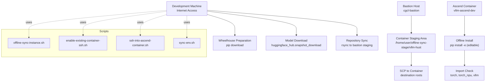
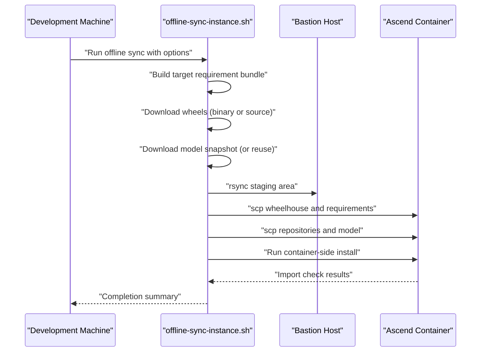
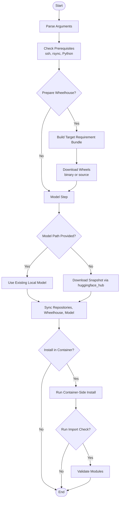
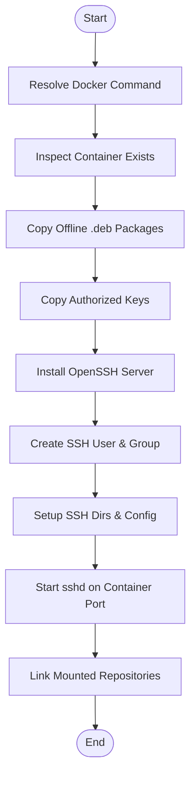
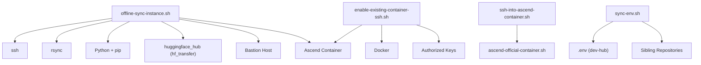

# Offline Development Setup

<cite>
**Referenced Files in This Document**
- [offline-sync-instance.sh](file://scripts/offline-sync-instance.sh)
- [enable-existing-container-ssh.sh](file://scripts/enable-existing-container-ssh.sh)
- [ssh-into-ascend-container.sh](file://scripts/ssh-into-ascend-container.sh)
- [sync-env.sh](file://scripts/sync-env.sh)
- [README.md](file://README.md)
- [train8-container-quickstart.md](file://docs/train8-container-quickstart.md)
</cite>

## Table of Contents
1. [Introduction](#introduction)
2. [Project Structure](#project-structure)
3. [Core Components](#core-components)
4. [Architecture Overview](#architecture-overview)
5. [Detailed Component Analysis](#detailed-component-analysis)
6. [Dependency Analysis](#dependency-analysis)
7. [Performance Considerations](#performance-considerations)
8. [Troubleshooting Guide](#troubleshooting-guide)
9. [Conclusion](#conclusion)
10. [Appendices](#appendices)

## Introduction
This document explains how to set up and maintain an offline development environment using the offline-sync-instance.sh script. It covers the complete workflow for preparing offline wheels and assets without public network access, the bastion host architecture, SSH tunneling setup, and container synchronization. It also documents configuration options such as TARGET_PLATFORM, TARGET_PYTHON_VERSION, and others, and provides step-by-step examples for model-only sync, wheelhouse preparation, and full offline environment setup. Finally, it addresses common issues and offers best practices for reliable offline development.

## Project Structure
The offline development workflow centers around a small set of scripts and documentation:
- scripts/offline-sync-instance.sh: orchestrates wheelhouse preparation, model download, repository sync, and container-side installation.
- scripts/enable-existing-container-ssh.sh: enables SSH access on an already-running container and mounts repositories for direct access.
- scripts/ssh-into-ascend-container.sh: convenience wrapper to SSH into the Ascend container.
- scripts/sync-env.sh: propagates a canonical .env file across sibling repositories.
- docs/train8-container-quickstart.md: official guide for container lifecycle, SSH configuration, and troubleshooting.
- README.md: high-level overview and pointers to scripts.

**Diagram sources**
- [offline-sync-instance.sh:128-198](file://scripts/offline-sync-instance.sh#L128-L198)
- [offline-sync-instance.sh:242-292](file://scripts/offline-sync-instance.sh#L242-L292)
- [offline-sync-instance.sh:657-733](file://scripts/offline-sync-instance.sh#L657-L733)
- [enable-existing-container-ssh.sh:58-172](file://scripts/enable-existing-container-ssh.sh#L58-L172)
- [ssh-into-ascend-container.sh:1-14](file://scripts/ssh-into-ascend-container.sh#L1-L14)

**Section sources**
- [README.md:242-272](file://README.md#L242-L272)
- [train8-container-quickstart.md:131-161](file://docs/train8-container-quickstart.md#L131-L161)

## Core Components
- offline-sync-instance.sh
  - Prepares a target wheelhouse for a specific platform and Python ABI.
  - Downloads a Hugging Face model snapshot locally or reuses an existing directory.
  - Syncs local repositories, wheelhouse, and model into the container via a bastion host.
  - Installs local repositories in the container’s conda environment without public network access.
  - Provides granular toggles to skip model sync, wheelhouse preparation, repository sync, container install, or import checks.
- enable-existing-container-ssh.sh
  - Enables SSH access on an existing container, installs OpenSSH server if needed, and sets up user accounts and authorized keys.
  - Creates symbolic links to mounted repositories under the SSH user’s home for convenient access.
- ssh-into-ascend-container.sh
  - Convenience launcher to enter the Ascend container shell using the official container script.
- sync-env.sh
  - Propagates a canonical .env file across sibling repositories, copying or patching token lines as needed.

**Section sources**
- [offline-sync-instance.sh:128-198](file://scripts/offline-sync-instance.sh#L128-L198)
- [offline-sync-instance.sh:315-341](file://scripts/offline-sync-instance.sh#L315-L341)
- [offline-sync-instance.sh:510-543](file://scripts/offline-sync-instance.sh#L510-L543)
- [offline-sync-instance.sh:550-614](file://scripts/offline-sync-instance.sh#L550-L614)
- [offline-sync-instance.sh:625-655](file://scripts/offline-sync-instance.sh#L625-L655)
- [offline-sync-instance.sh:657-733](file://scripts/offline-sync-instance.sh#L657-L733)
- [enable-existing-container-ssh.sh:58-172](file://scripts/enable-existing-container-ssh.sh#L58-L172)
- [ssh-into-ascend-container.sh:1-14](file://scripts/ssh-into-ascend-container.sh#L1-L14)
- [sync-env.sh:1-129](file://scripts/sync-env.sh#L1-L129)

## Architecture Overview
The offline workflow relies on a bastion host as a bridge between an internet-connected development machine and an air-gapped container. The script orchestrates:
- Local preparation: wheelhouse generation and model snapshot retrieval.
- Staging: rsync to a staging area on the bastion host.
- Delivery: SCP from bastion staging into the container’s asset and model roots.
- Installation: offline pip install of wheels and editable local repositories inside the container’s conda environment.

**Diagram sources**
- [offline-sync-instance.sh:735-761](file://scripts/offline-sync-instance.sh#L735-L761)
- [offline-sync-instance.sh:242-292](file://scripts/offline-sync-instance.sh#L242-L292)
- [offline-sync-instance.sh:657-733](file://scripts/offline-sync-instance.sh#L657-L733)

**Section sources**
- [README.md:242-272](file://README.md#L242-L272)
- [train8-container-quickstart.md:131-161](file://docs/train8-container-quickstart.md#L131-L161)

## Detailed Component Analysis

### offline-sync-instance.sh: Orchestration and Options
- Environment variables and defaults
  - TARGET_PLATFORM, TARGET_PYTHON_VERSION, TARGET_ABI, TARGET_IMPLEMENTATION, TARGET_PLATFORM_MACHINE, TARGET_SYS_PLATFORM, TARGET_PYTHON_FULL_VERSION, TARGET_PYTHON_VERSION_DOTTED
  - CACHE_ROOT, ARTIFACT_NAME, ARTIFACT_ROOT, WHEELHOUSE_DIR, REQUIREMENT_BUNDLE, MODEL_STAGE_ROOT
  - BASTION_ALIAS, BASTION_STAGE_ROOT, CONTAINER_HOST, CONTAINER_PORT, CONTAINER_USER, CONTAINER_WORKSPACE_ROOT, CONTAINER_ENV_NAME, CONTAINER_ASSET_ROOT, CONTAINER_MODEL_ROOT
  - MODEL_ID, MODEL_REVISION, MODEL_LOCAL_PATH, MODEL_ALLOW_PATTERNS, MODEL_IGNORE_PATTERNS
  - Flags: SYNC_MODEL, SYNC_REPOS, PREPARE_WHEELHOUSE, INSTALL_IN_CONTAINER, RUN_IMPORT_CHECK, AUTO_YES
  - LOCAL_REPOS: list of sibling repositories to sync
- Command-line options
  - Model options: --model-id, --model-revision, --model-path, --model-allow, --model-ignore, --skip-model
  - Workflow options: --skip-wheelhouse, --skip-repos, --skip-install, --skip-import-check, --artifact-root, --container-asset-root, --container-model-root, --env-name, -y, -h
- Functions and responsibilities
  - Argument parsing and help
  - SSH argument builders for bastion and container
  - rsync-based staging and SCP delivery to container
  - Wheelhouse preparation: builds a target requirement bundle and downloads wheels for the specified platform/ABI
  - Model download: uses huggingface_hub.snapshot_download with hf_transfer and pattern filters
  - Repository sync: excludes build caches and git metadata
  - Container-side install: activates conda environment, installs wheels and editable local repos, optionally validates imports
- Control flow
  - Validates prerequisites (ssh, rsync, Python)
  - Optionally prepares wheelhouse and/or downloads model
  - Syncs repositories, wheelhouse, and model into the container
  - Runs container-side install and optional import check

**Diagram sources**
- [offline-sync-instance.sh:128-198](file://scripts/offline-sync-instance.sh#L128-L198)
- [offline-sync-instance.sh:315-341](file://scripts/offline-sync-instance.sh#L315-L341)
- [offline-sync-instance.sh:510-543](file://scripts/offline-sync-instance.sh#L510-L543)
- [offline-sync-instance.sh:550-614](file://scripts/offline-sync-instance.sh#L550-L614)
- [offline-sync-instance.sh:625-655](file://scripts/offline-sync-instance.sh#L625-L655)
- [offline-sync-instance.sh:657-733](file://scripts/offline-sync-instance.sh#L657-L733)
- [offline-sync-instance.sh:735-761](file://scripts/offline-sync-instance.sh#L735-L761)

**Section sources**
- [offline-sync-instance.sh:10-56](file://scripts/offline-sync-instance.sh#L10-L56)
- [offline-sync-instance.sh:67-103](file://scripts/offline-sync-instance.sh#L67-L103)
- [offline-sync-instance.sh:128-198](file://scripts/offline-sync-instance.sh#L128-L198)
- [offline-sync-instance.sh:207-240](file://scripts/offline-sync-instance.sh#L207-L240)
- [offline-sync-instance.sh:242-292](file://scripts/offline-sync-instance.sh#L242-L292)
- [offline-sync-instance.sh:315-341](file://scripts/offline-sync-instance.sh#L315-L341)
- [offline-sync-instance.sh:343-481](file://scripts/offline-sync-instance.sh#L343-L481)
- [offline-sync-instance.sh:483-508](file://scripts/offline-sync-instance.sh#L483-L508)
- [offline-sync-instance.sh:510-543](file://scripts/offline-sync-instance.sh#L510-L543)
- [offline-sync-instance.sh:545-548](file://scripts/offline-sync-instance.sh#L545-L548)
- [offline-sync-instance.sh:550-614](file://scripts/offline-sync-instance.sh#L550-L614)
- [offline-sync-instance.sh:616-623](file://scripts/offline-sync-instance.sh#L616-L623)
- [offline-sync-instance.sh:625-655](file://scripts/offline-sync-instance.sh#L625-L655)
- [offline-sync-instance.sh:657-733](file://scripts/offline-sync-instance.sh#L657-L733)
- [offline-sync-instance.sh:735-761](file://scripts/offline-sync-instance.sh#L735-L761)

### enable-existing-container-ssh.sh: Enabling SSH on a Running Container
- Detects Docker availability and resolves the docker command.
- Copies offline Debian packages into the container if provided.
- Copies authorized_keys into the container and configures SSH server.
- Creates the SSH user and group matching host ownership, sets up SSH directories, and starts sshd.
- Creates symbolic links to mounted repositories under the SSH user’s home.

**Diagram sources**
- [enable-existing-container-ssh.sh:58-172](file://scripts/enable-existing-container-ssh.sh#L58-L172)

**Section sources**
- [enable-existing-container-ssh.sh:18-25](file://scripts/enable-existing-container-ssh.sh#L18-L25)
- [enable-existing-container-ssh.sh:27-57](file://scripts/enable-existing-container-ssh.sh#L27-L57)
- [enable-existing-container-ssh.sh:58-172](file://scripts/enable-existing-container-ssh.sh#L58-L172)

### ssh-into-ascend-container.sh: Convenience Wrapper
- Sets environment variables and invokes the official container script to enter the shell.

**Section sources**
- [ssh-into-ascend-container.sh:1-14](file://scripts/ssh-into-ascend-container.sh#L1-L14)

### sync-env.sh: Propagating Canonical .env Across Repositories
- Defines token keys managed by the dev-hub .env.
- Lists full-copy and merge targets.
- Compares and optionally copies or patches .env files across repositories.

**Section sources**
- [sync-env.sh:1-129](file://scripts/sync-env.sh#L1-L129)

## Dependency Analysis
- offline-sync-instance.sh depends on:
  - ssh and rsync being available on the development machine.
  - Python and pip for wheelhouse preparation and model download.
  - huggingface_hub with hf_transfer for efficient model downloads.
  - A running container with an accessible SSH daemon behind a bastion host.
- enable-existing-container-ssh.sh depends on:
  - Docker availability and permissions.
  - Authorized keys presence and optional offline .deb packages for SSH server installation.
- ssh-into-ascend-container.sh depends on:
  - The official container script and environment variables controlling container identity and SSH port.
- sync-env.sh depends on:
  - Presence of the dev-hub .env and target repository directories.

**Diagram sources**
- [offline-sync-instance.sh:740-743](file://scripts/offline-sync-instance.sh#L740-L743)
- [offline-sync-instance.sh:545-548](file://scripts/offline-sync-instance.sh#L545-L548)
- [enable-existing-container-ssh.sh:27-57](file://scripts/enable-existing-container-ssh.sh#L27-L57)
- [ssh-into-ascend-container.sh:12-14](file://scripts/ssh-into-ascend-container.sh#L12-L14)
- [sync-env.sh:14-52](file://scripts/sync-env.sh#L14-L52)

**Section sources**
- [offline-sync-instance.sh:740-743](file://scripts/offline-sync-instance.sh#L740-L743)
- [offline-sync-instance.sh:545-548](file://scripts/offline-sync-instance.sh#L545-L548)
- [enable-existing-container-ssh.sh:27-57](file://scripts/enable-existing-container-ssh.sh#L27-L57)
- [ssh-into-ascend-container.sh:12-14](file://scripts/ssh-into-ascend-container.sh#L12-L14)
- [sync-env.sh:14-52](file://scripts/sync-env.sh#L14-L52)

## Performance Considerations
- Wheelhouse preparation
  - Prefer binary wheels for the target platform to minimize build time and disk usage.
  - Use hf_transfer for faster model downloads when available.
- Synchronization
  - rsync with progress reporting reduces uncertainty during large transfers.
  - Exclude unnecessary caches and build artifacts to reduce transfer volume.
- Container-side install
  - Installing wheels first, then editable repositories, reduces repeated dependency resolution.
  - Disabling build isolation for editable installs can speed up development iteration.

[No sources needed since this section provides general guidance]

## Troubleshooting Guide
- Network connectivity problems
  - Ensure ssh and rsync are available on the development machine.
  - Verify bastion host reachability and that the container SSH port is accessible via the bastion alias.
  - Confirm that the container’s SSH daemon is running and listening on the expected port.
- Permission issues
  - The container SSH user must match the host workspace ownership to avoid write permission errors.
  - Authorized keys must be readable and properly placed under the SSH user’s home directory.
- Synchronization failures
  - Check that the staging directory exists and is writable on the bastion host.
  - Validate that the destination paths in the container are writable and that sufficient disk space is available.
- Import validation failures
  - Ensure the conda environment exists and contains torch and torch_npu.
  - Confirm that editable installs completed successfully and that import checks are not suppressed unintentionally.
- Container SSH setup issues
  - If OpenSSH server installation fails, provide offline .deb packages via the OFFLINE_DEB_DIR variable.
  - Verify that the container’s SSH port is not blocked by firewall rules or conflicting processes.

**Section sources**
- [offline-sync-instance.sh:740-743](file://scripts/offline-sync-instance.sh#L740-L743)
- [offline-sync-instance.sh:657-733](file://scripts/offline-sync-instance.sh#L657-L733)
- [enable-existing-container-ssh.sh:89-118](file://scripts/enable-existing-container-ssh.sh#L89-L118)
- [enable-existing-container-ssh.sh:120-148](file://scripts/enable-existing-container-ssh.sh#L120-L148)
- [train8-container-quickstart.md:264-290](file://docs/train8-container-quickstart.md#L264-L290)

## Conclusion
The offline development workflow leverages a bastion host and SSH tunneling to securely deliver wheels, models, and repositories into an air-gapped container. By configuring environment variables appropriately and using the provided scripts, teams can reliably prepare and deploy offline environments tailored to specific platforms and Python versions. Following the troubleshooting and best practices outlined here will help maintain a robust offline development pipeline.

[No sources needed since this section summarizes without analyzing specific files]

## Appendices

### Step-by-Step Examples

- Model-only sync
  - Prepare a wheelhouse for the target platform and Python version.
  - Download a model snapshot locally or reuse an existing directory.
  - Sync only the model into the container and skip wheelhouse and repository sync.
  - Run container-side install and import checks.
  - Example invocation:
    - [offline-sync-instance.sh:95-102](file://scripts/offline-sync-instance.sh#L95-L102)

- Wheelhouse preparation
  - Build the target requirement bundle and download wheels for the specified platform and ABI.
  - Store wheels and requirements in the artifact root.
  - Example invocation:
    - [offline-sync-instance.sh:735-761](file://scripts/offline-sync-instance.sh#L735-L761)

- Full offline environment setup
  - Prepare wheelhouse, download model, sync repositories, wheelhouse, and model.
  - Install editable local repositories and validate imports inside the container.
  - Example invocation:
    - [offline-sync-instance.sh:242-292](file://scripts/offline-sync-instance.sh#L242-L292)
    - [offline-sync-instance.sh:657-733](file://scripts/offline-sync-instance.sh#L657-L733)

### Configuration Options Reference

- Target platform and Python
  - TARGET_PLATFORM: target platform tag (e.g., manylinux2014_aarch64)
  - TARGET_PYTHON_VERSION: numeric Python version (e.g., 310)
  - TARGET_ABI: ABI tag (e.g., cp310)
  - TARGET_IMPLEMENTATION: implementation identifier (e.g., cp)
  - TARGET_PLATFORM_MACHINE: machine architecture (e.g., aarch64)
  - TARGET_SYS_PLATFORM: sys.platform value (e.g., linux)
  - TARGET_PLATFORM_SYSTEM: platform.system value (e.g., Linux)
  - TARGET_PYTHON_FULL_VERSION: full Python version (e.g., 3.10.20)
  - TARGET_PYTHON_VERSION_DOTTED: dotted Python version (e.g., 3.10)

- Artifact and cache
  - CACHE_ROOT: base cache directory for offline artifacts
  - ARTIFACT_NAME: artifact name used to construct ARTIFACT_ROOT
  - ARTIFACT_ROOT: root directory for offline artifacts
  - WHEELHOUSE_DIR: directory for downloaded wheels
  - REQUIREMENT_BUNDLE: consolidated requirements file for the target
  - MODEL_STAGE_ROOT: local staging directory for model snapshots

- Bastion and container
  - BASTION_ALIAS: bastion host alias used for SSH
  - BASTION_STAGE_ROOT: staging root on the bastion host
  - CONTAINER_HOST: container IP or hostname
  - CONTAINER_PORT: container SSH port
  - CONTAINER_USER: container SSH user
  - CONTAINER_WORKSPACE_ROOT: workspace root inside the container
  - CONTAINER_ENV_NAME: conda environment name inside the container
  - CONTAINER_ASSET_ROOT: destination root for offline assets
  - CONTAINER_MODEL_ROOT: destination root for models

- Model options
  - MODEL_ID: Hugging Face model repository ID
  - MODEL_REVISION: optional model revision
  - MODEL_LOCAL_PATH: reuse an existing local model directory
  - MODEL_ALLOW_PATTERNS: comma-separated allow patterns for snapshot download
  - MODEL_IGNORE_PATTERNS: comma-separated ignore patterns for snapshot download

- Workflow flags
  - SYNC_MODEL, SYNC_REPOS, PREPARE_WHEELHOUSE, INSTALL_IN_CONTAINER, RUN_IMPORT_CHECK, AUTO_YES

- Environment variables for container SSH setup
  - CONTAINER_NAME: container name to operate on
  - HOST_WORKSPACE_ROOT: host workspace root path
  - CONTAINER_WORKSPACE_ROOT: container workspace root path
  - SSH_USER: SSH user to create and configure
  - SSH_PORT: SSH port to expose
  - AUTHORIZED_KEYS_SOURCE: path to authorized_keys on host
  - OFFLINE_DEB_DIR: directory containing offline .deb packages for SSH server installation

**Section sources**
- [offline-sync-instance.sh:10-56](file://scripts/offline-sync-instance.sh#L10-L56)
- [offline-sync-instance.sh:128-198](file://scripts/offline-sync-instance.sh#L128-L198)
- [offline-sync-instance.sh:315-341](file://scripts/offline-sync-instance.sh#L315-L341)
- [offline-sync-instance.sh:545-548](file://scripts/offline-sync-instance.sh#L545-L548)
- [offline-sync-instance.sh:550-614](file://scripts/offline-sync-instance.sh#L550-L614)
- [offline-sync-instance.sh:625-655](file://scripts/offline-sync-instance.sh#L625-L655)
- [offline-sync-instance.sh:657-733](file://scripts/offline-sync-instance.sh#L657-L733)
- [enable-existing-container-ssh.sh:10-16](file://scripts/enable-existing-container-ssh.sh#L10-L16)
- [enable-existing-container-ssh.sh:58-172](file://scripts/enable-existing-container-ssh.sh#L58-L172)