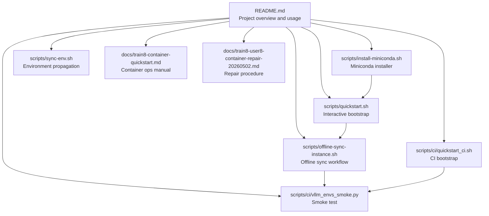
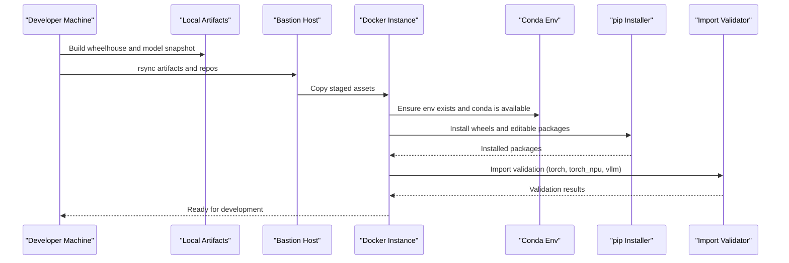
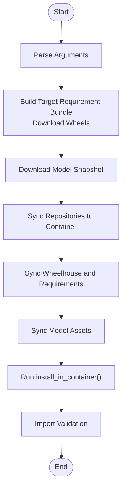
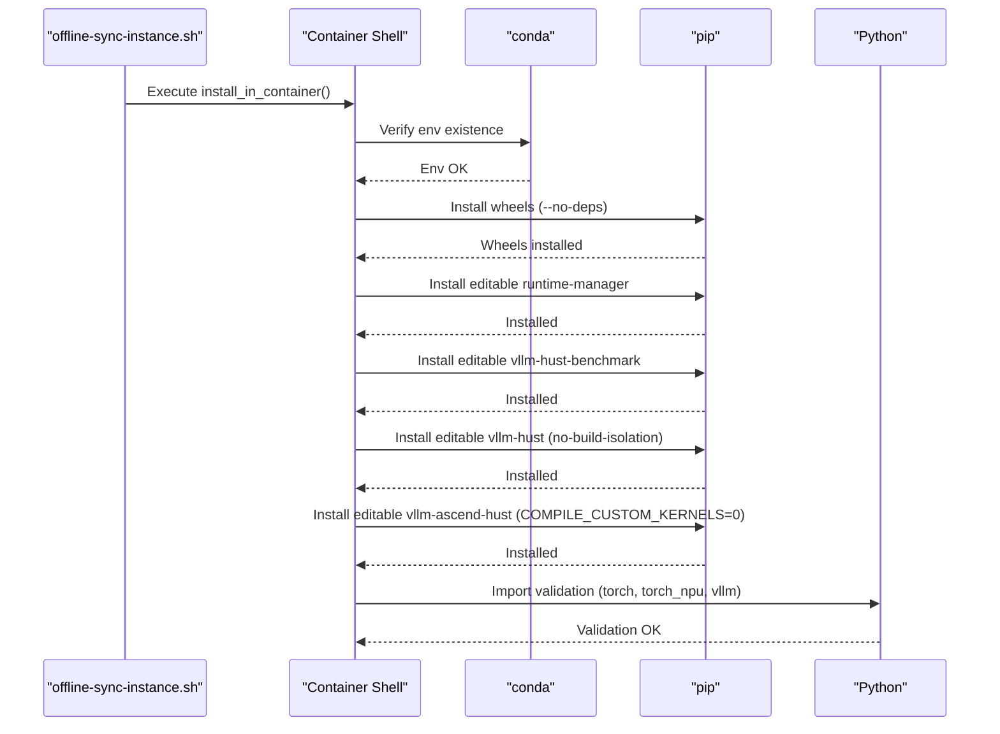
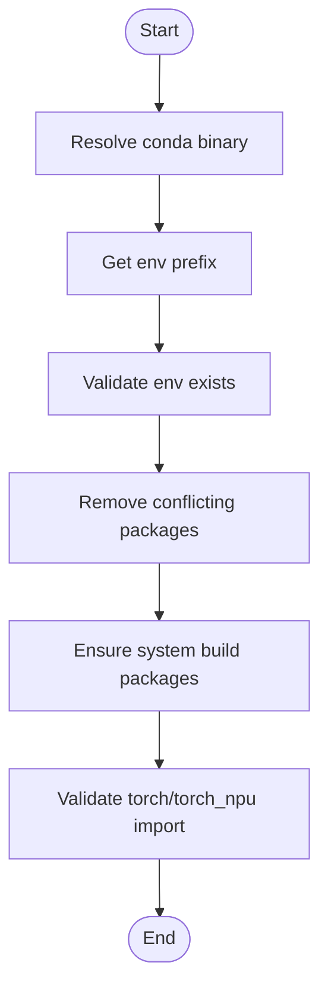
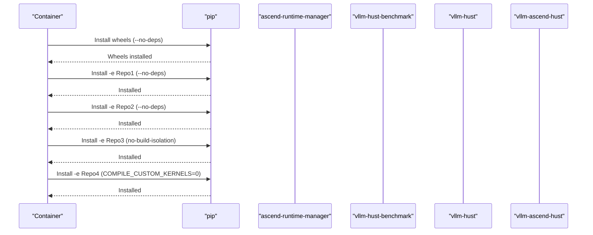
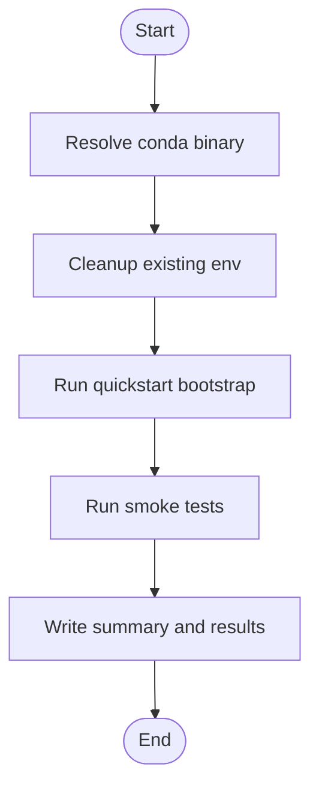
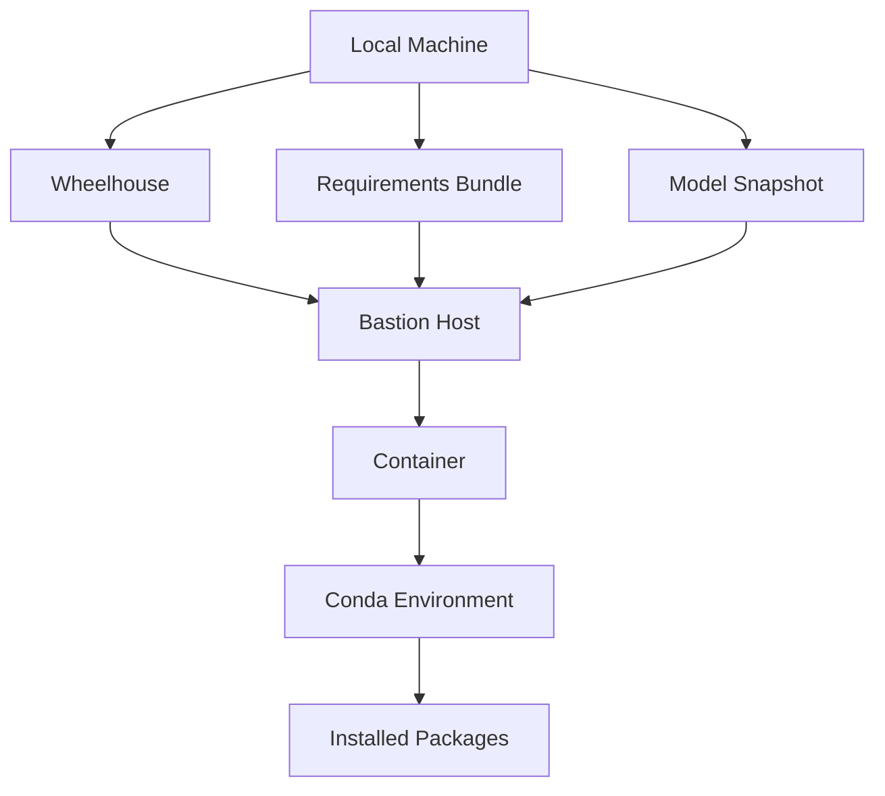

# Offline Installation and Troubleshooting

<cite>
**Referenced Files in This Document**
- [README.md](file://README.md)
- [scripts/install-miniconda.sh](file://scripts/install-miniconda.sh)
- [scripts/quickstart.sh](file://scripts/quickstart.sh)
- [scripts/offline-sync-instance.sh](file://scripts/offline-sync-instance.sh)
- [scripts/sync-env.sh](file://scripts/sync-env.sh)
- [scripts/ci/quickstart_ci.sh](file://scripts/ci/quickstart_ci.sh)
- [scripts/ci/vllm_envs_smoke.py](file://scripts/ci/vllm_envs_smoke.py)
- [docs/train8-container-quickstart.md](file://docs/train8-container-quickstart.md)
- [docs/train8-user8-container-repair-20260502.md](file://docs/train8-user8-container-repair-20260502.md)
</cite>

## Table of Contents
1. [Introduction](#introduction)
2. [Project Structure](#project-structure)
3. [Core Components](#core-components)
4. [Architecture Overview](#architecture-overview)
5. [Detailed Component Analysis](#detailed-component-analysis)
6. [Dependency Analysis](#dependency-analysis)
7. [Performance Considerations](#performance-considerations)
8. [Troubleshooting Guide](#troubleshooting-guide)
9. [Conclusion](#conclusion)
10. [Appendices](#appendices)

## Introduction
This document provides comprehensive troubleshooting guidance for offline installation and common issues in offline development environments. It focuses on the offline synchronization workflow, conda environment validation, and package installation procedures. It covers common installation failures such as missing dependencies, version conflicts, and environment setup issues. It also includes troubleshooting for import validation failures, model loading problems, and repository installation errors. Container-specific issues like conda path resolution, environment activation problems, and custom kernel compilation failures are addressed. Finally, it provides diagnostic commands, log analysis techniques, and recovery procedures for failed installations.

## Project Structure
The repository includes a set of scripts and documentation that collectively support offline installation and containerized development. The key components are:
- Miniconda installation helper for user-space environments
- Interactive bootstrap script for cloning repositories, setting up conda environments, and container workflows
- Offline synchronization script for preparing wheels and models and installing them inside a container without public network access
- CI scripts for automated environment bootstrapping and smoke testing
- Documentation for container deployment and repair procedures

**Diagram sources**
- [README.md:1-288](file://README.md#L1-L288)
- [scripts/install-miniconda.sh:1-169](file://scripts/install-miniconda.sh#L1-L169)
- [scripts/quickstart.sh:1-2732](file://scripts/quickstart.sh#L1-L2732)
- [scripts/offline-sync-instance.sh:1-763](file://scripts/offline-sync-instance.sh#L1-L763)
- [scripts/sync-env.sh:1-129](file://scripts/sync-env.sh#L1-L129)
- [scripts/ci/quickstart_ci.sh:1-321](file://scripts/ci/quickstart_ci.sh#L1-L321)
- [scripts/ci/vllm_envs_smoke.py:1-69](file://scripts/ci/vllm_envs_smoke.py#L1-L69)
- [docs/train8-container-quickstart.md:1-404](file://docs/train8-container-quickstart.md#L1-L404)
- [docs/train8-user8-container-repair-20260502.md:1-222](file://docs/train8-user8-container-repair-20260502.md#L1-L222)

**Section sources**
- [README.md:1-288](file://README.md#L1-L288)

## Core Components
- Miniconda installer: Installs Miniconda into the user’s home directory, detects platform, validates prefix usability, and supports non-interactive mode.
- Quickstart bootstrap: Interactive one-command bootstrap that clones repositories, sets up conda environments, and supports container workflows including SSH configuration and environment activation hooks.
- Offline synchronization: Prepares offline wheels and models locally, syncs them into a container via bastion host, and installs local repositories inside the container without public network access.
- CI bootstrap: Automated CI environment setup that resolves conda, cleans up environments, and runs smoke tests.
- Environment propagation: Synchronizes token configurations across sibling repositories.

**Section sources**
- [scripts/install-miniconda.sh:1-169](file://scripts/install-miniconda.sh#L1-L169)
- [scripts/quickstart.sh:1-2732](file://scripts/quickstart.sh#L1-L2732)
- [scripts/offline-sync-instance.sh:1-763](file://scripts/offline-sync-instance.sh#L1-L763)
- [scripts/ci/quickstart_ci.sh:1-321](file://scripts/ci/quickstart_ci.sh#L1-L321)
- [scripts/sync-env.sh:1-129](file://scripts/sync-env.sh#L1-L129)

## Architecture Overview
The offline installation pipeline integrates local artifact preparation with container-side installation and validation. The high-level flow is:
- Prepare offline artifacts (wheels and model snapshots) on a machine with internet access
- Sync artifacts and repositories into the container through a bastion host
- Install packages inside the container’s conda environment
- Run import validation to confirm successful installation

**Diagram sources**
- [scripts/offline-sync-instance.sh:657-733](file://scripts/offline-sync-instance.sh#L657-L733)

## Detailed Component Analysis

### Offline Installation Workflow
The offline installation workflow is encapsulated in the offline synchronization script. It performs the following steps:
- Parse arguments and configure targets (model, repos, wheelhouse, container paths)
- Prepare wheelhouse and model snapshot locally
- Sync repositories and artifacts into the container via bastion host
- Install packages inside the container’s conda environment
- Run import validation to ensure packages are importable

**Diagram sources**
- [scripts/offline-sync-instance.sh:735-763](file://scripts/offline-sync-instance.sh#L735-L763)

**Section sources**
- [scripts/offline-sync-instance.sh:657-733](file://scripts/offline-sync-instance.sh#L657-L733)

### install_in_container Function Workflow
The install_in_container function orchestrates the container-side installation:
- Ensures conda executable exists and symlinks miniconda if needed
- Verifies the target conda environment exists
- Installs offline wheels and editable packages for runtime manager, benchmark, vllm-hust, and vllm-ascend-hust
- Runs import validation for torch, torch_npu, and vllm

**Diagram sources**
- [scripts/offline-sync-instance.sh:657-733](file://scripts/offline-sync-instance.sh#L657-L733)

**Section sources**
- [scripts/offline-sync-instance.sh:657-733](file://scripts/offline-sync-instance.sh#L657-L733)

### Conda Environment Validation
The quickstart script provides robust conda environment validation and setup:
- Resolves conda binary and environment prefix
- Validates environment presence and Python binary path
- Removes conflicting packages (e.g., pytorch variants)
- Ensures system build packages are present for compiling C/C++ extensions
- Runs import validation for torch and torch_npu
- Manages environment activation hooks and channel mirrors

**Diagram sources**
- [scripts/quickstart.sh:278-376](file://scripts/quickstart.sh#L278-L376)
- [scripts/quickstart.sh:719-726](file://scripts/quickstart.sh#L719-L726)

**Section sources**
- [scripts/quickstart.sh:278-376](file://scripts/quickstart.sh#L278-L376)
- [scripts/quickstart.sh:719-726](file://scripts/quickstart.sh#L719-L726)

### Package Installation Procedures
The offline synchronization script installs packages in a specific order:
- Wheels from the wheelhouse directory
- Editable installs for runtime manager and benchmark
- Editable installs for vllm-hust and vllm-ascend-hust with custom kernel compilation disabled

**Diagram sources**
- [scripts/offline-sync-instance.sh:695-714](file://scripts/offline-sync-instance.sh#L695-L714)

**Section sources**
- [scripts/offline-sync-instance.sh:695-714](file://scripts/offline-sync-instance.sh#L695-L714)

### CI Bootstrap and Smoke Testing
The CI bootstrap script automates environment creation and smoke testing:
- Resolves conda binary and cleans up existing environments
- Runs quickstart with clone, conda, and install actions
- Executes smoke tests for Python, CLI, runtime, and benchmark suites
- Writes structured results and summaries

**Diagram sources**
- [scripts/ci/quickstart_ci.sh:232-321](file://scripts/ci/quickstart_ci.sh#L232-L321)

**Section sources**
- [scripts/ci/quickstart_ci.sh:232-321](file://scripts/ci/quickstart_ci.sh#L232-L321)

## Dependency Analysis
The offline installation depends on:
- Local wheelhouse and requirements bundle
- Container-side conda environment availability
- Accessible bastion host for artifact transfer
- Editable installs for local repositories

**Diagram sources**
- [scripts/offline-sync-instance.sh:343-543](file://scripts/offline-sync-instance.sh#L343-L543)
- [scripts/offline-sync-instance.sh:657-733](file://scripts/offline-sync-instance.sh#L657-L733)

**Section sources**
- [scripts/offline-sync-instance.sh:343-543](file://scripts/offline-sync-instance.sh#L343-L543)
- [scripts/offline-sync-instance.sh:657-733](file://scripts/offline-sync-instance.sh#L657-L733)

## Performance Considerations
- Parallelism: The offline synchronization script supports configurable parallelism for repository cloning via an environment variable.
- Artifact preparation: Preparing wheels for the target platform reduces runtime compilation overhead.
- Logging: Timestamped logs are written to a cache directory for diagnostics and performance analysis.

[No sources needed since this section provides general guidance]

## Troubleshooting Guide

### Common Installation Failures
- Missing dependencies
  - Ensure system build packages are installed for compiling C/C++ extensions.
  - Verify required system packages are present before running conda operations.
  - Reference: [scripts/quickstart.sh:144-189](file://scripts/quickstart.sh#L144-L189)

- Version conflicts
  - Remove conflicting packages (e.g., pytorch variants) before installing.
  - Force reinstall the Python stack to align torch and torch-npu versions.
  - Reference: [scripts/quickstart.sh:322-341](file://scripts/quickstart.sh#L322-L341), [scripts/quickstart.sh:754-769](file://scripts/quickstart.sh#L754-L769)

- Environment setup issues
  - Validate conda environment presence and Python binary path.
  - Ensure environment activation hooks are configured correctly.
  - Reference: [scripts/quickstart.sh:297-313](file://scripts/quickstart.sh#L297-L313), [scripts/quickstart.sh:359-376](file://scripts/quickstart.sh#L359-L376)

### Import Validation Failures
- Torch/torch_npu import validation
  - If import validation fails, reconcile the Ascend runtime and force reinstall the Python stack.
  - Reference: [scripts/quickstart.sh:771-793](file://scripts/quickstart.sh#L771-L793)

- Platform plugin validation
  - Ensure the Ascend platform plugin is installed and discoverable.
  - Reference: [scripts/quickstart.sh:795-806](file://scripts/quickstart.sh#L795-L806)

### Model Loading Problems
- Model snapshot preparation
  - Use the offline synchronization script to download and stage model snapshots locally.
  - Reference: [scripts/offline-sync-instance.sh:550-614](file://scripts/offline-sync-instance.sh#L550-L614)

- Model asset sync
  - Ensure model assets are synced into the container and accessible at the expected path.
  - Reference: [scripts/offline-sync-instance.sh:648-655](file://scripts/offline-sync-instance.sh#L648-L655)

### Repository Installation Errors
- Editable installs
  - Ensure editable installs are performed with appropriate flags to avoid build isolation issues.
  - Reference: [scripts/offline-sync-instance.sh:702-714](file://scripts/offline-sync-instance.sh#L702-L714)

- Requirements bundle
  - Verify the requirements bundle is generated correctly for the target platform and Python version.
  - Reference: [scripts/offline-sync-instance.sh:343-481](file://scripts/offline-sync-instance.sh#L343-L481)

### Container-Specific Issues
- Conda path resolution
  - Ensure the conda executable is available in the container and linked correctly.
  - Reference: [scripts/offline-sync-instance.sh:680-693](file://scripts/offline-sync-instance.sh#L680-L693)

- Environment activation problems
  - Validate that the environment exists and is accessible inside the container.
  - Reference: [scripts/offline-sync-instance.sh:690-693](file://scripts/offline-sync-instance.sh#L690-L693)

- Custom kernel compilation failures
  - Disable custom kernel compilation when necessary and rely on hardware-accelerated operators.
  - Reference: [scripts/offline-sync-instance.sh:713-714](file://scripts/offline-sync-instance.sh#L713-L714)

### Diagnostic Commands and Log Analysis
- Container SSH connectivity
  - Check container status, SSH daemon, and port binding.
  - Reference: [docs/train8-container-quickstart.md:264-290](file://docs/train8-container-quickstart.md#L264-L290)

- NPU visibility and CANN version
  - Verify NPU devices and CANN version inside the container.
  - Reference: [docs/train8-container-quickstart.md:290-321](file://docs/train8-container-quickstart.md#L290-L321)

- HCCL and multi-card communication
  - Confirm host networking and driver paths for HCCL.
  - Reference: [docs/train8-container-quickstart.md:322-331](file://docs/train8-container-quickstart.md#L322-L331)

- Disk space and image pulls
  - Inspect disk usage and Docker system resources.
  - Reference: [docs/train8-container-quickstart.md:332-342](file://docs/train8-container-quickstart.md#L332-L342)

- Repair procedures
  - Follow documented repair steps for restoring SSH and aligning CANN versions.
  - Reference: [docs/train8-user8-container-repair-20260502.md:105-158](file://docs/train8-user8-container-repair-20260502.md#L105-L158)

### Recovery Procedures
- Clean up and retry
  - Use the CI bootstrap script to clean up environments and rerun the bootstrap.
  - Reference: [scripts/ci/quickstart_ci.sh:74-99](file://scripts/ci/quickstart_ci.sh#L74-L99)

- Rebuild container instances
  - Remove and recreate the container to restore a clean state.
  - Reference: [docs/train8-container-quickstart.md:344-354](file://docs/train8-container-quickstart.md#L344-L354)

- Restore from backups
  - Utilize documented backup and rollback procedures for container instances.
  - Reference: [docs/train8-user8-container-repair-20260502.md:107-118](file://docs/train8-user8-container-repair-20260502.md#L107-L118)

## Conclusion
This guide consolidates offline installation workflows, conda environment validation, and package installation procedures with practical troubleshooting steps. By following the documented sequences and using the provided diagnostic commands, teams can reliably deploy and maintain development environments in offline and containerized contexts.

## Appendices
- Environment propagation across repositories
  - Use the environment sync script to propagate token configurations consistently.
  - Reference: [scripts/sync-env.sh:1-129](file://scripts/sync-env.sh#L1-L129)

- CI smoke tests
  - Leverage the CI bootstrap script to validate environment readiness and package imports.
  - Reference: [scripts/ci/vllm_envs_smoke.py:1-69](file://scripts/ci/vllm_envs_smoke.py#L1-L69)