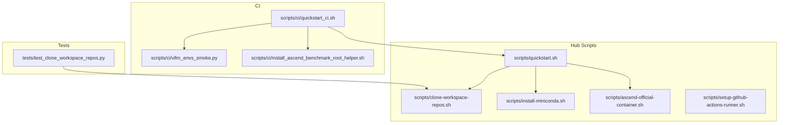
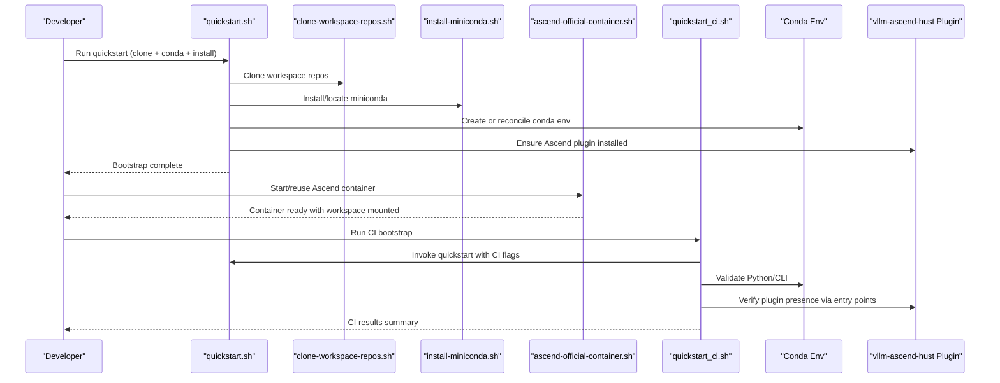
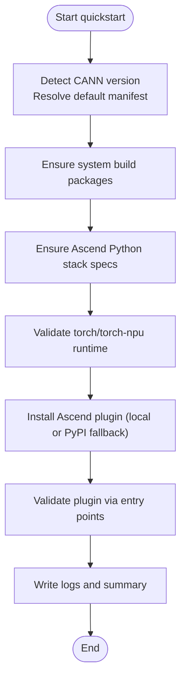
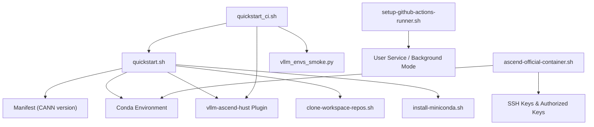

# Plugin Development

<cite>
**Referenced Files in This Document**
- [README.md](file://README.md)
- [ROADMAP.md](file://ROADMAP.md)
- [scripts/quickstart.sh](file://scripts/quickstart.sh)
- [scripts/clone-workspace-repos.sh](file://scripts/clone-workspace-repos.sh)
- [scripts/install-miniconda.sh](file://scripts/install-miniconda.sh)
- [scripts/ascend-official-container.sh](file://scripts/ascend-official-container.sh)
- [scripts/setup-github-actions-runner.sh](file://scripts/setup-github-actions-runner.sh)
- [scripts/ci/quickstart_ci.sh](file://scripts/ci/quickstart_ci.sh)
- [scripts/ci/vllm_envs_smoke.py](file://scripts/ci/vllm_envs_smoke.py)
- [scripts/ci/install_ascend_benchmark_root_helper.sh](file://scripts/ci/install_ascend_benchmark_root_helper.sh)
- [tests/test_clone_workspace_repos.py](file://tests/test_clone_workspace_repos.py)
</cite>

## Table of Contents
1. [Introduction](#introduction)
2. [Project Structure](#project-structure)
3. [Core Components](#core-components)
4. [Architecture Overview](#architecture-overview)
5. [Detailed Component Analysis](#detailed-component-analysis)
6. [Dependency Analysis](#dependency-analysis)
7. [Performance Considerations](#performance-considerations)
8. [Troubleshooting Guide](#troubleshooting-guide)
9. [Conclusion](#conclusion)
10. [Appendices](#appendices)

## Introduction
This document explains how to develop plugins within the VLLM-HUST Development Hub ecosystem. It focuses on the plugin architecture, extension points, and integration mechanisms exposed by the repository’s scripts and CI system. The hub provides:
- A bootstrap and environment setup pipeline (quickstart)
- Repository management (parallel cloning)
- Container orchestration (Ascend official container)
- CI/CD integration (self-hosted runners and CI smoke tests)
- Ascend platform plugin integration via the vllm-ascend-hust package

The goal is to guide developers in creating custom scripts that integrate with the existing workflow system, extend the quickstart with custom initialization steps, add new repository sources, and customize container configurations. It also covers plugin discovery, configuration loading, lifecycle management, packaging, distribution, versioning, testing, debugging, performance optimization, security, dependency management, and compatibility.

## Project Structure
The repository is organized around a set of Bash and Python scripts that implement the development workflow. Key areas:
- scripts/: Command-line helpers for bootstrapping, environment setup, container orchestration, CI, and GitHub Actions runner management
- scripts/ci/: CI-specific helpers and smoke tests
- tests/: Unit tests for repository cloning behavior
- docs/, Ascend-Machine/: Documentation and hardware-related materials
- Root README.md and ROADMAP.md: Project overview and roadmap

**Diagram sources**
- [scripts/quickstart.sh](file://scripts/quickstart.sh)
- [scripts/clone-workspace-repos.sh](file://scripts/clone-workspace-repos.sh)
- [scripts/install-miniconda.sh](file://scripts/install-miniconda.sh)
- [scripts/ascend-official-container.sh](file://scripts/ascend-official-container.sh)
- [scripts/setup-github-actions-runner.sh](file://scripts/setup-github-actions-runner.sh)
- [scripts/ci/quickstart_ci.sh](file://scripts/ci/quickstart_ci.sh)
- [scripts/ci/vllm_envs_smoke.py](file://scripts/ci/vllm_envs_smoke.py)
- [scripts/ci/install_ascend_benchmark_root_helper.sh](file://scripts/ci/install_ascend_benchmark_root_helper.sh)
- [tests/test_clone_workspace_repos.py](file://tests/test_clone_workspace_repos.py)

**Section sources**
- [README.md](file://README.md)
- [ROADMAP.md](file://ROADMAP.md)

## Core Components
This section outlines the core components relevant to plugin development and integration.

- Quickstart bootstrap and environment management
  - Orchestrates repository cloning, conda environment creation, editable installs, and Ascend runtime reconciliation
  - Provides environment hooks and logging for CI and interactive usage
  - Supports Ascend plugin installation and fallback to PyPI when local plugin is unavailable

- Repository management
  - Parallel cloning of workspace repositories with robust retry and fallback logic
  - SSH/HTTPS configuration and upstream synchronization
  - Extensible REPOS list for adding new sources

- Container orchestration
  - Ascend official container lifecycle management
  - SSH enablement, authorized keys handling, and workspace mounting
  - Optional relocation of Docker data-root for constrained environments

- CI/CD integration
  - CI-optimized quickstart runner with structured logging and results
  - Smoke tests validating environment imports and CLI availability
  - Plugin presence verification via entry points

- GitHub Actions runner management
  - Self-hosted runner installation, configuration, and service lifecycle
  - Background mode fallback when systemd user is unavailable

**Section sources**
- [scripts/quickstart.sh](file://scripts/quickstart.sh)
- [scripts/clone-workspace-repos.sh](file://scripts/clone-workspace-repos.sh)
- [scripts/ascend-official-container.sh](file://scripts/ascend-official-container.sh)
- [scripts/ci/quickstart_ci.sh](file://scripts/ci/quickstart_ci.sh)
- [scripts/ci/vllm_envs_smoke.py](file://scripts/ci/vllm_envs_smoke.py)
- [scripts/setup-github-actions-runner.sh](file://scripts/setup-github-actions-runner.sh)

## Architecture Overview
The plugin architecture centers on the quickstart pipeline and its integration points:
- Plugin discovery and validation occur via Python entry points
- Ascend platform plugin is integrated through the vllm-ascend-hust package
- CI validates plugin presence and runtime behavior
- Container orchestration integrates Ascend toolchain and environment

**Diagram sources**
- [scripts/quickstart.sh](file://scripts/quickstart.sh)
- [scripts/clone-workspace-repos.sh](file://scripts/clone-workspace-repos.sh)
- [scripts/install-miniconda.sh](file://scripts/install-miniconda.sh)
- [scripts/ascend-official-container.sh](file://scripts/ascend-official-container.sh)
- [scripts/ci/quickstart_ci.sh](file://scripts/ci/quickstart_ci.sh)

## Detailed Component Analysis

### Quickstart Pipeline and Plugin Discovery
The quickstart script orchestrates environment setup and plugin reconciliation:
- Detects CANN version and selects appropriate manifest for Ascend runtime stack
- Ensures system build packages and Python stack prerequisites
- Installs or reconciles Ascend Python stack and validates runtime
- Optionally installs the Ascend plugin from local checkout or PyPI fallback
- Validates plugin presence via Python entry points

**Diagram sources**
- [scripts/quickstart.sh](file://scripts/quickstart.sh)

**Section sources**
- [scripts/quickstart.sh](file://scripts/quickstart.sh)

### Repository Management Extension Points
The repository cloning script exposes extension points for adding new sources:
- REPOS array defines default repositories and protocols
- Upstream reference repos are isolated under reference-repos/
- SSH/HTTPS fallback and retry logic
- Parallel cloning with configurable concurrency

Guidelines for extending repository sources:
- Add entries to the REPOS array with relative path and URL
- Respect upstream reference isolation for comparison repos
- Use SSH URLs for fresh clones with HTTPS fallback when SSH auth is unavailable
- Configure CLONE_JOBS to balance speed and resource usage

**Section sources**
- [scripts/clone-workspace-repos.sh](file://scripts/clone-workspace-repos.sh)

### Container Orchestration and SSH Integration
The Ascend container script manages lifecycle and SSH access:
- Resolves docker command and handles sudo fallback
- Optionally relocates Docker data-root when constrained
- Prepares authorized keys and enables SSH on container start
- Mounts workspace and caches, aligns container user with mounted repos

Guidelines for customization:
- Adjust CONTAINER_NAME, HOST_WORKSPACE_ROOT, CONTAINER_WORKSPACE_ROOT, SHM_SIZE
- Control SSH enablement via environment variables
- Provide IMAGE override for pinned variants
- Use DEFAULT_CONTAINER_SSH_USER and DEFAULT_CONTAINER_SSH_PORT for access

**Section sources**
- [scripts/ascend-official-container.sh](file://scripts/ascend-official-container.sh)

### CI/CD Extensions and Plugin Validation
The CI runner integrates with quickstart and validates plugin presence:
- CI-optimized bootstrap with structured logs and results
- Smoke tests for Python interpreter and CLI resolution
- Runtime checks via hust-ascend-manager CLI
- Plugin presence verified via entry points for vllm.platform_plugins group

Guidelines for CI extensions:
- Extend quickstart_ci.sh with additional steps and JUnit XML reporting
- Use run_step and run_pytest_step helpers for consistent logging and artifact collection
- Gate plugin requirement checks on runner flavor or environment conditions

**Section sources**
- [scripts/ci/quickstart_ci.sh](file://scripts/ci/quickstart_ci.sh)
- [scripts/ci/vllm_envs_smoke.py](file://scripts/ci/vllm_envs_smoke.py)

### GitHub Actions Runner Management
Self-hosted runner installation and service lifecycle:
- Downloads runner binaries and configures user service
- Supports systemd user mode and background mode fallback
- Writes service unit and manages PID/log files
- Provides commands for start/stop/status/remove

Guidelines for runner customization:
- Set labels and groups for targeted job routing
- Configure work directory and runner directory
- Preserve proxy environment or strip it as needed
- Enable lingering for persistent sessions across logouts

**Section sources**
- [scripts/setup-github-actions-runner.sh](file://scripts/setup-github-actions-runner.sh)

## Dependency Analysis
The plugin development workflow depends on several layers:
- Conda environment management and Python stack reconciliation
- Ascend toolchain and runtime manifests
- Container runtime and SSH configuration
- CI environment and runner service management

**Diagram sources**
- [scripts/quickstart.sh](file://scripts/quickstart.sh)
- [scripts/clone-workspace-repos.sh](file://scripts/clone-workspace-repos.sh)
- [scripts/install-miniconda.sh](file://scripts/install-miniconda.sh)
- [scripts/ascend-official-container.sh](file://scripts/ascend-official-container.sh)
- [scripts/ci/quickstart_ci.sh](file://scripts/ci/quickstart_ci.sh)
- [scripts/ci/vllm_envs_smoke.py](file://scripts/ci/vllm_envs_smoke.py)
- [scripts/setup-github-actions-runner.sh](file://scripts/setup-github-actions-runner.sh)

**Section sources**
- [scripts/quickstart.sh](file://scripts/quickstart.sh)
- [scripts/ascend-official-container.sh](file://scripts/ascend-official-container.sh)
- [scripts/ci/quickstart_ci.sh](file://scripts/ci/quickstart_ci.sh)
- [scripts/setup-github-actions-runner.sh](file://scripts/setup-github-actions-runner.sh)

## Performance Considerations
- Parallel cloning: Tune CLONE_JOBS to balance throughput and resource contention
- System build packages: Ensure gcc/g++ and zlib are present to avoid rebuilds
- Conda operations: Isolate environment variables to minimize conflicts and warnings
- Container data-root relocation: Migrate Docker data-root to a larger volume when needed
- CI logging: Use structured logs and artifacts for faster diagnostics

[No sources needed since this section provides general guidance]

## Troubleshooting Guide
Common issues and resolutions:
- Host-mounted repo ownership: Git “dubious ownership” errors are auto-fixed by marking safe directories
- Miniconda prefix usability: Broken prefixes are backed up and reinstalled
- SSH key provisioning: Ensure authorized_keys sources exist or provide public keys via environment
- Conda environment drift: Isolate PYTHONPATH and preserve environment variables during operations
- CI cleanup: Conda environments are cleaned up on exit with structured results

**Section sources**
- [scripts/quickstart.sh](file://scripts/quickstart.sh)
- [scripts/clone-workspace-repos.sh](file://scripts/clone-workspace-repos.sh)
- [scripts/install-miniconda.sh](file://scripts/install-miniconda.sh)
- [scripts/ascend-official-container.sh](file://scripts/ascend-official-container.sh)
- [scripts/ci/quickstart_ci.sh](file://scripts/ci/quickstart_ci.sh)

## Conclusion
The VLLM-HUST Development Hub provides a robust foundation for plugin development through its modular scripts and CI/CD integration. Developers can extend the quickstart pipeline, add new repository sources, customize container configurations, and validate plugin presence in CI. By following the extension points and best practices outlined here, teams can build reliable, maintainable plugins that integrate seamlessly with the existing workflow.

[No sources needed since this section summarizes without analyzing specific files]

## Appendices

### A. Plugin Discovery Mechanism
- Ascend plugin presence is validated via Python entry points in the vllm.platform_plugins group
- CI runner checks for the “ascend” entry point and conditionally enforces plugin presence

**Section sources**
- [scripts/ci/quickstart_ci.sh](file://scripts/ci/quickstart_ci.sh)

### B. Configuration Loading and Lifecycle Management
- Environment variables drive behavior (e.g., HUST_DEV_HUB_UPDATE_BASHRC, HF_ENDPOINT auto-switch)
- Conda environment hooks manage activation/deactivation and preserve user settings
- Logging is centralized and can be directed to cache or custom locations

**Section sources**
- [scripts/quickstart.sh](file://scripts/quickstart.sh)

### C. Extending Quickstart with Custom Initialization Steps
- Add new steps to the quickstart pipeline by invoking helper functions or wrapping commands
- Use run_with_heartbeat for long-running tasks and sanitize LD_LIBRARY_PATH for system tools
- Integrate with conda run to ensure consistent environment execution

**Section sources**
- [scripts/quickstart.sh](file://scripts/quickstart.sh)

### D. Adding New Repository Sources
- Append entries to the REPOS array in clone-workspace-repos.sh
- Use SSH URLs for fresh clones with HTTPS fallback when SSH auth is unavailable
- Respect upstream reference isolation under reference-repos/

**Section sources**
- [scripts/clone-workspace-repos.sh](file://scripts/clone-workspace-repos.sh)

### E. Customizing Container Configurations
- Override IMAGE, CONTAINER_NAME, CONTAINER_WORKSPACE_ROOT, SHM_SIZE
- Control SSH enablement and authorized keys via environment variables
- Relocate Docker data-root when storage is constrained

**Section sources**
- [scripts/ascend-official-container.sh](file://scripts/ascend-official-container.sh)

### F. Packaging, Distribution, and Version Management
- Ascend plugin can be installed from local checkout or PyPI fallback
- CI runner creates per-run environments with unique names for reproducibility
- Manifest-driven Python stack reconciliation ensures compatible versions

**Section sources**
- [scripts/quickstart.sh](file://scripts/quickstart.sh)
- [scripts/ci/quickstart_ci.sh](file://scripts/ci/quickstart_ci.sh)

### G. Testing, Debugging, and Performance Optimization
- Use CI runner for automated smoke tests and JUnit XML reports
- Validate environment imports and CLI availability
- Sanitize environment variables and isolate conda operations for stability
- Collect structured logs and summarize results for diagnostics

**Section sources**
- [scripts/ci/quickstart_ci.sh](file://scripts/ci/quickstart_ci.sh)
- [scripts/ci/vllm_envs_smoke.py](file://scripts/ci/vllm_envs_smoke.py)

### H. Security Considerations, Dependency Management, and Compatibility
- SSH key handling and authorized keys preparation for container access
- Git safe.directory configuration for host-mounted repos
- Conda channel and mirror configuration for reliable installations
- Compatibility checks for CANN versions and Ascend runtime

**Section sources**
- [scripts/quickstart.sh](file://scripts/quickstart.sh)
- [scripts/ascend-official-container.sh](file://scripts/ascend-official-container.sh)