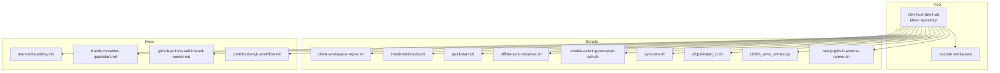
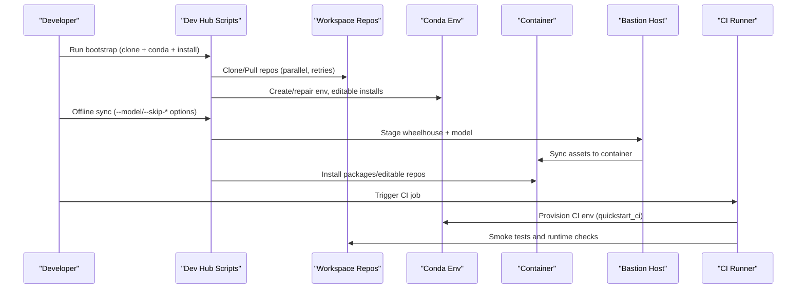
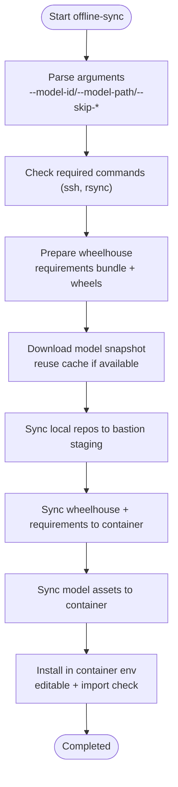
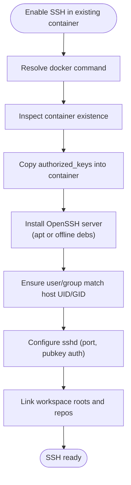
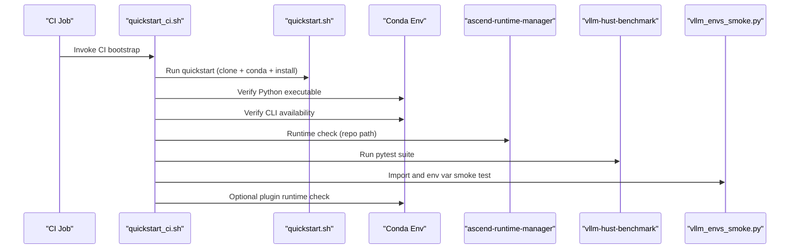
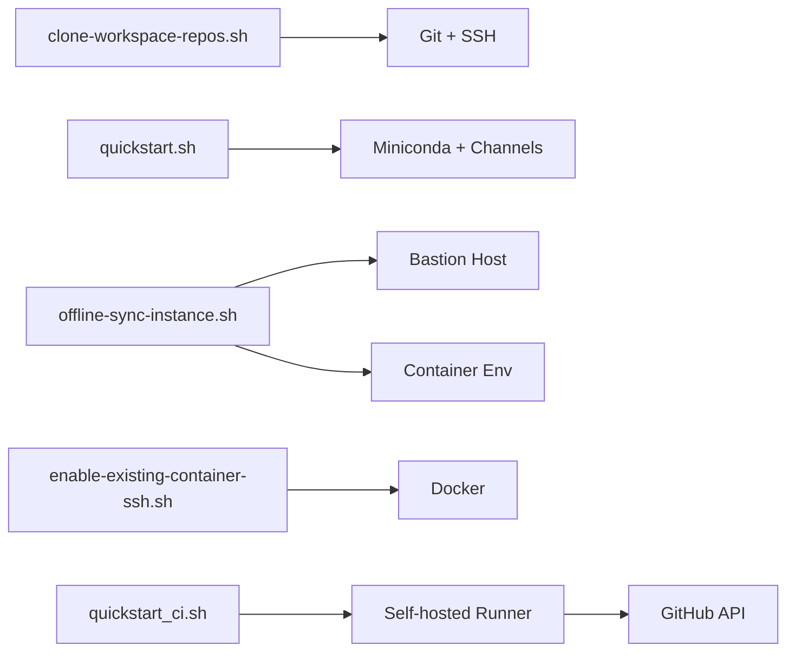

# Troubleshooting Guide

<cite>
**Referenced Files in This Document**
- [README.md](file://README.md)
- [ROADMAP.md](file://ROADMAP.md)
- [scripts/clone-workspace-repos.sh](file://scripts/clone-workspace-repos.sh)
- [scripts/install-miniconda.sh](file://scripts/install-miniconda.sh)
- [scripts/quickstart.sh](file://scripts/quickstart.sh)
- [scripts/offline-sync-instance.sh](file://scripts/offline-sync-instance.sh)
- [scripts/enable-existing-container-ssh.sh](file://scripts/enable-existing-container-ssh.sh)
- [scripts/sync-env.sh](file://scripts/sync-env.sh)
- [scripts/ci/quickstart_ci.sh](file://scripts/ci/quickstart_ci.sh)
- [scripts/ci/vllm_envs_smoke.py](file://scripts/ci/vllm_envs_smoke.py)
- [scripts/setup-github-actions-runner.sh](file://scripts/setup-github-actions-runner.sh)
- [docs/contribution-git-workflow.md](file://docs/contribution-git-workflow.md)
- [docs/team-onboarding.md](file://docs/team-onboarding.md)
- [docs/train8-container-quickstart.md](file://docs/train8-container-quickstart.md)
- [docs/github-actions-self-hosted-runner.md](file://docs/github-actions-self-hosted-runner.md)
</cite>

## Table of Contents
1. [Introduction](#introduction)
2. [Project Structure](#project-structure)
3. [Core Components](#core-components)
4. [Architecture Overview](#architecture-overview)
5. [Detailed Component Analysis](#detailed-component-analysis)
6. [Dependency Analysis](#dependency-analysis)
7. [Performance Considerations](#performance-considerations)
8. [Troubleshooting Guide](#troubleshooting-guide)
9. [Conclusion](#conclusion)
10. [Appendices](#appendices)

## Introduction
This guide provides a comprehensive troubleshooting methodology for the VLLM-HUST Development Hub. It focuses on diagnosing and resolving complex issues across offline synchronization, container startup, repository sync conflicts, environment setup, performance bottlenecks, and CI/CD pipeline failures. It includes diagnostic commands, log analysis techniques, error interpretation, and recovery procedures for corrupted environments and partial operations.

## Project Structure
The repository centers on a lightweight meta repository that orchestrates a VS Code multi-root workspace and provides bootstrap scripts for repositories, conda environments, containers, and CI/CD. Key areas:
- Workspace bootstrap and repository synchronization
- Environment setup and repair
- Offline synchronization for containerized environments
- Container SSH enablement and maintenance
- CI/CD bootstrapping and smoke tests
- Self-hosted GitHub Actions runner management

**Diagram sources**
- [README.md:1-288](file://README.md#L1-L288)
- [scripts/clone-workspace-repos.sh:1-466](file://scripts/clone-workspace-repos.sh#L1-L466)
- [scripts/install-miniconda.sh:1-169](file://scripts/install-miniconda.sh#L1-L169)
- [scripts/quickstart.sh:1-800](file://scripts/quickstart.sh#L1-L800)
- [scripts/offline-sync-instance.sh:1-763](file://scripts/offline-sync-instance.sh#L1-L763)
- [scripts/enable-existing-container-ssh.sh:1-172](file://scripts/enable-existing-container-ssh.sh#L1-L172)
- [scripts/sync-env.sh:1-129](file://scripts/sync-env.sh#L1-L129)
- [scripts/ci/quickstart_ci.sh:1-321](file://scripts/ci/quickstart_ci.sh#L1-L321)
- [scripts/ci/vllm_envs_smoke.py:1-69](file://scripts/ci/vllm_envs_smoke.py#L1-L69)
- [scripts/setup-github-actions-runner.sh:1-528](file://scripts/setup-github-actions-runner.sh#L1-L528)
- [docs/team-onboarding.md:1-384](file://docs/team-onboarding.md#L1-L384)
- [docs/train8-container-quickstart.md:1-404](file://docs/train8-container-quickstart.md#L1-L404)
- [docs/github-actions-self-hosted-runner.md:1-202](file://docs/github-actions-self-hosted-runner.md#L1-L202)
- [docs/contribution-git-workflow.md:1-501](file://docs/contribution-git-workflow.md#L1-L501)

**Section sources**
- [README.md:1-288](file://README.md#L1-L288)

## Core Components
- Workspace synchronization: Parallel cloning and pull with retry and protocol fallback
- Environment setup: Conda environment creation, editable installs, Python stack alignment, and mirror endpoint switching
- Offline synchronization: Wheelhouse preparation, model snapshot staging, bastion-assisted container sync, and offline installation
- Container SSH enablement: Container-side SSH setup, authorized keys propagation, and workspace symlink alignment
- CI/CD bootstrap: Automated CI environment provisioning, smoke tests, and runtime checks
- Self-hosted runner: Rootless runner installation, user systemd service, and proxy handling

**Section sources**
- [scripts/clone-workspace-repos.sh:1-466](file://scripts/clone-workspace-repos.sh#L1-L466)
- [scripts/quickstart.sh:1-800](file://scripts/quickstart.sh#L1-L800)
- [scripts/offline-sync-instance.sh:1-763](file://scripts/offline-sync-instance.sh#L1-L763)
- [scripts/enable-existing-container-ssh.sh:1-172](file://scripts/enable-existing-container-ssh.sh#L1-L172)
- [scripts/ci/quickstart_ci.sh:1-321](file://scripts/ci/quickstart_ci.sh#L1-L321)
- [scripts/setup-github-actions-runner.sh:1-528](file://scripts/setup-github-actions-runner.sh#L1-L528)

## Architecture Overview
The Dev Hub orchestrates a layered workflow:
- Developer actions trigger scripts to synchronize repositories, create or repair environments, and prepare containers
- Offline workflows stage artifacts and transfer them through bastion hosts to container environments
- CI/CD scripts automate environment provisioning and smoke tests
- Self-hosted runners execute CI jobs with minimal friction

**Diagram sources**
- [scripts/clone-workspace-repos.sh:1-466](file://scripts/clone-workspace-repos.sh#L1-L466)
- [scripts/quickstart.sh:1-800](file://scripts/quickstart.sh#L1-L800)
- [scripts/offline-sync-instance.sh:1-763](file://scripts/offline-sync-instance.sh#L1-L763)
- [scripts/ci/quickstart_ci.sh:1-321](file://scripts/ci/quickstart_ci.sh#L1-L321)

## Detailed Component Analysis

### Offline Synchronization Workflow
Offline synchronization prepares wheels and model snapshots locally, transfers them to a container via a bastion host, and installs them without public network access.

**Diagram sources**
- [scripts/offline-sync-instance.sh:1-763](file://scripts/offline-sync-instance.sh#L1-L763)

**Section sources**
- [scripts/offline-sync-instance.sh:1-763](file://scripts/offline-sync-instance.sh#L1-L763)

### Container SSH Enablement
Enabling SSH on an existing container involves installing OpenSSH server, setting up user/group, copying authorized keys, configuring SSHD, and linking workspace directories.

**Diagram sources**
- [scripts/enable-existing-container-ssh.sh:1-172](file://scripts/enable-existing-container-ssh.sh#L1-L172)

**Section sources**
- [scripts/enable-existing-container-ssh.sh:1-172](file://scripts/enable-existing-container-ssh.sh#L1-L172)

### CI/CD Bootstrap and Smoke Tests
CI bootstrap provisions a dedicated environment, runs smoke tests, and validates runtime checks. It also handles plugin presence and optional runtime checks.

**Diagram sources**
- [scripts/ci/quickstart_ci.sh:1-321](file://scripts/ci/quickstart_ci.sh#L1-L321)
- [scripts/ci/vllm_envs_smoke.py:1-69](file://scripts/ci/vllm_envs_smoke.py#L1-L69)

**Section sources**
- [scripts/ci/quickstart_ci.sh:1-321](file://scripts/ci/quickstart_ci.sh#L1-L321)
- [scripts/ci/vllm_envs_smoke.py:1-69](file://scripts/ci/vllm_envs_smoke.py#L1-L69)

## Dependency Analysis
- Repository synchronization depends on Git and SSH configuration, with fallback to HTTPS when SSH fails
- Environment setup depends on Miniconda availability and proper channel/index mirrors
- Offline synchronization depends on bastion connectivity and container-side conda availability
- Container SSH enablement depends on Docker availability and container state
- CI/CD bootstrap depends on GitHub Actions runner availability and Git authentication modes
- Self-hosted runner depends on systemd user session and proxy environment handling

**Diagram sources**
- [scripts/clone-workspace-repos.sh:1-466](file://scripts/clone-workspace-repos.sh#L1-L466)
- [scripts/quickstart.sh:1-800](file://scripts/quickstart.sh#L1-L800)
- [scripts/offline-sync-instance.sh:1-763](file://scripts/offline-sync-instance.sh#L1-L763)
- [scripts/enable-existing-container-ssh.sh:1-172](file://scripts/enable-existing-container-ssh.sh#L1-L172)
- [scripts/ci/quickstart_ci.sh:1-321](file://scripts/ci/quickstart_ci.sh#L1-L321)
- [scripts/setup-github-actions-runner.sh:1-528](file://scripts/setup-github-actions-runner.sh#L1-L528)

**Section sources**
- [scripts/clone-workspace-repos.sh:1-466](file://scripts/clone-workspace-repos.sh#L1-L466)
- [scripts/quickstart.sh:1-800](file://scripts/quickstart.sh#L1-L800)
- [scripts/offline-sync-instance.sh:1-763](file://scripts/offline-sync-instance.sh#L1-L763)
- [scripts/enable-existing-container-ssh.sh:1-172](file://scripts/enable-existing-container-ssh.sh#L1-L172)
- [scripts/ci/quickstart_ci.sh:1-321](file://scripts/ci/quickstart_ci.sh#L1-L321)
- [scripts/setup-github-actions-runner.sh:1-528](file://scripts/setup-github-actions-runner.sh#L1-L528)

## Performance Considerations
- Parallel repository cloning: Control concurrency via environment variable to balance speed and resource usage
- Wheelhouse preparation: Select target platform and ABI to minimize download failures and mismatches
- CI runtime checks: Use targeted smoke tests to reduce total job duration while maintaining confidence
- Container networking: Prefer host networking for distributed tests to avoid bridge-induced overhead
- Mirror endpoints: Automatic mirror switching reduces network latency for model downloads

[No sources needed since this section provides general guidance]

## Troubleshooting Guide

### Offline Synchronization Failures
Symptoms:
- Wheelhouse preparation fails for specific packages
- Model snapshot download stalls or fails
- Sync to bastion/container fails mid-transfer
- Container-side installation reports missing packages or import errors

Diagnosis:
- Verify required commands: ssh, rsync
- Confirm bastion alias and credentials
- Check local artifact directories and permissions
- Validate container-side conda environment and asset paths

Remediation:
- Retry with explicit artifact root and environment name
- Use --skip-model to bypass model sync if not needed
- Use --skip-wheelhouse to reuse existing artifacts
- Ensure model allow/ignore patterns match intended files
- Validate container-side wheelhouse and editable installs

**Section sources**
- [scripts/offline-sync-instance.sh:1-763](file://scripts/offline-sync-instance.sh#L1-L763)

### Container Startup Problems
Symptoms:
- SSH connection refused
- Container not running or SSHD not started
- Host key mismatch or cached keys blocking connection
- Workspace symlink issues after login

Diagnosis:
- Check container status and SSHD process
- Verify SSH port binding and firewall rules
- Clear old host keys if necessary
- Confirm user/group UID/GID alignment and workspace links

Remediation:
- Re-run container SSH enablement script
- Adjust SSH port if conflicting
- Recreate container if state is inconsistent
- Ensure workspace parent directory is mounted and resolvable

**Section sources**
- [scripts/enable-existing-container-ssh.sh:1-172](file://scripts/enable-existing-container-ssh.sh#L1-L172)
- [docs/train8-container-quickstart.md:264-367](file://docs/train8-container-quickstart.md#L264-L367)

### Repository Sync Conflicts
Symptoms:
- Fetch fails due to protocol mismatch
- Pull aborted due to non-fast-forward conditions
- Upstream branch disappears after prune
- Existing destination not a git repository

Diagnosis:
- Check Git configuration and SSH identity
- Inspect remote URLs and branch tracking
- Validate destination path state and ownership

Remediation:
- Allow SSH fallback to HTTPS when available
- Use --ff-only pull or manual rebase
- Remove non-git destinations and re-clone
- Adjust CLONE_JOBS for resource-constrained environments

**Section sources**
- [scripts/clone-workspace-repos.sh:1-466](file://scripts/clone-workspace-repos.sh#L1-L466)

### Environment Setup Errors
Symptoms:
- Conda environment creation fails
- Editable installs fail or conflict
- Torch/NPU runtime import validation fails
- Miniconda prefix unusable or stale

Diagnosis:
- Check Miniconda availability and prefix usability
- Validate channel mirrors and index URLs
- Inspect environment activation hooks and LD_LIBRARY_PATH sanitization
- Verify Python stack alignment and optional components

Remediation:
- Reinstall Miniconda if prefix is broken
- Force reinstall conflicting packages
- Align Python stack via manager when available
- Use install-only mode to refresh editable installs

**Section sources**
- [scripts/install-miniconda.sh:1-169](file://scripts/install-miniconda.sh#L1-L169)
- [scripts/quickstart.sh:1-800](file://scripts/quickstart.sh#L1-L800)

### Network Isolation Issues
Symptoms:
- Public network access blocked
- Model download timeouts
- CI jobs failing to clone or install

Diagnosis:
- Confirm offline sync prerequisites and bastion connectivity
- Validate CI Git authentication mode and SSH usage
- Check proxy environment leakage into runner processes

Remediation:
- Use offline sync workflow with --skip-model or --skip-wheelhouse
- Configure CI to use SSH mode and clear temporary tokens
- Preserve or disable proxy selectively for runner startup

**Section sources**
- [docs/github-actions-self-hosted-runner.md:120-133](file://docs/github-actions-self-hosted-runner.md#L120-L133)
- [scripts/offline-sync-instance.sh:1-763](file://scripts/offline-sync-instance.sh#L1-L763)

### Permission Problems
Symptoms:
- Docker command requires sudo
- SSHD installation fails due to missing packages
- Workspace directory not writable after login

Diagnosis:
- Verify docker access and sudo-less invocation
- Check package manager availability for OpenSSH installation
- Confirm UID/GID mapping for workspace ownership

Remediation:
- Use sudo -n docker when available
- Provide offline DEB packages for SSHD installation
- Ensure user/group exists and matches host ownership

**Section sources**
- [scripts/enable-existing-container-ssh.sh:1-172](file://scripts/enable-existing-container-ssh.sh#L1-L172)

### Dependency Conflicts
Symptoms:
- Pip install fails due to incompatible versions
- Optional dependencies cause failures on specific platforms
- Conflicting PyTorch packages in environment

Diagnosis:
- Review requirements bundle and platform-specific overrides
- Identify optional dependencies skipped on aarch64
- Detect and remove conflicting packages

Remediation:
- Use platform-specific markers and overrides
- Skip problematic optional dependencies when unsupported
- Remove conflicting packages before reinstall

**Section sources**
- [scripts/offline-sync-instance.sh:1-763](file://scripts/offline-sync-instance.sh#L1-L763)

### Hardware-Specific Troubleshooting
Symptoms:
- NPU devices not visible in container
- CANN version mismatch
- Distributed communication failures

Diagnosis:
- Verify device visibility and driver paths
- Check CANN toolkit version info
- Confirm host networking for distributed tests

Remediation:
- Recreate container with correct image variant
- Use host networking for distributed tests
- Validate driver and toolkit installation

**Section sources**
- [docs/train8-container-quickstart.md:264-367](file://docs/train8-container-quickstart.md#L264-L367)

### Performance Troubleshooting
Symptoms:
- Slow repository cloning
- Long wheelhouse preparation
- CI job timeouts

Diagnosis:
- Monitor progress and adjust parallelism
- Use heartbeat logs for long-running operations
- Profile CI stages and optimize where possible

Remediation:
- Tune CLONE_JOBS for available cores
- Cache and reuse wheelhouse artifacts
- Shorten CI scope to essential tests

**Section sources**
- [scripts/clone-workspace-repos.sh:1-466](file://scripts/clone-workspace-repos.sh#L1-L466)
- [scripts/quickstart.sh:1-800](file://scripts/quickstart.sh#L1-L800)
- [ROADMAP.md:1-83](file://ROADMAP.md#L1-L83)

### Debugging Custom Configurations
Symptoms:
- .env token propagation issues
- Custom SSH keys not applied
- Plugin not loaded in CI

Diagnosis:
- Compare source and target .env files
- Verify extra authorized keys persistence
- Check plugin entry points and runtime checks

Remediation:
- Apply .env diffs with --apply flag
- Persist extra SSH keys to expected location
- Validate plugin presence and runtime checks

**Section sources**
- [scripts/sync-env.sh:1-129](file://scripts/sync-env.sh#L1-L129)
- [scripts/quickstart.sh:1-800](file://scripts/quickstart.sh#L1-L800)
- [scripts/ci/quickstart_ci.sh:1-321](file://scripts/ci/quickstart_ci.sh#L1-L321)

### CI/CD Pipeline Failures
Symptoms:
- Environment provisioning fails
- Smoke tests fail
- Runtime checks fail

Diagnosis:
- Inspect CI logs per step
- Validate environment cleanup and summary
- Check plugin presence and runtime validation

Remediation:
- Re-run failing steps individually
- Clean up environment before retry
- Ensure plugin is installed when required

**Section sources**
- [scripts/ci/quickstart_ci.sh:1-321](file://scripts/ci/quickstart_ci.sh#L1-L321)
- [scripts/ci/vllm_envs_smoke.py:1-69](file://scripts/ci/vllm_envs_smoke.py#L1-L69)

### Recovery Procedures
Corrupted environments:
- Back up current environment and logs
- Reinstall Miniconda if prefix is unusable
- Recreate conda environment with clean scope

Failed installations:
- Use install-only mode to refresh editable installs
- Remove conflicting packages before reinstall
- Leverage manager for Python stack reconciliation

Partial sync operations:
- Resume offline sync with preserved artifact roots
- Re-run container-side install with import validation
- Restore workspace symlinks post-recreate

**Section sources**
- [scripts/install-miniconda.sh:1-169](file://scripts/install-miniconda.sh#L1-L169)
- [scripts/quickstart.sh:1-800](file://scripts/quickstart.sh#L1-L800)
- [scripts/offline-sync-instance.sh:1-763](file://scripts/offline-sync-instance.sh#L1-L763)

### Escalation Procedures and Support Resources
- Team onboarding and container quickstart guides
- Contribution workflow and Git hygiene
- Self-hosted runner documentation and labels
- CI job configuration and authentication modes

**Section sources**
- [docs/team-onboarding.md:1-384](file://docs/team-onboarding.md#L1-L384)
- [docs/contribution-git-workflow.md:1-501](file://docs/contribution-git-workflow.md#L1-L501)
- [docs/github-actions-self-hosted-runner.md:1-202](file://docs/github-actions-self-hosted-runner.md#L1-L202)
- [docs/train8-container-quickstart.md:1-404](file://docs/train8-container-quickstart.md#L1-L404)

## Conclusion
This guide consolidates practical troubleshooting procedures for the VLLM-HUST Development Hub across offline synchronization, container operations, environment setup, and CI/CD. By following structured diagnostics, leveraging built-in scripts, and applying recovery procedures, advanced users can efficiently isolate and resolve complex issues while maintaining reproducibility and minimizing downtime.

## Appendices
- Diagnostic commands and log locations
- Common error messages and interpretations
- Reference to relevant scripts and documentation

[No sources needed since this section provides general guidance]