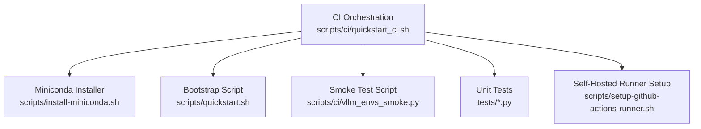
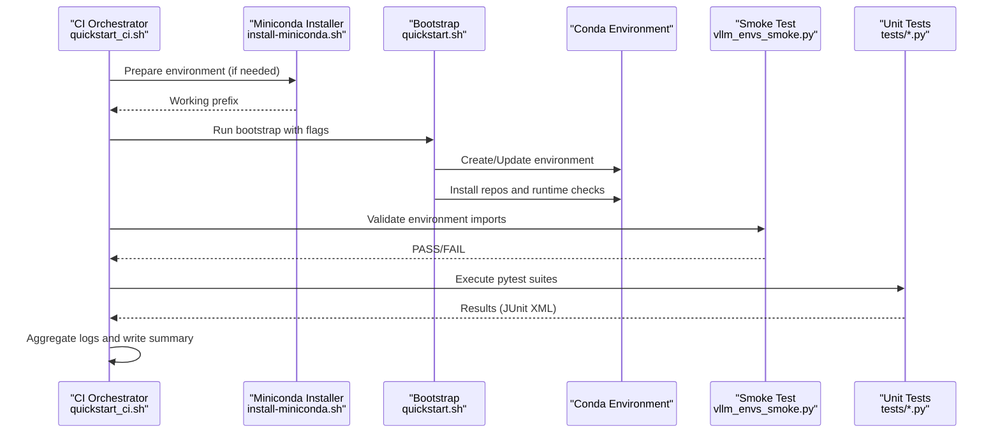
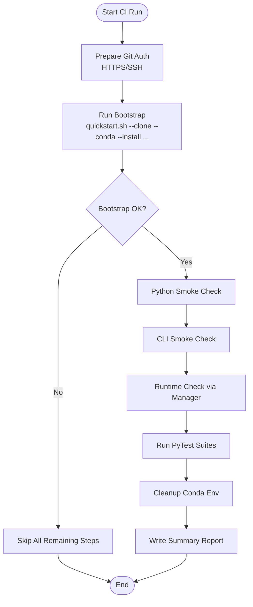
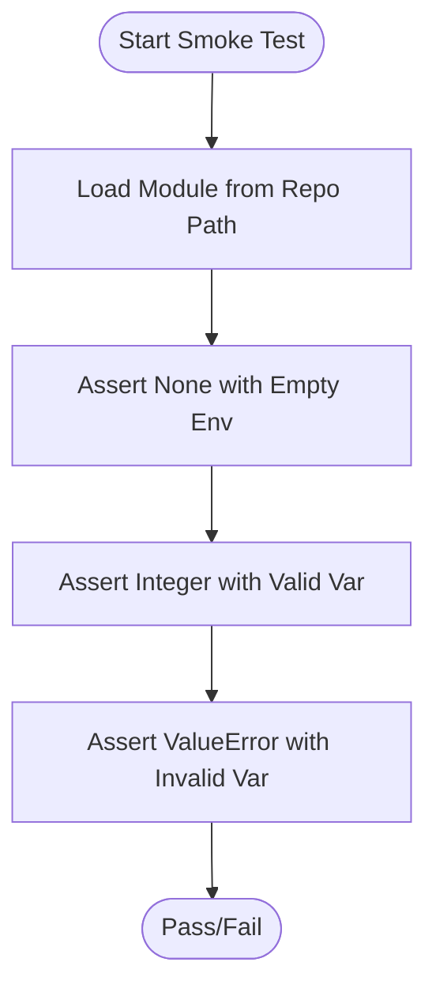
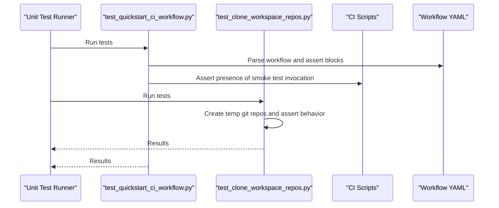
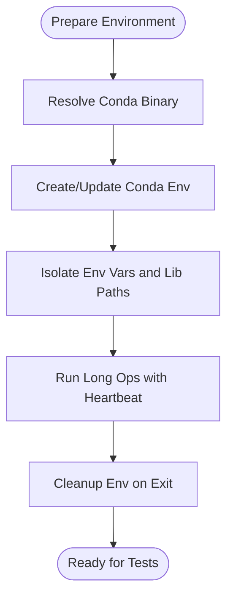
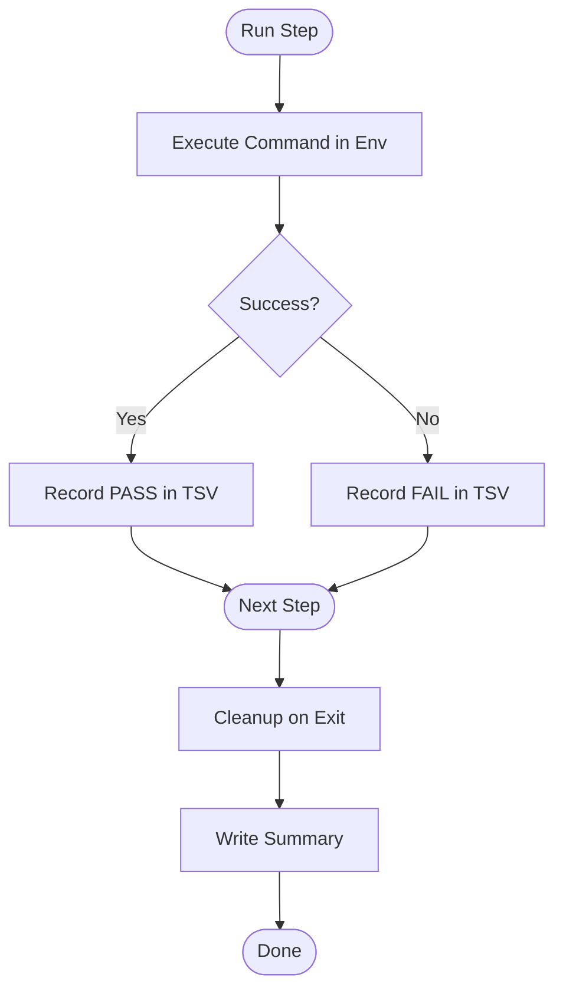
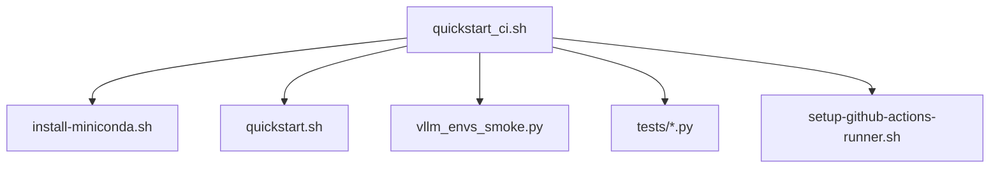

# Automated Testing Setup

<cite>
**Referenced Files in This Document**
- [quickstart_ci.sh](file://scripts/ci/quickstart_ci.sh)
- [vllm_envs_smoke.py](file://scripts/ci/vllm_envs_smoke.py)
- [install_miniconda.sh](file://scripts/install-miniconda.sh)
- [quickstart.sh](file://scripts/quickstart.sh)
- [test_quickstart_ci_workflow.py](file://tests/test_quickstart_ci_workflow.py)
- [test_clone_workspace_repos.py](file://tests/test_clone_workspace_repos.py)
- [setup_github_actions_runner.sh](file://scripts/setup-github_actions_runner.sh)
- [README.md](file://README.md)
</cite>

## Table of Contents
1. [Introduction](#introduction)
2. [Project Structure](#project-structure)
3. [Core Components](#core-components)
4. [Architecture Overview](#architecture-overview)
5. [Detailed Component Analysis](#detailed-component-analysis)
6. [Dependency Analysis](#dependency-analysis)
7. [Performance Considerations](#performance-considerations)
8. [Troubleshooting Guide](#troubleshooting-guide)
9. [Conclusion](#conclusion)
10. [Appendices](#appendices)

## Introduction
This document explains the automated testing setup within the CI pipeline, focusing on the CI bootstrap process, smoke testing, and unit test execution. It documents how the test environment is prepared, how conda environments are set up, and how test isolation is achieved. It also covers test data management, temporary file handling, cleanup procedures, and strategies to mitigate common issues such as environment conflicts, test timeouts, and flaky tests. Guidance is provided for extending the testing suite and adding new test cases.

## Project Structure
The CI automation centers around a Bash orchestration script that coordinates environment setup, smoke tests, and unit test execution across multiple repositories. Supporting scripts handle miniconda installation, environment isolation, and GitHub Actions runner setup. Unit tests validate the CI workflow and guardrails.

**Diagram sources**
- [quickstart_ci.sh:232-321](file://scripts/ci/quickstart_ci.sh#L232-L321)
- [install_miniconda.sh:132-169](file://scripts/install-miniconda.sh#L132-L169)
- [quickstart.sh:278-402](file://scripts/quickstart.sh#L278-L402)
- [vllm_envs_smoke.py:43-69](file://scripts/ci/vllm_envs_smoke.py#L43-L69)
- [test_quickstart_ci_workflow.py:1-142](file://tests/test_quickstart_ci_workflow.py#L1-L142)
- [setup_github_actions_runner.sh:498-528](file://scripts/setup-github-actions-runner.sh#L498-L528)

**Section sources**
- [README.md:1-288](file://README.md#L1-L288)

## Core Components
- CI orchestration script: Drives the end-to-end CI run, prepares results directories, manages cleanup, and executes smoke and unit tests.
- Miniconda installer: Ensures a working Python environment with a predictable prefix and handles platform detection and backup of broken prefixes.
- Bootstrap script: Creates or updates conda environments, installs repositories, validates runtime prerequisites, and prepares the workspace for tests.
- Smoke test script: Validates environment import behavior and port configuration logic without relying on installed packages.
- Unit tests: Validate CI workflow correctness, guard SSH/HTTPS auth modes, and ensure proper installation steps are executed.

**Section sources**
- [quickstart_ci.sh:1-321](file://scripts/ci/quickstart_ci.sh#L1-L321)
- [install_miniconda.sh:1-169](file://scripts/install-miniconda.sh#L1-L169)
- [quickstart.sh:278-402](file://scripts/quickstart.sh#L278-L402)
- [vllm_envs_smoke.py:1-69](file://scripts/ci/vllm_envs_smoke.py#L1-L69)
- [test_quickstart_ci_workflow.py:1-142](file://tests/test_quickstart_ci_workflow.py#L1-L142)
- [test_clone_workspace_repos.py:1-110](file://tests/test_clone_workspace_repos.py#L1-L110)

## Architecture Overview
The CI pipeline follows a deterministic sequence: environment preparation, bootstrap, smoke checks, targeted unit tests, and cleanup. Results are aggregated into structured logs and a summary file.

**Diagram sources**
- [quickstart_ci.sh:232-321](file://scripts/ci/quickstart_ci.sh#L232-L321)
- [install_miniconda.sh:132-169](file://scripts/install-miniconda.sh#L132-L169)
- [quickstart.sh:278-402](file://scripts/quickstart.sh#L278-L402)
- [vllm_envs_smoke.py:43-69](file://scripts/ci/vllm_envs_smoke.py#L43-L69)
- [test_quickstart_ci_workflow.py:1-142](file://tests/test_quickstart_ci_workflow.py#L1-L142)

## Detailed Component Analysis

### CI Bootstrap Process
The CI orchestrator coordinates environment preparation, bootstrap execution, and subsequent smoke and unit tests. It defines environment names, results directories, and logging locations, and ensures cleanup on exit.

Key behaviors:
- Resolves conda binary location and checks for environment existence.
- Writes structured TSV results and a Markdown summary.
- Skips downstream steps when bootstrap fails.
- Uses conda run wrappers to isolate environment variables and library paths.

**Diagram sources**
- [quickstart_ci.sh:232-321](file://scripts/ci/quickstart_ci.sh#L232-L321)

**Section sources**
- [quickstart_ci.sh:101-154](file://scripts/ci/quickstart_ci.sh#L101-L154)
- [quickstart_ci.sh:161-197](file://scripts/ci/quickstart_ci.sh#L161-L197)
- [quickstart_ci.sh:232-321](file://scripts/ci/quickstart_ci.sh#L232-L321)

### Smoke Testing Implementation
The smoke test validates environment import behavior and port configuration logic by dynamically loading a module from the repository and asserting expected outcomes under controlled environment conditions.

Highlights:
- Dynamically loads a module from the repository path to avoid relying on installed packages.
- Asserts behavior when environment variables are absent, set to a valid integer, or set to invalid values.
- Uses mocking to simulate missing optional dependencies.

**Diagram sources**
- [vllm_envs_smoke.py:30-65](file://scripts/ci/vllm_envs_smoke.py#L30-L65)

**Section sources**
- [vllm_envs_smoke.py:1-69](file://scripts/ci/vllm_envs_smoke.py#L1-L69)

### Unit Test Execution
Unit tests validate the CI workflow and guardrails. They ensure:
- Interactive bootstrap behavior maintains expected bashrc activation.
- Self-hosted jobs preserve SSH guards and disable tokens for clone auth.
- CI script supports SSH mode for repository cloning.
- CI smoke test uses a dedicated script that loads modules from the repository.
- Bootstrap installs Ascend runtime Python dependencies and validates Torch/NPU runtime health.
- CLI overrides and project metadata parsing behave as expected.

Execution pattern:
- Tests locate CI scripts and workflow files, extract blocks, and assert presence of expected constructs.
- Some tests execute shell commands in a controlled environment to validate behavior.

**Diagram sources**
- [test_quickstart_ci_workflow.py:15-72](file://tests/test_quickstart_ci_workflow.py#L15-L72)
- [test_clone_workspace_repos.py:33-107](file://tests/test_clone_workspace_repos.py#L33-L107)

**Section sources**
- [test_quickstart_ci_workflow.py:1-142](file://tests/test_quickstart_ci_workflow.py#L1-L142)
- [test_clone_workspace_repos.py:1-110](file://tests/test_clone_workspace_repos.py#L1-L110)

### Test Environment Preparation and Isolation
The CI orchestrator sets up isolated environments and ensures clean state:
- Conda environment resolution and removal.
- Environment variable isolation for conda and pip operations.
- Sanitized library paths to prevent interference with system tools.
- Heartbeat logging for long-running operations.

**Diagram sources**
- [quickstart_ci.sh:47-99](file://scripts/ci/quickstart_ci.sh#L47-L99)
- [quickstart.sh:278-402](file://scripts/quickstart.sh#L278-L402)

**Section sources**
- [quickstart_ci.sh:47-99](file://scripts/ci/quickstart_ci.sh#L47-L99)
- [quickstart.sh:278-402](file://scripts/quickstart.sh#L278-L402)

### Test Data Management and Cleanup
The CI orchestrator organizes artifacts and cleanup:
- Results directory structure with logs and JUnit XML.
- TSV result aggregation and Markdown summary generation.
- Conditional cleanup of conda environments and signal-safe termination.

**Diagram sources**
- [quickstart_ci.sh:161-197](file://scripts/ci/quickstart_ci.sh#L161-L197)
- [quickstart_ci.sh:101-131](file://scripts/ci/quickstart_ci.sh#L101-L131)

**Section sources**
- [quickstart_ci.sh:101-131](file://scripts/ci/quickstart_ci.sh#L101-L131)
- [quickstart_ci.sh:161-197](file://scripts/ci/quickstart_ci.sh#L161-L197)

## Dependency Analysis
The CI pipeline depends on:
- Conda for environment management and isolation.
- Bootstrap script for installing repositories and validating runtime prerequisites.
- Unit tests for guarding workflow correctness and environment assumptions.
- Optional GitHub Actions self-hosted runner setup for CI infrastructure.

**Diagram sources**
- [quickstart_ci.sh:232-321](file://scripts/ci/quickstart_ci.sh#L232-L321)
- [install_miniconda.sh:132-169](file://scripts/install-miniconda.sh#L132-L169)
- [quickstart.sh:278-402](file://scripts/quickstart.sh#L278-L402)
- [vllm_envs_smoke.py:43-69](file://scripts/ci/vllm_envs_smoke.py#L43-L69)
- [test_quickstart_ci_workflow.py:1-142](file://tests/test_quickstart_ci_workflow.py#L1-L142)
- [setup_github_actions_runner.sh:498-528](file://scripts/setup-github-actions-runner.sh#L498-L528)

**Section sources**
- [quickstart_ci.sh:232-321](file://scripts/ci/quickstart_ci.sh#L232-L321)
- [setup_github_actions_runner.sh:498-528](file://scripts/setup-github-actions-runner.sh#L498-L528)

## Performance Considerations
- Long-running operations emit periodic heartbeat logs to avoid CI timeouts and improve observability.
- Conda operations are isolated from external environment variables to reduce retries and failures.
- Parallelizable tasks (e.g., repository cloning) are handled by separate scripts to minimize CI overhead.

[No sources needed since this section provides general guidance]

## Troubleshooting Guide
Common issues and mitigations:
- Environment conflicts: The bootstrap script removes conflicting packages and reconciles the Ascend Python stack to ensure healthy imports.
- Test timeouts: Long operations use heartbeat logging; consider increasing timeout settings in CI if necessary.
- Flaky tests: Use deterministic environment variables and mocked behaviors in smoke tests; ensure cleanup routines are executed on exit.
- SSH vs HTTPS auth: The CI orchestrator respects explicit SSH mode and disables tokens for clone auth in self-hosted jobs.

**Section sources**
- [quickstart.sh:322-402](file://scripts/quickstart.sh#L322-L402)
- [quickstart_ci.sh:146-159](file://scripts/ci/quickstart_ci.sh#L146-L159)
- [test_quickstart_ci_workflow.py:35-50](file://tests/test_quickstart_ci_workflow.py#L35-L50)

## Conclusion
The CI pipeline integrates environment preparation, bootstrap validation, smoke testing, and unit test execution with robust isolation and cleanup. The provided scripts and tests ensure reliable, reproducible CI runs and offer clear extension points for adding new test cases and repositories.

[No sources needed since this section summarizes without analyzing specific files]

## Appendices

### Extending the Testing Suite
- Add new unit tests alongside existing ones, following the established patterns for locating CI scripts and workflow files, extracting blocks, and asserting expected behavior.
- For new smoke tests, mirror the approach in the smoke test script: dynamically load modules from the repository and assert behavior under controlled environment conditions.
- When introducing new repositories, integrate their test suites into the CI orchestration script and ensure proper environment isolation and cleanup.

**Section sources**
- [test_quickstart_ci_workflow.py:1-142](file://tests/test_quickstart_ci_workflow.py#L1-L142)
- [vllm_envs_smoke.py:1-69](file://scripts/ci/vllm_envs_smoke.py#L1-L69)
- [quickstart_ci.sh:280-304](file://scripts/ci/quickstart_ci.sh#L280-L304)