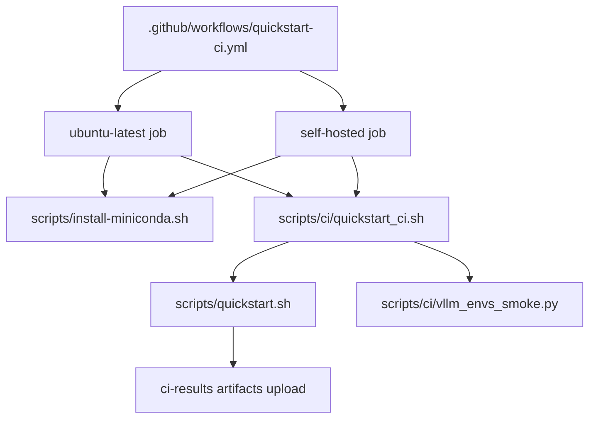
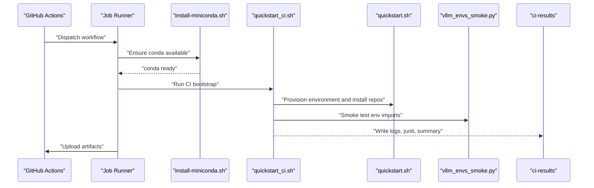
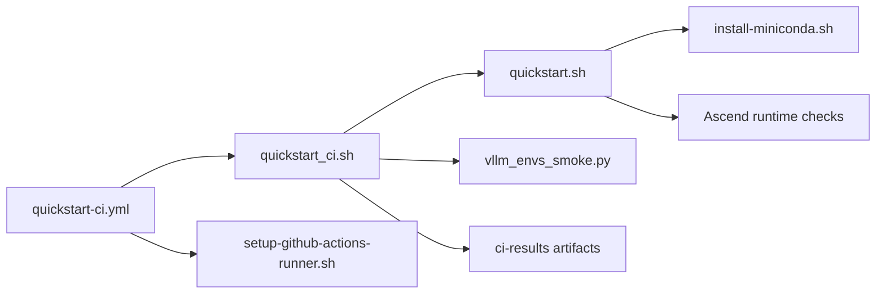

# CI/CD Pipeline

<cite>
**Referenced Files in This Document**
- [quickstart-ci.yml](file://.github/workflows/quickstart-ci.yml)
- [quickstart_ci.sh](file://scripts/ci/quickstart_ci.sh)
- [vllm_envs_smoke.py](file://scripts/ci/vllm_envs_smoke.py)
- [install_ascend_benchmark_root_helper.sh](file://scripts/ci/install_ascend_benchmark_root_helper.sh)
- [quickstart.sh](file://scripts/quickstart.sh)
- [run_bandwidth_benchmarks.sh](file://Ascend-Machine/benchmarks/run_bandwidth_benchmarks.sh)
- [setup-github-actions-runner.sh](file://scripts/setup-github-actions-runner.sh)
- [install-miniconda.sh](file://scripts/install-miniconda.sh)
- [test_quickstart_ci_workflow.py](file://tests/test_quickstart_ci_workflow.py)
</cite>

## Table of Contents
1. [Introduction](#introduction)
2. [Project Structure](#project-structure)
3. [Core Components](#core-components)
4. [Architecture Overview](#architecture-overview)
5. [Detailed Component Analysis](#detailed-component-analysis)
6. [Dependency Analysis](#dependency-analysis)
7. [Performance Considerations](#performance-considerations)
8. [Troubleshooting Guide](#troubleshooting-guide)
9. [Conclusion](#conclusion)

## Introduction
This document explains the CI/CD pipeline for the VLLM-HUST Development Hub, focusing on the GitHub Actions workflow, automated testing, smoke testing, and environment setup. It covers how the pipeline is configured, how CI scripts orchestrate environment bootstrapping and testing, and how results are reported. It also documents configuration options, environment variables, and relationships with Ascend hardware and benchmarking tools. The goal is to make the pipeline understandable for newcomers while providing deep technical insights for advanced users.

## Project Structure
The CI/CD pipeline spans several areas:
- GitHub Actions workflow orchestrating jobs for Ubuntu runners and self-hosted runners
- CI bootstrap script that provisions conda environments, installs repositories, and executes tests
- Smoke testing script validating environment imports and port configuration
- Ascend-related scripts for runtime checks and benchmarking
- Supporting scripts for miniconda installation and GitHub Actions runner setup

**Diagram sources**
- [quickstart-ci.yml:1-149](file://.github/workflows/quickstart-ci.yml#L1-L149)
- [quickstart_ci.sh:1-321](file://scripts/ci/quickstart_ci.sh#L1-L321)
- [quickstart.sh:1-2732](file://scripts/quickstart.sh#L1-L2732)
- [vllm_envs_smoke.py:1-69](file://scripts/ci/vllm_envs_smoke.py#L1-L69)
- [install-miniconda.sh:1-169](file://scripts/install-miniconda.sh#L1-L169)

**Section sources**
- [.github/workflows/quickstart-ci.yml:1-149](file://.github/workflows/quickstart-ci.yml#L1-L149)
- [scripts/ci/quickstart_ci.sh:1-321](file://scripts/ci/quickstart_ci.sh#L1-L321)
- [scripts/quickstart.sh:1-2732](file://scripts/quickstart.sh#L1-L2732)

## Core Components
- GitHub Actions workflow: Defines two jobs (ubuntu and self-hosted), sets permissions, timeouts, and environment variables. It ensures conda availability, runs the CI bootstrap script, and uploads artifacts.
- CI bootstrap script: Orchestrates environment preparation, cloning, conda setup, smoke tests, and pytest-based tests for related repositories. It records results in structured logs and TSV files.
- Quickstart script: The canonical environment provisioning script used by CI to create/update conda environments, reconcile Ascend runtime, and install repositories in editable mode.
- Smoke testing script: Validates environment import behavior and port configuration logic without relying on installed packages.
- Ascend benchmark helper: Delegates to the Ascend plugin’s benchmark installer script.
- Benchmark harness: Runs hardware bandwidth and communication benchmarks for Ascend systems.
- Runner setup script: Installs and manages a rootless GitHub Actions self-hosted runner.

**Section sources**
- [.github/workflows/quickstart-ci.yml:1-149](file://.github/workflows/quickstart-ci.yml#L1-L149)
- [scripts/ci/quickstart_ci.sh:1-321](file://scripts/ci/quickstart_ci.sh#L1-L321)
- [scripts/quickstart.sh:1-2732](file://scripts/quickstart.sh#L1-L2732)
- [scripts/ci/vllm_envs_smoke.py:1-69](file://scripts/ci/vllm_envs_smoke.py#L1-L69)
- [scripts/ci/install_ascend_benchmark_root_helper.sh:1-18](file://scripts/ci/install_ascend_benchmark_root_helper.sh#L1-L18)
- [Ascend-Machine/benchmarks/run_bandwidth_benchmarks.sh:1-373](file://Ascend-Machine/benchmarks/run_bandwidth_benchmarks.sh#L1-L373)
- [scripts/setup-github-actions-runner.sh:1-528](file://scripts/setup-github-actions-runner.sh#L1-L528)

## Architecture Overview
The CI pipeline follows a deterministic flow:
- GitHub Actions checks out the repository and runs guard tests
- Ensures conda is available (installs Miniconda if needed)
- Executes the CI bootstrap script with environment variables
- The bootstrap script invokes quickstart to provision the environment and run tests
- Results are captured and uploaded as artifacts

**Diagram sources**
- [quickstart-ci.yml:24-71](file://.github/workflows/quickstart-ci.yml#L24-L71)
- [quickstart_ci.sh:232-318](file://scripts/ci/quickstart_ci.sh#L232-L318)
- [quickstart.sh:1427-1471](file://scripts/quickstart.sh#L1427-L1471)
- [vllm_envs_smoke.py:43-65](file://scripts/ci/vllm_envs_smoke.py#L43-L65)

## Detailed Component Analysis

### GitHub Actions Workflow (.github/workflows/quickstart-ci.yml)
- Triggers on push to main, pull requests, and manual dispatch
- Permissions grant read access to repository contents
- Two jobs:
  - quickstart-ubuntu: runs on ubuntu-latest, sets HOME/XDG_* caches, ensures conda, runs CI bootstrap with specific environment variables, and uploads artifacts
  - quickstart-self-hosted: runs on self-hosted Linux, prepares SSH keys for private clones, ensures conda, runs CI bootstrap with different environment variables, and uploads artifacts
- Uses a working-directory context for all steps and a 90-minute timeout for Ubuntu, 150 for self-hosted

Key environment variables set by the workflow:
- RUNNER_FLAVOR: ubuntu or self-hosted
- PYTHON_VERSION: default 3.11
- INSTALL_SCOPE: core for Ubuntu, full for self-hosted
- RESULTS_ROOT: path to ci-results
- GITHUB_TOKEN/CI_GITHUB_TOKEN: for authenticated clones
- HUST_DEV_HUB_GIT_AUTH_MODE: ssh for self-hosted

Artifacts uploaded include ci-results with retention of 14 days.

**Section sources**
- [.github/workflows/quickstart-ci.yml:1-149](file://.github/workflows/quickstart-ci.yml#L1-L149)

### CI Bootstrap Script (scripts/ci/quickstart_ci.sh)
Responsibilities:
- Resolves environment variables (RUNNER_FLAVOR, PYTHON_VERSION, INSTALL_SCOPE, RESULTS_ROOT, GITHUB_TOKEN_FOR_CLONES, GITHUB_RUN_ID, GITHUB_RUN_ATTEMPT)
- Prepares clone authentication (HTTPS or SSH)
- Creates results directory structure (logs, junit, summary, results TSV)
- Provides helpers:
  - slugify/log/append_result/run_step/skip_step
  - run_pytest_step: executes pytest with JUnit XML output
  - cleanup_conda_env/write_summary/finalize
- Orchestrates steps:
  - quickstart bootstrap (clone + conda + install)
  - python smoke (import and interpreter path)
  - CLI smoke (vllm CLI presence and version resolution)
  - runtime check (Ascend runtime validation)
  - pytest for ascend-runtime-manager
  - install smoke test dependencies
  - pytest for vllm-hust-benchmark
  - smoke test via vllm_envs_smoke.py
  - optional plugin requirement check (only on self-hosted runners)
- Writes a summary Markdown and updates GitHub step summary if available

Return values:
- Exits with 0 on success, non-zero on failure; individual steps recorded in results TSV with PASS/FAIL/SKIPPED

**Section sources**
- [scripts/ci/quickstart_ci.sh:1-321](file://scripts/ci/quickstart_ci.sh#L1-L321)

### Smoke Testing (scripts/ci/vllm_envs_smoke.py)
Purpose:
- Validates environment import behavior and port parsing logic without relying on installed packages
- Ensures urllib3 parse_url compatibility by mocking when needed
- Tests get_vllm_port behavior under various environment conditions

Execution:
- Called by CI bootstrap script with the repository directory as an argument
- Returns 0 on success

**Section sources**
- [scripts/ci/vllm_envs_smoke.py:1-69](file://scripts/ci/vllm_envs_smoke.py#L1-L69)

### Ascend Runtime and Plugin Checks
- Ascend runtime check: validates runtime via hust-ascend-manager CLI against the vllm-hust repository
- Plugin validation: checks if the Ascend platform plugin entry point is available
- Optional requirement check: enforced on self-hosted runners; otherwise skipped

These checks are integrated into the CI bootstrap script and quickstart script’s environment reconciliation logic.

**Section sources**
- [scripts/ci/quickstart_ci.sh:273-317](file://scripts/ci/quickstart_ci.sh#L273-L317)
- [scripts/quickstart.sh:719-803](file://scripts/quickstart.sh#L719-L803)

### Ascend Benchmark Installation Helper
- Delegates to the Ascend plugin’s benchmark installer script
- Requires VLLM_ASCEND_HUST_REPO to point to the plugin repository if not in the default location

**Section sources**
- [scripts/ci/install_ascend_benchmark_root_helper.sh:1-18](file://scripts/ci/install_ascend_benchmark_root_helper.sh#L1-L18)

### Benchmark Harness (Ascend-Machine/benchmarks/run_bandwidth_benchmarks.sh)
- Captures static inventory (CPU, memory, NIC, disk, npu-smi)
- Builds and runs NUMA memcpy, MBW, ACL copy, and HCCL tests
- Cleans environment variables and library paths for reproducible runs
- Writes results to a timestamped directory under results/latest symlink

Use cases:
- Hardware characterization and bandwidth measurement
- Regression detection when part of CI stages

**Section sources**
- [Ascend-Machine/benchmarks/run_bandwidth_benchmarks.sh:1-373](file://Ascend-Machine/benchmarks/run_bandwidth_benchmarks.sh#L1-L373)

### Self-Hosted Runner Setup (scripts/setup-github-actions-runner.sh)
- Installs a rootless GitHub Actions runner as a user systemd service or background process
- Supports commands: install, start, stop, restart, status, remove
- Accepts configuration via environment variables and CLI options
- Emits a hint for adding appropriate runs-on labels to workflows

**Section sources**
- [scripts/setup-github-actions-runner.sh:1-528](file://scripts/setup-github-actions-runner.sh#L1-L528)

### Miniconda Provisioning (scripts/install-miniconda.sh)
- Detects platform and downloads the appropriate Miniconda installer
- Installs into a configurable prefix and prints activation instructions
- Handles broken prefixes by backing them up

**Section sources**
- [scripts/install-miniconda.sh:1-169](file://scripts/install-miniconda.sh#L1-L169)

### Automated Testing Infrastructure
- Static guard tests validate workflow blocks and script behaviors
- The test suite verifies:
  - SSH mode support in CI script
  - Smoke test integration
  - Ascend runtime Python dependency installation
  - Torch/NPU runtime validation and reconciliation
  - Project name extraction from pyproject/setup.py
  - Ascend lightweight mode override

**Section sources**
- [tests/test_quickstart_ci_workflow.py:1-142](file://tests/test_quickstart_ci_workflow.py#L1-L142)

## Dependency Analysis
High-level dependencies:
- quickstart-ci.yml depends on scripts/ci/quickstart_ci.sh and scripts/quickstart.sh
- quickstart_ci.sh depends on quickstart.sh, vllm_envs_smoke.py, and related repositories
- Ascend-related functionality depends on hust-ascend-manager and vllm-ascend-hust
- Self-hosted job depends on setup-github-actions-runner.sh and SSH keys

**Diagram sources**
- [quickstart-ci.yml:1-149](file://.github/workflows/quickstart-ci.yml#L1-L149)
- [quickstart_ci.sh:1-321](file://scripts/ci/quickstart_ci.sh#L1-L321)
- [quickstart.sh:1-2732](file://scripts/quickstart.sh#L1-L2732)
- [vllm_envs_smoke.py:1-69](file://scripts/ci/vllm_envs_smoke.py#L1-L69)
- [install-miniconda.sh:1-169](file://scripts/install-miniconda.sh#L1-L169)
- [setup-github-actions-runner.sh:1-528](file://scripts/setup-github-actions-runner.sh#L1-L528)

**Section sources**
- [.github/workflows/quickstart-ci.yml:1-149](file://.github/workflows/quickstart-ci.yml#L1-L149)
- [scripts/ci/quickstart_ci.sh:1-321](file://scripts/ci/quickstart_ci.sh#L1-L321)
- [scripts/quickstart.sh:1-2732](file://scripts/quickstart.sh#L1-L2732)

## Performance Considerations
- Conda solver tuning: The workflow sets CONDA_SOLVER=classic to improve reliability during environment solving
- Pip retries/timeouts: quickstart.sh configures pip retry and timeout settings to handle network variability
- Mirror selection: automatic mirror probing reduces install latency in China regions
- Environment isolation: CI uses separate HOME/XDG_* directories to avoid interference
- Artifact retention: ci-results are retained for 14 days to facilitate post-failure analysis

[No sources needed since this section provides general guidance]

## Troubleshooting Guide
Common CI failures and resolutions:
- Conda not found or unusable
  - Ensure miniconda is installed via install-miniconda.sh or available in PATH
  - Verify HOME/XDG_* directories are writable and initialized
- Authentication failures for private repositories
  - For self-hosted, ensure VLLM_HUST_CI_SSH_PRIVATE_KEY secret is set and SSH key is prepared
  - For Ubuntu, CI_GITHUB_TOKEN can be used; ensure it is configured in repository secrets
- Ascend runtime import failures
  - Confirm torch/torch-npu imports succeed; quickstart.sh reconciles the Python stack if needed
  - If plugin entry point missing, verify editable install succeeded and platform plugin is available
- Test environment problems
  - Review ci-results/logs and ci-results/junit for detailed failure traces
  - Use ci-results/summary.md for a consolidated view of step statuses
- Pipeline optimization
  - Reduce install scope to core on Ubuntu to speed up CI runs
  - Leverage artifact caching for repeated jobs
  - Monitor pip retry and timeout settings if network issues occur

**Section sources**
- [scripts/ci/quickstart_ci.sh:128-144](file://scripts/ci/quickstart_ci.sh#L128-L144)
- [scripts/quickstart.sh:771-793](file://scripts/quickstart.sh#L771-L793)
- [.github/workflows/quickstart-ci.yml:50-61](file://.github/workflows/quickstart-ci.yml#L50-L61)

## Conclusion
The VLLM-HUST CI/CD pipeline integrates GitHub Actions, a robust CI bootstrap script, and the canonical quickstart environment provisioning script to deliver reliable automated testing across Ubuntu and self-hosted runners. It emphasizes reproducibility through controlled environments, structured result reporting, and Ascend-specific runtime validations. By leveraging the documented configuration options, environment variables, and troubleshooting guidance, teams can maintain a stable and efficient development workflow.