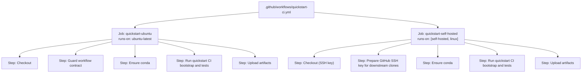
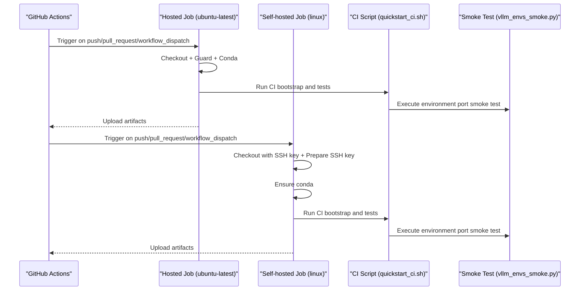
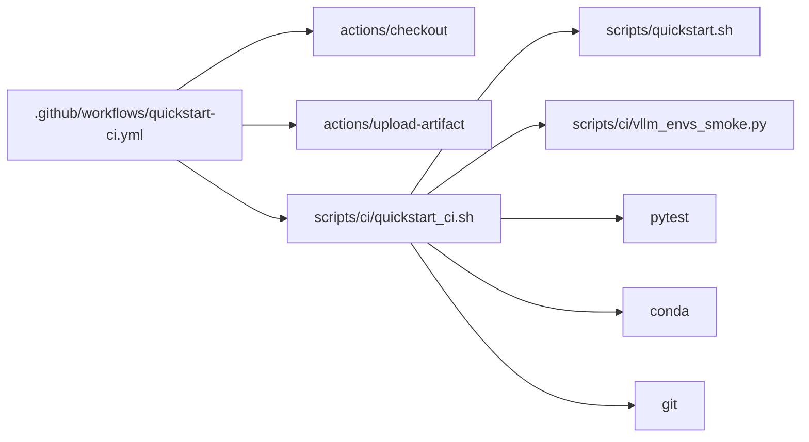

# GitHub Actions Configuration

<cite>
**Referenced Files in This Document**
- [.github/workflows/quickstart-ci.yml](file://.github/workflows/quickstart-ci.yml)
- [scripts/ci/quickstart_ci.sh](file://scripts/ci/quickstart_ci.sh)
- [scripts/ci/vllm_envs_smoke.py](file://scripts/ci/vllm_envs_smoke.py)
- [scripts/setup-github-actions-runner.sh](file://scripts/setup-github-actions-runner.sh)
- [scripts/quickstart.sh](file://scripts/quickstart.sh)
- [tests/test_quickstart_ci_workflow.py](file://tests/test_quickstart_ci_workflow.py)
- [README.md](file://README.md)
</cite>

## Table of Contents
1. [Introduction](#introduction)
2. [Project Structure](#project-structure)
3. [Core Components](#core-components)
4. [Architecture Overview](#architecture-overview)
5. [Detailed Component Analysis](#detailed-component-analysis)
6. [Dependency Analysis](#dependency-analysis)
7. [Performance Considerations](#performance-considerations)
8. [Troubleshooting Guide](#troubleshooting-guide)
9. [Conclusion](#conclusion)

## Introduction
This document explains the GitHub Actions CI/CD configuration for the VLLM-HUST project, focusing on the Quickstart CI workflow. It covers triggers, job scheduling, runner selection, dual-job architecture (ubuntu-latest and self-hosted), checkout and artifact management, environment variables, secrets, conditional execution, and optimization strategies. It also highlights differences between hosted and self-hosted runners, SSH key setup for private repositories, and caching strategies.

## Project Structure
The CI configuration centers around a single workflow file that defines two jobs:
- A hosted job running on ubuntu-latest
- A self-hosted job targeting self-hosted runners

Key supporting scripts and tests:
- CI orchestration script that executes the bootstrapping and smoke tests
- A Python smoke test for environment port configuration
- A runner installation script for setting up rootless self-hosted runners
- Tests that statically validate workflow correctness and behavior

**Diagram sources**
- [.github/workflows/quickstart-ci.yml:13-149](file://.github/workflows/quickstart-ci.yml#L13-L149)

**Section sources**
- [.github/workflows/quickstart-ci.yml:1-149](file://.github/workflows/quickstart-ci.yml#L1-L149)

## Core Components
- Workflow triggers: push to main, pull_request, and workflow_dispatch
- Permissions: read access to repository contents
- Jobs:
  - quickstart-ubuntu: hosted runner with shorter timeout
  - quickstart-self-hosted: self-hosted runner with longer timeout and SSH key setup
- Steps:
  - Checkout with shallow fetch
  - Static guard checks against workflow changes
  - Conda availability and installation
  - CI bootstrap and smoke tests
  - Artifact upload retention

**Section sources**
- [.github/workflows/quickstart-ci.yml:3-149](file://.github/workflows/quickstart-ci.yml#L3-L149)

## Architecture Overview
The CI architecture follows a dual-job design:
- Hosted job validates workflow changes and runs a focused subset of tests
- Self-hosted job runs the full suite, including Ascend-related validations and SSH-based cloning

**Diagram sources**
- [.github/workflows/quickstart-ci.yml:13-149](file://.github/workflows/quickstart-ci.yml#L13-L149)
- [scripts/ci/quickstart_ci.sh:232-321](file://scripts/ci/quickstart_ci.sh#L232-L321)
- [scripts/ci/vllm_envs_smoke.py:43-69](file://scripts/ci/vllm_envs_smoke.py#L43-L69)

## Detailed Component Analysis

### Workflow Triggers and Permissions
- Triggers:
  - push to main branch
  - pull_request
  - workflow_dispatch (manual trigger)
- Permissions:
  - contents: read

These choices ensure automated validation on PRs and manual control for ad-hoc runs.

**Section sources**
- [.github/workflows/quickstart-ci.yml:3-12](file://.github/workflows/quickstart-ci.yml#L3-L12)

### Hosted Job (quickstart-ubuntu)
- Runner: ubuntu-latest
- Timeout: 90 minutes
- Working directory: vllm-hust-dev-hub
- Steps:
  - Checkout with shallow fetch and path mapping
  - Static guard test against workflow changes
  - Ensure conda is available (install if missing)
  - Run CI bootstrap and tests with environment variables
  - Upload artifacts with retention

Environment variables passed to the CI script:
- RUNNER_FLAVOR: ubuntu
- PYTHON_VERSION: 3.11
- INSTALL_SCOPE: core
- RESULTS_ROOT: workspace-relative path
- GITHUB_TOKEN: GitHub token for clones
- CI_GITHUB_TOKEN: Secret for private repository clones

**Section sources**
- [.github/workflows/quickstart-ci.yml:14-72](file://.github/workflows/quickstart-ci.yml#L14-L72)
- [scripts/ci/quickstart_ci.sh:10-26](file://scripts/ci/quickstart_ci.sh#L10-L26)

### Self-hosted Job (quickstart-self-hosted)
- Conditional: runs only when event is not pull_request
- Runner: [self-hosted, linux]
- Timeout: 150 minutes (longer for heavy tasks)
- Steps:
  - Checkout with SSH key from secrets
  - Prepare SSH key for downstream clones
  - Ensure conda is available
  - Run CI bootstrap and tests with environment variables
  - Upload artifacts with retention

Environment variables passed to the CI script:
- RUNNER_FLAVOR: self-hosted
- INSTALL_SCOPE: full
- GITHUB_TOKEN: empty (no PAT for SSH mode)
- CI_GITHUB_TOKEN: empty (no PAT for SSH mode)
- HUST_DEV_HUB_GIT_AUTH_MODE: ssh

Secrets used:
- VLLM_HUST_CI_SSH_PRIVATE_KEY: SSH private key for cloning private repositories

**Section sources**
- [.github/workflows/quickstart-ci.yml:73-149](file://.github/workflows/quickstart-ci.yml#L73-L149)

### CI Bootstrap and Smoke Tests (scripts/ci/quickstart_ci.sh)
Responsibilities:
- Prepare Git authentication for workspace repositories
- Bootstrap the environment using the quickstart script
- Run smoke tests:
  - Python interpreter presence
  - CLI presence and version resolution
  - Runtime checks for Ascend components
  - pytest-based tests for related repositories
  - Environment port configuration smoke test
  - Optional Ascend plugin validation on self-hosted runners

Key behaviors:
- Slugifies step names for artifact-friendly logging
- Writes structured results to TSV and a Markdown summary
- Handles signals and cleanup on exit
- Supports both HTTPS and SSH modes for cloning

**Section sources**
- [scripts/ci/quickstart_ci.sh:232-321](file://scripts/ci/quickstart_ci.sh#L232-L321)
- [scripts/ci/quickstart_ci.sh:146-159](file://scripts/ci/quickstart_ci.sh#L146-L159)
- [scripts/ci/quickstart_ci.sh:186-197](file://scripts/ci/quickstart_ci.sh#L186-L197)
- [scripts/ci/quickstart_ci.sh:208-216](file://scripts/ci/quickstart_ci.sh#L208-L216)

### Environment Port Smoke Test (scripts/ci/vllm_envs_smoke.py)
Purpose:
- Verify environment variable parsing for VLLM_PORT
- Validate error conditions and expected exceptions

Execution:
- Loaded dynamically by the CI script from the vllm-hust repository
- Ensures robustness of port configuration handling

**Section sources**
- [scripts/ci/vllm_envs_smoke.py:43-69](file://scripts/ci/vllm_envs_smoke.py#L43-L69)
- [scripts/ci/quickstart_ci.sh:208-216](file://scripts/ci/quickstart_ci.sh#L208-L216)

### Self-hosted Runner Setup (scripts/setup-github-actions-runner.sh)
Capabilities:
- Installs and registers a rootless GitHub Actions runner as a user systemd service
- Supports labels and groups for targeted job routing
- Provides commands for install, start, stop, restart, status, remove
- Writes a systemd user service unit and manages background runner mode fallback
- Prints hints for adding runs-on labels to workflows

Operational notes:
- Uses a configurable runner directory and work directory
- Supports disabling updates and preserving proxy environment
- Validates architecture and downloads the appropriate runner binary

**Section sources**
- [scripts/setup-github-actions-runner.sh:101-167](file://scripts/setup-github-actions-runner.sh#L101-L167)
- [scripts/setup-github-actions-runner.sh:251-281](file://scripts/setup-github-actions-runner.sh#L251-L281)
- [scripts/setup-github-actions-runner.sh:402-413](file://scripts/setup-github-actions-runner.sh#L402-L413)
- [scripts/setup-github-actions-runner.sh:453-465](file://scripts/setup-github-actions-runner.sh#L453-L465)

### Static Guard Tests (tests/test_quickstart_ci_workflow.py)
Purpose:
- Prevents regressions in CI workflow structure and behavior
- Verifies SSH guards in the self-hosted job
- Confirms the smoke test integration and environment port handling
- Validates Ascend runtime installation and repair logic in the quickstart script

Validation coverage:
- SSH key usage and environment variable overrides in the self-hosted job
- Smoke test invocation and environment port parsing logic
- Ascend runtime Python dependency installation and repair steps

**Section sources**
- [tests/test_quickstart_ci_workflow.py:35-50](file://tests/test_quickstart_ci_workflow.py#L35-L50)
- [tests/test_quickstart_ci_workflow.py:63-72](file://tests/test_quickstart_ci_workflow.py#L63-L72)
- [tests/test_quickstart_ci_workflow.py:73-96](file://tests/test_quickstart_ci_workflow.py#L73-L96)

## Dependency Analysis
- Workflow depends on:
  - actions/checkout for repository checkout
  - actions/upload-artifact for artifact publishing
  - Local scripts for CI orchestration and environment setup
- Scripts depend on:
  - quickstart.sh for environment bootstrap and repository setup
  - Conda for Python environment management
  - pytest for test execution
  - Git for repository operations

**Diagram sources**
- [.github/workflows/quickstart-ci.yml:25-61](file://.github/workflows/quickstart-ci.yml#L25-L61)
- [scripts/ci/quickstart_ci.sh:232-321](file://scripts/ci/quickstart_ci.sh#L232-L321)

**Section sources**
- [.github/workflows/quickstart-ci.yml:24-72](file://.github/workflows/quickstart-ci.yml#L24-L72)
- [scripts/ci/quickstart_ci.sh:232-321](file://scripts/ci/quickstart_ci.sh#L232-L321)

## Performance Considerations
- Shallow clone depth reduces bandwidth and speed
- Separate timeouts for hosted vs self-hosted jobs accommodate heavier workloads
- Artifacts retained for a short period to balance storage and debugging needs
- Conda installation deferred until needed to avoid unnecessary overhead
- Parallelizable components (e.g., pytest suites) can benefit from runner capacity

[No sources needed since this section provides general guidance]

## Troubleshooting Guide
Common issues and resolutions:
- Missing SSH key secret for self-hosted job:
  - Symptom: Checkout fails or subsequent clone steps fail
  - Resolution: Ensure VLLM_HUST_CI_SSH_PRIVATE_KEY is configured in repository secrets
- Conda not found in hosted job:
  - Symptom: CI attempts to install miniconda but fails
  - Resolution: Verify HOME/XDG cache/config paths and ensure writable workspace directories
- Long-running self-hosted job timing out:
  - Symptom: Job exits early despite sufficient resources
  - Resolution: Confirm timeout-minutes is set appropriately for self-hosted job
- Artifact upload failures:
  - Symptom: Upload-artifact step reports warnings
  - Resolution: Ensure RESULTS_ROOT is set and ci-results directory exists

**Section sources**
- [.github/workflows/quickstart-ci.yml:94-108](file://.github/workflows/quickstart-ci.yml#L94-L108)
- [scripts/ci/quickstart_ci.sh:146-159](file://scripts/ci/quickstart_ci.sh#L146-L159)

## Conclusion
The VLLM-HUST CI/CD pipeline uses a dual-job architecture to validate workflow correctness on hosted runners and execute comprehensive tests on self-hosted runners. The configuration emphasizes secure private repository access via SSH keys, robust environment bootstrapping, and structured artifact collection. By leveraging conditional execution, distinct timeouts, and static guard tests, the pipeline balances reliability and performance across hosted and self-hosted environments.