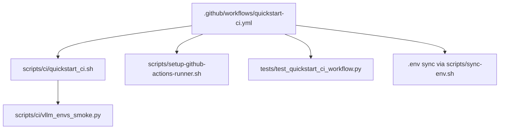
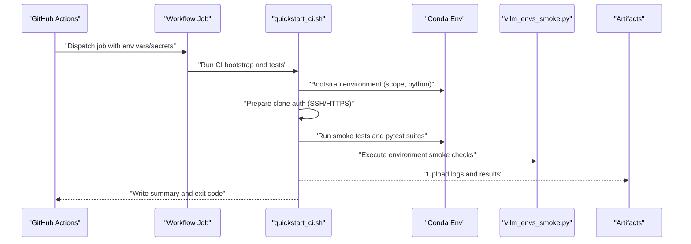
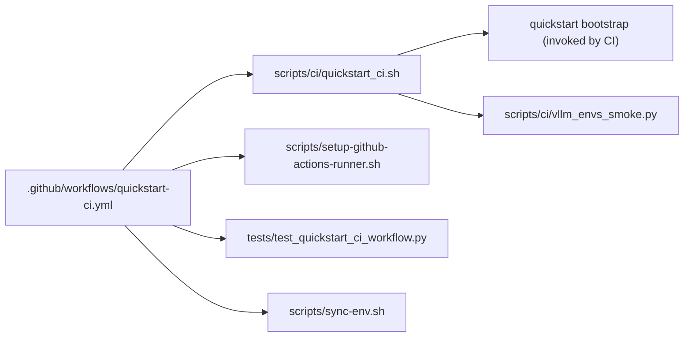

# Pipeline Customization

<cite>
**Referenced Files in This Document**
- [quickstart-ci.yml](file://.github/workflows/quickstart-ci.yml)
- [quickstart_ci.sh](file://scripts/ci/quickstart_ci.sh)
- [vllm_envs_smoke.py](file://scripts/ci/vllm_envs_smoke.py)
- [setup-github-actions-runner.sh](file://scripts/setup-github-actions-runner.sh)
- [test_quickstart_ci_workflow.py](file://tests/test_quickstart_ci_workflow.py)
- [sync-env.sh](file://scripts/sync-env.sh)
</cite>

## Table of Contents
1. [Introduction](#introduction)
2. [Project Structure](#project-structure)
3. [Core Components](#core-components)
4. [Architecture Overview](#architecture-overview)
5. [Detailed Component Analysis](#detailed-component-analysis)
6. [Dependency Analysis](#dependency-analysis)
7. [Performance Considerations](#performance-considerations)
8. [Troubleshooting Guide](#troubleshooting-guide)
9. [Conclusion](#conclusion)
10. [Appendices](#appendices)

## Introduction
This document explains how to customize the CI/CD pipeline for the VLLM-HUST system. It focuses on environment variable configuration, installation scope options (core vs full), runner flavor customization, parameter passing mechanisms, conditional execution logic, and job-specific configurations. It also covers integration with external systems, authentication token management, secret handling, and practical examples for test environments, timeouts, and resource allocation. Finally, it provides debugging techniques, log analysis, and performance optimization strategies tailored to different deployment scenarios, branch-specific configurations, and feature testing workflows.

## Project Structure
The CI pipeline is defined by a GitHub Actions workflow and orchestrated by a Bash script. Supporting scripts handle runner setup, environment synchronization, and smoke tests. The tests validate the workflow’s guardrails and expected behaviors.

**Diagram sources**
- [quickstart-ci.yml](file://.github/workflows/quickstart-ci.yml)
- [quickstart_ci.sh](file://scripts/ci/quickstart_ci.sh)
- [vllm_envs_smoke.py](file://scripts/ci/vllm_envs_smoke.py)
- [setup-github-actions-runner.sh](file://scripts/setup-github-actions-runner.sh)
- [test_quickstart_ci_workflow.py](file://tests/test_quickstart_ci_workflow.py)
- [sync-env.sh](file://scripts/sync-env.sh)

**Section sources**
- [quickstart-ci.yml](file://.github/workflows/quickstart-ci.yml)
- [quickstart_ci.sh](file://scripts/ci/quickstart_ci.sh)

## Core Components
- GitHub Actions Workflow: Defines jobs for Ubuntu runners and self-hosted runners, sets permissions, timeouts, and environment variables passed to the CI script.
- CI Bootstrap Script: Orchestrates environment preparation, optional Conda installation, cloning and installing repositories, running smoke tests, and collecting results.
- Smoke Test Script: Validates environment variable parsing and port resolution behavior for VLLM.
- Runner Setup Script: Installs and manages a rootless GitHub Actions self-hosted runner with configurable labels and service behavior.
- Guard Tests: Static checks validating workflow blocks, SSH guards, and script behaviors.

Key customization levers:
- Environment variables: RUNNER_FLAVOR, PYTHON_VERSION, INSTALL_SCOPE, RESULTS_ROOT, GITHUB_TOKEN, CI_GITHUB_TOKEN, HUST_DEV_HUB_GIT_AUTH_MODE.
- Job-level overrides: Different timeouts, labels, and secrets per job.
- Conditional logic: SSH vs HTTPS auth, plugin validation for self-hosted runners, and step skipping on failure.

**Section sources**
- [quickstart-ci.yml](file://.github/workflows/quickstart-ci.yml)
- [quickstart_ci.sh](file://scripts/ci/quickstart_ci.sh)
- [vllm_envs_smoke.py](file://scripts/ci/vllm_envs_smoke.py)
- [test_quickstart_ci_workflow.py](file://tests/test_quickstart_ci_workflow.py)

## Architecture Overview
The pipeline executes in two primary modes: hosted Ubuntu runners and self-hosted runners. The workflow dispatches jobs with environment variables and secrets, which the CI script consumes to tailor installation scope, Python version, and authentication strategy. Results are aggregated into logs and a summary Markdown file.

**Diagram sources**
- [quickstart-ci.yml](file://.github/workflows/quickstart-ci.yml)
- [quickstart_ci.sh](file://scripts/ci/quickstart_ci.sh)
- [vllm_envs_smoke.py](file://scripts/ci/vllm_envs_smoke.py)

## Detailed Component Analysis

### GitHub Actions Workflow (.github/workflows/quickstart-ci.yml)
- Triggers: push to main, pull_request, and manual workflow_dispatch.
- Permissions: read access to repository contents.
- Jobs:
  - quickstart-ubuntu: Hosted runner with shorter timeout, core install scope, and HTTPS token-based cloning.
  - quickstart-self-hosted: Self-hosted runner with extended timeout, full install scope, SSH-based cloning, and explicit empty tokens to enforce SSH mode.

Job-level customization highlights:
- Timeout-minutes: 90 for Ubuntu, 150 for self-hosted.
- Environment variables: RUNNER_FLAVOR, PYTHON_VERSION, INSTALL_SCOPE, RESULTS_ROOT, GITHUB_TOKEN, CI_GITHUB_TOKEN, HUST_DEV_HUB_GIT_AUTH_MODE.
- Secrets: VLLM_HUST_CLONE_TOKEN for HTTPS, VLLM_HUST_CI_SSH_PRIVATE_KEY for SSH.

Conditional execution:
- The self-hosted job uses an if condition excluding pull_request events.
- SSH preparation step ensures private key availability and configures known hosts.

Integration points:
- Artifacts upload captures ci-results for later inspection.
- Conda installation is ensured via a dedicated step.

**Section sources**
- [quickstart-ci.yml](file://.github/workflows/quickstart-ci.yml)

### CI Bootstrap Script (scripts/ci/quickstart_ci.sh)
Purpose and flow:
- Resolves environment variables (RUNNER_FLAVOR, PYTHON_VERSION, INSTALL_SCOPE, RESULTS_ROOT, GITHUB_TOKEN_FOR_CLONES, GITHUB_RUN_ID, GITHUB_RUN_ATTEMPT).
- Prepares clone authentication (HTTPS token rewrite or SSH mode).
- Bootstraps the environment using the quickstart script with install scope and Python version.
- Executes smoke tests and pytest suites, writing structured results to TSV and a Markdown summary.
- Handles cleanup and signal trapping for robustness.

Key mechanisms:
- Parameter passing: The script reads environment variables and passes them to the quickstart bootstrap and subsequent commands.
- Conditional execution:
  - Skips downstream steps if bootstrap fails.
  - Conditionally validates Ascend plugin presence only for self-hosted runners.
- Result aggregation: Logs are stored under RESULTS_DIR/logs and RESULTS_DIR/junit; a summary is generated and appended to GITHUB_STEP_SUMMARY if available.

Secret handling:
- Uses CI_GITHUB_TOKEN and GITHUB_TOKEN to configure HTTPS credentials for cloning.
- Honors HUST_DEV_HUB_GIT_AUTH_MODE to switch to SSH mode when configured.

Runner flavor logic:
- RUNNER_FLAVOR influences environment naming and conditional validations (e.g., plugin check for self-hosted).

**Section sources**
- [quickstart_ci.sh](file://scripts/ci/quickstart_ci.sh)

### Smoke Test Script (scripts/ci/vllm_envs_smoke.py)
- Loads the VLLM environment module dynamically and verifies port resolution behavior under various environment conditions.
- Ensures compatibility by mocking missing urllib3 components when necessary.
- Validates that invalid values produce appropriate errors and that valid numeric values are parsed correctly.

Use in pipeline:
- Executed by the CI script to validate environment setup without requiring external dependencies.

**Section sources**
- [vllm_envs_smoke.py](file://scripts/ci/vllm_envs_smoke.py)

### Runner Setup Script (scripts/setup-github-actions-runner.sh)
- Installs and configures a rootless GitHub Actions self-hosted runner as a user systemd service or background process.
- Supports command-line arguments and environment variables for URL, token, labels, and service configuration.
- Provides lifecycle controls: install, start, stop, restart, status, remove.
- Emits hints for adding matching runs-on labels to workflows.

Customization options:
- Labels: Comma-separated labels for targeting workflows.
- Version: Runner version selection.
- Proxy environment handling: Option to preserve proxy variables or strip them.

**Section sources**
- [setup-github-actions-runner.sh](file://scripts/setup-github-actions-runner.sh)

### Guard Tests (tests/test_quickstart_ci_workflow.py)
- Validates that the self-hosted job enforces SSH cloning and clears tokens appropriately.
- Confirms that the CI script supports SSH mode and uses the smoke test script for environment verification.
- Verifies quickstart behavior around Ascend runtime Python dependencies and Torch NPU runtime validation.

These tests act as static contracts ensuring the workflow remains secure and correct.

**Section sources**
- [test_quickstart_ci_workflow.py](file://tests/test_quickstart_ci_workflow.py)

## Dependency Analysis
The pipeline components depend on each other as follows:
- The workflow defines environment variables and secrets consumed by the CI script.
- The CI script depends on the quickstart bootstrap to provision the environment and on the smoke test script for environment validation.
- The runner setup script is independent but aligns with the self-hosted job’s expectations.

**Diagram sources**
- [quickstart-ci.yml](file://.github/workflows/quickstart-ci.yml)
- [quickstart_ci.sh](file://scripts/ci/quickstart_ci.sh)
- [vllm_envs_smoke.py](file://scripts/ci/vllm_envs_smoke.py)
- [setup-github-actions-runner.sh](file://scripts/setup-github-actions-runner.sh)
- [test_quickstart_ci_workflow.py](file://tests/test_quickstart_ci_workflow.py)
- [sync-env.sh](file://scripts/sync-env.sh)

**Section sources**
- [quickstart-ci.yml](file://.github/workflows/quickstart-ci.yml)
- [quickstart_ci.sh](file://scripts/ci/quickstart_ci.sh)

## Performance Considerations
- Conda solver tuning: The workflow sets a classic solver to improve dependency resolution predictability.
- Minimize redundant installs: Use INSTALL_SCOPE to reduce package installation overhead in CI.
- Artifact retention: Limit artifact retention to balance storage costs and debug needs.
- Timeouts: Adjust timeout-minutes per job to match workload characteristics (shorter for hosted, longer for self-hosted).
- Parallelism: Keep steps sequential in the CI script to simplify debugging; introduce parallelism only after establishing reliable baselines.

[No sources needed since this section provides general guidance]

## Troubleshooting Guide
Common issues and resolutions:
- Authentication failures:
  - Verify secrets are present and correctly scoped (VLLM_HUST_CLONE_TOKEN for HTTPS; VLLM_HUST_CI_SSH_PRIVATE_KEY for SSH).
  - Confirm HUST_DEV_HUB_GIT_AUTH_MODE is set appropriately; the CI script honors SSH mode when configured.
- Conda not found:
  - Ensure the Conda installation step runs and writes the executable path to GITHUB_PATH.
- Plugin validation:
  - On self-hosted runners, confirm the Ascend plugin is installed; the CI script conditionally validates it.
- Artifacts not uploaded:
  - Check the artifact step’s path and retention settings; ensure the RESULTS_ROOT directory exists and is populated.

Debugging techniques:
- Inspect logs under ci-results/<env-name>/logs for each step.
- Review the generated summary Markdown for step statuses and overall exit code.
- Tail the runner logs for self-hosted runners when investigating service issues.

Log analysis:
- Parse RESULTS_TSV to identify failing steps and correlate with step logs.
- Use GitHub Actions summaries to quickly assess outcomes across jobs.

Secret handling:
- Tokens are propagated via .env and synchronized to target repositories; ensure keys are present and correctly formatted.

**Section sources**
- [quickstart_ci.sh](file://scripts/ci/quickstart_ci.sh)
- [quickstart-ci.yml](file://.github/workflows/quickstart-ci.yml)
- [sync-env.sh](file://scripts/sync-env.sh)

## Conclusion
The VLLM-HUST CI/CD pipeline offers flexible customization through environment variables, job-level overrides, and conditional logic. By tuning RUNNER_FLAVOR, INSTALL_SCOPE, and authentication modes, teams can adapt the pipeline for diverse deployment scenarios. Robust secret handling, artifact collection, and logging support efficient debugging and performance optimization.

[No sources needed since this section summarizes without analyzing specific files]

## Appendices

### Environment Variables Reference
- RUNNER_FLAVOR: Flavor identifier influencing environment naming and conditional validations.
- PYTHON_VERSION: Python interpreter version used for the Conda environment.
- INSTALL_SCOPE: Installation scope controlling dependency breadth (core vs full).
- RESULTS_ROOT: Root directory for CI results and logs.
- GITHUB_TOKEN: Token for general GitHub operations.
- CI_GITHUB_TOKEN: Dedicated token for cloning repositories in CI.
- HUST_DEV_HUB_GIT_AUTH_MODE: Switch to SSH mode for cloning when set to ssh.
- GITHUB_RUN_ID/GITHUB_RUN_ATTEMPT: Used to construct deterministic environment names.

**Section sources**
- [quickstart_ci.sh](file://scripts/ci/quickstart_ci.sh)
- [quickstart-ci.yml](file://.github/workflows/quickstart-ci.yml)

### Example Customizations
- Customize test environments:
  - Set RUNNER_FLAVOR to differentiate self-hosted vs hosted environments.
  - Adjust PYTHON_VERSION to test against multiple Python versions.
- Modify timeout values:
  - Change timeout-minutes in the workflow job definition to accommodate longer-running self-hosted tasks.
- Adjust resource allocation:
  - Use runner labels and self-hosted runner configuration to select machines with desired CPU, memory, and GPU capabilities.
- Branch-specific configurations:
  - Gate self-hosted jobs using conditional expressions to avoid PR noise.
- Feature testing workflows:
  - Toggle INSTALL_SCOPE to run core tests first, then full tests on demand.

**Section sources**
- [quickstart-ci.yml](file://.github/workflows/quickstart-ci.yml)
- [setup-github-actions-runner.sh](file://scripts/setup-github-actions-runner.sh)

### Integration Points and Secret Handling
- Authentication:
  - HTTPS: Configure CI_GITHUB_TOKEN and GITHUB_TOKEN; the CI script rewrites URLs to use token-based authentication.
  - SSH: Provide VLLM_HUST_CI_SSH_PRIVATE_KEY; the workflow prepares known hosts and clears HTTPS tokens to enforce SSH.
- External systems:
  - Runner setup integrates with GitHub Actions runner service management and systemd user sessions.
- Secret propagation:
  - Use scripts/sync-env.sh to synchronize tokens from the dev-hub .env to sibling repositories.

**Section sources**
- [quickstart_ci.sh](file://scripts/ci/quickstart_ci.sh)
- [quickstart-ci.yml](file://.github/workflows/quickstart-ci.yml)
- [sync-env.sh](file://scripts/sync-env.sh)