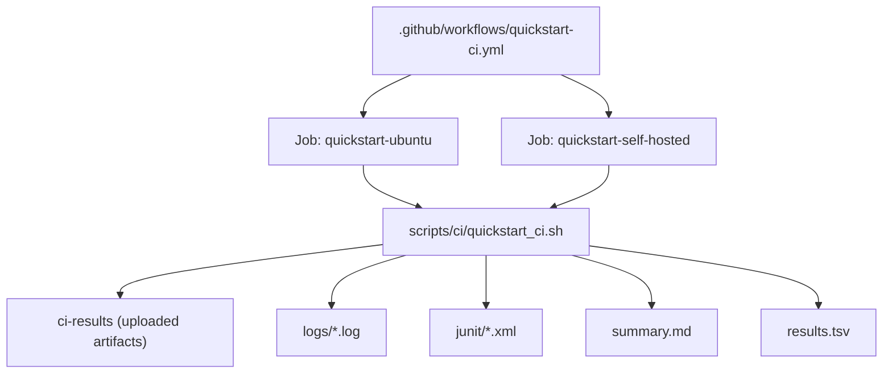
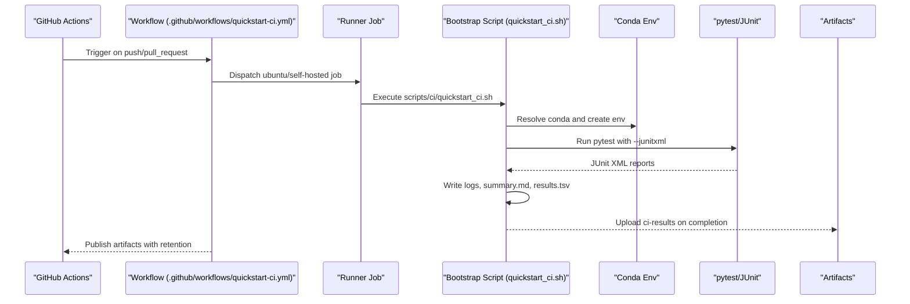
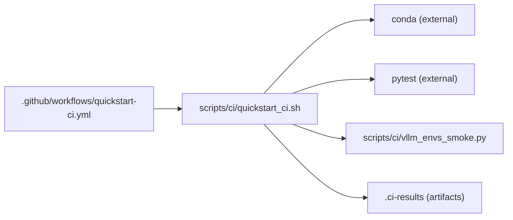

# Result Analysis and Reporting

<cite>
**Referenced Files in This Document**
- [README.md](file://README.md)
- [quickstart-ci.yml](file://.github/workflows/quickstart-ci.yml)
- [quickstart_ci.sh](file://scripts/ci/quickstart_ci.sh)
- [vllm_envs_smoke.py](file://scripts/ci/vllm_envs_smoke.py)
- [install_ascend_benchmark_root_helper.sh](file://scripts/ci/install_ascend_benchmark_root_helper.sh)
- [.gitignore](file://.gitignore)
</cite>

## Table of Contents
1. [Introduction](#introduction)
2. [Project Structure](#project-structure)
3. [Core Components](#core-components)
4. [Architecture Overview](#architecture-overview)
5. [Detailed Component Analysis](#detailed-component-analysis)
6. [Dependency Analysis](#dependency-analysis)
7. [Performance Considerations](#performance-considerations)
8. [Troubleshooting Guide](#troubleshooting-guide)
9. [Conclusion](#conclusion)
10. [Appendices](#appendices)

## Introduction
This document explains the CI/CD result analysis and reporting mechanisms implemented in the repository. It covers how CI results are collected, aggregated, and exported; how the CI results directory is structured; how logs and test outcomes are organized; and how to interpret results, identify failure patterns, and track regressions. It also documents artifact upload and retention policies, access controls, integration with external monitoring systems, notifications, and automated alerting. Finally, it outlines visualization options, historical trend analysis, and quality metrics reporting for stakeholders.

## Project Structure
The CI/CD result analysis and reporting pipeline centers around:
- A GitHub Actions workflow that orchestrates CI jobs on Ubuntu runners and self-hosted runners.
- A CI bootstrap script that creates a reproducible environment, executes smoke and test suites, and generates structured results.
- A smoke test script that validates environment assumptions for the vLLM project.
- Artifact upload and retention configured via the workflow.

**Diagram sources**
- [quickstart-ci.yml:1-149](file://.github/workflows/quickstart-ci.yml#L1-L149)
- [quickstart_ci.sh:1-321](file://scripts/ci/quickstart_ci.sh#L1-L321)

**Section sources**
- [README.md:1-288](file://README.md#L1-L288)
- [quickstart-ci.yml:1-149](file://.github/workflows/quickstart-ci.yml#L1-L149)

## Core Components
- CI workflow orchestration: Defines jobs for Ubuntu runners and self-hosted runners, sets environment variables, and uploads artifacts.
- CI bootstrap script: Creates a results directory tree, runs steps, captures logs, writes a summary, and produces a TSV of results.
- Smoke test script: Validates environment assumptions for vLLM port configuration and import behavior.
- Artifact upload and retention: Configured per job with a 14-day retention policy.

Key responsibilities:
- Artifact collection: Logs, JUnit XML reports, summary, and TSV.
- Result aggregation: TSV rows for each step with status and log path; summary table of steps.
- Data export formats: JUnit XML for test outcomes; Markdown summary; TSV for step-level status.
- Access controls: Artifacts are uploaded under the workflow’s permissions; retention governed by retention-days.

**Section sources**
- [quickstart-ci.yml:13-149](file://.github/workflows/quickstart-ci.yml#L13-L149)
- [quickstart_ci.sh:13-321](file://scripts/ci/quickstart_ci.sh#L13-L321)
- [vllm_envs_smoke.py:1-69](file://scripts/ci/vllm_envs_smoke.py#L1-L69)

## Architecture Overview
The CI pipeline follows a deterministic flow: checkout → environment preparation → bootstrap and tests → artifact upload. The bootstrap script organizes results into a structured directory and emits standardized outputs for downstream analysis.

**Diagram sources**
- [quickstart-ci.yml:24-72](file://.github/workflows/quickstart-ci.yml#L24-L72)
- [quickstart-ci.yml:86-148](file://.github/workflows/quickstart-ci.yml#L86-L148)
- [quickstart_ci.sh:161-321](file://scripts/ci/quickstart_ci.sh#L161-L321)

## Detailed Component Analysis

### CI Workflow Orchestration
- Triggers: Push to main, pull requests, and manual dispatch.
- Permissions: Read access to contents.
- Jobs:
  - quickstart-ubuntu: Runs on ubuntu-latest, sets RUNNER_FLAVOR=ubuntu, INSTALL_SCOPE=core, and uploads ci-results.
  - quickstart-self-hosted: Runs on self-hosted runners, sets RUNNER_FLAVOR=self-hosted, INSTALL_SCOPE=full, and uploads ci-results.
- Artifact upload: Always runs after jobs; retention-days set to 14; path includes ci-results.

Operational implications:
- Artifact visibility: Only visible to users with access to the workflow run; retention is 14 days.
- Environment isolation: Uses a dedicated .ci-home directory for conda cache/config and ensures miniconda availability.

**Section sources**
- [quickstart-ci.yml:1-149](file://.github/workflows/quickstart-ci.yml#L1-L149)

### CI Bootstrap Script (quickstart_ci.sh)
Responsibilities:
- Directory structure:
  - RESULTS_ROOT defaults to .ci-results; each run creates a subdirectory named by environment name derived from RUNNER_FLAVOR, GITHUB_RUN_ID, and GITHUB_RUN_ATTEMPT.
  - Subdirectories: logs/, junit/, summary.md, results.tsv.
- Step execution:
  - run_step(name, ...) executes a command, redirects output to logs/<slug>.log, appends a row to results.tsv with PASS/FAIL/SKIPPED and log path.
  - run_pytest_step(...) runs pytest with --junitxml in the target repository and stores JUnit XML in junit/.
  - run_vllm_hust_smoke_step(...) executes the smoke test script against the vLLM repository.
- Aggregation:
  - results.tsv: tab-separated rows of step name, status, and log path.
  - summary.md: human-readable summary with a table of steps and overall exit code.
- Cleanup:
  - cleanup_conda_env removes the conda environment on exit and records status in results.tsv.
- Failure handling:
  - On bootstrap failure, subsequent steps are skipped and recorded as SKIPPED.
  - Signal traps ensure cleanup and summary writing on SIGINT/SIGTERM.

Result parsing and performance extraction:
- JUnit XML files can be parsed by CI platforms or third-party tools to extract test counts, durations, and failure details.
- The TSV provides a compact index of step-level statuses and log locations for postmortem analysis.

Failure analysis techniques:
- Inspect logs/<slug>.log for the failing step.
- Review summary.md for a consolidated view of step outcomes.
- Use JUnit XML to identify failing tests and flaky patterns across runs.

Access controls and artifact retention:
- Artifacts are uploaded under the workflow’s permissions; retention is controlled by retention-days in the upload-artifact action.

**Section sources**
- [quickstart_ci.sh:10-31](file://scripts/ci/quickstart_ci.sh#L10-L31)
- [quickstart_ci.sh:32-45](file://scripts/ci/quickstart_ci.sh#L32-L45)
- [quickstart_ci.sh:69-99](file://scripts/ci/quickstart_ci.sh#L69-L99)
- [quickstart_ci.sh:101-126](file://scripts/ci/quickstart_ci.sh#L101-L126)
- [quickstart_ci.sh:161-197](file://scripts/ci/quickstart_ci.sh#L161-L197)
- [quickstart_ci.sh:208-216](file://scripts/ci/quickstart_ci.sh#L208-L216)
- [quickstart_ci.sh:232-318](file://scripts/ci/quickstart_ci.sh#L232-L318)

### Smoke Test Script (vllm_envs_smoke.py)
Purpose:
- Validates environment assumptions for vLLM port configuration and import behavior without requiring a live runtime.
- Exercises the vLLM envs module indirectly by importing and invoking a function that reads environment variables.

How it helps result analysis:
- Acts as a pre-check to ensure environment variables are handled correctly before running heavier tests.
- Outputs pass/fail deterministically, which can be captured in logs and reflected in the TSV.

**Section sources**
- [vllm_envs_smoke.py:1-69](file://scripts/ci/vllm_envs_smoke.py#L1-L69)

### Ascend Benchmark Root Helper Installer
Purpose:
- Delegates to the vllm-ascend-hust repository’s installer for Ascend benchmark root helper setup.
- Useful when Ascend-specific benchmarks are part of the CI scope.

**Section sources**
- [install_ascend_benchmark_root_helper.sh:1-18](file://scripts/ci/install_ascend_benchmark_root_helper.sh#L1-L18)

### CI Results Directory Structure
- Top-level: RESULTS_ROOT (default .ci-results).
- Per-run: RESULTS_DIR = RESULTS_ROOT/<env-name>.
- Subdirectories and files:
  - logs/: step logs named by slugified step names.
  - junit/: JUnit XML files produced by pytest runs.
  - summary.md: Markdown summary of the run.
  - results.tsv: Tab-separated record of step name, status, and log path.

Log file organization:
- Each step writes to logs/<slug>.log; filenames are derived from step names via a slugify function.
- Logs are appended to results.tsv with PASS/FAIL/SKIPPED and the log path.

Test outcome reporting:
- JUnit XML files are generated per pytest invocation and stored under junit/.

**Section sources**
- [quickstart_ci.sh:13-24](file://scripts/ci/quickstart_ci.sh#L13-L24)
- [quickstart_ci.sh:32-34](file://scripts/ci/quickstart_ci.sh#L32-L34)
- [quickstart_ci.sh:161-178](file://scripts/ci/quickstart_ci.sh#L161-L178)
- [quickstart_ci.sh:186-197](file://scripts/ci/quickstart_ci.sh#L186-L197)

### Artifact Upload and Retention Policies
- Upload occurs after each job regardless of step outcomes (always()).
- Path: ci-results.
- Retention: 14 days.
- Access: Controlled by the workflow’s permissions; artifacts are associated with the specific run.

**Section sources**
- [quickstart-ci.yml:63-72](file://.github/workflows/quickstart-ci.yml#L63-L72)
- [quickstart-ci.yml:140-149](file://.github/workflows/quickstart-ci.yml#L140-L149)

### Interpretation of Test Results and Failure Patterns
- TSV: Use step name, status, and log path to triage failures quickly.
- JUnit XML: Parse to extract test counts, durations, and failure messages for deeper analysis.
- summary.md: Provides a human-readable overview of the run and overall exit code.

Common failure patterns:
- Bootstrap failures: Lead to cascading SKIPPED steps; inspect logs for environment setup issues.
- Conda resolution failures: Often surfaced early in the bootstrap phase.
- Plugin/runtime checks: Failures here indicate missing or misconfigured platform plugins.

Regression tracking:
- Compare results.tsv across runs to detect recurring failures or flaky tests.
- Correlate JUnit XML outputs to identify regressions in specific test suites.

**Section sources**
- [quickstart_ci.sh:101-126](file://scripts/ci/quickstart_ci.sh#L101-L126)
- [quickstart_ci.sh:161-178](file://scripts/ci/quickstart_ci.sh#L161-L178)
- [quickstart_ci.sh:232-318](file://scripts/ci/quickstart_ci.sh#L232-L318)

### Integration with External Monitoring Systems, Notifications, and Alerting
- External monitoring systems: JUnit XML and logs can be ingested by CI/CD dashboards or test analytics platforms for trend analysis.
- Notifications: Configure GitHub Actions notifications or webhooks to alert on failures.
- Automated alerting: Use workflow conditions to trigger alerts on repeated failures or regressions detected via historical comparisons.

Note: The repository does not define specific external integrations; the above describes how to wire them using the emitted artifacts.

[No sources needed since this section provides general guidance]

### Result Visualization Options and Historical Trend Analysis
- Visualization: Use JUnit XML and logs to feed dashboards or static report generators.
- Historical trend analysis: Track results.tsv entries over time to compute pass rates, flakiness metrics, and failure hotspots.

[No sources needed since this section provides general guidance]

### Quality Metrics Reporting for Stakeholders
- Metrics: Pass rate, failure rate, number of skipped steps, average step duration (derived from logs), and test coverage from JUnit XML.
- Reporting: Share summary.md and aggregated statistics derived from results.tsv and JUnit outputs.

[No sources needed since this section provides general guidance]

## Dependency Analysis
The CI pipeline depends on:
- GitHub Actions for orchestration and artifact management.
- Conda for environment provisioning.
- pytest with JUnit XML output for test reporting.
- Internal scripts for smoke testing and optional Ascend benchmark setup.

**Diagram sources**
- [quickstart-ci.yml:49-61](file://.github/workflows/quickstart-ci.yml#L49-L61)
- [quickstart_ci.sh:186-197](file://scripts/ci/quickstart_ci.sh#L186-L197)
- [vllm_envs_smoke.py:1-69](file://scripts/ci/vllm_envs_smoke.py#L1-L69)

**Section sources**
- [quickstart-ci.yml:1-149](file://.github/workflows/quickstart-ci.yml#L1-L149)
- [quickstart_ci.sh:1-321](file://scripts/ci/quickstart_ci.sh#L1-L321)

## Performance Considerations
- Conda solver: The workflow sets a classic solver to improve predictability of dependency resolution.
- Environment isolation: Dedicated .ci-home directories prevent interference from user configurations.
- Artifact size: Keep ci-results minimal by excluding unnecessary files; the repository’s .gitignore already excludes certain directories.

**Section sources**
- [quickstart-ci.yml:39-47](file://.github/workflows/quickstart-ci.yml#L39-L47)
- [quickstart-ci.yml:115-123](file://.github/workflows/quickstart-ci.yml#L115-L123)
- [.gitignore:1-10](file://.gitignore#L1-L10)

## Troubleshooting Guide
- Bootstrap failures:
  - Symptom: Cascading SKIPPED steps.
  - Action: Inspect logs for environment setup issues; verify conda availability and network access.
- Conda environment cleanup:
  - The script attempts to remove the environment on exit; check cleanup logs for errors.
- JUnit XML missing:
  - Ensure pytest steps are executed and --junitxml is passed with a valid path.
- Artifact not found:
  - Verify upload-artifact step runs and path includes ci-results; confirm retention-days setting.

**Section sources**
- [quickstart_ci.sh:74-99](file://scripts/ci/quickstart_ci.sh#L74-L99)
- [quickstart_ci.sh:161-178](file://scripts/ci/quickstart_ci.sh#L161-L178)
- [quickstart_ci.sh:186-197](file://scripts/ci/quickstart_ci.sh#L186-L197)
- [quickstart-ci.yml:63-72](file://.github/workflows/quickstart-ci.yml#L63-L72)
- [quickstart-ci.yml:140-149](file://.github/workflows/quickstart-ci.yml#L140-L149)

## Conclusion
The repository’s CI/CD result analysis and reporting mechanism provides a robust, repeatable way to collect, aggregate, and export CI outcomes. By leveraging structured logs, JUnit XML, a Markdown summary, and a TSV index, teams can quickly triage failures, track regressions, and integrate with external monitoring systems. Artifacts are retained for 14 days and uploaded per run, ensuring traceability and auditability.

[No sources needed since this section summarizes without analyzing specific files]

## Appendices

### Appendix A: CI Results Directory Layout
- RESULTS_ROOT (default .ci-results)
  - RESULTS_DIR (per-run)
    - logs/
      - <slug>.log (step logs)
    - junit/
      - <suite>.xml (JUnit XML)
    - summary.md
    - results.tsv

**Section sources**
- [quickstart_ci.sh:13-24](file://scripts/ci/quickstart_ci.sh#L13-L24)

### Appendix B: Example Parsing Workflows
- JUnit parsing:
  - Load junit/<suite>.xml and extract test cases, failures, and durations for trend analysis.
- TSV parsing:
  - Iterate rows to compute pass/fail/skip counts and map to log paths for postmortem.
- Summary parsing:
  - Extract overall exit code and step table for human-readable reporting.

[No sources needed since this section provides general guidance]