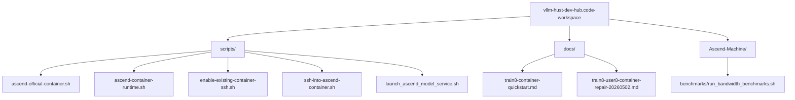
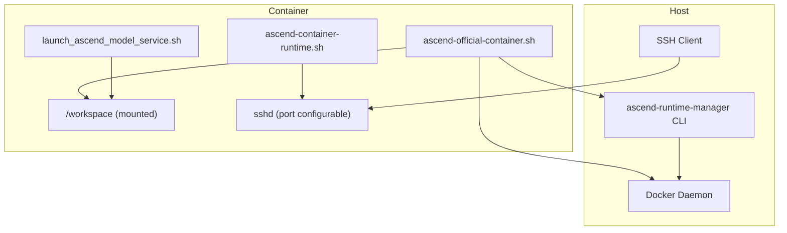
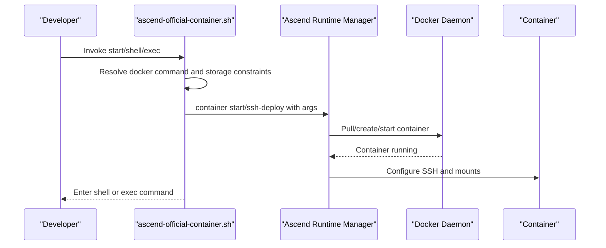
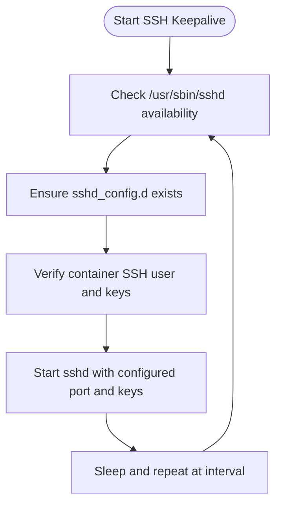
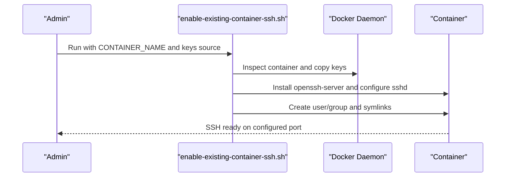
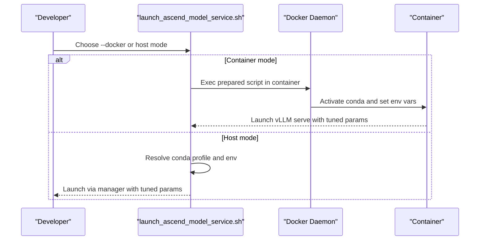
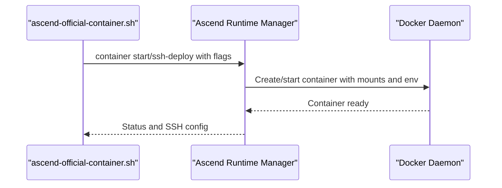
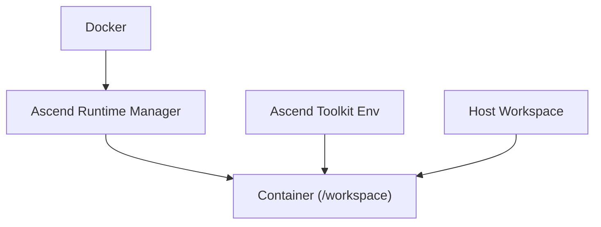

# Advanced Container Configuration

<cite>
**Referenced Files in This Document**
- [README.md](file://README.md)
- [train8-container-quickstart.md](file://docs/train8-container-quickstart.md)
- [train8-user8-container-repair-20260502.md](file://docs/train8-user8-container-repair-20260502.md)
- [vllm-hust-dev-hub.code-workspace](file://vllm-hust-dev-hub.code-workspace)
- [ascend-official-container.sh](file://scripts/ascend-official-container.sh)
- [ascend-container-runtime.sh](file://scripts/ascend-container-runtime.sh)
- [enable-existing-container-ssh.sh](file://scripts/enable-existing-container-ssh.sh)
- [ssh-into-ascend-container.sh](file://scripts/ssh-into-ascend-container.sh)
- [launch_ascend_model_service.sh](file://scripts/launch_ascend_model_service.sh)
- [run_bandwidth_benchmarks.sh](file://Ascend-Machine/benchmarks/run_bandwidth_benchmarks.sh)
</cite>

## Table of Contents
1. [Introduction](#introduction)
2. [Project Structure](#project-structure)
3. [Core Components](#core-components)
4. [Architecture Overview](#architecture-overview)
5. [Detailed Component Analysis](#detailed-component-analysis)
6. [Dependency Analysis](#dependency-analysis)
7. [Performance Considerations](#performance-considerations)
8. [Troubleshooting Guide](#troubleshooting-guide)
9. [Conclusion](#conclusion)
10. [Appendices](#appendices)

## Introduction
This document provides advanced container configuration guidance for the VLLM-HUST Development Hub with a focus on custom container settings, runtime optimization, and advanced workspace management. It explains how to customize container images, names, workspace roots, cache directories, and shared memory sizing; how to integrate with the Ascend runtime manager; and how to tune networking and resource allocation for optimal performance. It also covers advanced scenarios such as multi-container setups, custom workspace hierarchies, and performance optimization strategies grounded in the repository’s scripts and documentation.

## Project Structure
The VLLM-HUST Development Hub organizes container-related capabilities around a set of scripts and documentation that orchestrate the official Ascend container lifecycle, SSH access, and model service deployment. The VS Code workspace aggregates related repositories for cohesive development.

**Diagram sources**
- [vllm-hust-dev-hub.code-workspace:1-91](file://vllm-hust-dev-hub.code-workspace#L1-L91)
- [README.md:34-49](file://README.md#L34-L49)

**Section sources**
- [README.md:34-49](file://README.md#L34-L49)
- [vllm-hust-dev-hub.code-workspace:1-91](file://vllm-hust-dev-hub.code-workspace#L1-L91)

## Core Components
- Official Ascend container orchestrator: manages container creation, reuse, SSH enablement, and workspace mounting.
- Container SSH keepalive: maintains persistent SSH access inside containers.
- Existing container SSH enabler: adds SSH to already-running containers and symlinks workspace folders.
- Model service launcher: starts Ascend model services in host or container mode with runtime tuning.
- Documentation: baseline container networking, SSH, and troubleshooting procedures.

Key responsibilities:
- Image selection and pinning
- Workspace root and mount alignment
- Shared memory sizing
- SSH user/port configuration and authorized keys management
- Networking via host networking for HCCL compatibility
- Runtime environment propagation and cache isolation

**Section sources**
- [ascend-official-container.sh:11-386](file://scripts/ascend-official-container.sh#L11-L386)
- [ascend-container-runtime.sh:10-55](file://scripts/ascend-container-runtime.sh#L10-L55)
- [enable-existing-container-ssh.sh:10-172](file://scripts/enable-existing-container-ssh.sh#L10-L172)
- [launch_ascend_model_service.sh:50-680](file://scripts/launch_ascend_model_service.sh#L50-L680)
- [train8-container-quickstart.md:28-41](file://docs/train8-container-quickstart.md#L28-L41)

## Architecture Overview
The container configuration architecture integrates the official container orchestrator with the Ascend runtime manager, ensuring consistent device visibility, environment sourcing, and SSH access. The model service launcher operates in either host or container mode, selecting appropriate runtime paths and environment variables.

**Diagram sources**
- [ascend-official-container.sh:362-386](file://scripts/ascend-official-container.sh#L362-L386)
- [train8-container-quickstart.md:30-41](file://docs/train8-container-quickstart.md#L30-L41)
- [launch_ascend_model_service.sh:390-500](file://scripts/launch_ascend_model_service.sh#L390-L500)

## Detailed Component Analysis

### Official Ascend Container Orchestration
The official container orchestrator sets defaults for image, container name, workspace root, workdir, cache directory, shared memory size, and SSH parameters. It optionally relocates Docker data-root when storage constraints require it and can auto-enable container SSH by preparing authorized keys and passing SSH configuration to the runtime manager.

Implementation highlights:
- Defaults for container identity and mount points
- Shared memory sizing via shm-size
- SSH user/port and authorized keys source injection
- Optional Docker data-root relocation based on free space thresholds
- Delegation to the Ascend runtime manager for container lifecycle and SSH setup

**Diagram sources**
- [ascend-official-container.sh:340-386](file://scripts/ascend-official-container.sh#L340-L386)
- [train8-container-quickstart.md:84-92](file://docs/train8-container-quickstart.md#L84-L92)

**Section sources**
- [ascend-official-container.sh:11-386](file://scripts/ascend-official-container.sh#L11-L386)
- [train8-container-quickstart.md:65-92](file://docs/train8-container-quickstart.md#L65-L92)

### Container SSH Keepalive and Access
The container SSH keepalive script ensures the SSH daemon stays running inside the container with configurable user, port, authorized keys location, PID file, and log file. It periodically restarts the service if needed and exposes a health loop.

**Diagram sources**
- [ascend-container-runtime.sh:20-55](file://scripts/ascend-container-runtime.sh#L20-L55)

**Section sources**
- [ascend-container-runtime.sh:10-55](file://scripts/ascend-container-runtime.sh#L10-L55)

### Enabling SSH on Existing Containers
The existing container SSH enabler injects an SSH server into a running container, aligns user/group IDs with the host workspace ownership, copies authorized keys, writes minimal SSH configuration, and creates workspace symlinks for convenience.

**Diagram sources**
- [enable-existing-container-ssh.sh:58-172](file://scripts/enable-existing-container-ssh.sh#L58-L172)

**Section sources**
- [enable-existing-container-ssh.sh:10-172](file://scripts/enable-existing-container-ssh.sh#L10-L172)

### Model Service Launch and Runtime Tuning
The model service launcher supports host and container modes. In container mode, it activates the conda environment inside the container, sets Ascend/NPU environment variables, isolates caches, and launches vLLM with tunable parameters such as tensor parallel size, max model length, memory utilization, dtype, and quantization. It also disables preflight checks and custom kernel compilation when needed for stability.

**Diagram sources**
- [launch_ascend_model_service.sh:502-647](file://scripts/launch_ascend_model_service.sh#L502-L647)

**Section sources**
- [launch_ascend_model_service.sh:50-680](file://scripts/launch_ascend_model_service.sh#L50-L680)

### Ascend Runtime Manager Integration
The orchestrator delegates container lifecycle and SSH configuration to the Ascend runtime manager, passing container name, workspace roots, workdir, cache directory, and shared memory size. The manager ensures device and driver mounts, environment sourcing, and consistent behavior across deployments.

**Diagram sources**
- [ascend-official-container.sh:362-386](file://scripts/ascend-official-container.sh#L362-L386)

**Section sources**
- [ascend-official-container.sh:362-386](file://scripts/ascend-official-container.sh#L362-L386)

## Dependency Analysis
The container configuration relies on:
- Docker availability and permissions
- Ascend runtime manager for container lifecycle and SSH
- Host workspace layout for mounting and SSH user alignment
- Ascend toolkit environment sourcing for device visibility and library resolution

**Diagram sources**
- [ascend-official-container.sh:46-58](file://scripts/ascend-official-container.sh#L46-L58)
- [launch_ascend_model_service.sh:423-434](file://scripts/launch_ascend_model_service.sh#L423-L434)

**Section sources**
- [ascend-official-container.sh:46-58](file://scripts/ascend-official-container.sh#L46-L58)
- [launch_ascend_model_service.sh:423-434](file://scripts/launch_ascend_model_service.sh#L423-L434)

## Performance Considerations
- Host networking: The manager uses host networking by default to preserve HCCL and multi-NPU communication topology.
- Shared memory sizing: Tune shared memory via shm-size to accommodate large models and KV caches.
- Cache isolation: Use isolated cache and config directories inside the container to avoid interference and improve reproducibility.
- Kernel compilation: Disable custom kernel compilation when encountering preflight or JIT issues; rely on hardware-accelerated operators.
- Quantization presets: Use preset configurations for W8A8 or dense models to balance throughput and memory footprint.

**Section sources**
- [train8-container-quickstart.md:30-41](file://docs/train8-container-quickstart.md#L30-L41)
- [launch_ascend_model_service.sh:462-470](file://scripts/launch_ascend_model_service.sh#L462-L470)
- [launch_ascend_model_service.sh:440-447](file://scripts/launch_ascend_model_service.sh#L440-L447)
- [train8-container-quickstart.md:371-381](file://docs/train8-container-quickstart.md#L371-L381)

## Troubleshooting Guide
Common issues and resolutions:
- SSH connectivity: Verify container is running, sshd is started, and port is not occupied; regenerate host keys if conflicts occur.
- NPU visibility: Compare host and container npu-smi outputs; ensure device and driver mounts are intact.
- CANN version mismatch: Confirm container image tag and toolkit versions; switch to the documented baseline if necessary.
- HCCL/multi-card communication: Ensure host networking is preserved; verify HCCL toolchain and driver paths.
- Storage constraints: Migrate Docker data-root to a larger partition when needed; scripts can assist with relocation.

**Section sources**
- [train8-container-quickstart.md:264-343](file://docs/train8-container-quickstart.md#L264-L343)
- [train8-user8-container-repair-20260502.md:41-158](file://docs/train8-user8-container-repair-20260502.md#L41-L158)

## Conclusion
The VLLM-HUST Development Hub provides a robust, script-driven pipeline for advanced container configuration on Ascend platforms. By leveraging the official container orchestrator, runtime manager integration, and dedicated SSH management tools, teams can achieve reliable workspace mounting, consistent environment sourcing, and optimized runtime behavior. The included documentation and scripts offer practical guidance for customizing images, workspace roots, shared memory, and networking, along with proven troubleshooting workflows.

## Appendices

### Advanced Configuration Patterns
- Multi-container setups: Use distinct container names and SSH ports per workload; maintain separate workspace roots and cache directories.
- Custom workspace hierarchies: Align container workspace root with host workspace ownership to avoid permission issues; leverage symlinks for convenient access.
- Resource allocation: Adjust shm-size and cache directories per workload; isolate logs and temporary files to prevent contention.
- Networking: Prefer host networking for distributed training and HCCL; configure SSH ProxyJump for restricted networks.

**Section sources**
- [ascend-official-container.sh:11-22](file://scripts/ascend-official-container.sh#L11-L22)
- [train8-container-quickstart.md:131-168](file://docs/train8-container-quickstart.md#L131-L168)
- [enable-existing-container-ssh.sh:10-172](file://scripts/enable-existing-container-ssh.sh#L10-L172)