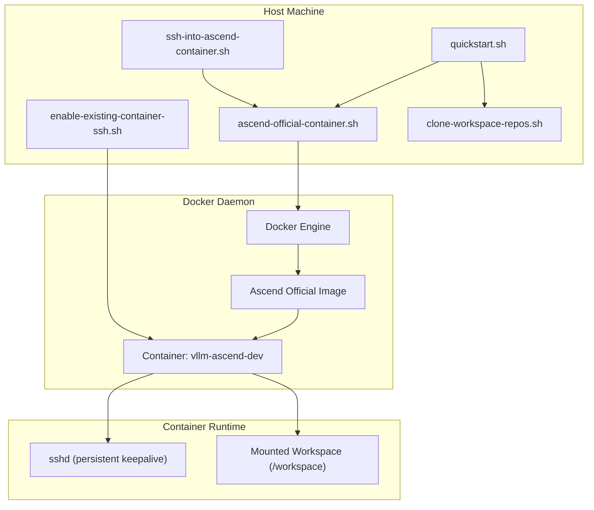
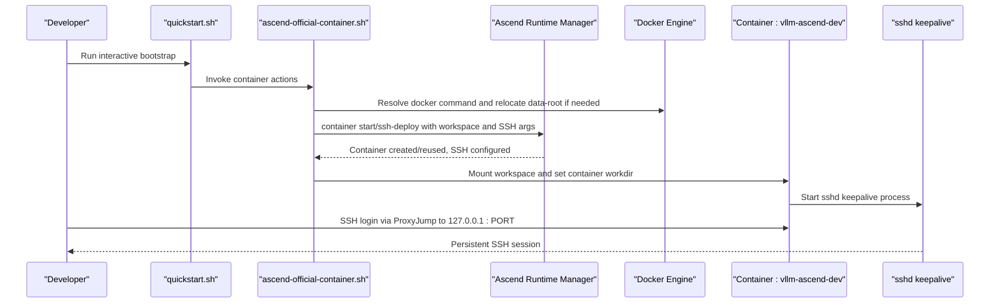
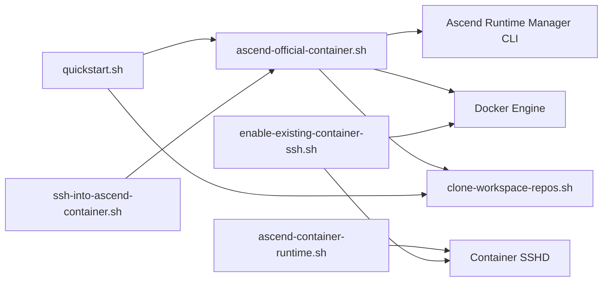

# Container Management

<cite>
**Referenced Files in This Document**
- [ascend-container-runtime.sh](file://scripts/ascend-container-runtime.sh)
- [ascend-official-container.sh](file://scripts/ascend-official-container.sh)
- [enable-existing-container-ssh.sh](file://scripts/enable-existing-container-ssh.sh)
- [ssh-into-ascend-container.sh](file://scripts/ssh-into-ascend-container.sh)
- [clone-workspace-repos.sh](file://scripts/clone-workspace-repos.sh)
- [quickstart.sh](file://scripts/quickstart.sh)
- [README.md](file://README.md)
- [train8-container-quickstart.md](file://docs/train8-container-quickstart.md)
- [team-onboarding.md](file://docs/team-onboarding.md)
</cite>

## Table of Contents
1. [Introduction](#introduction)
2. [Project Structure](#project-structure)
3. [Core Components](#core-components)
4. [Architecture Overview](#architecture-overview)
5. [Detailed Component Analysis](#detailed-component-analysis)
6. [Dependency Analysis](#dependency-analysis)
7. [Performance Considerations](#performance-considerations)
8. [Troubleshooting Guide](#troubleshooting-guide)
9. [Conclusion](#conclusion)

## Introduction
This document explains container management within the VLLM-HUST Development Hub with a focus on Ascend Docker containers. It covers the lifecycle of the official Ascend container, automated SSH configuration, and workspace mounting. It also documents configuration options, environment variables, and return values, and explains how the scripts integrate with Docker orchestration and the Ascend runtime manager. Practical examples are linked to concrete code paths to help both beginners and experienced developers adopt reliable remote development workflows.

## Project Structure
The container management functionality centers on a set of Bash scripts and documentation that coordinate:
- Official Ascend container lifecycle and SSH enablement
- Workspace mounting and repository synchronization
- Docker data-root relocation for constrained environments
- SSH access automation and persistent keepalive

**Diagram sources**
- [ascend-official-container.sh:330-386](file://scripts/ascend-official-container.sh#L330-L386)
- [ascend-container-runtime.sh:20-55](file://scripts/ascend-container-runtime.sh#L20-L55)
- [enable-existing-container-ssh.sh:58-172](file://scripts/enable-existing-container-ssh.sh#L58-L172)
- [ssh-into-ascend-container.sh:12-14](file://scripts/ssh-into-ascend-container.sh#L12-L14)
- [clone-workspace-repos.sh:1-466](file://scripts/clone-workspace-repos.sh#L1-L466)

**Section sources**
- [README.md:34-50](file://README.md#L34-L50)
- [README.md:228-241](file://README.md#L228-L241)

## Core Components
- Official container launcher and orchestrator:
  - Orchestrates container creation/reuse, workspace mounting, and SSH enablement.
  - Integrates with the Ascend runtime manager for container lifecycle and SSH deployment.
  - Provides non-interactive and interactive modes, with automatic Docker data-root relocation when needed.
- SSH keepalive runtime:
  - Ensures the container’s SSH daemon remains healthy and restarts it as needed.
  - Configurable via environment variables for user, port, authorized keys, PID, and log files.
- SSH enablement for existing containers:
  - Installs OpenSSH server inside a running container, sets up user/group, configures PAM, and exposes repos under the user’s home for convenient access.
- SSH entrypoint:
  - Helper to enter a running container via SSH using a ProxyJump-friendly alias.
- Workspace repository synchronization:
  - Parallel cloning and updating of common workspace repositories with robust retry and fallback logic.

**Section sources**
- [ascend-official-container.sh:330-386](file://scripts/ascend-official-container.sh#L330-L386)
- [ascend-container-runtime.sh:20-55](file://scripts/ascend-container-runtime.sh#L20-L55)
- [enable-existing-container-ssh.sh:58-172](file://scripts/enable-existing-container-ssh.sh#L58-L172)
- [ssh-into-ascend-container.sh:12-14](file://scripts/ssh-into-ascend-container.sh#L12-L14)
- [clone-workspace-repos.sh:1-466](file://scripts/clone-workspace-repos.sh#L1-L466)

## Architecture Overview
The container management architecture ties together host orchestration, Docker, and container runtime services:

**Diagram sources**
- [quickstart.sh:238-276](file://scripts/quickstart.sh#L238-L276)
- [ascend-official-container.sh:348-386](file://scripts/ascend-official-container.sh#L348-L386)
- [train8-container-quickstart.md:67-130](file://docs/train8-container-quickstart.md#L67-L130)

## Detailed Component Analysis

### Official Ascend Container Launcher
Responsibilities:
- Detect and resolve Docker availability (direct or via sudo).
- Optionally relocate Docker data-root to a larger disk when needed.
- Prepare SSH configuration for the container (auto-enabled when host keys are present).
- Delegate container lifecycle to the Ascend runtime manager with workspace and SSH parameters.
- Provide non-interactive mode via environment variables.

Key behaviors:
- Environment-driven configuration for container name, workspace roots, ports, and SSH user.
- Automatic discovery of host SSH keys and generation of container authorized_keys source.
- Passing extra arguments to the manager for SSH user/port and authorized_keys source.

Return values and effects:
- Returns non-zero on Docker resolution failure or relocation errors.
- On success, the manager command is executed with collected arguments.

Operational notes:
- Uses a Python interpreter discovered on the host to probe Docker daemon configuration.
- Supports non-interactive operation via environment flags.

**Section sources**
- [ascend-official-container.sh:46-90](file://scripts/ascend-official-container.sh#L46-L90)
- [ascend-official-container.sh:108-217](file://scripts/ascend-official-container.sh#L108-L217)
- [ascend-official-container.sh:219-301](file://scripts/ascend-official-container.sh#L219-L301)
- [ascend-official-container.sh:303-328](file://scripts/ascend-official-container.sh#L303-L328)
- [ascend-official-container.sh:330-386](file://scripts/ascend-official-container.sh#L330-L386)

### SSH Keepalive Runtime
Responsibilities:
- Ensure the container’s SSH daemon is running and healthy.
- Configure sshd with user, port, authorized keys, and logging.
- Periodically restart sshd if configuration or process state changes.

Key behaviors:
- Validates prerequisites (sshd binary presence).
- Creates required runtime directories.
- Starts sshd with a dedicated config file and PID/log paths.
- Runs a loop to continuously monitor and restart sshd.

Environment variables:
- CONTAINER_SSH_USER: SSH user to allow.
- CONTAINER_SSH_PORT: Port to bind sshd to.
- CONTAINER_SSH_AUTHORIZED_KEYS: Authorized keys file path.
- CONTAINER_SSH_PIDFILE: PID file location.
- CONTAINER_SSH_LOGFILE: Log file location.
- CONTAINER_SSH_HEALTH_INTERVAL: Sleep interval between health checks.

**Section sources**
- [ascend-container-runtime.sh:10-19](file://scripts/ascend-container-runtime.sh#L10-L19)
- [ascend-container-runtime.sh:20-55](file://scripts/ascend-container-runtime.sh#L20-L55)

### SSH Enablement for Existing Containers
Responsibilities:
- Install OpenSSH server inside a running container (online or offline packages).
- Create a user/group matching host UID/GID for seamless workspace write access.
- Configure sshd with a dedicated port and PAM settings.
- Symlink mounted repositories into the user’s home for easy navigation.

Key behaviors:
- Resolves Docker command availability.
- Copies authorized_keys into the container and sets secure ownership.
- Installs OpenSSH server using online package manager or offline .deb packages.
- Writes a minimal sshd config and starts the service.

Return values and effects:
- Exits with non-zero on Docker unavailability, container absence, or missing authorized_keys.
- On success, sshd is configured and running on the specified port.

**Section sources**
- [enable-existing-container-ssh.sh:27-60](file://scripts/enable-existing-container-ssh.sh#L27-L60)
- [enable-existing-container-ssh.sh:65-85](file://scripts/enable-existing-container-ssh.sh#L65-L85)
- [enable-existing-container-ssh.sh:89-148](file://scripts/enable-existing-container.sh#L89-L148)
- [enable-existing-container-ssh.sh:150-168](file://scripts/enable-existing-container-ssh.sh#L150-L168)

### SSH Entrypoint Into Running Container
Responsibilities:
- Provide a convenience wrapper to enter a running container via SSH using a ProxyJump-friendly alias.

Behavior:
- Sets environment variables for host workspace root and container name.
- Executes the official container launcher in shell mode.

**Section sources**
- [ssh-into-ascend-container.sh:12-14](file://scripts/ssh-into-ascend-container.sh#L12-L14)

### Workspace Repository Synchronization
Responsibilities:
- Clone and update common workspace repositories in parallel.
- Respect existing Git repositories and handle non-Git directories with backups.
- Support SSH and HTTPS fallbacks for cloning and fetching.

Key behaviors:
- Builds a robust GIT_SSH_COMMAND with host identity and known_hosts handling.
- Queues clone jobs with configurable concurrency.
- Applies exponential backoff on transient failures.
- Handles reference repositories separately and confirms interactive cloning.

**Section sources**
- [clone-workspace-repos.sh:19-55](file://scripts/clone-workspace-repos.sh#L19-L55)
- [clone-workspace-repos.sh:260-279](file://scripts/clone-workspace-repos.sh#L260-L279)
- [clone-workspace-repos.sh:281-370](file://scripts/clone-workspace-repos.sh#L281-L370)
- [clone-workspace-repos.sh:406-466](file://scripts/clone-workspace-repos.sh#L406-L466)

## Dependency Analysis
High-level dependencies:
- The official launcher depends on Docker availability and optionally relocates Docker data-root.
- The launcher delegates container lifecycle and SSH deployment to the Ascend runtime manager.
- The keepalive runtime depends on sshd presence and configuration files.
- The existing container SSH enablement depends on Docker exec and container inspection.
- The SSH entrypoint depends on the official launcher and a running container.

**Diagram sources**
- [ascend-official-container.sh:348-386](file://scripts/ascend-official-container.sh#L348-L386)
- [ascend-container-runtime.sh:20-55](file://scripts/ascend-container-runtime.sh#L20-L55)
- [enable-existing-container-ssh.sh:58-172](file://scripts/enable-existing-container-ssh.sh#L58-L172)
- [ssh-into-ascend-container.sh:12-14](file://scripts/ssh-into-ascend-container.sh#L12-L14)
- [quickstart.sh:238-276](file://scripts/quickstart.sh#L238-L276)

**Section sources**
- [README.md:228-241](file://README.md#L228-L241)
- [train8-container-quickstart.md:100-130](file://docs/train8-container-quickstart.md#L100-L130)

## Performance Considerations
- Parallel repository cloning reduces total bootstrap time; tune concurrency via an environment variable.
- Docker data-root relocation avoids repeated pulls on constrained disks.
- Persistent SSH keepalive minimizes connection drops and ensures reliable remote development.

[No sources needed since this section provides general guidance]

## Troubleshooting Guide

Common issues and resolutions:
- SSH connectivity problems:
  - Verify container is running and sshd is started.
  - Check for port conflicts and host key mismatches; regenerate cached entries if needed.
  - Confirm SSH alias uses ProxyJump to reach 127.0.0.1 on the configured port.
- Workspace access denied:
  - Ensure the container SSH user UID/GID matches the mounted workspace ownership.
  - Re-run the SSH enablement helper to recreate user/group and symlinks.
- Docker data-root space constraints:
  - Use the built-in relocation logic to move Docker data-root to a larger partition.
- Container networking and distributed training:
  - Ensure the container uses host networking as recommended to preserve HCCL and multi-NPU communication.
- Repository sync failures:
  - Retry with HTTPS fallback when SSH auth is unavailable.
  - Increase verbosity and inspect logs for transient network errors.

**Section sources**
- [train8-container-quickstart.md:264-343](file://docs/train8-container-quickstart.md#L264-L343)
- [enable-existing-container-ssh.sh:119-168](file://scripts/enable-existing-container-ssh.sh#L119-L168)
- [ascend-official-container.sh:108-217](file://scripts/ascend-official-container.sh#L108-L217)
- [clone-workspace-repos.sh:66-86](file://scripts/clone-workspace-repos.sh#L66-L86)

## Conclusion
The VLLM-HUST Development Hub provides a cohesive, script-driven workflow for Ascend containerization, SSH automation, and workspace mounting. By leveraging the official launcher, keepalive runtime, and helper scripts, teams can reliably provision containers, enable SSH access, and maintain productive remote development sessions. The included documentation and scripts minimize operational friction and support both interactive and non-interactive usage patterns.