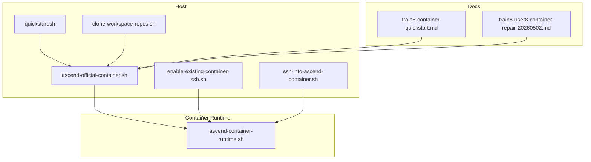
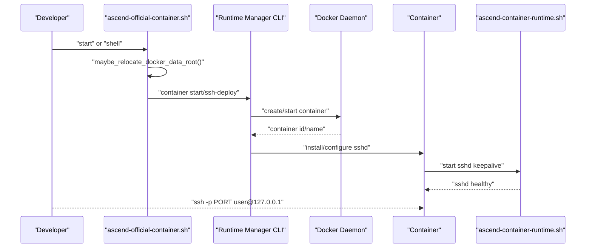
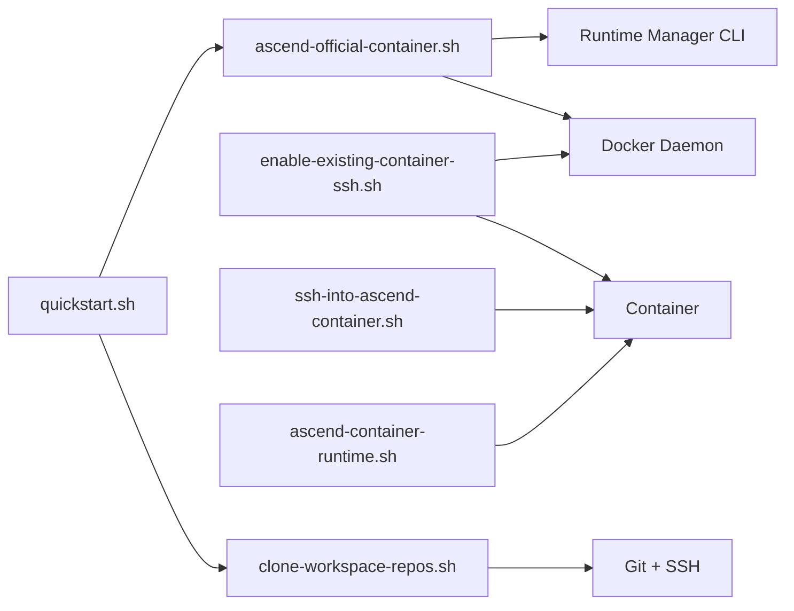

# Container Troubleshooting

<cite>
**Referenced Files in This Document**
- [ascend-official-container.sh](file://scripts/ascend-official-container.sh)
- [enable-existing-container-ssh.sh](file://scripts/enable-existing-container-ssh.sh)
- [ssh-into-ascend-container.sh](file://scripts/ssh-into-ascend-container.sh)
- [ascend-container-runtime.sh](file://scripts/ascend-container-runtime.sh)
- [clone-workspace-repos.sh](file://scripts/clone-workspace-repos.sh)
- [quickstart.sh](file://scripts/quickstart.sh)
- [train8-container-quickstart.md](file://docs/train8-container-quickstart.md)
- [train8-user8-container-repair-20260502.md](file://docs/train8-user8-container-repair-20260502.md)
</cite>

## Table of Contents
1. [Introduction](#introduction)
2. [Project Structure](#project-structure)
3. [Core Components](#core-components)
4. [Architecture Overview](#architecture-overview)
5. [Detailed Component Analysis](#detailed-component-analysis)
6. [Dependency Analysis](#dependency-analysis)
7. [Performance Considerations](#performance-considerations)
8. [Troubleshooting Guide](#troubleshooting-guide)
9. [Conclusion](#conclusion)

## Introduction
This document provides comprehensive troubleshooting guidance for container management issues within the VLLM-HUST Development Hub. It focuses on container lifecycle, SSH connectivity, workspace mounting, and Docker integration. It includes diagnostic procedures, configuration validation, Docker daemon status checks, container health verification, and practical recovery steps for common problems such as insufficient disk space, Docker data-root relocation, and container networking anomalies.

## Project Structure
The container management system centers around a small set of Bash scripts and documentation that orchestrate Docker-based Ascend development environments. Key elements:
- Official container lifecycle and SSH enablement: scripts/ascend-official-container.sh
- Enabling SSH on an already-running container: scripts/enable-existing-container-ssh.sh
- SSH entrypoint into a running container: scripts/ssh-into-ascend-container.sh
- Container-side SSH keepalive: scripts/ascend-container-runtime.sh
- Workspace repository cloning and synchronization: scripts/clone-workspace-repos.sh
- Quickstart automation and environment setup: scripts/quickstart.sh
- Operational guides and repair records: docs/train8-container-quickstart.md, docs/train8-user8-container-repair-20260502.md

**Diagram sources**
- [ascend-official-container.sh:1-388](file://scripts/ascend-official-container.sh#L1-L388)
- [enable-existing-container-ssh.sh:1-172](file://scripts/enable-existing-container-ssh.sh#L1-L172)
- [ssh-into-ascend-container.sh:1-14](file://scripts/ssh-into-ascend-container.sh#L1-L14)
- [ascend-container-runtime.sh:1-55](file://scripts/ascend-container-runtime.sh#L1-L55)
- [clone-workspace-repos.sh:1-466](file://scripts/clone-workspace-repos.sh#L1-L466)
- [quickstart.sh:1-800](file://scripts/quickstart.sh#L1-L800)
- [train8-container-quickstart.md:1-404](file://docs/train8-container-quickstart.md#L1-L404)
- [train8-user8-container-repair-20260502.md:1-222](file://docs/train8-user8-container-repair-20260502.md#L1-L222)

**Section sources**
- [ascend-official-container.sh:1-388](file://scripts/ascend-official-container.sh#L1-L388)
- [enable-existing-container-ssh.sh:1-172](file://scripts/enable-existing-container-ssh.sh#L1-L172)
- [ssh-into-ascend-container.sh:1-14](file://scripts/ssh-into-ascend-container.sh#L1-L14)
- [ascend-container-runtime.sh:1-55](file://scripts/ascend-container-runtime.sh#L1-L55)
- [clone-workspace-repos.sh:1-466](file://scripts/clone-workspace-repos.sh#L1-L466)
- [quickstart.sh:1-800](file://scripts/quickstart.sh#L1-L800)
- [train8-container-quickstart.md:1-404](file://docs/train8-container-quickstart.md#L1-L404)
- [train8-user8-container-repair-20260502.md:1-222](file://docs/train8-user8-container-repair-20260502.md#L1-L222)

## Core Components
- Container lifecycle controller: Orchestrates creation, reuse, and shell/exec of the official Ascend container via the runtime manager CLI. Handles Docker data-root relocation and SSH enablement decisions.
- SSH enablement for existing containers: Installs and configures OpenSSH inside a running container, aligns user ownership with workspace mounts, and sets up authorized keys.
- SSH entrypoint: Provides a convenient way to SSH into a running container using a local shell wrapper.
- Container-side SSH keepalive: Ensures the SSH service stays healthy inside the container.
- Workspace cloning: Parallelizes repository cloning with robust retry and fallback logic, and handles Git SSH identity selection.
- Quickstart automation: Guides environment setup, conda management, and container creation with interactive menus and optional SSH key injection.

**Section sources**
- [ascend-official-container.sh:330-386](file://scripts/ascend-official-container.sh#L330-L386)
- [enable-existing-container-ssh.sh:58-172](file://scripts/enable-existing-container-ssh.sh#L58-L172)
- [ssh-into-ascend-container.sh:10-14](file://scripts/ssh-into-ascend-container.sh#L10-L14)
- [ascend-container-runtime.sh:20-54](file://scripts/ascend-container-runtime.sh#L20-L54)
- [clone-workspace-repos.sh:260-370](file://scripts/clone-workspace-repos.sh#L260-L370)
- [quickstart.sh:112-135](file://scripts/quickstart.sh#L112-L135)

## Architecture Overview
The system integrates host-side orchestration with container-side runtime services:
- Host scripts detect Docker availability, validate configuration, and invoke the runtime manager to manage the container.
- The container runs a persistent SSH process controlled by a dedicated runtime script.
- Workspace repositories are synchronized locally and mounted into the container for development.

**Diagram sources**
- [ascend-official-container.sh:108-217](file://scripts/ascend-official-container.sh#L108-L217)
- [ascend-official-container.sh:362-385](file://scripts/ascend-official-container.sh#L362-L385)
- [ascend-container-runtime.sh:20-54](file://scripts/ascend-container-runtime.sh#L20-L54)

## Detailed Component Analysis

### Container Lifecycle Controller (ascend-official-container.sh)
Responsibilities:
- Detect Docker availability and permissions.
- Optionally relocate Docker data-root to a larger partition (/data) when space is low.
- Prepare SSH configuration for the container and suggest login commands.
- Delegate actions to the runtime manager CLI with environment-driven parameters.

Key diagnostics:
- Verify Docker availability and root dir: [docker_root_dir:60-63](file://scripts/ascend-official-container.sh#L60-L63), [docker_daemon_data_root:70-90](file://scripts/ascend-official-container.sh#L70-L90).
- Confirm free space thresholds and trigger relocation: [maybe_relocate_docker_data_root:108-217](file://scripts/ascend-official-container.sh#L108-L217).
- Build manager command with container parameters: [main:362-385](file://scripts/ascend-official-container.sh#L362-L385).

Operational tips:
- Use environment variables to override defaults (e.g., IMAGE, CONTAINER_NAME, CONTAINER_WORKSPACE_ROOT).
- For non-interactive deployments, set VLLM_HUST_ASCEND_CONTAINER_NON_INTERACTIVE=1.

**Section sources**
- [ascend-official-container.sh:46-58](file://scripts/ascend-official-container.sh#L46-L58)
- [ascend-official-container.sh:60-90](file://scripts/ascend-official-container.sh#L60-L90)
- [ascend-official-container.sh:108-217](file://scripts/ascend-official-container.sh#L108-L217)
- [ascend-official-container.sh:330-385](file://scripts/ascend-official-container.sh#L330-L385)

### SSH Enablement for Existing Containers (enable-existing-container-ssh.sh)
Responsibilities:
- Validate Docker availability and container existence.
- Copy offline packages if provided.
- Install OpenSSH server inside the container (online or offline).
- Create user/group aligned with host workspace ownership.
- Configure SSHD with a dedicated port and authorized keys.
- Create workspace symlinks inside the container.

Key diagnostics:
- Docker command resolution and inspection: [resolve_docker_cmd:27-39](file://scripts/enable-existing-container-ssh.sh#L27-L39), [inspect:65-67](file://scripts/enable-existing-container-ssh.sh#L65-L67).
- Authorized keys presence: [AUTHORIZED_KEYS_SOURCE:15-16](file://scripts/enable-existing-container-ssh.sh#L15-L16).
- Offline package handling: [copy_offline_packages:41-56](file://scripts/enable-existing-container-ssh.sh#L41-L56).
- SSHD installation and configuration: [install_openssh_server:89-118](file://scripts/enable-existing-container-ssh.sh#L89-L118), [sshd_config.d:136-148](file://scripts/enable-existing-container-ssh.sh#L136-L148).

Recovery steps:
- If SSHD fails to start, check PAM login settings and PID file path.
- Ensure the container’s workspace symlink points to the expected path.

**Section sources**
- [enable-existing-container-ssh.sh:27-39](file://scripts/enable-existing-container-ssh.sh#L27-L39)
- [enable-existing-container-ssh.sh:41-56](file://scripts/enable-existing-container-ssh.sh#L41-L56)
- [enable-existing-container-ssh.sh:89-118](file://scripts/enable-existing-container-ssh.sh#L89-L118)
- [enable-existing-container-ssh.sh:136-148](file://scripts/enable-existing-container-ssh.sh#L136-L148)
- [enable-existing-container-ssh.sh:162-165](file://scripts/enable-existing-container-ssh.sh#L162-L165)

### SSH Entry Point (ssh-into-ascend-container.sh)
Responsibilities:
- Provide a convenient wrapper to SSH into a running container using a local shell invocation.

Operational tip:
- Override HOST_WORKSPACE_ROOT and CONTAINER_NAME via environment variables.

**Section sources**
- [ssh-into-ascend-container.sh:10-14](file://scripts/ssh-into-ascend-container.sh#L10-L14)

### Container-Side SSH Keepalive (ascend-container-runtime.sh)
Responsibilities:
- Ensure sshd is running inside the container with a configurable port and authorized keys.
- Health-check loop restarts sshd if it stops unexpectedly.

Key diagnostics:
- Port and config file checks: [sshd_config.d:27-29](file://scripts/ascend-container-runtime.sh#L27-L29), [sshd start:31-43](file://scripts/ascend-container-runtime.sh#L31-L43).
- Environment-driven configuration: [environment variables:10-18](file://scripts/ascend-container-runtime.sh#L10-L18).

**Section sources**
- [ascend-container-runtime.sh:20-54](file://scripts/ascend-container-runtime.sh#L20-L54)

### Workspace Cloning and Synchronization (clone-workspace-repos.sh)
Responsibilities:
- Parallel clone and update of multiple repositories with retry and fallback.
- Robust Git SSH identity selection and temporary config handling.
- Repair existing destinations that are not git worktrees.

Key diagnostics:
- Git SSH command construction and fallback: [build_git_ssh_command:19-47](file://scripts/clone-workspace-repos.sh#L19-L47), [configure_git_ssh_defaults:49-55](file://scripts/clone-workspace-repos.sh#L49-L55).
- Retry logic with exponential backoff: [run_git_with_retry:66-86](file://scripts/clone-workspace-repos.sh#L66-L86).
- Destination repair and backup: [prepare_existing_destination_for_clone:122-147](file://scripts/clone-workspace-repos.sh#L122-L147).

**Section sources**
- [clone-workspace-repos.sh:19-47](file://scripts/clone-workspace-repos.sh#L19-L47)
- [clone-workspace-repos.sh:66-86](file://scripts/clone-workspace-repos.sh#L66-L86)
- [clone-workspace-repos.sh:122-147](file://scripts/clone-workspace-repos.sh#L122-L147)

### Quickstart Automation (quickstart.sh)
Responsibilities:
- Interactive bootstrap: clone repos, create/update conda environment, and create/reuse the official container with optional SSH key injection.
- Logging to a timestamped file for post-mortem analysis.

Operational tip:
- Use --yes to run non-interactively and pass VLLM_HUST_CONTAINER_PUBKEY for automated SSH key injection.

**Section sources**
- [quickstart.sh:112-135](file://scripts/quickstart.sh#L112-L135)
- [quickstart.sh:191-208](file://scripts/quickstart.sh#L191-L208)

## Dependency Analysis
The scripts form a layered dependency chain:
- ascend-official-container.sh depends on the runtime manager CLI and orchestrates Docker operations.
- enable-existing-container-ssh.sh depends on Docker and performs container-side configuration.
- ssh-into-ascend-container.sh depends on the container being reachable via SSH.
- ascend-container-runtime.sh depends on the container’s sshd binary and configuration files.
- clone-workspace-repos.sh depends on Git and SSH availability for cloning.
- quickstart.sh coordinates environment setup and delegates container creation to ascend-official-container.sh.

**Diagram sources**
- [ascend-official-container.sh:362-385](file://scripts/ascend-official-container.sh#L362-L385)
- [enable-existing-container-ssh.sh:78-172](file://scripts/enable-existing-container-ssh.sh#L78-L172)
- [ssh-into-ascend-container.sh:10-14](file://scripts/ssh-into-ascend-container.sh#L10-L14)
- [ascend-container-runtime.sh:20-54](file://scripts/ascend-container-runtime.sh#L20-L54)
- [clone-workspace-repos.sh:57-64](file://scripts/clone-workspace-repos.sh#L57-L64)
- [quickstart.sh:1-10](file://scripts/quickstart.sh#L1-L10)

**Section sources**
- [ascend-official-container.sh:362-385](file://scripts/ascend-official-container.sh#L362-L385)
- [enable-existing-container-ssh.sh:78-172](file://scripts/enable-existing-container-ssh.sh#L78-L172)
- [ssh-into-ascend-container.sh:10-14](file://scripts/ssh-into-ascend-container.sh#L10-L14)
- [ascend-container-runtime.sh:20-54](file://scripts/ascend-container-runtime.sh#L20-L54)
- [clone-workspace-repos.sh:57-64](file://scripts/clone-workspace-repos.sh#L57-L64)
- [quickstart.sh:1-10](file://scripts/quickstart.sh#L1-L10)

## Performance Considerations
- Parallel repository cloning reduces total setup time; adjust CLONE_JOBS to balance throughput and resource usage.
- SSH keepalive interval affects CPU wake-ups; tune CONTAINER_SSH_HEALTH_INTERVAL for your environment.
- Docker data-root relocation avoids repeated pulls and improves reliability on constrained storage.

[No sources needed since this section provides general guidance]

## Troubleshooting Guide

### Container Startup Issues
Symptoms:
- Container does not start or exits immediately.
- Docker daemon reports errors or is unreachable.
- Insufficient disk space prevents image pull or container creation.

Diagnostic checklist:
- Verify Docker availability and permissions:
  - [resolve_docker_cmd:46-58](file://scripts/ascend-official-container.sh#L46-L58)
- Check Docker root directory and free space:
  - [docker_root_dir:60-63](file://scripts/ascend-official-container.sh#L60-L63)
  - [path_free_bytes:65-68](file://scripts/ascend-official-container.sh#L65-L68)
- Trigger automatic data-root relocation if needed:
  - [maybe_relocate_docker_data_root:108-217](file://scripts/ascend-official-container.sh#L108-L217)
- Review container logs and status:
  - [docker ps and logs:218-223](file://docs/train8-container-quickstart.md#L218-L223)

Resolution steps:
- If Docker data-root is on a small partition, allow the script to relocate it to /data/docker and restart the Docker service.
- Ensure sufficient free space on the target data-root before pulling large images.
- If the container fails to start, inspect manager logs and container events.

**Section sources**
- [ascend-official-container.sh:46-58](file://scripts/ascend-official-container.sh#L46-L58)
- [ascend-official-container.sh:60-68](file://scripts/ascend-official-container.sh#L60-L68)
- [ascend-official-container.sh:108-217](file://scripts/ascend-official-container.sh#L108-L217)
- [train8-container-quickstart.md:218-223](file://docs/train8-container-quickstart.md#L218-L223)

### SSH Connection Problems
Symptoms:
- Cannot connect to the container via SSH.
- SSHD not running inside the container.
- Host key conflicts or port conflicts.

Diagnostic checklist:
- Confirm container is running and SSHD is listening:
  - [docker ps and ss -ltnp:268-274](file://docs/train8-container-quickstart.md#L268-L274)
- Verify SSHD process inside the container:
  - [docker exec ... ps -ef | grep sshd:273-273](file://docs/train8-container-quickstart.md#L273-L273)
- Check authorized keys and user ownership alignment:
  - [prepare_container_authorized_keys_source:262-301](file://scripts/ascend-official-container.sh#L262-L301)
  - [enable-existing-container-ssh.sh:122-131](file://scripts/enable-existing-container-ssh.sh#L122-L131)
- Resolve host key conflicts:
  - [ssh-keygen -R:283-288](file://docs/train8-container-quickstart.md#L283-L288)
- Ensure port is not occupied by another process:
  - [ss -ltnp | grep PORT:272-272](file://docs/train8-container-quickstart.md#L272-L272)

Resolution steps:
- If SSHD is missing or misconfigured, run the SSH enablement script to install and configure OpenSSH inside the container.
- Align container user UID/GID with the host workspace ownership to avoid permission issues.
- If the manager’s ssh-deploy fails due to missing sshd_config.d, manually create the directory and write the configuration inside the container.

**Section sources**
- [train8-container-quickstart.md:268-288](file://docs/train8-container-quickstart.md#L268-L288)
- [ascend-official-container.sh:262-301](file://scripts/ascend-official-container.sh#L262-L301)
- [enable-existing-container-ssh.sh:122-131](file://scripts/enable-existing-container-ssh.sh#L122-L131)
- [enable-existing-container-ssh.sh:136-148](file://scripts/enable-existing-container-ssh.sh#L136-L148)

### Workspace Mounting Failures
Symptoms:
- Workspace directories are not visible inside the container.
- Symlinks pointing to external paths fail to resolve.

Diagnostic checklist:
- Verify mount paths and workspace roots:
  - [CONTAINER_WORKSPACE_ROOT and CONTAINER_WORKDIR:11-17](file://scripts/ascend-official-container.sh#L11-L17)
- Confirm symlinks inside the container:
  - [workspace symlink creation:150-151](file://scripts/enable-existing-container-ssh.sh#L150-L151)
- Check for broken or missing external links:
  - [external soft link handling:89-91](file://docs/train8-container-quickstart.md#L89-L91)

Resolution steps:
- Ensure the host workspace root is correctly set and accessible.
- Recreate symlinks inside the container if they were lost during container rebuild.
- Validate that external mount paths (e.g., /data/...) are resolvable from inside the container.

**Section sources**
- [ascend-official-container.sh:11-17](file://scripts/ascend-official-container.sh#L11-L17)
- [enable-existing-container-ssh.sh:150-151](file://scripts/enable-existing-container-ssh.sh#L150-L151)
- [train8-container-quickstart.md:89-91](file://docs/train8-container-quickstart.md#L89-L91)

### Docker Integration and Storage
Symptoms:
- Pulls fail due to insufficient space.
- Docker daemon misconfiguration or inconsistent data-root.

Diagnostic checklist:
- Check Docker system disk usage:
  - [docker system df:336-340](file://docs/train8-container-quickstart.md#L336-L340)
- Verify data-root location and free space:
  - [docker info --format {{.DockerRootDir}}:60-63](file://scripts/ascend-official-container.sh#L60-L63)
- Confirm data-root relocation:
  - [maybe_relocate_docker_data_root:108-217](file://scripts/ascend-official-container.sh#L108-L217)

Resolution steps:
- If /var/lib/docker is too small, allow the script to relocate data-root to /data/docker and restart Docker.
- Back up and restore Docker data safely before switching data-root.
- After relocation, verify the new data-root is in effect and restart the Docker service.

**Section sources**
- [train8-container-quickstart.md:336-342](file://docs/train8-container-quickstart.md#L336-L342)
- [ascend-official-container.sh:60-63](file://scripts/ascend-official-container.sh#L60-L63)
- [ascend-official-container.sh:108-217](file://scripts/ascend-official-container.sh#L108-L217)

### Container Networking Problems
Symptoms:
- HCCL or multi-card communication fails.
- Network isolation breaks distributed training.

Diagnostic checklist:
- Confirm host networking mode:
  - [manager default --net=host:30-30](file://docs/train8-container-quickstart.md#L30-L30)
- Validate container network mode:
  - [docker inspect Image:317-317](file://docs/train8-container-quickstart.md#L317-L317)

Resolution steps:
- Ensure the container was created with host networking.
- If using a non-manager container, recreate it with host networking to preserve HCCL behavior.

**Section sources**
- [train8-container-quickstart.md:30-30](file://docs/train8-container-quickstart.md#L30-L30)
- [train8-container-quickstart.md:317-317](file://docs/train8-container-quickstart.md#L317-L317)

### Recovery Procedures for Failed Operations
Common scenarios:
- SSH configuration pollution or corruption.
- Unreliable or slow image pulls.
- Inconsistent CANN version inside the container.

Recommended recovery steps:
- Rebuild the container cleanly:
  - [Remove and recreate container:346-354](file://docs/train8-container-quickstart.md#L346-L354)
- Use a known-good local image when remote pulls stall:
  - [Repair record: use nightly-releases with 8.5.1:80-89](file://docs/train8-user8-container-repair-20260502.md#L80-L89)
- Manually fix SSHD configuration inside the container when manager fails:
  - [Manual SSHD setup:139-158](file://docs/train8-user8-container-repair-20260502.md#L139-L158)

**Section sources**
- [train8-container-quickstart.md:346-354](file://docs/train8-container-quickstart.md#L346-L354)
- [train8-user8-container-repair-20260502.md:80-89](file://docs/train8-user8-container-repair-20260502.md#L80-L89)
- [train8-user8-container-repair-20260502.md:139-158](file://docs/train8-user8-container-repair-20260502.md#L139-L158)

## Conclusion
This guide consolidates operational knowledge and practical scripts to troubleshoot and recover containerized Ascend development environments. By leveraging the provided diagnostics, configuration validations, and recovery procedures, teams can quickly restore container health, secure SSH access, and maintain reliable workspace synchronization. For persistent issues, refer to the operational guides and repair records for real-world examples and best practices.