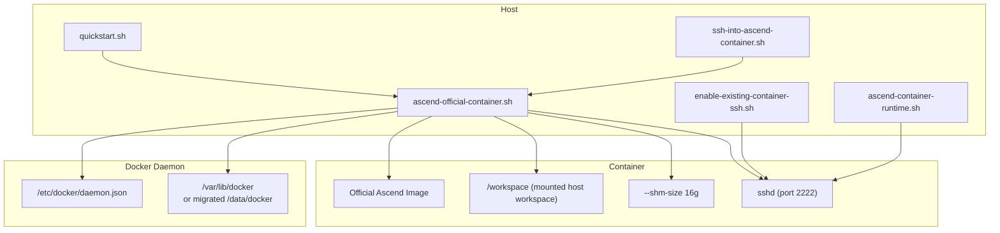
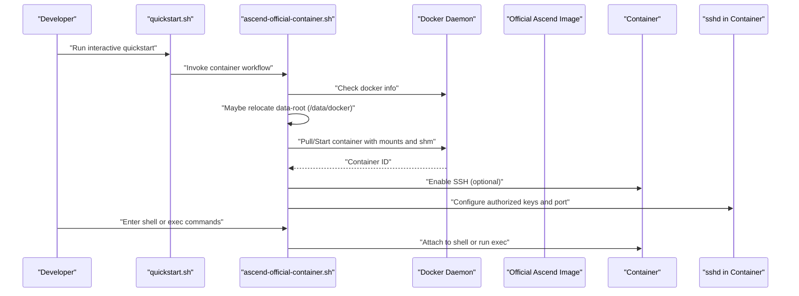
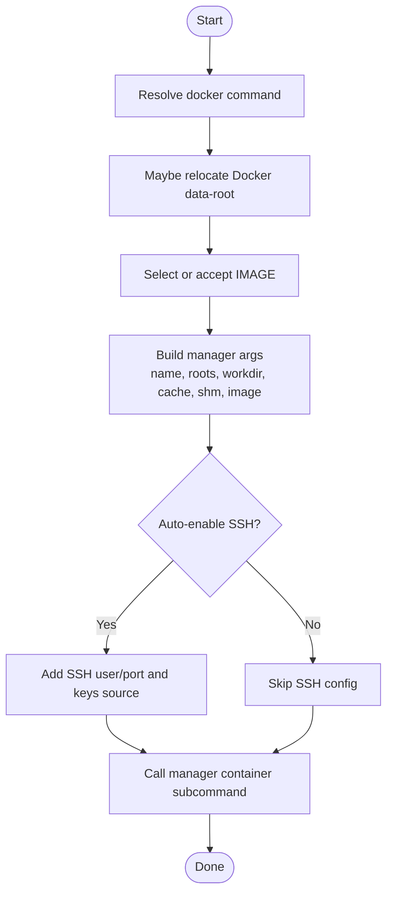
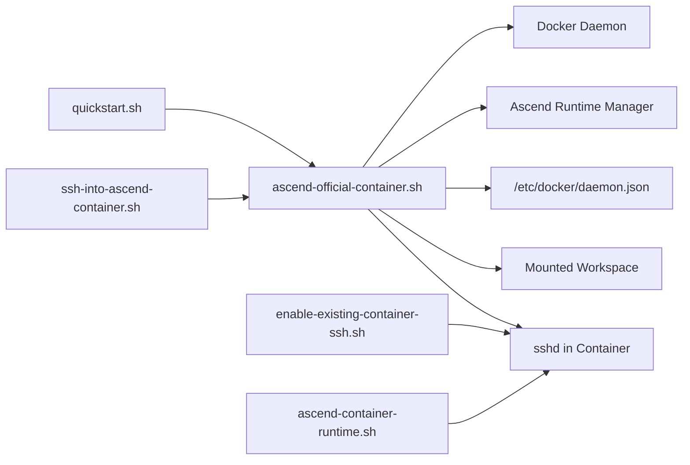

# Docker Container Setup

<cite>
**Referenced Files in This Document**
- [README.md](file://README.md)
- [train8-container-quickstart.md](file://docs/train8-container-quickstart.md)
- [train8-user8-container-repair-20260502.md](file://docs/train8-user8-container-repair-20260502.md)
- [ascend-official-container.sh](file://scripts/ascend-official-container.sh)
- [ascend-container-runtime.sh](file://scripts/ascend-container-runtime.sh)
- [enable-existing-container-ssh.sh](file://scripts/enable-existing-container-ssh.sh)
- [ssh-into-ascend-container.sh](file://scripts/ssh-into-ascend-container.sh)
- [quickstart.sh](file://scripts/quickstart.sh)
- [quickstart_ci.sh](file://scripts/ci/quickstart_ci.sh)
</cite>

## Table of Contents
1. [Introduction](#introduction)
2. [Project Structure](#project-structure)
3. [Core Components](#core-components)
4. [Architecture Overview](#architecture-overview)
5. [Detailed Component Analysis](#detailed-component-analysis)
6. [Dependency Analysis](#dependency-analysis)
7. [Performance Considerations](#performance-considerations)
8. [Troubleshooting Guide](#troubleshooting-guide)
9. [Conclusion](#conclusion)
10. [Appendices](#appendices)

## Introduction
This document explains how the VLLM-HUST Development Hub sets up and manages Docker-based Ascend development containers. It covers the container lifecycle (installation/startup/reuse), workspace mounting, shared memory configuration, and integration with the Docker daemon. It also documents configuration options, environment variables, and operational patterns for networking, workspace synchronization, and resource allocation. The goal is to make containerized development approachable for beginners while providing deep technical insights for experienced users.

## Project Structure
The container workflow is orchestrated by a set of shell scripts and documentation. The primary entry points are:
- Official container orchestration and SSH enablement
- Container SSH keepalive/runtime helper
- Enabling SSH on an existing container
- Convenience wrapper to enter a running container
- Team onboarding and quickstart integration
- CI-friendly bootstrap for automated runners

**Diagram sources**
- [ascend-official-container.sh:108-217](file://scripts/ascend-official-container.sh#L108-L217)
- [enable-existing-container-ssh.sh:58-172](file://scripts/enable-existing-container-ssh.sh#L58-L172)
- [ascend-container-runtime.sh:20-55](file://scripts/ascend-container-runtime.sh#L20-L55)
- [train8-container-quickstart.md:30-41](file://docs/train8-container-quickstart.md#L30-L41)

**Section sources**
- [README.md:40-46](file://README.md#L40-L46)
- [README.md:197-241](file://README.md#L197-L241)
- [train8-container-quickstart.md:1-41](file://docs/train8-container-quickstart.md#L1-L41)

## Core Components
- Official container orchestration script: creates/reuses the container, selects images, mounts workspace, configures SSH, and manages Docker data-root relocation.
- SSH keepalive/runtime helper: ensures the container’s SSH service stays healthy and listens on a configurable port.
- Existing container SSH enabler: adds SSH to an already-running container, aligns ownership, and symlinks workspace folders.
- Container entry wrapper: launches the interactive shell into the container with workspace mounted.
- Quickstart integration: exposes container setup in the interactive menu and supports non-interactive flows.
- CI bootstrap: prepares environments deterministically for automated runners.

Key configuration options and environment variables:
- Container identity and paths
  - CONTAINER_NAME: container instance name (default: vllm-ascend-dev)
  - HOST_WORKSPACE_ROOT: host path to mount as workspace (default: parent of hub root)
  - CONTAINER_WORKSPACE_ROOT: container path for the mounted workspace (default: /workspace)
  - CONTAINER_WORKDIR: container working directory (default: CONTAINER_WORKSPACE_ROOT/vllm-hust-dev-hub)
  - HOST_CACHE_DIR: host cache directory (default: $HOME/.cache)
- Runtime and networking
  - SHM_SIZE: shared memory size (default: 16g)
  - DEFAULT_CONTAINER_SSH_USER: SSH user inside the container (default: shuhao)
  - DEFAULT_CONTAINER_SSH_PORT: SSH port exposed on the host loopback (default: 2222)
  - AUTO_ENABLE_CONTAINER_SSH: auto-configure SSH on start/install (default: 1)
- Docker daemon and storage
  - DEFAULT_DOCKER_DATA_ROOT: preferred Docker data-root (default: /data/docker)
  - VLLM_HUST_AUTO_RELOCATE_DOCKER: enable automatic migration (default: 0)
  - VLLM_HUST_AUTO_ENABLE_CONTAINER_SSH: enable auto SSH (default: 1)
- Image selection
  - IMAGE: explicit image override (unset by default; if unset, device/OS profile is used to pick an official variant)
- Non-interactive mode
  - VLLM_HUST_ASCEND_CONTAINER_NON_INTERACTIVE: pass non-interactive flag to manager commands

**Section sources**
- [ascend-official-container.sh:11-23](file://scripts/ascend-official-container.sh#L11-L23)
- [ascend-official-container.sh:362-385](file://scripts/ascend-official-container.sh#L362-L385)
- [ascend-container-runtime.sh:10-19](file://scripts/ascend-container-runtime.sh#L10-L19)
- [enable-existing-container-ssh.sh:10-17](file://scripts/enable-existing-container-ssh.sh#L10-L17)
- [train8-container-quickstart.md:29-34](file://docs/train8-container-quickstart.md#L29-L34)

## Architecture Overview
The container lifecycle integrates Docker CLI, the Docker daemon, and the Ascend runtime manager. The official container script orchestrates:
- Docker data-root relocation when needed
- Image selection and container creation/reuse
- Workspace mounting and shared memory sizing
- SSH enablement and persistent keepalive
- Environment variable propagation to the manager

**Diagram sources**
- [ascend-official-container.sh:108-217](file://scripts/ascend-official-container.sh#L108-L217)
- [ascend-official-container.sh:348-385](file://scripts/ascend-official-container.sh#L348-L385)
- [train8-container-quickstart.md:67-98](file://docs/train8-container-quickstart.md#L67-L98)

## Detailed Component Analysis

### Official Container Orchestration Script
Responsibilities:
- Detect and use docker or sudo docker
- Optionally relocate Docker data-root to /data/docker when space is insufficient at /var/lib/docker
- Select or accept an explicit IMAGE
- Create/reuse a persistent container with:
  - Mounts for the host workspace and symlink targets
  - Shared memory sizing (--shm-size)
  - Optional SSH enablement with user/port and authorized keys
- Delegate to the Ascend runtime manager for container lifecycle and SSH deployment

Implementation highlights:
- Docker data-root relocation flow with JSON config backup and restart
- SSH enablement decision based on presence of host keys and environment toggle
- Passing configuration flags to the manager (container name, workspace roots, workdir, cache dir, shm size, image, non-interactive)

**Diagram sources**
- [ascend-official-container.sh:46-58](file://scripts/ascend-official-container.sh#L46-L58)
- [ascend-official-container.sh:108-217](file://scripts/ascend-official-container.sh#L108-L217)
- [ascend-official-container.sh:348-385](file://scripts/ascend-official-container.sh#L348-L385)

**Section sources**
- [ascend-official-container.sh:108-217](file://scripts/ascend-official-container.sh#L108-L217)
- [ascend-official-container.sh:348-385](file://scripts/ascend-official-container.sh#L348-L385)
- [README.md:228-241](file://README.md#L228-L241)

### SSH Keepalive/Runtime Helper
Responsibilities:
- Ensure sshd is running inside the container on a configurable port
- Manage PID and log files
- Align with environment variables for user, port, authorized keys location, and health interval

Operational pattern:
- Creates runtime directories if missing
- Starts sshd with a dedicated config fragment if conditions are met
- Runs a long-lived loop to keep the process alive and periodically restart if needed

**Section sources**
- [ascend-container-runtime.sh:20-55](file://scripts/ascend-container-runtime.sh#L20-L55)

### Enabling SSH on an Existing Container
Responsibilities:
- Validate docker availability and container existence
- Copy authorized_keys into the container
- Install openssh-server if missing (online or via offline debs)
- Create/align user/group ownership with host workspace
- Write sshd config fragment and start sshd
- Symlink workspace folders for convenience

Key behaviors:
- Uses container name, workspace roots, and SSH parameters from environment
- Supports offline package provisioning via container copy

**Section sources**
- [enable-existing-container-ssh.sh:58-172](file://scripts/enable-existing-container-ssh.sh#L58-L172)

### Container Entry Wrapper
Responsibilities:
- Launches the interactive shell into the container with workspace mounted
- Passes host workspace root and container name to the official container script

**Section sources**
- [ssh-into-ascend-container.sh:12-14](file://scripts/ssh-into-ascend-container.sh#L12-L14)

### Quickstart Integration
Responsibilities:
- Exposes container setup in the interactive menu
- Supports non-interactive mode for automation
- Integrates with the official container script and SSH enablement

**Section sources**
- [README.md:86-91](file://README.md#L86-L91)
- [README.md:197-201](file://README.md#L197-L201)
- [quickstart.sh:112-135](file://scripts/quickstart.sh#L112-L135)

### CI Bootstrap
Responsibilities:
- Provides a non-interactive, deterministic bootstrap for CI runners
- Calls quickstart with CI-friendly flags and environment
- Runs smoke tests and validations post-setup

**Section sources**
- [quickstart_ci.sh:232-321](file://scripts/ci/quickstart_ci.sh#L232-L321)

## Dependency Analysis
High-level dependencies:
- The official container script depends on:
  - Docker CLI availability (direct or via sudo)
  - Docker daemon configuration (/etc/docker/daemon.json) for data-root
  - The Ascend runtime manager for container lifecycle and SSH deployment
- SSH enablement depends on:
  - Presence of host authorized_keys or public keys
  - Availability of openssh-server in the container (installed if missing)
- Workspace mounting depends on:
  - Correct HOST_WORKSPACE_ROOT and CONTAINER_WORKSPACE_ROOT
  - Proper ownership alignment between host and container

**Diagram sources**
- [ascend-official-container.sh:46-58](file://scripts/ascend-official-container.sh#L46-L58)
- [ascend-official-container.sh:108-217](file://scripts/ascend-official-container.sh#L108-L217)
- [enable-existing-container-ssh.sh:58-172](file://scripts/enable-existing-container-ssh.sh#L58-L172)
- [ascend-container-runtime.sh:20-55](file://scripts/ascend-container-runtime.sh#L20-L55)

**Section sources**
- [ascend-official-container.sh:46-58](file://scripts/ascend-official-container.sh#L46-L58)
- [ascend-official-container.sh:108-217](file://scripts/ascend-official-container.sh#L108-L217)
- [enable-existing-container-ssh.sh:58-172](file://scripts/enable-existing-container-ssh.sh#L58-L172)
- [ascend-container-runtime.sh:20-55](file://scripts/ascend-container-runtime.sh#L20-L55)

## Performance Considerations
- Shared memory sizing: The default 16g SHM_SIZE helps prevent out-of-memory errors during heavy model inference or multi-process workloads. Adjust only if you have constrained resources.
- Docker data-root relocation: When /var/lib/docker is low but /data has space, relocating Docker data-root to /data/docker prevents pull failures and improves reliability.
- Workspace mounting: Mounting the entire workspace parent directory reduces bind overhead and preserves symlink semantics across repositories.

[No sources needed since this section provides general guidance]

## Troubleshooting Guide

Common issues and resolutions:
- SSH connectivity problems
  - Verify container is running and sshd is listening on the configured port
  - Clear stale host keys on the client if conflicts occur
  - Confirm SSH user and port match expectations
- Workspace visibility and permissions
  - Ensure HOST_WORKSPACE_ROOT and CONTAINER_WORKSPACE_ROOT are set correctly
  - Confirm ownership alignment between host and container to avoid permission errors
- Docker storage and pull failures
  - If /var/lib/docker is near capacity, allow automatic relocation to /data/docker or manually migrate
  - Check Docker daemon configuration backup and restart after relocation
- Image selection and compatibility
  - If the chosen image does not match the current CANN baseline, switch to a compatible variant or rebuild with the correct IMAGE
  - For legacy instances, consider using locally cached images that satisfy the baseline

**Section sources**
- [train8-container-quickstart.md:264-343](file://docs/train8-container-quickstart.md#L264-L343)
- [train8-user8-container-repair-20260502.md:41-104](file://docs/train8-user8-container-repair-20260502.md#L41-L104)
- [ascend-official-container.sh:108-217](file://scripts/ascend-official-container.sh#L108-L217)

## Conclusion
The VLLM-HUST Development Hub provides a robust, repeatable workflow for Ascend containerized development. By centralizing container orchestration, SSH enablement, and workspace mounting in dedicated scripts, it balances ease of use with strong operational controls. The documented configuration options and troubleshooting guidance help teams maintain reliable, high-performance development environments across diverse hardware and automation scenarios.

[No sources needed since this section summarizes without analyzing specific files]

## Appendices

### Configuration Options Reference
- Container identity and paths
  - CONTAINER_NAME: persistent container name (default: vllm-ascend-dev)
  - HOST_WORKSPACE_ROOT: host workspace root (default: parent of hub root)
  - CONTAINER_WORKSPACE_ROOT: container workspace mount point (default: /workspace)
  - CONTAINER_WORKDIR: container working directory (default: /workspace/vllm-hust-dev-hub)
  - HOST_CACHE_DIR: host cache directory (default: $HOME/.cache)
- Runtime and networking
  - SHM_SIZE: shared memory size (default: 16g)
  - DEFAULT_CONTAINER_SSH_USER: container SSH user (default: shuhao)
  - DEFAULT_CONTAINER_SSH_PORT: SSH port (default: 2222)
  - AUTO_ENABLE_CONTAINER_SSH: auto-configure SSH (default: 1)
- Docker daemon and storage
  - DEFAULT_DOCKER_DATA_ROOT: preferred Docker data-root (default: /data/docker)
  - VLLM_HUST_AUTO_RELOCATE_DOCKER: enable relocation (default: 0)
  - VLLM_HUST_AUTO_ENABLE_CONTAINER_SSH: enable auto SSH (default: 1)
- Image selection
  - IMAGE: explicit image override (unset by default)
- Non-interactive mode
  - VLLM_HUST_ASCEND_CONTAINER_NON_INTERACTIVE: pass non-interactive flag (default: 0)

**Section sources**
- [ascend-official-container.sh:11-23](file://scripts/ascend-official-container.sh#L11-L23)
- [ascend-official-container.sh:362-385](file://scripts/ascend-official-container.sh#L362-L385)
- [ascend-container-runtime.sh:10-19](file://scripts/ascend-container-runtime.sh#L10-L19)
- [enable-existing-container-ssh.sh:10-17](file://scripts/enable-existing-container-ssh.sh#L10-L17)
- [train8-container-quickstart.md:29-34](file://docs/train8-container-quickstart.md#L29-L34)