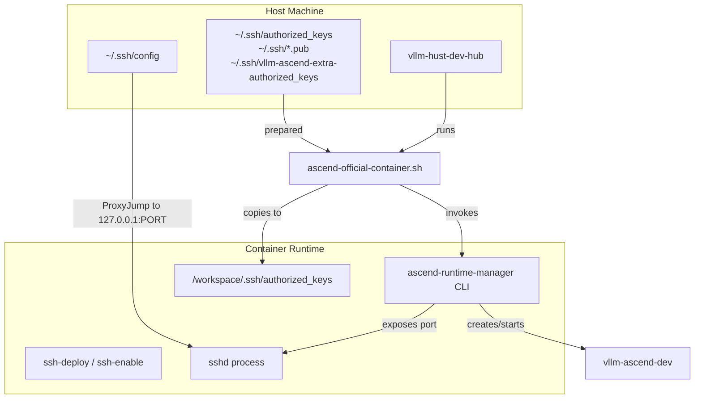
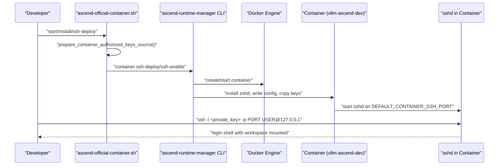
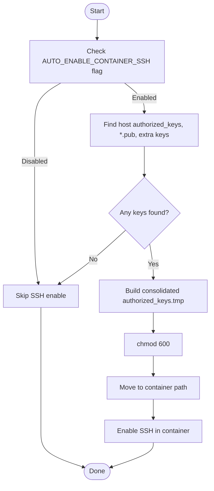
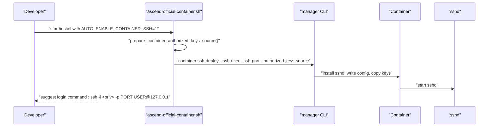
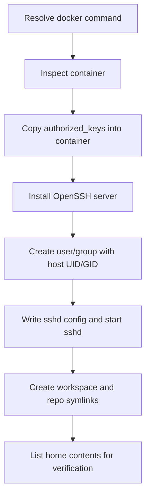
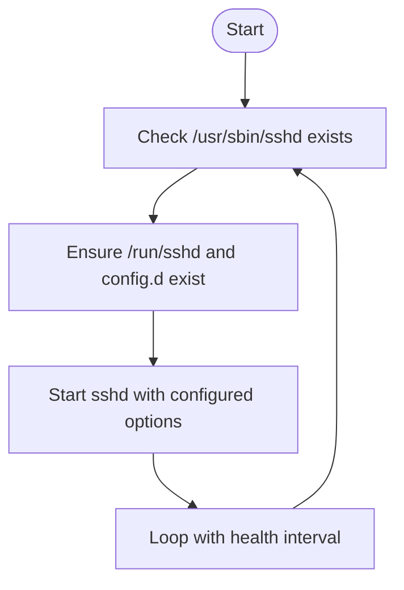
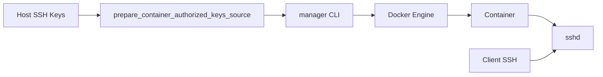

# SSH Access and Remote Development

<cite>
**Referenced Files in This Document**
- [README.md](file://README.md)
- [scripts/ascend-official-container.sh](file://scripts/ascend-official-container.sh)
- [scripts/enable-existing-container-ssh.sh](file://scripts/enable-existing-container-ssh.sh)
- [scripts/ssh-into-ascend-container.sh](file://scripts/ssh-into-ascend-container.sh)
- [scripts/ascend-container-runtime.sh](file://scripts/ascend-container-runtime.sh)
- [docs/train8-container-quickstart.md](file://docs/train8-container-quickstart.md)
- [docs/team-onboarding.md](file://docs/team-onboarding.md)
- [docs/train8-user8-container-repair-20260502.md](file://docs/train8-user8-container-repair-20260502.md)
</cite>

## Table of Contents
1. [Introduction](#introduction)
2. [Project Structure](#project-structure)
3. [Core Components](#core-components)
4. [Architecture Overview](#architecture-overview)
5. [Detailed Component Analysis](#detailed-component-analysis)
6. [Dependency Analysis](#dependency-analysis)
7. [Performance Considerations](#performance-considerations)
8. [Troubleshooting Guide](#troubleshooting-guide)
9. [Conclusion](#conclusion)
10. [Appendices](#appendices)

## Introduction
This document explains the SSH access and remote development capabilities within the VLLM-HUST Development Hub. It focuses on the automatic SSH configuration system, authorized keys management, and secure remote access workflows. You will learn how SSH keys are prepared, how containers are deployed with SSH enabled, and how to establish secure connections to Ascend development containers. It also documents configuration options such as DEFAULT_CONTAINER_SSH_USER, DEFAULT_CONTAINER_SSH_PORT, and AUTO_ENABLE_CONTAINER_SSH, and clarifies how host SSH directories and authorized keys sources relate to container authentication.

## Project Structure
The SSH and remote development features are primarily implemented in a small set of shell scripts and documentation:

- scripts/ascend-official-container.sh: Orchestrates container lifecycle and integrates automatic SSH configuration.
- scripts/enable-existing-container-ssh.sh: Enables SSH on an already-running container and sets up user/workspace symlinks.
- scripts/ssh-into-ascend-container.sh: Convenience wrapper to enter a running container via the official container script.
- scripts/ascend-container-runtime.sh: Keeps SSH alive inside containers and exposes configurable SSH parameters.
- docs/train8-container-quickstart.md: Team documentation for deploying and connecting to containers.
- docs/team-onboarding.md: Team onboarding guide covering SSH configuration and connection.
- docs/train8-user8-container-repair-20260502.md: Operational repair notes highlighting SSH configuration pitfalls and manual fixes.

**Diagram sources**
- [scripts/ascend-official-container.sh:303-360](file://scripts/ascend-official-container.sh#L303-L360)
- [scripts/enable-existing-container-ssh.sh:78-168](file://scripts/enable-existing-container-ssh.sh#L78-L168)
- [scripts/ascend-container-runtime.sh:10-46](file://scripts/ascend-container-runtime.sh#L10-L46)
- [docs/train8-container-quickstart.md:131-161](file://docs/train8-container-quickstart.md#L131-L161)

**Section sources**
- [README.md:40-49](file://README.md#L40-L49)
- [docs/train8-container-quickstart.md:1-404](file://docs/train8-container-quickstart.md#L1-L404)

## Core Components
- Automatic SSH configuration on container start/install:
  - Detects host SSH key material and prepares a consolidated authorized_keys file for the container.
  - Optionally enables SSH inside the container and suggests a login command using localhost and a fixed port.
- Authorized keys management:
  - Aggregates entries from the host’s authorized_keys, any *.pub files, and an extra authorized_keys file.
  - Ensures the resulting file has strict permissions and is placed under the container workspace for container-side consumption.
- Container SSH deployment:
  - Uses the manager CLI to create/start the container and deploy SSH configuration.
  - Supports overriding SSH user and port via environment variables.
- Existing container SSH enablement:
  - Installs OpenSSH server inside a running container, creates a user with UID/GID aligned to the host workspace, and sets up SSHD with a minimal configuration.
- Runtime SSH keepalive:
  - Ensures the SSH daemon stays running inside the container and can be started with configurable parameters.

**Section sources**
- [scripts/ascend-official-container.sh:262-301](file://scripts/ascend-official-container.sh#L262-L301)
- [scripts/ascend-official-container.sh:303-360](file://scripts/ascend-official-container.sh#L303-L360)
- [scripts/enable-existing-container-ssh.sh:78-168](file://scripts/enable-existing-container-ssh.sh#L78-L168)
- [scripts/ascend-container-runtime.sh:10-46](file://scripts/ascend-container-runtime.sh#L10-L46)

## Architecture Overview
The system combines host-side key preparation with container-side SSH deployment orchestrated by the official container script and the manager CLI. The diagram below maps the actual components and their interactions.

**Diagram sources**
- [scripts/ascend-official-container.sh:303-360](file://scripts/ascend-official-container.sh#L303-L360)
- [scripts/ascend-official-container.sh:262-301](file://scripts/ascend-official-container.sh#L262-L301)
- [docs/train8-container-quickstart.md:100-130](file://docs/train8-container-quickstart.md#L100-L130)

## Detailed Component Analysis

### Automatic SSH Configuration and Authorized Keys Preparation
The official container script aggregates host SSH keys into a single authorized_keys file for the container and decides whether to enable SSH automatically based on configuration and presence of keys.

Key behaviors:
- Aggregation sources:
  - Host authorized_keys file.
  - Extra authorized_keys file for additional keys.
  - All *.pub files under the host SSH directory.
- Deduplication and ordering are handled to produce a clean, single-file source.
- Permissions are enforced to 600 before moving to the container.
- Auto-enable logic checks for key availability and environment flags before enabling SSH.

**Diagram sources**
- [scripts/ascend-official-container.sh:303-328](file://scripts/ascend-official-container.sh#L303-L328)
- [scripts/ascend-official-container.sh:262-301](file://scripts/ascend-official-container.sh#L262-L301)

**Section sources**
- [scripts/ascend-official-container.sh:262-301](file://scripts/ascend-official-container.sh#L262-L301)
- [scripts/ascend-official-container.sh:303-328](file://scripts/ascend-official-container.sh#L303-L328)
- [README.md:86-91](file://README.md#L86-L91)

### Container SSH Deployment and Login Workflow
The deployment workflow integrates with the manager CLI to create or reuse the container, install and configure sshd, and expose a fixed port on the host loopback interface.

Highlights:
- Environment variables control SSH user, port, and auto-enable behavior.
- The script suggests a login command using the detected private key and the configured port.
- The manager handles mounting workspace and device paths, and starts sshd inside the container.

**Diagram sources**
- [scripts/ascend-official-container.sh:351-360](file://scripts/ascend-official-container.sh#L351-L360)
- [docs/train8-container-quickstart.md:100-130](file://docs/train8-container-quickstart.md#L100-L130)

**Section sources**
- [scripts/ascend-official-container.sh:19-22](file://scripts/ascend-official-container.sh#L19-L22)
- [scripts/ascend-official-container.sh:351-360](file://scripts/ascend-official-container.sh#L351-L360)
- [docs/train8-container-quickstart.md:131-161](file://docs/train8-container-quickstart.md#L131-L161)

### Enabling SSH on an Existing Container
For scenarios where a container is already running and needs direct SSH access, the dedicated helper script provisions sshd, aligns the container user with the host workspace ownership, and sets up workspace symlinks.

Key steps:
- Validates Docker availability and container existence.
- Copies the aggregated authorized_keys into the container.
- Installs OpenSSH server (online or via offline debs).
- Creates the user/group with UID/GID matching the host workspace.
- Writes a minimal sshd configuration and starts the service.
- Creates workspace and repository symlinks for convenience.

**Diagram sources**
- [scripts/enable-existing-container-ssh.sh:58-172](file://scripts/enable-existing-container-ssh.sh#L58-L172)

**Section sources**
- [scripts/enable-existing-container-ssh.sh:58-172](file://scripts/enable-existing-container-ssh.sh#L58-L172)

### Runtime SSH Keepalive Inside Containers
The runtime script ensures that SSH remains available inside containers by starting sshd with configurable parameters and keeping it alive via a long-running loop.

Key configuration:
- CONTAINER_SSH_USER (required)
- CONTAINER_SSH_PORT (optional, default 2237)
- CONTAINER_SSH_AUTHORIZED_KEYS (optional, default /workspace/.ssh/authorized_keys)
- PID and log file locations
- Health interval

**Diagram sources**
- [scripts/ascend-container-runtime.sh:20-55](file://scripts/ascend-container-runtime.sh#L20-L55)

**Section sources**
- [scripts/ascend-container-runtime.sh:10-46](file://scripts/ascend-container-runtime.sh#L10-L46)

### SSH Configuration Options
The following environment variables control SSH behavior in the official container script:

- DEFAULT_CONTAINER_SSH_USER: Container SSH user name. Defaults to a user determined by the script.
- DEFAULT_CONTAINER_SSH_PORT: Container SSH port exposed on the host loopback. Defaults to 2222.
- AUTO_ENABLE_CONTAINER_SSH: Controls whether to auto-enable SSH when host keys are present. Defaults to enabled.

These variables are used to:
- Pass SSH user/port to the manager CLI.
- Suggest a login command to the developer.
- Influence whether the script attempts to prepare and deploy SSH configuration.

**Section sources**
- [scripts/ascend-official-container.sh:19-22](file://scripts/ascend-official-container.sh#L19-L22)
- [scripts/ascend-official-container.sh:351-360](file://scripts/ascend-official-container.sh#L351-L360)
- [docs/train8-user8-container-repair-20260502.md:127-129](file://docs/train8-user8-container-repair-20260502.md#L127-L129)

### Host SSH Directory and Authorized Keys Sources
The system relies on several host-side sources for authorized keys:

- Host authorized_keys file under the workspace SSH directory.
- Any *.pub files under the host SSH directory.
- An extra authorized_keys file for additional keys.

The script consolidates these sources into a single file for the container and enforces strict permissions.

**Section sources**
- [scripts/ascend-official-container.sh:219-233](file://scripts/ascend-official-container.sh#L219-L233)
- [scripts/ascend-official-container.sh:262-301](file://scripts/ascend-official-container.sh#L262-L301)
- [README.md:86-91](file://README.md#L86-L91)

### Container Authentication and Workspace Alignment
The container SSH user is aligned with the host workspace owner to ensure that after login, the developer can immediately access mounted repositories under the workspace. The helper script creates the user/group with the same UID/GID as the host workspace root and sets up symlinks to common repositories.

**Section sources**
- [scripts/enable-existing-container-ssh.sh:122-127](file://scripts/enable-existing-container-ssh.sh#L122-L127)
- [scripts/enable-existing-container-ssh.sh:150-165](file://scripts/enable-existing-container-ssh.sh#L150-L165)
- [README.md:88-91](file://README.md#L88-L91)

## Dependency Analysis
The SSH and remote development system depends on:

- Host SSH key material and configuration (authorized_keys, *.pub, extra keys).
- The manager CLI for container creation, mounting, and SSH deployment.
- Docker for container orchestration.
- The container’s sshd service for accepting connections.

**Diagram sources**
- [scripts/ascend-official-container.sh:262-301](file://scripts/ascend-official-container.sh#L262-L301)
- [scripts/ascend-official-container.sh:351-360](file://scripts/ascend-official-container.sh#L351-L360)
- [scripts/enable-existing-container-ssh.sh:78-168](file://scripts/enable-existing-container-ssh.sh#L78-L168)

**Section sources**
- [scripts/ascend-official-container.sh:303-360](file://scripts/ascend-official-container.sh#L303-L360)
- [scripts/enable-existing-container-ssh.sh:58-172](file://scripts/enable-existing-container-ssh.sh#L58-L172)

## Performance Considerations
- SSH key aggregation is O(n) over the number of keys and pub files; deduplication via a temporary file reduces overhead.
- Using a fixed port on the host loopback avoids NAT traversal overhead and simplifies client configuration.
- Keeping sshd running inside the container with a keepalive script prevents frequent restarts and improves responsiveness.

[No sources needed since this section provides general guidance]

## Troubleshooting Guide
Common issues and resolutions:

- SSH connection fails:
  - Verify the container is running and sshd is listening on the configured port.
  - Check for port conflicts and adjust the port if necessary.
  - Clear cached host keys if the container was rebuilt.
  - Ensure the client uses the correct identity file and port.

- Key permission problems:
  - The consolidated authorized_keys file is written with strict permissions; verify the file exists and is readable by the container user.
  - Confirm that the container user’s home directory and .ssh directory have correct ownership and permissions.

- Network configuration:
  - The container exposes SSH on the host loopback; ensure the client connects to 127.0.0.1 with the configured port.
  - If external access is restricted, use a ProxyJump through the host to reach the container.

- Manual SSH configuration in containers:
  - Some images lack the sshd_config.d directory; create it and write a minimal sshd configuration if needed.
  - Ensure the container user exists with the correct UID/GID and that authorized_keys is copied into the user’s home.

**Section sources**
- [docs/train8-container-quickstart.md:264-290](file://docs/train8-container-quickstart.md#L264-L290)
- [docs/train8-user8-container-repair-20260502.md:98-158](file://docs/train8-user8-container-repair-20260502.md#L98-L158)

## Conclusion
The VLLM-HUST Development Hub provides a robust, automated SSH access system for Ascend development containers. By aggregating host SSH keys, configuring sshd inside the container, and exposing a fixed port on the host loopback, it enables secure and convenient remote development. The system is designed to be resilient to common operational issues and integrates seamlessly with team workflows and documentation.

[No sources needed since this section summarizes without analyzing specific files]

## Appendices

### Example Workflows
- Interactive container creation with SSH auto-configuration:
  - Use the quickstart menu to create or start the container and optionally add an extra authorized key.
- Programmatic deployment:
  - Use the manager CLI to ssh-deploy with explicit SSH user and port.
- Connecting from the client:
  - Configure SSH aliases with ProxyJump to connect via the host to the container’s loopback address and port.

**Section sources**
- [docs/train8-container-quickstart.md:67-100](file://docs/train8-container-quickstart.md#L67-L100)
- [docs/train8-container-quickstart.md:100-130](file://docs/train8-container-quickstart.md#L100-L130)
- [docs/train8-container-quickstart.md:131-161](file://docs/train8-container-quickstart.md#L131-L161)