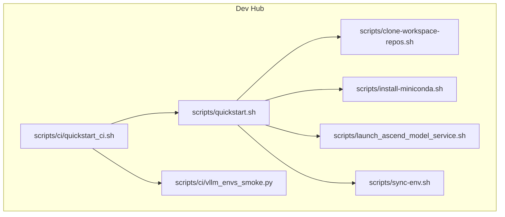
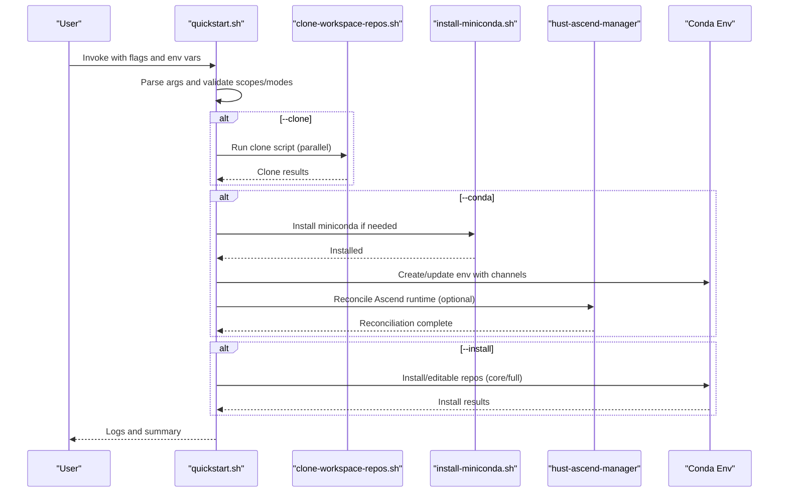
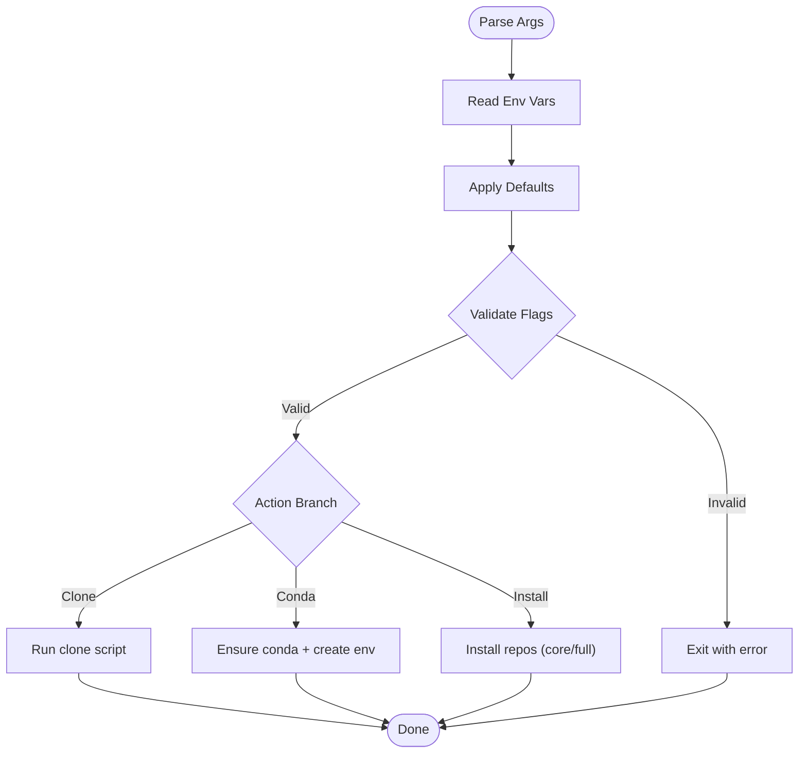
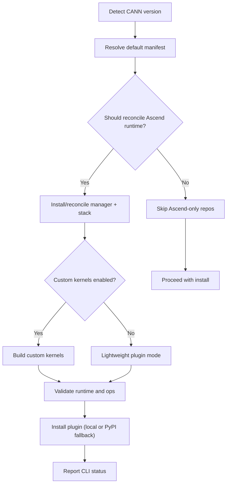
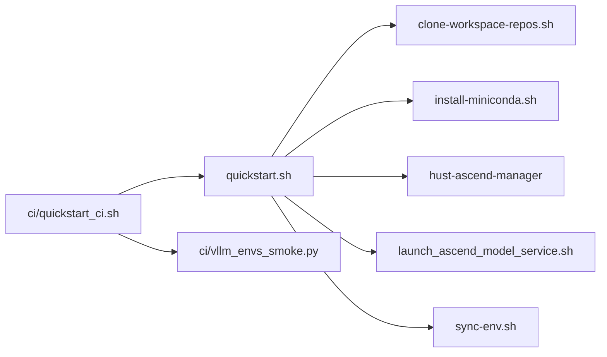

# Advanced Configuration Options

<cite>
**Referenced Files in This Document**
- [README.md](file://README.md)
- [ROADMAP.md](file://ROADMAP.md)
- [scripts/quickstart.sh](file://scripts/quickstart.sh)
- [scripts/install-miniconda.sh](file://scripts/install-miniconda.sh)
- [scripts/clone-workspace-repos.sh](file://scripts/clone-workspace-repos.sh)
- [scripts/launch_ascend_model_service.sh](file://scripts/launch_ascend_model_service.sh)
- [scripts/sync-env.sh](file://scripts/sync-env.sh)
- [scripts/ci/quickstart_ci.sh](file://scripts/ci/quickstart_ci.sh)
- [scripts/ci/vllm_envs_smoke.py](file://scripts/ci/vllm_envs_smoke.py)
</cite>

## Table of Contents
1. [Introduction](#introduction)
2. [Project Structure](#project-structure)
3. [Core Components](#core-components)
4. [Architecture Overview](#architecture-overview)
5. [Detailed Component Analysis](#detailed-component-analysis)
6. [Dependency Analysis](#dependency-analysis)
7. [Performance Considerations](#performance-considerations)
8. [Troubleshooting Guide](#troubleshooting-guide)
9. [Conclusion](#conclusion)
10. [Appendices](#appendices)

## Introduction
This document explains advanced configuration options within the VLLM-HUST Development Hub. It focuses on environment variables, installation modes, and customization parameters exposed by the bootstrap and tooling scripts. It documents how configuration is parsed, validated, and handled, and provides concrete examples from the codebase for non-interactive installations, custom environment names, scoped installations, and Ascend-specific behaviors. The content is designed to be accessible to beginners while offering sufficient technical depth for experienced developers.

## Project Structure
The Development Hub centers on a lightweight meta repository that orchestrates workspace repositories and provides bootstrap scripts for environment setup, repository synchronization, and containerized workflows. Key configuration surfaces include:
- Interactive and non-interactive bootstrap flows
- Environment variable-driven behavior for mirrors, logging, and Ascend runtime
- Scoped installation modes for core versus full repository sets
- CI-optimized flows with deterministic environment names and artifact collection

**Diagram sources**
- [scripts/quickstart.sh:1-120](file://scripts/quickstart.sh#L1-L120)
- [scripts/clone-workspace-repos.sh:1-60](file://scripts/clone-workspace-repos.sh#L1-L60)
- [scripts/install-miniconda.sh:1-40](file://scripts/install-miniconda.sh#L1-L40)
- [scripts/launch_ascend_model_service.sh:1-60](file://scripts/launch_ascend_model_service.sh#L1-L60)
- [scripts/sync-env.sh:1-20](file://scripts/sync-env.sh#L1-L20)
- [scripts/ci/quickstart_ci.sh:1-40](file://scripts/ci/quickstart_ci.sh#L1-L40)
- [scripts/ci/vllm_envs_smoke.py:1-20](file://scripts/ci/vllm_envs_smoke.py#L1-L20)

**Section sources**
- [README.md:34-50](file://README.md#L34-L50)
- [scripts/quickstart.sh:112-135](file://scripts/quickstart.sh#L112-L135)

## Core Components
This section outlines the primary configuration surfaces and their roles.

- Bootstrap and environment setup
  - Interactive and non-interactive flows controlled by command-line flags and environment variables
  - Conda environment creation/update with explicit channels and mirror selection
  - Optional auto-activation of the environment in new shells

- Repository synchronization
  - Parallel cloning with retry and fallback mechanisms
  - Configurable concurrency and interactive prompts

- Ascend runtime and plugin configuration
  - Auto-selection of Ascend custom kernel mode with environment variable override
  - Manager-driven reconciliation of Python stacks and runtime variables
  - PyPI fallback for Ascend plugin when local checkout is unavailable

- Launch and service orchestration
  - Host and Docker modes for Ascend model service
  - Preset configurations and model download integration
  - Health checks and logging

- CI and smoke testing
  - Deterministic environment naming and cleanup
  - Smoke tests validating environment and CLI availability

**Section sources**
- [scripts/quickstart.sh:112-135](file://scripts/quickstart.sh#L112-L135)
- [scripts/quickstart.sh:1380-1471](file://scripts/quickstart.sh#L1380-L1471)
- [scripts/clone-workspace-repos.sh:149-152](file://scripts/clone-workspace-repos.sh#L149-L152)
- [scripts/launch_ascend_model_service.sh:187-249](file://scripts/launch_ascend_model_service.sh#L187-L249)
- [scripts/ci/quickstart_ci.sh:101-131](file://scripts/ci/quickstart_ci.sh#L101-L131)

## Architecture Overview
The configuration architecture integrates environment variables, command-line arguments, and internal defaults to produce a deterministic setup. The flow below illustrates how configuration is parsed and applied across stages.

**Diagram sources**
- [scripts/quickstart.sh:2625-2699](file://scripts/quickstart.sh#L2625-L2699)
- [scripts/clone-workspace-repos.sh:402-466](file://scripts/clone-workspace-repos.sh#L402-L466)
- [scripts/install-miniconda.sh:132-169](file://scripts/install-miniconda.sh#L132-L169)
- [scripts/quickstart.sh:1764-1806](file://scripts/quickstart.sh#L1764-L1806)

## Detailed Component Analysis

### Environment Variables and Parsing
Environment variables drive behavior across scripts. The table below lists key variables and their effects.

- Quickstart and environment configuration
  - HUST_DEV_HUB_UPDATE_BASHRC: Enables updating ~/.bashrc for auto-activation
  - HUST_DEV_HUB_QUICKSTART_LOG_DIR, HUST_DEV_HUB_QUICKSTART_LOG_FILE: Controls logging location
  - HUST_DEV_HUB_DISABLE_HF_MIRROR_AUTOSET: Disables automatic HF_ENDPOINT mirror switching
  - HUST_DEV_HUB_ENABLE_MANAGER_ENV_HOOK: Enables sourcing manager-provided environment exports
  - HUST_DEV_HUB_APPLY_ASCEND_SYSTEM_STEPS: Opt-in to apply system-level Ascend steps
  - HUST_DEV_HUB_SKIP_ASCEND_SYSTEM_APPLY: Skips applying system-level steps
  - HUST_DEV_HUB_ASCEND_COMPILE_CUSTOM_KERNELS: Explicitly sets Ascend COMPILE_CUSTOM_KERNELS
  - HUST_DEV_HUB_PIP_* and HUST_ASCEND_MANAGER_PIP_*: Control pip mirror and retries
  - HUST_DEV_HUB_GIT_AUTH_MODE: Switches clone auth mode (e.g., ssh)
  - CONDA_EXE: Resolves conda binary for CI flows

- Ascend runtime and plugin
  - VLLM_HUST_CONTAINER_PUBKEY: Supplies SSH public key for container setup
  - COMPILE_CUSTOM_KERNELS: Ascend plugin compile mode override
  - VLLM_ASCEND_* and related variables: Tuning for Ascend service and runtime

- CI and smoke tests
  - RUNNER_FLAVOR, PYTHON_VERSION, INSTALL_SCOPE: CI environment naming and scope
  - CI_GITHUB_TOKEN/GITHUB_TOKEN: Git authentication for CI
  - HUST_DEV_HUB_SKIP_ASCEND_SYSTEM_APPLY: Skips system steps in CI

**Diagram sources**
- [scripts/quickstart.sh:2625-2699](file://scripts/quickstart.sh#L2625-L2699)
- [scripts/quickstart.sh:949-995](file://scripts/quickstart.sh#L949-L995)
- [scripts/ci/quickstart_ci.sh:47-67](file://scripts/ci/quickstart_ci.sh#L47-L67)

**Section sources**
- [scripts/quickstart.sh:949-995](file://scripts/quickstart.sh#L949-L995)
- [scripts/quickstart.sh:108-110](file://scripts/quickstart.sh#L108-L110)
- [scripts/quickstart.sh:2645-2651](file://scripts/quickstart.sh#L2645-L2651)
- [scripts/ci/quickstart_ci.sh:10-18](file://scripts/ci/quickstart_ci.sh#L10-L18)

### Installation Modes and Scopes
The quickstart supports distinct installation modes and scopes:
- Modes
  - install: Install only missing packages
  - refresh: Reinstall selected editable packages even if present
- Scopes
  - core: Core repos (manager, vllm-hust, vllm-ascend-hust, benchmark)
  - full: Core plus extra repos (workstation, docs, website, EvoScientist, perf analyzer)

Validation occurs early to prevent invalid combinations.

**Section sources**
- [scripts/quickstart.sh:1937-2068](file://scripts/quickstart.sh#L1937-L2068)
- [scripts/quickstart.sh:2685-2698](file://scripts/quickstart.sh#L2685-L2698)

### Ascend Runtime and Plugin Configuration
The system detects Ascend capabilities and selects appropriate runtime behavior:
- Auto-selection of custom-kernel mode based on prerequisites and device presence
- Environment variable override for explicit control
- Manager-driven reconciliation of Python stacks and runtime variables
- PyPI fallback for Ascend plugin when local checkout is unavailable

**Diagram sources**
- [scripts/quickstart.sh:18-58](file://scripts/quickstart.sh#L18-L58)
- [scripts/quickstart.sh:433-451](file://scripts/quickstart.sh#L433-L451)
- [scripts/quickstart.sh:1732-1750](file://scripts/quickstart.sh#L1732-L1750)
- [scripts/quickstart.sh:1764-1806](file://scripts/quickstart.sh#L1764-L1806)
- [scripts/quickstart.sh:1808-1869](file://scripts/quickstart.sh#L1808-L1869)

**Section sources**
- [scripts/quickstart.sh:433-451](file://scripts/quickstart.sh#L433-L451)
- [scripts/quickstart.sh:1732-1750](file://scripts/quickstart.sh#L1732-L1750)
- [scripts/quickstart.sh:1764-1806](file://scripts/quickstart.sh#L1764-L1806)
- [scripts/quickstart.sh:1808-1869](file://scripts/quickstart.sh#L1808-L1869)

### Non-Interactive Installations and Examples
The hub supports robust non-interactive setups:
- One-command clone + environment + install
- Custom environment name and Python version
- Install-only mode into existing environment
- Refresh mode for editable installs

Concrete examples are documented in the repository’s README and inline help.

**Section sources**
- [README.md:173-196](file://README.md#L173-L196)
- [scripts/quickstart.sh:112-135](file://scripts/quickstart.sh#L112-L135)

### Containerized Workflows and SSH Keys
The container workflow supports non-interactive SSH key provisioning via environment variables and persists keys for container access. It also supports migrating Docker data-root and aligns container SSH user with mounted workspace.

**Section sources**
- [README.md:228-241](file://README.md#L228-L241)
- [scripts/quickstart.sh:238-276](file://scripts/quickstart.sh#L238-L276)

### CI-Optimized Configuration
The CI script provides deterministic environment naming, cleanup, and structured results:
- Runner flavor and environment naming strategy
- Cleanup of environments on completion
- Structured PASS/FAIL/SKIPPED results and artifacts
- Optional plugin validation for self-hosted runners

**Section sources**
- [scripts/ci/quickstart_ci.sh:10-25](file://scripts/ci/quickstart_ci.sh#L10-L25)
- [scripts/ci/quickstart_ci.sh:74-99](file://scripts/ci/quickstart_ci.sh#L74-L99)
- [scripts/ci/quickstart_ci.sh:228-231](file://scripts/ci/quickstart_ci.sh#L228-L231)

## Dependency Analysis
Configuration dependencies span scripts and environment variables. The diagram below highlights key relationships.

**Diagram sources**
- [scripts/quickstart.sh:9-11](file://scripts/quickstart.sh#L9-L11)
- [scripts/ci/quickstart_ci.sh:1-10](file://scripts/ci/quickstart_ci.sh#L1-L10)

**Section sources**
- [scripts/quickstart.sh:9-11](file://scripts/quickstart.sh#L9-L11)
- [scripts/ci/quickstart_ci.sh:1-10](file://scripts/ci/quickstart_ci.sh#L1-L10)

## Performance Considerations
- Logging and diagnostics
  - Quickstart writes timestamped logs and supports overriding destination via environment variables
- Network and mirror selection
  - Pip mirror selection with probing and timeouts reduces install latency
- Concurrency and retries
  - Parallel repository cloning and pip retries improve reliability on large installs
- Containerized workflows
  - Mounting workspace and isolating caches in containers avoids network-dependent installs

[No sources needed since this section provides general guidance]

## Troubleshooting Guide
Common issues and remedies:
- Conda not found or unusable
  - Quickstart can auto-install Miniconda; broken prefixes are backed up and repaired
- Ascend runtime validation failures
  - Manager reconciliation and runtime health checks can restore healthy state
- Ascend custom-op validation failures
  - RUNPATH repair via patchelf can fix dynamic library resolution
- Git “dubious ownership” in containers
  - Auto-configuration of safe directories for host-mounted repos
- CI environment cleanup
  - Cleanup routine removes environments on completion to avoid resource drift

**Section sources**
- [scripts/quickstart.sh:1199-1253](file://scripts/quickstart.sh#L1199-L1253)
- [scripts/quickstart.sh:771-793](file://scripts/quickstart.sh#L771-L793)
- [scripts/quickstart.sh:821-899](file://scripts/quickstart.sh#L821-L899)
- [scripts/quickstart.sh:1871-1899](file://scripts/quickstart.sh#L1871-L1899)
- [scripts/ci/quickstart_ci.sh:74-99](file://scripts/ci/quickstart_ci.sh#L74-L99)

## Conclusion
The VLLM-HUST Development Hub exposes a comprehensive set of configuration options through environment variables and command-line flags. These options enable flexible, reproducible setups across interactive and CI contexts, with strong support for Ascend-specific runtime and plugin behaviors. By leveraging the documented parameters and flows, teams can achieve deterministic, maintainable development environments.

[No sources needed since this section summarizes without analyzing specific files]

## Appendices

### Appendix A: Environment Variables Reference
- Quickstart and environment
  - HUST_DEV_HUB_UPDATE_BASHRC: Update ~/.bashrc for auto-activation
  - HUST_DEV_HUB_QUICKSTART_LOG_DIR, HUST_DEV_HUB_QUICKSTART_LOG_FILE: Logging destination
  - HUST_DEV_HUB_DISABLE_HF_MIRROR_AUTOSET: Disable HF_ENDPOINT auto-switch
  - HUST_DEV_HUB_ENABLE_MANAGER_ENV_HOOK: Enable manager env exports
  - HUST_DEV_HUB_APPLY_ASCEND_SYSTEM_STEPS: Apply system-level Ascend steps
  - HUST_DEV_HUB_SKIP_ASCEND_SYSTEM_APPLY: Skip system-level steps
  - HUST_DEV_HUB_ASCEND_COMPILE_CUSTOM_KERNELS: Explicit Ascend compile mode
  - HUST_DEV_HUB_PIP_* and HUST_ASCEND_MANAGER_PIP_*: Pip mirror and retry controls
  - HUST_DEV_HUB_GIT_AUTH_MODE: Clone auth mode (e.g., ssh)
  - CONDA_EXE: Conda binary resolution for CI

- Ascend runtime and plugin
  - VLLM_HUST_CONTAINER_PUBKEY: SSH public key for container setup
  - COMPILE_CUSTOM_KERNELS: Ascend plugin compile mode
  - VLLM_ASCEND_* and related variables: Service and runtime tuning

- CI and smoke tests
  - RUNNER_FLAVOR, PYTHON_VERSION, INSTALL_SCOPE: CI naming and scope
  - CI_GITHUB_TOKEN/GITHUB_TOKEN: Git authentication
  - HUST_DEV_HUB_SKIP_ASCEND_SYSTEM_APPLY: Skip system steps in CI

**Section sources**
- [scripts/quickstart.sh:108-110](file://scripts/quickstart.sh#L108-L110)
- [scripts/quickstart.sh:949-995](file://scripts/quickstart.sh#L949-L995)
- [scripts/quickstart.sh:2645-2651](file://scripts/quickstart.sh#L2645-L2651)
- [scripts/ci/quickstart_ci.sh:10-18](file://scripts/ci/quickstart_ci.sh#L10-L18)

### Appendix B: Example Commands
- One-command bootstrap
  - bash scripts/quickstart.sh --all -y
- Custom environment and Python
  - bash scripts/quickstart.sh --conda --env-name vllm-hust-dev --python 3.11 -y
- Install-only into existing environment
  - bash scripts/quickstart.sh --install --env-name vllm-hust-dev -y
- Refresh core repos
  - bash scripts/quickstart.sh --install --install-mode refresh --env-name vllm-hust-dev -y
- Install core + extras
  - bash scripts/quickstart.sh --install --install-mode install --install-scope full --env-name vllm-hust-dev -y
- Clone without prompts
  - bash scripts/clone-workspace-repos.sh --yes
- Create or start official Ascend container
  - bash scripts/ascend-official-container.sh start
- Enter container with env sourced
  - bash scripts/ascend-official-container.sh shell
- Launch model service (Docker mode)
  - bash scripts/launch_ascend_model_service.sh --preset w8a8 --docker vllm_hust_ws_16rc
- Launch model service (Host mode)
  - bash scripts/launch_ascend_model_service.sh --preset w8a8
- Configure GitHub Actions runner
  - export GITHUB_RUNNER_URL=...; export GITHUB_RUNNER_TOKEN=...; bash scripts/setup-github-actions-runner.sh install --labels train8,ascend

**Section sources**
- [README.md:173-226](file://README.md#L173-L226)