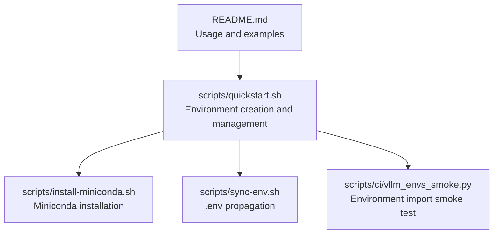
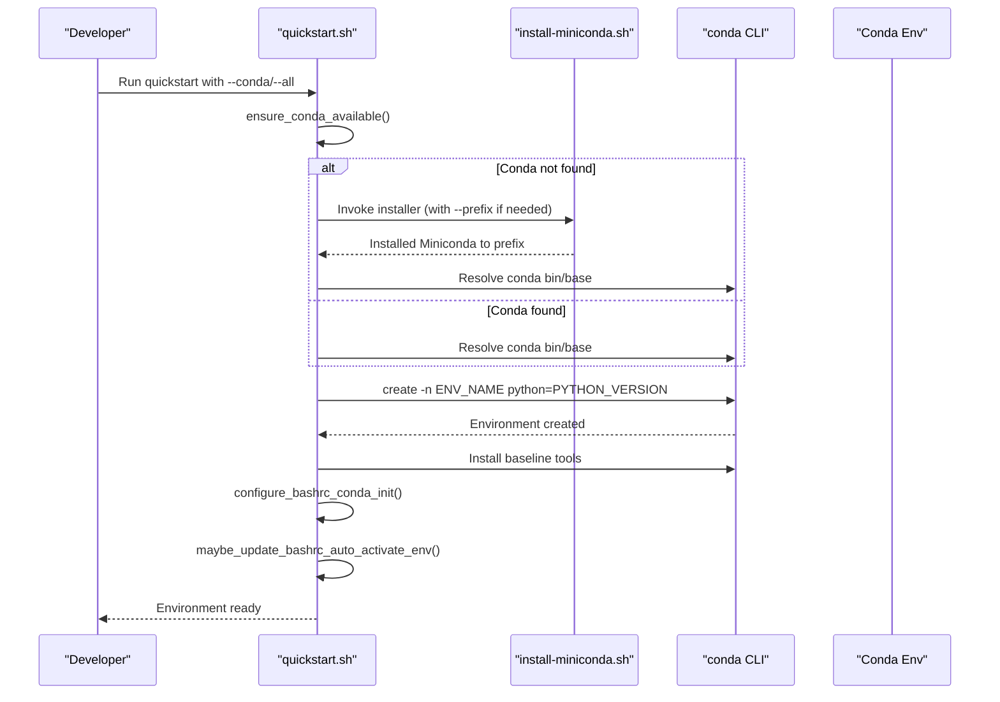
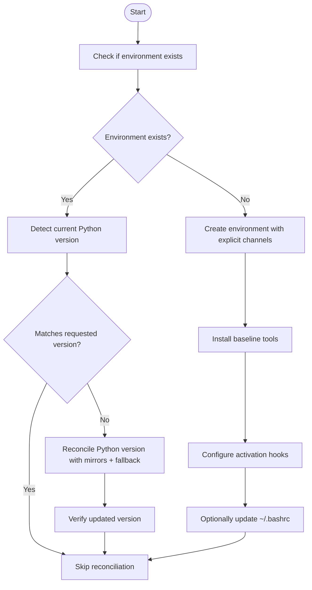
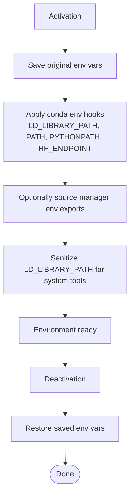
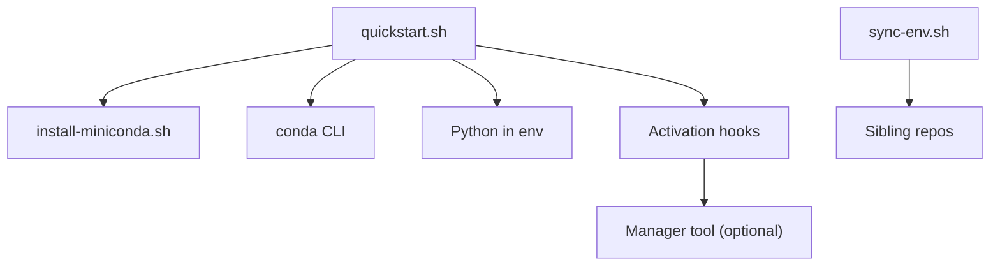

# Conda Environment Configuration

<cite>
**Referenced Files in This Document**
- [README.md](file://README.md)
- [install-miniconda.sh](file://scripts/install-miniconda.sh)
- [quickstart.sh](file://scripts/quickstart.sh)
- [sync-env.sh](file://scripts/sync-env.sh)
- [vllm_envs_smoke.py](file://scripts/ci/vllm_envs_smoke.py)
</cite>

## Table of Contents
1. [Introduction](#introduction)
2. [Project Structure](#project-structure)
3. [Core Components](#core-components)
4. [Architecture Overview](#architecture-overview)
5. [Detailed Component Analysis](#detailed-component-analysis)
6. [Dependency Analysis](#dependency-analysis)
7. [Performance Considerations](#performance-considerations)
8. [Troubleshooting Guide](#troubleshooting-guide)
9. [Conclusion](#conclusion)

## Introduction
This document explains how the VLLM-HUST Development Hub manages conda environments for development and testing. It covers environment creation, Python version management, environment variable handling, and integration with conda commands. It also documents environment detection, prefix resolution, and Python binary path management, with practical examples from the repository’s scripts. The goal is to make environment setup reliable and reproducible for both beginners and experienced developers.

## Project Structure
The conda environment configuration is implemented primarily through three scripts:
- scripts/install-miniconda.sh: Installs Miniconda into a user-controlled prefix and handles broken prefixes.
- scripts/quickstart.sh: Creates or updates a conda environment, reconciles Python versions, installs baseline tools, and sets up environment activation hooks.
- scripts/sync-env.sh: Propagates environment tokens (.env) from the hub to sibling repositories.

Additionally, the repository README describes usage patterns and environment-related behaviors.

**Diagram sources**
- [README.md](file://README.md)
- [install-miniconda.sh](file://scripts/install-miniconda.sh)
- [quickstart.sh](file://scripts/quickstart.sh)
- [sync-env.sh](file://scripts/sync-env.sh)
- [vllm_envs_smoke.py](file://scripts/ci/vllm_envs_smoke.py)

**Section sources**
- [README.md](file://README.md)
- [install-miniconda.sh](file://scripts/install-miniconda.sh)
- [quickstart.sh](file://scripts/quickstart.sh)
- [sync-env.sh](file://scripts/sync-env.sh)

## Core Components
- Environment creation and update:
  - Creates or updates a named conda environment with a specified Python version.
  - Uses explicit channels to improve reliability and speed.
  - Installs baseline tools (pip, setuptools, wheel) and optional test tools.
- Python version management:
  - Detects the environment’s Python version and reconciles it to the requested version if needed.
  - Supports mirrors and fallback channels for robust installation.
- Environment activation hooks:
  - Writes conda activate/deactivate hooks to manage runtime library paths and environment variables.
  - Optionally auto-activates the environment in new interactive shells.
- Miniconda installation:
  - Detects platform and architecture, downloads the appropriate installer, and installs into a configurable prefix.
  - Handles broken or unusable prefixes gracefully.

Key configuration options and parameters:
- ENV_NAME: Name of the conda environment (default: vllm-hust-dev).
- PYTHON_VERSION: Target Python version for the environment (default: 3.11).
- HUST_DEV_HUB_UPDATE_BASHRC: Controls whether to update ~/.bashrc for auto-activation.
- HUST_DEV_HUB_DISABLE_HF_MIRROR_AUTOSET: Disables automatic HF_ENDPOINT switching in activation hooks.
- HUST_DEV_HUB_ENABLE_MANAGER_ENV_HOOK: Enables sourcing additional Ascend runtime variables from a manager tool.
- HUST_DEV_HUB_QUICKSTART_LOG_DIR and HUST_DEV_HUB_QUICKSTART_LOG_FILE: Control logging location and filename.

Return values and behaviors:
- Environment creation returns success/failure depending on conda create/install outcomes.
- Python version reconciliation attempts mirror-based installs first, then falls back to a standard channel.
- Activation hooks return success/failure depending on whether the environment prefix is resolvable.

**Section sources**
- [quickstart.sh](file://scripts/quickstart.sh)
- [install-miniconda.sh](file://scripts/install-miniconda.sh)
- [README.md](file://README.md)

## Architecture Overview
The environment lifecycle integrates Miniconda installation, environment creation, and post-setup hooks. The flow below maps to actual functions and scripts in the repository.

**Diagram sources**
- [quickstart.sh](file://scripts/quickstart.sh)
- [install-miniconda.sh](file://scripts/install-miniconda.sh)

## Detailed Component Analysis

### Environment Creation and Update
- Purpose: Create or update a named conda environment with a specified Python version and baseline tools.
- Key functions:
  - ensure_conda_available(): Locates a usable conda binary and base prefix; optionally installs Miniconda if missing.
  - create_or_update_conda_env(): Creates the environment with explicit channels and installs baseline tools; updates Python version if needed.
  - reconcile_conda_env_python_version(): Compares and reconciles the environment’s Python version to the requested version.
- Channels and mirrors:
  - Uses vendor and mirror channels to improve reliability and speed.
  - Falls back to a standard channel if mirror-based creation fails.
- Post-setup:
  - Writes activation hooks to manage runtime library paths and environment variables.
  - Optionally updates ~/.bashrc to initialize conda and auto-activate the environment.

Implementation details:
- Channel selection and fallback are handled in create_or_update_conda_env().
- Python version reconciliation uses run_conda_cmd install with explicit channels.
- Activation hooks are written to etc/conda/activate.d and etc/conda/deactivate.d.

**Section sources**
- [quickstart.sh](file://scripts/quickstart.sh)

### Python Version Management
- Detection:
  - get_conda_env_python_version(): Determines the environment’s Python version by resolving the environment’s Python binary and querying sys.version_info.
- Reconciliation:
  - reconcile_conda_env_python_version(): If the environment’s Python version differs from the requested version, updates it using run_conda_cmd install with explicit channels.
- Behavior:
  - Attempts mirror-based installation first, then retries with a fallback channel if needed.
  - Logs progress and warnings for visibility.

**Diagram sources**
- [quickstart.sh](file://scripts/quickstart.sh)

**Section sources**
- [quickstart.sh](file://scripts/quickstart.sh)

### Environment Variable Handling and Activation Hooks
- Purpose: Manage environment variables and runtime library paths during activation/deactivation to ensure predictable behavior.
- Key functions:
  - configure_conda_env_library_hooks(): Writes activate/deactivate scripts to handle LD_LIBRARY_PATH, PATH, PYTHONPATH, HF_ENDPOINT, and other variables.
  - sanitize_ld_library_path_for_system_tools(): Filters out problematic entries that could interfere with system tools.
  - maybe_update_bashrc_auto_activate_env(): Optionally updates ~/.bashrc to auto-activate the environment in new interactive shells.
- Behavior:
  - Saves original values and restores them on deactivation.
  - Optionally sources additional Ascend runtime variables from a manager tool.
  - Probes a mirror endpoint to set HF_ENDPOINT automatically during activation.

**Diagram sources**
- [quickstart.sh](file://scripts/quickstart.sh)

**Section sources**
- [quickstart.sh](file://scripts/quickstart.sh)

### Miniconda Installation
- Purpose: Install Miniconda into a user-controlled prefix and handle broken or unusable prefixes.
- Key functions:
  - detect_platform(): Determines OS and architecture for the correct installer.
  - download_installer(): Downloads the appropriate Miniconda installer using curl or wget.
  - conda_prefix_is_usable(): Validates an existing prefix by checking the conda binary and running conda info.
  - backup_broken_prefix(): Moves a broken prefix to a timestamped backup location.
- Behavior:
  - Prompts for confirmation before proceeding.
  - Supports non-interactive mode via --yes.
  - Prints helpful activation instructions after installation.

**Section sources**
- [install-miniconda.sh](file://scripts/install-miniconda.sh)

### Environment Detection, Prefix Resolution, and Python Binary Path Management
- Environment detection:
  - get_conda_env_prefix(): Resolves the environment prefix by parsing conda env list output.
  - get_conda_env_python_bin(): Returns the environment’s Python binary path.
- Prefix resolution:
  - resolve_conda_root_from_bin(): Derives the conda base/root from the conda binary path.
  - get_conda_base(): Queries conda info --base for the base directory.
- Python binary path management:
  - get_conda_env_python_version(): Uses the environment’s Python binary to determine the version.
  - run_conda_env_cmd(): Runs commands within the environment while preserving or sanitizing environment variables.

**Section sources**
- [quickstart.sh](file://scripts/quickstart.sh)

### .env Propagation Across Repositories
- Purpose: Synchronize environment tokens (.env) from the hub to sibling repositories.
- Key functions:
  - sync-env.sh: Identifies target repositories and synchronizes tokens, applying full copies or merging token lines as configured.
- Behavior:
  - Lists differences and can apply changes with --apply.
  - Preserves non-token settings in target repositories.

**Section sources**
- [sync-env.sh](file://scripts/sync-env.sh)

### Environment Import Smoke Test
- Purpose: Verify environment imports and environment variable handling for vLLM.
- Key functions:
  - vllm_envs_smoke.py: Loads a module from a repository and validates environment variable parsing behavior.
- Behavior:
  - Tests default behavior with no environment variables.
  - Validates explicit VLLM_PORT handling.
  - Ensures appropriate errors for invalid values.

**Section sources**
- [vllm_envs_smoke.py](file://scripts/ci/vllm_envs_smoke.py)

## Dependency Analysis
The scripts depend on each other and on external tools:
- quickstart.sh depends on:
  - install-miniconda.sh for Miniconda installation when conda is not available.
  - conda CLI for environment creation and package management.
  - Python interpreter within the environment for version checks and installations.
- Environment hooks depend on:
  - conda’s activate/deactivate mechanisms.
  - Optional manager tool for additional environment exports.
- sync-env.sh depends on:
  - Filesystem presence of sibling repositories.
  - Diff and sed for merging token lines.

**Diagram sources**
- [quickstart.sh](file://scripts/quickstart.sh)
- [install-miniconda.sh](file://scripts/install-miniconda.sh)
- [sync-env.sh](file://scripts/sync-env.sh)

**Section sources**
- [quickstart.sh](file://scripts/quickstart.sh)
- [install-miniconda.sh](file://scripts/install-miniconda.sh)
- [sync-env.sh](file://scripts/sync-env.sh)

## Performance Considerations
- Channel selection:
  - Using vendor and mirror channels reduces installation failures and speeds up downloads.
  - Fallback to a standard channel ensures resilience when mirrors are unavailable.
- Logging:
  - Quickstart writes timestamped logs to a cache directory, enabling diagnostics without cluttering stdout.
- Long-running installs:
  - Heartbeat messages and verbose pip output prevent perceived hangs during large installations.
- Environment isolation:
  - Unsetting PYTHONPATH and controlling HOME/XDG_* variables during conda operations reduces runtime warnings and improves stability.

[No sources needed since this section provides general guidance]

## Troubleshooting Guide
Common issues and resolutions:
- Conda not found or unusable:
  - quickstart.sh detects and can install Miniconda automatically. If a broken prefix is detected, it records the prefix and proceeds with repair.
  - Reference: ensure_conda_available(), find_conda_bin(), record_broken_conda_prefix().
- Broken Miniconda prefix:
  - install-miniconda.sh detects unusable prefixes and offers to back them up and reinstall.
  - Reference: conda_prefix_is_usable(), backup_broken_prefix().
- Python version mismatch:
  - reconcile_conda_env_python_version() attempts mirror-based reconciliation; if it fails, it retries with a fallback channel.
  - Reference: reconcile_conda_env_python_version().
- Environment activation problems:
  - configure_conda_env_library_hooks() writes activate/deactivate scripts; ensure the environment prefix is resolvable.
  - Reference: configure_conda_env_library_hooks(), get_conda_env_prefix().
- HF_ENDPOINT auto-switch behavior:
  - To disable automatic mirror switching, set HUST_DEV_HUB_DISABLE_HF_MIRROR_AUTOSET=1.
  - Reference: HF_ENDPOINT handling in activation hooks.
- Manager environment exports:
  - To include additional Ascend runtime variables, set HUST_DEV_HUB_ENABLE_MANAGER_ENV_HOOK=1.
  - Reference: manager env hook logic in activation scripts.

Concrete examples from the repository:
- Creating an environment with a custom name and Python version:
  - Example invocation: scripts/quickstart.sh --conda --env-name vllm-hust-dev --python 3.11 -y
  - Reference: README usage examples and quickstart argument parsing.
- Installing baseline tools and updating bashrc:
  - Example invocation: scripts/quickstart.sh --conda --update-bashrc
  - Reference: configure_bashrc_conda_init(), maybe_update_bashrc_auto_activate_env().

**Section sources**
- [quickstart.sh](file://scripts/quickstart.sh)
- [install-miniconda.sh](file://scripts/install-miniconda.sh)
- [README.md](file://README.md)

## Conclusion
The VLLM-HUST Development Hub provides a robust, automated pipeline for managing conda environments. It ensures reliable environment creation, precise Python version control, and predictable environment variable handling through activation hooks. The included scripts offer flexibility for both interactive and non-interactive workflows, with built-in safeguards for broken prefixes and resilient channel selection. By following the documented parameters and examples, developers can consistently reproduce environments across machines and CI contexts.