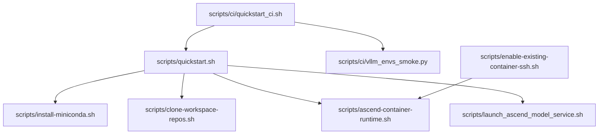
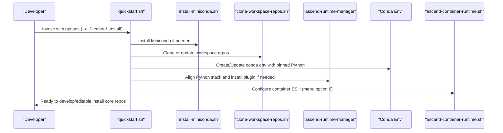
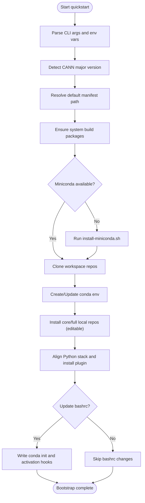
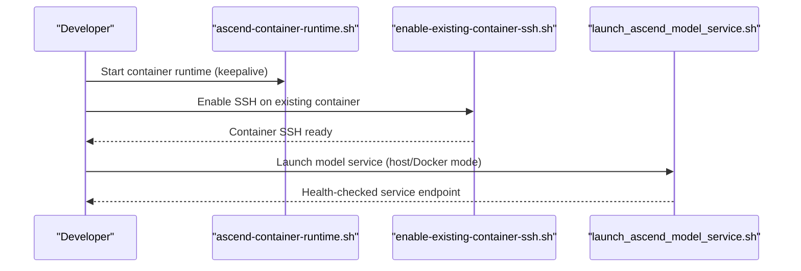
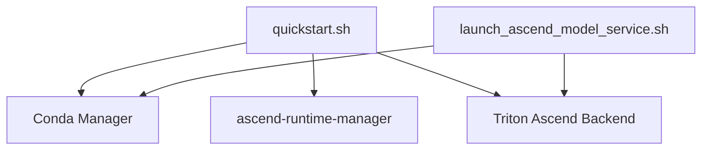

# Environment Setup and Management

<cite>
**Referenced Files in This Document**
- [quickstart.sh](file://scripts/quickstart.sh)
- [install-miniconda.sh](file://scripts/install-miniconda.sh)
- [clone-workspace-repos.sh](file://scripts/clone-workspace-repos.sh)
- [quickstart_ci.sh](file://scripts/ci/quickstart_ci.sh)
- [vllm_envs_smoke.py](file://scripts/ci/vllm_envs_smoke.py)
- [ascend-container-runtime.sh](file://scripts/ascend-container-runtime.sh)
- [launch_ascend_model_service.sh](file://scripts/launch_ascend_model_service.sh)
- [enable-existing-container-ssh.sh](file://scripts/enable-existing-container-ssh.sh)
- [README.md](file://README.md)
- [team-onboarding.md](file://docs/team-onboarding.md)
</cite>

## Table of Contents
1. [Introduction](#introduction)
2. [Project Structure](#project-structure)
3. [Core Components](#core-components)
4. [Architecture Overview](#architecture-overview)
5. [Detailed Component Analysis](#detailed-component-analysis)
6. [Dependency Analysis](#dependency-analysis)
7. [Performance Considerations](#performance-considerations)
8. [Troubleshooting Guide](#troubleshooting-guide)
9. [Conclusion](#conclusion)
10. [Appendices](#appendices)

## Introduction
This document explains environment setup and management within the VLLM-HUST Development Hub. It focuses on the interactive bootstrap system, conda environment configuration, Python package management, and Ascend runtime integration. It documents the quickstart script’s behavior, environment variable handling, automatic dependency resolution, and practical troubleshooting strategies. Examples are grounded in the actual codebase and include concrete references to source files and line ranges.

## Project Structure
The environment lifecycle is orchestrated by a set of scripts:
- Interactive bootstrap: scripts/quickstart.sh
- Miniconda installation: scripts/install-miniconda.sh
- Workspace cloning: scripts/clone-workspace-repos.sh
- CI orchestration: scripts/ci/quickstart_ci.sh
- Smoke tests: scripts/ci/vllm_envs_smoke.py
- Ascend container runtime: scripts/ascend-container-runtime.sh
- Ascend model service launcher: scripts/launch_ascend_model_service.sh
- Existing container SSH enablement: scripts/enable-existing-container-ssh.sh

**Diagram sources**
- [quickstart.sh](file://scripts/quickstart.sh)
- [install-miniconda.sh](file://scripts/install-miniconda.sh)
- [clone-workspace-repos.sh](file://scripts/clone-workspace-repos.sh)
- [quickstart_ci.sh](file://scripts/ci/quickstart_ci.sh)
- [vllm_envs_smoke.py](file://scripts/ci/vllm_envs_smoke.py)
- [ascend-container-runtime.sh](file://scripts/ascend-container-runtime.sh)
- [launch_ascend_model_service.sh](file://scripts/launch_ascend_model_service.sh)
- [enable-existing-container-ssh.sh](file://scripts/enable-existing-container-ssh.sh)

**Section sources**
- [README.md](file://README.md)
- [team-onboarding.md](file://docs/team-onboarding.md)

## Core Components
- Interactive bootstrap (quickstart.sh)
  - Detects CANN version to select the correct Python stack manifest.
  - Creates or updates a conda environment with a pinned Python version.
  - Installs core and optionally full local repositories in editable mode.
  - Integrates with ascend-runtime-manager for Python stack alignment and plugin validation.
  - Configures conda activate hooks and optional bashrc auto-activation.
  - Handles Ascend container creation and SSH configuration via menu option 6.
- Miniconda installer (install-miniconda.sh)
  - Downloads and installs Miniconda into a user-controlled prefix.
  - Safeguards against broken prefixes and supports non-interactive installation.
- Workspace cloning (clone-workspace-repos.sh)
  - Clones sibling repositories in parallel with robust retry and fallback logic.
  - Supports SSH and HTTPS auth, and can repair existing destinations.
- CI orchestrator (quickstart_ci.sh)
  - Runs quickstart in CI with deterministic environment names and logging.
  - Cleans up environments and aggregates results.
- Ascend runtime integration
  - Container runtime keepalive and SSH enablement.
  - Model service launcher supporting host and Docker modes with Ascend-specific environment variables.

**Section sources**
- [quickstart.sh](file://scripts/quickstart.sh)
- [install-miniconda.sh](file://scripts/install-miniconda.sh)
- [clone-workspace-repos.sh](file://scripts/clone-workspace-repos.sh)
- [quickstart_ci.sh](file://scripts/ci/quickstart_ci.sh)
- [ascend-container-runtime.sh](file://scripts/ascend-container-runtime.sh)
- [launch_ascend_model_service.sh](file://scripts/launch_ascend_model_service.sh)
- [enable-existing-container-ssh.sh](file://scripts/enable-existing-container-ssh.sh)

## Architecture Overview
The environment setup pipeline integrates repository synchronization, conda management, Python stack alignment, and Ascend runtime configuration.

**Diagram sources**
- [quickstart.sh](file://scripts/quickstart.sh)
- [install-miniconda.sh](file://scripts/install-miniconda.sh)
- [clone-workspace-repos.sh](file://scripts/clone-workspace-repos.sh)
- [ascend-container-runtime.sh](file://scripts/ascend-container-runtime.sh)

## Detailed Component Analysis

### Interactive Bootstrap (quickstart.sh)
- Purpose
  - One-command bootstrap: clone repos, create/update conda env, install local packages, and optionally create/start Ascend container with SSH.
- Key behaviors
  - CANN version detection to pick the correct manifest for torch/torch_npu stack.
  - Conda environment creation/update with configurable name and Python version.
  - Editable installation of core and optional full scopes.
  - Ascend-aware Python stack reconciliation via ascend-runtime-manager.
  - Conda activate hooks and optional bashrc integration.
  - Container SSH key management and container runtime keepalive.
- Options and parameters
  - --clone, --conda, --install, --install-mode, --install-scope, --ascend-lightweight, --ascend-custom-kernels, --all, --env-name, --python, --update-bashrc, -y, -h.
- Return values and exit codes
  - Returns 0 on success; non-zero on failure. Some flows skip steps when prerequisites are missing.
- Implementation highlights
  - Conda commands are executed in isolated contexts to avoid PYTHONPATH interference.
  - Pipelines ensure system build tools are present for C/C++ extensions.
  - Logging to timestamped files under user cache directory.

**Diagram sources**
- [quickstart.sh](file://scripts/quickstart.sh)

**Section sources**
- [quickstart.sh](file://scripts/quickstart.sh)

### Miniconda Installer (install-miniconda.sh)
- Purpose
  - Download and install Miniconda into a user-controlled prefix.
- Key behaviors
  - Platform detection and installer download via curl/wget.
  - Safety checks for existing unusable prefixes and backup/reinstall logic.
  - Non-interactive mode support.
- Options and parameters
  - --prefix, -y, -h.
- Return values and exit codes
  - Returns 0 on success; non-zero on failure or cancellation.

**Section sources**
- [install-miniconda.sh](file://scripts/install-miniconda.sh)

### Workspace Cloning (clone-workspace-repos.sh)
- Purpose
  - Clone sibling repositories in parallel with robust retry and fallback logic.
- Key behaviors
  - Builds and sanitizes GIT_SSH_COMMAND for reliable SSH usage.
  - Supports HTTPS fallback when SSH auth is unavailable.
  - Repair existing destinations and preserve user data.
- Options and parameters
  - -y, -h; CLONE_JOBS controls parallelism.
- Return values and exit codes
  - Returns 0 on success; non-zero if any clone job fails.

**Section sources**
- [clone-workspace-repos.sh](file://scripts/clone-workspace-repos.sh)

### CI Orchestration (quickstart_ci.sh)
- Purpose
  - CI-optimized quickstart with deterministic environment names, logging, and cleanup.
- Key behaviors
  - Resolves conda binary and cleans up environments on exit.
  - Runs smoke tests and validates runtime checks.
  - Aggregates results into summary and TSV files.
- Options and parameters
  - RUNNER_FLAVOR, PYTHON_VERSION, INSTALL_SCOPE, RESULTS_ROOT, CI_GITHUB_TOKEN, GITHUB_RUN_ID, GITHUB_RUN_ATTEMPT.
- Return values and exit codes
  - Exits with aggregated status; cleanup ensures environment removal.

**Section sources**
- [quickstart_ci.sh](file://scripts/ci/quickstart_ci.sh)

### Ascend Runtime Integration
- Container runtime keepalive
  - Ensures SSH daemon is running inside the container with configurable port and authorized keys.
- Model service launcher
  - Supports host mode (via hust-ascend-manager) and Docker mode (via /workspace mount).
  - Sets Ascend-specific environment variables and device visibility.
  - Validates plugin presence and readiness.
- Existing container SSH enablement
  - Installs OpenSSH inside a running container, creates user, sets authorized keys, and symlinks workspace directories.

**Diagram sources**
- [ascend-container-runtime.sh](file://scripts/ascend-container-runtime.sh)
- [enable-existing-container-ssh.sh](file://scripts/enable-existing-container-ssh.sh)
- [launch_ascend_model_service.sh](file://scripts/launch_ascend_model_service.sh)

**Section sources**
- [ascend-container-runtime.sh](file://scripts/ascend-container-runtime.sh)
- [launch_ascend_model_service.sh](file://scripts/launch_ascend_model_service.sh)
- [enable-existing-container-ssh.sh](file://scripts/enable-existing-container-ssh.sh)

## Dependency Analysis
- Conda environment management
  - quickstart.sh invokes run_conda_cmd and run_conda_env_cmd to isolate environment operations and manage LD_LIBRARY_PATH.
  - It detects conda run stream flags for live output and sanitizes LD_LIBRARY_PATH for system tools.
- Python stack alignment
  - quickstart.sh reads Python stack specs from ascend-runtime-manager manifests and reconciles torch/torch-npu versions.
  - It validates runtime imports and repairs installations when necessary.
- Ascend-specific configuration
  - quickstart.sh detects CANN version and selects appropriate patches for Triton Ascend backend.
  - launch_ascend_model_service.sh sets device visibility, library paths, and plugin flags for optimal performance.

**Diagram sources**
- [quickstart.sh](file://scripts/quickstart.sh)
- [launch_ascend_model_service.sh](file://scripts/launch_ascend_model_service.sh)

**Section sources**
- [quickstart.sh](file://scripts/quickstart.sh)
- [launch_ascend_model_service.sh](file://scripts/launch_ascend_model_service.sh)

## Performance Considerations
- Long-running installs
  - quickstart.sh emits periodic heartbeat logs and streams pip output when possible to avoid perceived stalls.
- CANN and Triton compatibility
  - Automatic patching of Triton Ascend npu_utils.cpp for CANN 9.0.0+ prevents JIT compilation failures.
- Device and kernel selection
  - launch_ascend_model_service.sh exposes flags to tune FlashComm1, fused MC2, and enforce eager mode to mitigate JIT issues and improve throughput.

**Section sources**
- [quickstart.sh](file://scripts/quickstart.sh)
- [launch_ascend_model_service.sh](file://scripts/launch_ascend_model_service.sh)

## Troubleshooting Guide
- Miniconda installation problems
  - Broken or relocated prefixes are detected and backed up; the script reinstalls Miniconda before proceeding.
  - Use non-interactive mode with --prefix and -y to automate installation.
- Environment conflicts
  - quickstart.sh removes conflicting PyTorch packages before reconciling the Python stack.
  - It validates torch/torch-npu runtime imports and forces reinstall if needed.
- Python version management
  - The environment is created with a pinned Python version; use --python to override during bootstrap.
- Ascend runtime issues
  - Ensure CANN version detection succeeds; the script selects manifests accordingly.
  - For Docker mode, confirm container-native Python has vllm and vllm-ascend-hust installed and that LD_LIBRARY_PATH includes torch/torch_npu libs.
- Container SSH connectivity
  - Use menu option 6 in quickstart.sh to configure container SSH and authorized keys.
  - For existing containers, run enable-existing-container-ssh.sh to install OpenSSH and symlink workspace directories.

**Section sources**
- [install-miniconda.sh](file://scripts/install-miniconda.sh)
- [quickstart.sh](file://scripts/quickstart.sh)
- [launch_ascend_model_service.sh](file://scripts/launch_ascend_model_service.sh)
- [enable-existing-container-ssh.sh](file://scripts/enable-existing-container-ssh.sh)

## Conclusion
The VLLM-HUST Development Hub provides a robust, interactive environment setup system centered on quickstart.sh. It automates repository synchronization, conda environment creation, Python stack alignment, and Ascend runtime integration. The included scripts and CI helpers ensure reproducible setups across diverse environments, while built-in safeguards and troubleshooting pathways address common pitfalls.

## Appendices

### Quickstart Script Options and Parameters
- --clone: Sync workspace repositories.
- --conda: Create or update conda environment.
- --install: Install local repositories into existing environment.
- --install-mode: install or refresh.
- --install-scope: core or full.
- --ascend-lightweight: Lightweight Ascend plugin mode (COMPILE_CUSTOM_KERNELS=0).
- --ascend-custom-kernels: Explicitly set Ascend plugin compile flag.
- --all: Execute clone + conda + install(core).
- --env-name: Conda environment name.
- --python: Python version for the environment.
- --update-bashrc: Update ~/.bashrc for auto-activation.
- -y, --yes: Non-interactive mode.
- -h, --help: Show help.

**Section sources**
- [quickstart.sh](file://scripts/quickstart.sh)

### CI Environment Variables
- RUNNER_FLAVOR: CI runner flavor.
- PYTHON_VERSION: Python version for CI environment.
- INSTALL_SCOPE: Scope for CI install (core/full).
- RESULTS_ROOT: Root directory for CI results.
- CI_GITHUB_TOKEN: Token for authenticated Git operations.
- GITHUB_RUN_ID/GITHUB_RUN_ATTEMPT: Unique identifiers for CI runs.

**Section sources**
- [quickstart_ci.sh](file://scripts/ci/quickstart_ci.sh)

### Ascend Model Service Flags
- --docker: Run inside a Docker container.
- --env: Conda environment name.
- --model: Model identifier or path.
- --host/--port: Bind host and port.
- --tp: Tensor parallel size.
- --preset: Preset configuration (e.g., w8a8, coder).
- --download-model: Download model from ModelScope before launch.
- --skip-setup: Skip hust-ascend-manager env setup (host mode).
- --no-health-check: Skip health check.
- --foreground: Run in foreground.
- --dry-run: Print command only.

**Section sources**
- [launch_ascend_model_service.sh](file://scripts/launch_ascend_model_service.sh)