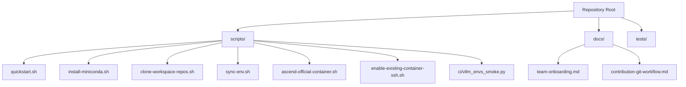
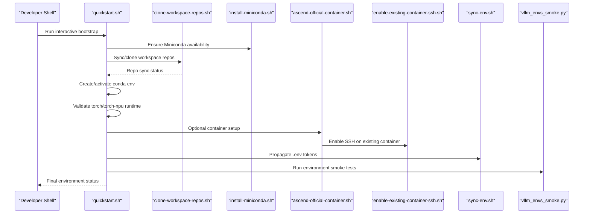
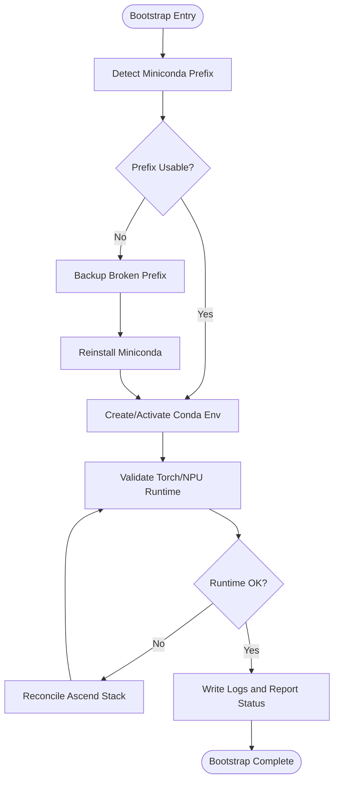
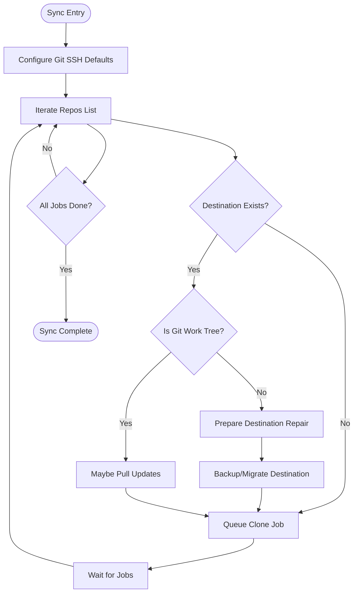
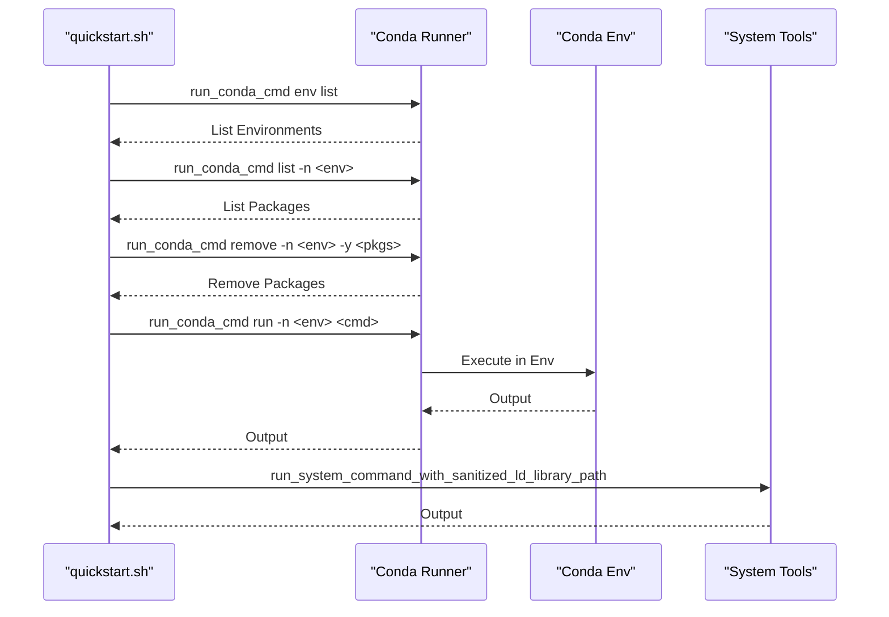
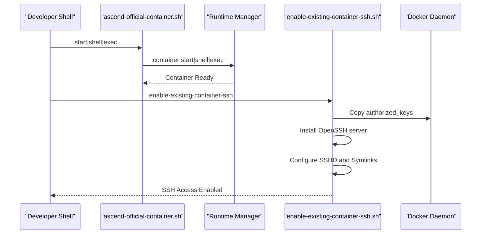
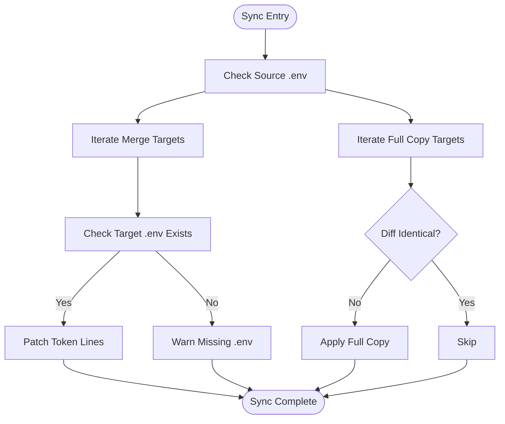
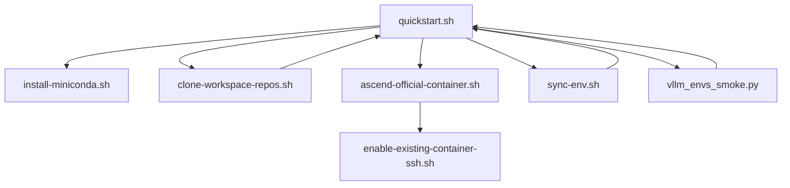

# Environment Troubleshooting

<cite>
**Referenced Files in This Document**
- [README.md](file://README.md)
- [scripts/quickstart.sh](file://scripts/quickstart.sh)
- [scripts/install-miniconda.sh](file://scripts/install-miniconda.sh)
- [scripts/clone-workspace-repos.sh](file://scripts/clone-workspace-repos.sh)
- [scripts/sync-env.sh](file://scripts/sync-env.sh)
- [scripts/ascend-official-container.sh](file://scripts/ascend-official-container.sh)
- [scripts/enable-existing-container-ssh.sh](file://scripts/enable-existing-container-ssh.sh)
- [scripts/ci/vllm_envs_smoke.py](file://scripts/ci/vllm_envs_smoke.py)
- [env-verify-after-quickstart.txt](file://env-verify-after-quickstart.txt)
- [docs/team-onboarding.md](file://docs/team-onboarding.md)
- [docs/contribution-git-workflow.md](file://docs/contribution-git-workflow.md)
</cite>

## Table of Contents
1. [Introduction](#introduction)
2. [Project Structure](#project-structure)
3. [Core Components](#core-components)
4. [Architecture Overview](#architecture-overview)
5. [Detailed Component Analysis](#detailed-component-analysis)
6. [Dependency Analysis](#dependency-analysis)
7. [Performance Considerations](#performance-considerations)
8. [Troubleshooting Guide](#troubleshooting-guide)
9. [Conclusion](#conclusion)
10. [Appendices](#appendices)

## Introduction
This document provides a comprehensive environment troubleshooting guide for the VLLM-HUST Development Hub. It focuses on diagnosing and resolving environment issues encountered during development, including repository synchronization, conda environment setup, Ascend containerization, and environment validation. It explains the implementation details of environment validation, error detection, and recovery mechanisms, and offers practical workflows grounded in the repository’s scripts and documentation.

## Project Structure
The repository centers around a multi-repo workspace and a set of automation scripts that bootstrap environments, synchronize repositories, and manage containerized development. Key areas include:
- Workspace bootstrap and environment setup
- Repository synchronization with robust repair logic
- Conda environment creation and maintenance
- Ascend container orchestration and SSH enablement
- Environment propagation and validation

**Diagram sources**
- [README.md](file://README.md)
- [scripts/quickstart.sh](file://scripts/quickstart.sh)
- [scripts/install-miniconda.sh](file://scripts/install-miniconda.sh)
- [scripts/clone-workspace-repos.sh](file://scripts/clone-workspace-repos.sh)
- [scripts/sync-env.sh](file://scripts/sync-env.sh)
- [scripts/ascend-official-container.sh](file://scripts/ascend-official-container.sh)
- [scripts/enable-existing-container-ssh.sh](file://scripts/enable-existing-container-ssh.sh)
- [scripts/ci/vllm_envs_smoke.py](file://scripts/ci/vllm_envs_smoke.py)
- [docs/team-onboarding.md](file://docs/team-onboarding.md)
- [docs/contribution-git-workflow.md](file://docs/contribution-git-workflow.md)

**Section sources**
- [README.md](file://README.md)
- [docs/team-onboarding.md](file://docs/team-onboarding.md)

## Core Components
- Environment bootstrap and validation: orchestrated by the interactive quickstart script, which detects system prerequisites, manages conda environments, reconciles Ascend Python stacks, and validates runtime imports.
- Repository synchronization: a parallelized clone-and-update pipeline with robust repair logic for corrupted or partially initialized destinations.
- Conda environment management: installation, isolation from external PYTHONPATH, and environment-specific command execution.
- Container orchestration: automated container lifecycle, SSH enablement, and workspace mounting tailored for Ascend development.
- Environment propagation: centralized propagation of token configurations across sibling repositories with safe merging and dry-run previews.
- Validation and smoke testing: environment import validation and targeted smoke tests for environment variables.

**Section sources**
- [scripts/quickstart.sh](file://scripts/quickstart.sh)
- [scripts/clone-workspace-repos.sh](file://scripts/clone-workspace-repos.sh)
- [scripts/sync-env.sh](file://scripts/sync-env.sh)
- [scripts/ascend-official-container.sh](file://scripts/ascend-official-container.sh)
- [scripts/ci/vllm_envs_smoke.py](file://scripts/ci/vllm_envs_smoke.py)

## Architecture Overview
The environment troubleshooting architecture integrates repository synchronization, conda environment management, and container orchestration. The following diagram maps the primary flows and their interactions.

**Diagram sources**
- [scripts/quickstart.sh](file://scripts/quickstart.sh)
- [scripts/install-miniconda.sh](file://scripts/install-miniconda.sh)
- [scripts/clone-workspace-repos.sh](file://scripts/clone-workspace-repos.sh)
- [scripts/ascend-official-container.sh](file://scripts/ascend-official-container.sh)
- [scripts/enable-existing-container-ssh.sh](file://scripts/enable-existing-container-ssh.sh)
- [scripts/sync-env.sh](file://scripts/sync-env.sh)
- [scripts/ci/vllm_envs_smoke.py](file://scripts/ci/vllm_envs_smoke.py)

## Detailed Component Analysis

### Environment Bootstrap and Validation
The bootstrap process orchestrates environment preparation, including Miniconda detection, conda environment creation, and runtime validation. It includes safeguards against conflicting packages and environment drift.

Key behaviors:
- Miniconda detection and repair: detects unusable prefixes and backs them up before reinstalling.
- Conda isolation: runs commands with PYTHONPATH cleared and environment-specific HOME/XDG dirs to avoid contamination.
- Runtime validation: verifies torch/torch-npu imports and reconciles the Ascend Python stack via the runtime manager when needed.
- Logging: captures console output to timestamped log files for post-mortem analysis.

**Diagram sources**
- [scripts/quickstart.sh](file://scripts/quickstart.sh)
- [scripts/install-miniconda.sh](file://scripts/install-miniconda.sh)

**Section sources**
- [scripts/quickstart.sh](file://scripts/quickstart.sh)
- [scripts/install-miniconda.sh](file://scripts/install-miniconda.sh)

### Repository Synchronization and Repair
The repository synchronization script performs parallel cloning and updates with robust repair logic for corrupted or partially initialized destinations. It handles retries, protocol fallbacks, and interactive prompts for user decisions.

Key behaviors:
- Parallel cloning with configurable concurrency.
- Retry logic with exponential backoff for transient network issues.
- Destination repair: empty directories are removed; non-empty non-git destinations are backed up and re-cloned upon user consent.
- Protocol fallback: SSH failures fall back to HTTPS when possible.
- Upstream tracking and pull with fast-forward only.

**Diagram sources**
- [scripts/clone-workspace-repos.sh](file://scripts/clone-workspace-repos.sh)

**Section sources**
- [scripts/clone-workspace-repos.sh](file://scripts/clone-workspace-repos.sh)

### Conda Environment Management
Conda environment management is designed to minimize interference from external environment variables and ensure reproducible installations.

Key behaviors:
- Isolation: runs conda commands with PYTHONPATH unset and environment-specific cache/config directories.
- Environment discovery: resolves environment prefix and Python binary path.
- Package conflict resolution: removes conflicting PyTorch packages before reconciliation.
- Command execution: wraps commands with environment-specific LD_LIBRARY_PATH when applicable.

**Diagram sources**
- [scripts/quickstart.sh](file://scripts/quickstart.sh)

**Section sources**
- [scripts/quickstart.sh](file://scripts/quickstart.sh)

### Ascend Container Orchestration and SSH Enablement
Container orchestration automates container lifecycle, SSH enablement, and workspace mounting. It also includes logic to relocate Docker data-root when necessary.

Key behaviors:
- Container lifecycle: start, shell, exec, and SSH deployment via the runtime manager.
- SSH enablement: prepares authorized keys, creates users/groups, installs OpenSSH server, and sets up SSHD with secure defaults.
- Workspace mounting: symlinks sibling repositories into the container for seamless development.
- Docker data-root relocation: detects low disk space and migrates Docker data-root to a larger volume when beneficial.

**Diagram sources**
- [scripts/ascend-official-container.sh](file://scripts/ascend-official-container.sh)
- [scripts/enable-existing-container-ssh.sh](file://scripts/enable-existing-container-ssh.sh)

**Section sources**
- [scripts/ascend-official-container.sh](file://scripts/ascend-official-container.sh)
- [scripts/enable-existing-container-ssh.sh](file://scripts/enable-existing-container-ssh.sh)

### Environment Propagation and Validation
Environment propagation synchronizes token configurations across sibling repositories with safe merging and dry-run previews. Environment validation includes smoke tests for environment variables.

Key behaviors:
- Centralized token management: defines token keys and targets for full copy vs. merge.
- Dry-run preview: shows differences before applying changes.
- Safe merging: patches only token lines in target .env files while preserving other settings.
- Smoke testing: validates environment variable parsing and error handling for invalid values.

**Diagram sources**
- [scripts/sync-env.sh](file://scripts/sync-env.sh)

**Section sources**
- [scripts/sync-env.sh](file://scripts/sync-env.sh)
- [scripts/ci/vllm_envs_smoke.py](file://scripts/ci/vllm_envs_smoke.py)

## Dependency Analysis
The environment troubleshooting system relies on a set of interdependent scripts and documented workflows. The following diagram highlights key dependencies and relationships.

**Diagram sources**
- [scripts/quickstart.sh](file://scripts/quickstart.sh)
- [scripts/install-miniconda.sh](file://scripts/install-miniconda.sh)
- [scripts/clone-workspace-repos.sh](file://scripts/clone-workspace-repos.sh)
- [scripts/ascend-official-container.sh](file://scripts/ascend-official-container.sh)
- [scripts/enable-existing-container-ssh.sh](file://scripts/enable-existing-container-ssh.sh)
- [scripts/sync-env.sh](file://scripts/sync-env.sh)
- [scripts/ci/vllm_envs_smoke.py](file://scripts/ci/vllm_envs_smoke.py)

**Section sources**
- [scripts/quickstart.sh](file://scripts/quickstart.sh)
- [scripts/clone-workspace-repos.sh](file://scripts/clone-workspace-repos.sh)
- [scripts/sync-env.sh](file://scripts/sync-env.sh)
- [scripts/ascend-official-container.sh](file://scripts/ascend-official-container.sh)
- [scripts/enable-existing-container-ssh.sh](file://scripts/enable-existing-container-ssh.sh)
- [scripts/ci/vllm_envs_smoke.py](file://scripts/ci/vllm_envs_smoke.py)

## Performance Considerations
- Parallel cloning: adjust the number of concurrent clone jobs to balance throughput and resource usage.
- Retry backoff: transient network issues are handled with exponential backoff to reduce wasted attempts.
- Long-running installs: heartbeat logging prevents perceived stalls during large package installations.
- Container data-root relocation: moving Docker data-root can improve I/O performance and reduce pull failures on constrained storage.

[No sources needed since this section provides general guidance]

## Troubleshooting Guide

### Common Environment Issues and Resolutions
- Environment corruption (broken Miniconda prefix)
  - Symptom: unusable conda executable or base path mismatch.
  - Resolution: the miniconda installer detects unusable prefixes, backs them up, and reinstalls Miniconda.
  - Related implementation: [scripts/install-miniconda.sh](file://scripts/install-miniconda.sh)

- Dependency conflicts (PyTorch packages)
  - Symptom: import failures or inconsistent torch/torch-npu versions.
  - Resolution: remove conflicting packages and reconcile the Ascend Python stack using the runtime manager.
  - Related implementation: [scripts/quickstart.sh](file://scripts/quickstart.sh)

- Container SSH enablement failures
  - Symptom: SSH connection refused or missing authorized_keys.
  - Resolution: ensure public keys are present and properly merged; install OpenSSH server inside the container; configure SSHD securely.
  - Related implementation: [scripts/ascend-official-container.sh](file://scripts/ascend-official-container.sh), [scripts/enable-existing-container-ssh.sh](file://scripts/enable-existing-container-ssh.sh)

- Repository synchronization failures
  - Symptom: partial clones, permission errors, or protocol mismatches.
  - Resolution: use retry logic; fall back from SSH to HTTPS; repair non-git destinations by backing them up and re-cloning.
  - Related implementation: [scripts/clone-workspace-repos.sh](file://scripts/clone-workspace-repos.sh)

- Environment variable validation errors
  - Symptom: invalid values for environment variables cause exceptions.
  - Resolution: use the smoke test to validate parsing and error messages; correct environment variables accordingly.
  - Related implementation: [scripts/ci/vllm_envs_smoke.py](file://scripts/ci/vllm_envs_smoke.py)

### Diagnostic Procedures
- Verify environment after bootstrap
  - Use the environment verification log to check for warnings and errors, especially around ownership mismatches and missing packages.
  - Reference: [env-verify-after-quickstart.txt](file://env-verify-after-quickstart.txt)

- Validate container health
  - Confirm SSH access and workspace symlinks; check Docker data-root relocation if storage is low.
  - Reference: [scripts/ascend-official-container.sh](file://scripts/ascend-official-container.sh), [scripts/enable-existing-container-ssh.sh](file://scripts/enable-existing-container-ssh.sh)

- Reconcile environment state
  - Re-run the bootstrap script to detect and fix environment drift; use install-only mode to refresh editable installs without recreating the environment.
  - Reference: [README.md](file://README.md), [scripts/quickstart.sh](file://scripts/quickstart.sh)

### Recovery Mechanisms
- Repository repair
  - Back up and re-clone non-git destinations; use HTTPS fallback when SSH fails.
  - Reference: [scripts/clone-workspace-repos.sh](file://scripts/clone-workspace-repos.sh)

- Environment restoration
  - Remove conflicting packages and reconcile the Ascend Python stack; reinstall packages if validation continues to fail.
  - Reference: [scripts/quickstart.sh](file://scripts/quickstart.sh)

- Token propagation
  - Use dry-run to preview changes; apply only after confirming diffs; merge tokens safely into target .env files.
  - Reference: [scripts/sync-env.sh](file://scripts/sync-env.sh)

### Configuration Options and Environment Variables
- Conda and environment hooks
  - HF endpoint auto-switch behavior controlled by environment variables; manager env hook controlled by a dedicated flag.
  - Reference: [README.md](file://README.md), [scripts/quickstart.sh](file://scripts/quickstart.sh)

- Container and SSH settings
  - Container name, workspace roots, SSH user/port, and authorized keys source are configurable.
  - Reference: [scripts/ascend-official-container.sh](file://scripts/ascend-official-container.sh), [scripts/enable-existing-container-ssh.sh](file://scripts/enable-existing-container-ssh.sh)

- Ascend custom kernel behavior
  - Explicit override for custom kernel compilation; auto-detection when prerequisites are present.
  - Reference: [scripts/quickstart.sh](file://scripts/quickstart.sh)

### System Tools and Environment Health Checks
- System build packages
  - Ensures gcc/g++/python-dev/zlib/git/make are present across supported distributions.
  - Reference: [scripts/quickstart.sh](file://scripts/quickstart.sh)

- Environment logging
  - Console output is tee’d to timestamped log files for diagnostics.
  - Reference: [scripts/quickstart.sh](file://scripts/quickstart.sh)

**Section sources**
- [scripts/install-miniconda.sh](file://scripts/install-miniconda.sh)
- [scripts/quickstart.sh](file://scripts/quickstart.sh)
- [scripts/clone-workspace-repos.sh](file://scripts/clone-workspace-repos.sh)
- [scripts/ascend-official-container.sh](file://scripts/ascend-official-container.sh)
- [scripts/enable-existing-container-ssh.sh](file://scripts/enable-existing-container-ssh.sh)
- [scripts/sync-env.sh](file://scripts/sync-env.sh)
- [scripts/ci/vllm_envs_smoke.py](file://scripts/ci/vllm_envs_smoke.py)
- [README.md](file://README.md)
- [env-verify-after-quickstart.txt](file://env-verify-after-quickstart.txt)

## Conclusion
The VLLM-HUST Development Hub provides a robust, script-driven environment for Ascend-based development. By leveraging repository synchronization, conda environment management, container orchestration, and environment validation, teams can systematically diagnose and resolve environment issues. The included scripts and documentation offer practical workflows for repairing corrupted environments, reconciling dependencies, enabling container SSH access, and propagating configuration tokens. Adopting the recommended procedures and configuration options ensures reliable and repeatable development environments.

[No sources needed since this section summarizes without analyzing specific files]

## Appendices

### Quickstart Non-Interactive Examples
- One-command bootstrap: clone + conda setup + install core repos.
- Conda-only setup with custom environment name and Python version.
- Install-only flows to refresh editable installs without recreating the environment.

Reference: [README.md](file://README.md)

### Team Onboarding References
- End-to-end container and environment setup workflow.
- SSH configuration and connection examples.
- Container SSH enablement and workspace mounting.

Reference: [docs/team-onboarding.md](file://docs/team-onboarding.md)