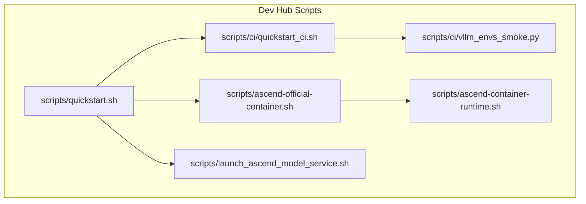
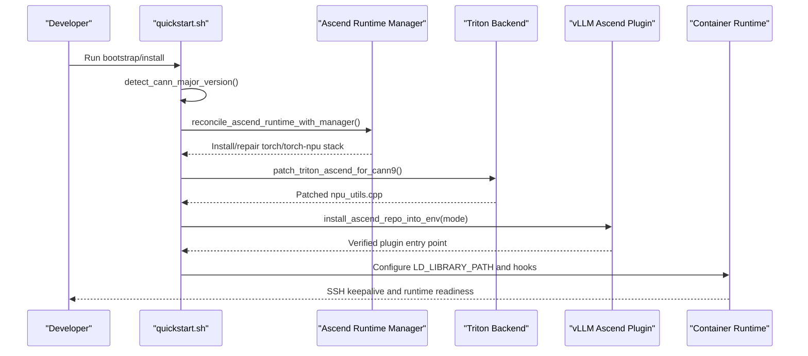
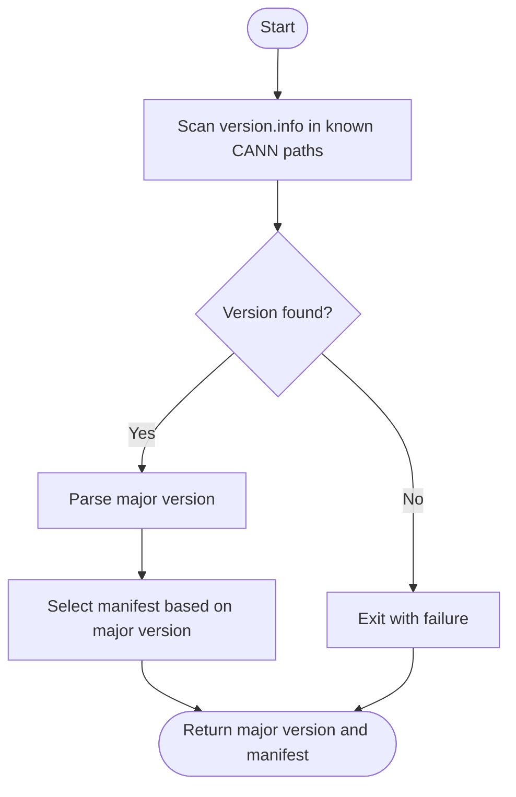
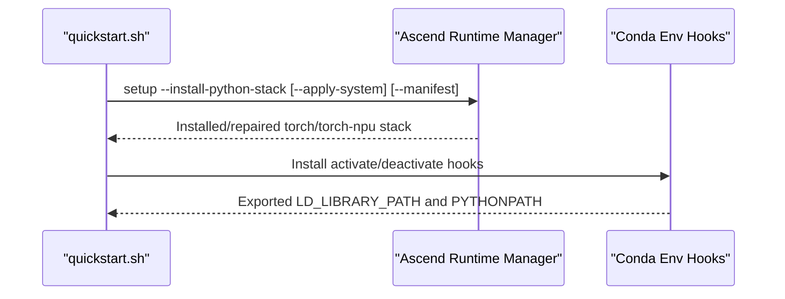
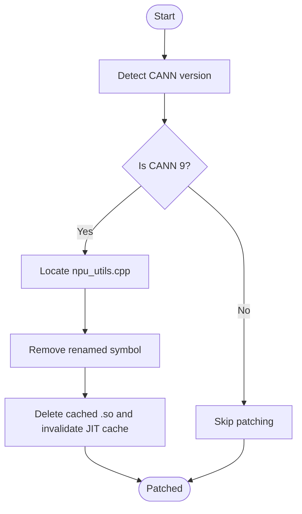
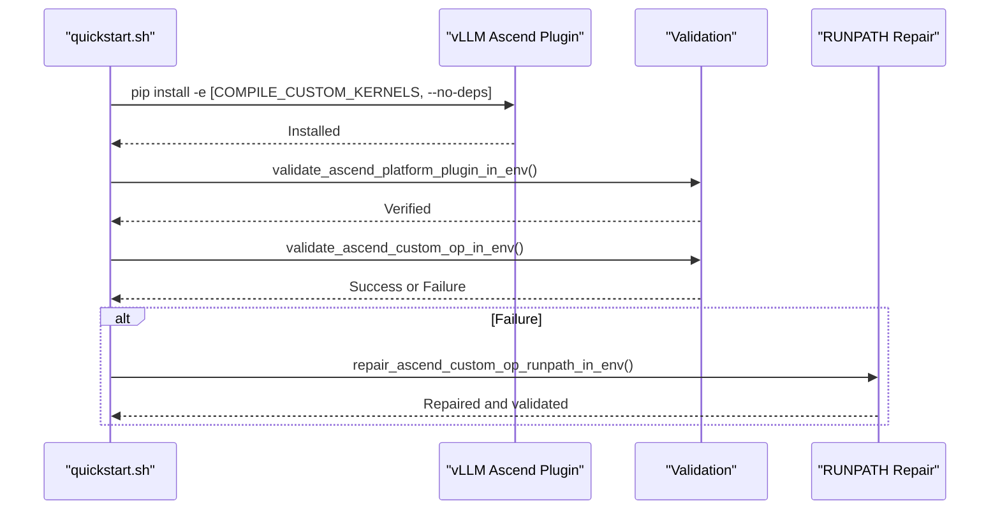
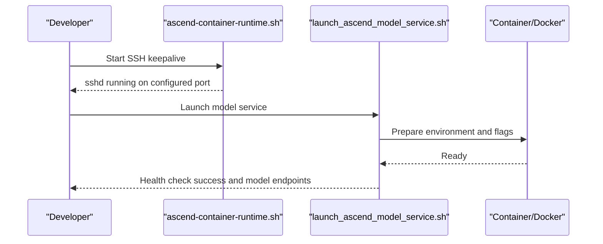
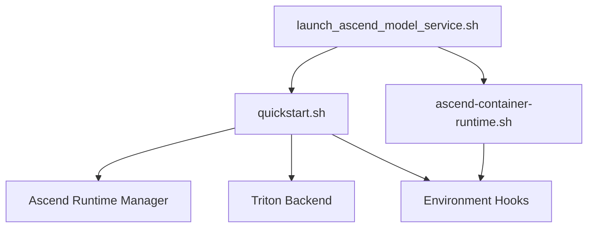

# Hardware-Specific Optimizations

<cite>
**Referenced Files in This Document**
- [README.md](file://README.md)
- [quickstart.sh](file://scripts/quickstart.sh)
- [ascend-official-container.sh](file://scripts/ascend-official-container.sh)
- [ascend-container-runtime.sh](file://scripts/ascend-container-runtime.sh)
- [quickstart_ci.sh](file://scripts/ci/quickstart_ci.sh)
- [vllm_envs_smoke.py](file://scripts/ci/vllm_envs_smoke.py)
- [launch_ascend_model_service.sh](file://scripts/launch_ascend_model_service.sh)
</cite>

## Table of Contents
1. [Introduction](#introduction)
2. [Project Structure](#project-structure)
3. [Core Components](#core-components)
4. [Architecture Overview](#architecture-overview)
5. [Detailed Component Analysis](#detailed-component-analysis)
6. [Dependency Analysis](#dependency-analysis)
7. [Performance Considerations](#performance-considerations)
8. [Troubleshooting Guide](#troubleshooting-guide)
9. [Conclusion](#conclusion)

## Introduction
This document explains hardware-specific optimizations for Ascend NPU within the VLLM-HUST Development Hub. It focuses on:
- CANN toolkit detection and manifest resolution
- Ascend runtime configuration and environment hooks
- Hardware-accelerated package management for vLLM Ascend plugins
- Triton kernel compilation and runtime patching for CANN 9 compatibility
- Practical configuration options and return values
- Common issues and resolutions

The goal is to make these optimizations understandable for beginners while providing deep technical insights for experienced developers.

## Project Structure
The Dev Hub centralizes Ascend-related automation across scripts and workflows:
- Bootstrap and environment management: scripts/quickstart.sh
- Official container orchestration: scripts/ascend-official-container.sh
- Container SSH keepalive: scripts/ascend-container-runtime.sh
- CI integration: scripts/ci/quickstart_ci.sh and scripts/ci/vllm_envs_smoke.py
- Model service launcher: scripts/launch_ascend_model_service.sh
- Project overview and usage: README.md

**Diagram sources**
- [quickstart.sh:1-2732](file://scripts/quickstart.sh#L1-2732)
- [ascend-official-container.sh:1-388](file://scripts/ascend-official-container.sh#L1-388)
- [ascend-container-runtime.sh:1-55](file://scripts/ascend-container-runtime.sh#L1-55)
- [quickstart_ci.sh:1-321](file://scripts/ci/quickstart_ci.sh#L1-321)
- [vllm_envs_smoke.py:1-69](file://scripts/ci/vllm_envs_smoke.py#L1-69)
- [launch_ascend_model_service.sh:1-680](file://scripts/launch_ascend_model_service.sh#L1-680)

**Section sources**
- [README.md:1-288](file://README.md#L1-288)

## Core Components
This section highlights the primary mechanisms for Ascend hardware acceleration in the Dev Hub.

- CANN version detection and manifest resolution
  - Detects CANN major version by parsing version.info from known toolkit paths and selects a matching manifest for the Ascend Python stack.
  - Returns the major version number (e.g., 8 or 9) or exits with failure if undetected.

- Ascend runtime reconciliation and environment hooks
  - Reconciles torch/torch-npu stack against the detected CANN version via the Ascend runtime manager.
  - Installs conda environment hooks to manage LD_LIBRARY_PATH and PYTHONPATH for torch/torch_npu and Ascend toolkits.

- Triton kernel compatibility and JIT patching
  - Detects CANN 9 and patches triton-ascend’s npu_utils.cpp to replace renamed symbols for compatibility.
  - Ensures pybind11 is installed for triton-ascend’s Ascend backend.

- Ascend plugin installation modes
  - Lightweight mode (COMPILE_CUSTOM_KERNELS=0): installs a minimal plugin without compiling custom C++ kernels.
  - Custom-kernel mode (COMPILE_CUSTOM_KERNELS=1): compiles Catapult-based kernels and repairs RUNPATH for the _C_ascend extension.

- Containerized Ascend runtime
  - Provides container SSH keepalive and environment setup for Ascend workloads.
  - Launches Ascend model services in host or Docker mode with preset configurations.

**Section sources**
- [quickstart.sh:18-58](file://scripts/quickstart.sh#L18-58)
- [quickstart.sh:433-451](file://scripts/quickstart.sh#L433-451)
- [quickstart.sh:581-620](file://scripts/quickstart.sh#L581-620)
- [quickstart.sh:841-899](file://scripts/quickstart.sh#L841-899)
- [quickstart.sh:1764-1806](file://scripts/quickstart.sh#L1764-1806)
- [quickstart.sh:2070-2413](file://scripts/quickstart.sh#L2070-2413)
- [ascend-container-runtime.sh:1-55](file://scripts/ascend-container-runtime.sh#L1-55)
- [launch_ascend_model_service.sh:1-680](file://scripts/launch_ascend_model_service.sh#L1-680)

## Architecture Overview
The hardware-specific optimization pipeline integrates detection, reconciliation, and runtime configuration across user-space and containerized environments.

**Diagram sources**
- [quickstart.sh:18-58](file://scripts/quickstart.sh#L18-58)
- [quickstart.sh:581-620](file://scripts/quickstart.sh#L581-620)
- [quickstart.sh:841-899](file://scripts/quickstart.sh#L841-899)
- [quickstart.sh:1764-1806](file://scripts/quickstart.sh#L1764-1806)
- [quickstart.sh:2070-2413](file://scripts/quickstart.sh#L2070-2413)
- [ascend-container-runtime.sh:1-55](file://scripts/ascend-container-runtime.sh#L1-55)

## Detailed Component Analysis

### CANN Toolkit Detection and Manifest Resolution
- Purpose: Determine the installed CANN major version and select the appropriate Python stack manifest for torch/torch-npu alignment.
- Implementation:
  - Scans version.info files in well-known CANN toolkit locations (including ASCEND_HOME_PATH, system paths, and conda-managed paths).
  - Extracts the major version number and returns it; otherwise exits with failure.
  - Resolves a default manifest path based on the detected major version (CANN 9 vs legacy).
- Key return values:
  - Major version number (8 or 9) or failure exit code.
  - Manifest path string for the Ascend runtime manager.

**Diagram sources**
- [quickstart.sh:18-58](file://scripts/quickstart.sh#L18-58)

**Section sources**
- [quickstart.sh:18-58](file://scripts/quickstart.sh#L18-58)

### Ascend Runtime Reconciliation and Environment Hooks
- Purpose: Align the Python environment with the detected CANN version and ensure runtime libraries are discoverable.
- Implementation:
  - Calls the Ascend runtime manager to reconcile torch/torch-npu stack and optionally apply system-level steps.
  - Installs conda environment hooks to manage LD_LIBRARY_PATH and PYTHONPATH for torch/torch_npu and Ascend toolkits.
  - Prepends torch/torch_npu lib directories to LD_LIBRARY_PATH to resolve shared object dependencies at import time.
- Key return values:
  - Success/failure of reconciliation and hook installation.
  - Updated environment variables for runtime discovery.

**Diagram sources**
- [quickstart.sh:1764-1806](file://scripts/quickstart.sh#L1764-1806)
- [quickstart.sh:2070-2413](file://scripts/quickstart.sh#L2070-2413)

**Section sources**
- [quickstart.sh:1764-1806](file://scripts/quickstart.sh#L1764-1806)
- [quickstart.sh:2070-2413](file://scripts/quickstart.sh#L2070-2413)

### Triton Kernel Compilation and CANN 9 Compatibility
- Purpose: Ensure Triton kernels for Ascend compile and run correctly with CANN 9 by patching renamed symbols.
- Implementation:
  - Detects CANN 9 and locates triton-ascend’s npu_utils.cpp.
  - Removes the renamed symbol and clears the JIT cache to force recompilation.
  - Ensures pybind11 is installed for the Ascend backend.
- Key return values:
  - Success/failure of patching and JIT cache invalidation.
  - Validation result for Triton backend availability.

**Diagram sources**
- [quickstart.sh:581-620](file://scripts/quickstart.sh#L581-620)

**Section sources**
- [quickstart.sh:581-620](file://scripts/quickstart.sh#L581-620)

### Ascend Plugin Installation Modes and Custom Kernel Compilation
- Purpose: Provide flexible installation modes for the Ascend vLLM plugin with optional custom kernel compilation.
- Implementation:
  - Lightweight mode (COMPILE_CUSTOM_KERNELS=0): installs without compiling custom C++ kernels; uses --no-deps for editable install.
  - Custom-kernel mode (COMPILE_CUSTOM_KERNELS=1): ensures build prerequisites (cmake, nanobind), initializes Catapult submodule, and compiles kernels.
  - Validates platform plugin entry point and custom op import; repairs RUNPATH for _C_ascend if needed.
- Key return values:
  - Success/failure of editable install and validation.
  - Repair outcome for RUNPATH and custom op import.

**Diagram sources**
- [quickstart.sh:841-899](file://scripts/quickstart.sh#L841-899)

**Section sources**
- [quickstart.sh:841-899](file://scripts/quickstart.sh#L841-899)

### Containerized Ascend Runtime and Model Service Launch
- Purpose: Provide containerized Ascend runtime with SSH keepalive and streamlined model service launch.
- Implementation:
  - Container SSH keepalive script starts sshd with configurable port and authorized keys.
  - Model service launcher supports host mode (via Ascend runtime manager) and Docker mode (mounts workspace, sets NPU devices, and launches vLLM).
  - Applies preset configurations for common models and toggles performance-related flags (e.g., enforce eager, flash communication).
- Key return values:
  - Process PID and health check outcomes.
  - Command construction for dry-run inspection.

**Diagram sources**
- [ascend-container-runtime.sh:1-55](file://scripts/ascend-container-runtime.sh#L1-55)
- [launch_ascend_model_service.sh:1-680](file://scripts/launch_ascend_model_service.sh#L1-680)

**Section sources**
- [ascend-container-runtime.sh:1-55](file://scripts/ascend-container-runtime.sh#L1-55)
- [launch_ascend_model_service.sh:1-680](file://scripts/launch_ascend_model_service.sh#L1-680)

## Dependency Analysis
Key dependencies and relationships among components:

- quickstart.sh depends on:
  - Ascend runtime manager for Python stack reconciliation and manifest-driven installs.
  - Triton backend for Ascend kernels and compatibility patching.
  - Environment hooks to manage LD_LIBRARY_PATH and PYTHONPATH for torch/torch_npu and Ascend toolkits.
- Container runtime scripts depend on:
  - Conda environment activation hooks for library path management.
  - Ascend toolkit environment sourcing for device libraries.

**Diagram sources**
- [quickstart.sh:1764-1806](file://scripts/quickstart.sh#L1764-1806)
- [quickstart.sh:2070-2413](file://scripts/quickstart.sh#L2070-2413)
- [ascend-container-runtime.sh:1-55](file://scripts/ascend-container-runtime.sh#L1-55)
- [launch_ascend_model_service.sh:1-680](file://scripts/launch_ascend_model_service.sh#L1-680)

**Section sources**
- [quickstart.sh:1764-1806](file://scripts/quickstart.sh#L1764-1806)
- [quickstart.sh:2070-2413](file://scripts/quickstart.sh#L2070-2413)
- [ascend-container-runtime.sh:1-55](file://scripts/ascend-container-runtime.sh#L1-55)
- [launch_ascend_model_service.sh:1-680](file://scripts/launch_ascend_model_service.sh#L1-680)

## Performance Considerations
- Prefer custom-kernel mode (COMPILE_CUSTOM_KERNELS=1) for production Ascend deployments to leverage optimized Catapult-based kernels.
- Use lightweight mode (COMPILE_CUSTOM_KERNELS=0) for rapid iteration or constrained environments where compilation is not feasible.
- Ensure LD_LIBRARY_PATH precedence for torch/torch_npu libs to avoid dynamic loader ambiguity and improve import reliability.
- In containerized environments, mount the workspace to load local vLLM forks and avoid CANN version mismatches between host and container runtimes.
- Apply preset configurations for common models to balance throughput and latency trade-offs (e.g., disabling FlashComm1 for dense models).

[No sources needed since this section provides general guidance]

## Troubleshooting Guide
Common issues and resolutions:

- CANN version conflicts
  - Symptom: Triton kernel compilation fails due to renamed symbols.
  - Resolution: Ensure CANN 9 detection triggers the patch; verify npu_utils.cpp patching and JIT cache invalidation.
  - Related code paths:
    - [quickstart.sh:581-620](file://scripts/quickstart.sh#L581-620)

- Kernel compilation failures
  - Symptom: Custom kernel build prerequisites missing or compilation errors.
  - Resolution: Install cmake and nanobind; initialize Catapult submodule; validate platform plugin and custom op import; repair RUNPATH if needed.
  - Related code paths:
    - [quickstart.sh:550-579](file://scripts/quickstart.sh#L550-579)
    - [quickstart.sh:841-899](file://scripts/quickstart.sh#L841-899)

- Hardware detection problems
  - Symptom: Ascend runtime reconciliation skipped due to missing toolkit or device.
  - Resolution: Verify ASCEND_HOME_PATH, /usr/local/Ascend presence, or conda-managed Ascend; ensure npu-smi is available on host.
  - Related code paths:
    - [quickstart.sh:1732-1750](file://scripts/quickstart.sh#L1732-1750)

- Container SSH and environment issues
  - Symptom: SSH not available or runtime libraries unresolved in container.
  - Resolution: Confirm container SSH keepalive script is running; ensure LD_LIBRARY_PATH and PYTHONPATH hooks are active; source CANN toolkit environment in container.
  - Related code paths:
    - [ascend-container-runtime.sh:1-55](file://scripts/ascend-container-runtime.sh#L1-55)
    - [quickstart.sh:2070-2413](file://scripts/quickstart.sh#L2070-2413)

- Model service launch failures
  - Symptom: Health check timeout or missing vLLM binary.
  - Resolution: Use Docker mode to avoid CANN mismatches; ensure NPU devices are exported; verify preset configurations and performance flags.
  - Related code paths:
    - [launch_ascend_model_service.sh:1-680](file://scripts/launch_ascend_model_service.sh#L1-680)

**Section sources**
- [quickstart.sh:581-620](file://scripts/quickstart.sh#L581-620)
- [quickstart.sh:841-899](file://scripts/quickstart.sh#L841-899)
- [quickstart.sh:1732-1750](file://scripts/quickstart.sh#L1732-1750)
- [ascend-container-runtime.sh:1-55](file://scripts/ascend-container-runtime.sh#L1-55)
- [launch_ascend_model_service.sh:1-680](file://scripts/launch_ascend_model_service.sh#L1-680)

## Conclusion
The VLLM-HUST Development Hub automates Ascend hardware-specific optimizations through robust CANN detection, manifest-driven runtime reconciliation, Triton kernel compatibility patching, and flexible plugin installation modes. By leveraging environment hooks and containerized workflows, it minimizes friction for both host and containerized Ascend deployments while enabling high-performance inference with vLLM Ascend plugins.

[No sources needed since this section summarizes without analyzing specific files]