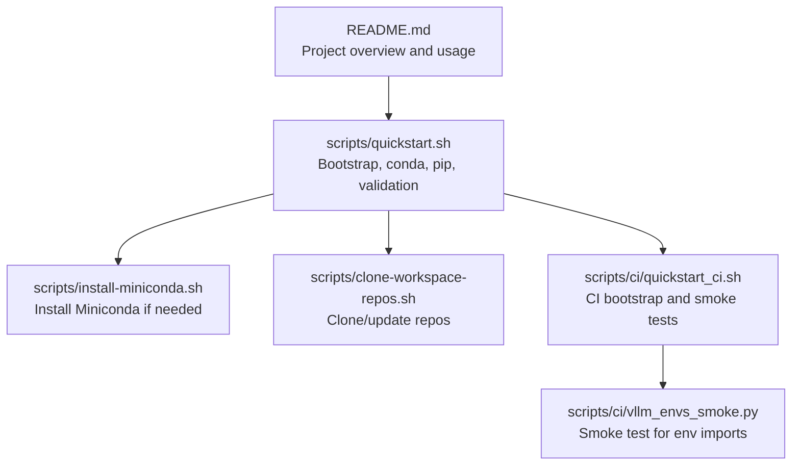
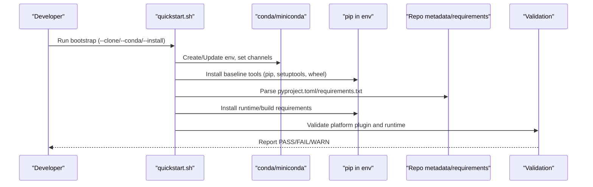
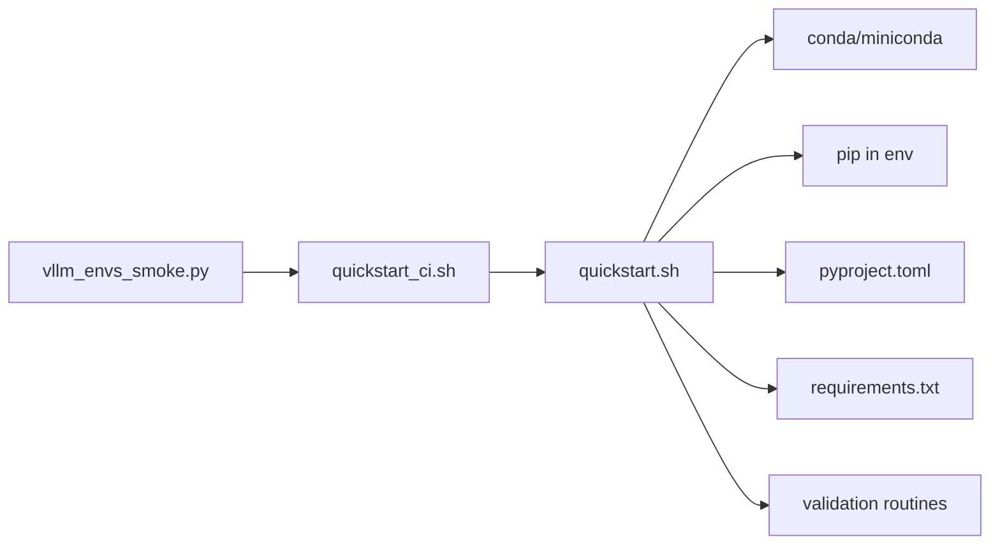

# Python Package Management

<cite>
**Referenced Files in This Document**
- [README.md](file://README.md)
- [quickstart.sh](file://scripts/quickstart.sh)
- [install-miniconda.sh](file://scripts/install-miniconda.sh)
- [clone-workspace-repos.sh](file://scripts/clone-workspace-repos.sh)
- [quickstart_ci.sh](file://scripts/ci/quickstart_ci.sh)
- [vllm_envs_smoke.py](file://scripts/ci/vllm_envs_smoke.py)
</cite>

## Table of Contents
1. [Introduction](#introduction)
2. [Project Structure](#project-structure)
3. [Core Components](#core-components)
4. [Architecture Overview](#architecture-overview)
5. [Detailed Component Analysis](#detailed-component-analysis)
6. [Dependency Analysis](#dependency-analysis)
7. [Performance Considerations](#performance-considerations)
8. [Troubleshooting Guide](#troubleshooting-guide)
9. [Conclusion](#conclusion)

## Introduction
This document explains Python package management within the VLLM-HUST Development Hub. It focuses on how pip packages are installed, how dependency specifications are parsed from repository metadata and requirements files, how package health is validated, and how conda environments integrate with pip operations. It also covers configuration options, parameters for package specs, return values, and practical guidance for resolving conflicts and installation failures.

## Project Structure
The development hub centralizes bootstrapping and environment setup around a small set of scripts:
- scripts/quickstart.sh: Orchestrates repository cloning, conda environment creation, and pip-based package installation.
- scripts/install-miniconda.sh: Installs Miniconda into the user’s home directory when needed.
- scripts/clone-workspace-repos.sh: Clones or updates workspace repositories in parallel.
- scripts/ci/quickstart_ci.sh: CI-friendly bootstrap and smoke testing workflow.
- scripts/ci/vllm_envs_smoke.py: Python-level smoke test validating environment imports.

**Diagram sources**
- [README.md:1-288](file://README.md#L1-L288)
- [quickstart.sh:1-2732](file://scripts/quickstart.sh#L1-L2732)
- [install-miniconda.sh:1-169](file://scripts/install-miniconda.sh#L1-L169)
- [clone-workspace-repos.sh:1-466](file://scripts/clone-workspace-repos.sh#L1-L466)
- [quickstart_ci.sh:1-321](file://scripts/ci/quickstart_ci.sh#L1-L321)
- [vllm_envs_smoke.py:1-69](file://scripts/ci/vllm_envs_smoke.py#L1-L69)

**Section sources**
- [README.md:1-288](file://README.md#L1-L288)

## Core Components
- Conda environment lifecycle and isolation:
  - Environment creation and updates, including Python version reconciliation and baseline tool upgrades.
  - Isolation from external environment variables (e.g., PYTHONPATH) during conda operations.
- Pip installation pipeline:
  - Defaults for retries, timeouts, resume retries, and index mirrors.
  - Installation into a selected conda environment with controlled environment variables.
- Specification parsing:
  - Parsing package specs from requirements.txt entries.
  - Extracting package names from version specs.
  - Reading build/runtime requirements from repository metadata.
- Validation:
  - Health checks for Ascend runtime and platform plugin entry points.
  - Optional smoke tests for environment imports.

Key implementation references:
- Conda environment creation and updates: [scripts/quickstart.sh:1427-1471](file://scripts/quickstart.sh#L1427-L1471)
- Pip install defaults and environment injection: [scripts/quickstart.sh:976-995](file://scripts/quickstart.sh#L976-L995), [scripts/quickstart.sh:1068-1123](file://scripts/quickstart.sh#L1068-L1123)
- Requirement file parsing: [scripts/quickstart.sh:622-665](file://scripts/quickstart.sh#L622-L665)
- Package spec extraction: [scripts/quickstart.sh:667-672](file://scripts/quickstart.sh#L667-L672)
- Metadata-driven requirements: [scripts/quickstart.sh:535-548](file://scripts/quickstart.sh#L535-L548)
- Runtime validation: [scripts/quickstart.sh:708-727](file://scripts/quickstart.sh#L708-L727), [scripts/quickstart.sh:795-803](file://scripts/quickstart.sh#L795-L803)

**Section sources**
- [quickstart.sh:976-1123](file://scripts/quickstart.sh#L976-L1123)
- [quickstart.sh:622-672](file://scripts/quickstart.sh#L622-L672)
- [quickstart.sh:535-548](file://scripts/quickstart.sh#L535-L548)
- [quickstart.sh:708-803](file://scripts/quickstart.sh#L708-L803)

## Architecture Overview
The package management flow integrates conda and pip as follows:
- Conda manages the virtual environment and system-level tooling.
- Pip installs Python packages into the conda environment, respecting environment variables and mirrors.
- Repository metadata and requirements files define precise dependency specs.
- Validation routines ensure runtime correctness for platform plugins and Ascend stacks.

**Diagram sources**
- [quickstart.sh:1427-1471](file://scripts/quickstart.sh#L1427-L1471)
- [quickstart.sh:1455-1461](file://scripts/quickstart.sh#L1455-L1461)
- [quickstart.sh:622-665](file://scripts/quickstart.sh#L622-L665)
- [quickstart.sh:708-803](file://scripts/quickstart.sh#L708-L803)

## Detailed Component Analysis

### Pip Installation Pipeline
- Defaults and environment:
  - Retries, timeout, and optional resume retries are configured based on environment variables.
  - Index and extra index mirrors are probed and applied when available.
  - Pip cache and XDG directories are set for reproducibility.
- Execution:
  - Pip install is executed inside the target conda environment with controlled environment variables.
  - Optional per-Python binary support for resume-retries is detected dynamically.

Implementation references:
- Defaults and mirror selection: [scripts/quickstart.sh:949-995](file://scripts/quickstart.sh#L949-L995)
- Dynamic option support: [scripts/quickstart.sh:997-1009](file://scripts/quickstart.sh#L997-L1009), [scripts/quickstart.sh:1004-1009](file://scripts/quickstart.sh#L1004-L1009)
- Environment injection and execution: [scripts/quickstart.sh:1068-1123](file://scripts/quickstart.sh#L1068-L1123)

Return values and behavior:
- Returns non-zero on failure; heartbeats are emitted for long-running installs.
- Mirrors and retries improve reliability in constrained networks.

**Section sources**
- [quickstart.sh:949-1123](file://scripts/quickstart.sh#L949-L1123)

### Package Specification Parsing
- From requirements.txt:
  - Reads and filters comments and blank lines.
  - Strips inline comments and surrounding whitespace.
  - Matches a specific package by name within a line.
- From repository metadata:
  - Extracts build/runtime requirements from pyproject.toml for specific packages.
- Utilities:
  - Extracts normalized package names from version specs.

Implementation references:
- Requirements parsing: [scripts/quickstart.sh:622-665](file://scripts/quickstart.sh#L622-L665)
- Metadata parsing: [scripts/quickstart.sh:535-548](file://scripts/quickstart.sh#L535-L548)
- Name extraction: [scripts/quickstart.sh:667-672](file://scripts/quickstart.sh#L667-L672)

Examples from codebase (paths only):
- Find a specific requirement line by package name: [scripts/quickstart.sh:622-643](file://scripts/quickstart.sh#L622-L643)
- List all requirements excluding comments and blank lines: [scripts/quickstart.sh:645-665](file://scripts/quickstart.sh#L645-L665)
- Extract package name from a spec: [scripts/quickstart.sh:667-672](file://scripts/quickstart.sh#L667-L672)

**Section sources**
- [quickstart.sh:535-548](file://scripts/quickstart.sh#L535-L548)
- [quickstart.sh:622-672](file://scripts/quickstart.sh#L622-L672)

### Requirement File Processing
- Ascend runtime requirements:
  - Lists all requirements from requirements.txt.
  - Skips optional packages for quickstart scope.
  - Installs missing or incompatible requirements into the environment.
- Optional vs required:
  - Certain packages are considered optional for quickstart and thus skipped unless explicitly needed.

Implementation references:
- Listing and filtering: [scripts/quickstart.sh:901-930](file://scripts/quickstart.sh#L901-L930)
- Optional classification: [scripts/quickstart.sh:674-687](file://scripts/quickstart.sh#L674-L687)

Examples from codebase (paths only):
- Install missing Ascend runtime dependencies: [scripts/quickstart.sh:926-929](file://scripts/quickstart.sh#L926-L929)

**Section sources**
- [quickstart.sh:901-930](file://scripts/quickstart.sh#L901-L930)
- [quickstart.sh:674-687](file://scripts/quickstart.sh#L674-L687)

### Package Health Checks
- Platform plugin entry point:
  - Validates that the Ascend platform plugin is registered and importable.
- Torch/NPU runtime:
  - Ensures torch and torch-npu can be imported without device autoload interference.
- Custom op validation and RUNPATH repair:
  - Verifies custom ops and repairs shared library runpath when needed.

Implementation references:
- Plugin validation: [scripts/quickstart.sh:795-803](file://scripts/quickstart.sh#L795-L803)
- Torch/NPU validation: [scripts/quickstart.sh:719-727](file://scripts/quickstart.sh#L719-L727)
- Custom op verification and repair: [scripts/quickstart.sh:805-839](file://scripts/quickstart.sh#L805-L839)

Examples from codebase (paths only):
- Verify platform plugin entry point: [scripts/quickstart.sh:795-803](file://scripts/quickstart.sh#L795-L803)
- Verify torch-npu runtime import: [scripts/quickstart.sh:719-727](file://scripts/quickstart.sh#L719-L727)

**Section sources**
- [quickstart.sh:708-839](file://scripts/quickstart.sh#L708-L839)

### Conda Environments and Pip Operations
- Environment creation and updates:
  - Creates or updates the environment with explicit channels and mirrors.
  - Reconciles Python version and installs baseline tools.
- Isolation and safety:
  - Unsets PYTHONPATH and sets HOME/XDG variables for deterministic conda operations.
  - Sanitizes LD_LIBRARY_PATH to avoid breaking system tools.

Implementation references:
- Environment creation/update: [scripts/quickstart.sh:1427-1471](file://scripts/quickstart.sh#L1427-L1471)
- Channel configuration and Python reconciliation: [scripts/quickstart.sh:1314-1341](file://scripts/quickstart.sh#L1314-L1341)
- Environment isolation: [scripts/quickstart.sh:278-295](file://scripts/quickstart.sh#L278-L295), [scripts/quickstart.sh:523-533](file://scripts/quickstart.sh#L523-L533)

Examples from codebase (paths only):
- Create environment with mirrors and Python version: [scripts/quickstart.sh:1441-1452](file://scripts/quickstart.sh#L1441-L1452)
- Reconcile Python version with override channels: [scripts/quickstart.sh:1320-1331](file://scripts/quickstart.sh#L1320-L1331)

**Section sources**
- [quickstart.sh:1314-1471](file://scripts/quickstart.sh#L1314-L1471)
- [quickstart.sh:278-295](file://scripts/quickstart.sh#L278-L295)
- [quickstart.sh:523-533](file://scripts/quickstart.sh#L523-L533)

### CI Workflow and Smoke Testing
- CI bootstrap:
  - Runs quickstart in non-interactive mode with explicit environment name and Python version.
  - Cleans up the environment after completion and writes structured results.
- Smoke tests:
  - Validates Python interpreter availability and CLI presence.
  - Uses a dedicated smoke test module to verify environment import behavior.

Implementation references:
- CI bootstrap and cleanup: [scripts/ci/quickstart_ci.sh:232-321](file://scripts/ci/quickstart_ci.sh#L232-L321)
- Smoke test invocation: [scripts/ci/quickstart_ci.sh:208-216](file://scripts/ci/quickstart_ci.sh#L208-L216)
- Smoke test module: [scripts/ci/vllm_envs_smoke.py:1-69](file://scripts/ci/vllm_envs_smoke.py#L1-L69)

**Section sources**
- [quickstart_ci.sh:232-321](file://scripts/ci/quickstart_ci.sh#L232-L321)
- [vllm_envs_smoke.py:1-69](file://scripts/ci/vllm_envs_smoke.py#L1-L69)

## Dependency Analysis
- Conda and pip integration:
  - Conda creates and activates the environment; pip installs into it with controlled environment variables.
- Repository metadata and requirements:
  - pyproject.toml and requirements.txt drive precise dependency specs.
- Optional runtime packages:
  - Some packages are optional for quickstart and skipped accordingly.

**Diagram sources**
- [quickstart.sh:1427-1471](file://scripts/quickstart.sh#L1427-L1471)
- [quickstart.sh:622-665](file://scripts/quickstart.sh#L622-L665)
- [quickstart.sh:708-803](file://scripts/quickstart.sh#L708-L803)
- [quickstart_ci.sh:232-321](file://scripts/ci/quickstart_ci.sh#L232-L321)
- [vllm_envs_smoke.py:1-69](file://scripts/ci/vllm_envs_smoke.py#L1-L69)

**Section sources**
- [quickstart.sh:622-803](file://scripts/quickstart.sh#L622-L803)
- [quickstart_ci.sh:232-321](file://scripts/ci/quickstart_ci.sh#L232-L321)

## Performance Considerations
- Long-running installs:
  - Heartbeat logging prevents perceived stalls during large installations.
- Network resilience:
  - Retry and timeout settings improve reliability.
  - Mirror probing reduces latency and improves availability.
- Parallelization:
  - Repository cloning uses configurable parallel jobs.

Practical tips:
- Increase retries and adjust timeouts for unstable networks.
- Enable resume retries when supported by the installed pip version.
- Use mirrors appropriate to your location.

**Section sources**
- [quickstart.sh:378-402](file://scripts/quickstart.sh#L378-L402)
- [quickstart.sh:949-995](file://scripts/quickstart.sh#L949-L995)
- [clone-workspace-repos.sh:9-9](file://scripts/clone-workspace-repos.sh#L9-L9)

## Troubleshooting Guide
Common issues and resolutions:
- Package conflicts:
  - Remove conflicting packages before installing the target stack.
  - Example: Removing conflicting torch packages prior to reinstall: [scripts/quickstart.sh:322-341](file://scripts/quickstart.sh#L322-L341)
- Version resolution problems:
  - Reconcile Python version with explicit channels and mirrors.
  - Example: Updating environment Python version: [scripts/quickstart.sh:1320-1331](file://scripts/quickstart.sh#L1320-L1331)
- Installation failures:
  - Verify pip defaults and mirrors; ensure environment variables are set.
  - Example: Installing baseline tools and handling mirror fallbacks: [scripts/quickstart.sh:1455-1461](file://scripts/quickstart.sh#L1455-L1461)
- Platform plugin or runtime validation failures:
  - Validate platform plugin entry point and torch-npu runtime.
  - Repair custom op RUNPATH when necessary.
  - Examples: [scripts/quickstart.sh:795-803](file://scripts/quickstart.sh#L795-L803), [scripts/quickstart.sh:719-727](file://scripts/quickstart.sh#L719-L727), [scripts/quickstart.sh:821-839](file://scripts/quickstart.sh#L821-L839)
- CI-specific failures:
  - Review CI summary and per-step logs; clean up environments after failures.
  - Example: Cleanup and summary writing: [scripts/ci/quickstart_ci.sh:74-131](file://scripts/ci/quickstart_ci.sh#L74-L131)

Environment variables and configuration options:
- Pip mirrors and timeouts:
  - PIP_INDEX_URL, HUST_DEV_HUB_PIP_INDEX_URL, HUST_ASCEND_MANAGER_PIP_INDEX_URL
  - PIP_EXTRA_INDEX_URL, HUST_DEV_HUB_PIP_EXTRA_INDEX_URL, HUST_ASCEND_MANAGER_PIP_EXTRA_INDEX_URL
  - HUST_DEV_HUB_PIP_RETRIES, HUST_ASCEND_MANAGER_PIP_RETRIES
  - HUST_DEV_HUB_PIP_TIMEOUT, HUST_ASCEND_MANAGER_PIP_TIMEOUT
  - HUST_DEV_HUB_PIP_RESUME_RETRIES, HUST_ASCEND_MANAGER_PIP_RESUME_RETRIES
  - HUST_DEV_HUB_PIP_MIRROR_TIMEOUT, HUST_ASCEND_MANAGER_PIP_MIRROR_TIMEOUT
- Conda channels and activation:
  - CONDA_ASCEND_CHANNEL, CONDA_FORGE_MIRROR_CHANNEL, CONDA_FORGE_FALLBACK_CHANNEL
  - HUST_DEV_HUB_UPDATE_BASHRC, HUST_DEV_HUB_DISABLE_HF_MIRROR_AUTOSET, HUST_DEV_HUB_ENABLE_MANAGER_ENV_HOOK
- Ascend-specific:
  - HUST_DEV_HUB_ASCEND_COMPILE_CUSTOM_KERNELS, HUST_DEV_HUB_DISABLE_PYPI_MIRROR_AUTOSET

Return values:
- Validation functions return non-zero on failure; callers should handle and log appropriately.
- Pip install functions return non-zero on failure; callers should inspect logs and retry if needed.

**Section sources**
- [quickstart.sh:322-341](file://scripts/quickstart.sh#L322-L341)
- [quickstart.sh:1320-1331](file://scripts/quickstart.sh#L1320-L1331)
- [quickstart.sh:1455-1461](file://scripts/quickstart.sh#L1455-L1461)
- [quickstart.sh:795-839](file://scripts/quickstart.sh#L795-L839)
- [quickstart_ci.sh:74-131](file://scripts/ci/quickstart_ci.sh#L74-L131)

## Conclusion
The VLLM-HUST Development Hub provides a robust, script-driven pipeline for managing Python packages using conda and pip. It parses repository metadata and requirements files to precisely resolve dependencies, applies mirrors and retries for reliability, and validates runtime correctness for platform plugins and Ascend stacks. By leveraging environment variables and structured CI workflows, it enables both interactive development and automated testing with predictable outcomes.