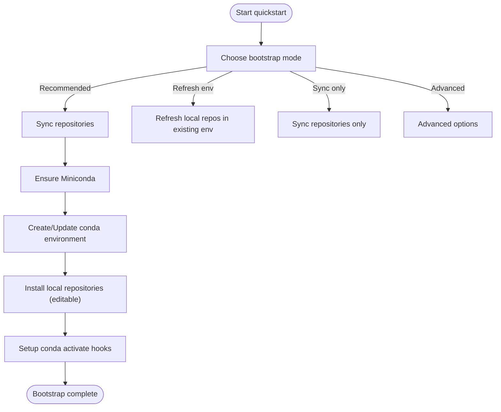
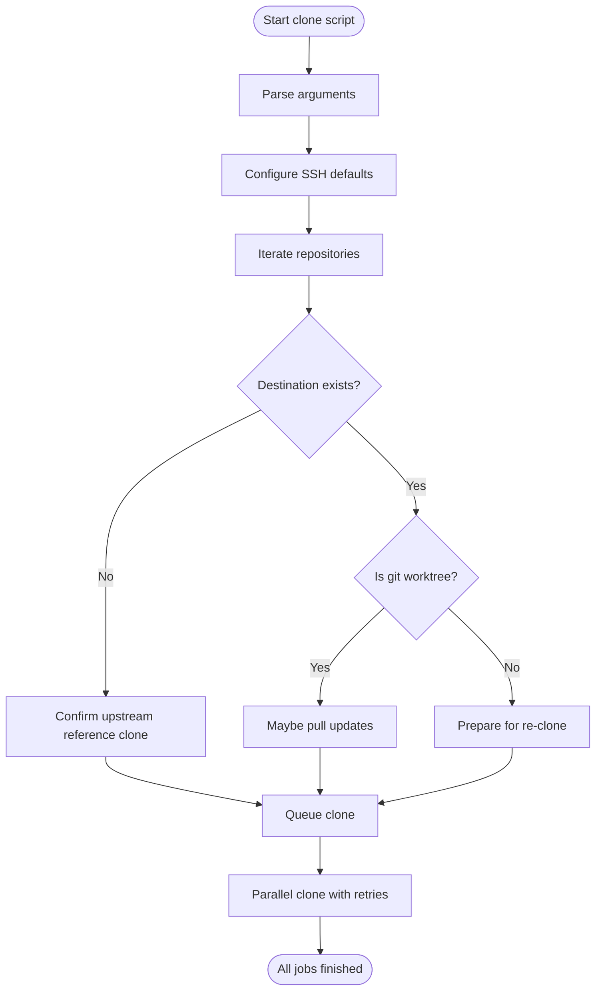
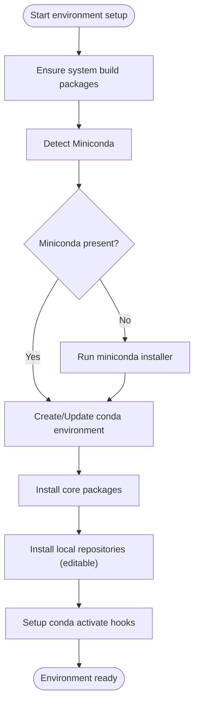
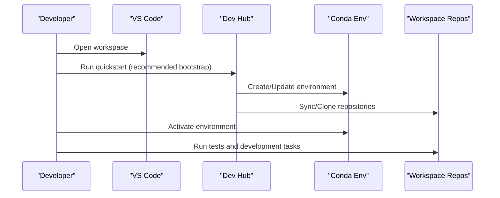

# Getting Started

<cite>
**Referenced Files in This Document**
- [README.md](file://README.md)
- [team-onboarding.md](file://docs/team-onboarding.md)
- [vllm-hust-dev-hub.code-workspace](file://vllm-hust-dev-hub.code-workspace)
- [scripts/quickstart.sh](file://scripts/quickstart.sh)
- [scripts/install-miniconda.sh](file://scripts/install-miniconda.sh)
- [scripts/clone-workspace-repos.sh](file://scripts/clone-workspace-repos.sh)
- [scripts/ascend-official-container.sh](file://scripts/ascend-official-container.sh)
- [scripts/sync-env.sh](file://scripts/sync-env.sh)
- [scripts/ci/quickstart_ci.sh](file://scripts/ci/quickstart_ci.sh)
- [scripts/ci/vllm_envs_smoke.py](file://scripts/ci/vllm_envs_smoke.py)
</cite>

## Table of Contents
1. [Introduction](#introduction)
2. [Prerequisites and System Requirements](#prerequisites-and-system-requirements)
3. [Step-by-Step Installation](#step-by-step-installation)
4. [First-Time User Guidance](#first-time-user-guidance)
5. [Interactive Bootstrap Process](#interactive-bootstrap-process)
6. [Repository Synchronization](#repository-synchronization)
7. [Environment Setup](#environment-setup)
8. [VS Code Workspace Setup](#vs-code-workspace-setup)
9. [Daily Development Workflows](#daily-development-workflows)
10. [Common Scenarios](#common-scenarios)
11. [Troubleshooting Guide](#troubleshooting-guide)
12. [Performance Considerations](#performance-considerations)
13. [Conclusion](#conclusion)

## Introduction
Welcome to the VLLM-HUST Development Hub. This guide provides everything you need to set up your development environment, synchronize repositories, and configure your workspace for efficient daily development on Ascend-powered systems. Whether you're onboarding as a new team member or preparing to contribute regularly, this document walks you through the recommended workflows and best practices.

## Prerequisites and System Requirements
- Operating system: Linux distributions compatible with the Ascend ecosystem (e.g., openEuler, Ubuntu, Debian). The scripts detect and adapt to package managers (dnf/yum/apt-get) for system-level build tools.
- Git: Required for repository synchronization and SSH configuration.
- Network connectivity: For downloading Miniconda, cloning repositories, and accessing mirrors.
- Optional: Docker or Podman for containerized development workflows.
- Optional: SSH keys for secure repository access and container SSH connectivity.

**Section sources**
- [README.md:14-17](file://README.md#L14-L17)
- [scripts/quickstart.sh:144-189](file://scripts/quickstart.sh#L144-L189)

## Step-by-Step Installation
Follow these steps to set up your environment from scratch:

1. **Prepare the workspace directory**
   - Place the development hub under your home directory for predictable paths and easy navigation.
   - Typical location: `/home/<your-user>/vllm-hust-dev-hub`.

2. **Clone the development hub**
   - Clone the repository to your workspace root as described in the onboarding guide.

3. **Run the interactive bootstrap**
   - Navigate to the repository root and run the interactive bootstrap script to synchronize repositories, create/update the conda environment, and set up the workspace.

4. **Configure SSH for container access (optional)**
   - If you plan to connect directly to the container, follow the SSH configuration steps outlined in the onboarding guide.

5. **Open the VS Code workspace**
   - Open the multi-root workspace to access all related repositories in a single IDE session.

6. **Verify the environment**
   - Activate the conda environment and run basic checks to ensure everything is functioning.

**Section sources**
- [README.md:53-84](file://README.md#L53-L84)
- [team-onboarding.md:154-220](file://docs/team-onboarding.md#L154-L220)

## First-Time User Guidance
As a new team member, follow the recommended onboarding flow:

- Establish the Docker instance using the official container script or the interactive menu.
- Configure SSH access if needed, and connect to the container.
- Clone the development hub repository into your workspace.
- Run the interactive bootstrap to synchronize repositories and set up the conda environment.
- Enter the environment and verify the installation.

This streamlined process ensures you have a consistent environment across machines and minimizes manual setup steps.

**Section sources**
- [team-onboarding.md:11-24](file://docs/team-onboarding.md#L11-L24)
- [team-onboarding.md:170-220](file://docs/team-onboarding.md#L170-L220)

## Interactive Bootstrap Process
The interactive bootstrap script automates repository synchronization, conda environment creation, and environment activation. It offers several modes:

- Recommended bootstrap: Sync repositories, prepare the conda environment, and refresh core local installs.
- Refresh local repositories in existing env: Reinstall selected local repositories without recloning or recreating the environment.
- Sync repositories only: Update or clone workspace repositories without touching the environment.
- Advanced options: Conda-only repair, install-missing mode, and bashrc-only registration.

The script also handles Miniconda installation when needed and can auto-activate the environment in new shells.

**Diagram sources**
- [scripts/quickstart.sh:112-135](file://scripts/quickstart.sh#L112-L135)
- [scripts/quickstart.sh:278-295](file://scripts/quickstart.sh#L278-L295)

**Section sources**
- [README.md:73-118](file://README.md#L73-L118)
- [scripts/quickstart.sh:112-135](file://scripts/quickstart.sh#L112-L135)

## Repository Synchronization
The repository synchronization script clones or updates common workspace repositories in parallel. It supports:

- Parallel cloning with configurable concurrency.
- SSH and HTTPS fallback for cloning.
- Automatic pull of updates with a fast-forward policy.
- Interactive confirmation for upstream reference repositories.

Key behaviors:
- Existing repositories are checked for git worktrees; empty directories are repaired.
- Upstream reference repositories are cloned only upon confirmation.
- SSH defaults are configured with host key handling and identity files.

**Diagram sources**
- [scripts/clone-workspace-repos.sh:402-466](file://scripts/clone-workspace-repos.sh#L402-L466)

**Section sources**
- [README.md:61-77](file://README.md#L61-L77)
- [scripts/clone-workspace-repos.sh:402-466](file://scripts/clone-workspace-repos.sh#L402-L466)

## Environment Setup
The environment setup process includes:

- Ensuring system build packages are installed (gcc, g++, python3-dev, zlib1g-dev, git, make).
- Installing Miniconda if not present, with backup and reinstall logic for broken prefixes.
- Creating/updating the conda environment with the specified Python version.
- Installing core packages and editable installations of local repositories.
- Configuring conda activate hooks for automatic mirror switching and environment isolation.

Optional environment variables:
- HUST_DEV_HUB_UPDATE_BASHRC: Enable auto-activation of the environment in new shells.
- HUST_DEV_HUB_DISABLE_HF_MIRROR_AUTOSET: Disable automatic Hugging Face mirror switching.
- HUST_DEV_HUB_ENABLE_MANAGER_ENV_HOOK: Enable Ascend runtime environment exports during activation.

**Diagram sources**
- [scripts/quickstart.sh:144-189](file://scripts/quickstart.sh#L144-L189)
- [scripts/install-miniconda.sh:132-169](file://scripts/install-miniconda.sh#L132-L169)

**Section sources**
- [README.md:112-142](file://README.md#L112-L142)
- [scripts/quickstart.sh:278-295](file://scripts/quickstart.sh#L278-L295)

## VS Code Workspace Setup
The development hub provides a multi-root VS Code workspace that includes related repositories for seamless development. To set up:

- Open the workspace file directly in VS Code.
- The workspace includes folders for documentation, organization profiles, core engines, web applications, tools, and benchmarks.
- Exclusions for caches and node_modules are configured to keep the workspace clean.

```mermaid
graph TB
DevHub["dev-hub (root)"]
Docs["docs"]
OrgProfile["org-profile"]
EngineVllm["vllm-hust"]
EngineAscend["vllm-ascend-hust"]
EngineQuant["vllm-ascend-quant-hust"]
TritonAscend["triton-ascend-hust"]
Manager["ascend-runtime-manager"]
Workstation["vllm-hust-workstation"]
Website["vllm-hust-website"]
ToolClaude["claude-code-hust"]
Benchmark["vllm-hust-benchmark"]
PerfAnalyzer["vllm-hust-perf-analyzer"]
ResearchEvo["EvoScientist"]
PaperCCCF["cccf-domestic-inference-engine-survey"]
PaperFCS["fcs-domestic-chip-llm-recsys"]
RefRepos["reference-repos"]
DevHub --> Docs
DevHub --> OrgProfile
DevHub --> EngineVllm
DevHub --> EngineAscend
DevHub --> EngineQuant
DevHub --> TritonAscend
DevHub --> Manager
DevHub --> Workstation
DevHub --> Website
DevHub --> ToolClaude
DevHub --> Benchmark
DevHub --> PerfAnalyzer
DevHub --> ResearchEvo
DevHub --> PaperCCCF
DevHub --> PaperFCS
DevHub --> RefRepos
```

**Diagram sources**
- [vllm-hust-dev-hub.code-workspace:1-91](file://vllm-hust-dev-hub.code-workspace#L1-L91)

**Section sources**
- [README.md:34-60](file://README.md#L34-L60)
- [vllm-hust-dev-hub.code-workspace:1-91](file://vllm-hust-dev-hub.code-workspace#L1-L91)

## Daily Development Workflows
Recommended daily workflows:

- **Start the day**: Activate the conda environment and verify the CLI is available.
- **Sync changes**: Run the repository synchronization script to pull latest updates.
- **Refresh environment**: Use the install-only mode to refresh editable installations without recloning.
- **Run tests**: Execute targeted tests for the modules you're working on.
- **End the day**: Commit and push changes, then sync again to ensure consistency.

**Diagram sources**
- [scripts/quickstart.sh:112-135](file://scripts/quickstart.sh#L112-L135)
- [scripts/clone-workspace-repos.sh:402-466](file://scripts/clone-workspace-repos.sh#L402-L466)

**Section sources**
- [README.md:173-226](file://README.md#L173-L226)
- [team-onboarding.md:256-300](file://docs/team-onboarding.md#L256-L300)

## Common Scenarios
### New Team Member Onboarding
- Establish Docker instance using the official container script or interactive menu.
- Configure SSH access and connect to the container.
- Clone the development hub repository and run the interactive bootstrap.
- Verify environment activation and basic CLI availability.

### Daily Development Workflow
- Activate the environment and run repository synchronization.
- Refresh local repositories using install-only mode.
- Execute tests and iterate on changes.

### Initial Configuration
- Ensure Miniconda is installed and the environment is created.
- Configure bashrc auto-activation if desired.
- Set environment variables for mirror switching and Ascend runtime hooks.

**Section sources**
- [team-onboarding.md:13-220](file://docs/team-onboarding.md#L13-L220)
- [README.md:173-226](file://README.md#L173-L226)

## Troubleshooting Guide
Common issues and resolutions:

- **Miniconda installation problems**: The installer detects broken prefixes and backs them up before reinstalling. Use the non-interactive flag to automate installation.
- **SSH key issues**: Ensure your SSH keys are present and properly formatted. The container script can auto-configure SSH access using authorized keys.
- **Repository sync failures**: The clone script retries failed operations and falls back to HTTPS when SSH is unavailable. Use the non-interactive flag to bypass prompts.
- **Environment activation issues**: The activate hooks handle mirror switching and environment isolation. Disable auto-switch behavior with the provided environment variable if needed.
- **Container SSH connectivity**: Use SSH ProxyJump configurations to connect through the host when direct public access is not available.

**Section sources**
- [scripts/install-miniconda.sh:132-169](file://scripts/install-miniconda.sh#L132-L169)
- [scripts/clone-workspace-repos.sh:62-86](file://scripts/clone-workspace-repos.sh#L62-L86)
- [scripts/ascend-official-container.sh:303-328](file://scripts/ascend-official-container.sh#L303-L328)
- [README.md:118-142](file://README.md#L118-L142)

## Performance Considerations
- Use parallel cloning to speed up repository synchronization.
- Leverage editable installs for faster development cycles.
- Configure mirrors and environment variables to optimize network access and environment setup.
- Use the recommended bootstrap mode to minimize environment drift and ensure consistent setups.

[No sources needed since this section provides general guidance]

## Conclusion
You are now equipped with the essential knowledge to set up and maintain your VLLM-HUST development environment. By following the interactive bootstrap process, synchronizing repositories efficiently, and configuring your workspace, you can focus on productive development from day one. Refer back to this guide as needed and leverage the troubleshooting tips for smooth operations.

[No sources needed since this section summarizes without analyzing specific files]