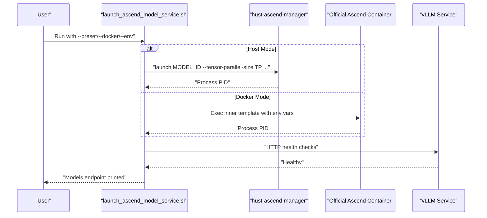
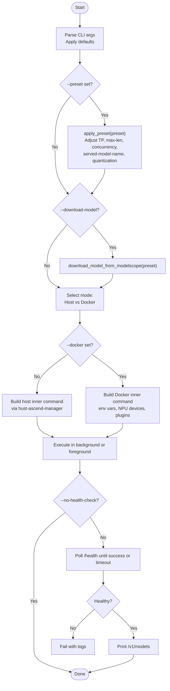
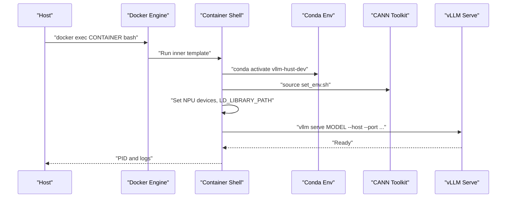
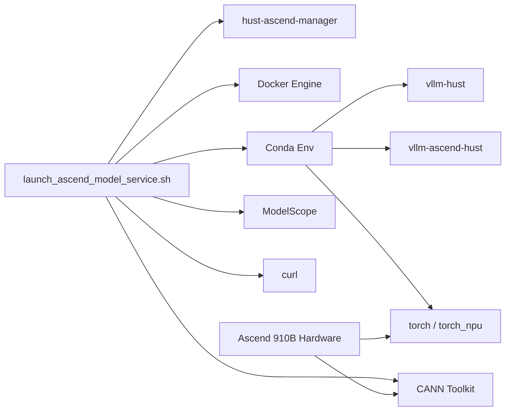

# Model Service Deployment

<cite>
**Referenced Files in This Document**
- [launch_ascend_model_service.sh](file://scripts/launch_ascend_model_service.sh)
- [quickstart.sh](file://scripts/quickstart.sh)
- [README.md](file://README.md)
- [HARDWARE_REPORT_20260407.md](file://Ascend-Machine/HARDWARE_REPORT_20260407.md)
- [ascend-official-container.sh](file://scripts/ascend-official-container.sh)
- [ascend-container-runtime.sh](file://scripts/ascend-container-runtime.sh)
- [quickstart_ci.sh](file://scripts/ci/quickstart_ci.sh)
- [vllm_envs_smoke.py](file://scripts/ci/vllm_envs_smoke.py)
</cite>

## Table of Contents
1. [Introduction](#introduction)
2. [Project Structure](#project-structure)
3. [Core Components](#core-components)
4. [Architecture Overview](#architecture-overview)
5. [Detailed Component Analysis](#detailed-component-analysis)
6. [Dependency Analysis](#dependency-analysis)
7. [Performance Considerations](#performance-considerations)
8. [Troubleshooting Guide](#troubleshooting-guide)
9. [Conclusion](#conclusion)
10. [Appendices](#appendices)

## Introduction
This document explains how to deploy and operate a model service for Ascend NPU-accelerated inference using the VLLM-HUST Development Hub. It covers:
- How to configure and launch the model service in host mode or Docker mode
- Preset configurations for common models and how they adjust parameters
- Health monitoring and service readiness checks
- Performance tuning knobs exposed by the launch script
- Integration with Ascend hardware acceleration and model management systems
- Practical examples and troubleshooting guidance

## Project Structure
The model service deployment is primarily driven by a single launch script with supporting utilities and documentation. The key elements are:
- scripts/launch_ascend_model_service.sh: primary launcher for Ascend NPU model services
- scripts/quickstart.sh: environment bootstrap and Ascend runtime reconciliation
- Ascend-Machine/HARDWARE_REPORT_20260407.md: hardware and bandwidth report for Ascend 910B machines
- scripts/ascend-official-container.sh: container orchestration for the official Ascend image
- scripts/ascend-container-runtime.sh: container SSH keepalive and runtime helpers
- scripts/ci/quickstart_ci.sh and scripts/ci/vllm_envs_smoke.py: CI automation and smoke tests

```mermaid
graph TB
subgraph "Deployment Scripts"
L["launch_ascend_model_service.sh"]
Q["quickstart.sh"]
OC["ascend-official-container.sh"]
OR["ascend-container-runtime.sh"]
end
subgraph "Docs & Reports"
R["README.md"]
HR["HARDWARE_REPORT_20260407.md"]
end
subgraph "CI"
CI["quickstart_ci.sh"]
SM["vllm_envs_smoke.py"]
end
L --> Q
OC --> L
OR --> OC
CI --> Q
CI --> SM
R --> L
HR --> L
```

**Diagram sources**
- [launch_ascend_model_service.sh](file://scripts/launch_ascend_model_service.sh)
- [quickstart.sh](file://scripts/quickstart.sh)
- [README.md](file://README.md)
- [HARDWARE_REPORT_20260407.md](file://Ascend-Machine/HARDWARE_REPORT_20260407.md)
- [ascend-official-container.sh](file://scripts/ascend-official-container.sh)
- [ascend-container-runtime.sh](file://scripts/ascend-container-runtime.sh)
- [quickstart_ci.sh](file://scripts/ci/quickstart_ci.sh)
- [vllm_envs_smoke.py](file://scripts/ci/vllm_envs_smoke.py)

**Section sources**
- [README.md](file://README.md)
- [launch_ascend_model_service.sh](file://scripts/launch_ascend_model_service.sh)

## Core Components
- Launch Script: orchestrates host vs Docker modes, applies presets, downloads models from ModelScope when requested, sets environment variables, and monitors health.
- Presets: predefined model profiles that tune tensor parallel size, memory limits, and concurrency for known models.
- ModelScope Downloader: optional step to fetch model artifacts into a shared cache.
- Health Monitoring: waits for the service to become healthy and prints model endpoints upon success.
- Container Runtime: manages official Ascend images, SSH access, and workspace mounting.

Key responsibilities:
- Parameter parsing and defaults
- Mode selection (host vs Docker)
- Environment setup and validation
- Preset application and parameter adjustments
- Model download and cache management
- Health checks and logging

**Section sources**
- [launch_ascend_model_service.sh](file://scripts/launch_ascend_model_service.sh)
- [README.md](file://README.md)

## Architecture Overview
The deployment architecture supports two operational modes:

- Host Mode (via hust-ascend-manager)
  - Uses the host’s conda environment with CANN/toolkit and torch_npu
  - Leverages hust-ascend-manager to launch the service with validated environment variables
  - Suitable for bare-metal Ascend machines

- Docker Mode (via official Ascend image)
  - Runs inside a container with /workspace mounted to the host home
  - vllm-hust and vllm-ascend-hust are resolved via /workspace and Python sys.path
  - Ensures CANN environment sourcing and library path configuration inside the container
  - Recommended for containerized environments



**Diagram sources**
- [launch_ascend_model_service.sh](file://scripts/launch_ascend_model_service.sh)
- [README.md](file://README.md)

## Detailed Component Analysis

### Launch Script: Implementation Details
The launch script is a robust orchestrator that:
- Parses arguments and applies defaults
- Applies presets to adjust model parameters
- Optionally downloads models from ModelScope into a shared cache
- Builds and executes the appropriate inner command (host or Docker)
- Monitors health and logs outcomes

Highlights:
- Defaults and tunables (e.g., environment name, bind host/port, tensor parallel size, memory utilization, dtype, load format, quantization, concurrency, batch sizes)
- Preset logic adjusts model ID, TP size, max model length, concurrency, and served model name
- Docker mode sets NPU device visibility, CANN environment sourcing, and plugin flags
- Host mode uses hust-ascend-manager launch with validated environment
- Health monitoring polls the /health endpoint and prints /v1/models on success



**Diagram sources**
- [launch_ascend_model_service.sh](file://scripts/launch_ascend_model_service.sh)

**Section sources**
- [launch_ascend_model_service.sh](file://scripts/launch_ascend_model_service.sh)

### Preset Configurations
Presets encapsulate tuned configurations for common models. They adjust:
- Model ID and local cache path
- Tensor parallel size
- Maximum model length and batched tokens
- Concurrency limits
- Quantization method
- Served model name
- Expert parallelism and FlashComm1 toggles

Available presets:
- w8a8: W8A8 quantized model with reduced concurrency and adjusted KV cache sizing
- coder: Dense coding model with TP=4 and lower concurrency
- qwen3-32b: Dense 32B model with BF16, TP=4, and MoE flags disabled

Behavior:
- If a preset is chosen, the script applies its adjustments and prints a summary
- If --download-model is used, the script verifies the presence of cached artifacts and downloads from ModelScope if missing

**Section sources**
- [launch_ascend_model_service.sh](file://scripts/launch_ascend_model_service.sh)

### Model Download from ModelScope
The downloader:
- Resolves ModelScope model ID and local cache path for the selected preset
- Installs modelscope in the target conda environment if missing
- Creates cache directories with correct ownership
- Invokes snapshot_download to fetch model artifacts
- Validates that the expected model directory exists after download

Operational notes:
- Large models may take significant time to download
- The script logs progress and errors to a temporary log file

**Section sources**
- [launch_ascend_model_service.sh](file://scripts/launch_ascend_model_service.sh)

### Health Monitoring
The launcher performs health checks:
- Polls the /health endpoint at a configurable interval
- Times out after a configurable duration
- Prints /v1/models on success
- Captures and displays recent logs on failure

This ensures operators can quickly verify service readiness and inspect served models.

**Section sources**
- [launch_ascend_model_service.sh](file://scripts/launch_ascend_model_service.sh)

### Docker Mode Internals
Docker mode:
- Activates the conda environment inside the container
- Sets NPU device visibility via ASCEND_RT_VISIBLE_DEVICES and ASCEND_VISIBLE_DEVICES
- Sources CANN toolkit environment and appends torch/torch_npu libraries to LD_LIBRARY_PATH
- Enables Ascend plugin and offline caches via environment variables
- Disables preflight to avoid long initial NPU initialization delays
- Selects NPU devices based on tensor parallel size
- Executes vllm serve with the assembled arguments



**Diagram sources**
- [launch_ascend_model_service.sh](file://scripts/launch_ascend_model_service.sh)

**Section sources**
- [launch_ascend_model_service.sh](file://scripts/launch_ascend_model_service.sh)

### Host Mode Internals
Host mode:
- Validates conda availability and required tools
- Resolves conda profile and activates the environment
- Calls hust-ascend-manager launch with validated arguments
- Passes model parameters and optional flags for expert parallelism and eager execution

**Section sources**
- [launch_ascend_model_service.sh](file://scripts/launch_ascend_model_service.sh)

### Container Orchestration and SSH
The official container script:
- Manages the lifecycle of the official Ascend container
- Mounts the workspace under /workspace
- Auto-configures SSH with authorized keys
- Supports relocating Docker data-root to a larger disk if needed
- Provides exec and shell commands for interactive sessions

The container runtime script:
- Keeps SSH alive inside the container with configurable port and keys
- Ensures sshd is running and healthy

**Section sources**
- [ascend-official-container.sh](file://scripts/ascend-official-container.sh)
- [ascend-container-runtime.sh](file://scripts/ascend-container-runtime.sh)

## Dependency Analysis
- The launch script depends on:
  - hust-ascend-manager (host mode)
  - Docker engine (Docker mode)
  - Conda environment with vllm-hust and vllm-ascend-hust
  - CANN toolkit and torch/torch_npu
  - curl for health checks
  - modelscope for downloading presets

- Hardware dependencies:
  - Ascend 910B devices and drivers
  - NUMA topology and PCIe interleave for optimal bandwidth



**Diagram sources**
- [launch_ascend_model_service.sh](file://scripts/launch_ascend_model_service.sh)
- [HARDWARE_REPORT_20260407.md](file://Ascend-Machine/HARDWARE_REPORT_20260407.md)

**Section sources**
- [launch_ascend_model_service.sh](file://scripts/launch_ascend_model_service.sh)
- [HARDWARE_REPORT_20260407.md](file://Ascend-Machine/HARDWARE_REPORT_20260407.md)

## Performance Considerations
- Tensor Parallel Size (TP): Controls device parallelism. Larger TP increases throughput but may increase memory pressure. The script selects TP per preset and allows overrides.
- Max Model Length and Batched Tokens: Tune for context length and throughput. The script adjusts these based on presets and validates minimum batch sizes.
- GPU Memory Utilization: Controls memory allocation ratio to balance throughput and stability.
- Quantization: W8A8 reduces memory footprint and improves throughput on NPU; the script applies preset-specific quantization.
- Eager Execution: Skips CUDA graph capture to avoid JIT issues; can be toggled via flags.
- Prefix Caching and Chunked Prefill: Enable or disable to optimize KV cache and prefill latency.
- FlashComm1 and Expert Parallelism: Adjusted per preset for MoE vs dense models.

Hardware context:
- The machine report documents 8x Ascend 910B3 with PCIe interleave and HCCL bandwidth characteristics. These inform expectations for multi-device scaling and communication overhead.

**Section sources**
- [launch_ascend_model_service.sh](file://scripts/launch_ascend_model_service.sh)
- [HARDWARE_REPORT_20260407.md](file://Ascend-Machine/HARDWARE_REPORT_20260407.md)

## Troubleshooting Guide
Common issues and resolutions:

- Service startup failures
  - Verify conda environment and required tools are available
  - Check that hust-ascend-manager is installed and functional in host mode
  - Ensure Docker is available and the container is running in Docker mode
  - Review the generated command with --dry-run to validate arguments

- Memory allocation problems
  - Lower GPU memory utilization or reduce max model length and batched tokens
  - Use W8A8 quantization preset to reduce memory footprint
  - Reduce tensor parallel size to fit model onto available HBM

- Model loading issues
  - Use --download-model with --preset to fetch artifacts from ModelScope
  - Confirm cache directory permissions and free disk space
  - Validate that the model directory exists after download

- Health check timeouts
  - Increase health timeout and interval
  - Inspect logs captured to /tmp for errors
  - Ensure NPU devices are visible and CANN environment is sourced

- Container SSH connectivity
  - Confirm authorized keys are present and container SSH is enabled
  - Use the container runtime script to keep SSH alive
  - Verify Docker data-root relocation if storage is constrained

**Section sources**
- [launch_ascend_model_service.sh](file://scripts/launch_ascend_model_service.sh)
- [ascend-official-container.sh](file://scripts/ascend-official-container.sh)
- [ascend-container-runtime.sh](file://scripts/ascend-container-runtime.sh)

## Conclusion
The VLLM-HUST Development Hub provides a comprehensive, production-ready pipeline for deploying Ascend NPU-accelerated model services. The launch script centralizes configuration, presets, health monitoring, and container orchestration, while the quickstart and container scripts streamline environment setup and runtime management. By leveraging presets and performance knobs, teams can efficiently deploy and operate high-throughput inference services on Ascend hardware.

## Appendices

### Configuration Options and Parameters
- Environment
  - --env NAME: Conda environment name
  - --model MODEL_ID: Model identifier or path
  - --host HOST: Bind host address
  - --port PORT: Bind port
  - --served-model-name NAME: Served model name

- Model configuration
  - --tp SIZE: Tensor parallel size
  - --max-model-len LEN: Maximum model length
  - --gpu-mem-util RATIO: GPU/NPU memory utilization
  - --dtype DTYPE: Model dtype
  - --load-format FORMAT: Load format
  - --quantization METHOD: Quantization method (e.g., ascend)
  - --max-num-seqs N: Maximum concurrent sequences
  - --max-num-batched-tokens N: Maximum batched tokens

- Operational
  - --download-model: Download model from ModelScope
  - --log-file PATH: Log file path
  - --health-timeout SEC: Health check timeout
  - --health-interval SEC: Health check interval
  - --no-health-check: Skip health checks
  - --foreground: Run in foreground
  - --enforce-eager / --no-enforce-eager: Control CUDA graph capture
  - --no-prefix-caching: Disable prefix caching
  - --no-chunked-prefill: Disable chunked prefill
  - --dry-run: Print command only
  - --docker CONTAINER: Run inside Docker container
  - --skip-setup: Skip hust-ascend-manager env setup (host mode)
  - --preset PRESET: Apply preset configuration

Return values:
- Exit code 0 indicates successful launch and health verification
- Non-zero exit code signals failure; logs are printed for diagnosis

**Section sources**
- [launch_ascend_model_service.sh](file://scripts/launch_ascend_model_service.sh)

### Preset Profiles
- w8a8
  - Quantized model with reduced concurrency and adjusted KV cache sizing
  - Typical TP and memory settings optimized for W8A8
- coder
  - Dense coding model with TP=4 and MoE flags disabled
- qwen3-32b
  - Dense 32B model with BF16, TP=4, and MoE flags disabled

**Section sources**
- [launch_ascend_model_service.sh](file://scripts/launch_ascend_model_service.sh)

### Example Workflows
- Host mode with preset and download:
  - Use --preset with --download-model to fetch artifacts and launch
- Docker mode with official image:
  - Use --docker to run inside the official container with workspace mounted
- Small model for testing:
  - Override --model and --tp for smaller models and ports

**Section sources**
- [README.md](file://README.md)
- [launch_ascend_model_service.sh](file://scripts/launch_ascend_model_service.sh)

### CI and Smoke Testing
- CI bootstrap script automates environment creation and smoke tests
- Smoke tests validate environment imports and port resolution
- CI integrates with quickstart and runtime checks for regression prevention

**Section sources**
- [quickstart_ci.sh](file://scripts/ci/quickstart_ci.sh)
- [vllm_envs_smoke.py](file://scripts/ci/vllm_envs_smoke.py)