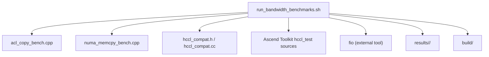
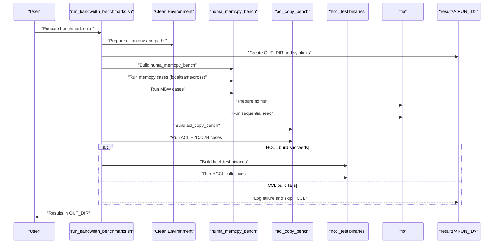
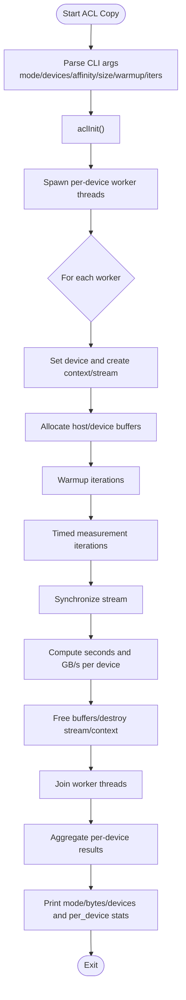
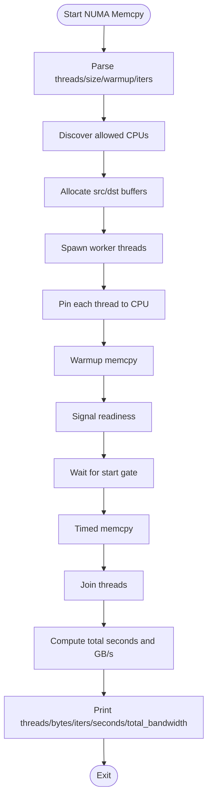
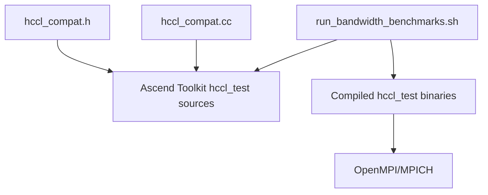
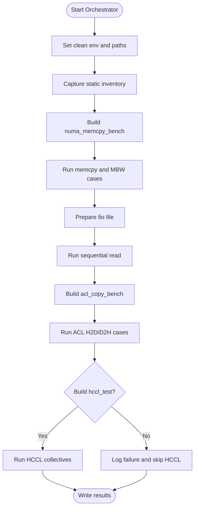
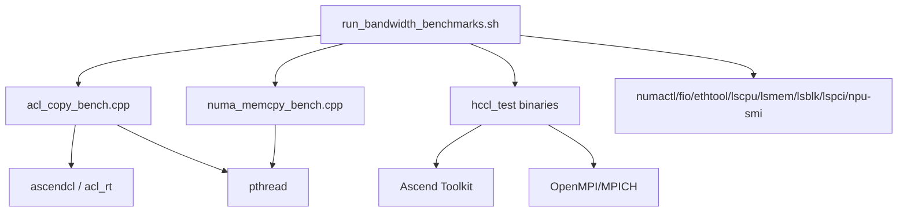

# Benchmarking Methodology

<cite>
**Referenced Files in This Document**
- [run_bandwidth_benchmarks.sh](file://Ascend-Machine/benchmarks/run_bandwidth_benchmarks.sh)
- [acl_copy_bench.cpp](file://Ascend-Machine/benchmarks/acl_copy_bench.cpp)
- [numa_memcpy_bench.cpp](file://Ascend-Machine/benchmarks/numa_memcpy_bench.cpp)
- [hccl_compat.h](file://Ascend-Machine/benchmarks/hccl_compat.h)
- [hccl_compat.cc](file://Ascend-Machine/benchmarks/hccl_compat.cc)
- [HARDWARE_REPORT_20260407.md](file://Ascend-Machine/HARDWARE_REPORT_20260407.md)
- [README.md](file://README.md)
- [ROADMAP.md](file://ROADMAP.md)
- [README.md](file://Ascend-Machine/build/hccl_test/README.md)
</cite>

## Table of Contents
1. [Introduction](#introduction)
2. [Project Structure](#project-structure)
3. [Core Components](#core-components)
4. [Architecture Overview](#architecture-overview)
5. [Detailed Component Analysis](#detailed-component-analysis)
6. [Dependency Analysis](#dependency-analysis)
7. [Performance Considerations](#performance-considerations)
8. [Troubleshooting Guide](#troubleshooting-guide)
9. [Conclusion](#conclusion)
10. [Appendices](#appendices)

## Introduction
This document describes the benchmarking methodology and tools within the VLLM-HUST performance optimization framework, focusing on:
- ACL copy benchmarks for NPU Host ↔ Device bandwidth
- HCCL compatibility and collection communication tests
- NUMA memory copy benchmarks for CPU-local and cross-NUMA bandwidth
- Bandwidth measurement scripts orchestrating the full suite

It explains the benchmark execution workflow, parameter configuration, and result interpretation, and provides guidance on reliability, repeatability, and noise reduction. It also outlines how different benchmark types relate to overall system performance and how to select appropriate benchmarks for optimization scenarios.

## Project Structure
The benchmarking suite resides under Ascend-Machine/benchmarks and is orchestrated by a shell script that builds and executes multiple benchmarks. Results are captured into a timestamped results directory.

**Diagram sources**
- [run_bandwidth_benchmarks.sh:352-371](file://Ascend-Machine/benchmarks/run_bandwidth_benchmarks.sh#L352-L371)
- [acl_copy_bench.cpp:1-269](file://Ascend-Machine/benchmarks/acl_copy_bench.cpp#L1-L269)
- [numa_memcpy_bench.cpp:1-143](file://Ascend-Machine/benchmarks/numa_memcpy_bench.cpp#L1-L143)
- [hccl_compat.h:1-65](file://Ascend-Machine/benchmarks/hccl_compat.h#L1-L65)
- [hccl_compat.cc:1-9](file://Ascend-Machine/benchmarks/hccl_compat.cc#L1-L9)

**Section sources**
- [run_bandwidth_benchmarks.sh:1-373](file://Ascend-Machine/benchmarks/run_bandwidth_benchmarks.sh#L1-L373)

## Core Components
- ACL Copy Bench (NPU Host ↔ Device bandwidth)
  - Measures H2D and D2H throughput for single and multi-device configurations
  - Uses ACL runtime APIs, streams, and host/device buffers
  - Supports CPU affinity pinning per device
- NUMA Memory Copy Bench (CPU Local vs Cross-NUMA)
  - Multi-threaded memcpy benchmark across NUMA nodes
  - Synchronizes threads via atomic flags and steady clock timing
- HCCL Compatibility Layer and Tests
  - Provides V2 API compatibility shims for HCCL
  - Builds and runs multiple HCCL collectives (AllGather, AllReduce, Broadcast, Reduce, Scatter, AllToAll, ReduceScatter)
- Bandwidth Measurement Orchestrator
  - Captures static inventory, builds binaries, runs cases, and aggregates results
  - Uses clean environments to avoid library path pollution affecting ACL initialization

**Section sources**
- [acl_copy_bench.cpp:17-31](file://Ascend-Machine/benchmarks/acl_copy_bench.cpp#L17-L31)
- [acl_copy_bench.cpp:131-206](file://Ascend-Machine/benchmarks/acl_copy_bench.cpp#L131-L206)
- [numa_memcpy_bench.cpp:16-27](file://Ascend-Machine/benchmarks/numa_memcpy_bench.cpp#L16-L27)
- [numa_memcpy_bench.cpp:89-143](file://Ascend-Machine/benchmarks/numa_memcpy_bench.cpp#L89-L143)
- [hccl_compat.h:13-60](file://Ascend-Machine/benchmarks/hccl_compat.h#L13-L60)
- [hccl_compat.cc:1-9](file://Ascend-Machine/benchmarks/hccl_compat.cc#L1-L9)
- [run_bandwidth_benchmarks.sh:203-271](file://Ascend-Machine/benchmarks/run_bandwidth_benchmarks.sh#L203-L271)
- [run_bandwidth_benchmarks.sh:330-350](file://Ascend-Machine/benchmarks/run_bandwidth_benchmarks.sh#L330-L350)

## Architecture Overview
The benchmarking workflow is a pipeline that:
- Prepares a clean environment to avoid ACL initialization failures
- Captures static system inventory (CPU, NUMA, memory, NICs, NPU topology)
- Builds NUMA and ACL benchmarks
- Runs NUMA memcpy and MBW tests across local, same-socket, and cross-socket memory configurations
- Prepares and runs fio sequential read
- Builds and runs ACL copy tests for single, dual, and multi-device configurations
- Optionally builds and runs HCCL collectives with OpenMPI/MPICH
- Writes all outputs to a timestamped results directory

**Diagram sources**
- [run_bandwidth_benchmarks.sh:153-170](file://Ascend-Machine/benchmarks/run_bandwidth_benchmarks.sh#L153-L170)
- [run_bandwidth_benchmarks.sh:172-201](file://Ascend-Machine/benchmarks/run_bandwidth_benchmarks.sh#L172-L201)
- [run_bandwidth_benchmarks.sh:203-271](file://Ascend-Machine/benchmarks/run_bandwidth_benchmarks.sh#L203-L271)
- [run_bandwidth_benchmarks.sh:225-260](file://Ascend-Machine/benchmarks/run_bandwidth_benchmarks.sh#L225-L260)
- [run_bandwidth_benchmarks.sh:262-271](file://Ascend-Machine/benchmarks/run_bandwidth_benchmarks.sh#L262-L271)
- [run_bandwidth_benchmarks.sh:281-328](file://Ascend-Machine/benchmarks/run_bandwidth_benchmarks.sh#L281-L328)
- [run_bandwidth_benchmarks.sh:330-350](file://Ascend-Machine/benchmarks/run_bandwidth_benchmarks.sh#L330-L350)
- [run_bandwidth_benchmarks.sh:352-371](file://Ascend-Machine/benchmarks/run_bandwidth_benchmarks.sh#L352-L371)

## Detailed Component Analysis

### ACL Copy Benchmark
Purpose:
- Measure NPU Host ↔ Device bandwidth for H2D and D2H directions
- Validate performance across single, dual, and multi-device setups
- Control CPU affinity per device to isolate interference

Key implementation details:
- Argument parsing supports mode, devices, affinity lists, size in MB, warmup iterations, and measurement iterations
- Per-worker lifecycle: device selection, context/stream creation, host/device buffer allocation, warmup copies, timed measurement loop, synchronization, and cleanup
- Aggregates per-device bandwidth and computes both sum and wall-clock aggregate metrics
- Uses ACL runtime APIs and handles errors via a dedicated checker macro

**Diagram sources**
- [acl_copy_bench.cpp:87-129](file://Ascend-Machine/benchmarks/acl_copy_bench.cpp#L87-L129)
- [acl_copy_bench.cpp:131-206](file://Ascend-Machine/benchmarks/acl_copy_bench.cpp#L131-L206)
- [acl_copy_bench.cpp:210-269](file://Ascend-Machine/benchmarks/acl_copy_bench.cpp#L210-L269)

Parameter configuration:
- Mode: h2d or d2h
- Devices: comma-separated list of device IDs
- Affinity lists: optional CPU affinity per device (comma-separated ranges)
- Size in MB: payload size per iteration
- Warmup: number of warmup iterations
- Iterations: number of timed iterations

Execution workflow:
- Initialize ACL, spawn worker threads, run warmups, measure, synchronize, compute bandwidth, and print aggregated results

Result interpretation:
- Per-device seconds and GB/s
- Sum of per-device GB/s
- Wall-clock aggregate GB/s computed from total bytes divided by max wall time across devices

Reliability and repeatability:
- Warmup iterations reduce initialization overhead effects
- Multiple iterations enable statistical summaries
- Clean environment prevents ACL initialization failures

Noise reduction:
- CPU affinity pinning per device minimizes cross-device contention
- Single-threaded device contexts per worker reduce context switching overhead

**Section sources**
- [acl_copy_bench.cpp:17-31](file://Ascend-Machine/benchmarks/acl_copy_bench.cpp#L17-L31)
- [acl_copy_bench.cpp:87-129](file://Ascend-Machine/benchmarks/acl_copy_bench.cpp#L87-L129)
- [acl_copy_bench.cpp:131-206](file://Ascend-Machine/benchmarks/acl_copy_bench.cpp#L131-L206)
- [acl_copy_bench.cpp:210-269](file://Ascend-Machine/benchmarks/acl_copy_bench.cpp#L210-L269)

### NUMA Memory Copy Benchmark
Purpose:
- Measure CPU-side memory bandwidth across local and cross-NUMA configurations
- Provide a baseline for host memory performance and NUMA-awareness

Key implementation details:
- Parses arguments for thread count, bytes per thread, warmup, and iterations
- Pins each worker thread to a CPU within the allowed mask
- Synchronizes all threads via atomic readiness flag and a start gate
- Uses std::memcpy for the timed region and prints total bandwidth

**Diagram sources**
- [numa_memcpy_bench.cpp:34-58](file://Ascend-Machine/benchmarks/numa_memcpy_bench.cpp#L34-L58)
- [numa_memcpy_bench.cpp:89-143](file://Ascend-Machine/benchmarks/numa_memcpy_bench.cpp#L89-L143)

Parameter configuration:
- Threads: number of concurrent memcpy workers
- Size per thread: payload size per thread in MB
- Warmup: number of warmup iterations
- Iterations: number of timed iterations

Execution workflow:
- Determine allowed CPUs, allocate buffers, spawn threads, pin CPUs, warmup, synchronize, measure, join, and compute total bandwidth

Result interpretation:
- Total bandwidth in GB/s computed from total bytes moved over measured seconds

Reliability and repeatability:
- Atomic readiness and start gate ensure synchronized start across threads
- Multiple iterations enable median-based reporting if desired

Noise reduction:
- CPU pinning reduces migration and cache thrashing
- Controlled thread count balances load without oversubscription

**Section sources**
- [numa_memcpy_bench.cpp:16-27](file://Ascend-Machine/benchmarks/numa_memcpy_bench.cpp#L16-L27)
- [numa_memcpy_bench.cpp:89-143](file://Ascend-Machine/benchmarks/numa_memcpy_bench.cpp#L89-L143)

### HCCL Compatibility and Collection Communication Tests
Purpose:
- Validate HCCL collective operations and measure bandwidth for multi-NPU scenarios
- Provide compatibility shims for V2 API usage and build against toolkit-provided sources

Key implementation details:
- Compatibility header defines V2 API aliases and prototypes for root info, communicator init/destroy, rank info, memory range activation, and collective operations
- Compatibility source implements simple log level and error-to-warn checks
- The orchestrator script resolves MPI layout, copies compatibility headers into toolkit sources, patches includes, and compiles multiple hccl_test binaries
- Executes collectives via mpirun with controlled parameters and captures outputs

**Diagram sources**
- [hccl_compat.h:13-60](file://Ascend-Machine/benchmarks/hccl_compat.h#L13-L60)
- [hccl_compat.cc:1-9](file://Ascend-Machine/benchmarks/hccl_compat.cc#L1-9)
- [run_bandwidth_benchmarks.sh:281-328](file://Ascend-Machine/benchmarks/run_bandwidth_benchmarks.sh#L281-L328)
- [run_bandwidth_benchmarks.sh:330-350](file://Ascend-Machine/benchmarks/run_bandwidth_benchmarks.sh#L330-L350)

Parameter configuration and execution:
- The script compiles binaries with toolkit headers and MPI libraries, then runs collectives with fixed parameters (e.g., 8 ranks, 64 MiB buffers, fp32, iterations, warmups)
- Some operations require specific root configuration and disabling result checks to avoid known retcode failures

Result interpretation:
- Bandwidth values per operation are parsed from outputs; the hardware report documents typical values for AllGather, AllReduce, Scatter, Broadcast, Reduce, and newly validated AllToAll and ReduceScatter

Reliability and repeatability:
- Using the official toolkit sources and current libhccl.so improves stability compared to legacy V2 API assumptions
- Disabling result checks for problematic operations allows obtaining valid bandwidth samples

Noise reduction:
- Running in clean environment avoids library path conflicts
- Single-node execution with fixed ranks minimizes inter-node variability

**Section sources**
- [hccl_compat.h:13-60](file://Ascend-Machine/benchmarks/hccl_compat.h#L13-L60)
- [hccl_compat.cc:1-9](file://Ascend-Machine/benchmarks/hccl_compat.cc#L1-9)
- [run_bandwidth_benchmarks.sh:281-328](file://Ascend-Machine/benchmarks/run_bandwidth_benchmarks.sh#L281-L328)
- [run_bandwidth_benchmarks.sh:330-350](file://Ascend-Machine/benchmarks/run_bandwidth_benchmarks.sh#L330-L350)
- [README.md:63-123](file://Ascend-Machine/build/hccl_test/README.md#L63-L123)

### Bandwidth Measurement Orchestrator
Purpose:
- Centralized orchestration of all benchmarks with environment preparation, inventory capture, and result aggregation

Key implementation details:
- Sets up clean environment variables and library paths
- Captures static inventory (CPU, NUMA, memory, NICs, NPU topology)
- Builds NUMA and ACL benchmarks with appropriate flags
- Runs NUMA memcpy and MBW across local, same-socket, and cross-socket configurations
- Prepares and runs fio sequential read
- Builds and runs ACL copy tests for various device configurations
- Attempts to build and run HCCL collectives; logs and skips on failure

**Diagram sources**
- [run_bandwidth_benchmarks.sh:153-170](file://Ascend-Machine/benchmarks/run_bandwidth_benchmarks.sh#L153-L170)
- [run_bandwidth_benchmarks.sh:172-201](file://Ascend-Machine/benchmarks/run_bandwidth_benchmarks.sh#L172-L201)
- [run_bandwidth_benchmarks.sh:203-271](file://Ascend-Machine/benchmarks/run_bandwidth_benchmarks.sh#L203-L271)
- [run_bandwidth_benchmarks.sh:225-260](file://Ascend-Machine/benchmarks/run_bandwidth_benchmarks.sh#L225-L260)
- [run_bandwidth_benchmarks.sh:262-271](file://Ascend-Machine/benchmarks/run_bandwidth_benchmarks.sh#L262-L271)
- [run_bandwidth_benchmarks.sh:281-328](file://Ascend-Machine/benchmarks/run_bandwidth_benchmarks.sh#L281-L328)
- [run_bandwidth_benchmarks.sh:330-350](file://Ascend-Machine/benchmarks/run_bandwidth_benchmarks.sh#L330-L350)
- [run_bandwidth_benchmarks.sh:352-371](file://Ascend-Machine/benchmarks/run_bandwidth_benchmarks.sh#L352-L371)

**Section sources**
- [run_bandwidth_benchmarks.sh:1-373](file://Ascend-Machine/benchmarks/run_bandwidth_benchmarks.sh#L1-L373)

## Dependency Analysis
- ACL Copy depends on:
  - Ascend runtime headers and libraries
  - pthread for worker threads
- NUMA Memory Copy depends on:
  - pthread for worker threads
- HCCL Tests depend on:
  - Toolkit-provided hccl_test sources
  - MPI headers and libraries (OpenMPI or MPICH)
  - Ascend toolkit libraries (libhccl.so, acl_rt)
- Orchestrator depends on:
  - numactl, fio, ethtool, lscpu, lsmem, lsblk, lspci, npu-smi
  - Clean environment to avoid ACL initialization failures

**Diagram sources**
- [run_bandwidth_benchmarks.sh:262-271](file://Ascend-Machine/benchmarks/run_bandwidth_benchmarks.sh#L262-L271)
- [run_bandwidth_benchmarks.sh:121-151](file://Ascend-Machine/benchmarks/run_bandwidth_benchmarks.sh#L121-L151)
- [run_bandwidth_benchmarks.sh:203-206](file://Ascend-Machine/benchmarks/run_bandwidth_benchmarks.sh#L203-L206)

**Section sources**
- [run_bandwidth_benchmarks.sh:121-151](file://Ascend-Machine/benchmarks/run_bandwidth_benchmarks.sh#L121-L151)
- [run_bandwidth_benchmarks.sh:203-206](file://Ascend-Machine/benchmarks/run_bandwidth_benchmarks.sh#L203-L206)
- [run_bandwidth_benchmarks.sh:262-271](file://Ascend-Machine/benchmarks/run_bandwidth_benchmarks.sh#L262-L271)

## Performance Considerations
- Warmup iterations reduce initialization overhead and stabilize measurements
- Multiple timed iterations enable robust statistics; consider median over mean for latency-sensitive workloads
- Clean environment prevents ACL initialization failures and ensures consistent library resolution
- NUMA-aware placement (cpunodebind/membind) significantly impacts memory bandwidth; use local, same-socket, and cross-socket configurations to characterize topology
- For ACL benchmarks, CPU affinity pinning per device reduces contention and improves repeatability
- HCCL tests benefit from running with current toolkit sources and libhccl.so; avoid legacy V2 API assumptions
- Disable result checks for operations known to fail under validation to obtain valid bandwidth samples

[No sources needed since this section provides general guidance]

## Troubleshooting Guide
Common issues and resolutions:
- ACL initialization failures
  - Symptom: aclInit fails in current environment
  - Resolution: run in clean environment with explicit toolkit paths and LD_LIBRARY_PATH
  - Evidence: orchestrator sets clean environment and reexports toolkit paths
- Missing MPI headers or libraries
  - Symptom: HCCL build fails due to unresolved MPI
  - Resolution: set MPI_HOME or ensure MPI include/library directories are discoverable
  - Evidence: orchestrator attempts to resolve MPI layout and reports expected paths
- HCCL collective validation failures
  - Symptom: operations return specific retcodes under validation
  - Resolution: run with result checks disabled (-c 0) and use documented root configurations
  - Evidence: hardware report documents workaround for broadcast/reduce and validates AllToAll/ReduceScatter with official toolkit path
- Insufficient privileges for fio write
  - Symptom: fio prepare requires elevated privileges
  - Resolution: run with sudo or ensure appropriate permissions
  - Evidence: orchestrator wraps fio with privilege helper

Validation methods:
- Compare NUMA memcpy results with mbw MCBLOCK for cross-checking
- Cross-validate ACL single-card results with multi-device aggregation
- Confirm HCCL bandwidths against official toolkit sources and current libhccl.so

**Section sources**
- [run_bandwidth_benchmarks.sh:153-170](file://Ascend-Machine/benchmarks/run_bandwidth_benchmarks.sh#L153-L170)
- [run_bandwidth_benchmarks.sh:281-328](file://Ascend-Machine/benchmarks/run_bandwidth_benchmarks.sh#L281-L328)
- [HARDWARE_REPORT_20260407.md:132-152](file://Ascend-Machine/HARDWARE_REPORT_20260407.md#L132-L152)

## Conclusion
The VLLM-HUST benchmarking methodology integrates ACL copy, NUMA memory copy, and HCCL collection communication tests into a unified workflow. By controlling environment, topology, and measurement parameters, it enables reliable and repeatable performance characterization across host and NPU domains. The hardware report demonstrates practical outcomes and validates the approach’s effectiveness for identifying optimization opportunities.

[No sources needed since this section summarizes without analyzing specific files]

## Appendices

### Benchmark Execution Workflow Summary
- Environment preparation: clean toolkit paths and library resolution
- Static inventory capture: CPU, NUMA, memory, NICs, NPU topology
- Build and run NUMA memcpy and MBW across configurations
- Prepare and run fio sequential read
- Build and run ACL copy tests for single/dual/all devices
- Build and run HCCL collectives when MPI/toolkit prerequisites are met

**Section sources**
- [run_bandwidth_benchmarks.sh:172-201](file://Ascend-Machine/benchmarks/run_bandwidth_benchmarks.sh#L172-L201)
- [run_bandwidth_benchmarks.sh:203-271](file://Ascend-Machine/benchmarks/run_bandwidth_benchmarks.sh#L203-L271)
- [run_bandwidth_benchmarks.sh:281-350](file://Ascend-Machine/benchmarks/run_bandwidth_benchmarks.sh#L281-L350)
- [run_bandwidth_benchmarks.sh:352-371](file://Ascend-Machine/benchmarks/run_bandwidth_benchmarks.sh#L352-L371)

### Relationship Between Benchmark Types and System Performance
- NUMA memory copy: characterizes CPU-local and cross-NUMA memory bandwidth, informing CPU placement and NUMA policy decisions
- ACL copy: measures NPU Host ↔ Device bandwidth, guiding data movement strategies and device utilization
- HCCL collectives: assesses multi-NPU communication bandwidth and scalability, impacting distributed training and inference performance

**Section sources**
- [HARDWARE_REPORT_20260407.md:88-152](file://Ascend-Machine/HARDWARE_REPORT_20260407.md#L88-L152)

### Statistical Analysis Methods
- Warmup iterations: remove initialization overhead
- Multiple timed iterations: enable median-based reporting for robustness
- Aggregated metrics: per-device GB/s and wall-clock aggregate GB/s for multi-device scenarios
- Cross-validation: compare NUMA memcpy with mbw MCBLOCK; validate ACL single-card vs multi-device aggregation

**Section sources**
- [acl_copy_bench.cpp:210-269](file://Ascend-Machine/benchmarks/acl_copy_bench.cpp#L210-L269)
- [numa_memcpy_bench.cpp:89-143](file://Ascend-Machine/benchmarks/numa_memcpy_bench.cpp#L89-L143)
- [HARDWARE_REPORT_20260407.md:92-113](file://Ascend-Machine/HARDWARE_REPORT_20260407.md#L92-L113)

### Guidance on Selecting Benchmarks
- For CPU memory optimization: focus on NUMA memcpy and MBW across local, same-socket, and cross-socket configurations
- For NPU data movement: use ACL copy tests to evaluate H2D/D2H bandwidth and device concurrency
- For distributed communication: run HCCL collectives to assess multi-NPU bandwidth and scalability
- For reproducibility: always run in clean environment and use documented parameter sets

**Section sources**
- [run_bandwidth_benchmarks.sh:203-271](file://Ascend-Machine/benchmarks/run_bandwidth_benchmarks.sh#L203-L271)
- [run_bandwidth_benchmarks.sh:281-350](file://Ascend-Machine/benchmarks/run_bandwidth_benchmarks.sh#L281-L350)
- [HARDWARE_REPORT_20260407.md:154-174](file://Ascend-Machine/HARDWARE_REPORT_20260407.md#L154-L174)

### Interpreting Benchmark Results in Application Context
- NUMA memcpy: guide CPU placement and memory policies to avoid cross-socket traffic
- ACL copy: inform data prefetching, staging, and device utilization strategies
- HCCL: quantify communication overhead and identify scaling bottlenecks in distributed workloads

**Section sources**
- [HARDWARE_REPORT_20260407.md:109-152](file://Ascend-Machine/HARDWARE_REPORT_20260407.md#L109-L152)
- [ROADMAP.md:23-82](file://ROADMAP.md#L23-L82)