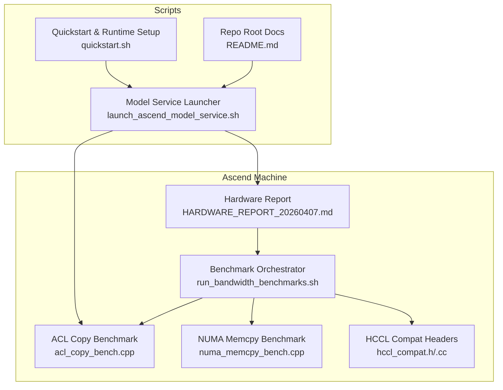
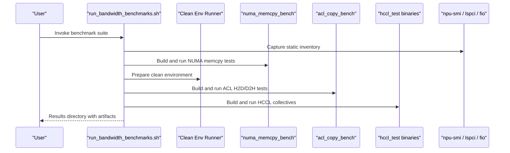
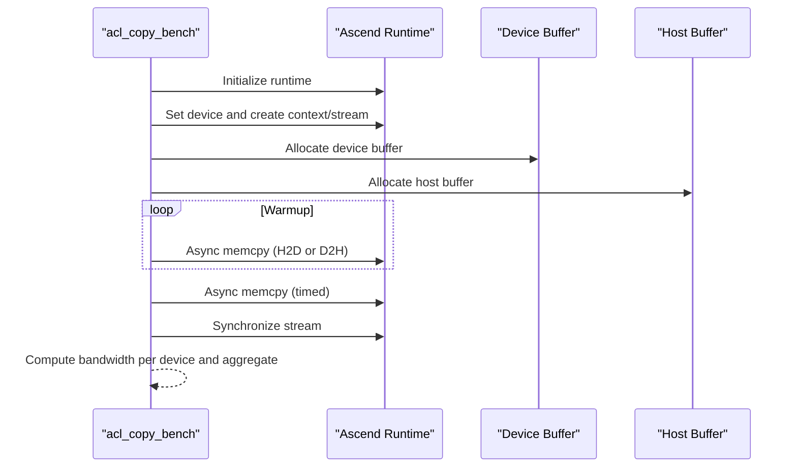
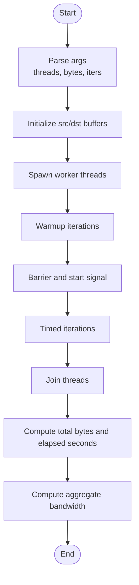
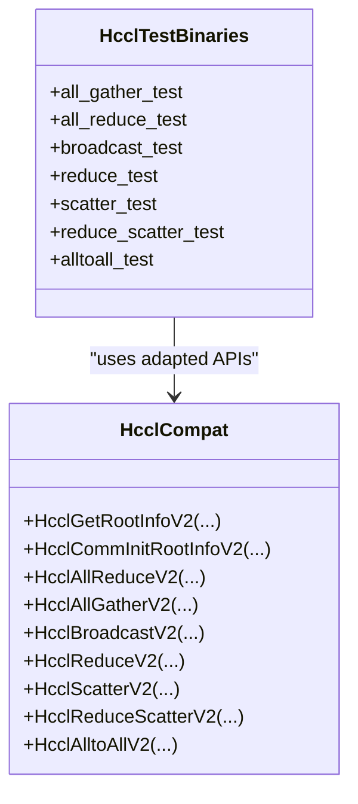
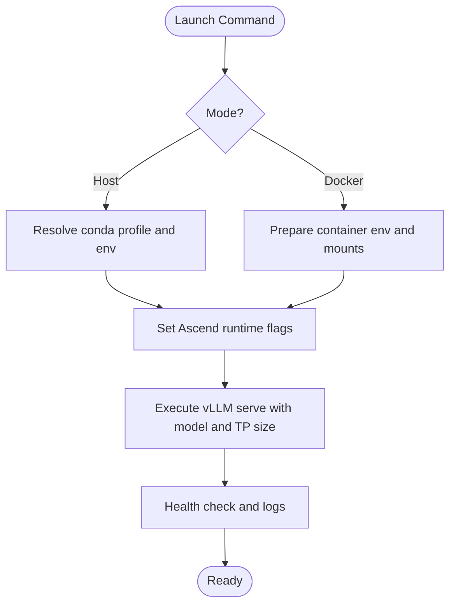
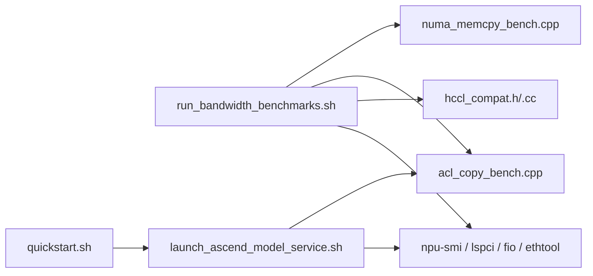

# Hardware Characterization

<cite>
**Referenced Files in This Document**
- [HARDWARE_REPORT_20260407.md](file://Ascend-Machine/HARDWARE_REPORT_20260407.md)
- [run_bandwidth_benchmarks.sh](file://Ascend-Machine/benchmarks/run_bandwidth_benchmarks.sh)
- [acl_copy_bench.cpp](file://Ascend-Machine/benchmarks/acl_copy_bench.cpp)
- [numa_memcpy_bench.cpp](file://Ascend-Machine/benchmarks/numa_memcpy_bench.cpp)
- [hccl_compat.h](file://Ascend-Machine/benchmarks/hccl_compat.h)
- [hccl_compat.cc](file://Ascend-Machine/benchmarks/hccl_compat.cc)
- [README.md](file://README.md)
- [launch_ascend_model_service.sh](file://scripts/launch_ascend_model_service.sh)
- [quickstart.sh](file://scripts/quickstart.sh)
</cite>

## Table of Contents
1. [Introduction](#introduction)
2. [Project Structure](#project-structure)
3. [Core Components](#core-components)
4. [Architecture Overview](#architecture-overview)
5. [Detailed Component Analysis](#detailed-component-analysis)
6. [Dependency Analysis](#dependency-analysis)
7. [Performance Considerations](#performance-considerations)
8. [Troubleshooting Guide](#troubleshooting-guide)
9. [Conclusion](#conclusion)
10. [Appendices](#appendices)

## Introduction
This document describes the Ascend hardware characterization methodology within the VLLM-HUST ecosystem. It documents the hardware profiling pipeline, system specifications, and performance baselines measured on an 8-NPU Ascend 910B3 server. It explains the hardware report structure, key metrics such as memory bandwidth, NPU-host copy bandwidth, and HCCL collective communication bandwidth, and provides practical guidance for bottleneck identification, optimization opportunities, and validation of improvements. It also covers hardware-specific considerations for Ascend NPU acceleration, memory hierarchy optimization, and thermal management.

## Project Structure
The Ascend hardware characterization effort centers around:
- A hardware report summarizing static configuration, topology, and measured bandwidths
- A benchmark orchestration script that builds and executes microbenchmarks
- Microbenchmarks for CPU NUMA memcpy, ACL H2D/D2H transfers, and HCCL collectives
- A model service launcher that exercises Ascend runtime in realistic configurations
- Ancillary scripts for environment setup and Ascend runtime reconciliation

**Diagram sources**
- [HARDWARE_REPORT_20260407.md:1-215](file://Ascend-Machine/HARDWARE_REPORT_20260407.md#L1-L215)
- [run_bandwidth_benchmarks.sh:1-373](file://Ascend-Machine/benchmarks/run_bandwidth_benchmarks.sh#L1-L373)
- [acl_copy_bench.cpp:1-269](file://Ascend-Machine/benchmarks/acl_copy_bench.cpp#L1-L269)
- [numa_memcpy_bench.cpp:1-143](file://Ascend-Machine/benchmarks/numa_memcpy_bench.cpp#L1-L143)
- [hccl_compat.h:1-65](file://Ascend-Machine/benchmarks/hccl_compat.h#L1-L65)
- [hccl_compat.cc:1-9](file://Ascend-Machine/benchmarks/hccl_compat.cc#L1-L9)
- [launch_ascend_model_service.sh:1-680](file://scripts/launch_ascend_model_service.sh#L1-L680)
- [quickstart.sh:1700-1899](file://scripts/quickstart.sh#L1700-L1899)
- [README.md:1-288](file://README.md#L1-L288)

**Section sources**
- [HARDWARE_REPORT_20260407.md:1-215](file://Ascend-Machine/HARDWARE_REPORT_20260407.md#L1-L215)
- [run_bandwidth_benchmarks.sh:1-373](file://Ascend-Machine/benchmarks/run_bandwidth_benchmarks.sh#L1-L373)
- [README.md:1-288](file://README.md#L1-L288)

## Core Components
- Hardware report: captures static machine configuration, NPU topology, PCIe links, and measured bandwidths for CPU NUMA, NVMe, and NPU-host transfers, as well as HCCL collectives.
- Benchmark orchestrator: sets up a clean environment, discovers tools, builds microbenchmarks, runs standardized tests, and collects artifacts.
- ACL copy benchmark: measures single and multi-device H2D/D2H bandwidth using Ascend runtime APIs.
- NUMA memcpy benchmark: measures multi-threaded memcpy across local, same-socket, and cross-socket NUMA domains.
- HCCL compat layer: adapts toolkit-provided tests to current library interfaces and environment constraints.
- Model service launcher: starts vLLM with Ascend acceleration, tensor-parallel configuration, and runtime flags optimized for performance and stability.
- Quickstart/runtime setup: reconciles Ascend runtime and environment for consistent benchmarking and deployment.

**Section sources**
- [HARDWARE_REPORT_20260407.md:15-215](file://Ascend-Machine/HARDWARE_REPORT_20260407.md#L15-L215)
- [run_bandwidth_benchmarks.sh:153-373](file://Ascend-Machine/benchmarks/run_bandwidth_benchmarks.sh#L153-L373)
- [acl_copy_bench.cpp:131-269](file://Ascend-Machine/benchmarks/acl_copy_bench.cpp#L131-L269)
- [numa_memcpy_bench.cpp:89-143](file://Ascend-Machine/benchmarks/numa_memcpy_bench.cpp#L89-L143)
- [hccl_compat.h:1-65](file://Ascend-Machine/benchmarks/hccl_compat.h#L1-L65)
- [hccl_compat.cc:1-9](file://Ascend-Machine/benchmarks/hccl_compat.cc#L1-L9)
- [launch_ascend_model_service.sh:366-680](file://scripts/launch_ascend_model_service.sh#L366-L680)
- [quickstart.sh:1732-1806](file://scripts/quickstart.sh#L1732-L1806)

## Architecture Overview
The characterization pipeline integrates hardware discovery, environment isolation, microbenchmark execution, and artifact collection. It validates both host-NPU bandwidth and intra-NPU communication performance.

**Diagram sources**
- [run_bandwidth_benchmarks.sh:172-373](file://Ascend-Machine/benchmarks/run_bandwidth_benchmarks.sh#L172-L373)
- [acl_copy_bench.cpp:262-279](file://Ascend-Machine/benchmarks/acl_copy_bench.cpp#L262-L279)
- [numa_memcpy_bench.cpp:203-223](file://Ascend-Machine/benchmarks/numa_memcpy_bench.cpp#L203-L223)
- [hccl_compat.h:12-60](file://Ascend-Machine/benchmarks/hccl_compat.h#L12-L60)

## Detailed Component Analysis

### Hardware Report Structure and Metrics
The hardware report organizes findings into:
- Static configuration: CPU, NUMA layout, memory capacity, storage, and NPU details
- Measured bandwidths: CPU NUMA memcpy, NVMe sequential read, single/multi-device ACL H2D/D2H, and HCCL collectives
- Methodology and environment notes: prerequisites, environment constraints, and result file locations

Key metrics documented:
- CPU local vs cross-socket NUMA memory bandwidth
- NVMe sequential read bandwidth
- Single and aggregated NPU-host transfer bandwidth
- HCCL collective bandwidths (All Gather, All Reduce, Scatter, Broadcast, Reduce, All To All, Reduce Scatter)

Interpretation guidance:
- Cross-socket memory access is substantially lower than local access, indicating NUMA locality is critical for CPU-bound stages.
- NPU-host bandwidth aligns with PCIe 4 x16 expectations; aggregation across domains scales near domain count.
- HCCL collectives demonstrate stable bandwidths for most operations; some operations require specific runtime conditions or path choices.

**Section sources**
- [HARDWARE_REPORT_20260407.md:15-215](file://Ascend-Machine/HARDWARE_REPORT_20260407.md#L15-L215)

### Benchmark Orchestrator: Environment, Discovery, and Execution
The orchestrator:
- Resolves tool locations and prepares a clean environment for sensitive tests
- Captures static inventory (CPU, memory, PCI, NICs, npu-smi topology)
- Builds and runs NUMA memcpy, ACL copy, and HCCL tests
- Writes structured results and artifacts for later analysis

Notable behaviors:
- Clean environment isolation for ACL/HCCL tests to avoid LD_LIBRARY_PATH contamination
- Multi-domain PCIe topology awareness reflected in test designs (single, dual, and 8-card aggregation)
- Robust MPI discovery and build for HCCL tests

**Section sources**
- [run_bandwidth_benchmarks.sh:35-373](file://Ascend-Machine/benchmarks/run_bandwidth_benchmarks.sh#L35-L373)

### ACL Copy Benchmark: NPU-Host Bandwidth Measurement
The ACL benchmark:
- Initializes ACL, creates contexts and streams, allocates pinned host and device buffers
- Performs warmup iterations, then measures wall-clock time across multiple timed iterations
- Reports per-device and aggregate bandwidths, supporting single-device and multi-device configurations
- Supports CPU affinity pinning per device to isolate contention

**Diagram sources**
- [acl_copy_bench.cpp:131-206](file://Ascend-Machine/benchmarks/acl_copy_bench.cpp#L131-L206)

**Section sources**
- [acl_copy_bench.cpp:131-269](file://Ascend-Machine/benchmarks/acl_copy_bench.cpp#L131-L269)
- [run_bandwidth_benchmarks.sh:262-279](file://Ascend-Machine/benchmarks/run_bandwidth_benchmarks.sh#L262-L279)

### NUMA Memcpy Benchmark: CPU Memory Bandwidth Across Topology
The NUMA memcpy benchmark:
- Spawns multiple threads, each copying a portion of a large buffer
- Synchronizes all threads to start timing together
- Computes aggregate bandwidth across all threads

**Diagram sources**
- [numa_memcpy_bench.cpp:89-143](file://Ascend-Machine/benchmarks/numa_memcpy_bench.cpp#L89-L143)

**Section sources**
- [numa_memcpy_bench.cpp:89-143](file://Ascend-Machine/benchmarks/numa_memcpy_bench.cpp#L89-L143)
- [run_bandwidth_benchmarks.sh:203-223](file://Ascend-Machine/benchmarks/run_bandwidth_benchmarks.sh#L203-L223)

### HCCL Collectives: Inter-NPU Communication Bandwidth
The HCCL compat layer:
- Provides header shims to adapt toolkit tests to current library interfaces
- Ensures consistent API usage across test binaries

**Diagram sources**
- [hccl_compat.h:12-60](file://Ascend-Machine/benchmarks/hccl_compat.h#L12-L60)
- [hccl_compat.cc:1-9](file://Ascend-Machine/benchmarks/hccl_compat.cc#L1-L9)

**Section sources**
- [hccl_compat.h:1-65](file://Ascend-Machine/benchmarks/hccl_compat.h#L1-L65)
- [hccl_compat.cc:1-9](file://Ascend-Machine/benchmarks/hccl_compat.cc#L1-L9)
- [run_bandwidth_benchmarks.sh:281-350](file://Ascend-Machine/benchmarks/run_bandwidth_benchmarks.sh#L281-L350)

### Model Service Launcher: Ascend Runtime Integration
The launcher:
- Supports host mode (via hust-ascend-manager) and Docker mode (via /workspace mount)
- Sets Ascend visibility and runtime flags for optimal performance
- Applies model presets and adjusts concurrency/memory parameters for different model families
- Enables or disables eager execution and prefix/chunked prefill based on workload characteristics

**Diagram sources**
- [launch_ascend_model_service.sh:502-680](file://scripts/launch_ascend_model_service.sh#L502-L680)

**Section sources**
- [launch_ascend_model_service.sh:366-680](file://scripts/launch_ascend_model_service.sh#L366-L680)
- [README.md:212-221](file://README.md#L212-L221)

## Dependency Analysis
The characterization pipeline exhibits clear separation of concerns:
- Orchestrator depends on system tools and Ascend toolkit; it builds microbenchmarks and invokes them in a controlled environment
- Microbenchmarks depend on Ascend runtime libraries and pthreads; they produce bandwidth metrics
- HCCL tests depend on MPI and toolkit-provided headers; the compat layer bridges interface differences
- Model service launcher depends on Ascend runtime and vLLM; it configures environment and flags for performance

**Diagram sources**
- [run_bandwidth_benchmarks.sh:1-373](file://Ascend-Machine/benchmarks/run_bandwidth_benchmarks.sh#L1-L373)
- [acl_copy_bench.cpp:1-269](file://Ascend-Machine/benchmarks/acl_copy_bench.cpp#L1-L269)
- [numa_memcpy_bench.cpp:1-143](file://Ascend-Machine/benchmarks/numa_memcpy_bench.cpp#L1-L143)
- [hccl_compat.h:1-65](file://Ascend-Machine/benchmarks/hccl_compat.h#L1-L65)
- [launch_ascend_model_service.sh:1-680](file://scripts/launch_ascend_model_service.sh#L1-L680)
- [quickstart.sh:1732-1806](file://scripts/quickstart.sh#L1732-L1806)

**Section sources**
- [run_bandwidth_benchmarks.sh:1-373](file://Ascend-Machine/benchmarks/run_bandwidth_benchmarks.sh#L1-L373)
- [launch_ascend_model_service.sh:1-680](file://scripts/launch_ascend_model_service.sh#L1-L680)
- [quickstart.sh:1732-1806](file://scripts/quickstart.sh#L1732-L1806)

## Performance Considerations
- NUMA locality: Local memory bandwidth is significantly higher than cross-socket access; scheduling CPU work close to target memory NUMA nodes improves performance.
- PCIe aggregation: Aggregated multi-device transfers scale near the number of PCIe root complexes; ensure workloads can utilize multiple domains.
- HCCL correctness and environment: Some operations require specific runtime conditions or path choices; the report documents environment workarounds and validated paths.
- Eager execution and graph capture: For certain backends, enforcing eager execution can avoid JIT issues; however, compiled kernels often yield better sustained performance.
- Memory allocation: Using huge pages and pinned host buffers reduces overhead for frequent transfers.
- Thermal and power headroom: Monitor NPU utilization and temperature; sustained high utilization may throttle performance.

[No sources needed since this section provides general guidance]

## Troubleshooting Guide
Common issues and remedies:
- ACL initialization failures: Run ACL/HCCL tests in a clean environment to avoid LD_LIBRARY_PATH contamination from conda environments.
- npu-smi availability: The orchestrator resolves npu-smi from multiple locations; ensure the correct binary is discoverable or specify its path.
- HCCL collective failures: Certain operations may fail under strict correctness checks; the report documents bypassing result verification for specific operations.
- Storage write permissions: Writing to NVMe requires elevated privileges; the orchestrator wraps fio with sudo when available.
- Network interface detection: NIC speed and link status are captured; mismatches can impact inter-node communication.

Validation methods:
- Cross-validate CPU NUMA memcpy with both multi-threaded memcpy and mbw MCBLOCK for consistency.
- Compare single-device ACL results against aggregated multi-device measurements to confirm domain scaling.
- Re-run HCCL collectives with the validated toolchain and environment to confirm reproducibility.

**Section sources**
- [HARDWARE_REPORT_20260407.md:154-203](file://Ascend-Machine/HARDWARE_REPORT_20260407.md#L154-L203)
- [run_bandwidth_benchmarks.sh:39-53](file://Ascend-Machine/benchmarks/run_bandwidth_benchmarks.sh#L39-L53)
- [run_bandwidth_benchmarks.sh:73-85](file://Ascend-Machine/benchmarks/run_bandwidth_benchmarks.sh#L73-L85)
- [run_bandwidth_benchmarks.sh:225-260](file://Ascend-Machine/benchmarks/run_bandwidth_benchmarks.sh#L225-L260)

## Conclusion
The Ascend hardware characterization effort in the VLLM-HUST ecosystem provides a repeatable, environment-isolated methodology for measuring CPU NUMA bandwidth, NPU-host transfer rates, and HCCL collective performance. The hardware report consolidates static configuration and measured metrics, while the benchmark suite automates execution and artifact collection. These results inform software optimization decisions, including NUMA-aware scheduling, multi-domain PCIe utilization, and runtime configuration choices. The launcher and setup scripts ensure consistent Ascend runtime behavior for production-like evaluation.

[No sources needed since this section summarizes without analyzing specific files]

## Appendices

### Appendix A: Hardware Report Highlights
- Machine: 4x Kunpeng-920, 8 NUMA nodes, 2.0 TiB RAM
- NPU: 8x Ascend 910B3, 64 GB HBM each, driver/CANN 25.3.rc1
- PCIe: 4 root complexes, 2 cards per domain, negotiated link 16.0 GT/s x16
- CPU NUMA memcpy: local ~34.85 GB/s, same-socket ~30.28 GB/s, cross-socket ~12.44 GB/s
- NVMe sequential read: ~7.01 GB/s
- ACL H2D/D2H: single NPU ~25–29 GB/s; 8-card aggregation ~193.57 GB/s
- HCCL collectives: All Gather, All Reduce, Scatter, Broadcast, Reduce stable; All To All and Reduce Scatter recovered with updated toolchain

**Section sources**
- [HARDWARE_REPORT_20260407.md:15-215](file://Ascend-Machine/HARDWARE_REPORT_20260407.md#L15-L215)

### Appendix B: Benchmark Execution Notes
- Environment isolation: Clean environment for ACL/HCCL tests to prevent runtime initialization failures
- Tool discovery: npu-smi resolution and privilege escalation for NVMe operations
- HCCL build: MPI headers/libs discovery and compilation of test binaries
- Artifact location: Standardized output directory structure for easy post-processing

**Section sources**
- [run_bandwidth_benchmarks.sh:153-373](file://Ascend-Machine/benchmarks/run_bandwidth_benchmarks.sh#L153-L373)