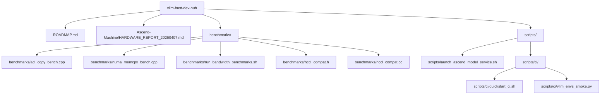
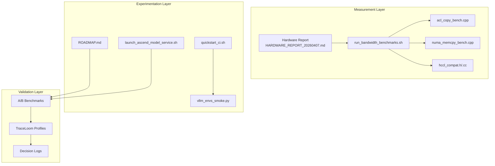
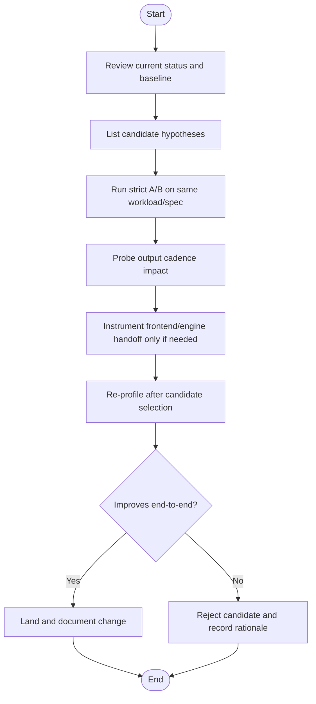
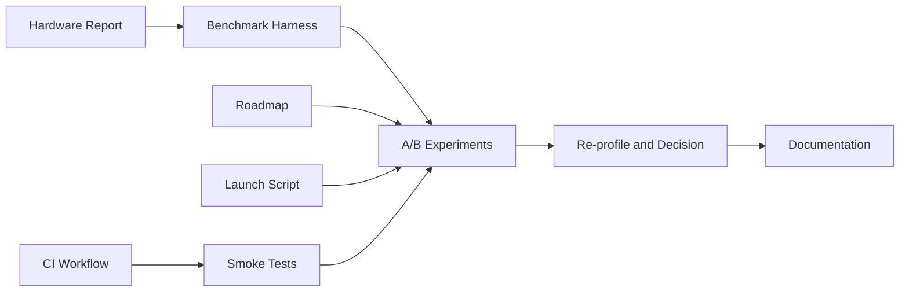

# Optimization Strategies

<cite>
**Referenced Files in This Document**
- [README.md](file://README.md)
- [ROADMAP.md](file://ROADMAP.md)
- [HARDWARE_REPORT_20260407.md](file://Ascend-Machine/HARDWARE_REPORT_20260407.md)
- [acl_copy_bench.cpp](file://Ascend-Machine/benchmarks/acl_copy_bench.cpp)
- [numa_memcpy_bench.cpp](file://Ascend-Machine/benchmarks/numa_memcpy_bench.cpp)
- [run_bandwidth_benchmarks.sh](file://Ascend-Machine/benchmarks/run_bandwidth_benchmarks.sh)
- [hccl_compat.h](file://Ascend-Machine/benchmarks/hccl_compat.h)
- [hccl_compat.cc](file://Ascend-Machine/benchmarks/hccl_compat.cc)
- [launch_ascend_model_service.sh](file://scripts/launch_ascend_model_service.sh)
- [quickstart_ci.sh](file://scripts/ci/quickstart_ci.sh)
- [vllm_envs_smoke.py](file://scripts/ci/vllm_envs_smoke.py)
</cite>

## Table of Contents
1. [Introduction](#introduction)
2. [Project Structure](#project-structure)
3. [Core Components](#core-components)
4. [Architecture Overview](#architecture-overview)
5. [Detailed Component Analysis](#detailed-component-analysis)
6. [Dependency Analysis](#dependency-analysis)
7. [Performance Considerations](#performance-considerations)
8. [Troubleshooting Guide](#troubleshooting-guide)
9. [Conclusion](#conclusion)
10. [Appendices](#appendices)

## Introduction
This document presents a comprehensive, evidence-based optimization strategy for the VLLM-HUST performance optimization framework. It synthesizes the performance roadmap, hardware characterization, and measurement tooling to define a scientific methodology for identifying bottlenecks, validating hypotheses, and implementing targeted improvements across kernel-level, system-level, and application-level layers. The guidance emphasizes reproducible benchmarking, controlled experimentation, and documented decision-making to maintain performance regressions and prioritize optimization efforts effectively.

## Project Structure
The repository organizes performance-critical assets into three primary areas:
- Performance roadmap and decision-making: ROADMAP.md documents the current status, hypotheses, and next steps for optimization.
- Hardware characterization and bandwidth measurements: Ascend-Machine/HARDWARE_REPORT_20260407.md and associated benchmark binaries and scripts quantify host-NPU and inter-NPU communication characteristics.
- Launch and CI infrastructure: scripts enabling reproducible model service launches and CI smoke tests that validate environment readiness for performance experiments.

**Diagram sources**
- [README.md:1-288](file://README.md#L1-L288)
- [ROADMAP.md:1-83](file://ROADMAP.md#L1-L83)
- [HARDWARE_REPORT_20260407.md:1-215](file://Ascend-Machine/HARDWARE_REPORT_20260407.md#L1-L215)
- [run_bandwidth_benchmarks.sh:1-373](file://Ascend-Machine/benchmarks/run_bandwidth_benchmarks.sh#L1-L373)
- [launch_ascend_model_service.sh:1-680](file://scripts/launch_ascend_model_service.sh#L1-L680)
- [quickstart_ci.sh:1-321](file://scripts/ci/quickstart_ci.sh#L1-L321)
- [vllm_envs_smoke.py:1-69](file://scripts/ci/vllm_envs_smoke.py#L1-L69)

**Section sources**
- [README.md:1-288](file://README.md#L1-L288)
- [ROADMAP.md:1-83](file://ROADMAP.md#L1-L83)
- [HARDWARE_REPORT_20260407.md:1-215](file://Ascend-Machine/HARDWARE_REPORT_20260407.md#L1-L215)
- [run_bandwidth_benchmarks.sh:1-373](file://Ascend-Machine/benchmarks/run_bandwidth_benchmarks.sh#L1-L373)
- [launch_ascend_model_service.sh:1-680](file://scripts/launch_ascend_model_service.sh#L1-L680)
- [quickstart_ci.sh:1-321](file://scripts/ci/quickstart_ci.sh#L1-L321)
- [vllm_envs_smoke.py:1-69](file://scripts/ci/vllm_envs_smoke.py#L1-L69)

## Core Components
- Performance roadmap: Defines current low-risk changes, candidate optimizations, and validation steps for end-to-end latency improvements.
- Hardware characterization: Provides NUMA-local and cross-NUMA memory bandwidth, NPU<->Host ACL copy bandwidth, and HCCL collective bandwidth baselines.
- Benchmark harness: Executes clean-environment ACL and HCCL tests, captures system inventory, and aggregates results for reproducible comparisons.
- Launch orchestration: Standardizes model service startup, environment setup, and runtime flags to isolate software variables during experiments.
- CI and smoke tests: Automates environment verification and smoke checks to ensure reproducibility and prevent regressions.

Key optimization levers:
- Kernel-level: ACL copy bandwidth, HCCL collective bandwidth, and custom kernel compilation toggles.
- System-level: NUMA locality, CPU affinity, and memory allocation policies.
- Application-level: Scheduler output cadence, KV admission fast path, and eager/compiled kernel selection.

**Section sources**
- [ROADMAP.md:1-83](file://ROADMAP.md#L1-L83)
- [HARDWARE_REPORT_20260407.md:88-215](file://Ascend-Machine/HARDWARE_REPORT_20260407.md#L88-L215)
- [run_bandwidth_benchmarks.sh:153-373](file://Ascend-Machine/benchmarks/run_bandwidth_benchmarks.sh#L153-L373)
- [launch_ascend_model_service.sh:502-680](file://scripts/launch_ascend_model_service.sh#L502-L680)
- [quickstart_ci.sh:232-321](file://scripts/ci/quickstart_ci.sh#L232-L321)

## Architecture Overview
The optimization pipeline integrates hardware characterization with controlled experiments and validation:

**Diagram sources**
- [HARDWARE_REPORT_20260407.md:1-215](file://Ascend-Machine/HARDWARE_REPORT_20260407.md#L1-L215)
- [run_bandwidth_benchmarks.sh:1-373](file://Ascend-Machine/benchmarks/run_bandwidth_benchmarks.sh#L1-L373)
- [acl_copy_bench.cpp:1-269](file://Ascend-Machine/benchmarks/acl_copy_bench.cpp#L1-L269)
- [numa_memcpy_bench.cpp:1-143](file://Ascend-Machine/benchmarks/numa_memcpy_bench.cpp#L1-L143)
- [hccl_compat.h:1-65](file://Ascend-Machine/benchmarks/hccl_compat.h#L1-L65)
- [hccl_compat.cc:1-9](file://Ascend-Machine/benchmarks/hccl_compat.cc#L1-L9)
- [ROADMAP.md:1-83](file://ROADMAP.md#L1-L83)
- [launch_ascend_model_service.sh:1-680](file://scripts/launch_ascend_model_service.sh#L1-L680)
- [quickstart_ci.sh:1-321](file://scripts/ci/quickstart_ci.sh#L1-L321)
- [vllm_envs_smoke.py:1-69](file://scripts/ci/vllm_envs_smoke.py#L1-L69)

## Detailed Component Analysis

### Performance Roadmap: Hypothesis Formation and Validation Protocol
The roadmap defines a structured approach to optimization:
- Current status: a low-risk change in the KV cache manager fast path is validated on a specific workload.
- Next steps: quantify the fast path, probe output cadence, instrument frontend-to-engine handoff, re-profile after candidate selection, and document the winning change.

**Diagram sources**
- [ROADMAP.md:6-83](file://ROADMAP.md#L6-L83)

**Section sources**
- [ROADMAP.md:6-83](file://ROADMAP.md#L6-L83)

### Hardware Characterization: NUMA, Memory, and NPU Bandwidth Baselines
The hardware report provides:
- NUMA topology and memory bandwidth across local, same-socket remote, and cross-socket remote configurations.
- Single and multi-NPU ACL H2D/D2H bandwidth, and aggregate wall-clock throughput.
- HCCL collective bandwidth baselines for AllGather, AllReduce, Broadcast, Reduce, Scatter, and newly recovered AllToAll and ReduceScatter.

Practical implications:
- NUMA-aware CPU pinning and memory allocation strategies should be evaluated to avoid cross-socket DRAM traffic.
- Multi-NPU aggregation depends on PCIe domain distribution; ensure device selection respects NUMA and PCIe grouping.
- HCCL availability and stability depend on the current toolkit path; avoid conclusions drawn from outdated toolchains.

**Section sources**
- [HARDWARE_REPORT_20260407.md:88-215](file://Ascend-Machine/HARDWARE_REPORT_20260407.md#L88-L215)

### Benchmark Harness: Clean Environments and Reproducible Measurements
The benchmarking harness executes:
- Static inventory capture (CPU, memory, NUMA, PCI, NIC, NPU topology).
- NUMA memcpy and MBW tests with configurable thread counts and sizes.
- ACL H2D/D2H tests with per-device warmups and iterations, aggregating per-device and wall-clock bandwidth.
- HCCL tests built against the toolkit’s hccl_test sources with OpenMPI/MPICH, capturing per-operation bandwidth.

Operational notes:
- Clean environment execution is mandatory for ACL/HCCL tests to avoid LD_LIBRARY_PATH conflicts.
- HCCL availability depends on resolving MPI headers/libs and using the current toolkit’s libhccl.so.

**Section sources**
- [run_bandwidth_benchmarks.sh:153-373](file://Ascend-Machine/benchmarks/run_bandwidth_benchmarks.sh#L153-L373)
- [acl_copy_bench.cpp:131-206](file://Ascend-Machine/benchmarks/acl_copy_bench.cpp#L131-L206)
- [numa_memcpy_bench.cpp:89-143](file://Ascend-Machine/benchmarks/numa_memcpy_bench.cpp#L89-L143)
- [hccl_compat.h:1-65](file://Ascend-Machine/benchmarks/hccl_compat.h#L1-L65)
- [hccl_compat.cc:1-9](file://Ascend-Machine/benchmarks/hccl_compat.cc#L1-L9)

### Launch Orchestration: Controlled Experimentation Conditions
The launch script standardizes:
- Environment selection (host vs Docker) and CANN/PyTorch linkage.
- Model presets and tensor-parallel size selection.
- Runtime flags impacting performance (eager enforcement, prefix caching, chunked prefill).
- Health checks and logging for reproducible experiment runs.

Guidance:
- Use consistent flags across experiments to isolate variable changes.
- Prefer Docker mode when reproducing across environments to avoid CANN mismatches.
- Capture logs and metrics for post-experiment analysis.

**Section sources**
- [launch_ascend_model_service.sh:502-680](file://scripts/launch_ascend_model_service.sh#L502-L680)

### CI and Smoke Tests: Regression Prevention
The CI workflow:
- Creates isolated conda environments and installs required packages.
- Runs smoke tests to validate environment readiness and plugin presence.
- Produces structured logs and JUnit artifacts for traceability.

Recommendations:
- Integrate performance smoke tests into CI to detect early regressions.
- Use deterministic environment variables and pinned versions to ensure reproducibility.

**Section sources**
- [quickstart_ci.sh:232-321](file://scripts/ci/quickstart_ci.sh#L232-L321)
- [vllm_envs_smoke.py:1-69](file://scripts/ci/vllm_envs_smoke.py#L1-L69)

## Dependency Analysis
The optimization workflow depends on coordinated inputs and outputs across layers:

**Diagram sources**
- [HARDWARE_REPORT_20260407.md:1-215](file://Ascend-Machine/HARDWARE_REPORT_20260407.md#L1-L215)
- [run_bandwidth_benchmarks.sh:1-373](file://Ascend-Machine/benchmarks/run_bandwidth_benchmarks.sh#L1-L373)
- [ROADMAP.md:1-83](file://ROADMAP.md#L1-L83)
- [launch_ascend_model_service.sh:1-680](file://scripts/launch_ascend_model_service.sh#L1-L680)
- [quickstart_ci.sh:1-321](file://scripts/ci/quickstart_ci.sh#L1-L321)

**Section sources**
- [HARDWARE_REPORT_20260407.md:1-215](file://Ascend-Machine/HARDWARE_REPORT_20260407.md#L1-L215)
- [run_bandwidth_benchmarks.sh:1-373](file://Ascend-Machine/benchmarks/run_bandwidth_benchmarks.sh#L1-L373)
- [ROADMAP.md:1-83](file://ROADMAP.md#L1-L83)
- [launch_ascend_model_service.sh:1-680](file://scripts/launch_ascend_model_service.sh#L1-L680)
- [quickstart_ci.sh:1-321](file://scripts/ci/quickstart_ci.sh#L1-L321)

## Performance Considerations
Cross-layer optimization opportunities:
- Kernel-level
  - ACL copy bandwidth: evaluate per-device vs aggregated throughput; ensure clean environment execution; verify device affinity and CPU pinning.
  - HCCL collective bandwidth: confirm current toolkit path compatibility; avoid conclusions from outdated toolchains; leverage multi-rank aggregation for validation.
- System-level
  - NUMA locality: prefer local memory access; bind CPUs to minimize cross-socket DRAM traffic; validate memory allocation policies.
  - Storage: sequential reads on NVMe; ensure sufficient IO bandwidth for model loading.
- Application-level
  - Scheduler output cadence: test non-default stream intervals to reduce overhead.
  - KV admission fast path: quantify latency impact with strict A/B; retain only repeatable improvements.
  - Eager vs compiled kernels: enforce eager mode when JIT issues are suspected; validate trade-offs for latency and throughput.

Prioritization guidelines:
- Start with low-risk, easily reversible changes (e.g., KV fast path).
- Validate on representative workloads before profiling deeper layers.
- Document rejected hypotheses and rationale to guide future experiments.

[No sources needed since this section provides general guidance]

## Troubleshooting Guide
Common issues and mitigations:
- ACL/HCCL initialization failures: ensure clean environment execution and correct toolkit paths; avoid inheriting conda LD_LIBRARY_PATH.
- HCCL collective failures: verify MPI headers/libs resolution and use the current toolkit’s libhccl.so; avoid relying on outdated toolchain assumptions.
- Cross-socket memory bottlenecks: adjust CPU affinity and memory binding; prefer local NUMA nodes for large buffers.
- CI instability: pin environment variables and versions; run smoke tests to validate environment readiness.

**Section sources**
- [run_bandwidth_benchmarks.sh:153-170](file://Ascend-Machine/benchmarks/run_bandwidth_benchmarks.sh#L153-L170)
- [run_bandwidth_benchmarks.sh:281-328](file://Ascend-Machine/benchmarks/run_bandwidth_benchmarks.sh#L281-L328)
- [HARDWARE_REPORT_20260407.md:167-174](file://Ascend-Machine/HARDWARE_REPORT_20260407.md#L167-L174)
- [quickstart_ci.sh:232-321](file://scripts/ci/quickstart_ci.sh#L232-L321)

## Conclusion
The VLLM-HUST optimization framework combines a rigorous roadmap, robust hardware characterization, and reproducible measurement tooling. By applying controlled experimentation, maintaining detailed documentation, and leveraging CI safeguards, teams can systematically identify and address performance bottlenecks across kernel, system, and application layers while minimizing risk and preventing regressions.

[No sources needed since this section summarizes without analyzing specific files]

## Appendices

### Appendix A: Example Optimization Sequence (KV Admission Fast Path)
- Hypothesis: The KV admission fast path reduces redundant checks and improves latency.
- A/B benchmark: Run identical workload with and without the fast path; compare median latency; increase iterations for stability.
- Instrumentation: If needed, add reversible probes around engine output delivery or scheduler update timing.
- Re-profile: Collect TraceLoom profiles to verify reduction in prelude or late-loop idle.
- Decision: Keep change only if end-to-end latency improves consistently.

**Section sources**
- [ROADMAP.md:25-83](file://ROADMAP.md#L25-L83)

### Appendix B: Case Study – HCCL Availability Recovery
- Problem: AllToAll and ReduceScatter reported retcode 7 under an older toolchain.
- Investigation: Recreated test using current toolkit’s libhccl.so and official hccl_test sources with MPICH.
- Outcome: Successfully measured bandwidth for AllToAll and ReduceScatter; updated conclusions accordingly.
- Lesson: Avoid drawing conclusions from outdated toolchains; re-validate with current software stack.

**Section sources**
- [HARDWARE_REPORT_20260407.md:130-152](file://Ascend-Machine/HARDWARE_REPORT_20260407.md#L130-L152)