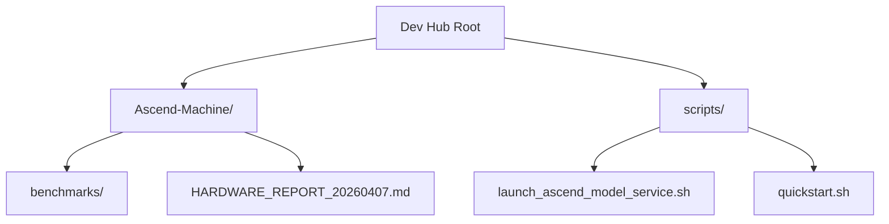
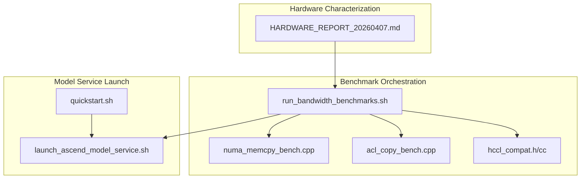
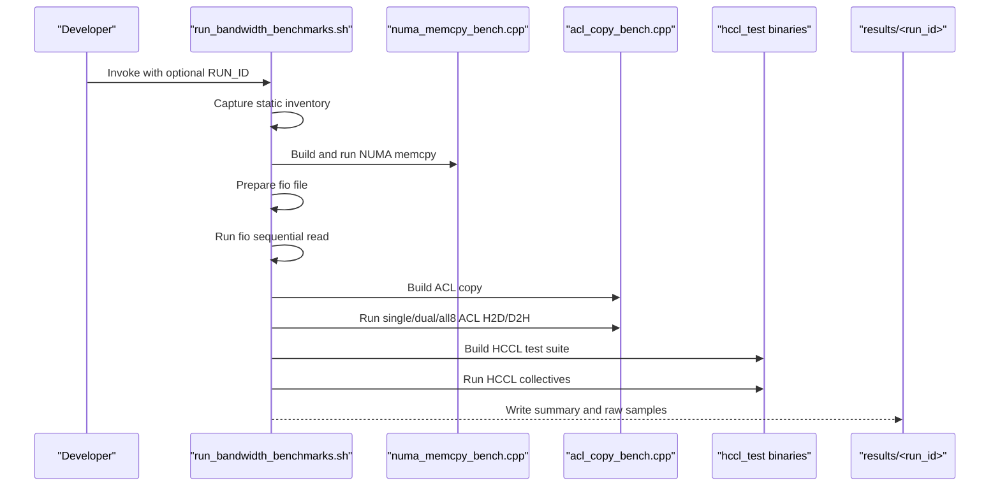
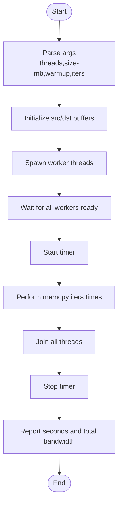
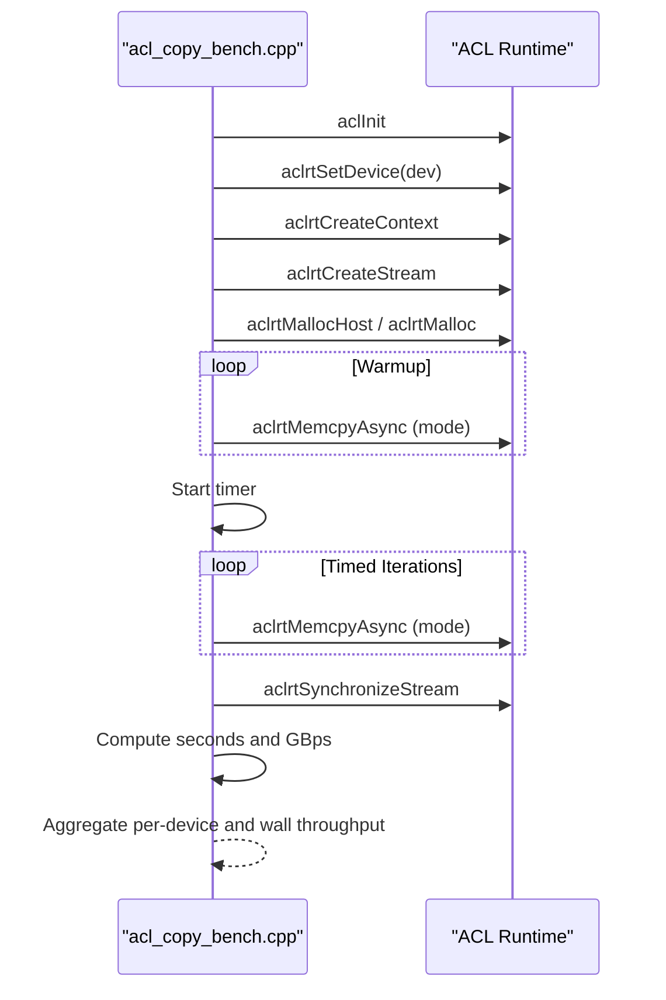
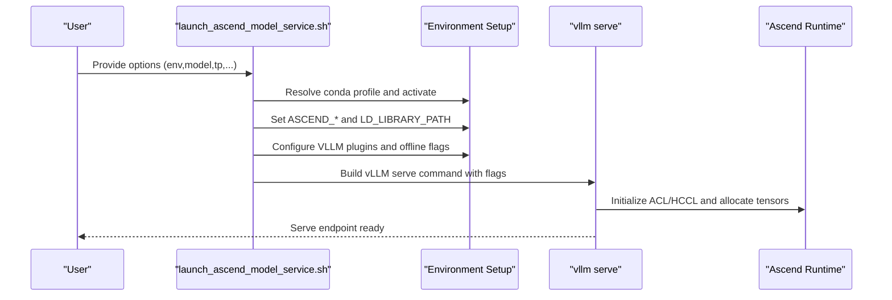
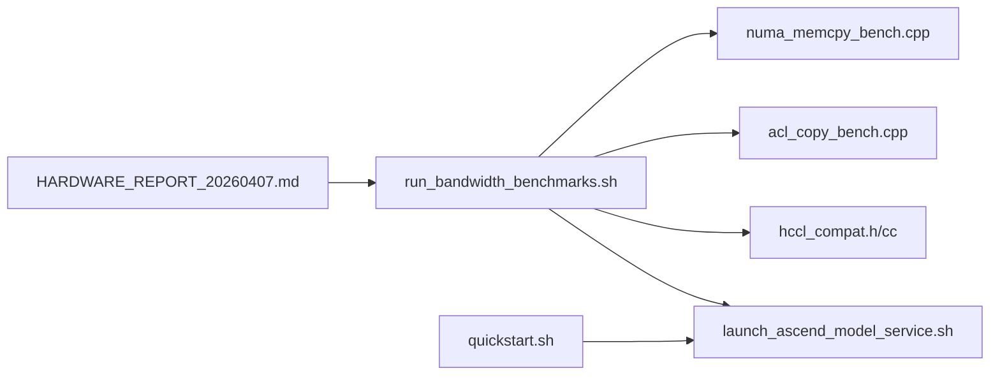

# Performance Optimization

<cite>
**Referenced Files in This Document**
- [README.md](file://README.md)
- [ROADMAP.md](file://ROADMAP.md)
- [run_bandwidth_benchmarks.sh](file://Ascend-Machine/benchmarks/run_bandwidth_benchmarks.sh)
- [acl_copy_bench.cpp](file://Ascend-Machine/benchmarks/acl_copy_bench.cpp)
- [numa_memcpy_bench.cpp](file://Ascend-Machine/benchmarks/numa_memcpy_bench.cpp)
- [hccl_compat.h](file://Ascend-Machine/benchmarks/hccl_compat.h)
- [hccl_compat.cc](file://Ascend-Machine/benchmarks/hccl_compat.cc)
- [HARDWARE_REPORT_20260407.md](file://Ascend-Machine/HARDWARE_REPORT_20260407.md)
- [launch_ascend_model_service.sh](file://scripts/launch_ascend_model_service.sh)
- [install_ascend_benchmark_root_helper.sh](file://scripts/ci/install_ascend_benchmark_root_helper.sh)
- [quickstart.sh](file://scripts/quickstart.sh)
</cite>

## Table of Contents
1. [Introduction](#introduction)
2. [Project Structure](#project-structure)
3. [Core Components](#core-components)
4. [Architecture Overview](#architecture-overview)
5. [Detailed Component Analysis](#detailed-component-analysis)
6. [Dependency Analysis](#dependency-analysis)
7. [Performance Considerations](#performance-considerations)
8. [Troubleshooting Guide](#troubleshooting-guide)
9. [Conclusion](#conclusion)
10. [Appendices](#appendices)

## Introduction
This document describes the performance optimization framework within the VLLM-HUST Development Hub. It explains the performance roadmap, hardware characterization methodology, and benchmarking approaches used to quantify and improve inference performance on Ascend NPUs. It documents the implementation details of benchmarking tools, performance measurement, and optimization strategies, and provides concrete examples from the repository’s scripts and reports. It also outlines configuration options, benchmark parameters, and performance metrics, and explains relationships with Ascend hardware acceleration and system-level optimizations.

## Project Structure
The repository organizes performance-related assets into three primary areas:
- Ascend-Machine/benchmarks: Hardware characterization and bandwidth benchmarks for CPU-NUMA, host-device transfers, and HCCL collectives.
- Ascend-Machine/HARDWARE_REPORT_20260407.md: Comprehensive hardware report and measured bandwidth results.
- scripts: Operational scripts for launching Ascend model services and bootstrapping environments, including Ascend-specific runtime and container workflows.

**Diagram sources**
- [README.md:13](file://README.md#L13)
- [README.md:40](file://README.md#L40)
- [README.md:47](file://README.md#L47)

**Section sources**
- [README.md:13](file://README.md#L13)
- [README.md:40](file://README.md#L40)
- [README.md:47](file://README.md#L47)

## Core Components
- Performance roadmap and goals: Defines quantification tasks, output cadence probing, and controlled profiling to validate end-to-end improvements.
- Hardware characterization report: Documents machine topology, NUMA layout, PCIe domains, and measured bandwidths for host-device and HCCL collectives.
- Benchmarking suite:
  - run_bandwidth_benchmarks.sh orchestrates static inventory capture, NUMA memcpy, ACL copy, and HCCL collective tests.
  - numa_memcpy_bench.cpp measures multi-threaded NUMA-local memory bandwidth.
  - acl_copy_bench.cpp measures single and multi-NPU host-device transfer bandwidth.
  - hccl_compat.* provides compatibility shims for HCCL APIs used by the built hccl_test binaries.
- Model service launcher: Provides configuration knobs for tensor parallel size, quantization, eager enforcement, and chunked prefill to influence runtime performance.

**Section sources**
- [ROADMAP.md:23](file://ROADMAP.md#L23)
- [ROADMAP.md:39](file://ROADMAP.md#L39)
- [HARDWARE_REPORT_20260407.md:15](file://Ascend-Machine/HARDWARE_REPORT_20260407.md#L15)
- [HARDWARE_REPORT_20260407.md:114](file://Ascend-Machine/HARDWARE_REPORT_20260407.md#L114)
- [run_bandwidth_benchmarks.sh:352](file://Ascend-Machine/benchmarks/run_bandwidth_benchmarks.sh#L352)
- [numa_memcpy_bench.cpp:89](file://Ascend-Machine/benchmarks/numa_memcpy_bench.cpp#L89)
- [acl_copy_bench.cpp:210](file://Ascend-Machine/benchmarks/acl_copy_bench.cpp#L210)
- [hccl_compat.h:1](file://Ascend-Machine/benchmarks/hccl_compat.h#L1)
- [launch_ascend_model_service.sh:50](file://scripts/launch_ascend_model_service.sh#L50)

## Architecture Overview
The performance measurement pipeline integrates hardware characterization, targeted micro-benchmarks, and model-service launch with tunable runtime flags.

**Diagram sources**
- [HARDWARE_REPORT_20260407.md:15](file://Ascend-Machine/HARDWARE_REPORT_20260407.md#L15)
- [run_bandwidth_benchmarks.sh:352](file://Ascend-Machine/benchmarks/run_bandwidth_benchmarks.sh#L352)
- [numa_memcpy_bench.cpp:89](file://Ascend-Machine/benchmarks/numa_memcpy_bench.cpp#L89)
- [acl_copy_bench.cpp:210](file://Ascend-Machine/benchmarks/acl_copy_bench.cpp#L210)
- [hccl_compat.h:1](file://Ascend-Machine/benchmarks/hccl_compat.h#L1)
- [launch_ascend_model_service.sh:50](file://scripts/launch_ascend_model_service.sh#L50)
- [quickstart.sh:453](file://scripts/quickstart.sh#L453)

## Detailed Component Analysis

### Performance Roadmap and Goals
- Quantify KV admission optimization via strict A/B benchmarking with identical device, model, dtype, and iteration counts; prefer median latency when instability is observed.
- Probe host-side output cadence by varying stream intervals and validating gains on longer decode lengths.
- Instrument frontend-to-engine output handling only after cheaper A/B checks confirm value.
- Re-profile after a candidate improves the short benchmark to verify reduction in prelude or late-loop idle.
- Document the final change with precise benchmark commands, results, and rejected hypotheses.

**Section sources**
- [ROADMAP.md:25](file://ROADMAP.md#L25)
- [ROADMAP.md:39](file://ROADMAP.md#L39)
- [ROADMAP.md:62](file://ROADMAP.md#L62)
- [ROADMAP.md:74](file://ROADMAP.md#L74)

### Hardware Characterization Methodology
- Static inventory capture includes CPU topology, NUMA layout, memory, storage, and NIC details.
- NUMA memcpy and mbw baselines measure local, same-socket, and cross-socket memory bandwidth.
- ACL copy tests measure single NPU, dual NPU within a PCIe domain, and aggregated 8-NPU host-to-device throughput.
- HCCL collectives (All Gather, All Reduce, Scatter, Broadcast, Reduce, All To All, Reduce Scatter) measured with standardized parameters and MPI/HCCL stack.

Key outcomes:
- Single NPU H2D/D2H bandwidth ~25–29 GB/s.
- Cross-socket DRAM access is ~1/3 of local bandwidth.
- 8-card aggregation demonstrates concurrent PCIe domain throughput.

**Section sources**
- [HARDWARE_REPORT_20260407.md:17](file://Ascend-Machine/HARDWARE_REPORT_20260407.md#L17)
- [HARDWARE_REPORT_20260407.md:88](file://Ascend-Machine/HARDWARE_REPORT_20260407.md#L88)
- [HARDWARE_REPORT_20260407.md:114](file://Ascend-Machine/HARDWARE_REPORT_20260407.md#L114)
- [HARDWARE_REPORT_20260407.md:130](file://Ascend-Machine/HARDWARE_REPORT_20260407.md#L130)
- [HARDWARE_REPORT_20260407.md:205](file://Ascend-Machine/HARDWARE_REPORT_20260407.md#L205)

### Benchmarking Tools Implementation

#### Orchestrator: run_bandwidth_benchmarks.sh
Responsibilities:
- Capture static inventory (CPU, NUMA, memory, PCI, NIC).
- Build and run NUMA memcpy benchmark.
- Prepare and run fio sequential read.
- Build and run ACL copy benchmarks for single, dual, and 8-NPU configurations.
- Build and run HCCL collectives using toolkit-provided sources with compatibility shims.
- Export results to timestamped directories and symlink “latest”.

Configuration and environment:
- Clean environment isolation for ACL/HCCL tests to avoid conda pollution.
- MPI discovery and linking for HCCL builds.
- Optional sudo for privileged operations (e.g., fio).

**Diagram sources**
- [run_bandwidth_benchmarks.sh:352](file://Ascend-Machine/benchmarks/run_bandwidth_benchmarks.sh#L352)
- [numa_memcpy_bench.cpp:89](file://Ascend-Machine/benchmarks/numa_memcpy_bench.cpp#L89)
- [acl_copy_bench.cpp:210](file://Ascend-Machine/benchmarks/acl_copy_bench.cpp#L210)
- [hccl_compat.h:1](file://Ascend-Machine/benchmarks/hccl_compat.h#L1)

**Section sources**
- [run_bandwidth_benchmarks.sh:352](file://Ascend-Machine/benchmarks/run_bandwidth_benchmarks.sh#L352)
- [run_bandwidth_benchmarks.sh:153](file://Ascend-Machine/benchmarks/run_bandwidth_benchmarks.sh#L153)
- [run_bandwidth_benchmarks.sh:203](file://Ascend-Machine/benchmarks/run_bandwidth_benchmarks.sh#L203)
- [run_bandwidth_benchmarks.sh:262](file://Ascend-Machine/benchmarks/run_bandwidth_benchmarks.sh#L262)
- [run_bandwidth_benchmarks.sh:281](file://Ascend-Machine/benchmarks/run_bandwidth_benchmarks.sh#L281)
- [run_bandwidth_benchmarks.sh:330](file://Ascend-Machine/benchmarks/run_bandwidth_benchmarks.sh#L330)

#### NUMA Memory Bandwidth: numa_memcpy_bench.cpp
- Multi-threaded memcpy across per-thread buffers sized by arguments.
- Warmup iterations, synchronized start, and atomic readiness signaling.
- Outputs total bandwidth and per-thread timing.

Parameters:
- threads: number of worker threads.
- size-mb: buffer size per thread in MB.
- warmup: number of warmup iterations.
- iters: number of timed iterations.

**Diagram sources**
- [numa_memcpy_bench.cpp:89](file://Ascend-Machine/benchmarks/numa_memcpy_bench.cpp#L89)

**Section sources**
- [numa_memcpy_bench.cpp:34](file://Ascend-Machine/benchmarks/numa_memcpy_bench.cpp#L34)
- [numa_memcpy_bench.cpp:89](file://Ascend-Machine/benchmarks/numa_memcpy_bench.cpp#L89)

#### ACL Host-Device Copy: acl_copy_bench.cpp
- Initializes ACL, sets device, creates context and stream, allocates pinned host and device buffers.
- Performs warmup and timed iterations of H2D or D2H copies.
- Aggregates per-device bandwidth and wall-clock aggregate throughput.

Parameters:
- mode: h2d or d2h.
- devices: comma-separated device IDs.
- affinity-lists: optional CPU affinity per device.
- size-mb: buffer size per device in MB.
- warmup/iters: warmup and timed iterations.

**Diagram sources**
- [acl_copy_bench.cpp:210](file://Ascend-Machine/benchmarks/acl_copy_bench.cpp#L210)

**Section sources**
- [acl_copy_bench.cpp:87](file://Ascend-Machine/benchmarks/acl_copy_bench.cpp#L87)
- [acl_copy_bench.cpp:131](file://Ascend-Machine/benchmarks/acl_copy_bench.cpp#L131)

#### HCCL Compatibility Shims: hccl_compat.*
- Provides V2 API shims to build toolkit-provided hccl_test binaries against current libhccl.so.
- Includes logging and error behavior helpers.

**Section sources**
- [hccl_compat.h:1](file://Ascend-Machine/benchmarks/hccl_compat.h#L1)
- [hccl_compat.cc:1](file://Ascend-Machine/benchmarks/hccl_compat.cc#L1)

### Model Service Launch and System-Level Optimizations
The model service launcher configures Ascend runtime, environment variables, and vLLM serving flags to optimize performance and stability.

Key configuration options:
- Environment and binding: env, model, host, port, served-model-name.
- Model configuration: tp, max-model-len, gpu-mem-util, dtype, load-format, quantization, max-num-seqs, max-num-batched-tokens.
- Operational toggles: enforce-eager, prefix-caching, chunked-prefill, flashcomm1, expert-parallel.
- Docker/host modes: container visibility, NPU device selection, toolkit environment sourcing, library path setup, and plugin flags.

System-level optimizations:
- Ascend visible devices and HCCL expansion mode.
- Torch allocator expandable segments.
- Preflight disable for faster first-init.
- Plugin and offline flags for cache isolation and performance-sensitive ops.

**Diagram sources**
- [launch_ascend_model_service.sh:50](file://scripts/launch_ascend_model_service.sh#L50)
- [launch_ascend_model_service.sh:366](file://scripts/launch_ascend_model_service.sh#L366)
- [launch_ascend_model_service.sh:401](file://scripts/launch_ascend_model_service.sh#L401)

**Section sources**
- [launch_ascend_model_service.sh:50](file://scripts/launch_ascend_model_service.sh#L50)
- [launch_ascend_model_service.sh:366](file://scripts/launch_ascend_model_service.sh#L366)
- [launch_ascend_model_service.sh:401](file://scripts/launch_ascend_model_service.sh#L401)

## Dependency Analysis
- Hardware characterization depends on accurate machine topology and driver/toolkit versions captured in the hardware report.
- Benchmark orchestration depends on:
  - Clean environment isolation for ACL/HCCL tests.
  - MPI availability for HCCL builds.
  - Toolchain paths for toolkit headers/libs.
- Model service launch depends on:
  - Conda environment activation and toolkit environment sourcing.
  - Correct NPU device visibility and library path resolution.
  - Ascend plugin presence and offline cache configuration.

**Diagram sources**
- [HARDWARE_REPORT_20260407.md:15](file://Ascend-Machine/HARDWARE_REPORT_20260407.md#L15)
- [run_bandwidth_benchmarks.sh:352](file://Ascend-Machine/benchmarks/run_bandwidth_benchmarks.sh#L352)
- [numa_memcpy_bench.cpp:89](file://Ascend-Machine/benchmarks/numa_memcpy_bench.cpp#L89)
- [acl_copy_bench.cpp:210](file://Ascend-Machine/benchmarks/acl_copy_bench.cpp#L210)
- [hccl_compat.h:1](file://Ascend-Machine/benchmarks/hccl_compat.h#L1)
- [quickstart.sh:453](file://scripts/quickstart.sh#L453)
- [launch_ascend_model_service.sh:50](file://scripts/launch_ascend_model_service.sh#L50)

**Section sources**
- [run_bandwidth_benchmarks.sh:352](file://Ascend-Machine/benchmarks/run_bandwidth_benchmarks.sh#L352)
- [quickstart.sh:453](file://scripts/quickstart.sh#L453)
- [launch_ascend_model_service.sh:50](file://scripts/launch_ascend_model_service.sh#L50)

## Performance Considerations
- Use the hardware report to understand NUMA locality and PCIe domain effects on bandwidth and latency.
- Prefer clean environments for ACL/HCCL tests to avoid library path contamination.
- Increase iteration counts and use median latency for stable A/B comparisons.
- Tune model-service flags (e.g., enforce-eager, chunked prefill, prefix caching) to balance throughput and latency.
- Validate HCCL collectives with the current toolkit stack and avoid outdated test paths.

[No sources needed since this section provides general guidance]

## Troubleshooting Guide
Common issues and remedies:
- ACL initialization failures in non-clean environments: run ACL/HCCL tests with clean environment isolation as implemented in the orchestrator.
- Missing MPI headers/libs for HCCL builds: ensure MPI discovery succeeds or set explicit MPI_HOME/MPI_INC_DIR/MPI_LIB_DIR.
- Privileged operations (e.g., fio) require sudo: the orchestrator detects and uses sudo when available.
- HCCL collective failures due to incorrect test path or validation: follow the report’s note to use the current official toolkit path and disable result validation only when necessary.

**Section sources**
- [run_bandwidth_benchmarks.sh:153](file://Ascend-Machine/benchmarks/run_bandwidth_benchmarks.sh#L153)
- [run_bandwidth_benchmarks.sh:281](file://Ascend-Machine/benchmarks/run_bandwidth_benchmarks.sh#L281)
- [run_bandwidth_benchmarks.sh:73](file://Ascend-Machine/benchmarks/run_bandwidth_benchmarks.sh#L73)
- [HARDWARE_REPORT_20260407.md:167](file://Ascend-Machine/HARDWARE_REPORT_20260407.md#L167)

## Conclusion
The VLLM-HUST Development Hub provides a structured approach to performance optimization: quantify with a clear roadmap, characterize hardware comprehensively, execute robust benchmarks, and tune model-service configurations. The included scripts and reports form a reproducible pipeline to identify bottlenecks, validate optimizations, and maintain system-level compatibility with Ascend accelerators.

[No sources needed since this section summarizes without analyzing specific files]

## Appendices

### Benchmark Execution Examples (Paths)
- Run the full bandwidth benchmark suite:
  - [run_bandwidth_benchmarks.sh](file://Ascend-Machine/benchmarks/run_bandwidth_benchmarks.sh)
- Measure NUMA memory bandwidth:
  - [numa_memcpy_bench.cpp](file://Ascend-Machine/benchmarks/numa_memcpy_bench.cpp)
- Measure ACL host-device bandwidth:
  - [acl_copy_bench.cpp](file://Ascend-Machine/benchmarks/acl_copy_bench.cpp)
- Build and run HCCL collectives:
  - [run_bandwidth_benchmarks.sh](file://Ascend-Machine/benchmarks/run_bandwidth_benchmarks.sh)
  - [hccl_compat.h](file://Ascend-Machine/benchmarks/hccl_compat.h)
  - [hccl_compat.cc](file://Ascend-Machine/benchmarks/hccl_compat.cc)

**Section sources**
- [run_bandwidth_benchmarks.sh:352](file://Ascend-Machine/benchmarks/run_bandwidth_benchmarks.sh#L352)
- [numa_memcpy_bench.cpp:89](file://Ascend-Machine/benchmarks/numa_memcpy_bench.cpp#L89)
- [acl_copy_bench.cpp:210](file://Ascend-Machine/benchmarks/acl_copy_bench.cpp#L210)
- [hccl_compat.h:1](file://Ascend-Machine/benchmarks/hccl_compat.h#L1)
- [hccl_compat.cc:1](file://Ascend-Machine/benchmarks/hccl_compat.cc#L1)

### Configuration Options Summary
- Model service flags:
  - Environment: env, model, host, port, served-model-name.
  - Model: tp, max-model-len, gpu-mem-util, dtype, load-format, quantization, max-num-seqs, max-num-batched-tokens.
  - Operational: enforce-eager, prefix-caching, chunked-prefill, flashcomm1, expert-parallel.
- Benchmark parameters:
  - NUMA memcpy: threads, size-mb, warmup, iters.
  - ACL copy: mode, devices, affinity-lists, size-mb, warmup, iters.
  - HCCL: message size, dtype, iterations, warmup, root ranks, validation toggle.

**Section sources**
- [launch_ascend_model_service.sh:50](file://scripts/launch_ascend_model_service.sh#L50)
- [numa_memcpy_bench.cpp:34](file://Ascend-Machine/benchmarks/numa_memcpy_bench.cpp#L34)
- [acl_copy_bench.cpp:87](file://Ascend-Machine/benchmarks/acl_copy_bench.cpp#L87)
- [run_bandwidth_benchmarks.sh:330](file://Ascend-Machine/benchmarks/run_bandwidth_benchmarks.sh#L330)

### Relationship to Ascend Hardware Acceleration
- Hardware report details NUMA and PCIe topology, enabling informed placement of model replicas and data movement.
- ACL and HCCL benchmarks reflect real-world bandwidth achievable with the current toolkit stack.
- Model service launcher sets Ascend-visible devices, allocator behavior, and plugin flags to maximize performance.

**Section sources**
- [HARDWARE_REPORT_20260407.md:62](file://Ascend-Machine/HARDWARE_REPORT_20260407.md#L62)
- [HARDWARE_REPORT_20260407.md:114](file://Ascend-Machine/HARDWARE_REPORT_20260407.md#L114)
- [launch_ascend_model_service.sh:401](file://scripts/launch_ascend_model_service.sh#L401)