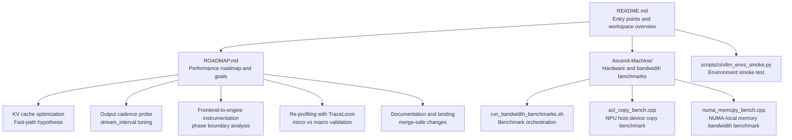
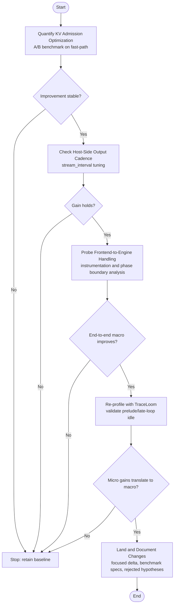
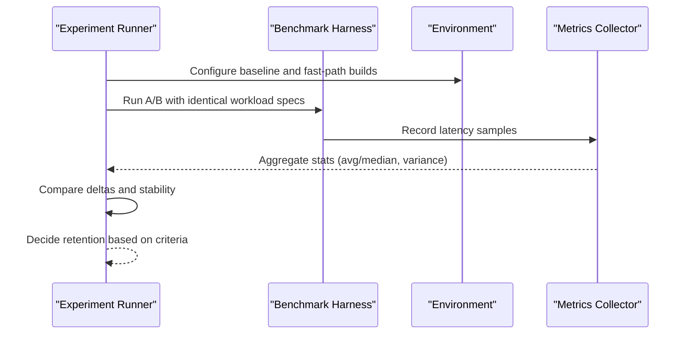
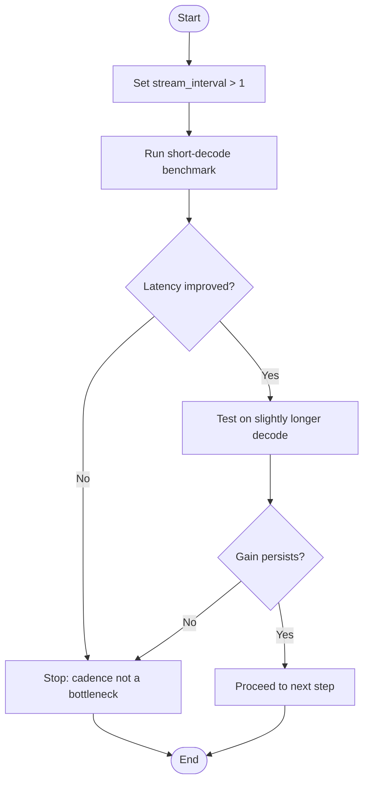
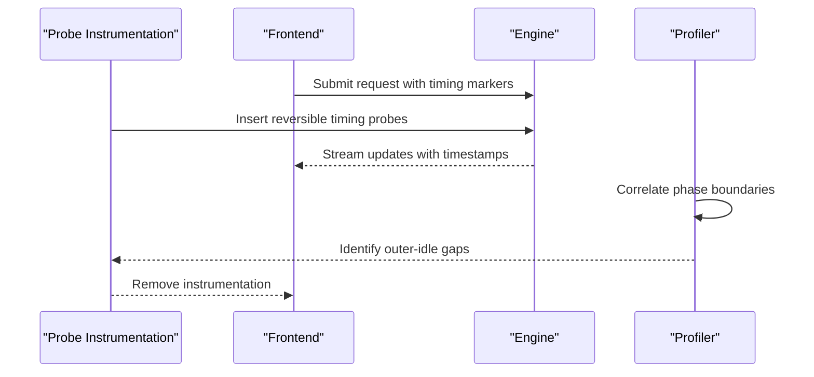
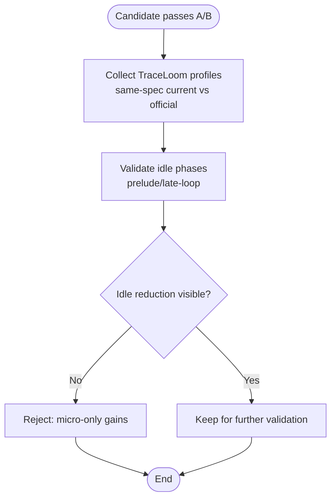
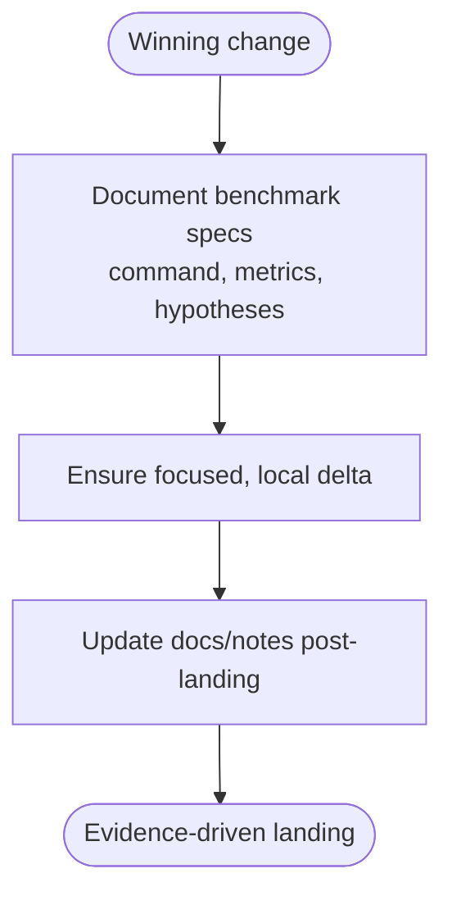
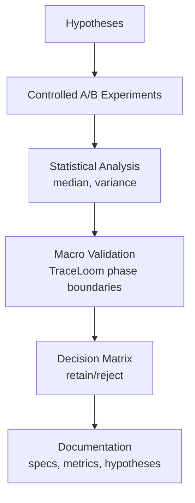
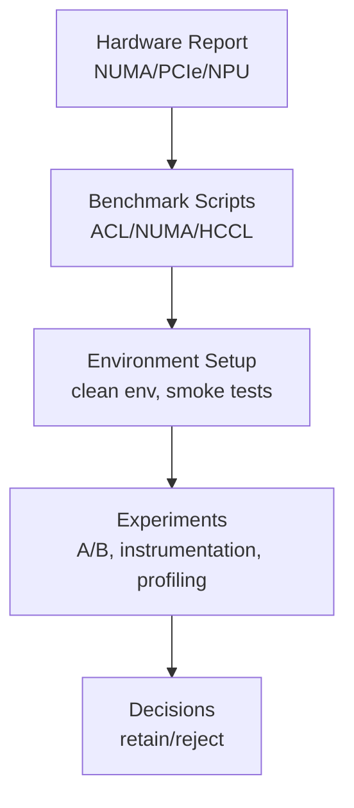

# Performance Roadmap and Goals

<cite>
**Referenced Files in This Document**
- [README.md](file://README.md)
- [ROADMAP.md](file://ROADMAP.md)
- [run_bandwidth_benchmarks.sh](file://Ascend-Machine/benchmarks/run_bandwidth_benchmarks.sh)
- [acl_copy_bench.cpp](file://Ascend-Machine/benchmarks/acl_copy_bench.cpp)
- [numa_memcpy_bench.cpp](file://Ascend-Machine/benchmarks/numa_memcpy_bench.cpp)
- [HARDWARE_REPORT_20260407.md](file://Ascend-Machine/HARDWARE_REPORT_20260407.md)
- [vllm_envs_smoke.py](file://scripts/ci/vllm_envs_smoke.py)
</cite>

## Table of Contents
1. [Introduction](#introduction)
2. [Project Structure](#project-structure)
3. [Core Components](#core-components)
4. [Architecture Overview](#architecture-overview)
5. [Detailed Component Analysis](#detailed-component-analysis)
6. [Dependency Analysis](#dependency-analysis)
7. [Performance Considerations](#performance-considerations)
8. [Troubleshooting Guide](#troubleshooting-guide)
9. [Conclusion](#conclusion)
10. [Appendices](#appendices)

## Introduction
This document presents the VLLM-HUST performance roadmap and goals, grounded in the current status of KV cache optimization and empirical benchmarking. It outlines a five-step scientific optimization process: quantify KV admission optimization, check host-side output cadence, probe frontend-to-engine handling, re-profile with evidence-based candidates, and land documented changes. It also documents the benchmark specifications, performance metrics, decision criteria, and the methodological rigor applied to validate performance improvements while balancing risk mitigation and gains.

## Project Structure
The repository organizes performance-related artifacts into a cohesive structure:
- Top-level documentation and entry points for development and performance workflows
- Hardware characterization and bandwidth benchmarking scripts for Ascend systems
- A dedicated performance roadmap that defines goals, hypotheses, and validation steps
- CI and environment verification utilities that support reproducible performance tests

**Diagram sources**
- [README.md:13](file://README.md#L13)
- [ROADMAP.md:25](file://ROADMAP.md#L25)
- [run_bandwidth_benchmarks.sh:1](file://Ascend-Machine/benchmarks/run_bandwidth_benchmarks.sh#L1)
- [acl_copy_bench.cpp:1](file://Ascend-Machine/benchmarks/acl_copy_bench.cpp#L1)
- [numa_memcpy_bench.cpp:1](file://Ascend-Machine/benchmarks/numa_memcpy_bench.cpp#L1)
- [vllm_envs_smoke.py:1](file://scripts/ci/vllm_envs_smoke.py#L1)

**Section sources**
- [README.md:13](file://README.md#L13)
- [ROADMAP.md:25](file://ROADMAP.md#L25)

## Core Components
- Performance roadmap: Defines the current fast-path change in KV cache admission, the baseline latency achieved on a representative workload, and the validated hypotheses that have been ruled out for that workload.
- Benchmarking suite: Provides hardware-aware benchmarks for NUMA-local memory bandwidth, NPU host-device copy throughput, and HCCL collective communication, enabling informed optimization decisions.
- Environment verification: Ensures consistent environments for performance tests and prevents contamination that could invalidate measurements.

Key outcomes captured:
- Current fast-path change in KV cache admission reduces latency on a short decode workload.
- Baseline latency measurement and excluded hypotheses guide future experiments.
- Hardware report validates NUMA topology, PCIe domain layout, and NPU bandwidth characteristics.

**Section sources**
- [ROADMAP.md:6](file://ROADMAP.md#L6)
- [ROADMAP.md:12](file://ROADMAP.md#L12)
- [ROADMAP.md:15](file://ROADMAP.md#L15)
- [HARDWARE_REPORT_20260407.md:15](file://Ascend-Machine/HARDWARE_REPORT_20260407.md#L15)
- [HARDWARE_REPORT_20260407.md:114](file://Ascend-Machine/HARDWARE_REPORT_20260407.md#L114)
- [HARDWARE_REPORT_20260407.md:130](file://Ascend-Machine/HARDWARE_REPORT_20260407.md#L130)

## Architecture Overview
The performance optimization workflow follows a structured, evidence-driven pipeline that minimizes risk and maximizes reproducibility.

**Diagram sources**
- [ROADMAP.md:25](file://ROADMAP.md#L25)
- [ROADMAP.md:39](file://ROADMAP.md#L39)
- [ROADMAP.md:51](file://ROADMAP.md#L51)
- [ROADMAP.md:62](file://ROADMAP.md#L62)
- [ROADMAP.md:74](file://ROADMAP.md#L74)

## Detailed Component Analysis

### Step 1: Quantify KV Admission Optimization
Goal: Decide whether the current fast-path in KV cache admission is worth retaining.

Methodology:
- Run a strict A/B benchmark on the same workload with and without the fast path.
- Keep device, model, dtype, eager mode, and iteration counts identical.
- If the delta is unstable, increase iteration count and compare median instead of average latency.
- Retain the change only if the improvement is repeatable and behavior stays unchanged.

Decision criteria:
- Stability: measure variance across runs; favor median for robustness.
- Reproducibility: confirm consistent behavior across multiple runs.
- Evidence threshold: require repeatable improvement before retention.

**Diagram sources**
- [ROADMAP.md:25](file://ROADMAP.md#L25)
- [ROADMAP.md:31](file://ROADMAP.md#L31)

**Section sources**
- [ROADMAP.md:25](file://ROADMAP.md#L25)
- [ROADMAP.md:31](file://ROADMAP.md#L31)

### Step 2: Check Host-Side Output Cadence
Goal: Determine whether part of the remaining gap originates from output/stream cadence rather than attention kernels.

Methodology:
- Run the same short benchmark with a larger stream_interval.
- Compare latency impact against the default stream_interval=1.
- Verify whether the observed gain holds on a slightly longer decode length.

Decision criteria:
- Isolated effect: ensure cadence change does not mask kernel-level regressions.
- Generalizability: validate on modestly longer decode lengths.

**Diagram sources**
- [ROADMAP.md:39](file://ROADMAP.md#L39)
- [ROADMAP.md:46](file://ROADMAP.md#L46)

**Section sources**
- [ROADMAP.md:39](file://ROADMAP.md#L39)
- [ROADMAP.md:46](file://ROADMAP.md#L46)

### Step 3: Probe Frontend-to-Engine Output Handling
Goal: Instrument the outer control path only after cheaper A/B checks.

Methodology:
- Add a small reversible probe around engine output delivery or scheduler update timing.
- Capture one current run and one official run under the same workload.
- Compare phase boundaries instead of reopening rope or attention layout work.

Decision criteria:
- Phase boundary alignment: ensure timing differences reflect control-path overhead.
- Minimal instrumentation: avoid invasive changes that alter behavior.

**Diagram sources**
- [ROADMAP.md:51](file://ROADMAP.md#L51)
- [ROADMAP.md:57](file://ROADMAP.md#L57)

**Section sources**
- [ROADMAP.md:51](file://ROADMAP.md#L51)
- [ROADMAP.md:57](file://ROADMAP.md#L57)

### Step 4: Re-profile Only After Candidate Survives A/B
Goal: Avoid expensive profiling passes until a candidate shows end-to-end value.

Methodology:
- Once a candidate improves the short benchmark, collect a fresh same-spec TraceLoom profile pair.
- Verify whether prelude idle or late-loop idle actually drops.
- Reject candidates that only help micro timings but do not improve the final benchmark.

Decision criteria:
- Macro outcome: focus on end-to-end latency, not isolated kernel timings.
- Profiling cost-benefit: reserve TraceLoom for promising candidates only.

**Diagram sources**
- [ROADMAP.md:62](file://ROADMAP.md#L62)
- [ROADMAP.md:68](file://ROADMAP.md#L68)

**Section sources**
- [ROADMAP.md:62](file://ROADMAP.md#L62)
- [ROADMAP.md:68](file://ROADMAP.md#L68)

### Step 5: Land and Document the Winning Change
Goal: Keep the fork merge-safe and evidence-driven.

Methodology:
- Keep the final code delta focused and local.
- Record the benchmark command, results, and rejected hypotheses.
- Update nearby docs or notes only after the final change is chosen.

Decision criteria:
- Minimal diff: reduce risk of introducing side effects.
- Complete documentation: ensure reproducibility and traceability.

**Diagram sources**
- [ROADMAP.md:74](file://ROADMAP.md#L74)
- [ROADMAP.md:78](file://ROADMAP.md#L78)

**Section sources**
- [ROADMAP.md:74](file://ROADMAP.md#L74)
- [ROADMAP.md:78](file://ROADMAP.md#L78)

### Scientific Method and Validation
The optimization process employs rigorous scientific practices:
- A/B testing: controlled experiments with identical conditions to isolate variable effects.
- Statistical analysis: emphasis on median latency and variance to assess stability.
- Evidence collection: detailed recording of benchmark commands, metrics, and rejected hypotheses.
- Risk mitigation: reversible instrumentation, minimal diffs, and macro validation before committing.

**Diagram sources**
- [ROADMAP.md:25](file://ROADMAP.md#L25)
- [ROADMAP.md:39](file://ROADMAP.md#L39)
- [ROADMAP.md:51](file://ROADMAP.md#L51)
- [ROADMAP.md:62](file://ROADMAP.md#L62)
- [ROADMAP.md:74](file://ROADMAP.md#L74)

**Section sources**
- [ROADMAP.md:25](file://ROADMAP.md#L25)
- [ROADMAP.md:39](file://ROADMAP.md#L39)
- [ROADMAP.md:51](file://ROADMAP.md#L51)
- [ROADMAP.md:62](file://ROADMAP.md#L62)
- [ROADMAP.md:74](file://ROADMAP.md#L74)

## Dependency Analysis
The performance workflow depends on:
- Hardware characterization for realistic constraints (NUMA, PCIe domains, NPU bandwidth)
- Benchmarking tools for accurate measurements (ACL copy, NUMA memcpy, HCCL)
- Environment hygiene to prevent contamination (clean env for ACL/HCCL, smoke tests)

**Diagram sources**
- [HARDWARE_REPORT_20260407.md:15](file://Ascend-Machine/HARDWARE_REPORT_20260407.md#L15)
- [run_bandwidth_benchmarks.sh:1](file://Ascend-Machine/benchmarks/run_bandwidth_benchmarks.sh#L1)
- [acl_copy_bench.cpp:1](file://Ascend-Machine/benchmarks/acl_copy_bench.cpp#L1)
- [numa_memcpy_bench.cpp:1](file://Ascend-Machine/benchmarks/numa_memcpy_bench.cpp#L1)
- [vllm_envs_smoke.py:1](file://scripts/ci/vllm_envs_smoke.py#L1)

**Section sources**
- [HARDWARE_REPORT_20260407.md:15](file://Ascend-Machine/HARDWARE_REPORT_20260407.md#L15)
- [run_bandwidth_benchmarks.sh:1](file://Ascend-Machine/benchmarks/run_bandwidth_benchmarks.sh#L1)
- [vllm_envs_smoke.py:1](file://scripts/ci/vllm_envs_smoke.py#L1)

## Performance Considerations
- KV cache admission fast-path: validated as beneficial on the reported workload; requires A/B confirmation before retention.
- Host-side output cadence: investigate stream_interval tuning to reduce outer-idle time without masking kernel-level issues.
- Frontend-to-engine instrumentation: probe phase boundaries to identify control-plane bottlenecks.
- Re-profiling discipline: defer expensive profiling to candidates that demonstrate end-to-end gains.
- Documentation rigor: maintain precise benchmark specs and rationale for all changes.

[No sources needed since this section provides general guidance]

## Troubleshooting Guide
Common pitfalls and mitigations:
- Environment contamination: use clean environments for ACL/HCCL tests to avoid initialization failures.
- Unstable measurements: increase iteration counts and rely on median latency to reduce noise.
- Misattributed gains: validate macro outcomes with TraceLoom to ensure idle-time reductions translate to lower end-to-end latency.
- Over-instrumentation: keep probes reversible and minimal to avoid altering behavior.

Practical references:
- Clean environment execution for ACL/HCCL tests
- NUMA and PCIe topology awareness for bandwidth expectations
- HCCL collective availability and parameterization

**Section sources**
- [run_bandwidth_benchmarks.sh:153](file://Ascend-Machine/benchmarks/run_bandwidth_benchmarks.sh#L153)
- [HARDWARE_REPORT_20260407.md:154](file://Ascend-Machine/HARDWARE_REPORT_20260407.md#L154)
- [HARDWARE_REPORT_20260407.md:130](file://Ascend-Machine/HARDWARE_REPORT_20260407.md#L130)

## Conclusion
The VLLM-HUST performance roadmap formalizes a disciplined, scientific approach to optimization. By quantifying KV admission benefits, probing output cadence, instrumenting control paths, validating with macro profiling, and documenting decisions, the team balances risk mitigation with measurable performance gains. The included benchmarks and environment hygiene practices ensure reproducibility and reliability across experiments.

[No sources needed since this section summarizes without analyzing specific files]

## Appendices

### Appendix A: Benchmark Specifications and Metrics
- Workload: short decode with fixed input and output lengths and tensor-parallel configuration
- Metrics: average and median latency, variance across runs, idle-phase durations from profiling
- Decision thresholds: repeatable improvement and persistence across variants

**Section sources**
- [ROADMAP.md:12](file://ROADMAP.md#L12)
- [ROADMAP.md:34](file://ROADMAP.md#L34)
- [ROADMAP.md:68](file://ROADMAP.md#L68)

### Appendix B: Environment and Tooling References
- Clean environment execution for ACL/HCCL tests
- NUMA-local memory bandwidth and NPU host-device copy benchmarks
- HCCL collective bandwidth measurements

**Section sources**
- [run_bandwidth_benchmarks.sh:153](file://Ascend-Machine/benchmarks/run_bandwidth_benchmarks.sh#L153)
- [numa_memcpy_bench.cpp:1](file://Ascend-Machine/benchmarks/numa_memcpy_bench.cpp#L1)
- [acl_copy_bench.cpp:1](file://Ascend-Machine/benchmarks/acl_copy_bench.cpp#L1)
- [HARDWARE_REPORT_20260407.md:130](file://Ascend-Machine/HARDWARE_REPORT_20260407.md#L130)