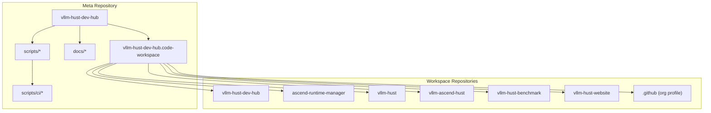
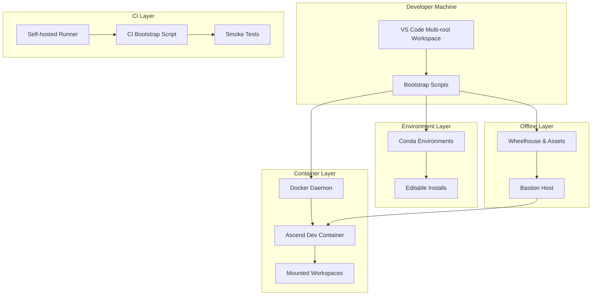
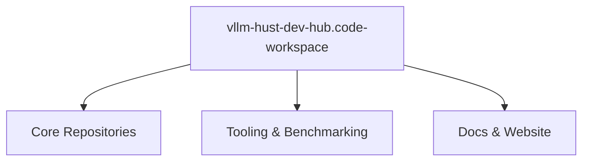
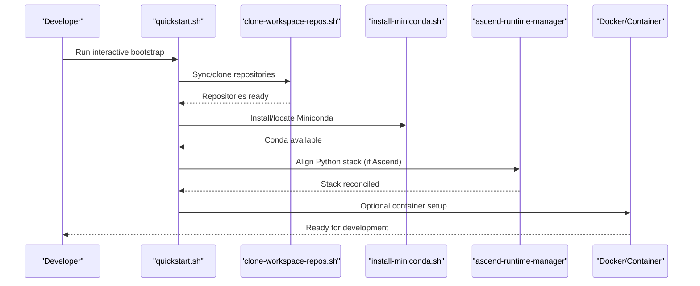
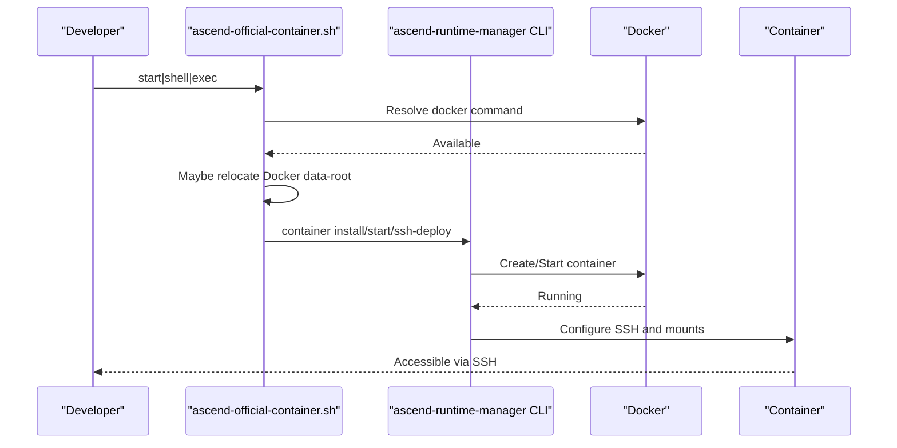
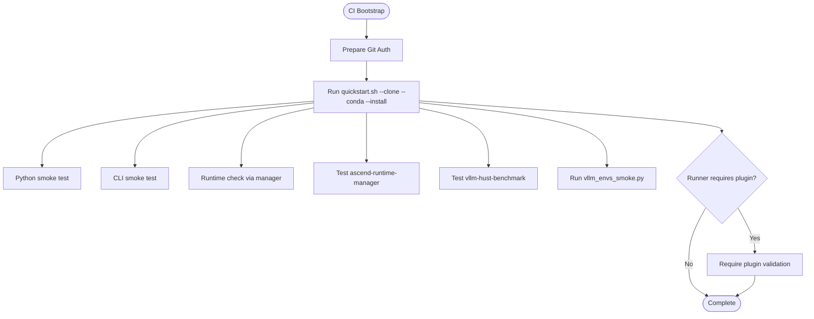
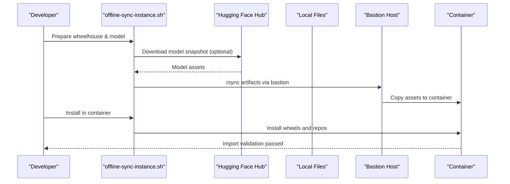
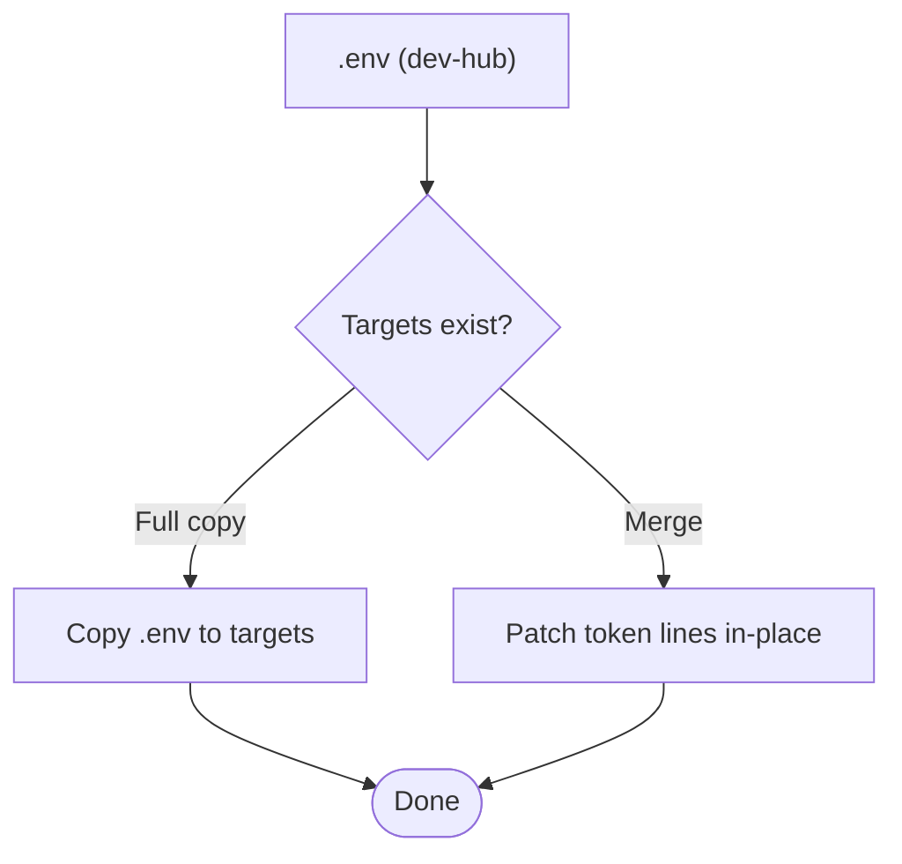
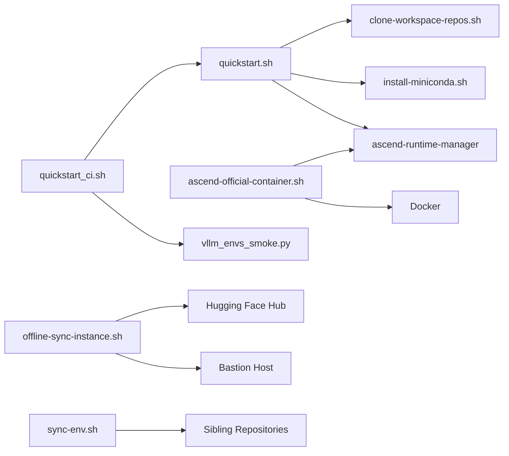
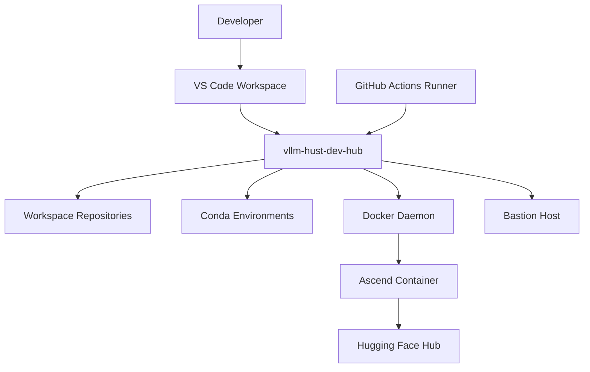

# Architecture Overview

<cite>
**Referenced Files in This Document**
- [README.md](file://README.md)
- [ROADMAP.md](file://ROADMAP.md)
- [vllm-hust-dev-hub.code-workspace](file://vllm-hust-dev-hub.code-workspace)
- [scripts/quickstart.sh](file://scripts/quickstart.sh)
- [scripts/ci/quickstart_ci.sh](file://scripts/ci/quickstart_ci.sh)
- [scripts/ci/vllm_envs_smoke.py](file://scripts/ci/vllm_envs_smoke.py)
- [scripts/clone-workspace-repos.sh](file://scripts/clone-workspace-repos.sh)
- [scripts/install-miniconda.sh](file://scripts/install-miniconda.sh)
- [scripts/ascend-official-container.sh](file://scripts/ascend-official-container.sh)
- [scripts/setup-github-actions-runner.sh](file://scripts/setup-github-actions-runner.sh)
- [scripts/offline-sync-instance.sh](file://scripts/offline-sync-instance.sh)
- [scripts/sync-env.sh](file://scripts/sync-env.sh)
- [docs/team-onboarding.md](file://docs/team-onboarding.md)
</cite>

## Table of Contents
1. [Introduction](#introduction)
2. [Project Structure](#project-structure)
3. [Core Components](#core-components)
4. [Architecture Overview](#architecture-overview)
5. [Detailed Component Analysis](#detailed-component-analysis)
6. [Dependency Analysis](#dependency-analysis)
7. [Performance Considerations](#performance-considerations)
8. [Troubleshooting Guide](#troubleshooting-guide)
9. [Conclusion](#conclusion)
10. [Appendices](#appendices)

## Introduction
This document describes the VLLM-HUST Development Hub system architecture. It explains how the meta repository orchestrates a multi-repository workspace, automates environment provisioning, integrates with containerized development, and coordinates CI/CD and offline deployment workflows. The design emphasizes:
- Lightweight orchestration via Bash/Python scripts
- User-space environment management with Conda
- Container-first development with Ascend runtime integration
- Reproducible CI bootstrapping and smoke testing
- Cross-cutting concerns: environment propagation, offline sync, and GitHub Actions runner management

## Project Structure
The repository is organized as a meta-layer that:
- Defines a VS Code multi-root workspace for related repositories
- Provides scripts for bootstrapping, environment setup, container orchestration, CI, and offline sync
- Documents onboarding and performance roadmap

**Diagram sources**
- [README.md:15-32](file://README.md#L15-L32)
- [vllm-hust-dev-hub.code-workspace](file://vllm-hust-dev-hub.code-workspace)

**Section sources**
- [README.md:34-49](file://README.md#L34-L49)
- [README.md:15-32](file://README.md#L15-L32)

## Core Components
- VS Code Workspace: Centralizes related repositories for unified editing and debugging.
- Bootstrap Scripts: Provide one-command workflows for repository synchronization, environment setup, and container orchestration.
- Environment Management: Conda-based user-space environment with editable installs and optional system-level alignment via Ascend runtime manager.
- Container Orchestration: Official Ascend container lifecycle management with SSH enablement and workspace mounting.
- CI/CD Integration: Automated CI bootstrap, smoke tests, and runner management.
- Offline Deployment: Wheelhouse and model asset preparation for air-gapped environments.
- Environment Propagation: Canonical .env token synchronization across sibling repositories.

**Section sources**
- [README.md:36-48](file://README.md#L36-L48)
- [scripts/quickstart.sh:112-135](file://scripts/quickstart.sh#L112-L135)
- [scripts/ascend-official-container.sh:108-217](file://scripts/ascend-official-container.sh#L108-L217)
- [scripts/ci/quickstart_ci.sh:232-321](file://scripts/ci/quickstart_ci.sh#L232-L321)
- [scripts/offline-sync-instance.sh:735-763](file://scripts/offline-sync-instance.sh#L735-L763)
- [scripts/sync-env.sh:19-37](file://scripts/sync-env.sh#L19-L37)

## Architecture Overview
The system follows a layered architecture:
- Meta Layer: Orchestrates repositories and workflows
- Environment Layer: Conda environments and editable installs
- Container Layer: Docker-based Ascend development instances
- CI Layer: Automated bootstrap and smoke testing
- Offline Layer: Preparing artifacts for air-gapped environments

**Diagram sources**
- [scripts/quickstart.sh:232-321](file://scripts/quickstart.sh#L232-L321)
- [scripts/ascend-official-container.sh:330-388](file://scripts/ascend-official-container.sh#L330-L388)
- [scripts/ci/quickstart_ci.sh:232-321](file://scripts/ci/quickstart_ci.sh#L232-L321)
- [scripts/offline-sync-instance.sh:735-763](file://scripts/offline-sync-instance.sh#L735-L763)

## Detailed Component Analysis

### VS Code Workspace Architecture
The workspace aggregates related repositories for unified development. It defines folder entries for core and supporting repositories, enabling shared debugging, linting, and navigation across the ecosystem.

**Diagram sources**
- [README.md:15-32](file://README.md#L15-L32)
- [README.md:36-48](file://README.md#L36-L48)

**Section sources**
- [README.md:35-48](file://README.md#L35-L48)

### Bootstrap and Environment Provisioning
The interactive bootstrap script coordinates repository synchronization, Conda environment creation, editable installs, and optional Ascend runtime alignment. It supports non-interactive modes and environment propagation hooks.

**Diagram sources**
- [scripts/quickstart.sh:232-321](file://scripts/quickstart.sh#L232-L321)
- [scripts/clone-workspace-repos.sh:406-466](file://scripts/clone-workspace-repos.sh#L406-L466)
- [scripts/install-miniconda.sh:132-169](file://scripts/install-miniconda.sh#L132-L169)
- [scripts/ascend-official-container.sh:330-388](file://scripts/ascend-official-container.sh#L330-L388)

**Section sources**
- [scripts/quickstart.sh:112-135](file://scripts/quickstart.sh#L112-L135)
- [scripts/quickstart.sh:771-793](file://scripts/quickstart.sh#L771-L793)
- [scripts/clone-workspace-repos.sh:406-466](file://scripts/clone-workspace-repos.sh#L406-L466)
- [scripts/install-miniconda.sh:132-169](file://scripts/install-miniconda.sh#L132-L169)

### Container Orchestration with Ascend Runtime Manager
The container script delegates to the Ascend runtime manager for container lifecycle, SSH enablement, and workspace mounting. It handles Docker data-root relocation and SSH key propagation.

**Diagram sources**
- [scripts/ascend-official-container.sh:46-58](file://scripts/ascend-official-container.sh#L46-L58)
- [scripts/ascend-official-container.sh:108-217](file://scripts/ascend-official-container.sh#L108-L217)
- [scripts/ascend-official-container.sh:330-388](file://scripts/ascend-official-container.sh#L330-L388)

**Section sources**
- [scripts/ascend-official-container.sh:108-217](file://scripts/ascend-official-container.sh#L108-L217)
- [scripts/ascend-official-container.sh:330-388](file://scripts/ascend-official-container.sh#L330-L388)

### CI/CD Integration
The CI bootstrap script automates environment creation, smoke tests, and plugin validation. It cleans up environments deterministically and produces structured results.

**Diagram sources**
- [scripts/ci/quickstart_ci.sh:232-321](file://scripts/ci/quickstart_ci.sh#L232-L321)
- [scripts/ci/vllm_envs_smoke.py:43-69](file://scripts/ci/vllm_envs_smoke.py#L43-L69)

**Section sources**
- [scripts/ci/quickstart_ci.sh:232-321](file://scripts/ci/quickstart_ci.sh#L232-L321)
- [scripts/ci/vllm_envs_smoke.py:1-69](file://scripts/ci/vllm_envs_smoke.py#L1-L69)

### Offline Deployment Workflow
The offline sync script prepares wheels and model assets locally, transfers them through a bastion host, and installs them inside the container without public network access.

**Diagram sources**
- [scripts/offline-sync-instance.sh:735-763](file://scripts/offline-sync-instance.sh#L735-L763)

**Section sources**
- [scripts/offline-sync-instance.sh:50-56](file://scripts/offline-sync-instance.sh#L50-L56)
- [scripts/offline-sync-instance.sh:735-763](file://scripts/offline-sync-instance.sh#L735-L763)

### Environment Propagation Across Repositories
The environment sync script propagates canonical tokens from the dev-hub .env to sibling repositories, performing either full copy or targeted token line merges.

**Diagram sources**
- [scripts/sync-env.sh:19-37](file://scripts/sync-env.sh#L19-L37)

**Section sources**
- [scripts/sync-env.sh:19-37](file://scripts/sync-env.sh#L19-L37)

## Dependency Analysis
High-level dependencies and interactions:
- quickstart.sh depends on clone-workspace-repos.sh, install-miniconda.sh, and optionally Ascend runtime manager for Python stack reconciliation.
- ascend-official-container.sh depends on Docker availability and Ascend runtime manager for container operations.
- CI bootstrap script depends on quickstart.sh and runs smoke tests and plugin checks.
- offline-sync-instance.sh depends on local Python tooling and Hugging Face Hub for artifact preparation.
- sync-env.sh depends on presence of sibling repositories and .env files.

**Diagram sources**
- [scripts/quickstart.sh:232-321](file://scripts/quickstart.sh#L232-L321)
- [scripts/ascend-official-container.sh:330-388](file://scripts/ascend-official-container.sh#L330-L388)
- [scripts/ci/quickstart_ci.sh:232-321](file://scripts/ci/quickstart_ci.sh#L232-L321)
- [scripts/offline-sync-instance.sh:735-763](file://scripts/offline-sync-instance.sh#L735-L763)
- [scripts/sync-env.sh:19-37](file://scripts/sync-env.sh#L19-L37)

**Section sources**
- [scripts/quickstart.sh:232-321](file://scripts/quickstart.sh#L232-L321)
- [scripts/ascend-official-container.sh:330-388](file://scripts/ascend-official-container.sh#L330-L388)
- [scripts/ci/quickstart_ci.sh:232-321](file://scripts/ci/quickstart_ci.sh#L232-L321)
- [scripts/offline-sync-instance.sh:735-763](file://scripts/offline-sync-instance.sh#L735-L763)
- [scripts/sync-env.sh:19-37](file://scripts/sync-env.sh#L19-L37)

## Performance Considerations
- Parallel repository cloning reduces bootstrap time.
- Deterministic CI cleanup and logging improve reliability.
- Offline sync minimizes network overhead and enables reproducible installs.
- Container data-root relocation prevents I/O bottlenecks and improves throughput.

[No sources needed since this section provides general guidance]

## Troubleshooting Guide
Common issues and resolutions:
- Conda environment conflicts: Use the reconcile and force reinstall flows in quickstart.
- SSH connectivity to container: Verify authorized keys propagation and SSH alias configuration.
- Docker data-root space: Allow automatic relocation to /data/docker when space is insufficient.
- CI bootstrap failures: Review structured results and logs generated by the CI bootstrap script.
- Environment token mismatches: Use sync-env.sh to propagate canonical tokens across repositories.

**Section sources**
- [scripts/quickstart.sh:771-793](file://scripts/quickstart.sh#L771-L793)
- [scripts/ascend-official-container.sh:108-217](file://scripts/ascend-official-container.sh#L108-L217)
- [scripts/ci/quickstart_ci.sh:128-131](file://scripts/ci/quickstart_ci.sh#L128-L131)
- [scripts/sync-env.sh:19-37](file://scripts/sync-env.sh#L19-L37)

## Conclusion
The VLLM-HUST Development Hub provides a cohesive, script-driven development environment that unifies repository management, environment provisioning, containerized Ascend development, CI automation, and offline deployment. Its design favors user-space operations, reproducibility, and operational simplicity, enabling efficient collaboration and continuous integration.

[No sources needed since this section summarizes without analyzing specific files]

## Appendices

### System Context Diagram
This diagram shows the relationships between the development environment, repositories, and external dependencies.

**Diagram sources**
- [README.md:15-32](file://README.md#L15-L32)
- [scripts/ascend-official-container.sh:330-388](file://scripts/ascend-official-container.sh#L330-L388)
- [scripts/offline-sync-instance.sh:735-763](file://scripts/offline-sync-instance.sh#L735-L763)
- [scripts/setup-github-actions-runner.sh:506-528](file://scripts/setup-github-actions-runner.sh#L506-L528)

### Technical Decisions and Trade-offs
- User-space only: quickstart.sh avoids system-level changes to maintain portability and safety.
- Deterministic CI: quickstart_ci.sh ensures reproducible environments and structured results.
- Offline-first: offline-sync-instance.sh removes reliance on public networks for deployments.
- Minimal coupling: Each script has a focused responsibility, reducing inter-script dependencies.

**Section sources**
- [README.md:154-156](file://README.md#L154-L156)
- [scripts/ci/quickstart_ci.sh:232-321](file://scripts/ci/quickstart_ci.sh#L232-L321)
- [scripts/offline-sync-instance.sh:735-763](file://scripts/offline-sync-instance.sh#L735-L763)