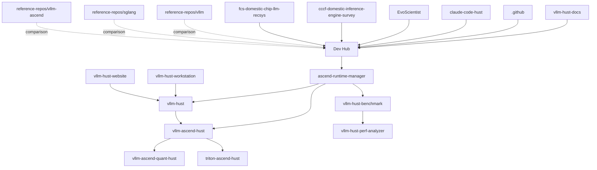

# Included Repositories

<cite>
**Referenced Files in This Document**
- [README.md](file://README.md)
- [vllm-hust-dev-hub.code-workspace](file://vllm-hust-dev-hub.code-workspace)
- [scripts/clone-workspace-repos.sh](file://scripts/clone-workspace-repos.sh)
- [scripts/quickstart.sh](file://scripts/quickstart.sh)
- [scripts/sync-env.sh](file://scripts/sync-env.sh)
- [docs/contribution-git-workflow.md](file://docs/contribution-git-workflow.md)
- [docs/team-onboarding.md](file://docs/team-onboarding.md)
- [ROADMAP.md](file://ROADMAP.md)
- [scripts/ci/quickstart_ci.sh](file://scripts/ci/quickstart_ci.sh)
</cite>

## Table of Contents
1. [Introduction](#introduction)
2. [Project Structure](#project-structure)
3. [Core Components](#core-components)
4. [Architecture Overview](#architecture-overview)
5. [Detailed Component Analysis](#detailed-component-analysis)
6. [Dependency Analysis](#dependency-analysis)
7. [Performance Considerations](#performance-considerations)
8. [Troubleshooting Guide](#troubleshooting-guide)
9. [Conclusion](#conclusion)
10. [Appendices](#appendices)

## Introduction
This document explains all repositories included in the VLLM-HUST Development Hub workspace. It distinguishes between core working repositories (used actively during development and debugging) and reference repositories (used for upstream comparisons). It documents the VS Code multi-root workspace structure, repository roles, dependencies, and typical workflows. Guidance is provided for adding new repositories to the workspace and managing repository relationships, with concrete examples drawn from the workspace configuration.

## Project Structure
The VLLM-HUST Development Hub organizes repositories into a VS Code multi-root workspace centered on the dev hub itself. The workspace includes:
- Core working repositories under the same parent directory as the dev hub
- Reference repositories under a dedicated directory for upstream comparisons
- Supporting scripts for bootstrapping, environment setup, and synchronization

```mermaid
graph TB
DevHub["Dev Hub<br/>vllm-hust-dev-hub.code-workspace"]
Docs["Docs<br/>vllm-hust-docs"]
OrgProfile["Org Profile<br/>.github"]
EngineVLLM["Engine<br/>vllm-hust"]
EngineAscend["Engine<br/>vllm-ascend-hust"]
EngineQuant["Engine<br/>vllm-ascend-quant-hust"]
TritonAscend["Engine<br/>triton-ascend-hust"]
RuntimeMgr["Tooling<br/>ascend-runtime-manager"]
Workstation["Web App<br/>vllm-hust-workstation"]
Website["Web Site<br/>vllm-hust-website"]
ClaudeCode["Tool<br/>claude-code-hust"]
Benchmark["Perf<br/>vllm-hust-benchmark"]
PerfAnalyzer["Perf<br/>vllm-hust-perf-analyzer"]
EvoScientist["Research<br/>EvoScientist"]
PaperCCCF["Paper<br/>cccf-domestic-inference-engine-survey"]
PaperFCS["Paper<br/>fcs-domestic-chip-llm-recsys"]
RefRepos["Reference Repos<br/>reference-repos"]
DevHub --- Docs
DevHub --- OrgProfile
DevHub --- EngineVLLM
DevHub --- EngineAscend
DevHub --- EngineQuant
DevHub --- TritonAscend
DevHub --- RuntimeMgr
DevHub --- Workstation
DevHub --- Website
DevHub --- ClaudeCode
DevHub --- Benchmark
DevHub --- PerfAnalyzer
DevHub --- EvoScientist
DevHub --- PaperCCCF
DevHub --- PaperFCS
DevHub --- RefRepos
```

**Diagram sources**
- [vllm-hust-dev-hub.code-workspace](file://vllm-hust-dev-hub.code-workspace)

**Section sources**
- [README.md](file://README.md)
- [vllm-hust-dev-hub.code-workspace](file://vllm-hust-dev-hub.code-workspace)

## Core Components
The workspace defines two primary categories of repositories:

- Core working repositories
  - Purpose: Active development, debugging, and iterative changes
  - Typical locations: Siblings of the dev hub under the same parent directory
  - Examples include engine implementations, tooling, web apps, benchmarking, and research artifacts

- Reference repositories
  - Purpose: Upstream comparisons and sync work
  - Location: Under a dedicated directory separate from core working repos
  - Not installed into the active development environment by default

Repository roles and relationships:
- Engine repositories: vllm-hust, vllm-ascend-hust, vllm-ascend-quant-hust, triton-ascend-hust
- Tooling and runtime: ascend-runtime-manager
- Web applications and site: vllm-hust-workstation, vllm-hust-website
- Documentation and org profile: vllm-hust-docs, .github
- Benchmarking and performance: vllm-hust-benchmark, vllm-hust-perf-analyzer
- Research and papers: EvoScientist, cccf-domestic-inference-engine-survey, fcs-domestic-chip-llm-recsys
- Reference upstreams: reference-repos/vllm, reference-repos/sglang, reference-repos/vllm-ascend

Typical workflows:
- Use the dev hub to bootstrap and synchronize repositories
- Use quickstart to create or update the conda environment and install core local repositories in editable mode
- Use the workspace to open related repositories together for cross-cutting development
- Use scripts to propagate environment tokens across sibling repositories

**Section sources**
- [README.md](file://README.md)
- [vllm-hust-dev-hub.code-workspace](file://vllm-hust-dev-hub.code-workspace)
- [scripts/clone-workspace-repos.sh](file://scripts/clone-workspace-repos.sh)
- [scripts/quickstart.sh](file://scripts/quickstart.sh)
- [scripts/sync-env.sh](file://scripts/sync-env.sh)

## Architecture Overview
The workspace architecture centers on the dev hub and orchestrates repository synchronization, environment setup, and optional containerized development. The diagram below maps the key components and their relationships.

```mermaid
graph TB
subgraph "Dev Hub"
WS["VS Code Multi-root Workspace"]
Clone["Clone Script"]
Quickstart["Quickstart Bootstrap"]
SyncEnv["Sync Env Tokens"]
end
subgraph "Core Working Repos"
VLLM["vllm-hust"]
Ascend["vllm-ascend-hust"]
Quant["vllm-ascend-quant-hust"]
Triton["triton-ascend-hust"]
Bench["vllm-hust-benchmark"]
Perf["vllm-hust-perf-analyzer"]
Docs["vllm-hust-docs"]
OrgProf[".github"]
Workstation["vllm-hust-workstation"]
Website["vllm-hust-website"]
Runtime["ascend-runtime-manager"]
Claude["claude-code-hust"]
Evo["EvoScientist"]
CCCF["cccf-domestic-inference-engine-survey"]
FCS["fcs-domestic-chip-llm-recsys"]
end
subgraph "Reference Repos"
RVLLM["reference-repos/vllm"]
RSG["reference-repos/sglang"]
RVAscend["reference-repos/vllm-ascend"]
end
WS --> Clone
WS --> Quickstart
WS --> SyncEnv
Clone --> VLLM
Clone --> Ascend
Clone --> Quant
Clone --> Triton
Clone --> Bench
Clone --> Perf
Clone --> Docs
Clone --> OrgProf
Clone --> Workstation
Clone --> Website
Clone --> Runtime
Clone --> Claude
Clone --> Evo
Clone --> CCCF
Clone --> FCS
Clone --> RVLLM
Clone --> RSG
Clone --> RVAscend
Quickstart --> VLLM
Quickstart --> Ascend
Quickstart --> Bench
Quickstart --> Runtime
Quickstart --> OrgProf
```

**Diagram sources**
- [vllm-hust-dev-hub.code-workspace](file://vllm-hust-dev-hub.code-workspace)
- [scripts/clone-workspace-repos.sh](file://scripts/clone-workspace-repos.sh)
- [scripts/quickstart.sh](file://scripts/quickstart.sh)

## Detailed Component Analysis

### VS Code Multi-root Workspace
The workspace file enumerates folders and sets common exclusions for caches and node_modules. It groups repositories by functional area using emoji prefixes to aid navigation.

Key characteristics:
- Central folder for the dev hub
- Core working repositories listed under sibling paths
- Reference repositories grouped under a dedicated directory
- Settings exclude common build artifacts and caches

Guidance for adding new repositories:
- Edit the workspace file and append a new folder entry with a descriptive name and path
- Place upstream reference repositories under the reference directory
- Keep core working repositories as siblings of the dev hub

**Section sources**
- [vllm-hust-dev-hub.code-workspace](file://vllm-hust-dev-hub.code-workspace)

### Repository Roles and Dependencies
Repositories are organized by role and interdependencies:

- Engine layer
  - vllm-hust: core engine
  - vllm-ascend-hust: Ascend-specific engine extension
  - vllm-ascend-quant-hust: Ascend quantization support
  - triton-ascend-hust: Triton kernels for Ascend
  - ascend-runtime-manager: Python stack alignment and runtime support

- Application and site layer
  - vllm-hust-workstation: web UI for interacting with the engine
  - vllm-hust-website: organizational website

- Tooling and benchmarking
  - vllm-hust-benchmark: performance benchmark suite
  - vllm-hust-perf-analyzer: performance analyzer
  - claude-code-hust: code assistance tool
  - EvoScientist: research tooling

- Documentation and governance
  - vllm-hust-docs: documentation
  - .github: organization profile repository

- Papers and surveys
  - cccf-domestic-inference-engine-survey
  - fcs-domestic-chip-llm-recsys

- Reference upstreams
  - reference-repos/vllm
  - reference-repos/sglang
  - reference-repos/vllm-ascend

Dependencies:
- Core engine repositories depend on ascend-runtime-manager for Python stack alignment
- Web applications depend on engine availability and environment configuration
- Benchmarking depends on engine and runtime repositories
- Reference repositories are used for upstream comparison and are not installed into the active environment

**Section sources**
- [README.md](file://README.md)
- [vllm-hust-dev-hub.code-workspace](file://vllm-hust-dev-hub.code-workspace)

### Typical Workflows
Common developer workflows supported by the workspace:

- One-command bootstrap
  - Clone common repositories in parallel
  - Create or update the conda environment
  - Install core local repositories in editable mode

- Environment token propagation
  - Sync canonical tokens from the dev hub to sibling repositories
  - Apply full copy or targeted token patching depending on repository needs

- Upstream comparison
  - Use reference repositories for upstream sync and comparison
  - Keep them separate from the active development environment

- Containerized development
  - Use container scripts to create and connect to an official Ascend container
  - Mount the workspace parent directory into the container for seamless access

**Section sources**
- [scripts/clone-workspace-repos.sh](file://scripts/clone-workspace-repos.sh)
- [scripts/quickstart.sh](file://scripts/quickstart.sh)
- [scripts/sync-env.sh](file://scripts/sync-env.sh)
- [README.md](file://README.md)

### Adding New Repositories to the Workspace
Steps to add a new repository:
1. Clone or place the repository as a sibling of the dev hub under the same parent directory
2. Open the workspace file and add a new folder entry with:
   - A descriptive name (optionally prefixed for grouping)
   - The relative path to the repository
3. Save the workspace file; the repository appears in the Explorer

Guidelines:
- Place upstream reference repositories under the reference directory
- Keep core working repositories as siblings of the dev hub
- Use consistent naming and grouping prefixes for discoverability

**Section sources**
- [vllm-hust-dev-hub.code-workspace](file://vllm-hust-dev-hub.code-workspace)
- [README.md](file://README.md)

### Managing Repository Relationships
Managing relationships across repositories:
- Use the dev hub to synchronize repositories and maintain consistent paths
- Propagate environment tokens to sibling repositories using the sync script
- Keep upstream reference repositories isolated from the active environment
- Coordinate installation scopes (core vs full) when refreshing editable installs

**Section sources**
- [scripts/sync-env.sh](file://scripts/sync-env.sh)
- [scripts/quickstart.sh](file://scripts/quickstart.sh)
- [README.md](file://README.md)

## Dependency Analysis
The following diagram illustrates the primary dependencies among core working repositories and their relationship to the dev hub and reference repositories.

**Diagram sources**
- [vllm-hust-dev-hub.code-workspace](file://vllm-hust-dev-hub.code-workspace)
- [scripts/quickstart.sh](file://scripts/quickstart.sh)

**Section sources**
- [vllm-hust-dev-hub.code-workspace](file://vllm-hust-dev-hub.code-workspace)
- [scripts/quickstart.sh](file://scripts/quickstart.sh)

## Performance Considerations
- Parallel repository cloning reduces bootstrap time
- Editable installs enable rapid iteration without rebuilding packages
- Containerized development ensures consistent environments across machines
- Reference repositories are excluded from the active environment to minimize overhead

[No sources needed since this section provides general guidance]

## Troubleshooting Guide
Common issues and resolutions:
- Dirty work tree: Always develop on feature branches; keep main clean and synchronized
- Incorrect PR target: Use safe PR creation methods to ensure targeting the organization repository
- SSH connectivity to containers: Configure SSH aliases with ProxyJump for reliable access
- Upstream branch conflicts: Rebase feature branches onto the latest main to avoid conflicts
- Environment token mismatches: Use the sync script to propagate tokens consistently across sibling repositories

**Section sources**
- [docs/contribution-git-workflow.md](file://docs/contribution-git-workflow.md)
- [docs/team-onboarding.md](file://docs/team-onboarding.md)
- [scripts/sync-env.sh](file://scripts/sync-env.sh)

## Conclusion
The VLLM-HUST Development Hub workspace provides a structured, multi-repository environment for engine development, tooling, web applications, benchmarking, and research. By separating core working repositories from reference repositories and organizing them in a VS Code multi-root workspace, teams can streamline collaboration, maintain consistent environments, and efficiently manage upstream comparisons. The included scripts automate bootstrap, environment setup, and token synchronization, enabling reproducible workflows across diverse development scenarios.

[No sources needed since this section summarizes without analyzing specific files]

## Appendices

### Appendix A: Repository Categories and Examples
- Core working repositories
  - Engines: vllm-hust, vllm-ascend-hust, vllm-ascend-quant-hust, triton-ascend-hust
  - Tooling: ascend-runtime-manager
  - Applications: vllm-hust-workstation, vllm-hust-website
  - Documentation: vllm-hust-docs
  - Governance: .github
  - Benchmarking: vllm-hust-benchmark, vllm-hust-perf-analyzer
  - Research: EvoScientist
  - Papers: cccf-domestic-inference-engine-survey, fcs-domestic-chip-llm-recsys
- Reference repositories
  - Upstream comparisons: reference-repos/vllm, reference-repos/sglang, reference-repos/vllm-ascend

**Section sources**
- [README.md](file://README.md)
- [vllm-hust-dev-hub.code-workspace](file://vllm-hust-dev-hub.code-workspace)

### Appendix B: Quickstart and CI Integration
- Quickstart integrates repository cloning, environment setup, and editable installs
- CI scripts support automated bootstrap and environment cleanup
- Runner configuration supports self-hosted runners with user-level services

**Section sources**
- [scripts/quickstart.sh](file://scripts/quickstart.sh)
- [scripts/ci/quickstart_ci.sh](file://scripts/ci/quickstart_ci.sh)
- [docs/github-actions-self-hosted-runner.md](file://docs/github-actions-self-hosted-runner.md)