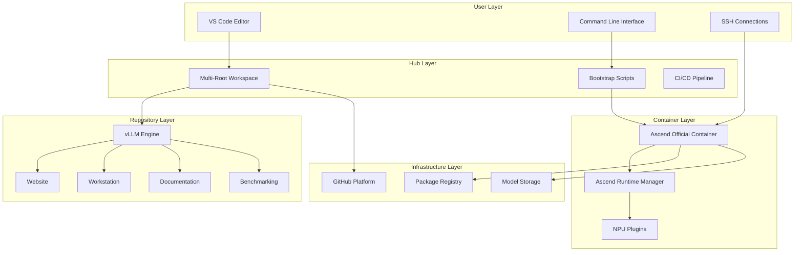
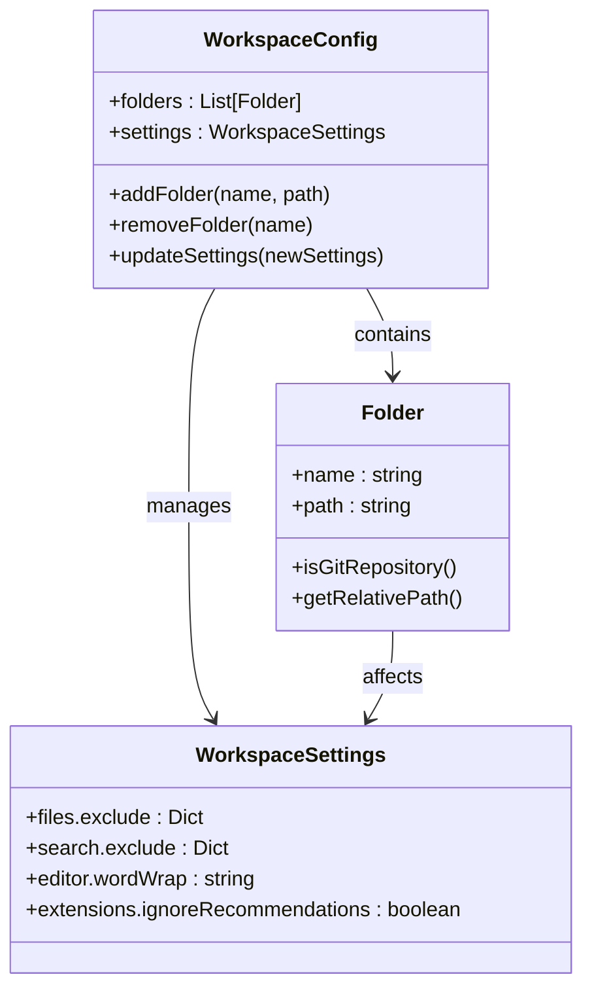
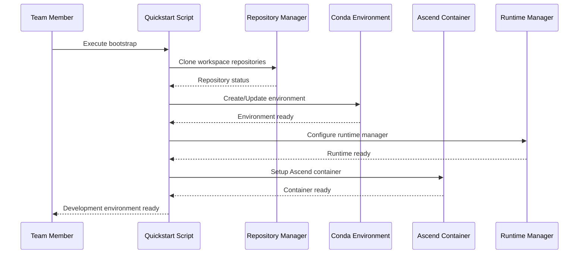
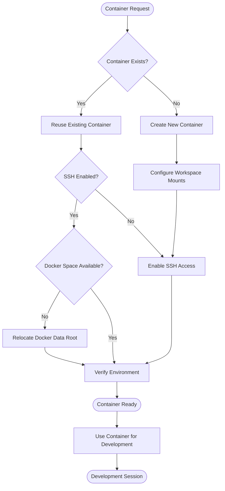
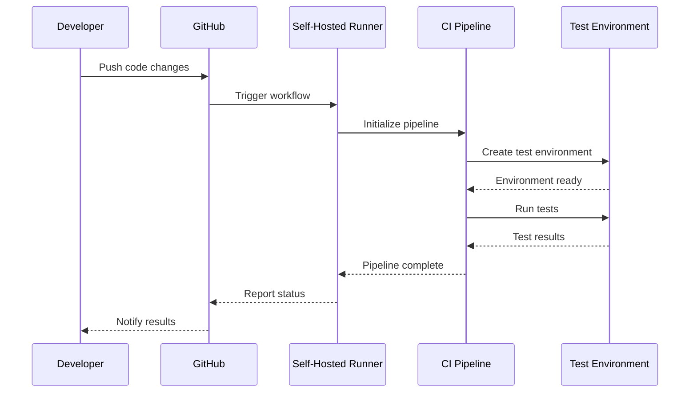
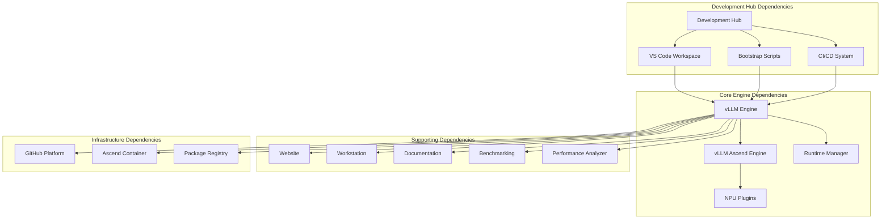

# Introduction and Purpose

<cite>
**Referenced Files in This Document**
- [README.md](file://README.md)
- [ROADMAP.md](file://ROADMAP.md)
- [vllm-hust-dev-hub.code-workspace](file://vllm-hust-dev-hub.code-workspace)
- [docs/team-onboarding.md](file://docs/team-onboarding.md)
- [docs/github-actions-self-hosted-runner.md](file://docs/github-actions-self-hosted-runner.md)
- [scripts/quickstart.sh](file://scripts/quickstart.sh)
- [scripts/ascend-official-container.sh](file://scripts/ascend-official-container.sh)
- [scripts/clone-workspace-repos.sh](file://scripts/clone-workspace-repos.sh)
- [scripts/setup-github-actions-runner.sh](file://scripts/setup-github-actions-runner.sh)
- [scripts/ci/quickstart_ci.sh](file://scripts/ci/quickstart_ci.sh)
- [Ascend-Machine/HARDWARE_REPORT_20260407.md](file://Ascend-Machine/HARDWARE_REPORT_20260407.md)
</cite>

## Table of Contents
1. [Introduction](#introduction)
2. [Project Structure](#project-structure)
3. [Core Components](#core-components)
4. [Architecture Overview](#architecture-overview)
5. [Detailed Component Analysis](#detailed-component-analysis)
6. [Dependency Analysis](#dependency-analysis)
7. [Performance Considerations](#performance-considerations)
8. [Troubleshooting Guide](#troubleshooting-guide)
9. [Conclusion](#conclusion)

## Introduction
The VLLM-HUST Development Hub is a lightweight meta repository designed to streamline daily development workflows for the VLLM-HUST team. Its primary purpose is to serve as a centralized development environment management system that coordinates multiple related repositories and simplifies complex development scenarios—especially for Ascend NPU hardware acceleration projects.

The hub consolidates commonly used repositories into a single VS Code multi-root workspace, provides automated bootstrap scripts for rapid environment setup, and offers specialized tooling for Ascend containerized development. It focuses on Ascend NPU hardware acceleration by integrating with the Ascend runtime manager, official Ascend containers, and performance benchmarking infrastructure.

Key benefits for development efficiency include:
- Single-command bootstrap that clones repositories, sets up conda environments, and configures development tools
- Centralized workspace management through VS Code multi-root workspaces
- Automated container orchestration for Ascend development environments
- Integrated CI/CD capabilities with self-hosted GitHub Actions runners
- Performance monitoring and benchmarking infrastructure for Ascend hardware
- Streamlined team onboarding with standardized workflows

## Project Structure
The development hub organizes related repositories into a cohesive workspace structure:

```mermaid
graph TB
subgraph "Development Hub Root"
Hub[vllm-hust-dev-hub]
Docs[docs/]
Scripts[scripts/]
Ascend[Ascend-Machine/]
Tests[tests/]
end
subgraph "Workspace Repositories"
Engine[vllm-hust]
AscendEngine[vllm-ascend-hust]
QuantEngine[vllm-ascend-quant-hust]
Runtime[ascend-runtime-manager]
Website[vllm-hust-website]
Workstation[vllm-hust-workstation]
DocsRepo[vllm-hust-docs]
Benchmark[vllm-hust-benchmark]
PerfAnalyzer[vllm-hust-perf-analyzer]
OrgProfile[vllm-hust-org-profile]
Reference[reference-repos/]
end
subgraph "CI/CD Infrastructure"
CI[scripts/ci/]
Workflows[.github/workflows/]
Agents[.github/agents/]
Instructions[.github/instructions/]
end
Hub --> Engine
Hub --> AscendEngine
Hub --> QuantEngine
Hub --> Runtime
Hub --> Website
Hub --> Workstation
Hub --> DocsRepo
Hub --> Benchmark
Hub --> PerfAnalyzer
Hub --> OrgProfile
Hub --> Reference
Hub --> CI
Hub --> Workflows
Hub --> Agents
Hub --> Instructions
```

**Diagram sources**
- [vllm-hust-dev-hub.code-workspace:1-91](file://vllm-hust-dev-hub.code-workspace#L1-L91)
- [README.md:15-33](file://README.md#L15-L33)

The structure follows a feature-based organization where each major component (engine, runtime, website, workstation, documentation, benchmarking, etc.) is maintained as a separate repository but coordinated through the development hub.

**Section sources**
- [README.md:15-33](file://README.md#L15-L33)
- [vllm-hust-dev-hub.code-workspace:1-91](file://vllm-hust-dev-hub.code-workspace#L1-L91)

## Core Components
The development hub consists of several interconnected components that work together to provide a comprehensive development environment:

### VS Code Multi-Root Workspace
The central coordination point is the VS Code multi-root workspace configuration that groups related repositories for unified editing and navigation. The workspace includes both core engine repositories and supporting infrastructure.

### Bootstrap and Environment Management
The quickstart script provides an interactive one-command solution for setting up the complete development environment, including repository cloning, conda environment creation, and container configuration.

### Ascend-NPU Specific Tooling
Specialized scripts handle Ascend container orchestration, SSH configuration, and runtime environment management for NPU-accelerated development.

### CI/CD Integration
Self-hosted GitHub Actions runners enable automated testing and deployment workflows with proper authentication and environment isolation.

**Section sources**
- [README.md:34-50](file://README.md#L34-L50)
- [scripts/quickstart.sh:1-200](file://scripts/quickstart.sh#L1-L200)
- [scripts/ascend-official-container.sh:1-200](file://scripts/ascend-official-container.sh#L1-L200)

## Architecture Overview
The development hub implements a layered architecture that separates concerns between environment management, repository coordination, and specialized tooling:

**Diagram sources**
- [scripts/quickstart.sh:1-200](file://scripts/quickstart.sh#L1-L200)
- [scripts/ascend-official-container.sh:1-200](file://scripts/ascend-official-container.sh#L1-L200)
- [vllm-hust-dev-hub.code-workspace:1-91](file://vllm-hust-dev-hub.code-workspace#L1-L91)

The architecture emphasizes modularity and separation of concerns, allowing teams to develop across multiple repositories while maintaining consistent environments and workflows.

## Detailed Component Analysis

### VS Code Multi-Root Workspace
The workspace configuration serves as the central coordination point for all related repositories, providing unified navigation and development capabilities.

**Diagram sources**
- [vllm-hust-dev-hub.code-workspace:1-91](file://vllm-hust-dev-hub.code-workspace#L1-L91)

The workspace includes folders for core engine repositories, supporting infrastructure, documentation, and research projects, all organized with meaningful naming conventions that indicate their purpose and scope.

**Section sources**
- [vllm-hust-dev-hub.code-workspace:1-91](file://vllm-hust-dev-hub.code-workspace#L1-L91)

### Bootstrap and Environment Management
The quickstart script orchestrates the complete development environment setup through a series of coordinated steps:

**Diagram sources**
- [scripts/quickstart.sh:1-200](file://scripts/quickstart.sh#L1-L200)
- [scripts/clone-workspace-repos.sh:1-200](file://scripts/clone-workspace-repos.sh#L1-L200)

The bootstrap process handles repository synchronization, environment creation, and container setup with intelligent defaults and user-friendly prompts.

**Section sources**
- [scripts/quickstart.sh:1-200](file://scripts/quickstart.sh#L1-L200)
- [scripts/clone-workspace-repos.sh:1-200](file://scripts/clone-workspace-repos.sh#L1-L200)

### Ascend Container Orchestration
The Ascend container management system provides seamless integration between host development environments and NPU-accelerated containers:

**Diagram sources**
- [scripts/ascend-official-container.sh:1-200](file://scripts/ascend-official-container.sh#L1-L200)

The container orchestration system automatically handles workspace mounting, SSH configuration, and resource management for Ascend development environments.

**Section sources**
- [scripts/ascend-official-container.sh:1-200](file://scripts/ascend-official-container.sh#L1-L200)

### CI/CD Integration
The development hub integrates with GitHub Actions for automated testing and deployment workflows:

**Diagram sources**
- [scripts/ci/quickstart_ci.sh:1-321](file://scripts/ci/quickstart_ci.sh#L1-L321)
- [scripts/setup-github-actions-runner.sh:1-200](file://scripts/setup-github-actions-runner.sh#L1-L200)

The CI system provides automated testing with proper environment isolation and reporting capabilities.

**Section sources**
- [scripts/ci/quickstart_ci.sh:1-321](file://scripts/ci/quickstart_ci.sh#L1-L321)
- [scripts/setup-github-actions-runner.sh:1-200](file://scripts/setup-github-actions-runner.sh#L1-L200)

## Dependency Analysis
The development hub maintains dependencies between components while preserving modularity and independence:

**Diagram sources**
- [README.md:15-33](file://README.md#L15-L33)
- [vllm-hust-dev-hub.code-workspace:1-91](file://vllm-hust-dev-hub.code-workspace#L1-L91)

The dependency graph shows how the development hub coordinates multiple repositories while maintaining clear boundaries between core engine functionality and supporting infrastructure.

**Section sources**
- [README.md:15-33](file://README.md#L15-L33)
- [vllm-hust-dev-hub.code-workspace:1-91](file://vllm-hust-dev-hub.code-workspace#L1-L91)

## Performance Considerations
The development hub incorporates several performance optimization strategies for Ascend NPU development:

### Hardware-Aware Configuration
The system includes comprehensive hardware reporting and performance benchmarking capabilities for Ascend hardware:

- Detailed hardware specifications and performance characteristics
- Bandwidth testing for NPU-to-host communication
- Collective communication performance measurements
- Memory and storage performance analysis

### Container Optimization
The container orchestration system includes automatic optimization for resource allocation and performance:

- Automatic Docker data root relocation for optimal storage performance
- Efficient workspace mounting strategies
- SSH connection optimization for remote development
- Resource-aware container sizing and configuration

### Development Workflow Optimization
The hub streamlines development workflows to minimize overhead and maximize productivity:

- Parallel repository cloning for faster setup
- Incremental environment updates for reduced rebuild times
- Intelligent caching and artifact management
- Optimized CI/CD pipeline execution

**Section sources**
- [Ascend-Machine/HARDWARE_REPORT_20260407.md:1-215](file://Ascend-Machine/HARDWARE_REPORT_20260407.md#L1-L215)

## Troubleshooting Guide
Common issues and their solutions when working with the development hub:

### Environment Setup Issues
- **Conda environment conflicts**: Use the refresh mode to reinstall local repositories without recreating the environment
- **Missing system dependencies**: The bootstrap script automatically installs required system packages
- **Python path issues**: The system automatically handles library path configuration during environment activation

### Container and SSH Issues
- **Container startup failures**: Check Docker daemon status and available disk space
- **SSH connection problems**: Verify SSH keys and authorized_keys configuration
- **Workspace mounting issues**: Ensure proper directory permissions and mount points

### Performance Issues
- **Slow repository cloning**: Adjust parallelism with CLONE_JOBS environment variable
- **Memory pressure in containers**: Monitor container resource limits and adjust accordingly
- **Network connectivity issues**: Verify proxy settings and firewall configurations

### CI/CD Issues
- **Runner registration failures**: Check GitHub token validity and network connectivity
- **Environment isolation problems**: Verify conda environment configuration and package isolation
- **Test execution timeouts**: Review test suite configuration and resource allocation

**Section sources**
- [docs/team-onboarding.md:336-384](file://docs/team-onboarding.md#L336-L384)
- [scripts/quickstart.sh:1-200](file://scripts/quickstart.sh#L1-L200)

## Conclusion
The VLLM-HUST Development Hub serves as a comprehensive solution for managing complex development environments focused on Ascend NPU hardware acceleration. By providing centralized workspace management, automated environment setup, and specialized tooling for containerized development, it significantly reduces the complexity of coordinating multiple repositories and streamlines team collaboration.

The hub's architecture enables efficient development workflows while maintaining flexibility for different project requirements. Its emphasis on automation, standardization, and performance optimization makes it an essential tool for VLLM-HUST team members working on cutting-edge AI inference systems with Ascend hardware acceleration.

Through its integration of VS Code workspace management, automated bootstrap scripts, Ascend container orchestration, and CI/CD capabilities, the development hub creates a unified development experience that scales from individual contributions to large-scale collaborative projects.