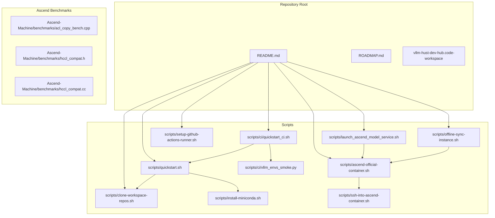
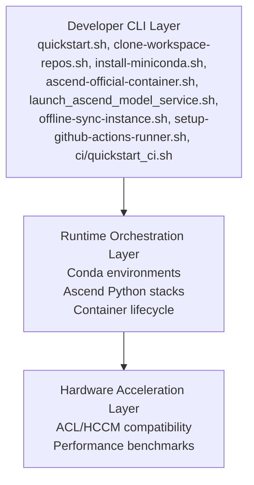
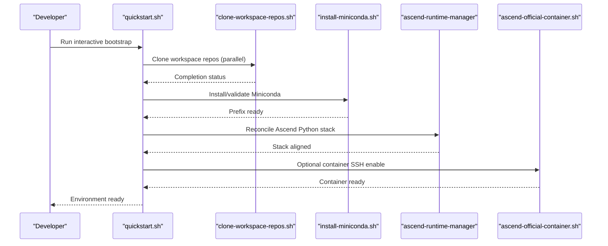
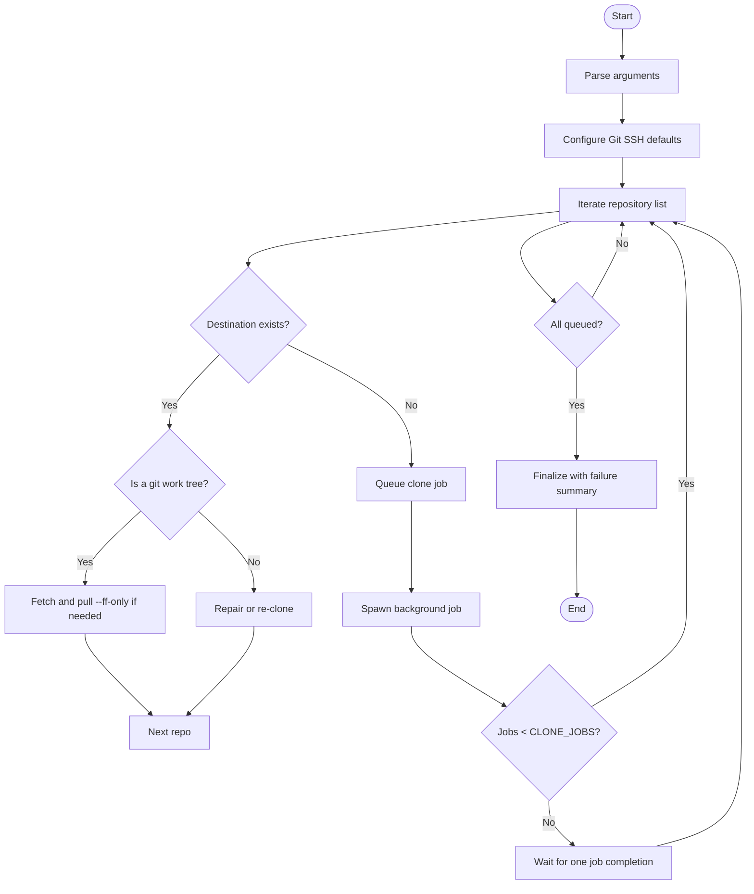
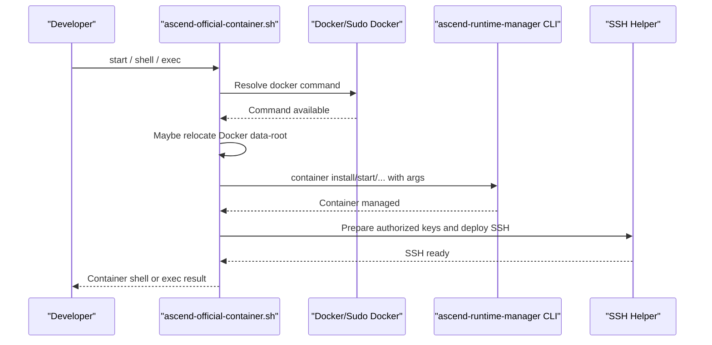
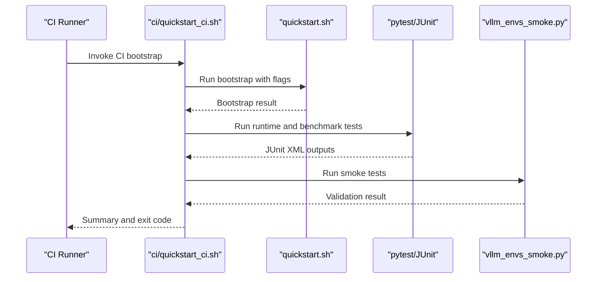
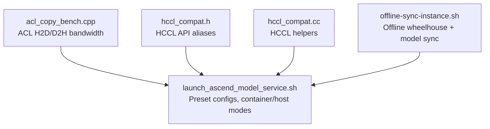
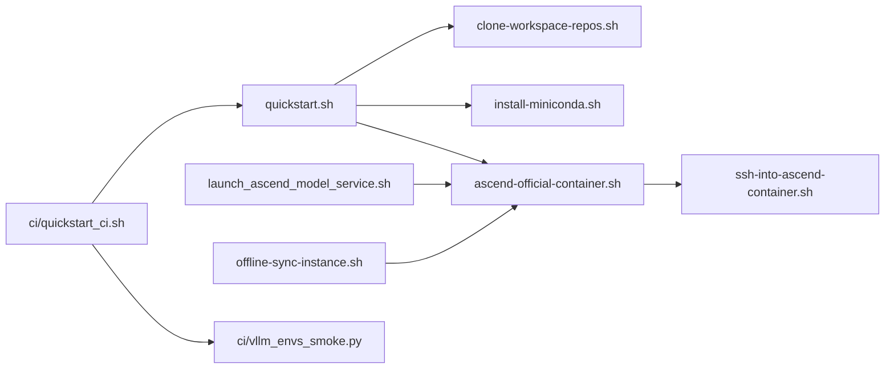

# Key Features and Capabilities

<cite>
**Referenced Files in This Document**
- [README.md](file://README.md)
- [ROADMAP.md](file://ROADMAP.md)
- [scripts/quickstart.sh](file://scripts/quickstart.sh)
- [scripts/clone-workspace-repos.sh](file://scripts/clone-workspace-repos.sh)
- [scripts/install-miniconda.sh](file://scripts/install-miniconda.sh)
- [scripts/ascend-official-container.sh](file://scripts/ascend-official-container.sh)
- [scripts/ssh-into-ascend-container.sh](file://scripts/ssh-into-ascend-container.sh)
- [scripts/launch_ascend_model_service.sh](file://scripts/launch_ascend_model_service.sh)
- [scripts/offline-sync-instance.sh](file://scripts/offline-sync-instance.sh)
- [scripts/setup-github-actions-runner.sh](file://scripts/setup-github-actions-runner.sh)
- [scripts/ci/quickstart_ci.sh](file://scripts/ci/quickstart_ci.sh)
- [scripts/ci/vllm_envs_smoke.py](file://scripts/ci/vllm_envs_smoke.py)
- [Ascend-Machine/benchmarks/acl_copy_bench.cpp](file://Ascend-Machine/benchmarks/acl_copy_bench.cpp)
- [Ascend-Machine/benchmarks/hccl_compat.cc](file://Ascend-Machine/benchmarks/hccl_compat.cc)
- [Ascend-Machine/benchmarks/hccl_compat.h](file://Ascend-Machine/benchmarks/hccl_compat.h)
</cite>

## Table of Contents
1. [Introduction](#introduction)
2. [Project Structure](#project-structure)
3. [Core Components](#core-components)
4. [Architecture Overview](#architecture-overview)
5. [Detailed Component Analysis](#detailed-component-analysis)
6. [Dependency Analysis](#dependency-analysis)
7. [Performance Considerations](#performance-considerations)
8. [Troubleshooting Guide](#troubleshooting-guide)
9. [Conclusion](#conclusion)
10. [Appendices](#appendices)

## Introduction
The VLLM-HUST Development Hub is a streamlined meta repository and automation toolkit designed to accelerate development, testing, and deployment of vLLM-based projects on Ascend NPUs. It centralizes developer workflows through:
- An interactive bootstrap system for rapid environment setup
- Parallel repository cloning for efficient workspace bootstrapping
- Conda environment management with Ascend-aware Python stacks
- Container orchestration for reproducible Ascend development
- CI/CD integration for automated validation
- Performance optimization tools and benchmarks for Ascend hardware

These capabilities collectively improve development efficiency, reduce onboarding friction, and standardize Ascend NPU workflows across teams.

## Project Structure
The repository organizes developer tools and documentation into focused areas:
- scripts/: Bootstrap, environment, container, CI/CD, and Ascend utilities
- Ascend-Machine/: Hardware-specific benchmarks and compatibility helpers
- docs/: Team onboarding and operational guidance
- Root-level configuration and documentation (README, ROADMAP)

**Diagram sources**
- [README.md](file://README.md)
- [scripts/quickstart.sh](file://scripts/quickstart.sh)
- [scripts/clone-workspace-repos.sh](file://scripts/clone-workspace-repos.sh)
- [scripts/install-miniconda.sh](file://scripts/install-miniconda.sh)
- [scripts/ascend-official-container.sh](file://scripts/ascend-official-container.sh)
- [scripts/ssh-into-ascend-container.sh](file://scripts/ssh-into-ascend-container.sh)
- [scripts/launch_ascend_model_service.sh](file://scripts/launch_ascend_model_service.sh)
- [scripts/offline-sync-instance.sh](file://scripts/offline-sync-instance.sh)
- [scripts/setup-github-actions-runner.sh](file://scripts/setup-github-actions-runner.sh)
- [scripts/ci/quickstart_ci.sh](file://scripts/ci/quickstart_ci.sh)
- [scripts/ci/vllm_envs_smoke.py](file://scripts/ci/vllm_envs_smoke.py)
- [Ascend-Machine/benchmarks/acl_copy_bench.cpp](file://Ascend-Machine/benchmarks/acl_copy_bench.cpp)
- [Ascend-Machine/benchmarks/hccl_compat.h](file://Ascend-Machine/benchmarks/hccl_compat.h)
- [Ascend-Machine/benchmarks/hccl_compat.cc](file://Ascend-Machine/benchmarks/hccl_compat.cc)

**Section sources**
- [README.md](file://README.md)

## Core Components
- Interactive Bootstrap System: One-command setup for repositories, conda environment, and container SSH, with Ascend-aware defaults and optional manager-driven runtime reconciliation.
- Parallel Repository Cloning: Efficiently clones multiple repositories concurrently with robust retry, fallback, and safety checks.
- Conda Environment Management: Robust environment creation, dependency reconciliation, and Ascend Python stack alignment.
- Container Orchestration: Automated container lifecycle, SSH enablement, workspace mounting, and device/data-root management.
- CI/CD Pipeline Integration: CI-optimized bootstrap, smoke tests, and JUnit reporting for Ascend-enabled runners.
- Performance Optimization Tools: Benchmarks and compatibility shims for ACL/HCCM paths and Ascend NPU performance tuning.

**Section sources**
- [README.md](file://README.md)
- [scripts/quickstart.sh](file://scripts/quickstart.sh)
- [scripts/clone-workspace-repos.sh](file://scripts/clone-workspace-repos.sh)
- [scripts/install-miniconda.sh](file://scripts/install-miniconda.sh)
- [scripts/ascend-official-container.sh](file://scripts/ascend-official-container.sh)
- [scripts/launch_ascend_model_service.sh](file://scripts/launch_ascend_model_service.sh)
- [scripts/offline-sync-instance.sh](file://scripts/offline-sync-instance.sh)
- [scripts/setup-github-actions-runner.sh](file://scripts/setup-github-actions-runner.sh)
- [scripts/ci/quickstart_ci.sh](file://scripts/ci/quickstart_ci.sh)
- [Ascend-Machine/benchmarks/acl_copy_bench.cpp](file://Ascend-Machine/benchmarks/acl_copy_bench.cpp)
- [Ascend-Machine/benchmarks/hccl_compat.h](file://Ascend-Machine/benchmarks/hccl_compat.h)
- [Ascend-Machine/benchmarks/hccl_compat.cc](file://Ascend-Machine/benchmarks/hccl_compat.cc)

## Architecture Overview
The hub orchestrates developer workflows across three layers:
- Developer CLI Layer: Scripts for bootstrap, environment, container, and CI tasks
- Runtime Orchestration Layer: Conda environments, Ascend Python stacks, and containerized development
- Hardware Acceleration Layer: Ascend NPU runtime, ACL/HCCM compatibility, and performance benchmarks

**Diagram sources**
- [scripts/quickstart.sh](file://scripts/quickstart.sh)
- [scripts/clone-workspace-repos.sh](file://scripts/clone-workspace-repos.sh)
- [scripts/install-miniconda.sh](file://scripts/install-miniconda.sh)
- [scripts/ascend-official-container.sh](file://scripts/ascend-official-container.sh)
- [scripts/launch_ascend_model_service.sh](file://scripts/launch_ascend_model_service.sh)
- [scripts/offline-sync-instance.sh](file://scripts/offline-sync-instance.sh)
- [scripts/setup-github-actions-runner.sh](file://scripts/setup-github-actions-runner.sh)
- [scripts/ci/quickstart_ci.sh](file://scripts/ci/quickstart_ci.sh)
- [Ascend-Machine/benchmarks/acl_copy_bench.cpp](file://Ascend-Machine/benchmarks/acl_copy_bench.cpp)
- [Ascend-Machine/benchmarks/hccl_compat.h](file://Ascend-Machine/benchmarks/hccl_compat.h)
- [Ascend-Machine/benchmarks/hccl_compat.cc](file://Ascend-Machine/benchmarks/hccl_compat.cc)

## Detailed Component Analysis

### Interactive Bootstrap System
The interactive bootstrap consolidates repository cloning, conda environment setup, and container SSH configuration into a single workflow. It detects Ascend toolkits, reconciles Python stacks, and optionally integrates with the Ascend runtime manager for device-aligned environments.

**Diagram sources**
- [scripts/quickstart.sh](file://scripts/quickstart.sh)
- [scripts/clone-workspace-repos.sh](file://scripts/clone-workspace-repos.sh)
- [scripts/install-miniconda.sh](file://scripts/install-miniconda.sh)
- [scripts/ascend-official-container.sh](file://scripts/ascend-official-container.sh)

Practical usage examples:
- One-command bootstrap: [README.md](file://README.md)
- Conda-only setup with custom env and Python: [README.md](file://README.md)
- Interactive menu option 6 for container workflow: [README.md](file://README.md)

**Section sources**
- [README.md](file://README.md)
- [scripts/quickstart.sh](file://scripts/quickstart.sh)
- [scripts/clone-workspace-repos.sh](file://scripts/clone-workspace-repos.sh)
- [scripts/install-miniconda.sh](file://scripts/install-miniconda.sh)

### Parallel Repository Cloning
The parallel clone script accelerates workspace bootstrapping by cloning multiple repositories concurrently, with robust retry, fallback, and safety checks for existing destinations.

**Diagram sources**
- [scripts/clone-workspace-repos.sh](file://scripts/clone-workspace-repos.sh)

Practical usage examples:
- Parallel clone with configurable concurrency: [README.md](file://README.md)
- Non-interactive clone with yes flag: [README.md](file://README.md)

**Section sources**
- [scripts/clone-workspace-repos.sh](file://scripts/clone-workspace-repos.sh)
- [README.md](file://README.md)

### Conda Environment Management
The environment management system creates and maintains a deterministic Python environment tailored for Ascend development, including Ascend-compatible torch stacks and optional editable installs of sibling repositories.

Key capabilities:
- Environment creation and isolation
- Ascend Python stack reconciliation via the runtime manager
- Editable installs of core repositories
- Ascend plugin and kernel mode controls
- Mirror and channel configuration for reliable installs

Practical usage examples:
- Install-only mode to refresh editable installs: [README.md](file://README.md)
- Refresh core repos without recloning: [README.md](file://README.md)
- Ascend lightweight plugin mode: [README.md](file://README.md)

**Section sources**
- [scripts/quickstart.sh](file://scripts/quickstart.sh)
- [scripts/install-miniconda.sh](file://scripts/install-miniconda.sh)
- [README.md](file://README.md)

### Container Orchestration
The container orchestration tool automates the lifecycle of an official Ascend development container, including SSH enablement, workspace mounting, and device/data-root management.

**Diagram sources**
- [scripts/ascend-official-container.sh](file://scripts/ascend-official-container.sh)
- [scripts/ssh-into-ascend-container.sh](file://scripts/ssh-into-ascend-container.sh)

Practical usage examples:
- Start container and drop into shell: [README.md](file://README.md)
- Launch model service inside container: [README.md](file://README.md)
- SSH into a running container: [README.md](file://README.md)

**Section sources**
- [scripts/ascend-official-container.sh](file://scripts/ascend-official-container.sh)
- [scripts/ssh-into-ascend-container.sh](file://scripts/ssh-into-ascend-container.sh)
- [README.md](file://README.md)

### CI/CD Pipeline Integration
The CI system provides an optimized bootstrap for automated runners, including environment cleanup, smoke tests, and JUnit reporting. It validates Ascend runtime and plugin presence when required.

**Diagram sources**
- [scripts/ci/quickstart_ci.sh](file://scripts/ci/quickstart_ci.sh)
- [scripts/quickstart.sh](file://scripts/quickstart.sh)
- [scripts/ci/vllm_envs_smoke.py](file://scripts/ci/vllm_envs_smoke.py)

Practical usage examples:
- Self-hosted runner installation: [README.md](file://README.md)
- CI bootstrap with custom environment name and Python: [README.md](file://README.md)

**Section sources**
- [scripts/ci/quickstart_ci.sh](file://scripts/ci/quickstart_ci.sh)
- [scripts/quickstart.sh](file://scripts/quickstart.sh)
- [scripts/ci/vllm_envs_smoke.py](file://scripts/ci/vllm_envs_smoke.py)
- [README.md](file://README.md)

### Ascend NPU-Specific Optimizations and Hardware Acceleration Support
The hub includes hardware-focused tools and benchmarks to validate and tune Ascend NPU performance and compatibility.

Highlights:
- ACL bandwidth benchmark for H2D/D2H transfers
- HCCL compatibility shims for API transitions
- Model service launcher with preset configurations and container/host modes
- Offline sync workflow for air-gapped environments

**Diagram sources**
- [Ascend-Machine/benchmarks/acl_copy_bench.cpp](file://Ascend-Machine/benchmarks/acl_copy_bench.cpp)
- [Ascend-Machine/benchmarks/hccl_compat.h](file://Ascend-Machine/benchmarks/hccl_compat.h)
- [Ascend-Machine/benchmarks/hccl_compat.cc](file://Ascend-Machine/benchmarks/hccl_compat.cc)
- [scripts/launch_ascend_model_service.sh](file://scripts/launch_ascend_model_service.sh)
- [scripts/offline-sync-instance.sh](file://scripts/offline-sync-instance.sh)

Practical usage examples:
- Launch model service with preset and container mode: [README.md](file://README.md)
- Offline sync of wheels and models: [README.md](file://README.md)

**Section sources**
- [Ascend-Machine/benchmarks/acl_copy_bench.cpp](file://Ascend-Machine/benchmarks/acl_copy_bench.cpp)
- [Ascend-Machine/benchmarks/hccl_compat.h](file://Ascend-Machine/benchmarks/hccl_compat.h)
- [Ascend-Machine/benchmarks/hccl_compat.cc](file://Ascend-Machine/benchmarks/hccl_compat.cc)
- [scripts/launch_ascend_model_service.sh](file://scripts/launch_ascend_model_service.sh)
- [scripts/offline-sync-instance.sh](file://scripts/offline-sync-instance.sh)
- [README.md](file://README.md)

## Dependency Analysis
The hub’s scripts form a cohesive dependency graph, with higher-level scripts orchestrating lower-level utilities.

**Diagram sources**
- [scripts/quickstart.sh](file://scripts/quickstart.sh)
- [scripts/clone-workspace-repos.sh](file://scripts/clone-workspace-repos.sh)
- [scripts/install-miniconda.sh](file://scripts/install-miniconda.sh)
- [scripts/ascend-official-container.sh](file://scripts/ascend-official-container.sh)
- [scripts/ssh-into-ascend-container.sh](file://scripts/ssh-into-ascend-container.sh)
- [scripts/launch_ascend_model_service.sh](file://scripts/launch_ascend_model_service.sh)
- [scripts/offline-sync-instance.sh](file://scripts/offline-sync-instance.sh)
- [scripts/ci/quickstart_ci.sh](file://scripts/ci/quickstart_ci.sh)
- [scripts/ci/vllm_envs_smoke.py](file://scripts/ci/vllm_envs_smoke.py)

**Section sources**
- [scripts/quickstart.sh](file://scripts/quickstart.sh)
- [scripts/clone-workspace-repos.sh](file://scripts/clone-workspace-repos.sh)
- [scripts/install-miniconda.sh](file://scripts/install-miniconda.sh)
- [scripts/ascend-official-container.sh](file://scripts/ascend-official-container.sh)
- [scripts/ssh-into-ascend-container.sh](file://scripts/ssh-into-ascend-container.sh)
- [scripts/launch_ascend_model_service.sh](file://scripts/launch_ascend_model_service.sh)
- [scripts/offline-sync-instance.sh](file://scripts/offline-sync-instance.sh)
- [scripts/ci/quickstart_ci.sh](file://scripts/ci/quickstart_ci.sh)
- [scripts/ci/vllm_envs_smoke.py](file://scripts/ci/vllm_envs_smoke.py)

## Performance Considerations
- Parallel cloning reduces workspace bootstrap time by overlapping network I/O.
- Containerized development ensures consistent Ascend runtime and avoids host-level conflicts.
- CI scripts minimize environment churn and provide deterministic validation.
- Benchmarks and compatibility shims help identify and mitigate performance regressions on Ascend hardware.

[No sources needed since this section provides general guidance]

## Troubleshooting Guide
Common issues and remedies:
- Conda prefix problems: The installer detects unusable prefixes and can back them up before reinstalling.
- Ascend runtime mismatches: The bootstrap reconciles Python stacks via the runtime manager and can force reinstall when validation fails.
- Container SSH setup: The container script prepares authorized keys and can auto-enable SSH when public keys are present.
- CI environment cleanup: The CI script ensures deterministic cleanup of test environments and produces structured summaries and JUnit reports.

**Section sources**
- [scripts/install-miniconda.sh](file://scripts/install-miniconda.sh)
- [scripts/quickstart.sh](file://scripts/quickstart.sh)
- [scripts/ascend-official-container.sh](file://scripts/ascend-official-container.sh)
- [scripts/ci/quickstart_ci.sh](file://scripts/ci/quickstart_ci.sh)

## Conclusion
The VLLM-HUST Development Hub streamlines Ascend NPU development through integrated automation, standardized environments, and performance-focused tooling. By combining an interactive bootstrap, parallel cloning, conda management, container orchestration, CI/CD integration, and Ascend-specific optimizations, it enhances both developer productivity and team collaboration.

[No sources needed since this section summarizes without analyzing specific files]

## Appendices
- Ascend performance roadmap and next steps: [ROADMAP.md](file://ROADMAP.md)
- Practical usage examples and commands: [README.md](file://README.md)

**Section sources**
- [ROADMAP.md](file://ROADMAP.md)
- [README.md](file://README.md)