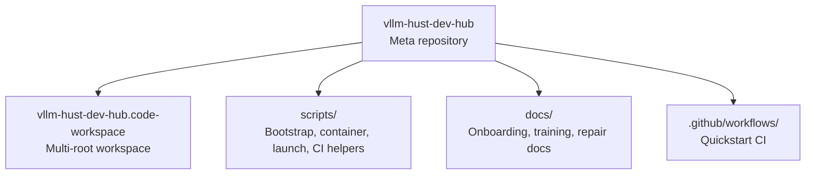
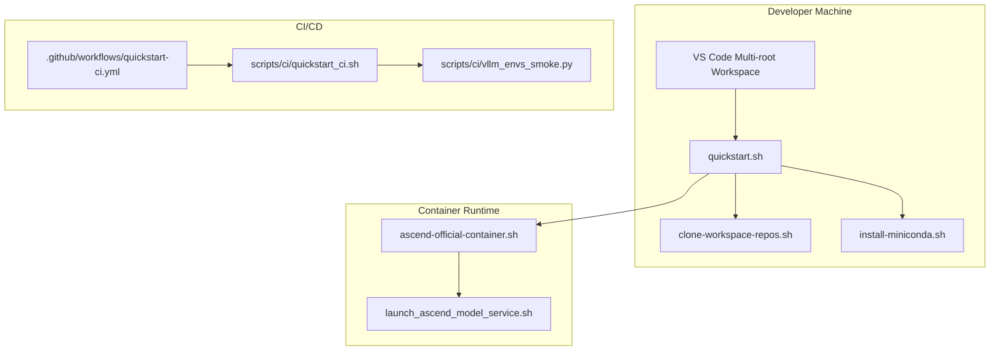
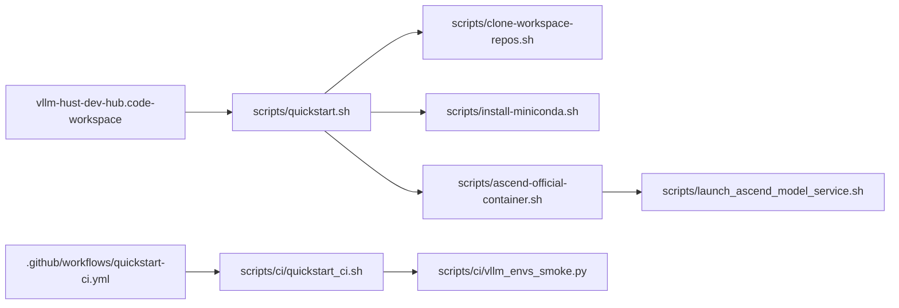

# Project Overview

<cite>
**Referenced Files in This Document**
- [README.md](file://README.md)
- [ROADMAP.md](file://ROADMAP.md)
- [vllm-hust-dev-hub.code-workspace](file://vllm-hust-dev-hub.code-workspace)
- [scripts/clone-workspace-repos.sh](file://scripts/clone-workspace-repos.sh)
- [scripts/quickstart.sh](file://scripts/quickstart.sh)
- [scripts/install-miniconda.sh](file://scripts/install-miniconda.sh)
- [scripts/ascend-official-container.sh](file://scripts/ascend-official-container.sh)
- [scripts/launch_ascend_model_service.sh](file://scripts/launch_ascend_model_service.sh)
- [.github/workflows/quickstart-ci.yml](file://.github/workflows/quickstart-ci.yml)
- [scripts/ci/quickstart_ci.sh](file://scripts/ci/quickstart_ci.sh)
- [scripts/ci/vllm_envs_smoke.py](file://scripts/ci/vllm_envs_smoke.py)
- [docs/team-onboarding.md](file://docs/team-onboarding.md)
</cite>

## Table of Contents
1. [Introduction](#introduction)
2. [Project Structure](#project-structure)
3. [Core Components](#core-components)
4. [Architecture Overview](#architecture-overview)
5. [Detailed Component Analysis](#detailed-component-analysis)
6. [Dependency Analysis](#dependency-analysis)
7. [Performance Considerations](#performance-considerations)
8. [Troubleshooting Guide](#troubleshooting-guide)
9. [Conclusion](#conclusion)
10. [Appendices](#appendices)

## Introduction
vllm-hust-dev-hub is a lightweight meta repository designed to streamline daily development workflows for the vLLM-HUST community. Its primary goals are:
- Provide a centralized VS Code multi-root workspace that groups related repositories commonly used during development, debugging, and upstream synchronization.
- Offer a bootstrap experience that clones common workspace repositories in parallel and sets up a conda environment with editable installs for core local projects.
- Coordinate Ascend NPU hardware acceleration tooling, including containerized development, runtime alignment, and model service launch helpers.

The project emphasizes team onboarding, reproducible environments, and efficient collaboration across multiple repositories while maintaining a clear separation between upstream comparison repos and local forks.

## Project Structure
At a high level, the repository organizes:
- A VS Code multi-root workspace definition that aggregates sibling repositories under a shared parent directory.
- Scripts for bootstrapping, environment setup, container orchestration, and model service launching.
- CI/CD automation that validates the bootstrap and runtime readiness across Ubuntu runners and self-hosted runners.
- Documentation for onboarding and operational procedures.

**Diagram sources**
- [vllm-hust-dev-hub.code-workspace](file://vllm-hust-dev-hub.code-workspace)
- [README.md](file://README.md)

**Section sources**
- [README.md](file://README.md)
- [vllm-hust-dev-hub.code-workspace](file://vllm-hust-dev-hub.code-workspace)

## Core Components
- VS Code Multi-root Workspace: A JSON file that defines folders for the dev hub, documentation, organization profile, core engines, web assets, tools, benchmarks, research, and upstream references. It also configures global exclusions for caches and build artifacts.
- Bootstrap Scripts:
  - Parallel repository cloning with interactive prompts and fallbacks.
  - One-command quickstart that orchestrates repository sync, conda environment creation, editable installs, and optional container setup.
  - Miniconda installation helper for user-space environments.
- Ascend Tooling:
  - Official Ascend container lifecycle management and SSH configuration.
  - Model service launcher supporting both host and container modes with preset configurations.
- CI/CD:
  - GitHub Actions workflow that runs a CI-optimized quickstart, smoke tests, and runtime checks.
  - CI bootstrap script that creates isolated conda environments, installs dependencies, and executes targeted tests.

Practical examples:
- Open the workspace in VS Code using the provided code-workspace file.
- Clone repositories in parallel with a single command.
- Initialize a conda environment and install core local packages in editable mode.
- Launch a model service in a container or on the host with preset configurations.

**Section sources**
- [README.md](file://README.md)
- [vllm-hust-dev-hub.code-workspace](file://vllm-hust-dev-hub.code-workspace)
- [scripts/clone-workspace-repos.sh](file://scripts/clone-workspace-repos.sh)
- [scripts/quickstart.sh](file://scripts/quickstart.sh)
- [scripts/install-miniconda.sh](file://scripts/install-miniconda.sh)
- [scripts/ascend-official-container.sh](file://scripts/ascend-official-container.sh)
- [scripts/launch_ascend_model_service.sh](file://scripts/launch_ascend_model_service.sh)
- [.github/workflows/quickstart-ci.yml](file://.github/workflows/quickstart-ci.yml)
- [scripts/ci/quickstart_ci.sh](file://scripts/ci/quickstart_ci.sh)
- [scripts/ci/vllm_envs_smoke.py](file://scripts/ci/vllm_envs_smoke.py)

## Architecture Overview
The development architecture centers on a multi-root VS Code workspace that aggregates related repositories. The bootstrap pipeline coordinates repository synchronization, environment provisioning, and optional container setup. Ascend-specific tooling ensures runtime alignment and provides convenient launch commands for model services.

**Diagram sources**
- [vllm-hust-dev-hub.code-workspace](file://vllm-hust-dev-hub.code-workspace)
- [scripts/quickstart.sh](file://scripts/quickstart.sh)
- [scripts/clone-workspace-repos.sh](file://scripts/clone-workspace-repos.sh)
- [scripts/install-miniconda.sh](file://scripts/install-miniconda.sh)
- [scripts/ascend-official-container.sh](file://scripts/ascend-official-container.sh)
- [scripts/launch_ascend_model_service.sh](file://scripts/launch_ascend_model_service.sh)
- [.github/workflows/quickstart-ci.yml](file://.github/workflows/quickstart-ci.yml)
- [scripts/ci/quickstart_ci.sh](file://scripts/ci/quickstart_ci.sh)
- [scripts/ci/vllm_envs_smoke.py](file://scripts/ci/vllm_envs_smoke.py)

## Detailed Component Analysis

### VS Code Multi-root Workspace
Purpose:
- Consolidate frequently used repositories under a single VS Code session.
- Provide consistent settings for excluding caches and build artifacts across all folders.

Workspace composition:
- Core folders include the dev hub, documentation, organization profile, engines (vllm-hust, vllm-ascend-hust, vllm-ascend-quant-hust), Triton plugin, runtime manager, web assets, tools, benchmarks, research, and upstream references.

Settings:
- Excludes common cache directories and build artifacts globally to keep the editor responsive and clean.

Practical example:
- Open the workspace file directly in VS Code to access all sibling repositories in one place.

**Section sources**
- [vllm-hust-dev-hub.code-workspace](file://vllm-hust-dev-hub.code-workspace)

### Repository Cloning Pipeline
Purpose:
- Clone or update common workspace repositories in parallel to accelerate onboarding and refresh cycles.

Key behaviors:
- Parallel clone jobs configurable via an environment variable.
- Interactive prompts for upstream reference repos and for pulling updates when applicable.
- Robust fallbacks: SSH to HTTPS fallback for cloning and fetching; safe handling of existing non-Git directories.

Practical example:
- Run the parallel clone script to synchronize all sibling repos under the workspace parent directory.

**Section sources**
- [scripts/clone-workspace-repos.sh](file://scripts/clone-workspace-repos.sh)

### Quickstart Bootstrap
Purpose:
- Provide a single-command experience to bootstrap repositories, create/update a conda environment, and install core local packages in editable mode.

Highlights:
- Interactive menu with recommended flows and advanced options.
- Conda environment creation with customizable name and Python version.
- Editable installs for core local repositories and optional full scope installs.
- Ascend-aware environment hooks that auto-set mirrors and preserve environment variables.
- Optional container workflow entrypoint via menu option 6.

Practical example:
- Run the quickstart script and choose the recommended bootstrap to sync repos, create a conda environment, and install core packages.

**Section sources**
- [scripts/quickstart.sh](file://scripts/quickstart.sh)
- [README.md](file://README.md)

### Miniconda Installation Helper
Purpose:
- Install Miniconda into the current user’s home directory with platform detection and safety checks.

Key behaviors:
- Detects OS and architecture, downloads the appropriate installer, and supports non-interactive mode.
- Safely handles broken or relocated prefixes by backing them up and reinstalling.

Practical example:
- Use the miniconda installer script when a conda environment is not yet available.

**Section sources**
- [scripts/install-miniconda.sh](file://scripts/install-miniconda.sh)

### Ascend Container Lifecycle and SSH
Purpose:
- Manage the official Ascend container lifecycle, including creation, reuse, and shell access.
- Automate SSH configuration for direct container connectivity.

Key behaviors:
- Detects Docker availability and falls back to sudo when needed.
- Relocates Docker data-root to a dedicated path when space is constrained.
- Prepares authorized keys from host and extra sources, and deploys them into the container.
- Aligns container SSH user and workspace ownership for seamless access.

Practical example:
- Start or reuse the official container and enter it with a single command; SSH into the container using configured keys.

**Section sources**
- [scripts/ascend-official-container.sh](file://scripts/ascend-official-container.sh)
- [docs/team-onboarding.md](file://docs/team-onboarding.md)

### Model Service Launcher (Ascend NPU)
Purpose:
- Start a model service in either host mode (via runtime manager) or container mode (via mounted workspace).

Key behaviors:
- Preset configurations for common models (e.g., W8A8, coder).
- Docker mode mounts the host workspace at a predictable path and activates the conda environment inside the container.
- Host mode uses runtime manager to align CANN versions and environment variables.
- Health checks and logging support for reliable service startup.

Practical example:
- Launch a model service in a container with a preset configuration and automatic health verification.

**Section sources**
- [scripts/launch_ascend_model_service.sh](file://scripts/launch_ascend_model_service.sh)

### CI/CD Automation
Purpose:
- Validate the bootstrap pipeline and runtime readiness across Ubuntu and self-hosted runners.

Components:
- GitHub Actions workflow triggers on pushes, PRs, and manual dispatch.
- CI bootstrap script creates an isolated conda environment, installs dependencies, and runs smoke tests.
- Smoke tests verify environment imports and runtime checks.

Practical example:
- Trigger the CI workflow to validate that the bootstrap pipeline works consistently across runners.

**Section sources**
- [.github/workflows/quickstart-ci.yml](file://.github/workflows/quickstart-ci.yml)
- [scripts/ci/quickstart_ci.sh](file://scripts/ci/quickstart_ci.sh)
- [scripts/ci/vllm_envs_smoke.py](file://scripts/ci/vllm_envs_smoke.py)

## Dependency Analysis
The project exhibits a layered dependency structure:
- Workspace orchestration depends on the multi-root workspace definition and sibling repositories.
- Bootstrap scripts depend on Git, conda, and optional Docker/SSH tooling.
- Ascend tooling depends on container images and runtime manager for environment alignment.
- CI/CD depends on the bootstrap scripts and smoke tests to validate reproducibility.

**Diagram sources**
- [vllm-hust-dev-hub.code-workspace](file://vllm-hust-dev-hub.code-workspace)
- [scripts/quickstart.sh](file://scripts/quickstart.sh)
- [scripts/clone-workspace-repos.sh](file://scripts/clone-workspace-repos.sh)
- [scripts/install-miniconda.sh](file://scripts/install-miniconda.sh)
- [scripts/ascend-official-container.sh](file://scripts/ascend-official-container.sh)
- [scripts/launch_ascend_model_service.sh](file://scripts/launch_ascend_model_service.sh)
- [.github/workflows/quickstart-ci.yml](file://.github/workflows/quickstart-ci.yml)
- [scripts/ci/quickstart_ci.sh](file://scripts/ci/quickstart_ci.sh)
- [scripts/ci/vllm_envs_smoke.py](file://scripts/ci/vllm_envs_smoke.py)

**Section sources**
- [README.md](file://README.md)
- [vllm-hust-dev-hub.code-workspace](file://vllm-hust-dev-hub.code-workspace)

## Performance Considerations
- Parallel repository cloning reduces onboarding time by leveraging multiple concurrent jobs.
- Editable installs minimize rebuild overhead during iterative development.
- Ascend-specific environment hooks and runtime manager ensure consistent CANN and Python stack versions, reducing misalignment-related performance regressions.
- CI/CD smoke tests catch environment issues early, preventing costly debugging sessions.

[No sources needed since this section provides general guidance]

## Troubleshooting Guide
Common issues and resolutions:
- Conda environment not found: Use the miniconda installer script to provision a user-space environment, then rerun quickstart.
- SSH connectivity to container blocked: Verify authorized keys are present and configured; use the container SSH deployment helper to align keys and ports.
- Docker data-root space exhausted: The container script can relocate Docker data-root to a larger partition when space is constrained.
- Bootstrap failures: Review CI results and logs to identify failing steps; rerun quickstart with verbose logs or adjust environment variables.

**Section sources**
- [scripts/install-miniconda.sh](file://scripts/install-miniconda.sh)
- [scripts/ascend-official-container.sh](file://scripts/ascend-official-container.sh)
- [scripts/ci/quickstart_ci.sh](file://scripts/ci/quickstart_ci.sh)

## Conclusion
vllm-hust-dev-hub streamlines development for the vLLM-HUST community by centralizing workspace orchestration, automating environment provisioning, and integrating Ascend NPU tooling. Its multi-root VS Code workspace, robust bootstrap scripts, and CI/CD validation collectively reduce friction for onboarding, collaboration, and performance optimization across multiple repositories.

[No sources needed since this section summarizes without analyzing specific files]

## Appendices

### Practical Examples
- Open the workspace in VS Code using the provided code-workspace file.
- Clone repositories in parallel with a single command.
- Initialize a conda environment and install core local packages in editable mode.
- Launch a model service in a container or on the host with preset configurations.

**Section sources**
- [README.md](file://README.md)
- [vllm-hust-dev-hub.code-workspace](file://vllm-hust-dev-hub.code-workspace)
- [scripts/clone-workspace-repos.sh](file://scripts/clone-workspace-repos.sh)
- [scripts/quickstart.sh](file://scripts/quickstart.sh)
- [scripts/ascend-official-container.sh](file://scripts/ascend-official-container.sh)
- [scripts/launch_ascend_model_service.sh](file://scripts/launch_ascend_model_service.sh)

### Scope, Audience, and Benefits
- Scope: Lightweight meta repository coordinating multiple related repositories for daily development, with a focus on Ascend NPU acceleration.
- Target audience: Developers and researchers working on vLLM forks, Ascend plugins, and related tooling within the vLLM-HUST community.
- Benefits:
  - Unified workspace for cross-repo development and debugging.
  - Reproducible environments via conda and editable installs.
  - Streamlined Ascend container workflows with SSH and runtime alignment.
  - Automated CI validation to ensure bootstrap reliability.

**Section sources**
- [README.md](file://README.md)
- [ROADMAP.md](file://ROADMAP.md)
- [docs/team-onboarding.md](file://docs/team-onboarding.md)