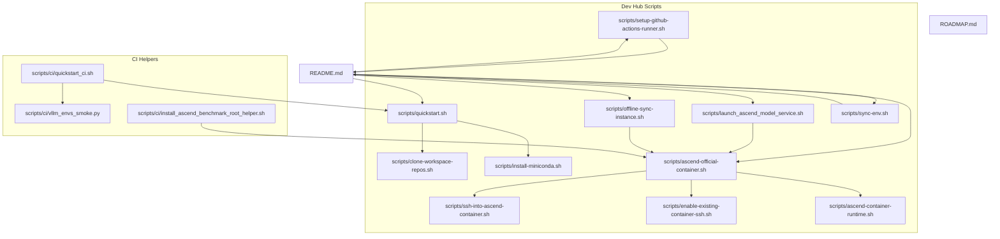
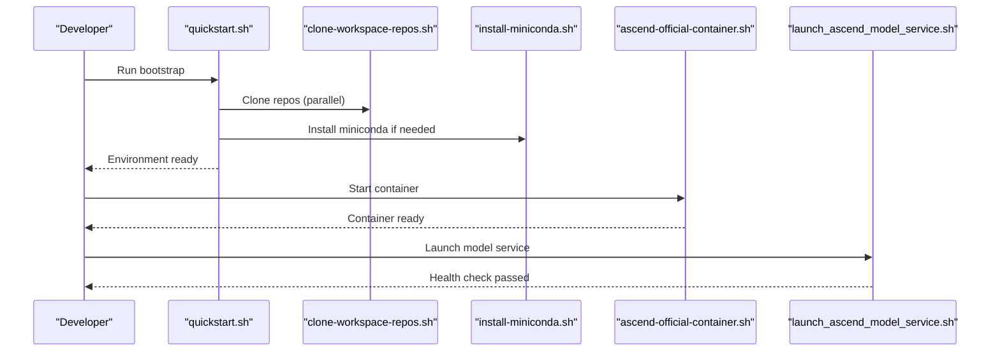
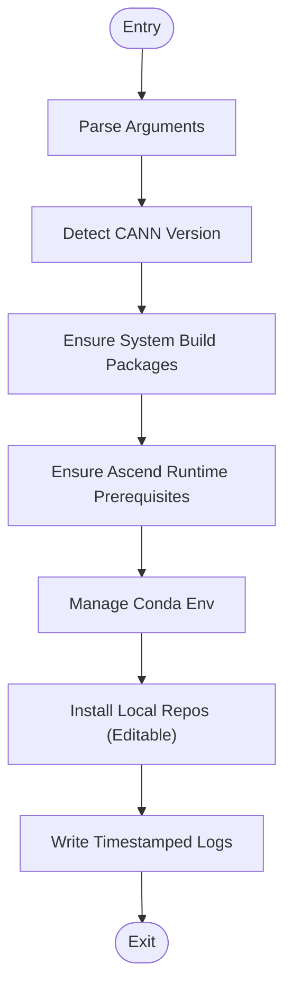
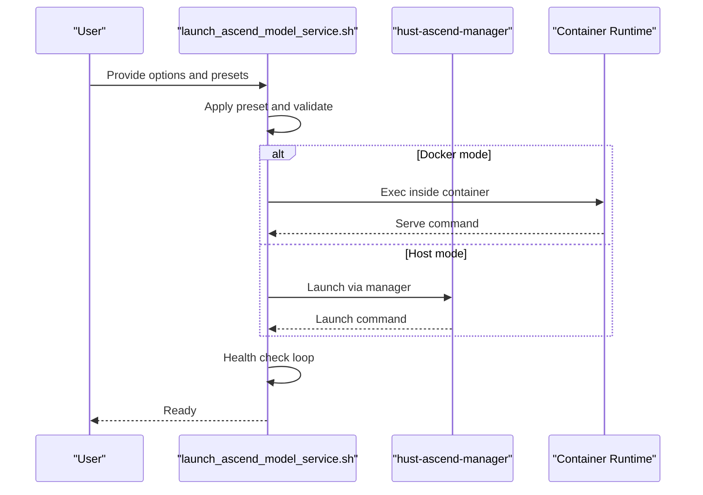
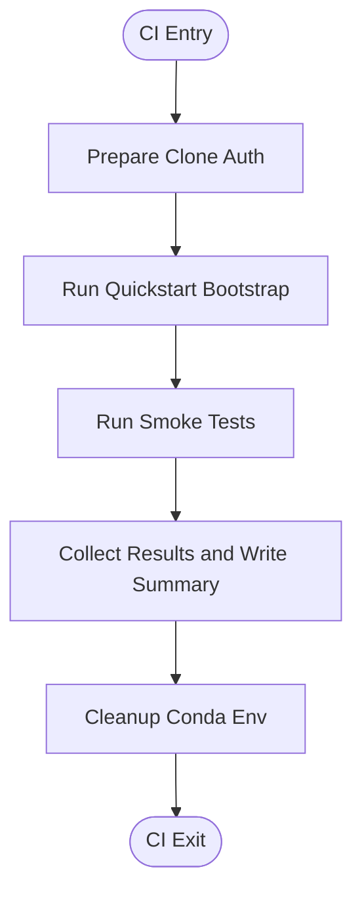
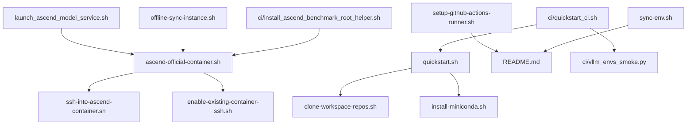

# Command Reference

<cite>
**Referenced Files in This Document**
- [README.md](file://README.md)
- [ROADMAP.md](file://ROADMAP.md)
- [scripts/quickstart.sh](file://scripts/quickstart.sh)
- [scripts/clone-workspace-repos.sh](file://scripts/clone-workspace-repos.sh)
- [scripts/install-miniconda.sh](file://scripts/install-miniconda.sh)
- [scripts/ascend-official-container.sh](file://scripts/ascend-official-container.sh)
- [scripts/ssh-into-ascend-container.sh](file://scripts/ssh-into-ascend-container.sh)
- [scripts/enable-existing-container-ssh.sh](file://scripts/enable-existing-container-ssh.sh)
- [scripts/ascend-container-runtime.sh](file://scripts/ascend-container-runtime.sh)
- [scripts/launch_ascend_model_service.sh](file://scripts/launch_ascend_model_service.sh)
- [scripts/offline-sync-instance.sh](file://scripts/offline-sync-instance.sh)
- [scripts/setup-github-actions-runner.sh](file://scripts/setup-github-actions-runner.sh)
- [scripts/sync-env.sh](file://scripts/sync-env.sh)
- [scripts/ci/quickstart_ci.sh](file://scripts/ci/quickstart_ci.sh)
- [scripts/ci/vllm_envs_smoke.py](file://scripts/ci/vllm_envs_smoke.py)
- [scripts/ci/install_ascend_benchmark_root_helper.sh](file://scripts/ci/install_ascend_benchmark_root_helper.sh)
</cite>

## Table of Contents
1. [Introduction](#introduction)
2. [Project Structure](#project-structure)
3. [Core Components](#core-components)
4. [Architecture Overview](#architecture-overview)
5. [Detailed Component Analysis](#detailed-component-analysis)
6. [Dependency Analysis](#dependency-analysis)
7. [Performance Considerations](#performance-considerations)
8. [Troubleshooting Guide](#troubleshooting-guide)
9. [Conclusion](#conclusion)
10. [Appendices](#appendices)

## Introduction
This command reference documents all available scripts in the VLLM-HUST Development Hub. It explains syntax, parameters, flags, environment variables, and usage examples for each command. Commands are grouped by functionality (bootstrap, containerization, model serving, CI, and utilities) to help you quickly locate the right tool for your workflow.

## Project Structure
The repository provides a collection of Bash and Python scripts under the scripts/ directory, along with supporting CI helpers and documentation. The README outlines the included repositories and high-level usage patterns.

**Diagram sources**
- [README.md:1-288](file://README.md#L1-L288)
- [ROADMAP.md:1-83](file://ROADMAP.md#L1-L83)
- [scripts/quickstart.sh:1-800](file://scripts/quickstart.sh#L1-L800)
- [scripts/clone-workspace-repos.sh:1-466](file://scripts/clone-workspace-repos.sh#L1-L466)
- [scripts/install-miniconda.sh:1-169](file://scripts/install-miniconda.sh#L1-L169)
- [scripts/ascend-official-container.sh:1-388](file://scripts/ascend-official-container.sh#L1-L388)
- [scripts/ssh-into-ascend-container.sh:1-14](file://scripts/ssh-into-ascend-container.sh#L1-L14)
- [scripts/enable-existing-container-ssh.sh:1-172](file://scripts/enable-existing-container-ssh.sh#L1-L172)
- [scripts/ascend-container-runtime.sh:1-55](file://scripts/ascend-container-runtime.sh#L1-L55)
- [scripts/launch_ascend_model_service.sh:1-680](file://scripts/launch_ascend_model_service.sh#L1-L680)
- [scripts/offline-sync-instance.sh:1-763](file://scripts/offline-sync-instance.sh#L1-L763)
- [scripts/setup-github-actions-runner.sh:1-528](file://scripts/setup-github-actions-runner.sh#L1-L528)
- [scripts/sync-env.sh:1-129](file://scripts/sync-env.sh#L1-L129)
- [scripts/ci/quickstart_ci.sh:1-321](file://scripts/ci/quickstart_ci.sh#L1-L321)
- [scripts/ci/vllm_envs_smoke.py:1-69](file://scripts/ci/vllm_envs_smoke.py#L1-L69)
- [scripts/ci/install_ascend_benchmark_root_helper.sh:1-18](file://scripts/ci/install_ascend_benchmark_root_helper.sh#L1-L18)

**Section sources**
- [README.md:1-288](file://README.md#L1-L288)
- [ROADMAP.md:1-83](file://ROADMAP.md#L1-L83)

## Core Components
Below are the commands organized by functionality with syntax, parameters, flags, environment variables, and usage examples.

### Bootstrap and Environment Setup
- scripts/quickstart.sh
  - Purpose: One-command bootstrap to clone repositories, create/update a conda environment, and optionally install local repositories.
  - Syntax: bash scripts/quickstart.sh [options]
  - Options:
    - --clone: Sync workspace repositories.
    - --conda: Create or update a conda environment.
    - --install: Install local repositories into an existing conda environment.
    - --install-mode MODE: install or refresh (default: install).
    - --install-scope SCOPE: core or full (default: core).
    - --ascend-lightweight: Use lightweight mode for Ascend plugin (equivalent to COMPILE_CUSTOM_KERNELS=0).
    - --ascend-custom-kernels VALUE: Explicitly set Ascend plugin COMPILE_CUSTOM_KERNELS value.
    - --all: Execute clone + conda + install(core).
    - --env-name NAME: Conda environment name (default: vllm-hust-dev).
    - --python VERSION: Python version for the environment (default: 3.11).
    - --update-bashrc: Update ~/.bashrc to auto-activate the environment in new shells.
    - -y, --yes: Non-interactive mode; container SSH pubkey can be supplied via VLLM_HUST_CONTAINER_PUBKEY.
    - -h, --help: Show help.
  - Environment variables:
    - HUST_DEV_HUB_UPDATE_BASHRC: If set to 1, equivalent to --update-bashrc.
    - HUST_DEV_HUB_QUICKSTART_LOG_DIR: Override destination directory for installation logs.
    - HUST_DEV_HUB_QUICKSTART_LOG_FILE: Pin a specific log filename.
    - HUST_DEV_HUB_DISABLE_HF_MIRROR_AUTOSET: Disable automatic mirror endpoint switching for Hugging Face.
    - HUST_DEV_HUB_ENABLE_MANAGER_ENV_HOOK: Enable applying Ascend runtime variables on environment activation.
    - HUST_DEV_HUB_APPLY_ASCEND_SYSTEM_STEPS: Allow quickstart to invoke system-level steps via the Ascend manager.
    - HUST_DEV_HUB_ASCEND_COMPILE_CUSTOM_KERNELS: Force Ascend custom kernel behavior (1 to always compile, 0 to always lightweight).
    - VLLM_HUST_CONTAINER_PUBKEY: SSH public key to persist for container access (valid formats include ssh-ed25519, ssh-rsa, ECDSA variants).
  - Examples:
    - bash scripts/quickstart.sh --all -y
    - bash scripts/quickstart.sh --conda --env-name vllm-hust-dev --python 3.11 -y
    - bash scripts/quickstart.sh --install --env-name vllm-hust-dev -y
    - bash scripts/quickstart.sh --install --install-mode refresh --env-name vllm-hust-dev -y
    - bash scripts/quickstart.sh --install --install-mode install --install-scope full --env-name vllm-hust-dev -y
  - Notes:
    - When conda is not available, quickstart can invoke the Miniconda installer automatically for flows that include environment setup.
    - The script writes timestamped logs to ~/.cache/vllm-hust-dev-hub/logs by default; override via HUST_DEV_HUB_QUICKSTART_LOG_DIR or HUST_DEV_HUB_QUICKSTART_LOG_FILE.

- scripts/clone-workspace-repos.sh
  - Purpose: Clone common workspace repositories in parallel, with retry and update logic.
  - Syntax: bash scripts/clone-workspace-repos.sh [options]
  - Options:
    - -y, --yes: Auto-approve prompts for cloning reference repos and pulling updates.
    - -h, --help: Show help.
  - Environment variables:
    - CLONE_JOBS: Parallelism level for cloning (default: 4).
  - Examples:
    - bash scripts/clone-workspace-repos.sh --yes
  - Notes:
    - The script prefers SSH URLs for fresh clones and falls back to HTTPS when SSH auth is unavailable.
    - Upstream reference repositories are kept under reference-repos/ and are not installed by quickstart.

- scripts/install-miniconda.sh
  - Purpose: Download and install Miniconda into the current user’s home directory.
  - Syntax: bash scripts/install-miniconda.sh [options]
  - Options:
    - --prefix PATH: Installation directory (default: $HOME/miniconda3).
    - -y, --yes: Non-interactive mode.
    - -h, --help: Show help.
  - Examples:
    - bash scripts/install-miniconda.sh
  - Notes:
    - If an unusable Miniconda prefix is detected, the script can back it up and reinstall.

**Section sources**
- [README.md:34-196](file://README.md#L34-L196)
- [scripts/quickstart.sh:112-135](file://scripts/quickstart.sh#L112-L135)
- [scripts/quickstart.sh:433-451](file://scripts/quickstart.sh#L433-L451)
- [scripts/clone-workspace-repos.sh:149-162](file://scripts/clone-workspace-repos.sh#L149-L162)
- [scripts/install-miniconda.sh:9-18](file://scripts/install-miniconda.sh#L9-L18)

### Containerization and SSH Access
- scripts/ascend-official-container.sh
  - Purpose: Start, reuse, and enter the official Ascend vLLM container; optionally auto-enable SSH.
  - Syntax: bash scripts/ascend-official-container.sh [action] [options]
  - Actions:
    - help: Show container subcommand help via the Ascend manager CLI.
    - install/start/shell/exec/ssh-enable/ssh-deploy/pull: Control container lifecycle and SSH configuration.
  - Options:
    - --image IMAGE: Override the default container image.
    - --non-interactive: Non-interactive mode for container operations.
    - Additional passthrough options are forwarded to the Ascend manager container subcommand.
  - Environment variables:
    - IMAGE: Default container image to use.
    - CONTAINER_NAME: Container name (default: vllm-ascend-dev).
    - HOST_WORKSPACE_ROOT: Host workspace root (default: parent of hub).
    - CONTAINER_WORKSPACE_ROOT: Container workspace root (default: /workspace).
    - CONTAINER_WORKDIR: Working directory inside the container (default: /workspace/vllm-hust-dev-hub).
    - HOST_CACHE_DIR: Host cache directory (default: $HOME/.cache).
    - SHM_SIZE: Shared memory size (default: 16g).
    - DEFAULT_CONTAINER_SSH_USER: SSH user inside the container (default: shuhao).
    - DEFAULT_CONTAINER_SSH_PORT: SSH port exposed (default: 2222).
    - VLLM_HUST_AUTO_ENABLE_CONTAINER_SSH: Enable automatic SSH configuration (default: 1).
    - VLLM_HUST_AUTO_RELOCATE_DOCKER: Auto relocate Docker data-root if needed (default: 0).
    - VLLM_HUST_ASCEND_CONTAINER_NON_INTERACTIVE: Forward non-interactive flag to manager.
  - Examples:
    - bash scripts/ascend-official-container.sh start
    - bash scripts/ascend-official-container.sh shell
    - bash scripts/ascend-official-container.sh exec -- python -c 'import torch; import torch_npu; print(torch.npu.device_count())'

- scripts/ssh-into-ascend-container.sh
  - Purpose: SSH into a running Ascend dev container with workspace mounted.
  - Syntax: bash scripts/ssh-into-ascend-container.sh
  - Environment variables:
    - HOST_WORKSPACE_ROOT: Host workspace root (default: parent of hub).
    - CONTAINER_NAME: Container name (default: vllm-ascend-dev).
  - Example:
    - bash scripts/ssh-into-ascend-container.sh

- scripts/enable-existing-container-ssh.sh
  - Purpose: Enable SSH and mount repositories for an already-running container.
  - Syntax: bash scripts/enable-existing-container-ssh.sh
  - Environment variables:
    - CONTAINER_NAME: Container name (default: vllm-ascend-v091-dev).
    - HOST_WORKSPACE_ROOT: Host workspace root (default: parent of hub).
    - CONTAINER_WORKSPACE_ROOT: Container workspace root (default: /workspace).
    - SSH_USER: SSH user to create (default: shuhao).
    - SSH_PORT: SSH port to expose (default: 2222).
    - AUTHORIZED_KEYS_SOURCE: Authorized keys file path (default: $HOST_WORKSPACE_ROOT/.ssh/authorized_keys).
    - OFFLINE_DEB_DIR: Directory containing offline .deb packages for SSH server installation.
  - Example:
    - bash scripts/enable-existing-container-ssh.sh

- scripts/ascend-container-runtime.sh
  - Purpose: SSH keepalive and health monitor for Ascend dev containers.
  - Syntax: bash scripts/ascend-container-runtime.sh
  - Environment variables:
    - CONTAINER_SSH_USER: Required; SSH user to manage.
    - CONTAINER_SSH_PORT: SSH port (default: 2237).
    - CONTAINER_SSH_AUTHORIZED_KEYS: Authorized keys file path (default: /workspace/.ssh/authorized_keys).
    - CONTAINER_SSH_PIDFILE: PID file location (default: /var/run/sshd_${PORT}.pid).
    - CONTAINER_SSH_LOGFILE: Log file location (default: /var/log/sshd_${PORT}.log).
    - CONTAINER_SSH_HEALTH_INTERVAL: Health check interval in seconds (default: 5).
  - Example:
    - bash scripts/ascend-container-runtime.sh

**Section sources**
- [README.md:228-241](file://README.md#L228-L241)
- [scripts/ascend-official-container.sh:1-388](file://scripts/ascend-official-container.sh#L1-L388)
- [scripts/ssh-into-ascend-container.sh:1-14](file://scripts/ssh-into-ascend-container.sh#L1-L14)
- [scripts/enable-existing-container-ssh.sh:1-172](file://scripts/enable-existing-container-ssh.sh#L1-L172)
- [scripts/ascend-container-runtime.sh:1-55](file://scripts/ascend-container-runtime.sh#L1-L55)

### Model Serving
- scripts/launch_ascend_model_service.sh
  - Purpose: Start an Ascend NPU model service in host or Docker mode with preset configurations.
  - Syntax: bash scripts/launch_ascend_model_service.sh [options]
  - Presets:
    - --preset w8a8: Qwen3-235B-A22B-W8A8 (quantized, use with --download-model).
    - --preset coder: Qwen2.5-Coder-32B-Instruct (dense coding, TP=4).
  - Mode selection:
    - --docker CONTAINER: Run inside Docker container (recommended for containerized environments).
    - --skip-setup: (Host mode only) Skip Ascend manager environment setup.
  - Environment:
    - --env NAME: Conda environment name (default: vllm-hust-dev).
    - --model MODEL_ID: Model id/path (default: Qwen/Qwen3-235B-A22B-Instruct-2507).
    - --host HOST: Bind host (default: 0.0.0.0).
    - --port PORT: Bind port (default: 8000).
    - --served-model-name NAME: Served model name (default: qwen3-235b-a22b-8npu).
  - Model config:
    - --tp SIZE: Tensor parallel size (default: 8).
    - --max-model-len LEN: Max model length (default: 40960).
    - --gpu-mem-util RATIO: GPU/NPU memory utilization (default: 0.9).
    - --dtype DTYPE: Model dtype (default: bfloat16).
    - --load-format FORMAT: Load format (default: auto).
    - --quantization METHOD: Quantization method (e.g., ascend).
    - --max-num-seqs N: Max concurrent sequences (default: 16).
    - --max-num-batched-tokens N: Max batched tokens (default: 4096).
  - Operational:
    - --download-model: Download model from ModelScope before launching.
    - --log-file PATH: Log file path (default: auto in /tmp).
    - --health-timeout SEC: Health check timeout seconds (default: 1800).
    - --health-interval SEC: Health check interval seconds (default: 5).
    - --no-health-check: Skip waiting for /health.
    - --foreground: Run command in foreground.
    - --enforce-eager: Skip CUDA graph capture (default: on, avoids JIT issues).
    - --no-enforce-eager: Enable CUDA graph capture (requires compatible Triton).
    - --no-prefix-caching: Disable prefix caching.
    - --no-chunked-prefill: Disable chunked prefill.
    - --dry-run: Print command only.
    - -h, --help: Show help.
  - Environment variables (host mode):
    - COMPILE_CUSTOM_KERNELS: Controls whether to compile Ascend custom kernels (default: 1).
    - VLLM_ASCEND_ENABLE_FLASHCOMM1: Enable FlashComm1/SP for MoE high concurrency (default: 1).
    - VLLM_ASCEND_ENABLE_FUSED_MC2: Enable fused MC2 dispatch (default: 1).
    - VLLM_ASCEND_TORCH_PREFLIGHT: Disable NPU preflight to avoid timeouts (default: 0).
    - HF_HUB_OFFLINE/TRANSFORMERS_OFFLINE: Offline mode flags.
    - VLLM_PLUGINS: Plugin selection (default: ascend).
  - Examples:
    - bash scripts/launch_ascend_model_service.sh --preset w8a8 --docker vllm_hust_ws_16rc
    - bash scripts/launch_ascend_model_service.sh --preset w8a8
    - bash scripts/launch_ascend_model_service.sh --preset w8a8 --download-model
    - bash scripts/launch_ascend_model_service.sh --model Qwen/Qwen2.5-7B-Instruct --tp 1 --port 8100
    - bash scripts/launch_ascend_model_service.sh --preset w8a8 --docker my_container --dry-run

**Section sources**
- [README.md:212-221](file://README.md#L212-L221)
- [scripts/launch_ascend_model_service.sh:188-249](file://scripts/launch_ascend_model_service.sh#L188-L249)
- [scripts/launch_ascend_model_service.sh:251-314](file://scripts/launch_ascend_model_service.sh#L251-L314)

### Offline Sync and Utilities
- scripts/offline-sync-instance.sh
  - Purpose: Prepare offline wheels/assets and sync them into a container without public network access.
  - Syntax: bash scripts/offline-sync-instance.sh [options]
  - Model options:
    - --model-id ID: Hugging Face model repo id to download locally.
    - --model-revision REV: Optional model revision.
    - --model-path PATH: Reuse an existing local model directory.
    - --model-allow PATTERNS: Comma-separated allow patterns for snapshot download.
    - --model-ignore PATTERNS: Comma-separated ignore patterns for snapshot download.
    - --skip-model: Skip model download and sync.
  - Workflow options:
    - --skip-wheelhouse: Skip local Python artifact preparation.
    - --skip-repos: Skip syncing local source repositories.
    - --skip-install: Skip the container-side offline install step.
    - --skip-import-check: Skip the final import validation inside the container.
    - --artifact-root PATH: Local artifact directory (default: ~/.cache/.../aarch64-cp310).
    - --container-asset-root P: Destination root in the container for offline assets.
    - --container-model-root P: Destination root in the container for models.
    - --env-name NAME: Conda environment name inside the container (default: vllm-hust-dev).
    - -y, --yes: Auto-install local helper packages when needed.
    - -h, --help: Show help.
  - Environment variables:
    - BASTION_ALIAS: Bastion host alias (default: cgcl-bastion).
    - BASTION_STAGE_ROOT: Stage root on bastion (default: /home/user/offline-sync-stage/vllm-hust).
    - CONTAINER_HOST/PORT/USER: Container connection parameters.
    - TARGET_*: Platform and Python target settings for wheel downloads.
  - Examples:
    - bash scripts/offline-sync-instance.sh --model-id Qwen/Qwen2.5-1.5B-Instruct
    - bash scripts/offline-sync-instance.sh --model-path /data/models/Qwen2.5-1.5B-Instruct --skip-wheelhouse

- scripts/sync-env.sh
  - Purpose: Propagate the canonical token .env from this repo to sibling repositories.
  - Syntax: bash scripts/sync-env.sh [--apply]
  - Behavior:
    - Dry-run by default (shows differences).
    - --apply: Actually copy/patch .env files.
  - Targets:
    - Full copy targets: SAGE
    - Merge targets (patch token lines only): vllm-hust-workstation
  - Tokens managed:
    - GITHUB_TOKEN, HF_ENDPOINT, HF_TOKEN, PYPI_TOKEN, TAVILY_TOKEN, CLOUDFLARE_* tokens, VLLM_HUST_API_* tokens.
  - Example:
    - bash scripts/sync-env.sh --apply

**Section sources**
- [README.md:242-278](file://README.md#L242-L278)
- [scripts/offline-sync-instance.sh:67-103](file://scripts/offline-sync-instance.sh#L67-L103)
- [scripts/sync-env.sh:1-129](file://scripts/sync-env.sh#L1-L129)

### CI and Automation
- scripts/ci/quickstart_ci.sh
  - Purpose: CI-optimized quickstart for automated runner environments; runs smoke tests and collects results.
  - Syntax: bash scripts/ci/quickstart_ci.sh
  - Environment variables:
    - RUNNER_FLAVOR: Runner flavor identifier (default: unknown).
    - PYTHON_VERSION: Python version for the environment (default: 3.11).
    - INSTALL_SCOPE: Install scope (core/full) (default: full).
    - RESULTS_ROOT: Root directory for CI results (default: $HUB_ROOT/.ci-results).
    - CI_GITHUB_TOKEN/GITHUB_TOKEN: Token for authenticated clones.
    - HUST_DEV_HUB_SKIP_ASCEND_SYSTEM_APPLY: Skip system-level steps in CI.
  - Examples:
    - bash scripts/ci/quickstart_ci.sh

- scripts/ci/vllm_envs_smoke.py
  - Purpose: Smoke test to verify vLLM environment imports and port parsing behavior.
  - Syntax: python scripts/ci/vllm_envs_smoke.py [repo_dir]
  - Example:
    - python scripts/ci/vllm_envs_smoke.py /path/to/vllm-hust

- scripts/ci/install_ascend_benchmark_root_helper.sh
  - Purpose: Delegate to vllm-ascend-hust benchmark root helper installer.
  - Syntax: bash scripts/ci/install_ascend_benchmark_root_helper.sh [args]
  - Environment variables:
    - VLLM_ASCEND_HUST_REPO: Path to vllm-ascend-hust repository (default: ../vllm-ascend-hust).
  - Example:
    - bash scripts/ci/install_ascend_benchmark_root_helper.sh

**Section sources**
- [scripts/ci/quickstart_ci.sh:1-321](file://scripts/ci/quickstart_ci.sh#L1-L321)
- [scripts/ci/vllm_envs_smoke.py:1-69](file://scripts/ci/vllm_envs_smoke.py#L1-L69)
- [scripts/ci/install_ascend_benchmark_root_helper.sh:1-18](file://scripts/ci/install_ascend_benchmark_root_helper.sh#L1-L18)

### GitHub Actions Runner
- scripts/setup-github-actions-runner.sh
  - Purpose: Install and manage a rootless GitHub Actions self-hosted runner as a user systemd service.
  - Syntax: bash scripts/setup-github-actions-runner.sh <command> [options]
  - Commands:
    - install: Download, configure, and start the runner as a user service.
    - start/stop/restart/status/remove: Control the runner service.
  - Options:
    - --url URL: GitHub org or repo URL.
    - --token TOKEN: Registration token for install, or remove token for remove.
    - --name NAME: Runner name (default: current hostname).
    - --group NAME: Runner group name (default: Default).
    - --labels CSV: Extra runner labels, comma-separated.
    - --runner-dir PATH: Install directory (default: $HOME/.local/share/github-actions-runner).
    - --workdir PATH: Runner work directory relative to runner dir (default: _work).
    - --service-name NAME: User systemd service name (default: github-actions-runner).
    - --version VERSION: Runner version to download (default: 2.333.1).
    - --replace/--no-replace: Replace existing runner config.
    - --disable-update: Pass --disableupdate to config.sh.
    - -y, --yes: Non-interactive mode.
    - -h, --help: Show help.
  - Environment variables:
    - GITHUB_RUNNER_URL/GITHUB_RUNNER_TOKEN/GITHUB_RUNNER_NAME/GITHUB_RUNNER_GROUP/GITHUB_RUNNER_LABELS/GITHUB_RUNNER_DIR/GITHUB_RUNNER_WORKDIR/GITHUB_RUNNER_SERVICE_NAME/GITHUB_RUNNER_DISABLE_UPDATE/GITHUB_RUNNER_PRESERVE_PROXY
  - Examples:
    - export GITHUB_RUNNER_URL=https://github.com/intellistream
    - export GITHUB_RUNNER_TOKEN=<temporary-registration-token>
    - bash scripts/setup-github-actions-runner.sh install --labels train8,ascend
    - bash scripts/setup-github-actions-runner.sh status
    - export GITHUB_RUNNER_TOKEN=<temporary-remove-token>
    - bash scripts/setup-github-actions-runner.sh remove

**Section sources**
- [README.md:222-226](file://README.md#L222-L226)
- [scripts/setup-github-actions-runner.sh:21-72](file://scripts/setup-github-actions-runner.sh#L21-L72)

## Architecture Overview
The commands integrate with each other to form a cohesive development workflow:
- quickstart.sh orchestrates repository cloning and environment setup.
- Container scripts manage Docker-based development and SSH access.
- launch_ascend_model_service.sh starts model servers in host or Docker mode.
- CI scripts automate bootstrapping and smoke testing.
- Utility scripts handle environment propagation and offline synchronization.

**Diagram sources**
- [scripts/quickstart.sh:1-800](file://scripts/quickstart.sh#L1-L800)
- [scripts/clone-workspace-repos.sh:1-466](file://scripts/clone-workspace-repos.sh#L1-L466)
- [scripts/install-miniconda.sh:1-169](file://scripts/install-miniconda.sh#L1-L169)
- [scripts/ascend-official-container.sh:1-388](file://scripts/ascend-official-container.sh#L1-L388)
- [scripts/launch_ascend_model_service.sh:1-680](file://scripts/launch_ascend_model_service.sh#L1-L680)

## Detailed Component Analysis

### quickstart.sh
- Functionality:
  - Parses arguments and sets defaults.
  - Detects CANN version and selects appropriate manifest.
  - Ensures system build packages and Ascend runtime prerequisites.
  - Manages conda environment creation and activation.
  - Installs local repositories in editable mode.
  - Handles Ascend custom kernel compilation preferences.
  - Writes timestamped logs and supports non-interactive mode.
- Key parameters and flags:
  - --clone, --conda, --install, --install-mode, --install-scope, --ascend-lightweight, --ascend-custom-kernels, --all, --env-name, --python, --update-bashrc, -y, -h.
- Environment variables:
  - HUST_DEV_HUB_UPDATE_BASHRC, HUST_DEV_HUB_QUICKSTART_LOG_DIR, HUST_DEV_HUB_QUICKSTART_LOG_FILE, HUST_DEV_HUB_DISABLE_HF_MIRROR_AUTOSET, HUST_DEV_HUB_ENABLE_MANAGER_ENV_HOOK, HUST_DEV_HUB_APPLY_ASCEND_SYSTEM_STEPS, HUST_DEV_HUB_ASCEND_COMPILE_CUSTOM_KERNELS, VLLM_HUST_CONTAINER_PUBKEY.

**Diagram sources**
- [scripts/quickstart.sh:18-58](file://scripts/quickstart.sh#L18-L58)
- [scripts/quickstart.sh:144-189](file://scripts/quickstart.sh#L144-L189)
- [scripts/quickstart.sh:550-579](file://scripts/quickstart.sh#L550-L579)

**Section sources**
- [scripts/quickstart.sh:112-135](file://scripts/quickstart.sh#L112-L135)
- [scripts/quickstart.sh:433-451](file://scripts/quickstart.sh#L433-L451)

### launch_ascend_model_service.sh
- Functionality:
  - Supports host mode (via hust-ascend-manager) and Docker mode (via /workspace mount).
  - Applies preset configurations for common models.
  - Downloads models from ModelScope when requested.
  - Validates environment and runs health checks.
- Key parameters and flags:
  - --docker, --skip-setup, --env, --model, --host, --port, --served-model-name, --tp, --max-model-len, --gpu-mem-util, --dtype, --load-format, --quantization, --max-num-seqs, --max-num-batched-tokens, --download-model, --log-file, --health-timeout, --health-interval, --no-health-check, --foreground, --enforce-eager, --no-enforce-eager, --no-prefix-caching, --no-chunked-prefill, --dry-run, -h.
- Environment variables:
  - COMPILE_CUSTOM_KERNELS, VLLM_ASCEND_ENABLE_FLASHCOMM1, VLLM_ASCEND_ENABLE_FUSED_MC2, VLLM_ASCEND_TORCH_PREFLIGHT, HF_HUB_OFFLINE, TRANSFORMERS_OFFLINE, VLLM_PLUGINS.

**Diagram sources**
- [scripts/launch_ascend_model_service.sh:366-388](file://scripts/launch_ascend_model_service.sh#L366-L388)
- [scripts/launch_ascend_model_service.sh:401-500](file://scripts/launch_ascend_model_service.sh#L401-L500)
- [scripts/launch_ascend_model_service.sh:654-679](file://scripts/launch_ascend_model_service.sh#L654-L679)

**Section sources**
- [scripts/launch_ascend_model_service.sh:188-249](file://scripts/launch_ascend_model_service.sh#L188-L249)
- [scripts/launch_ascend_model_service.sh:251-314](file://scripts/launch_ascend_model_service.sh#L251-L314)

### CI Workflow
- Functionality:
  - Prepares Git authentication for clones.
  - Runs quickstart bootstrap in non-interactive mode.
  - Executes smoke tests and collects JUnit results.
  - Cleans up conda environments and writes summaries.
- Key parameters and flags:
  - Controlled via environment variables (RUNNER_FLAVOR, PYTHON_VERSION, INSTALL_SCOPE, RESULTS_ROOT, CI_GITHUB_TOKEN/GITHUB_TOKEN).
- Examples:
  - bash scripts/ci/quickstart_ci.sh

**Diagram sources**
- [scripts/ci/quickstart_ci.sh:146-159](file://scripts/ci/quickstart_ci.sh#L146-L159)
- [scripts/ci/quickstart_ci.sh:232-255](file://scripts/ci/quickstart_ci.sh#L232-L255)
- [scripts/ci/quickstart_ci.sh:101-126](file://scripts/ci/quickstart_ci.sh#L101-L126)

**Section sources**
- [scripts/ci/quickstart_ci.sh:1-321](file://scripts/ci/quickstart_ci.sh#L1-L321)

## Dependency Analysis
- Container scripts depend on Docker availability and optional sudo access.
- quickstart.sh depends on conda and Git; it can install Miniconda when missing.
- launch_ascend_model_service.sh depends on either host conda activation or Docker environment with proper library paths.
- CI scripts depend on pytest and conda environment presence.

**Diagram sources**
- [scripts/quickstart.sh:1-800](file://scripts/quickstart.sh#L1-L800)
- [scripts/clone-workspace-repos.sh:1-466](file://scripts/clone-workspace-repos.sh#L1-L466)
- [scripts/install-miniconda.sh:1-169](file://scripts/install-miniconda.sh#L1-L169)
- [scripts/ascend-official-container.sh:1-388](file://scripts/ascend-official-container.sh#L1-L388)
- [scripts/ssh-into-ascend-container.sh:1-14](file://scripts/ssh-into-ascend-container.sh#L1-L14)
- [scripts/enable-existing-container-ssh.sh:1-172](file://scripts/enable-existing-container-ssh.sh#L1-L172)
- [scripts/launch_ascend_model_service.sh:1-680](file://scripts/launch_ascend_model_service.sh#L1-L680)
- [scripts/offline-sync-instance.sh:1-763](file://scripts/offline-sync-instance.sh#L1-L763)
- [scripts/setup-github-actions-runner.sh:1-528](file://scripts/setup-github-actions-runner.sh#L1-L528)
- [scripts/sync-env.sh:1-129](file://scripts/sync-env.sh#L1-L129)
- [scripts/ci/quickstart_ci.sh:1-321](file://scripts/ci/quickstart_ci.sh#L1-L321)
- [scripts/ci/vllm_envs_smoke.py:1-69](file://scripts/ci/vllm_envs_smoke.py#L1-L69)
- [scripts/ci/install_ascend_benchmark_root_helper.sh:1-18](file://scripts/ci/install_ascend_benchmark_root_helper.sh#L1-L18)

**Section sources**
- [README.md:1-288](file://README.md#L1-L288)

## Performance Considerations
- Parallel cloning: Increase CLONE_JOBS to speed up repository synchronization in clone-workspace-repos.sh.
- Conda environment isolation: quickstart.sh isolates conda operations from external PYTHONPATH to reduce warnings and potential conflicts.
- Triton/JIT behavior: In Docker mode, COMPILE_CUSTOM_KERNELS defaults to 1 to ensure acceptable performance; enforce eager mode can avoid JIT issues at the cost of graph capture.
- Health checks: Adjust --health-timeout and --health-interval to balance responsiveness and reliability.

[No sources needed since this section provides general guidance]

## Troubleshooting Guide
- quickstart.sh
  - Symptom: Conda not found.
    - Resolution: Ensure Miniconda is installed or run quickstart with --conda to auto-install.
  - Symptom: Conflicting torch packages in environment.
    - Resolution: quickstart.sh removes conflicting packages before reconciling the Ascend stack.
  - Symptom: Ascend runtime validation fails.
    - Resolution: The script attempts to reconcile via the Ascend manager and may force reinstall the Python stack.

- clone-workspace-repos.sh
  - Symptom: SSH auth failure.
    - Resolution: The script falls back to HTTPS; ensure credentials are configured for HTTPS access.
  - Symptom: Empty destination path detected.
    - Resolution: The script can move it to a backup path and re-clone.

- install-miniconda.sh
  - Symptom: Unusable Miniconda prefix detected.
    - Resolution: The script can back it up and reinstall Miniconda.

- ascend-official-container.sh
  - Symptom: Docker data-root space issue.
    - Resolution: The script can relocate Docker data-root to /data/docker if space permits.
  - Symptom: SSH auto-configuration not triggered.
    - Resolution: Ensure VLLM_HUST_AUTO_ENABLE_CONTAINER_SSH is set appropriately and authorized keys are present.

- launch_ascend_model_service.sh
  - Symptom: Health check timeout.
    - Resolution: Increase --health-timeout or check logs for errors; verify model download and environment setup.
  - Symptom: CUDA graph capture issues.
    - Resolution: Use --enforce-eager to skip graph capture; ensure Triton compatibility.

- offline-sync-instance.sh
  - Symptom: Missing local helper packages.
    - Resolution: The script can install required packages into the user site-packages when prompted.

- setup-github-actions-runner.sh
  - Symptom: systemd user not available.
    - Resolution: The script falls back to background mode; ensure proxy environment is handled via PRESERVE_PROXY_ENV.

**Section sources**
- [scripts/quickstart.sh:336-341](file://scripts/quickstart.sh#L336-L341)
- [scripts/quickstart.sh:771-793](file://scripts/quickstart.sh#L771-L793)
- [scripts/clone-workspace-repos.sh:122-147](file://scripts/clone-workspace-repos.sh#L122-L147)
- [scripts/install-miniconda.sh:74-79](file://scripts/install-miniconda.sh#L74-L79)
- [scripts/ascend-official-container.sh:108-217](file://scripts/ascend-official-container.sh#L108-L217)
- [scripts/launch_ascend_model_service.sh:649-679](file://scripts/launch_ascend_model_service.sh#L649-L679)
- [scripts/offline-sync-instance.sh:327-341](file://scripts/offline-sync-instance.sh#L327-L341)
- [scripts/setup-github-actions-runner.sh:402-413](file://scripts/setup-github-actions-runner.sh#L402-L413)

## Conclusion
The VLLM-HUST Development Hub provides a comprehensive suite of scripts to streamline development, containerization, model serving, CI automation, and environment synchronization. By leveraging the documented commands, parameters, flags, and environment variables, you can efficiently bootstrap environments, manage containers, deploy model services, and maintain CI workflows.

[No sources needed since this section summarizes without analyzing specific files]

## Appendices
- Cross-references:
  - quickstart.sh → clone-workspace-repos.sh, install-miniconda.sh
  - ascend-official-container.sh → ssh-into-ascend-container.sh, enable-existing-container-ssh.sh, ascend-container-runtime.sh
  - launch_ascend_model_service.sh → ascend-official-container.sh
  - offline-sync-instance.sh → ascend-official-container.sh
  - setup-github-actions-runner.sh → README.md usage notes
  - sync-env.sh → README.md workspace management
  - ci/quickstart_ci.sh → quickstart.sh, ci/vllm_envs_smoke.py
  - ci/install_ascend_benchmark_root_helper.sh → ascend-official-container.sh

**Section sources**
- [README.md:1-288](file://README.md#L1-L288)
- [ROADMAP.md:1-83](file://ROADMAP.md#L1-L83)