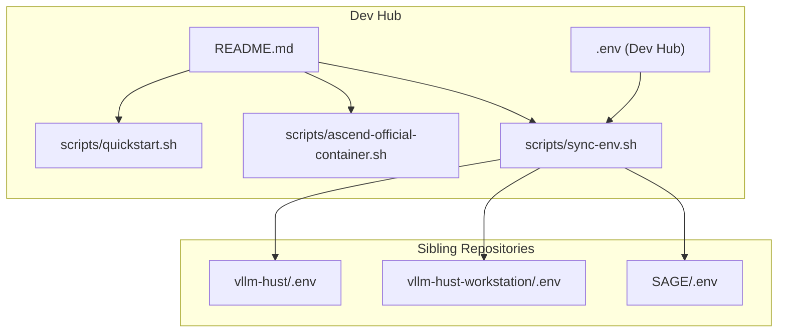
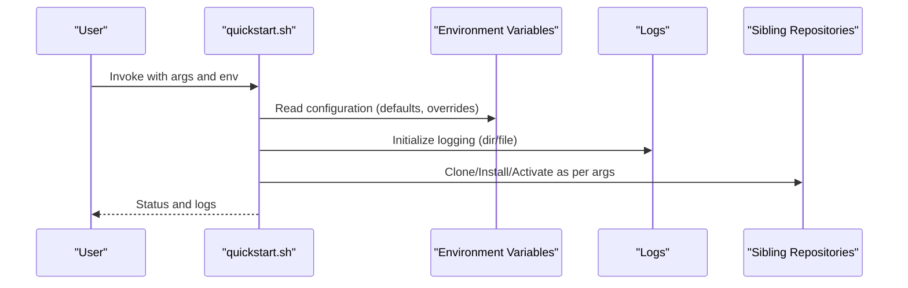
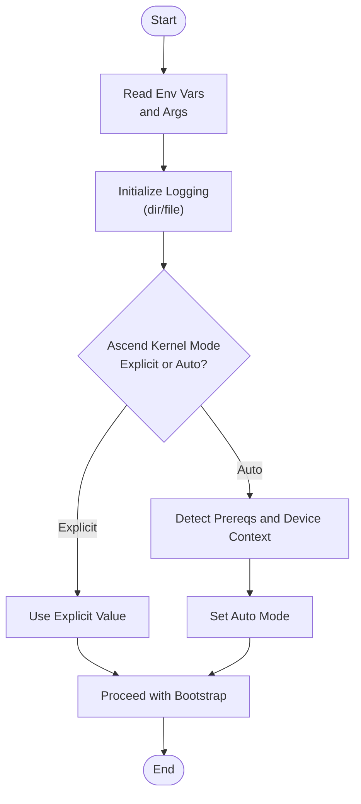
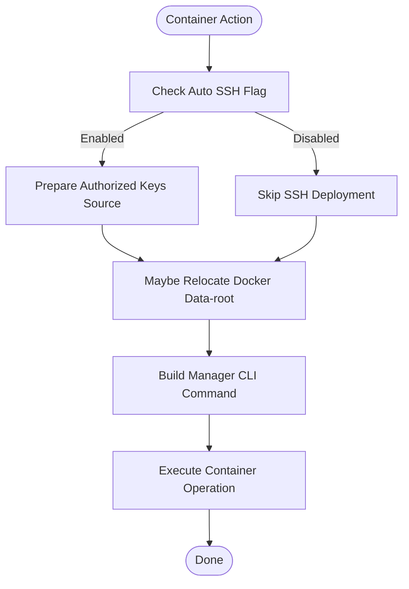
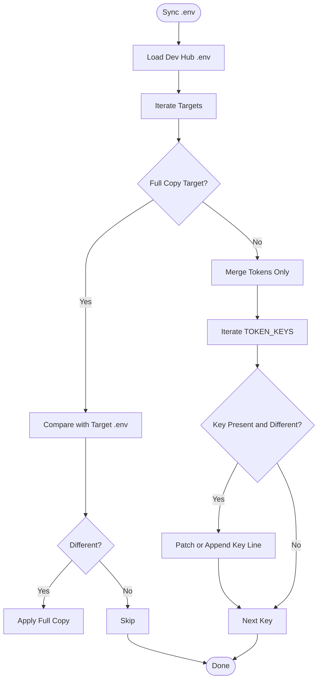
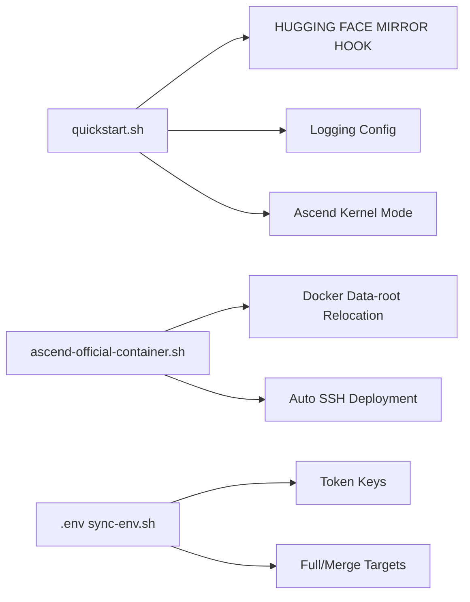

# Configuration Options

<cite>
**Referenced Files in This Document**
- [README.md](file://README.md)
- [quickstart.sh](file://scripts/quickstart.sh)
- [ascend-official-container.sh](file://scripts/ascend-official-container.sh)
- [sync-env.sh](file://scripts/sync-env.sh)
- [env-verify-after-quickstart.txt](file://env-verify-after-quickstart.txt)
</cite>

## Table of Contents
1. [Introduction](#introduction)
2. [Project Structure](#project-structure)
3. [Core Components](#core-components)
4. [Architecture Overview](#architecture-overview)
5. [Detailed Component Analysis](#detailed-component-analysis)
6. [Dependency Analysis](#dependency-analysis)
7. [Performance Considerations](#performance-considerations)
8. [Troubleshooting Guide](#troubleshooting-guide)
9. [Conclusion](#conclusion)
10. [Appendices](#appendices)

## Introduction
This document describes configuration options for the VLLM-HUST Development Hub. It covers environment variables, script arguments, and runtime behaviors that influence how the development environment is bootstrapped, maintained, and used for Ascend-enabled workflows. It also documents configuration precedence, validation rules, and verification procedures to ensure reliable setups across machines and CI contexts.

## Project Structure
The Dev Hub centralizes configuration and automation around a small set of scripts and a shared environment token file (.env). Key configuration surfaces include:
- Environment variables consumed by scripts
- Command-line arguments for quickstart and container scripts
- Shared .env propagation to sibling repositories
- Logging and cache locations controlled by environment variables

**Diagram sources**
- [README.md:1-288](file://README.md#L1-L288)
- [quickstart.sh:1-800](file://scripts/quickstart.sh#L1-L800)
- [ascend-official-container.sh:1-388](file://scripts/ascend-official-container.sh#L1-L388)
- [sync-env.sh:1-129](file://scripts/sync-env.sh#L1-L129)

**Section sources**
- [README.md:1-288](file://README.md#L1-L288)

## Core Components
This section enumerates configuration options surfaced by scripts and documented in the repository. For each option, we describe its purpose, default value, acceptable range or constraints, and impact on system behavior.

- Environment variables for quickstart
  - HUST_DEV_HUB_UPDATE_BASHRC
    - Purpose: Enable writing conda auto-activation into ~/.bashrc.
    - Default: Not set (disabled).
    - Acceptable values: 0 or 1.
    - Impact: Controls whether interactive shells auto-activate the selected conda environment.
    - Source: [quickstart.sh:108-110](file://scripts/quickstart.sh#L108-L110)
  - HUST_DEV_HUB_DISABLE_HF_MIRROR_AUTOSET
    - Purpose: Disable automatic mirror endpoint setting for Hugging Face clients.
    - Default: Not set (auto-set enabled).
    - Acceptable values: 0 or 1.
    - Impact: Preserves or restores HF_ENDPOINT during conda activation hooks.
    - Source: [README.md:120-126](file://README.md#L120-L126)
  - HUST_DEV_HUB_ENABLE_MANAGER_ENV_HOOK
    - Purpose: Allow applying Ascend runtime variables from the manager during conda activation.
    - Default: Not set (disabled).
    - Acceptable values: 0 or 1.
    - Impact: Extends environment export behavior during shell activation.
    - Source: [README.md:130-136](file://README.md#L130-L136)
  - HUST_DEV_HUB_QUICKSTART_LOG_DIR
    - Purpose: Directory for quickstart logs.
    - Default: ~/.cache/vllm-hust-dev-hub/logs.
    - Acceptable values: Path string.
    - Impact: Controls where quickstart writes timestamped logs.
    - Source: [README.md:142](file://README.md#L142)
  - HUST_DEV_HUB_QUICKSTART_LOG_FILE
    - Purpose: Specific log filename for quickstart.
    - Default: Empty (auto-generated).
    - Acceptable values: Path string.
    - Impact: Overrides default log filename.
    - Source: [README.md:142](file://README.md#L142)
  - HUST_DEV_HUB_APPLY_ASCEND_SYSTEM_STEPS
    - Purpose: Permit quickstart to invoke system-level steps via the Ascend manager.
    - Default: Not set (disabled).
    - Acceptable values: 0 or 1.
    - Impact: Enables privileged operations during setup.
    - Source: [README.md:155](file://README.md#L155)
  - HUST_DEV_HUB_ASCEND_COMPILE_CUSTOM_KERNELS
    - Purpose: Explicitly control Ascend plugin custom kernel compilation mode.
    - Default: Auto-detected based on prerequisites and device context.
    - Acceptable values: 0 (lightweight) or 1 (compile).
    - Impact: Selects plugin installation mode for vllm-ascend-hust.
    - Source: [quickstart.sh:433-451](file://scripts/quickstart.sh#L433-L451), [quickstart.sh:469-471](file://scripts/quickstart.sh#L469-L471)
  - VLLM_HUST_CONTAINER_PUBKEY
    - Purpose: Provide an SSH public key for container access during quickstart.
    - Default: Not set.
    - Acceptable values: Valid SSH public key string.
    - Impact: Pre-seeds authorized_keys for container SSH without prompting.
    - Source: [quickstart.sh:239-249](file://scripts/quickstart.sh#L239-L249)
  - VLLM_HUST_AUTO_ENABLE_CONTAINER_SSH
    - Purpose: Control automatic container SSH configuration.
    - Default: 1.
    - Acceptable values: 0 or 1.
    - Impact: Enables or disables automatic deployment of host SSH keys into the container.
    - Source: [ascend-official-container.sh:22](file://scripts/ascend-official-container.sh#L22)
  - VLLM_HUST_AUTO_RELOCATE_DOCKER
    - Purpose: Permit automatic relocation of Docker data-root to /data/docker.
    - Default: Not set (disabled).
    - Acceptable values: 0 or 1.
    - Impact: Allows migration when host Docker root has insufficient space.
    - Source: [ascend-official-container.sh:161-165](file://scripts/ascend-official-container.sh#L161-L165)
  - VLLM_HUST_ASCEND_CONTAINER_NON_INTERACTIVE
    - Purpose: Run container operations without interactive prompts.
    - Default: Not set (disabled).
    - Acceptable values: 0 or 1.
    - Impact: Suppresses interactive confirmation for container actions.
    - Source: [ascend-official-container.sh:378-380](file://scripts/ascend-official-container.sh#L378-L380)

- Command-line arguments for quickstart
  - --clone
    - Purpose: Sync workspace repositories.
    - Default: Disabled.
    - Impact: Clones or updates sibling repos.
    - Source: [quickstart.sh:117](file://scripts/quickstart.sh#L117)
  - --conda
    - Purpose: Create or update the conda environment.
    - Default: Disabled.
    - Impact: Sets up Python stack and channels.
    - Source: [quickstart.sh:118](file://scripts/quickstart.sh#L118)
  - --install
    - Purpose: Install local repositories into the environment.
    - Default: Disabled.
    - Impact: Installs editable packages for core or full scope.
    - Source: [quickstart.sh:119](file://scripts/quickstart.sh#L119)
  - --install-mode MODE
    - Purpose: Choose install or refresh mode.
    - Default: install.
    - Acceptable values: install or refresh.
    - Impact: Controls whether packages are reinstalled or skipped.
    - Source: [quickstart.sh:120](file://scripts/quickstart.sh#L120)
  - --install-scope SCOPE
    - Purpose: Choose core or full install scope.
    - Default: core.
    - Acceptable values: core or full.
    - Impact: Expands installation breadth.
    - Source: [quickstart.sh:121](file://scripts/quickstart.sh#L121)
  - --ascend-lightweight
    - Purpose: Force lightweight Ascend plugin mode (equivalent to COMPILE_CUSTOM_KERNELS=0).
    - Default: Disabled.
    - Impact: Skips custom kernel compilation.
    - Source: [quickstart.sh:122-124](file://scripts/quickstart.sh#L122-L124)
  - --ascend-custom-kernels VALUE
    - Purpose: Explicitly set Ascend plugin COMPILE_CUSTOM_KERNELS value.
    - Default: Auto-detected.
    - Acceptable values: 0 or 1.
    - Impact: Overrides auto-selection.
    - Source: [quickstart.sh:123-124](file://scripts/quickstart.sh#L123-L124)
  - --all
    - Purpose: Perform clone + conda + install(core).
    - Default: Disabled.
    - Impact: One-shot bootstrap.
    - Source: [quickstart.sh:125](file://scripts/quickstart.sh#L125)
  - --env-name NAME
    - Purpose: Set conda environment name.
    - Default: vllm-hust-dev.
    - Acceptable values: String.
    - Impact: Names the target environment.
    - Source: [quickstart.sh:126](file://scripts/quickstart.sh#L126)
  - --python VERSION
    - Purpose: Set Python version for the environment.
    - Default: 3.11.
    - Acceptable values: Version string.
    - Impact: Creates environment with specified Python.
    - Source: [quickstart.sh:127](file://scripts/quickstart.sh#L127)
  - --update-bashrc
    - Purpose: Update ~/.bashrc to auto-activate the environment.
    - Default: Disabled.
    - Impact: Writes activation markers to shell config.
    - Source: [quickstart.sh:128](file://scripts/quickstart.sh#L128)
  - -y, --yes
    - Purpose: Non-interactive mode; accepts defaults and optional pubkey injection.
    - Default: Disabled.
    - Impact: Disables prompts and uses VLLM_HUST_CONTAINER_PUBKEY if provided.
    - Source: [quickstart.sh:129](file://scripts/quickstart.sh#L129)

- Container runtime configuration (ascend-official-container.sh)
  - IMAGE
    - Purpose: Pin a specific container image tag.
    - Default: Not set (auto-selected).
    - Acceptable values: Image reference string.
    - Impact: Overrides default official image selection.
    - Source: [ascend-official-container.sh:11](file://scripts/ascend-official-container.sh#L11)
  - CONTAINER_NAME
    - Purpose: Name of the persistent container.
    - Default: vllm-ascend-dev.
    - Acceptable values: String.
    - Impact: Reuses or creates a named container.
    - Source: [ascend-official-container.sh:12](file://scripts/ascend-official-container.sh#L12)
  - HOST_WORKSPACE_ROOT
    - Purpose: Host path containing the workspace and .ssh directory.
    - Default: Parent of Dev Hub root.
    - Acceptable values: Path string.
    - Impact: Mounts workspace into container.
    - Source: [ascend-official-container.sh:13](file://scripts/ascend-official-container.sh#L13)
  - CONTAINER_WORKSPACE_ROOT
    - Purpose: Container-side mount point for the workspace.
    - Default: /workspace.
    - Acceptable values: Path string.
    - Impact: Establishes container working root.
    - Source: [ascend-official-container.sh:14](file://scripts/ascend-official-container.sh#L14)
  - CONTAINER_WORKDIR
    - Purpose: Working directory inside the container.
    - Default: /workspace/vllm-hust-dev-hub.
    - Acceptable values: Path string.
    - Impact: Sets initial shell location.
    - Source: [ascend-official-container.sh:15](file://scripts/ascend-official-container.sh#L15)
  - HOST_CACHE_DIR
    - Purpose: Host cache directory to mount into container.
    - Default: ~/.
    - Acceptable values: Path string.
    - Impact: Shares caches across host/container.
    - Source: [ascend-official-container.sh:16](file://scripts/ascend-official-container.sh#L16)
  - SHM_SIZE
    - Purpose: Size of /dev/shm for the container.
    - Default: 16g.
    - Acceptable values: Size string (e.g., 16g, 32g).
    - Impact: Controls shared memory for ML workloads.
    - Source: [ascend-official-container.sh:17](file://scripts/ascend-official-container.sh#L17)
  - DEFAULT_CONTAINER_SSH_USER
    - Purpose: Username for container SSH access.
    - Default: shuhao.
    - Acceptable values: String.
    - Impact: Aligns container user with mounted workspace ownership.
    - Source: [ascend-official-container.sh:20](file://scripts/ascend-official-container.sh#L20)
  - DEFAULT_CONTAINER_SSH_PORT
    - Purpose: Port for container SSH access.
    - Default: 2222.
    - Acceptable values: Integer.
    - Impact: Enables ProxyJump-friendly SSH access.
    - Source: [ascend-official-container.sh:21](file://scripts/ascend-official-container.sh#L21)

- Shared .env propagation (sync-env.sh)
  - TOKEN_KEYS
    - Purpose: Keys synchronized from Dev Hub .env to target repos.
    - Default: List of secret/token keys.
    - Acceptable values: Subset of keys defined in TOKEN_KEYS.
    - Impact: Keeps tokens consistent across repos.
    - Source: [sync-env.sh:22-37](file://scripts/sync-env.sh#L22-L37)
  - FULL_COPY_TARGETS
    - Purpose: Repos receiving identical .env copy.
    - Default: SAGE.
    - Acceptable values: Paths to directories.
    - Impact: Ensures exact .env parity.
    - Source: [sync-env.sh:39-42](file://scripts/sync-env.sh#L39-L42)
  - MERGE_TARGETS
    - Purpose: Repos merging only token lines.
    - Default: vllm-hust-workstation.
    - Acceptable values: Paths to directories.
    - Impact: Preserves non-token settings in target .env.
    - Source: [sync-env.sh:44-47](file://scripts/sync-env.sh#L44-L47)

**Section sources**
- [quickstart.sh:108-135](file://scripts/quickstart.sh#L108-L135)
- [quickstart.sh:117-130](file://scripts/quickstart.sh#L117-L130)
- [quickstart.sh:433-471](file://scripts/quickstart.sh#L433-L471)
- [README.md:120-136](file://README.md#L120-L136)
- [README.md:142](file://README.md#L142)
- [README.md:155](file://README.md#L155)
- [ascend-official-container.sh:11-21](file://scripts/ascend-official-container.sh#L11-L21)
- [ascend-official-container.sh:378-380](file://scripts/ascend-official-container.sh#L378-L380)
- [sync-env.sh:22-47](file://scripts/sync-env.sh#L22-L47)

## Architecture Overview
The configuration architecture centers on environment variables and script arguments that orchestrate three primary areas:
- Environment bootstrap and maintenance (quickstart)
- Container lifecycle and SSH access (official container)
- Secret/token synchronization across repositories (.env propagation)

**Diagram sources**
- [quickstart.sh:108-135](file://scripts/quickstart.sh#L108-L135)
- [quickstart.sh:191-208](file://scripts/quickstart.sh#L191-L208)
- [README.md:142](file://README.md#L142)

## Detailed Component Analysis

### Quickstart Configuration Flow
This flow shows how quickstart resolves configuration from environment variables and arguments, initializes logging, and selects Ascend kernel compilation mode.

**Diagram sources**
- [quickstart.sh:108-135](file://scripts/quickstart.sh#L108-L135)
- [quickstart.sh:191-208](file://scripts/quickstart.sh#L191-L208)
- [quickstart.sh:433-451](file://scripts/quickstart.sh#L433-L451)
- [quickstart.sh:469-471](file://scripts/quickstart.sh#L469-L471)

**Section sources**
- [quickstart.sh:108-135](file://scripts/quickstart.sh#L108-L135)
- [quickstart.sh:191-208](file://scripts/quickstart.sh#L191-L208)
- [quickstart.sh:433-471](file://scripts/quickstart.sh#L433-L471)

### Container Configuration Flow
Container configuration is driven by environment variables and optional arguments. It includes optional Docker data-root relocation and automatic SSH key provisioning.

**Diagram sources**
- [ascend-official-container.sh:303-328](file://scripts/ascend-official-container.sh#L303-L328)
- [ascend-official-container.sh:108-217](file://scripts/ascend-official-container.sh#L108-L217)
- [ascend-official-container.sh:362-386](file://scripts/ascend-official-container.sh#L362-L386)

**Section sources**
- [ascend-official-container.sh:303-328](file://scripts/ascend-official-container.sh#L303-L328)
- [ascend-official-container.sh:108-217](file://scripts/ascend-official-container.sh#L108-L217)
- [ascend-official-container.sh:362-386](file://scripts/ascend-official-container.sh#L362-L386)

### .env Propagation Flow
The .env propagation script synchronizes tokens from the Dev Hub .env to sibling repositories, performing either full copy or targeted token line patching.

**Diagram sources**
- [sync-env.sh:49-52](file://scripts/sync-env.sh#L49-L52)
- [sync-env.sh:57-75](file://scripts/sync-env.sh#L57-L75)
- [sync-env.sh:79-121](file://scripts/sync-env.sh#L79-L121)

**Section sources**
- [sync-env.sh:49-52](file://scripts/sync-env.sh#L49-L52)
- [sync-env.sh:57-75](file://scripts/sync-env.sh#L57-L75)
- [sync-env.sh:79-121](file://scripts/sync-env.sh#L79-L121)

## Dependency Analysis
Configuration dependencies among scripts and environment variables:

**Diagram sources**
- [README.md:120-136](file://README.md#L120-L136)
- [README.md:142](file://README.md#L142)
- [quickstart.sh:433-471](file://scripts/quickstart.sh#L433-L471)
- [ascend-official-container.sh:108-217](file://scripts/ascend-official-container.sh#L108-L217)
- [ascend-official-container.sh:303-328](file://scripts/ascend-official-container.sh#L303-L328)
- [sync-env.sh:22-47](file://scripts/sync-env.sh#L22-L47)

**Section sources**
- [README.md:120-136](file://README.md#L120-L136)
- [README.md:142](file://README.md#L142)
- [quickstart.sh:433-471](file://scripts/quickstart.sh#L433-L471)
- [ascend-official-container.sh:108-217](file://scripts/ascend-official-container.sh#L108-L217)
- [ascend-official-container.sh:303-328](file://scripts/ascend-official-container.sh#L303-L328)
- [sync-env.sh:22-47](file://scripts/sync-env.sh#L22-L47)

## Performance Considerations
- Ascend kernel compilation mode
  - Lightweight mode reduces build overhead and avoids custom kernel compilation.
  - Compile mode enables richer kernels but increases setup time and requires build tools.
  - Reference: [quickstart.sh:433-471](file://scripts/quickstart.sh#L433-L471)
- Docker data-root relocation
  - Moving Docker images to a larger disk improves reliability for large pulls and builds.
  - Reference: [ascend-official-container.sh:108-217](file://scripts/ascend-official-container.sh#L108-L217)
- Logging and caching
  - Centralized log directory and cache paths minimize IO contention and improve traceability.
  - Reference: [README.md:142](file://README.md#L142)

[No sources needed since this section provides general guidance]

## Troubleshooting Guide
- Validation and verification
  - Conda environment activation and mirror endpoint behavior are validated by the quickstart hook.
  - Reference: [README.md:120-126](file://README.md#L120-L126)
- Environment token mismatches
  - Use the .env sync script to compare and patch token lines across repositories.
  - Reference: [sync-env.sh:96-121](file://scripts/sync-env.sh#L96-L121)
- Post-bootstrap environment diagnostics
  - Review environment verification logs for package presence and module availability.
  - Reference: [env-verify-after-quickstart.txt:24-33](file://env-verify-after-quickstart.txt#L24-L33)

**Section sources**
- [README.md:120-126](file://README.md#L120-L126)
- [sync-env.sh:96-121](file://scripts/sync-env.sh#L96-L121)
- [env-verify-after-quickstart.txt:24-33](file://env-verify-after-quickstart.txt#L24-L33)

## Conclusion
The VLLM-HUST Development Hub exposes configuration through environment variables and script arguments to streamline environment setup, container operations, and secret synchronization. By understanding defaults, acceptable values, and precedence, teams can tailor configurations for diverse hardware and CI environments while maintaining consistency and reproducibility.

[No sources needed since this section summarizes without analyzing specific files]

## Appendices

### Configuration Precedence and Overrides
- Environment variables override defaults when set.
- Command-line arguments take effect during script invocation.
- .env synchronization prioritizes Dev Hub .env as the single source of truth for tokens.
- References:
  - [quickstart.sh:108-135](file://scripts/quickstart.sh#L108-L135)
  - [ascend-official-container.sh:11-21](file://scripts/ascend-official-container.sh#L11-L21)
  - [sync-env.sh:22-47](file://scripts/sync-env.sh#L22-L47)

**Section sources**
- [quickstart.sh:108-135](file://scripts/quickstart.sh#L108-L135)
- [ascend-official-container.sh:11-21](file://scripts/ascend-official-container.sh#L11-L21)
- [sync-env.sh:22-47](file://scripts/sync-env.sh#L22-L47)