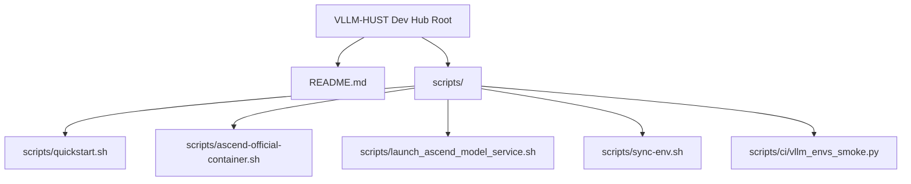
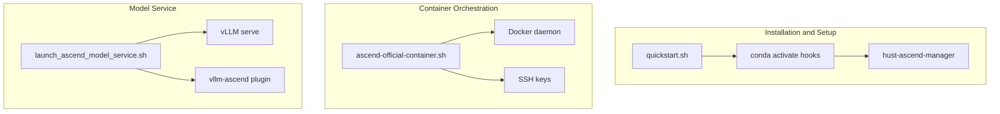
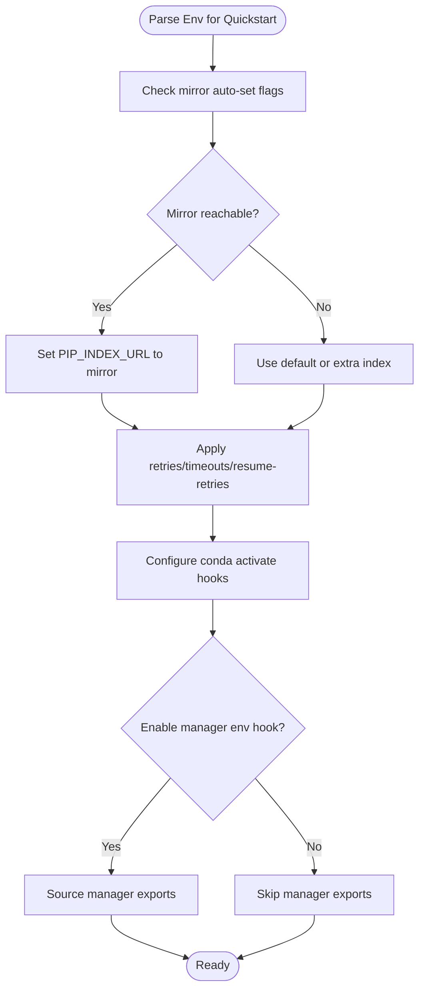
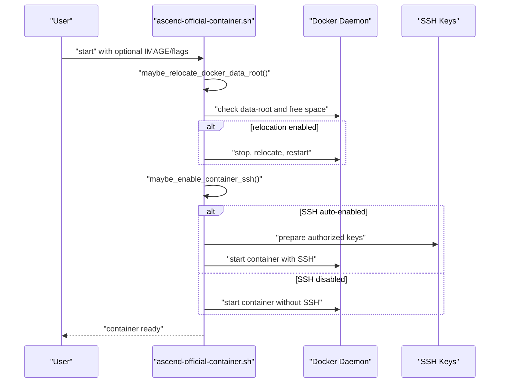
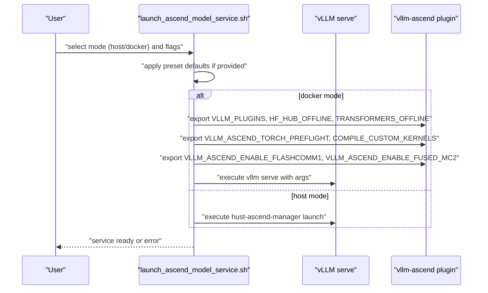
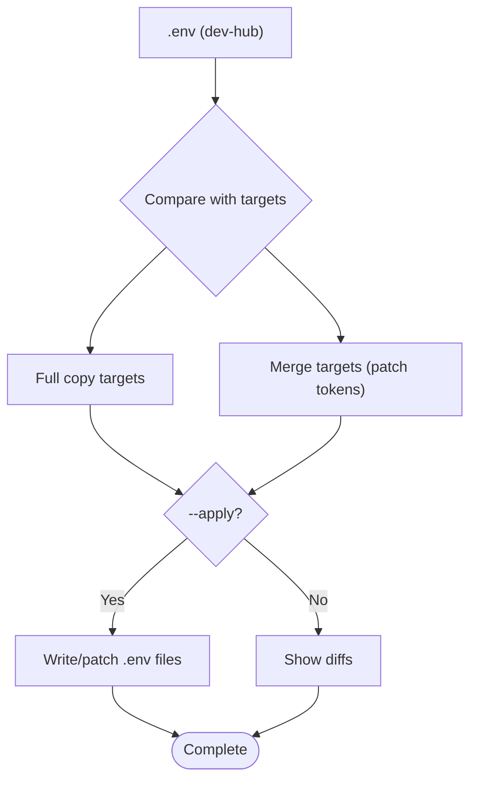
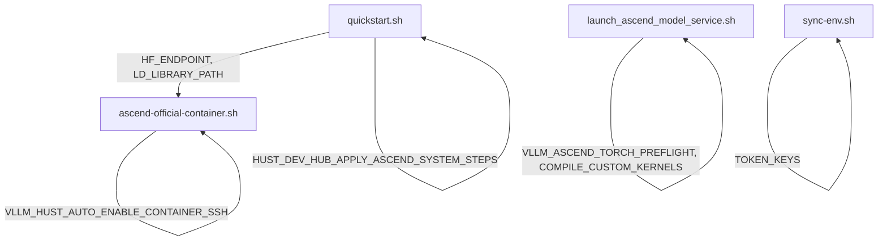

# Environment Variables

<cite>
**Referenced Files in This Document**
- [README.md](file://README.md)
- [scripts/quickstart.sh](file://scripts/quickstart.sh)
- [scripts/ascend-official-container.sh](file://scripts/ascend-official-container.sh)
- [scripts/launch_ascend_model_service.sh](file://scripts/launch_ascend_model_service.sh)
- [scripts/sync-env.sh](file://scripts/sync-env.sh)
- [scripts/ci/vllm_envs_smoke.py](file://scripts/ci/vllm_envs_smoke.py)
</cite>

## Table of Contents
1. [Introduction](#introduction)
2. [Project Structure](#project-structure)
3. [Core Components](#core-components)
4. [Architecture Overview](#architecture-overview)
5. [Detailed Component Analysis](#detailed-component-analysis)
6. [Dependency Analysis](#dependency-analysis)
7. [Performance Considerations](#performance-considerations)
8. [Troubleshooting Guide](#troubleshooting-guide)
9. [Conclusion](#conclusion)

## Introduction
This document provides a comprehensive environment variables reference for the VLLM-HUST Development Hub. It catalogs environment variables used across scripts for installation, container configuration, logging, debugging, and operational control. It explains default values, expected formats, precedence rules, validation requirements, and security considerations. The goal is to help developers and operators configure and troubleshoot the development and deployment workflows reliably.

## Project Structure
The repository organizes environment-sensitive logic primarily in Bash and Python scripts under the scripts/ directory, with documentation and CI helpers. The README outlines high-level usage and environment-related behaviors.

**Diagram sources**
- [README.md:1-288](file://README.md#L1-L288)
- [scripts/quickstart.sh:1-2732](file://scripts/quickstart.sh#L1-L2732)
- [scripts/ascend-official-container.sh:1-388](file://scripts/ascend-official-container.sh#L1-L388)
- [scripts/launch_ascend_model_service.sh:1-680](file://scripts/launch_ascend_model_service.sh#L1-L680)
- [scripts/sync-env.sh:1-129](file://scripts/sync-env.sh#L1-L129)
- [scripts/ci/vllm_envs_smoke.py:1-69](file://scripts/ci/vllm_envs_smoke.py#L1-L69)

**Section sources**
- [README.md:1-288](file://README.md#L1-L288)

## Core Components
This section enumerates environment variables grouped by category, their purposes, defaults, formats, and usage contexts.

- Installation and environment setup
  - HUST_DEV_HUB_UPDATE_BASHRC
    - Purpose: Control writing ~/.bashrc conda auto-activation entries.
    - Default: Not set (treated as 0).
    - Format: Integer 0 or 1.
    - Usage: quickstart.sh honors this to update ~/.bashrc.
    - Validation: Non-empty values are treated as truthy.
    - Security: None.
  - HUST_DEV_HUB_DISABLE_HF_MIRROR_AUTOSET
    - Purpose: Disable automatic HF_ENDPOINT switching to a mirror.
    - Default: Not set (mirror auto-set enabled).
    - Format: Integer 0 or 1.
    - Usage: quickstart.sh conda activate hook sets HF_ENDPOINT based on reachability.
    - Validation: Non-empty values are treated as truthy.
    - Security: None.
  - HUST_DEV_HUB_ENABLE_MANAGER_ENV_HOOK
    - Purpose: Apply manager-provided environment exports during conda activate.
    - Default: Not set (disabled).
    - Format: Integer 0 or 1.
    - Usage: quickstart.sh conda activate hook conditionally sources manager exports.
    - Validation: Non-empty values are treated as truthy.
    - Security: None.
  - HUST_DEV_HUB_APPLY_ASCEND_SYSTEM_STEPS
    - Purpose: Allow quickstart to apply system-level Ascend setup steps.
    - Default: Not set (user-space only).
    - Format: Integer 0 or 1.
    - Usage: quickstart.sh reconciles Ascend runtime; opt-in enables system changes.
    - Validation: Non-empty values are treated as truthy.
    - Security: Elevated privileges may be required; use cautiously.
  - HUST_DEV_HUB_SKIP_ASCEND_SYSTEM_APPLY
    - Purpose: Skip applying system-level steps even if opt-in is set.
    - Default: Not set.
    - Format: Integer 0 or 1.
    - Usage: quickstart.sh respects this to override opt-in.
    - Validation: Non-empty values are treated as truthy.
    - Security: Same as above.
  - HUST_DEV_HUB_ASCEND_COMPILE_CUSTOM_KERNELS
    - Purpose: Explicitly set Ascend plugin custom kernel mode.
    - Default: Determined by runtime checks; can be overridden.
    - Format: Integer 0 or 1.
    - Usage: quickstart.sh selects COMPILE_CUSTOM_KERNELS based on this and other factors.
    - Validation: Must be 0 or 1 when set.
    - Security: None.
  - HUST_DEV_HUB_QUICKSTART_LOG_DIR
    - Purpose: Directory for quickstart logs.
    - Default: ~/.cache/vllm-hust-dev-hub/logs.
    - Format: Absolute path.
    - Usage: quickstart.sh initializes logging to this directory.
    - Validation: Must be writable.
    - Security: None.
  - HUST_DEV_HUB_QUICKSTART_LOG_FILE
    - Purpose: Specific log filename for quickstart.
    - Default: Not set (auto-generated).
    - Format: Path.
    - Usage: quickstart.sh writes to this file if provided.
    - Validation: Must be writable path.
    - Security: None.
  - HUST_DEV_HUB_PIP_INDEX_URL, HUST_DEV_HUB_PIP_EXTRA_INDEX_URL
    - Purpose: Configure pip index URLs for quickstart installs.
    - Default: Not set (use mirrors if reachable).
    - Format: URL or empty.
    - Usage: quickstart.sh reads these to set PIP_INDEX_URL/PIP_EXTRA_INDEX_URL.
    - Validation: Must be valid URLs when set.
    - Security: None.
  - HUST_DEV_HUB_PIP_MIRROR_URL
    - Purpose: Mirror base URL for pip index.
    - Default: Internal mirror URL constant.
    - Format: URL.
    - Usage: quickstart.sh probes mirror reachability.
    - Validation: Must be valid URL.
    - Security: None.
  - HUST_DEV_HUB_PIP_MIRROR_TIMEOUT
    - Purpose: Timeout for mirror probing.
    - Default: Positive integer.
    - Format: Integer > 0.
    - Usage: quickstart.sh uses this for curl timeouts.
    - Validation: Must be positive integer.
    - Security: None.
  - HUST_DEV_HUB_PIP_RETRIES, HUST_DEV_HUB_PIP_TIMEOUT, HUST_DEV_HUB_PIP_RESUME_RETRIES
    - Purpose: pip install tuning for quickstart.
    - Default: Positive integers.
    - Format: Integers > 0.
    - Usage: quickstart.sh sets pip install options.
    - Validation: Must be positive integers.
    - Security: None.
  - HUST_DEV_HUB_DISABLE_PYPI_MIRROR_AUTOSET
    - Purpose: Disable automatic mirror selection.
    - Default: Not set.
    - Format: Integer 0 or 1.
    - Usage: quickstart.sh respects this to bypass mirror auto-selection.
    - Validation: Non-empty values are treated as truthy.
    - Security: None.

- Container configuration
  - IMAGE
    - Purpose: Pin container image for official Ascend container workflow.
    - Default: Not set (interactive selection).
    - Format: Image reference.
    - Usage: ascend-official-container.sh uses this to start/reuse container.
    - Validation: Must be valid image reference.
    - Security: None.
  - CONTAINER_NAME
    - Purpose: Persistent container name.
    - Default: vllm-ascend-dev.
    - Format: String.
    - Usage: ascend-official-container.sh manages this container.
    - Validation: Must be valid container name.
    - Security: None.
  - HOST_WORKSPACE_ROOT
    - Purpose: Host workspace root path for mounting.
    - Default: Workspace root.
    - Format: Absolute path.
    - Usage: ascend-official-container.sh mounts this into container.
    - Validation: Must be existing directory.
    - Security: None.
  - CONTAINER_WORKSPACE_ROOT
    - Purpose: Container workspace mount point.
    - Default: /workspace.
    - Format: Absolute path.
    - Usage: ascend-official-container.sh sets mount path.
    - Validation: Must be absolute path.
    - Security: None.
  - CONTAINER_WORKDIR
    - Purpose: Working directory inside container.
    - Default: /workspace/vllm-hust-dev-hub.
    - Format: Absolute path.
    - Usage: ascend-official-container.sh sets working directory.
    - Validation: Must be absolute path.
    - Security: None.
  - HOST_CACHE_DIR
    - Purpose: Host cache directory for mounts.
    - Default: ~/.
    - Format: Absolute path.
    - Usage: ascend-official-container.sh mounts cache.
    - Validation: Must be writable path.
    - Security: None.
  - SHM_SIZE
    - Purpose: Shared memory size for container.
    - Default: 16g.
    - Format: Size with unit.
    - Usage: ascend-official-container.sh passes to container runtime.
    - Validation: Must be valid size string.
    - Security: None.
  - DEFAULT_DOCKER_DATA_ROOT
    - Purpose: Target Docker data-root for relocation.
    - Default: /data/docker.
    - Format: Absolute path.
    - Usage: ascend-official-container.sh relocates Docker data-root if needed.
    - Validation: Must be writable path.
    - Security: Elevated privileges required.
  - VLLM_HUST_AUTO_RELOCATE_DOCKER
    - Purpose: Enable automatic Docker data-root relocation.
    - Default: Not set (0).
    - Format: Integer 0 or 1.
    - Usage: ascend-official-container.sh checks this before relocating.
    - Validation: Non-empty values are treated as truthy.
    - Security: Elevated privileges required.
  - VLLM_HUST_AUTO_ENABLE_CONTAINER_SSH
    - Purpose: Enable automatic container SSH configuration.
    - Default: 1.
    - Format: Integer 0 or 1.
    - Usage: ascend-official-container.sh conditionally deploys SSH keys.
    - Validation: Non-empty values are treated as truthy.
    - Security: None.
  - VLLM_HUST_ASCEND_CONTAINER_NON_INTERACTIVE
    - Purpose: Run container commands non-interactively.
    - Default: Not set (0).
    - Format: Integer 0 or 1.
    - Usage: ascend-official-container.sh passes this to manager CLI.
    - Validation: Non-empty values are treated as truthy.
    - Security: None.

- Logging and debugging
  - HUST_DEV_HUB_QUICKSTART_LOG_DIR, HUST_DEV_HUB_QUICKSTART_LOG_FILE
    - Purpose: Quickstart log location and filename.
    - Default: See above.
    - Format: Paths.
    - Usage: quickstart.sh initializes logging.
    - Validation: Must be writable.
    - Security: None.
  - VLLM_PORT
    - Purpose: Port for vLLM service.
    - Default: Not set (None).
    - Format: Integer > 0.
    - Usage: CI smoke test validates parsing and validation.
    - Validation: Must be valid integer; rejects URIs.
    - Security: None.

- Ascend runtime and model service
  - CONDA_ENV
    - Purpose: Conda environment name for model service.
    - Default: vllm-hust-dev.
    - Format: String.
    - Usage: launch_ascend_model_service.sh sets this for host mode.
    - Validation: Must be existing environment.
    - Security: None.
  - MODEL_ID
    - Purpose: Model identifier or path.
    - Default: Qwen/Qwen3-235B-A22B-Instruct-2507.
    - Format: String.
    - Usage: launch_ascend_model_service.sh uses this to select model.
    - Validation: Must be valid model identifier or path.
    - Security: None.
  - HOST, PORT
    - Purpose: Bind host and port for model service.
    - Default: 0.0.0.0, 8000.
    - Format: Host string, port number.
    - Usage: launch_ascend_model_service.sh binds service.
    - Validation: Host must be resolvable; port must be valid.
    - Security: None.
  - SERVED_MODEL_NAME
    - Purpose: Human-readable model name.
    - Default: qwen3-235b-a22b-8npu.
    - Format: String.
    - Usage: launch_ascend_model_service.sh sets served model name.
    - Validation: Must be valid string.
    - Security: None.
  - TP_SIZE
    - Purpose: Tensor parallel size.
    - Default: 8.
    - Format: Integer > 0.
    - Usage: launch_ascend_model_service.sh sets tensor parallelism.
    - Validation: Must be positive integer.
    - Security: None.
  - MAX_MODEL_LEN
    - Purpose: Maximum model length.
    - Default: 40960.
    - Format: Integer > 0.
    - Usage: launch_ascend_model_service.sh sets max length.
    - Validation: Must be positive integer.
    - Security: None.
  - GPU_MEM_UTIL
    - Purpose: GPU/NPU memory utilization ratio.
    - Default: 0.9.
    - Format: Float in (0, 1].
    - Usage: launch_ascend_model_service.sh sets memory utilization.
    - Validation: Must be in range.
    - Security: None.
  - DTYPE
    - Purpose: Data type for model.
    - Default: bfloat16.
    - Format: String.
    - Usage: launch_ascend_model_service.sh sets dtype.
    - Validation: Must be valid dtype string.
    - Security: None.
  - LOAD_FORMAT
    - Purpose: Load format for model.
    - Default: auto.
    - Format: String.
    - Usage: launch_ascend_model_service.sh sets load format.
    - Validation: Must be valid format string.
    - Security: None.
  - QUANTIZATION
    - Purpose: Quantization method (e.g., ascend for W8A8).
    - Default: Not set.
    - Format: String.
    - Usage: launch_ascend_model_service.sh sets quantization.
    - Validation: Must be valid method string.
    - Security: None.
  - MAX_NUM_SEQS
    - Purpose: Maximum concurrent sequences.
    - Default: 16.
    - Format: Integer > 0.
    - Usage: launch_ascend_model_service.sh sets concurrency.
    - Validation: Must be positive integer.
    - Security: None.
  - MAX_NUM_BATCHED_TOKENS
    - Purpose: Maximum batched tokens.
    - Default: 4096.
    - Format: Integer > 0.
    - Usage: launch_ascend_model_service.sh sets batching limit.
    - Validation: Must be positive integer.
    - Security: None.
  - LOG_FILE
    - Purpose: Log file path for model service.
    - Default: Auto-generated in /tmp.
    - Format: Path.
    - Usage: launch_ascend_model_service.sh writes logs.
    - Validation: Must be writable path.
    - Security: None.
  - HEALTH_TIMEOUT_SEC, HEALTH_INTERVAL_SEC
    - Purpose: Health check timing.
    - Default: 1800, 5.
    - Format: Integers > 0.
    - Usage: launch_ascend_model_service.sh waits for health endpoint.
    - Validation: Must be positive integers.
    - Security: None.
  - ENFORCE_EAGER, ENABLE_PREFIX_CACHING, ENABLE_CHUNKED_PREFILL
    - Purpose: Runtime behavior toggles.
    - Default: 0, 1, 1.
    - Format: Integer 0 or 1.
    - Usage: launch_ascend_model_service.sh conditionally passes flags.
    - Validation: Non-empty values are treated as truthy.
    - Security: None.
  - VLLM_PLUGINS
    - Purpose: vLLM plugins to enable.
    - Default: ascend.
    - Format: String.
    - Usage: launch_ascend_model_service.sh sets plugin.
    - Validation: Must be valid plugin string.
    - Security: None.
  - HF_HUB_OFFLINE, TRANSFORMERS_OFFLINE
    - Purpose: Offline mode flags.
    - Default: Not set.
    - Format: Integer 0 or 1.
    - Usage: launch_ascend_model_service.sh sets offline flags.
    - Validation: Non-empty values are treated as truthy.
    - Security: None.
  - VLLM_ASCEND_TORCH_PREFLIGHT
    - Purpose: Disable NPU preflight to avoid timeouts.
    - Default: 0.
    - Format: Integer 0 or 1.
    - Usage: launch_ascend_model_service.sh sets this environment variable.
    - Validation: Non-empty values are treated as truthy.
    - Security: None.
  - COMPILE_CUSTOM_KERNELS
    - Purpose: Compile Ascend custom kernels.
    - Default: 1.
    - Format: Integer 0 or 1.
    - Usage: launch_ascend_model_service.sh sets this for container mode.
    - Validation: Non-empty values are treated as truthy.
    - Security: None.
  - VLLM_ASCEND_ENABLE_FLASHCOMM1, VLLM_ASCEND_ENABLE_FUSED_MC2
    - Purpose: Enable FlashComm1 and fused MC2 optimizations.
    - Default: 1 and derived from model presets.
    - Format: Integer 0 or 1.
    - Usage: launch_ascend_model_service.sh sets these for container mode.
    - Validation: Non-empty values are treated as truthy.
    - Security: None.
  - HUST_ATB_SET_ENV
    - Purpose: Path to ATB environment script.
    - Default: Not set.
    - Format: Path.
    - Usage: launch_ascend_model_service.sh sources this if provided.
    - Validation: Must be readable file path.
    - Security: None.

- Secrets and tokens
  - GITHUB_TOKEN, HF_ENDPOINT, HF_TOKEN, PYPI_TOKEN, TAVILY_TOKEN, CLOUDFLARE_ACCOUNT_ID, CLOUDFLARE_ZONE_ID, CLOUDFLARE_EMAIL, CLOUDFLARE_GLOBAL_API_KEY, CLOUDFLARE_BOOTSTRAP_TOKEN, CLOUDFLARE_API_TOKEN, VLLM_HUST_API_BASE_URL, VLLM_HUST_API_KEY
    - Purpose: Tokens and credentials for various services.
    - Default: Not set.
    - Format: String values.
    - Usage: sync-env.sh synchronizes these from the dev-hub .env to target repos.
    - Validation: Must be valid token values for respective services.
    - Security: Treat as secrets; restrict access and rotation policies.

- SSH and container access
  - VLLM_HUST_CONTAINER_PUBKEY
    - Purpose: SSH public key for container access.
    - Default: Not set.
    - Format: SSH public key string.
    - Usage: quickstart.sh reads this to store authorized keys for container.
    - Validation: Must be valid SSH public key format.
    - Security: Treat as secret; restrict access.

**Section sources**
- [scripts/quickstart.sh:108-135](file://scripts/quickstart.sh#L108-L135)
- [scripts/quickstart.sh:91-93](file://scripts/quickstart.sh#L91-L93)
- [scripts/quickstart.sh:949-974](file://scripts/quickstart.sh#L949-L974)
- [scripts/quickstart.sh:976-1123](file://scripts/quickstart.sh#L976-L1123)
- [scripts/quickstart.sh:1125-1253](file://scripts/quickstart.sh#L1125-L1253)
- [scripts/quickstart.sh:1670-1730](file://scripts/quickstart.sh#L1670-L1730)
- [scripts/quickstart.sh:1764-1806](file://scripts/quickstart.sh#L1764-L1806)
- [scripts/quickstart.sh:2070-2413](file://scripts/quickstart.sh#L2070-L2413)
- [scripts/quickstart.sh:2415-2732](file://scripts/quickstart.sh#L2415-L2732)
- [scripts/ascend-official-container.sh:11-22](file://scripts/ascend-official-container.sh#L11-L22)
- [scripts/ascend-official-container.sh:108-217](file://scripts/ascend-official-container.sh#L108-L217)
- [scripts/ascend-official-container.sh:330-386](file://scripts/ascend-official-container.sh#L330-L386)
- [scripts/launch_ascend_model_service.sh:50-79](file://scripts/launch_ascend_model_service.sh#L50-L79)
- [scripts/launch_ascend_model_service.sh:390-500](file://scripts/launch_ascend_model_service.sh#L390-L500)
- [scripts/launch_ascend_model_service.sh:576-680](file://scripts/launch_ascend_model_service.sh#L576-L680)
- [scripts/sync-env.sh:22-37](file://scripts/sync-env.sh#L22-L37)
- [scripts/sync-env.sh:39-47](file://scripts/sync-env.sh#L39-L47)
- [scripts/ci/vllm_envs_smoke.py:53-63](file://scripts/ci/vllm_envs_smoke.py#L53-L63)

## Architecture Overview
The environment variable ecosystem spans three primary areas:
- Installation and environment setup: quickstart.sh orchestrates conda environments, mirrors, and runtime hooks.
- Container orchestration: ascend-official-container.sh manages container images, SSH, and Docker data-root relocation.
- Model service deployment: launch_ascend_model_service.sh configures vLLM and Ascend runtime for serving.

**Diagram sources**
- [scripts/quickstart.sh:2070-2413](file://scripts/quickstart.sh#L2070-L2413)
- [scripts/quickstart.sh:1764-1806](file://scripts/quickstart.sh#L1764-L1806)
- [scripts/ascend-official-container.sh:330-386](file://scripts/ascend-official-container.sh#L330-L386)
- [scripts/launch_ascend_model_service.sh:576-680](file://scripts/launch_ascend_model_service.sh#L576-L680)

## Detailed Component Analysis

### Installation and Environment Setup Variables
This component governs conda environment creation, mirror selection, and runtime library path adjustments.

**Diagram sources**
- [scripts/quickstart.sh:949-974](file://scripts/quickstart.sh#L949-L974)
- [scripts/quickstart.sh:976-1123](file://scripts/quickstart.sh#L976-L1123)
- [scripts/quickstart.sh:2070-2413](file://scripts/quickstart.sh#L2070-L2413)

Key variables and behaviors:
- Mirror selection and timeouts are controlled by HUST_DEV_HUB_PIP_* variables and defaults.
- Conda activate hooks adjust HOME/XDG paths and LD_LIBRARY_PATH, optionally sourcing manager exports.
- Ascend runtime reconciliation can apply system-level steps based on HUST_DEV_HUB_APPLY_ASCEND_SYSTEM_STEPS and HUST_DEV_HUB_SKIP_ASCEND_SYSTEM_APPLY.

Validation and error conditions:
- Invalid integer values for numeric variables cause immediate failure.
- Unreachable mirrors do not block installation; defaults are used.
- Missing manager exports are ignored gracefully.

Security considerations:
- Enabling system-level steps requires elevated privileges; review before setting HUST_DEV_HUB_APPLY_ASCEND_SYSTEM_STEPS.

**Section sources**
- [scripts/quickstart.sh:949-974](file://scripts/quickstart.sh#L949-L974)
- [scripts/quickstart.sh:976-1123](file://scripts/quickstart.sh#L976-L1123)
- [scripts/quickstart.sh:1764-1806](file://scripts/quickstart.sh#L1764-L1806)
- [scripts/quickstart.sh:2070-2413](file://scripts/quickstart.sh#L2070-L2413)

### Container Configuration Variables
This component manages container lifecycle, SSH access, and Docker data-root relocation.

**Diagram sources**
- [scripts/ascend-official-container.sh:108-217](file://scripts/ascend-official-container.sh#L108-L217)
- [scripts/ascend-official-container.sh:330-386](file://scripts/ascend-official-container.sh#L330-L386)

Key variables and behaviors:
- IMAGE pins the container image; CONTAINER_NAME persists the container.
- HOST_WORKSPACE_ROOT and CONTAINER_WORKSPACE_ROOT define mounts; CONTAINER_WORKDIR sets working directory.
- SHM_SIZE controls shared memory; HOST_CACHE_DIR defines cache mount.
- VLLM_HUST_AUTO_RELOCATE_DOCKER triggers Docker data-root relocation when space is insufficient.
- VLLM_HUST_AUTO_ENABLE_CONTAINER_SSH auto-deploys SSH keys if public keys are available.
- VLLM_HUST_ASCEND_CONTAINER_NON_INTERACTIVE switches manager CLI to non-interactive mode.

Validation and error conditions:
- Missing or unreachable mirrors do not prevent container operations.
- SSH auto-configuration requires at least one public key source.

Security considerations:
- Relocation of Docker data-root requires elevated privileges.
- SSH key management should restrict file permissions.

**Section sources**
- [scripts/ascend-official-container.sh:11-22](file://scripts/ascend-official-container.sh#L11-L22)
- [scripts/ascend-official-container.sh:108-217](file://scripts/ascend-official-container.sh#L108-L217)
- [scripts/ascend-official-container.sh:330-386](file://scripts/ascend-official-container.sh#L330-L386)

### Model Service Deployment Variables
This component configures vLLM serving with Ascend runtime and plugin settings.

**Diagram sources**
- [scripts/launch_ascend_model_service.sh:50-79](file://scripts/launch_ascend_model_service.sh#L50-L79)
- [scripts/launch_ascend_model_service.sh:390-500](file://scripts/launch_ascend_model_service.sh#L390-L500)
- [scripts/launch_ascend_model_service.sh:576-680](file://scripts/launch_ascend_model_service.sh#L576-L680)

Key variables and behaviors:
- Preset-driven defaults adjust model, TP size, max lengths, and flags.
- Docker mode injects plugin and offline flags; host mode uses manager CLI.
- Health checks and logging are configurable via LOG_FILE, HEALTH_TIMEOUT_SEC, HEALTH_INTERVAL_SEC.

Validation and error conditions:
- CI smoke test validates VLLM_PORT parsing and rejects invalid values (non-integers, URIs).

Security considerations:
- Plugin and offline flags can affect model loading behavior; ensure proper credentials and offline caches.

**Section sources**
- [scripts/launch_ascend_model_service.sh:50-79](file://scripts/launch_ascend_model_service.sh#L50-L79)
- [scripts/launch_ascend_model_service.sh:390-500](file://scripts/launch_ascend_model_service.sh#L390-L500)
- [scripts/launch_ascend_model_service.sh:576-680](file://scripts/launch_ascend_model_service.sh#L576-L680)
- [scripts/ci/vllm_envs_smoke.py:53-63](file://scripts/ci/vllm_envs_smoke.py#L53-L63)

### Secret and Token Management
This component synchronizes sensitive tokens from the dev-hub .env to sibling repositories.

**Diagram sources**
- [scripts/sync-env.sh:22-37](file://scripts/sync-env.sh#L22-L37)
- [scripts/sync-env.sh:39-47](file://scripts/sync-env.sh#L39-L47)
- [scripts/sync-env.sh:49-129](file://scripts/sync-env.sh#L49-L129)

Key variables and behaviors:
- TOKEN_KEYS lists exact keys managed by dev-hub .env.
- FULL_COPY_TARGETS receives identical .env copies.
- MERGE_TARGETS patch only token lines in-place.

Validation and error conditions:
- Missing source .env triggers an error.
- Targets without .env are warned and skipped.

Security considerations:
- Treat all listed tokens as secrets; restrict file permissions and rotation policies.

**Section sources**
- [scripts/sync-env.sh:22-37](file://scripts/sync-env.sh#L22-L37)
- [scripts/sync-env.sh:39-47](file://scripts/sync-env.sh#L39-L47)
- [scripts/sync-env.sh:49-129](file://scripts/sync-env.sh#L49-L129)

## Dependency Analysis
Environment variables influence each other across scripts, forming a dependency graph.

**Diagram sources**
- [scripts/quickstart.sh:2070-2413](file://scripts/quickstart.sh#L2070-L2413)
- [scripts/ascend-official-container.sh:108-217](file://scripts/ascend-official-container.sh#L108-L217)
- [scripts/launch_ascend_model_service.sh:390-500](file://scripts/launch_ascend_model_service.sh#L390-L500)
- [scripts/sync-env.sh:22-37](file://scripts/sync-env.sh#L22-L37)

Precedence and propagation rules:
- Variables set in the environment override defaults in scripts.
- quickstart.sh conda activate hooks preserve and restore user environment variables, ensuring deterministic behavior.
- Container and model service scripts inherit environment from the shell or container runtime.

**Section sources**
- [scripts/quickstart.sh:2070-2413](file://scripts/quickstart.sh#L2070-L2413)
- [scripts/ascend-official-container.sh:330-386](file://scripts/ascend-official-container.sh#L330-L386)
- [scripts/launch_ascend_model_service.sh:576-680](file://scripts/launch_ascend_model_service.sh#L576-L680)
- [scripts/sync-env.sh:49-129](file://scripts/sync-env.sh#L49-L129)

## Performance Considerations
- Mirror selection reduces network latency for pip installs; ensure HUST_DEV_HUB_PIP_MIRROR_URL is reachable.
- Disabling mirror auto-set (HUST_DEV_HUB_DISABLE_PYPI_MIRROR_AUTOSET) may increase install times.
- Enforcing eager mode (ENFORCE_EAGER) avoids CUDA graph capture overhead but may reduce performance for some workloads.
- Prefix caching and chunked prefill can improve throughput depending on workload characteristics.

[No sources needed since this section provides general guidance]

## Troubleshooting Guide
Common issues and resolutions:
- Invalid VLLM_PORT values
  - Symptom: ValueError indicating invalid integer or URI-like format.
  - Resolution: Set a valid integer > 0.
  - Reference: [scripts/ci/vllm_envs_smoke.py:53-63](file://scripts/ci/vllm_envs_smoke.py#L53-L63)
- SSH key problems in container
  - Symptom: Container SSH not configured.
  - Resolution: Ensure VLLM_HUST_AUTO_ENABLE_CONTAINER_SSH=1 and public keys are available; alternatively, provide VLLM_HUST_CONTAINER_PUBKEY.
  - Reference: [scripts/ascend-official-container.sh:303-328](file://scripts/ascend-official-container.sh#L303-L328)
- Docker data-root space issues
  - Symptom: Insufficient space for pulls.
  - Resolution: Enable VLLM_HUST_AUTO_RELOCATE_DOCKER=1 to relocate data-root to /data/docker.
  - Reference: [scripts/ascend-official-container.sh:108-217](file://scripts/ascend-official-container.sh#L108-L217)
- Conda environment activation failures
  - Symptom: LD_LIBRARY_PATH conflicts or missing manager exports.
  - Resolution: Review quickstart conda activate hooks; consider disabling manager env hook via HUST_DEV_HUB_ENABLE_MANAGER_ENV_HOOK=0.
  - Reference: [scripts/quickstart.sh:2070-2413](file://scripts/quickstart.sh#L2070-L2413)
- Model service health timeouts
  - Symptom: Health endpoint not ready within timeout.
  - Resolution: Increase HEALTH_TIMEOUT_SEC or adjust model/service configuration.
  - Reference: [scripts/launch_ascend_model_service.sh:649-679](file://scripts/launch_ascend_model_service.sh#L649-L679)

**Section sources**
- [scripts/ci/vllm_envs_smoke.py:53-63](file://scripts/ci/vllm_envs_smoke.py#L53-L63)
- [scripts/ascend-official-container.sh:108-217](file://scripts/ascend-official-container.sh#L108-L217)
- [scripts/quickstart.sh:2070-2413](file://scripts/quickstart.sh#L2070-L2413)
- [scripts/launch_ascend_model_service.sh:649-679](file://scripts/launch_ascend_model_service.sh#L649-L679)

## Conclusion
This environment variables reference consolidates configuration surfaces across installation, container orchestration, and model service deployment. By understanding defaults, formats, precedence, and validation rules, teams can reliably configure the VLLM-HUST Development Hub for diverse deployment environments. Adhering to security best practices—especially for tokens and privileged operations—ensures safe and maintainable workflows.