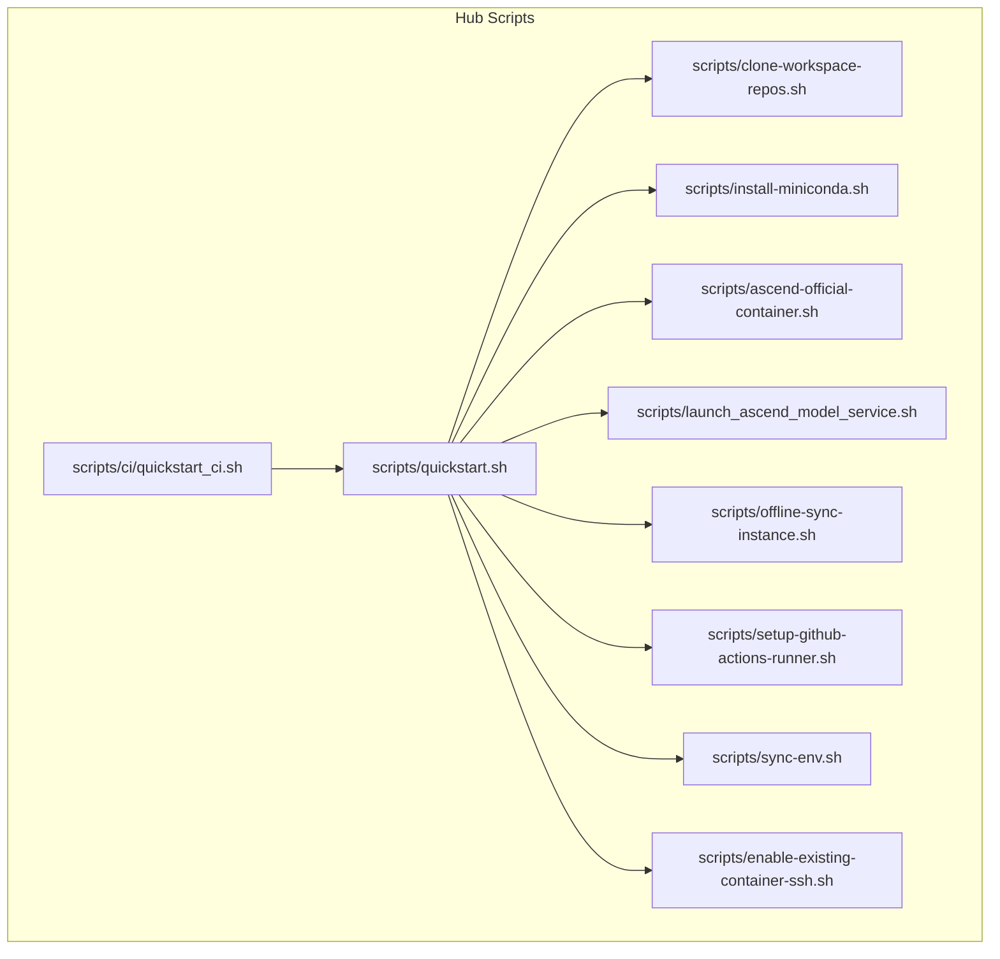
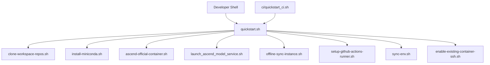
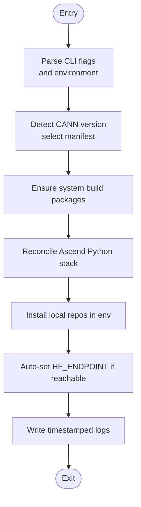
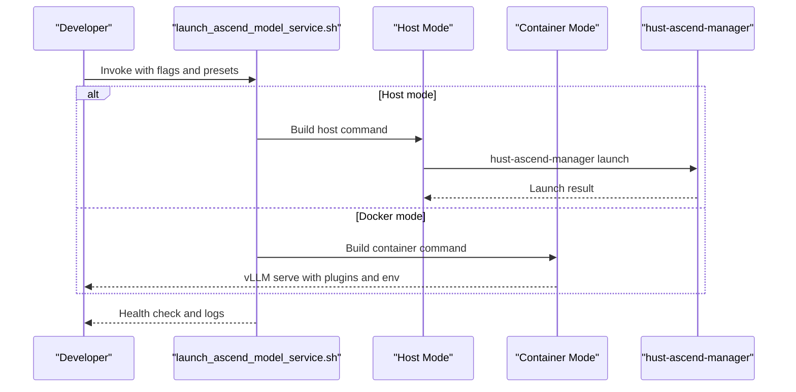
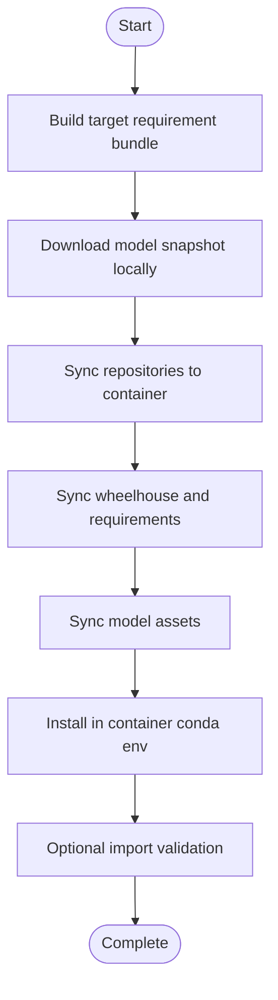
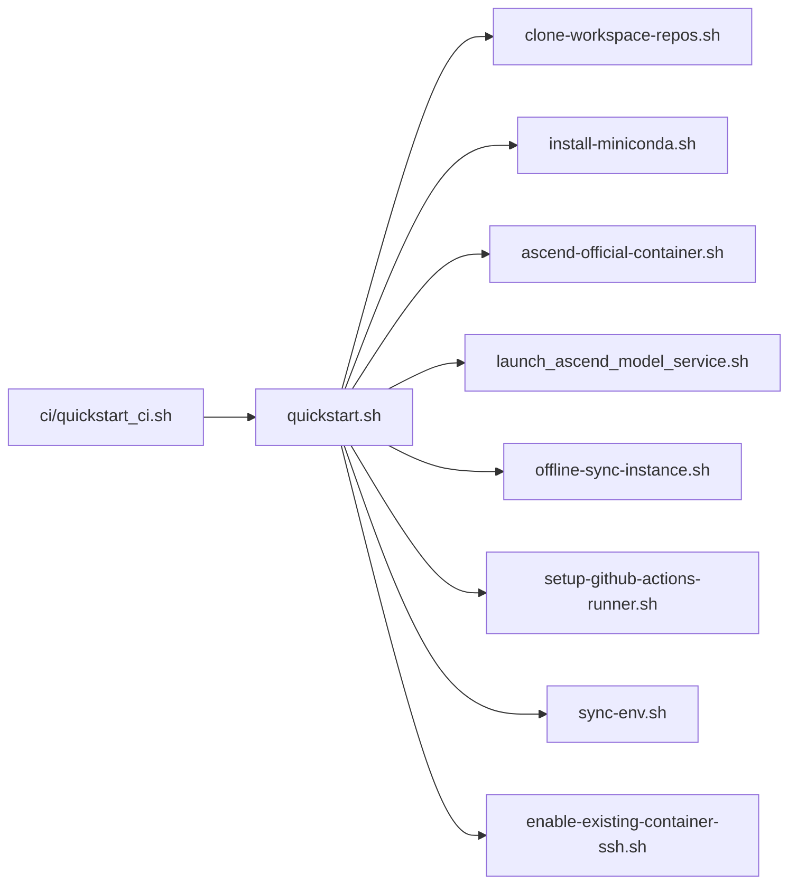

# Reference Materials

<cite>
**Referenced Files in This Document**
- [README.md](file://README.md)
- [ROADMAP.md](file://ROADMAP.md)
- [scripts/quickstart.sh](file://scripts/quickstart.sh)
- [scripts/clone-workspace-repos.sh](file://scripts/clone-workspace-repos.sh)
- [scripts/install-miniconda.sh](file://scripts/install-miniconda.sh)
- [scripts/ascend-official-container.sh](file://scripts/ascend-official-container.sh)
- [scripts/launch_ascend_model_service.sh](file://scripts/launch_ascend_model_service.sh)
- [scripts/offline-sync-instance.sh](file://scripts/offline-sync-instance.sh)
- [scripts/setup-github-actions-runner.sh](file://scripts/setup-github-actions-runner.sh)
- [scripts/sync-env.sh](file://scripts/sync-env.sh)
- [scripts/enable-existing-container-ssh.sh](file://scripts/enable-existing-container-ssh.sh)
- [scripts/ci/quickstart_ci.sh](file://scripts/ci/quickstart_ci.sh)
</cite>

## Table of Contents
1. [Introduction](#introduction)
2. [Project Structure](#project-structure)
3. [Core Commands Reference](#core-commands-reference)
4. [Environment Variables Reference](#environment-variables-reference)
5. [Configuration Options Reference](#configuration-options-reference)
6. [Architecture Overview](#architecture-overview)
7. [Detailed Command Analysis](#detailed-command-analysis)
8. [Dependency Analysis](#dependency-analysis)
9. [Performance Considerations](#performance-considerations)
10. [Troubleshooting Guide](#troubleshooting-guide)
11. [FAQ](#faq)
12. [Migration and Backwards Compatibility](#migration-and-backwards-compatibility)
13. [Appendices](#appendices)

## Introduction
This document provides comprehensive reference materials for the VLLM-HUST Development Hub. It catalogs all available commands, their parameters, environment variables, and practical usage patterns. It also includes troubleshooting guidance, FAQs, and migration notes to help developers quickly bootstrap, operate, and maintain Ascend-enabled development environments.

## Project Structure
The hub is a meta repository that orchestrates a multi-repo workspace and provides scripts for bootstrapping, containerization, model serving, CI, and offline synchronization. Key components:
- Workspace bootstrap and repository management
- Conda environment creation and maintenance
- Official Ascend container lifecycle and SSH access
- Model service launcher for host and container modes
- Offline asset synchronization for air-gapped environments
- Self-hosted GitHub Actions runner setup
- Environment propagation across sibling repositories

**Diagram sources**
- [scripts/quickstart.sh](file://scripts/quickstart.sh)
- [scripts/clone-workspace-repos.sh](file://scripts/clone-workspace-repos.sh)
- [scripts/install-miniconda.sh](file://scripts/install-miniconda.sh)
- [scripts/ascend-official-container.sh](file://scripts/ascend-official-container.sh)
- [scripts/launch_ascend_model_service.sh](file://scripts/launch_ascend_model_service.sh)
- [scripts/offline-sync-instance.sh](file://scripts/offline-sync-instance.sh)
- [scripts/setup-github-actions-runner.sh](file://scripts/setup-github-actions-runner.sh)
- [scripts/sync-env.sh](file://scripts/sync-env.sh)
- [scripts/enable-existing-container-ssh.sh](file://scripts/enable-existing-container-ssh.sh)
- [scripts/ci/quickstart_ci.sh](file://scripts/ci/quickstart_ci.sh)

**Section sources**
- [README.md](file://README.md)
- [ROADMAP.md](file://ROADMAP.md)

## Core Commands Reference
Below is a consolidated reference of commands, their primary options, and typical usage patterns.

- scripts/quickstart.sh
  - Purpose: One-command bootstrap for cloning repositories, creating/updating a conda environment, and installing local packages.
  - Modes:
    - Interactive menu (default)
    - Non-interactive with flags
  - Key flags:
    - --clone, --conda, --install, --install-mode, --install-scope, --ascend-lightweight, --ascend-custom-kernels, --all, --env-name, --python, --update-bashrc, -y, -h
  - Examples:
    - bash scripts/quickstart.sh --all -y
    - bash scripts/quickstart.sh --conda --env-name vllm-hust-dev --python 3.11 -y
    - bash scripts/quickstart.sh --install --env-name vllm-hust-dev -y
    - bash scripts/quickstart.sh --install --install-mode refresh --env-name vllm-hust-dev -y
    - bash scripts/quickstart.sh --install --install-mode install --install-scope full --env-name vllm-hust-dev -y
    - bash scripts/clone-workspace-repos.sh --yes
    - bash scripts/install-miniconda.sh
    - bash scripts/quickstart.sh --update-bashrc ...
  - Notes:
    - Non-interactive examples are provided in the repository documentation.

- scripts/clone-workspace-repos.sh
  - Purpose: Parallel clone of common workspace repositories; supports upstream reference repos.
  - Flags: -y/--yes, -h/--help
  - Environment:
    - CLONE_JOBS: controls parallelism (default 4)
  - Example: bash scripts/clone-workspace-repos.sh --yes

- scripts/install-miniconda.sh
  - Purpose: Install Miniconda into the current user’s home directory.
  - Flags: --prefix, -y/--yes, -h/--help
  - Example: bash scripts/install-miniconda.sh

- scripts/ascend-official-container.sh
  - Purpose: Manage the official Ascend vLLM container lifecycle (start/reuse/enter), with optional SSH enablement and Docker data-root relocation.
  - Flags: -h/--help
  - Environment:
    - IMAGE: override container image
    - CONTAINER_NAME, HOST_WORKSPACE_ROOT, CONTAINER_WORKSPACE_ROOT, CONTAINER_WORKDIR, HOST_CACHE_DIR, SHM_SIZE
    - DEFAULT_DOCKER_DATA_ROOT, VLLM_HUST_AUTO_RELOCATE_DOCKER, VLLM_HUST_AUTO_ENABLE_CONTAINER_SSH
    - VLLM_HUST_ASCEND_CONTAINER_NON_INTERACTIVE
  - Examples:
    - bash scripts/ascend-official-container.sh start
    - bash scripts/ascend-official-container.sh shell
    - bash scripts/ascend-official-container.sh exec -- python -c 'import torch; import torch_npu; print(torch.npu.device_count())'

- scripts/launch_ascend_model_service.sh
  - Purpose: Launch Ascend NPU model service in host or container mode with preset configurations.
  - Modes:
    - Host mode: uses hust-ascend-manager launch
    - Docker mode: uses mounted /workspace to load vllm-hust and vllm-ascend-hust
  - Presets:
    - --preset w8a8 (Qwen3-235B-A22B-W8A8)
    - --preset coder (Qwen2.5-Coder-32B-Instruct)
  - Flags:
    - --docker CONTAINER, --skip-setup, --env NAME, --model MODEL_ID, --host HOST, --port PORT, --served-model-name NAME
    - --tp SIZE, --max-model-len LEN, --gpu-mem-util RATIO, --dtype DTYPE, --load-format FORMAT, --quantization METHOD
    - --max-num-seqs N, --max-num-batched-tokens N
    - --download-model, --log-file PATH, --health-timeout SEC, --health-interval SEC, --no-health-check, --foreground
    - --enforce-eager, --no-enforce-eager, --no-prefix-caching, --no-chunked-prefill, --dry-run, -h/--help
  - Examples:
    - bash scripts/launch_ascend_model_service.sh --preset coder --docker vllm_hust_ws_16rc
    - bash scripts/launch_ascend_model_service.sh --preset w8a8
    - bash scripts/launch_ascend_model_service.sh --preset w8a8 --download-model
    - bash scripts/launch_ascend_model_service.sh --model Qwen/Qwen2.5-7B-Instruct --tp 1 --port 8100
    - bash scripts/launch_ascend_model_service.sh --preset w8a8 --docker my_container --dry-run

- scripts/offline-sync-instance.sh
  - Purpose: Prepare offline wheels/assets and models locally, then sync them into a container without public network access.
  - Flags:
    - --model-id ID, --model-revision REV, --model-path PATH, --model-allow PATTERNS, --model-ignore PATTERNS, --skip-model
    - --skip-wheelhouse, --skip-repos, --skip-install, --skip-import-check
    - --artifact-root PATH, --container-asset-root PATH, --container-model-root PATH, --env-name NAME, -y/--yes, -h/--help
  - Examples:
    - bash scripts/offline-sync-instance.sh --model-id Qwen/Qwen2.5-1.5B-Instruct
    - bash scripts/offline-sync-instance.sh --model-path /data/models/Qwen2.5-1.5B-Instruct --skip-wheelhouse

- scripts/setup-github-actions-runner.sh
  - Purpose: Install and manage a rootless GitHub Actions self-hosted runner as a user systemd service.
  - Commands: install, start, stop, restart, status, remove, help
  - Flags:
    - --url URL, --token TOKEN, --name NAME, --group NAME, --labels CSV, --runner-dir PATH, --workdir PATH, --service-name NAME, --version VERSION, --replace/--no-replace, --disable-update, -y/--yes, -h/--help
  - Environment:
    - GITHUB_RUNNER_URL, GITHUB_RUNNER_TOKEN, GITHUB_RUNNER_NAME, GITHUB_RUNNER_GROUP, GITHUB_RUNNER_LABELS, GITHUB_RUNNER_DIR, GITHUB_RUNNER_WORKDIR, GITHUB_RUNNER_SERVICE_NAME, GITHUB_RUNNER_DISABLE_UPDATE, GITHUB_RUNNER_PRESERVE_PROXY
  - Example:
    - export GITHUB_RUNNER_URL=https://github.com/vLLM-HUST; export GITHUB_RUNNER_TOKEN=<temporary-registration-token>; bash scripts/setup-github-actions-runner.sh install --labels train8,ascend

- scripts/sync-env.sh
  - Purpose: Propagate the canonical .env (single source of truth) to sibling repositories, applying full copies or token-line merges.
  - Flags: --apply (apply changes), dry-run by default
  - Targets:
    - Full copy: SAGE
    - Merge targets: vllm-hust-workstation
  - Tokens managed: GITHUB_TOKEN, HF_ENDPOINT, HF_TOKEN, PYPI_TOKEN, TAVILY_TOKEN, CLOUDFLARE_* tokens, VLLM_HUST_API_*

- scripts/enable-existing-container-ssh.sh
  - Purpose: Enable SSH and mount repositories for an already-running container.
  - Flags: CONTAINER_NAME, HOST_WORKSPACE_ROOT, CONTAINER_WORKSPACE_ROOT, SSH_USER, SSH_PORT, AUTHORIZED_KEYS_SOURCE, OFFLINE_DEB_DIR
  - Example: bash scripts/enable-existing-container-ssh.sh

- scripts/ci/quickstart_ci.sh
  - Purpose: CI-optimized quickstart for automated runner environments.
  - Environment:
    - RUNNER_FLAVOR, PYTHON_VERSION, INSTALL_SCOPE, RESULTS_ROOT, CI_GITHUB_TOKEN/GITHUB_TOKEN, GITHUB_RUN_ID, GITHUB_RUN_ATTEMPT
    - HUST_DEV_HUB_GIT_AUTH_MODE (https or ssh)
  - Example: bash scripts/ci/quickstart_ci.sh

**Section sources**
- [README.md](file://README.md)
- [scripts/quickstart.sh](file://scripts/quickstart.sh)
- [scripts/clone-workspace-repos.sh](file://scripts/clone-workspace-repos.sh)
- [scripts/install-miniconda.sh](file://scripts/install-miniconda.sh)
- [scripts/ascend-official-container.sh](file://scripts/ascend-official-container.sh)
- [scripts/launch_ascend_model_service.sh](file://scripts/launch_ascend_model_service.sh)
- [scripts/offline-sync-instance.sh](file://scripts/offline-sync-instance.sh)
- [scripts/setup-github-actions-runner.sh](file://scripts/setup-github-actions-runner.sh)
- [scripts/sync-env.sh](file://scripts/sync-env.sh)
- [scripts/enable-existing-container-ssh.sh](file://scripts/enable-existing-container-ssh.sh)
- [scripts/ci/quickstart_ci.sh](file://scripts/ci/quickstart_ci.sh)

## Environment Variables Reference
This section lists environment variables used by the scripts and their effects.

- Global and Bootstrap
  - HUST_DEV_HUB_UPDATE_BASHRC=1: auto-update ~/.bashrc to activate the selected conda environment in new shells
  - HUST_DEV_HUB_DISABLE_HF_MIRROR_AUTOSET=1: disable automatic HF_ENDPOINT mirror switching
  - HUST_DEV_HUB_ENABLE_MANAGER_ENV_HOOK=1: enable manager-provided env exports during conda activate
  - HUST_DEV_HUB_QUICKSTART_LOG_DIR, HUST_DEV_HUB_QUICKSTART_LOG_FILE: customize quickstart logging location
  - HUST_DEV_HUB_APPLY_ASCEND_SYSTEM_STEPS=1: allow quickstart to invoke system-level manager steps
  - HUST_DEV_HUB_ASCEND_COMPILE_CUSTOM_KERNELS: force custom kernel behavior (1=compile, 0=lightweight)
  - VLLM_HUST_CONTAINER_PUBKEY: SSH public key for container access (validated)
  - HUST_DEV_HUB_SKIP_ASCEND_SYSTEM_APPLY=1: skip applying system-level Ascend steps in CI

- Container Management
  - IMAGE: override container image for scripts/ascend-official-container.sh
  - CONTAINER_NAME, HOST_WORKSPACE_ROOT, CONTAINER_WORKSPACE_ROOT, CONTAINER_WORKDIR, HOST_CACHE_DIR, SHM_SIZE
  - DEFAULT_DOCKER_DATA_ROOT, VLLM_HUST_AUTO_RELOCATE_DOCKER, VLLM_HUST_AUTO_ENABLE_CONTAINER_SSH
  - VLLM_HUST_ASCEND_CONTAINER_NON_INTERACTIVE

- Model Service Launcher
  - CONDA_ENV: conda environment name (default vllm-hust-dev)
  - MODEL_ID, HOST, PORT, SERVED_MODEL_NAME, TP_SIZE, MAX_MODEL_LEN, GPU_MEM_UTIL, DTYPE, LOAD_FORMAT, QUANTIZATION
  - MAX_NUM_SEQS, MAX_NUM_BATCHED_TOKENS, LOG_FILE, HEALTH_TIMEOUT_SEC, HEALTH_INTERVAL_SEC
  - ENFORCE_EAGER, EXPERT_PARALLEL, FLASHCOMM1, ENABLE_PREFIX_CACHING, ENABLE_CHUNKED_PREFILL
  - COMPILE_CUSTOM_KERNELS, VLLM_PLUGINS, HF_HUB_OFFLINE, TRANSFORMERS_OFFLINE, VLLM_ASCEND_TORCH_PREFLIGHT
  - VLLM_ASCEND_ENABLE_FLASHCOMM1, VLLM_ASCEND_ENABLE_FUSED_MC2
  - HUST_ATB_SET_ENV, HOME/XDG_* cache/config roots, VLLM_CACHE_ROOT/VLLM_CONFIG_ROOT

- Offline Sync
  - BASTION_ALIAS, BASTION_STAGE_ROOT, CONTAINER_HOST, CONTAINER_PORT, CONTAINER_USER
  - CONTAINER_WORKSPACE_ROOT, CONTAINER_ENV_NAME, CONTAINER_ASSET_ROOT, CONTAINER_MODEL_ROOT
  - TARGET_PLATFORM, TARGET_PYTHON_VERSION, TARGET_ABI, TARGET_IMPLEMENTATION, TARGET_PLATFORM_MACHINE, TARGET_SYS_PLATFORM, TARGET_PLATFORM_SYSTEM
  - TARGET_PYTHON_FULL_VERSION, TARGET_PYTHON_VERSION_DOTTED
  - CACHE_ROOT, ARTIFACT_NAME, ARTIFACT_ROOT, WHEELHOUSE_DIR, REQUIREMENT_BUNDLE, MODEL_STAGE_ROOT
  - MODEL_ID, MODEL_REVISION, MODEL_LOCAL_PATH, MODEL_ALLOW_PATTERNS, MODEL_IGNORE_PATTERNS
  - SYNC_MODEL, SYNC_REPOS, PREPARE_WHEELHOUSE, INSTALL_IN_CONTAINER, RUN_IMPORT_CHECK, AUTO_YES

- GitHub Actions Runner
  - GITHUB_RUNNER_URL, GITHUB_RUNNER_TOKEN, GITHUB_RUNNER_NAME, GITHUB_RUNNER_GROUP, GITHUB_RUNNER_LABELS
  - GITHUB_RUNNER_DIR, GITHUB_RUNNER_WORKDIR, GITHUB_RUNNER_SERVICE_NAME, GITHUB_RUNNER_DISABLE_UPDATE, GITHUB_RUNNER_PRESERVE_PROXY

- CI
  - RUNNER_FLAVOR, PYTHON_VERSION, INSTALL_SCOPE, RESULTS_ROOT, CI_GITHUB_TOKEN/GITHUB_TOKEN, GITHUB_RUN_ID, GITHUB_RUN_ATTEMPT
  - HUST_DEV_HUB_GIT_AUTH_MODE (https or ssh)

**Section sources**
- [scripts/quickstart.sh](file://scripts/quickstart.sh)
- [scripts/ascend-official-container.sh](file://scripts/ascend-official-container.sh)
- [scripts/launch_ascend_model_service.sh](file://scripts/launch_ascend_model_service.sh)
- [scripts/offline-sync-instance.sh](file://scripts/offline-sync-instance.sh)
- [scripts/setup-github-actions-runner.sh](file://scripts/setup-github-actions-runner.sh)
- [scripts/ci/quickstart_ci.sh](file://scripts/ci/quickstart_ci.sh)

## Configuration Options Reference
This section documents command-line options and environment variables with defaults and behaviors.

- scripts/quickstart.sh
  - Defaults:
    - ENV_NAME="vllm-hust-dev", PYTHON_VERSION="3.11"
    - INSTALL_MODE="install", INSTALL_SCOPE="core"
    - Bashrc auto-activation disabled by default; enable via --update-bashrc or HUST_DEV_HUB_UPDATE_BASHRC=1
  - Ascend kernel behavior:
    - --ascend-lightweight sets COMPILE_CUSTOM_KERNELS=0
    - --ascend-custom-kernels VALUE overrides behavior
    - HUST_DEV_HUB_ASCEND_COMPILE_CUSTOM_KERNELS forces behavior
  - Logging:
    - HUST_DEV_HUB_QUICKSTART_LOG_DIR/HUST_DEV_HUB_QUICKSTART_LOG_FILE control log destination
  - Mirror and channel behavior:
    - Auto-switch HF_ENDPOINT based on reachability; can be disabled via HUST_DEV_HUB_DISABLE_HF_MIRROR_AUTOSET=1
    - Manager env hook controlled by HUST_DEV_HUB_ENABLE_MANAGER_ENV_HOOK=1

- scripts/clone-workspace-repos.sh
  - CLONE_JOBS: default 4; controls parallel clone jobs
  - --yes: non-interactive mode

- scripts/install-miniconda.sh
  - --prefix: default $HOME/miniconda3
  - --yes: non-interactive mode

- scripts/ascend-official-container.sh
  - --image: override container image
  - --non-interactive: controlled by VLLM_HUST_ASCEND_CONTAINER_NON_INTERACTIVE=1
  - Docker data-root relocation controlled by VLLM_HUST_AUTO_RELOCATE_DOCKER=1 and DEFAULT_DOCKER_DATA_ROOT

- scripts/launch_ascend_model_service.sh
  - Preset-specific defaults:
    - w8a8: quantization=ascend, reduced concurrency, adjusted max lengths
    - coder: TP=4, dense model flags
  - Docker mode:
    - NPU devices derived from TP_SIZE; environment variables exported for device visibility and plugin behavior
  - Host mode:
    - Uses hust-ascend-manager launch; optional --skip-setup

- scripts/offline-sync-instance.sh
  - Artifact targeting:
    - TARGET_PLATFORM, TARGET_PYTHON_VERSION, TARGET_ABI, TARGET_IMPLEMENTATION, TARGET_PLATFORM_MACHINE, TARGET_SYS_PLATFORM, TARGET_PLATFORM_SYSTEM, TARGET_PYTHON_FULL_VERSION, TARGET_PYTHON_VERSION_DOTTED
  - Model selection:
    - --model-id, --model-revision, --model-path, --model-allow, --model-ignore, --skip-model
  - Workflow toggles:
    - --skip-wheelhouse, --skip-repos, --skip-install, --skip-import-check

- scripts/setup-github-actions-runner.sh
  - Service management:
    - --replace/--no-replace, --disable-update, --service-name
  - Environment variables:
    - GITHUB_RUNNER_* for configuration and operation

- scripts/sync-env.sh
  - Token keys managed: GITHUB_TOKEN, HF_ENDPOINT, HF_TOKEN, PYPI_TOKEN, TAVILY_TOKEN, CLOUDFLARE_* tokens, VLLM_HUST_API_*
  - Targets:
    - Full copy: SAGE
    - Merge: vllm-hust-workstation

- scripts/enable-existing-container-ssh.sh
  - Flags: CONTAINER_NAME, HOST_WORKSPACE_ROOT, CONTAINER_WORKSPACE_ROOT, SSH_USER, SSH_PORT, AUTHORIZED_KEYS_SOURCE, OFFLINE_DEB_DIR

- scripts/ci/quickstart_ci.sh
  - CI-specific environment:
    - RUNNER_FLAVOR, PYTHON_VERSION, INSTALL_SCOPE, RESULTS_ROOT, CI_GITHUB_TOKEN/GITHUB_TOKEN, GITHUB_RUN_ID, GITHUB_RUN_ATTEMPT
    - HUST_DEV_HUB_GIT_AUTH_MODE (https or ssh)

**Section sources**
- [scripts/quickstart.sh](file://scripts/quickstart.sh)
- [scripts/clone-workspace-repos.sh](file://scripts/clone-workspace-repos.sh)
- [scripts/install-miniconda.sh](file://scripts/install-miniconda.sh)
- [scripts/ascend-official-container.sh](file://scripts/ascend-official-container.sh)
- [scripts/launch_ascend_model_service.sh](file://scripts/launch_ascend_model_service.sh)
- [scripts/offline-sync-instance.sh](file://scripts/offline-sync-instance.sh)
- [scripts/setup-github-actions-runner.sh](file://scripts/setup-github-actions-runner.sh)
- [scripts/sync-env.sh](file://scripts/sync-env.sh)
- [scripts/enable-existing-container-ssh.sh](file://scripts/enable-existing-container-ssh.sh)
- [scripts/ci/quickstart_ci.sh](file://scripts/ci/quickstart_ci.sh)

## Architecture Overview
The development hub orchestrates a multi-repo workspace with integrated containerization, environment management, and CI support. The following diagram maps key scripts and their interactions.

**Diagram sources**
- [scripts/quickstart.sh](file://scripts/quickstart.sh)
- [scripts/clone-workspace-repos.sh](file://scripts/clone-workspace-repos.sh)
- [scripts/install-miniconda.sh](file://scripts/install-miniconda.sh)
- [scripts/ascend-official-container.sh](file://scripts/ascend-official-container.sh)
- [scripts/launch_ascend_model_service.sh](file://scripts/launch_ascend_model_service.sh)
- [scripts/offline-sync-instance.sh](file://scripts/offline-sync-instance.sh)
- [scripts/setup-github-actions-runner.sh](file://scripts/setup-github-actions-runner.sh)
- [scripts/sync-env.sh](file://scripts/sync-env.sh)
- [scripts/enable-existing-container-ssh.sh](file://scripts/enable-existing-container-ssh.sh)
- [scripts/ci/quickstart_ci.sh](file://scripts/ci/quickstart_ci.sh)

## Detailed Command Analysis

### scripts/quickstart.sh
- Purpose: Single-command bootstrap combining repository cloning, conda environment setup, and installation of local packages.
- Key behaviors:
  - Detects CANN version to select appropriate manifest and patches triton-ascend for CANN 9 compatibility.
  - Ensures system build packages for compiling C/C++ extensions.
  - Manages Ascend Python stack reconciliation and optional manager-provided env exports.
  - Supports install-only mode to refresh editable installs without recloning or recreating the environment.
  - Writes timestamped install logs and supports HF mirror auto-switching with opt-out.
- Non-interactive examples:
  - bash scripts/quickstart.sh --all -y
  - bash scripts/quickstart.sh --conda --env-name vllm-hust-dev --python 3.11 -y
  - bash scripts/quickstart.sh --install --env-name vllm-hust-dev -y
  - bash scripts/quickstart.sh --install --install-mode refresh --env-name vllm-hust-dev -y
  - bash scripts/quickstart.sh --install --install-mode install --install-scope full --env-name vllm-hust-dev -y
  - bash scripts/clone-workspace-repos.sh --yes
  - bash scripts/install-miniconda.sh
  - bash scripts/quickstart.sh --update-bashrc ...

**Diagram sources**
- [scripts/quickstart.sh](file://scripts/quickstart.sh)

**Section sources**
- [scripts/quickstart.sh](file://scripts/quickstart.sh)

### scripts/launch_ascend_model_service.sh
- Purpose: Unified launcher for Ascend NPU model service supporting host and container modes.
- Host mode:
  - Uses hust-ascend-manager launch; requires manager in conda env.
  - Applies preset-specific defaults and optional --skip-setup.
- Docker mode:
  - Mounts /workspace and loads vllm-hust and vllm-ascend-hust; exports device and plugin-related environment variables.
  - Derives NPU devices from TP_SIZE; sets COMPILE_CUSTOM_KERNELS=1 by default.
- Presets:
  - w8a8: quantized preset with reduced concurrency and adjusted limits.
  - coder: dense coding model preset with TP=4 and MoE flags disabled.

**Diagram sources**
- [scripts/launch_ascend_model_service.sh](file://scripts/launch_ascend_model_service.sh)

**Section sources**
- [scripts/launch_ascend_model_service.sh](file://scripts/launch_ascend_model_service.sh)

### scripts/offline-sync-instance.sh
- Purpose: Prepare offline wheels and models locally, then sync into a container without public network access.
- Workflow:
  - Build target requirement bundle for aarch64/cp310 target.
  - Download model snapshot locally (or reuse existing path).
  - Sync repositories, wheelhouse, and model assets to the container via bastion host.
  - Install packages and editable repos inside the container’s conda environment.
  - Optional import validation.

**Diagram sources**
- [scripts/offline-sync-instance.sh](file://scripts/offline-sync-instance.sh)

**Section sources**
- [scripts/offline-sync-instance.sh](file://scripts/offline-sync-instance.sh)

## Dependency Analysis
- Internal dependencies:
  - quickstart.sh depends on clone-workspace-repos.sh, install-miniconda.sh, and optionally hust-ascend-manager for host mode.
  - launch_ascend_model_service.sh depends on conda environment and either host manager or container-mounted vllm forks.
  - offline-sync-instance.sh depends on local Python and huggingface_hub for model downloads.
  - setup-github-actions-runner.sh depends on curl/wget and systemd user environment.
- External dependencies:
  - Docker and container runtime for containerized workflows.
  - Git for repository operations.
  - Conda for environment management.
  - SSH and bastion host for offline sync.

**Diagram sources**
- [scripts/quickstart.sh](file://scripts/quickstart.sh)
- [scripts/clone-workspace-repos.sh](file://scripts/clone-workspace-repos.sh)
- [scripts/install-miniconda.sh](file://scripts/install-miniconda.sh)
- [scripts/ascend-official-container.sh](file://scripts/ascend-official-container.sh)
- [scripts/launch_ascend_model_service.sh](file://scripts/launch_ascend_model_service.sh)
- [scripts/offline-sync-instance.sh](file://scripts/offline-sync-instance.sh)
- [scripts/setup-github-actions-runner.sh](file://scripts/setup-github-actions-runner.sh)
- [scripts/sync-env.sh](file://scripts/sync-env.sh)
- [scripts/enable-existing-container-ssh.sh](file://scripts/enable-existing-container-ssh.sh)
- [scripts/ci/quickstart_ci.sh](file://scripts/ci/quickstart_ci.sh)

**Section sources**
- [scripts/quickstart.sh](file://scripts/quickstart.sh)
- [scripts/ci/quickstart_ci.sh](file://scripts/ci/quickstart_ci.sh)

## Performance Considerations
- Ascend kernel compilation:
  - COMPILE_CUSTOM_KERNELS=1 enables full custom kernel compilation; 0 uses lightweight plugin mode.
  - HUST_DEV_HUB_ASCEND_COMPILE_CUSTOM_KERNELS can override behavior.
- Model serving:
  - --enforce-eager disables CUDA graph capture to avoid JIT issues; may impact throughput.
  - Prefix caching and chunked prefill can be toggled for different workload characteristics.
- Container resource sizing:
  - SHM_SIZE and device visibility (ASCEND_RT_VISIBLE_DEVICES/ASCEND_VISIBLE_DEVICES) influence performance.
- CI optimization:
  - quickstart_ci.sh cleans up environments and writes structured results for reporting.

[No sources needed since this section provides general guidance]

## Troubleshooting Guide
Common issues and resolutions:

- Conda environment not found
  - Cause: PATH missing conda or incorrect environment name.
  - Resolution: Ensure conda is initialized and the environment exists; use --env-name to specify.

- Missing system build packages
  - Cause: Missing gcc/g++/python-dev/zlib/git/make.
  - Resolution: Ensure system build packages are installed via dnf/yum/apt-get.

- Ascend runtime import failure
  - Cause: torch/torch-npu import validation fails.
  - Resolution: Reconcile Ascend Python stack or force reinstall; verify manager-provided env exports.

- Container SSH not working
  - Cause: Missing authorized_keys or incompatible SSH configuration.
  - Resolution: Enable SSH for existing container; ensure public keys are present and accessible.

- Model download failures
  - Cause: Network restrictions or insufficient disk space.
  - Resolution: Use offline sync workflow; ensure bastion connectivity and sufficient space.

- Health check timeout
  - Cause: Slow NPU initialization or plugin loading.
  - Resolution: Increase health timeout; check logs; verify COMPILE_CUSTOM_KERNELS setting.

**Section sources**
- [scripts/quickstart.sh](file://scripts/quickstart.sh)
- [scripts/launch_ascend_model_service.sh](file://scripts/launch_ascend_model_service.sh)
- [scripts/enable-existing-container-ssh.sh](file://scripts/enable-existing-container-ssh.sh)
- [scripts/offline-sync-instance.sh](file://scripts/offline-sync-instance.sh)

## FAQ
- How do I set up a conda environment for the first time?
  - Use the interactive quickstart or run: bash scripts/quickstart.sh --all -y

- How do I add more repositories to the workspace?
  - Edit the VS Code workspace file and append entries to folders.

- How do I run a model in a container?
  - Use the launcher with --docker CONTAINER or start and enter the official container first.

- How do I disable the HF mirror auto-switch?
  - Set HUST_DEV_HUB_DISABLE_HF_MIRROR_AUTOSET=1

- How do I run CI tests locally?
  - Use scripts/ci/quickstart_ci.sh with appropriate environment variables.

**Section sources**
- [README.md](file://README.md)
- [scripts/ci/quickstart_ci.sh](file://scripts/ci/quickstart_ci.sh)

## Migration and Backwards Compatibility
- quickstart.sh
  - Ascend custom kernel behavior is now auto-detected by default; use HUST_DEV_HUB_ASCEND_COMPILE_CUSTOM_KERNELS to force behavior.
  - Conda activate hooks no longer modify LD_LIBRARY_PATH to avoid breaking host tools.
  - Manager env hook is opt-in via HUST_DEV_HUB_ENABLE_MANAGER_ENV_HOOK=1.
- Container management
  - Container SSH enablement is now opt-in; controlled by VLLM_HUST_AUTO_ENABLE_CONTAINER_SSH.
  - Docker data-root relocation is opt-in and can be triggered by VLLM_HUST_AUTO_RELOCATE_DOCKER=1.
- Model service launcher
  - --enforce-eager is default to avoid JIT issues; set --no-enforce-eager to enable CUDA graph capture.
  - Plugin and offline flags are exported in Docker mode for consistent behavior.

**Section sources**
- [scripts/quickstart.sh](file://scripts/quickstart.sh)
- [scripts/ascend-official-container.sh](file://scripts/ascend-official-container.sh)
- [scripts/launch_ascend_model_service.sh](file://scripts/launch_ascend_model_service.sh)

## Appendices

### Appendix A: Command Index
- Repository management
  - scripts/clone-workspace-repos.sh
- Environment management
  - scripts/quickstart.sh
  - scripts/install-miniconda.sh
- Container lifecycle
  - scripts/ascend-official-container.sh
  - scripts/enable-existing-container-ssh.sh
- Model serving
  - scripts/launch_ascend_model_service.sh
- Offline sync
  - scripts/offline-sync-instance.sh
- CI
  - scripts/ci/quickstart_ci.sh
- GitHub Actions runner
  - scripts/setup-github-actions-runner.sh
- Environment propagation
  - scripts/sync-env.sh

**Section sources**
- [scripts/clone-workspace-repos.sh](file://scripts/clone-workspace-repos.sh)
- [scripts/quickstart.sh](file://scripts/quickstart.sh)
- [scripts/install-miniconda.sh](file://scripts/install-miniconda.sh)
- [scripts/ascend-official-container.sh](file://scripts/ascend-official-container.sh)
- [scripts/enable-existing-container-ssh.sh](file://scripts/enable-existing-container-ssh.sh)
- [scripts/launch_ascend_model_service.sh](file://scripts/launch_ascend_model_service.sh)
- [scripts/offline-sync-instance.sh](file://scripts/offline-sync-instance.sh)
- [scripts/ci/quickstart_ci.sh](file://scripts/ci/quickstart_ci.sh)
- [scripts/setup-github-actions-runner.sh](file://scripts/setup-github-actions-runner.sh)
- [scripts/sync-env.sh](file://scripts/sync-env.sh)