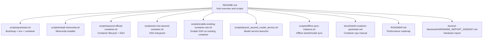
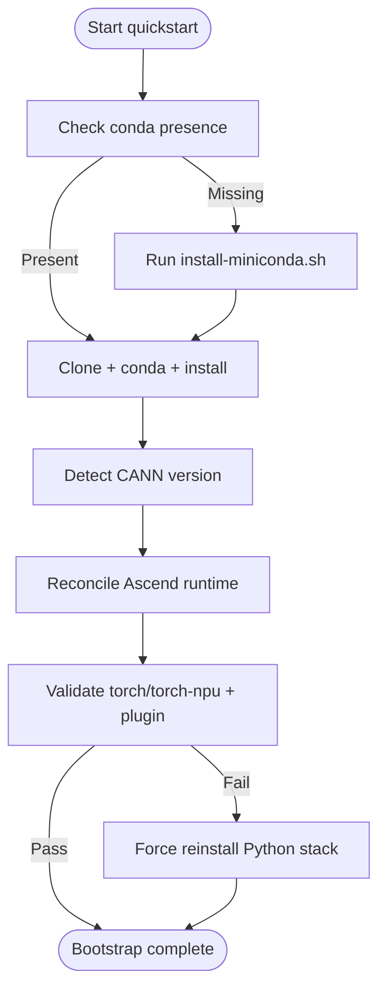
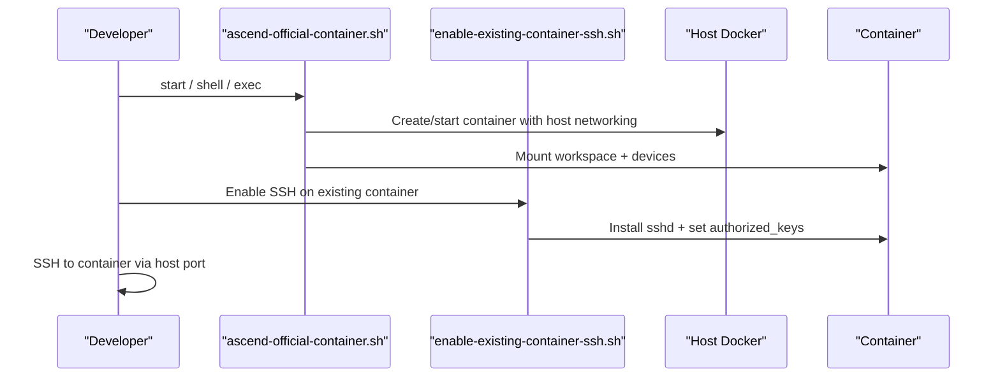
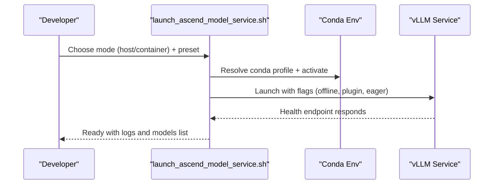
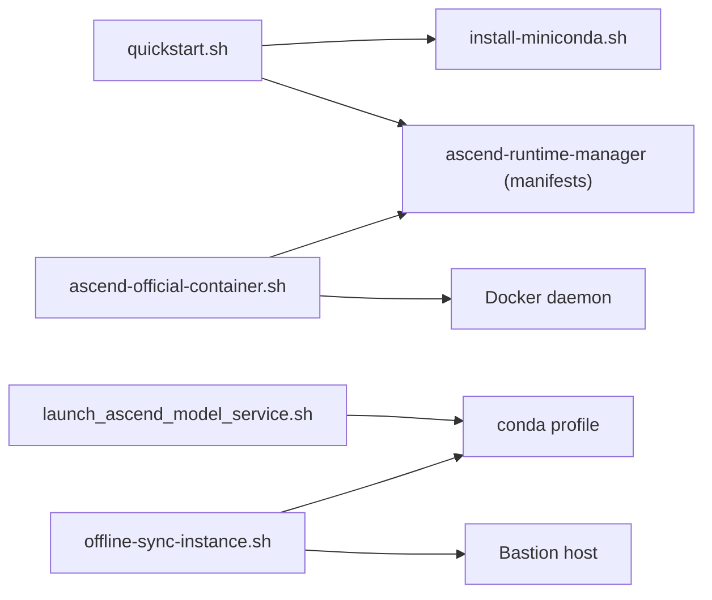

# Troubleshooting FAQ

<cite>
**Referenced Files in This Document**
- [README.md](file://README.md)
- [ROADMAP.md](file://ROADMAP.md)
- [scripts/quickstart.sh](file://scripts/quickstart.sh)
- [scripts/install-miniconda.sh](file://scripts/install-miniconda.sh)
- [scripts/ci/quickstart_ci.sh](file://scripts/ci/quickstart_ci.sh)
- [scripts/ci/vllm_envs_smoke.py](file://scripts/ci/vllm_envs_smoke.py)
- [scripts/ascend-official-container.sh](file://scripts/ascend-official-container.sh)
- [scripts/ssh-into-ascend-container.sh](file://scripts/ssh-into-ascend-container.sh)
- [scripts/enable-existing-container-ssh.sh](file://scripts/enable-existing-container-ssh.sh)
- [scripts/launch_ascend_model_service.sh](file://scripts/launch_ascend_model_service.sh)
- [scripts/offline-sync-instance.sh](file://scripts/offline-sync-instance.sh)
- [docs/train8-container-quickstart.md](file://docs/train8-container-quickstart.md)
- [Ascend-Machine/HARDWARE_REPORT_20260407.md](file://Ascend-Machine/HARDWARE_REPORT_20260407.md)
</cite>

## Table of Contents
1. [Introduction](#introduction)
2. [Project Structure](#project-structure)
3. [Core Components](#core-components)
4. [Architecture Overview](#architecture-overview)
5. [Detailed Component Analysis](#detailed-component-analysis)
6. [Dependency Analysis](#dependency-analysis)
7. [Performance Considerations](#performance-considerations)
8. [Troubleshooting Guide](#troubleshooting-guide)
9. [Conclusion](#conclusion)
10. [Appendices](#appendices)

## Introduction
This Troubleshooting FAQ consolidates common issues and resolutions for the VLLM-HUST Development Hub. It focuses on installation and environment problems, container and SSH connectivity, hardware-specific Ascend issues, offline workflows, and performance tuning. The guide organizes solutions by categories with actionable diagnostics and recovery steps, and includes platform-specific notes and known limitations.

## Project Structure
The hub provides:
- Bootstrap and environment management via a central quickstart script
- Official Ascend container orchestration and SSH enablement
- Model service launcher supporting host and container modes
- Offline synchronization pipeline for air-gapped environments
- Documentation for container deployment and maintenance



**Diagram sources**
- [README.md:1-288](file://README.md#L1-L288)
- [scripts/quickstart.sh:1-800](file://scripts/quickstart.sh#L1-L800)
- [scripts/install-miniconda.sh:1-169](file://scripts/install-miniconda.sh#L1-L169)
- [scripts/ascend-official-container.sh:1-388](file://scripts/ascend-official-container.sh#L1-L388)
- [scripts/ssh-into-ascend-container.sh:1-14](file://scripts/ssh-into-ascend-container.sh#L1-L14)
- [scripts/enable-existing-container-ssh.sh:1-172](file://scripts/enable-existing-container-ssh.sh#L1-L172)
- [scripts/launch_ascend_model_service.sh:1-680](file://scripts/launch_ascend_model_service.sh#L1-L680)
- [scripts/offline-sync-instance.sh:1-763](file://scripts/offline-sync-instance.sh#L1-L763)
- [docs/train8-container-quickstart.md:1-404](file://docs/train8-container-quickstart.md#L1-L404)
- [ROADMAP.md:1-83](file://ROADMAP.md#L1-L83)
- [Ascend-Machine/HARDWARE_REPORT_20260407.md:1-215](file://Ascend-Machine/HARDWARE_REPORT_20260407.md#L1-L215)

**Section sources**
- [README.md:1-288](file://README.md#L1-L288)

## Core Components
- Quickstart bootstrap: repository cloning, conda environment creation, editable installs, Ascend runtime reconciliation, and logging.
- Miniconda installer: safe detection, backup of broken prefixes, and platform-specific installation.
- Container orchestration: container lifecycle, SSH enablement, host Docker data-root relocation, and workspace mounting.
- Model service launcher: host vs container modes, preset configurations, health checks, and offline flags.
- Offline sync: wheelhouse preparation, model snapshot staging, bastion-assisted transfer, and container-side install.
- CI smoke tests: environment import validation and port parsing checks.

**Section sources**
- [scripts/quickstart.sh:1-800](file://scripts/quickstart.sh#L1-L800)
- [scripts/install-miniconda.sh:1-169](file://scripts/install-miniconda.sh#L1-L169)
- [scripts/ascend-official-container.sh:1-388](file://scripts/ascend-official-container.sh#L1-L388)
- [scripts/launch_ascend_model_service.sh:1-680](file://scripts/launch_ascend_model_service.sh#L1-L680)
- [scripts/offline-sync-instance.sh:1-763](file://scripts/offline-sync-instance.sh#L1-L763)
- [scripts/ci/quickstart_ci.sh:1-321](file://scripts/ci/quickstart_ci.sh#L1-L321)
- [scripts/ci/vllm_envs_smoke.py:1-69](file://scripts/ci/vllm_envs_smoke.py#L1-L69)

## Architecture Overview
High-level troubleshooting flows across components:

```mermaid
sequenceDiagram
participant Dev as "Developer"
participant QS as "quickstart.sh"
participant CI as "quickstart_ci.sh"
participant MIN as "install-miniconda.sh"
participant CT as "ascend-official-container.sh"
participant LS as "launch_ascend_model_service.sh"
participant OFF as "offline-sync-instance.sh"
Dev->>QS : Run bootstrap (clone + conda + install)
QS-->>Dev : Logs + environment + editable installs
Dev->>CI : CI run (automated bootstrap + smoke)
CI-->>Dev : Results + logs + cleanup
Dev->>MIN : Install Miniconda if needed
MIN-->>Dev : Installed or backup handled
Dev->>CT : Start/reuse container + SSH enable
CT-->>Dev : Container ready + SSH access
Dev->>LS : Launch model (host/container mode)
LS-->>Dev : Health-checked service
Dev->>OFF : Prepare wheels/models + sync to container
OFF-->>Dev : Installed in container without network
```

**Diagram sources**
- [scripts/quickstart.sh:1-800](file://scripts/quickstart.sh#L1-L800)
- [scripts/ci/quickstart_ci.sh:1-321](file://scripts/ci/quickstart_ci.sh#L1-L321)
- [scripts/install-miniconda.sh:1-169](file://scripts/install-miniconda.sh#L1-L169)
- [scripts/ascend-official-container.sh:1-388](file://scripts/ascend-official-container.sh#L1-L388)
- [scripts/launch_ascend_model_service.sh:1-680](file://scripts/launch_ascend_model_service.sh#L1-L680)
- [scripts/offline-sync-instance.sh:1-763](file://scripts/offline-sync-instance.sh#L1-L763)

## Detailed Component Analysis

### Quickstart Bootstrap Troubleshooting
Common symptoms and fixes:
- Conda not found or unusable prefix
  - Cause: missing or broken Miniconda installation
  - Fix: run the Miniconda installer; it backs up unusable prefixes and reinstalls
- Conflicting PyTorch packages
  - Cause: legacy packages in environment
  - Fix: automatic removal of conflicting packages during reconcile
- Ascend runtime mismatch
  - Cause: CANN version mismatch or missing plugin
  - Fix: manager reconciliation and stack reinstall; ensure environment variables are preserved across activation
- Long-running installs appear stuck
  - Cause: large packages with minimal progress output
  - Fix: heartbeat logs indicate ongoing progress; check timestamps in logs
- Logging and diagnostics
  - Use the built-in logging to a timestamped file; override destination via environment variables



**Diagram sources**
- [scripts/quickstart.sh:1-800](file://scripts/quickstart.sh#L1-L800)
- [scripts/install-miniconda.sh:1-169](file://scripts/install-miniconda.sh#L1-L169)

**Section sources**
- [scripts/quickstart.sh:1-800](file://scripts/quickstart.sh#L1-L800)
- [scripts/install-miniconda.sh:1-169](file://scripts/install-miniconda.sh#L1-L169)

### Container and SSH Connectivity Troubleshooting
Common symptoms and fixes:
- SSH cannot connect to container
  - Cause: container not running, sshd not started, port conflict, or host key mismatch
  - Fix: verify container status, ensure sshd is running, change port if needed, clear cached host keys
- NPU not visible inside container
  - Cause: incorrect device mounts or wrong image variant
  - Fix: confirm manager-created container with host networking; check driver/toolkit paths
- CANN version mismatch
  - Cause: outdated image tag
  - Fix: inspect image and switch to recommended tag family
- HCCL communication issues
  - Cause: Docker bridge network mode
  - Fix: ensure host networking; verify driver and topology tools availability
- Docker data-root space exhaustion
  - Cause: insufficient space under default location
  - Fix: relocate data-root to a larger partition and restart Docker



**Diagram sources**
- [scripts/ascend-official-container.sh:1-388](file://scripts/ascend-official-container.sh#L1-L388)
- [scripts/enable-existing-container-ssh.sh:1-172](file://scripts/enable-existing-container-ssh.sh#L1-L172)
- [docs/train8-container-quickstart.md:1-404](file://docs/train8-container-quickstart.md#L1-L404)

**Section sources**
- [scripts/ascend-official-container.sh:1-388](file://scripts/ascend-official-container.sh#L1-L388)
- [scripts/enable-existing-container-ssh.sh:1-172](file://scripts/enable-existing-container-ssh.sh#L1-L172)
- [docs/train8-container-quickstart.md:1-404](file://docs/train8-container-quickstart.md#L1-L404)

### Model Service Launcher Troubleshooting
Common symptoms and fixes:
- Health check timeout
  - Cause: slow NPU init or misconfiguration
  - Fix: adjust health timeout; ensure environment variables for offline and plugin loading are set
- Host vs container mode pitfalls
  - Cause: activating host conda in container or missing toolkit env sourcing
  - Fix: use container mode with workspace mount; avoid host env activation inside container
- Preset mismatches
  - Cause: incorrect preset or model path
  - Fix: apply preset before validation; ensure model path exists or download via preset
- Performance toggles
  - Cause: JIT compilation issues or eager enforcement
  - Fix: enforce eager mode or disable custom kernel compilation as needed



**Diagram sources**
- [scripts/launch_ascend_model_service.sh:1-680](file://scripts/launch_ascend_model_service.sh#L1-L680)

**Section sources**
- [scripts/launch_ascend_model_service.sh:1-680](file://scripts/launch_ascend_model_service.sh#L1-L680)

### Offline Sync Troubleshooting
Common symptoms and fixes:
- Missing local helper packages
  - Cause: missing Python modules for artifact generation
  - Fix: install required packages into user site-packages when prompted
- Wheel download failures
  - Cause: incompatible platform markers or network issues
  - Fix: review failure list and retry; adjust target platform/ABI
- Bastion or container connectivity issues
  - Cause: SSH config or bastion alias problems
  - Fix: verify bastion alias and SSH arguments; ensure accept-new host key checking
- Container-side install errors
  - Cause: missing conda or environment not present
  - Fix: ensure symlinked miniconda exists in container; verify environment name

**Section sources**
- [scripts/offline-sync-instance.sh:1-763](file://scripts/offline-sync-instance.sh#L1-L763)

### CI Smoke Tests Troubleshooting
Common symptoms and fixes:
- Import validation failures
  - Cause: environment pollution or missing modules
  - Fix: run in clean environment; ensure required modules are installed
- Port parsing errors
  - Cause: invalid VLLM_PORT values
  - Fix: provide valid integer or omit; smoke test validates parsing behavior

**Section sources**
- [scripts/ci/quickstart_ci.sh:1-321](file://scripts/ci/quickstart_ci.sh#L1-L321)
- [scripts/ci/vllm_envs_smoke.py:1-69](file://scripts/ci/vllm_envs_smoke.py#L1-L69)

## Dependency Analysis
Key dependencies and relationships:
- quickstart depends on Miniconda presence and manager manifests for CANN-aware stack reconciliation
- Container orchestration relies on manager CLI and host Docker availability
- Model launcher depends on conda profile resolution and environment activation hooks
- Offline sync depends on bastion connectivity and container-side conda availability



**Diagram sources**
- [scripts/quickstart.sh:1-800](file://scripts/quickstart.sh#L1-L800)
- [scripts/install-miniconda.sh:1-169](file://scripts/install-miniconda.sh#L1-L169)
- [scripts/ascend-official-container.sh:1-388](file://scripts/ascend-official-container.sh#L1-L388)
- [scripts/launch_ascend_model_service.sh:1-680](file://scripts/launch_ascend_model_service.sh#L1-L680)
- [scripts/offline-sync-instance.sh:1-763](file://scripts/offline-sync-instance.sh#L1-L763)

**Section sources**
- [scripts/quickstart.sh:1-800](file://scripts/quickstart.sh#L1-L800)
- [scripts/ascend-official-container.sh:1-388](file://scripts/ascend-official-container.sh#L1-L388)
- [scripts/launch_ascend_model_service.sh:1-680](file://scripts/launch_ascend_model_service.sh#L1-L680)
- [scripts/offline-sync-instance.sh:1-763](file://scripts/offline-sync-instance.sh#L1-L763)

## Performance Considerations
- Benchmarking baseline and next steps are documented in the roadmap
- Hardware report provides observed bandwidth and topology insights for NPU and interconnects
- Recommendations:
  - Prefer host networking for distributed tests to avoid bridge-induced issues
  - Use preset configurations for dense vs MoE models appropriately
  - Tune performance flags (e.g., chunked prefill, prefix caching) based on workload
  - Monitor HCCL bandwidth and topology to validate interconnect health

**Section sources**
- [ROADMAP.md:1-83](file://ROADMAP.md#L1-L83)
- [Ascend-Machine/HARDWARE_REPORT_20260407.md:1-215](file://Ascend-Machine/HARDWARE_REPORT_20260407.md#L1-L215)
- [docs/train8-container-quickstart.md:1-404](file://docs/train8-container-quickstart.md#L1-L404)

## Troubleshooting Guide

### Installation and Environment Issues
- Symptom: Conda not found or unusable prefix
  - Diagnostics: Check conda executable and base path; review logs for timestamped output
  - Resolution: Run the Miniconda installer; it backs up broken prefixes and reinstalls
  - Recovery: After reinstall, rerun quickstart to continue bootstrap
- Symptom: Conflicting PyTorch packages
  - Diagnostics: Inspect environment for legacy packages
  - Resolution: Quickstart automatically removes conflicting packages and reconciles stacks
- Symptom: Ascend runtime import failures
  - Diagnostics: Validate torch/torch-npu import and platform plugin availability
  - Resolution: Reconcile runtime via manager or force reinstall Python stack
- Symptom: Large installs appear stuck
  - Diagnostics: Observe heartbeat logs indicating progress
  - Resolution: Wait for completion; check logs for periodic updates

**Section sources**
- [scripts/quickstart.sh:1-800](file://scripts/quickstart.sh#L1-L800)
- [scripts/install-miniconda.sh:1-169](file://scripts/install-miniconda.sh#L1-L169)

### Container and SSH Connectivity
- Symptom: SSH connection refused
  - Diagnostics: Verify container is running, sshd is active, port is free, and host keys are not cached
  - Resolution: Change SSH port if needed; clear host key cache; ensure authorized_keys are present
- Symptom: NPU not visible in container
  - Diagnostics: Compare host and container npu-smi outputs
  - Resolution: Confirm manager-created container with host networking and proper device mounts
- Symptom: CANN version mismatch
  - Diagnostics: Check toolkit version info inside container
  - Resolution: Inspect container image; switch to recommended tag family
- Symptom: HCCL communication anomalies
  - Diagnostics: Verify host networking and driver/toolkit paths
  - Resolution: Use host networking; validate topology tools availability
- Symptom: Docker data-root space exhausted
  - Diagnostics: Check disk usage under default and alternate locations
  - Resolution: Relocate data-root to a larger partition and restart Docker

**Section sources**
- [scripts/ascend-official-container.sh:1-388](file://scripts/ascend-official-container.sh#L1-L388)
- [docs/train8-container-quickstart.md:1-404](file://docs/train8-container-quickstart.md#L1-L404)

### Model Service Launch Failures
- Symptom: Health check timeout
  - Diagnostics: Review service logs; check health endpoint response
  - Resolution: Adjust health timeout; ensure environment variables for offline and plugin loading are set
- Symptom: Host vs container mode confusion
  - Diagnostics: Confirm mode selection and environment activation
  - Resolution: Use container mode with workspace mount; avoid host env activation inside container
- Symptom: Preset/model path mismatch
  - Diagnostics: Validate preset application and model path existence
  - Resolution: Apply preset before validation; download model via preset if needed
- Symptom: JIT/kernel compilation issues
  - Diagnostics: Check environment variables controlling kernel compilation
  - Resolution: Enforce eager mode or disable custom kernel compilation as needed

**Section sources**
- [scripts/launch_ascend_model_service.sh:1-680](file://scripts/launch_ascend_model_service.sh#L1-L680)

### Offline Sync Problems
- Symptom: Missing helper packages
  - Diagnostics: Check for required Python modules
  - Resolution: Install into user site-packages when prompted
- Symptom: Wheel download failures
  - Diagnostics: Review failure list and platform markers
  - Resolution: Retry with adjusted target platform/ABI
- Symptom: Bastion/container connectivity
  - Diagnostics: Verify bastion alias and SSH arguments
  - Resolution: Use accept-new host key checking; ensure bastion alias works
- Symptom: Container-side install errors
  - Diagnostics: Confirm conda presence and environment name
  - Resolution: Ensure symlinked miniconda exists; verify environment exists

**Section sources**
- [scripts/offline-sync-instance.sh:1-763](file://scripts/offline-sync-instance.sh#L1-L763)

### CI Smoke Test Failures
- Symptom: Import validation errors
  - Diagnostics: Run in clean environment; verify required modules
  - Resolution: Install missing modules; rerun smoke tests
- Symptom: Port parsing errors
  - Diagnostics: Validate VLLM_PORT values
  - Resolution: Provide valid integer or omit; smoke test validates parsing behavior

**Section sources**
- [scripts/ci/quickstart_ci.sh:1-321](file://scripts/ci/quickstart_ci.sh#L1-L321)
- [scripts/ci/vllm_envs_smoke.py:1-69](file://scripts/ci/vllm_envs_smoke.py#L1-L69)

### Platform-Specific Notes and Known Limitations
- Docker mode and CANN 8.5.1: Some operators are not available; use lightweight mode or disable custom kernels
- MoE expert count mismatch: Ascend-specific fix applied; ensure correct runner implementation
- Preflight timeout: Disabled by default to accommodate slow NPU initialization

**Section sources**
- [docs/train8-container-quickstart.md:1-404](file://docs/train8-container-quickstart.md#L1-L404)

## Conclusion
This FAQ consolidates practical, step-by-step remedies for the most frequent issues encountered in the VLLM-HUST Development Hub. By following the diagnostics and recovery procedures outlined here—covering installation, containerization, networking, offline workflows, and performance—you can quickly isolate root causes and restore a healthy development environment.

## Appendices

### Diagnostic Commands and Log Locations
- Quickstart logs: timestamped files written under the configured log directory
- CI results: summary and per-step logs under the results directory
- Container status and logs: inspect container and tail recent logs
- Offline sync: review failure lists and staged artifacts

**Section sources**
- [scripts/quickstart.sh:1-800](file://scripts/quickstart.sh#L1-L800)
- [scripts/ci/quickstart_ci.sh:1-321](file://scripts/ci/quickstart_ci.sh#L1-L321)
- [scripts/offline-sync-instance.sh:1-763](file://scripts/offline-sync-instance.sh#L1-L763)