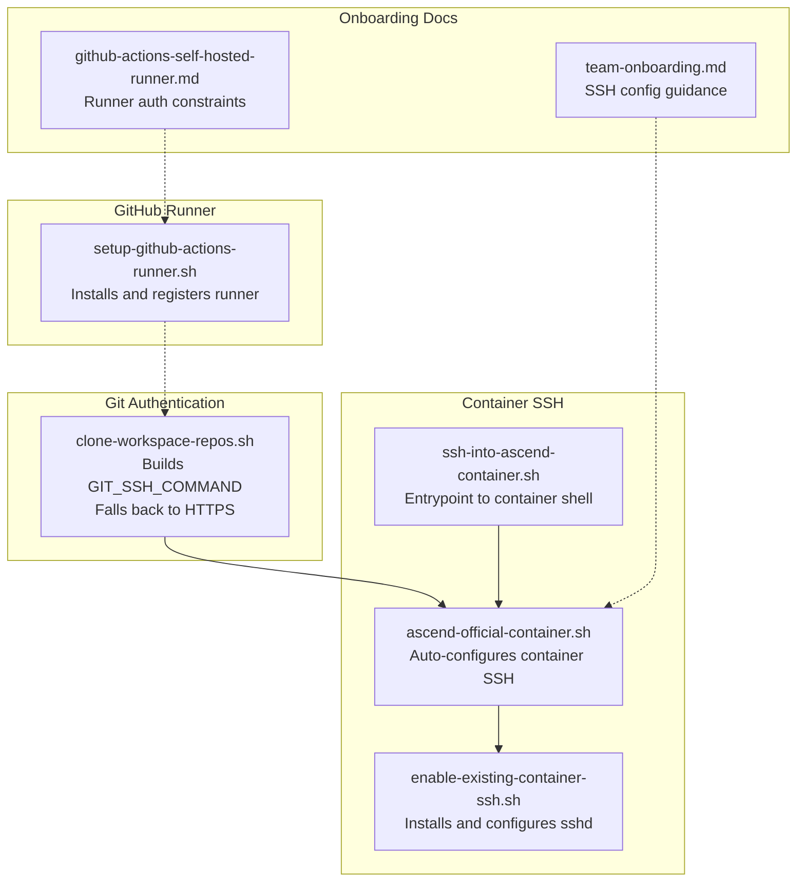
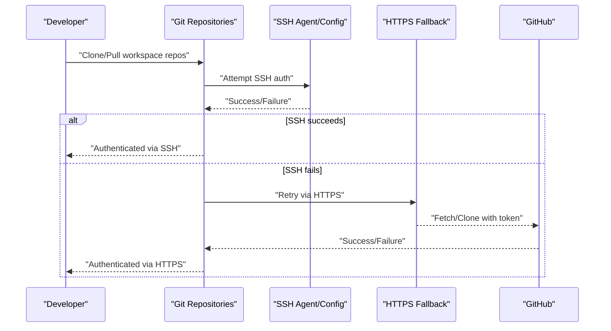
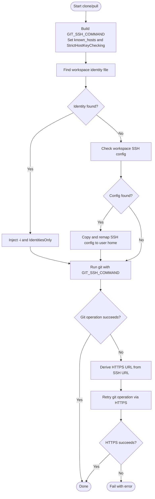
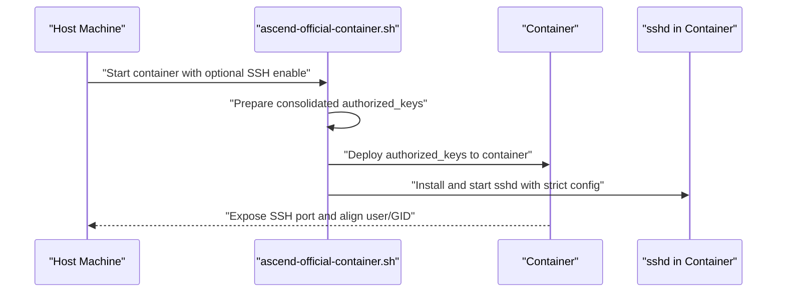
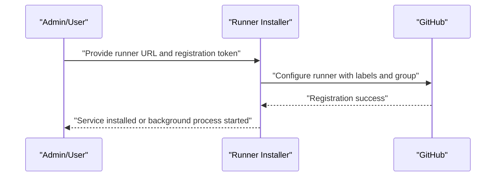
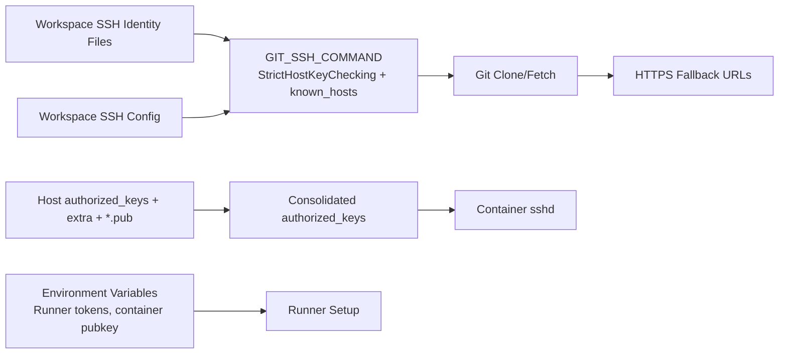

# Authentication and Access Control

<cite>
**Referenced Files in This Document**
- [README.md](file://README.md)
- [clone-workspace-repos.sh](file://scripts/clone-workspace-repos.sh)
- [ascend-official-container.sh](file://scripts/ascend-official-container.sh)
- [enable-existing-container-ssh.sh](file://scripts/enable-existing-container-ssh.sh)
- [ssh-into-ascend-container.sh](file://scripts/ssh-into-ascend-container.sh)
- [quickstart.sh](file://scripts/quickstart.sh)
- [setup-github-actions-runner.sh](file://scripts/setup-github-actions-runner.sh)
- [team-onboarding.md](file://docs/team-onboarding.md)
- [github-actions-self-hosted-runner.md](file://docs/github-actions-self-hosted-runner.md)
</cite>

## Table of Contents
1. [Introduction](#introduction)
2. [Project Structure](#project-structure)
3. [Core Components](#core-components)
4. [Architecture Overview](#architecture-overview)
5. [Detailed Component Analysis](#detailed-component-analysis)
6. [Dependency Analysis](#dependency-analysis)
7. [Performance Considerations](#performance-considerations)
8. [Troubleshooting Guide](#troubleshooting-guide)
9. [Conclusion](#conclusion)

## Introduction
This document explains authentication and access control mechanisms in the VLLM-HUST Development Hub. It covers SSH key management, Git credential handling, and authentication fallback strategies. It documents SSH configuration, temporary SSH config generation, identity file management, and secure credential storage practices. It also explains relationships with GitHub authentication, repository permissions, and access control policies, and provides troubleshooting guidance for common issues such as SSH key problems, permission denied errors, and credential cache management.

## Project Structure
The authentication-related capabilities are implemented primarily through:
- Git SSH configuration and fallback to HTTPS for repository cloning
- SSH key collection and container SSH deployment for development containers
- GitHub Actions self-hosted runner installation and configuration
- Secure storage of SSH keys and runner tokens via environment variables and local files

**Diagram sources**
- [clone-workspace-repos.sh:19-55](file://scripts/clone-workspace-repos.sh#L19-L55)
- [ascend-official-container.sh:303-386](file://scripts/ascend-official-container.sh#L303-L386)
- [enable-existing-container-ssh.sh:58-172](file://scripts/enable-existing-container-ssh.sh#L58-L172)
- [ssh-into-ascend-container.sh:1-14](file://scripts/ssh-into-ascend-container.sh#L1-L14)
- [setup-github-actions-runner.sh:498-528](file://scripts/setup-github-actions-runner.sh#L498-L528)
- [team-onboarding.md:108-153](file://docs/team-onboarding.md#L108-L153)
- [github-actions-self-hosted-runner.md:120-133](file://docs/github-actions-self-hosted-runner.md#L120-L133)

**Section sources**
- [README.md:34-50](file://README.md#L34-L50)
- [team-onboarding.md:108-153](file://docs/team-onboarding.md#L108-L153)

## Core Components
- Git SSH configuration and fallback
  - Builds a secure GIT_SSH_COMMAND tailored to the workspace’s SSH material and known_hosts.
  - Falls back to HTTPS when SSH authentication fails for cloning or fetching.
- SSH key management for containers
  - Collects authorized_keys from host sources and generates a consolidated authorized_keys file for the container.
  - Installs and configures OpenSSH server inside the container with strict authentication settings.
- GitHub Actions runner authentication
  - Registers runners with GitHub using a temporary registration token.
  - Provides guidance to preserve or avoid proxy variables that could interfere with runner connectivity.
- Secure credential storage
  - Uses environment variables for sensitive inputs (e.g., runner tokens, container public key).
  - Stores SSH keys and extra authorized_keys in user-owned files with restrictive permissions.

**Section sources**
- [clone-workspace-repos.sh:19-55](file://scripts/clone-workspace-repos.sh#L19-L55)
- [clone-workspace-repos.sh:260-279](file://scripts/clone-workspace-repos.sh#L260-L279)
- [ascend-official-container.sh:262-301](file://scripts/ascend-official-container.sh#L262-L301)
- [enable-existing-container-ssh.sh:58-172](file://scripts/enable-existing-container-ssh.sh#L58-L172)
- [setup-github-actions-runner.sh:246-281](file://scripts/setup-github-actions-runner.sh#L246-L281)
- [github-actions-self-hosted-runner.md:24-28](file://docs/github-actions-self-hosted-runner.md#L24-L28)

## Architecture Overview
The authentication architecture integrates three pillars:
- Git authentication for repository access
- Container SSH access for development
- GitHub Actions runner authentication for CI/CD

**Diagram sources**
- [clone-workspace-repos.sh:260-279](file://scripts/clone-workspace-repos.sh#L260-L279)
- [clone-workspace-repos.sh:328-346](file://scripts/clone-workspace-repos.sh#L328-L346)

## Detailed Component Analysis

### Git SSH Configuration and HTTPS Fallback
- SSH configuration
  - Creates a per-session GIT_SSH_COMMAND that sets StrictHostKeyChecking and points to a known_hosts file in the user’s home.
  - Detects workspace SSH identity files and injects them into the command.
  - If no identity file is found but a workspace SSH config exists, it temporarily copies and remaps the config to the user’s home for the session.
- HTTPS fallback
  - If SSH clone or fetch fails, the script retries using HTTPS URLs derived from SSH URLs.
  - Fetch failures are retried via HTTPS when a suitable HTTPS URL is available.

**Diagram sources**
- [clone-workspace-repos.sh:19-55](file://scripts/clone-workspace-repos.sh#L19-L55)
- [clone-workspace-repos.sh:260-279](file://scripts/clone-workspace-repos.sh#L260-L279)
- [clone-workspace-repos.sh:328-346](file://scripts/clone-workspace-repos.sh#L328-L346)

**Section sources**
- [clone-workspace-repos.sh:19-55](file://scripts/clone-workspace-repos.sh#L19-L55)
- [clone-workspace-repos.sh:260-279](file://scripts/clone-workspace-repos.sh#L260-L279)
- [clone-workspace-repos.sh:328-346](file://scripts/clone-workspace-repos.sh#L328-L346)

### SSH Key Management for Containers
- Authorized keys consolidation
  - Aggregates authorized_keys from host sources, extra keys file, and discovered public keys under the workspace SSH directory.
  - Deduplicates entries and writes a consolidated authorized_keys file with restrictive permissions.
- Container SSH deployment
  - Optionally enables container SSH when host public key material is present.
  - Starts sshd inside the container with strict settings and exposes a configurable port.
  - Aligns container user UID/GID with the mounted workspace to ensure seamless access to files.

**Diagram sources**
- [ascend-official-container.sh:262-301](file://scripts/ascend-official-container.sh#L262-L301)
- [ascend-official-container.sh:351-360](file://scripts/ascend-official-container.sh#L351-L360)
- [enable-existing-container-ssh.sh:58-172](file://scripts/enable-existing-container-ssh.sh#L58-L172)

**Section sources**
- [ascend-official-container.sh:262-301](file://scripts/ascend-official-container.sh#L262-L301)
- [ascend-official-container.sh:351-360](file://scripts/ascend-official-container.sh#L351-L360)
- [enable-existing-container-ssh.sh:58-172](file://scripts/enable-existing-container-ssh.sh#L58-L172)

### GitHub Actions Runner Authentication
- Runner installation
  - Requires a temporary registration token and a valid runner URL.
  - Supports user systemd service or fallback background mode.
- Authentication constraints for self-hosted runners
  - When running quickstart bootstrap on self-hosted runners, maintain SSH mode and avoid rewriting SSH URLs to HTTPS by clearing specific tokens.

**Diagram sources**
- [setup-github-actions-runner.sh:246-281](file://scripts/setup-github-actions-runner.sh#L246-L281)
- [setup-github-actions-runner.sh:498-528](file://scripts/setup-github-actions-runner.sh#L498-L528)
- [github-actions-self-hosted-runner.md:120-133](file://docs/github-actions-self-hosted-runner.md#L120-L133)

**Section sources**
- [setup-github-actions-runner.sh:246-281](file://scripts/setup-github-actions-runner.sh#L246-L281)
- [setup-github-actions-runner.sh:498-528](file://scripts/setup-github-actions-runner.sh#L498-L528)
- [github-actions-self-hosted-runner.md:120-133](file://docs/github-actions-self-hosted-runner.md#L120-L133)

### Secure Credential Storage Practices
- Environment variables
  - Runner tokens and names are passed via environment variables to avoid embedding secrets in scripts or logs.
  - Container public key can be supplied via an environment variable for automated setups.
- Local file permissions
  - SSH directories and files are created with restrictive permissions (e.g., 700 for .ssh, 600 for known_hosts and private keys).
  - Consolidated authorized_keys files are written with restrictive permissions and atomically updated.

**Section sources**
- [setup-github-actions-runner.sh:50-61](file://scripts/setup-github-actions-runner.sh#L50-L61)
- [quickstart.sh:210-276](file://scripts/quickstart.sh#L210-L276)
- [ascend-official-container.sh:298-300](file://scripts/ascend-official-container.sh#L298-L300)
- [enable-existing-container-ssh.sh:129-131](file://scripts/enable-existing-container-ssh.sh#L129-L131)

## Dependency Analysis
- Git SSH command depends on:
  - Workspace SSH identity files or a workspace SSH config.
  - User known_hosts file for host key verification.
- Container SSH depends on:
  - Host public key material (authorized_keys, extra keys, and discovered .pub files).
  - Optional environment variables controlling user, port, and auto-enable behavior.
- GitHub runner depends on:
  - A valid runner URL and a temporary registration token.
  - Optional proxy preservation environment variable for environments requiring proxies.

**Diagram sources**
- [clone-workspace-repos.sh:19-55](file://scripts/clone-workspace-repos.sh#L19-L55)
- [clone-workspace-repos.sh:260-279](file://scripts/clone-workspace-repos.sh#L260-L279)
- [ascend-official-container.sh:262-301](file://scripts/ascend-official-container.sh#L262-L301)
- [setup-github-actions-runner.sh:246-281](file://scripts/setup-github-actions-runner.sh#L246-L281)

**Section sources**
- [clone-workspace-repos.sh:19-55](file://scripts/clone-workspace-repos.sh#L19-L55)
- [clone-workspace-repos.sh:260-279](file://scripts/clone-workspace-repos.sh#L260-L279)
- [ascend-official-container.sh:262-301](file://scripts/ascend-official-container.sh#L262-L301)
- [setup-github-actions-runner.sh:246-281](file://scripts/setup-github-actions-runner.sh#L246-L281)

## Performance Considerations
- Parallel cloning reduces total time when multiple repositories are involved.
- SSH strict host checking prevents unnecessary delays from unknown host prompts.
- HTTPS fallback is retried with exponential backoff to handle transient network issues.

[No sources needed since this section provides general guidance]

## Troubleshooting Guide

### SSH Key Problems
- Symptom: Permission denied when connecting to the container or cloning repositories.
  - Verify that the correct private key is loaded and IdentitiesOnly is respected.
  - Ensure the known_hosts file exists and is readable.
  - Confirm that authorized_keys in the container includes the intended public key and has restrictive permissions.

- Symptom: Host key mismatch after rebuilding the container.
  - Clear cached host keys for the container alias and retry.

- Symptom: No public key material found for container SSH.
  - Ensure host authorized_keys, extra keys file, or discovered .pub files exist and are readable.

**Section sources**
- [clone-workspace-repos.sh:19-55](file://scripts/clone-workspace-repos.sh#L19-L55)
- [enable-existing-container-ssh.sh:129-131](file://scripts/enable-existing-container-ssh.sh#L129-L131)
- [team-onboarding.md:147-153](file://docs/team-onboarding.md#L147-L153)

### Permission Denied Errors
- Symptom: Git operations fail with permission denied.
  - Confirm that the workspace SSH identity file matches the repository’s deploy keys or personal access tokens are used for HTTPS fallback.
  - Ensure HTTPS fallback is functioning by verifying that HTTPS URLs are derived from SSH URLs and that tokens are available.

**Section sources**
- [clone-workspace-repos.sh:260-279](file://scripts/clone-workspace-repos.sh#L260-L279)
- [clone-workspace-repos.sh:328-346](file://scripts/clone-workspace-repos.sh#L328-L346)

### Credential Cache Management
- Symptom: Old or incorrect host keys cause connection failures.
  - Clear cached host keys for the container alias and retry.

- Symptom: Runner fails to connect to GitHub due to proxy variables.
  - Preserve or clear proxy environment variables depending on the environment’s requirements.

**Section sources**
- [team-onboarding.md:147-153](file://docs/team-onboarding.md#L147-L153)
- [github-actions-self-hosted-runner.md:24-28](file://docs/github-actions-self-hosted-runner.md#L24-L28)
- [github-actions-self-hosted-runner.md:194-202](file://docs/github-actions-self-hosted-runner.md#L194-L202)

### Authentication Fallback Strategies
- Git clone/pull failures are retried via HTTPS when SSH fails.
- For self-hosted runners running quickstart, maintain SSH mode and avoid rewriting SSH URLs to HTTPS by clearing specific tokens.

**Section sources**
- [clone-workspace-repos.sh:260-279](file://scripts/clone-workspace-repos.sh#L260-L279)
- [clone-workspace-repos.sh:328-346](file://scripts/clone-workspace-repos.sh#L328-L346)
- [github-actions-self-hosted-runner.md:120-133](file://docs/github-actions-self-hosted-runner.md#L120-L133)

## Conclusion
The VLLM-HUST Development Hub implements robust authentication and access control through:
- A secure Git SSH configuration with HTTPS fallback
- Automated container SSH setup using consolidated authorized_keys
- A safe GitHub Actions runner installation process with explicit token handling
- Strong credential storage practices via environment variables and restrictive file permissions

These mechanisms collectively ensure reliable, auditable, and secure access to repositories, development containers, and CI/CD resources.