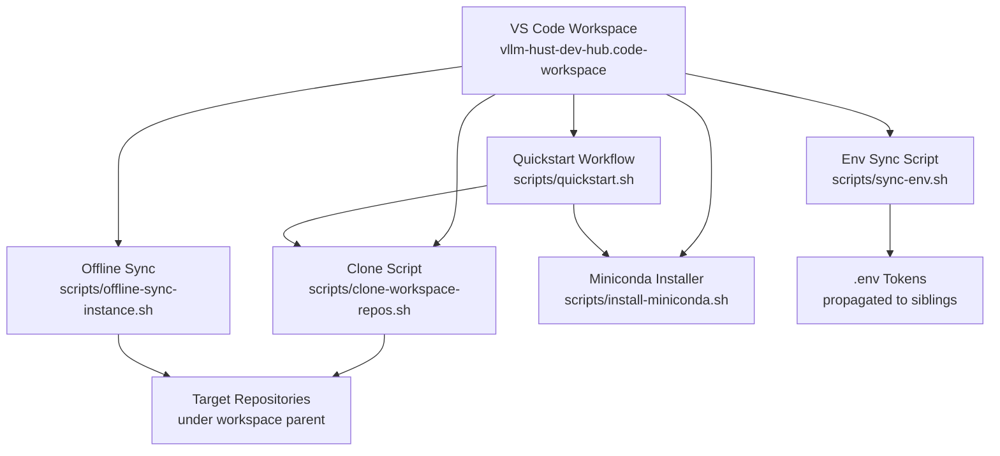
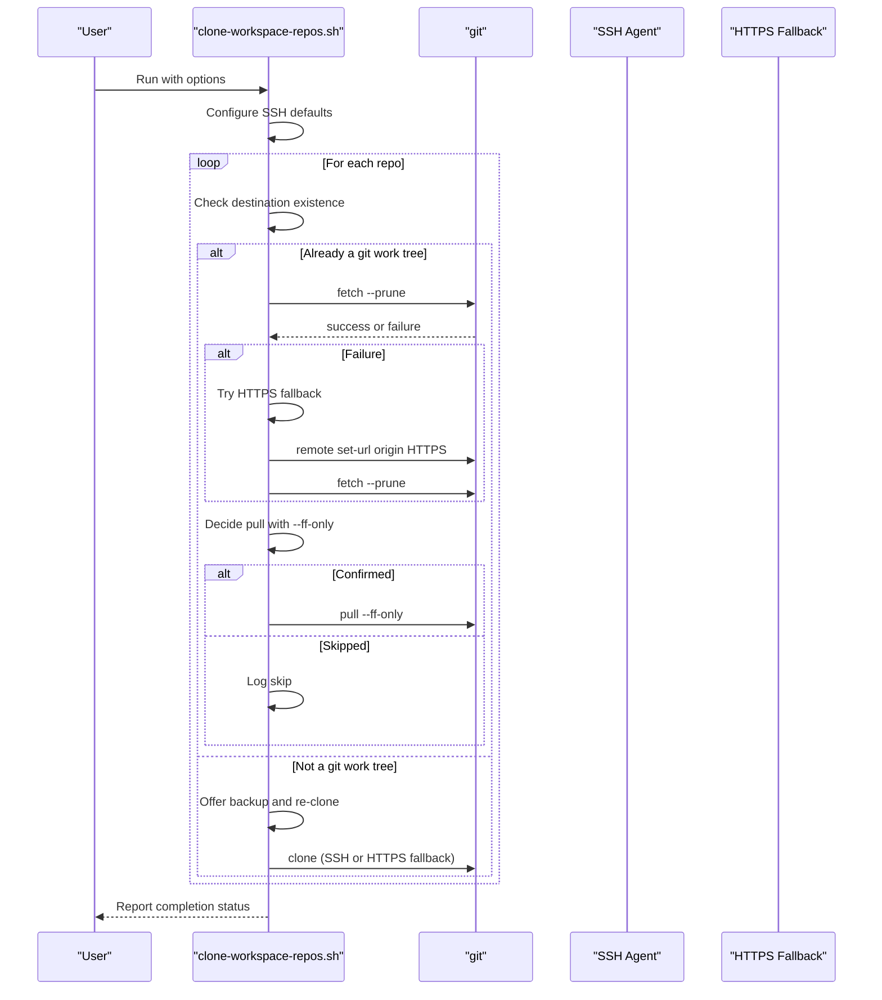
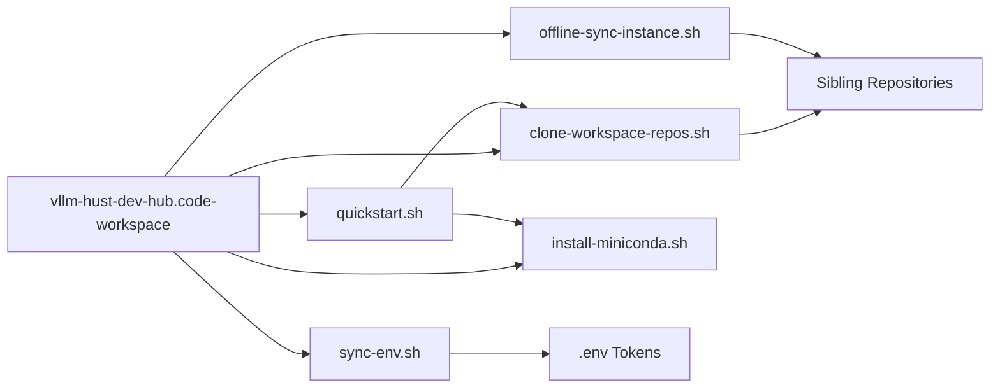

# Repository Management

<cite>
**Referenced Files in This Document**
- [clone-workspace-repos.sh](file://scripts/clone-workspace-repos.sh)
- [sync-env.sh](file://scripts/sync-env.sh)
- [vllm-hust-dev-hub.code-workspace](file://vllm-hust-dev-hub.code-workspace)
- [README.md](file://README.md)
- [test_clone_workspace_repos.py](file://tests/test_clone_workspace_repos.py)
- [quickstart.sh](file://scripts/quickstart.sh)
- [offline-sync-instance.sh](file://scripts/offline-sync-instance.sh)
- [install-miniconda.sh](file://scripts/install-miniconda.sh)
- [team-onboarding.md](file://docs/team-onboarding.md)
- [contribution-git-workflow.md](file://docs/contribution-git-workflow.md)
</cite>

## Table of Contents
1. [Introduction](#introduction)
2. [Project Structure](#project-structure)
3. [Core Components](#core-components)
4. [Architecture Overview](#architecture-overview)
5. [Detailed Component Analysis](#detailed-component-analysis)
6. [Dependency Analysis](#dependency-analysis)
7. [Performance Considerations](#performance-considerations)
8. [Troubleshooting Guide](#troubleshooting-guide)
9. [Conclusion](#conclusion)
10. [Appendices](#appendices)

## Introduction
This document explains repository management within the VLLM-HUST Development Hub. It focuses on:
- Workspace configuration and VS Code multi-root coordination
- Parallel repository cloning and conflict resolution
- Authentication handling for SSH and HTTPS fallbacks
- Upstream synchronization and environment token propagation
- Practical examples and operational guidance for beginners and experienced developers

The goal is to provide a practical, code-backed guide that maps the scripts and workspace configuration to real-world workflows.

## Project Structure
The repository centers around a VS Code multi-root workspace and a set of bootstrap and maintenance scripts. The workspace aggregates related repositories under a shared parent directory, enabling coordinated development across multiple projects.

```mermaid
graph TB
subgraph "Development Hub"
DevHub["vllm-hust-dev-hub.code-workspace"]
Scripts["scripts/"]
Tests["tests/"]
Docs["docs/"]
end
subgraph "Sibling Repositories"
OrgProfile["../vllm-hust-org-profile"]
DocsRepo["../vllm-hust-docs"]
EngineV["../vllm-hust"]
EngineAscend["../vllm-ascend-hust"]
EngineQuant["../vllm-ascend-quant-hust"]
TritonAscend["../triton-ascend-hust"]
RuntimeMgr["../ascend-runtime-manager"]
WebWorkstation["../vllm-hust-workstation"]
WebSite["../vllm-hust-website"]
ToolClaude["../claude-code-hust"]
PerfBenchmark["../vllm-hust-benchmark"]
PerfAnalyzer["../vllm-hust-perf-analyzer"]
ResearchEvo["../EvoScientist"]
PaperCCCF["../cccf-domestic-inference-engine-survey"]
PaperFCS["../fcs-domestic-chip-llm-recsys"]
RefRepos["../reference-repos/"]
end
DevHub --> OrgProfile
DevHub --> DocsRepo
DevHub --> EngineV
DevHub --> EngineAscend
DevHub --> EngineQuant
DevHub --> TritonAscend
DevHub --> RuntimeMgr
DevHub --> WebWorkstation
DevHub --> WebSite
DevHub --> ToolClaude
DevHub --> PerfBenchmark
DevHub --> PerfAnalyzer
DevHub --> ResearchEvo
DevHub --> PaperCCCF
DevHub --> PaperFCS
DevHub --> RefRepos
```

**Diagram sources**
- [vllm-hust-dev-hub.code-workspace:1-91](file://vllm-hust-dev-hub.code-workspace#L1-L91)

**Section sources**
- [README.md:15-33](file://README.md#L15-L33)
- [vllm-hust-dev-hub.code-workspace:1-91](file://vllm-hust-dev-hub.code-workspace#L1-L91)

## Core Components
- Workspace definition: A VS Code multi-root workspace enumerates sibling repositories and global filters for files and search.
- Bootstrap and maintenance scripts:
  - Parallel cloning and update orchestration
  - Environment token propagation across sibling repos
  - Quickstart workflow integrating cloning, environment setup, and container orchestration
  - Offline sync helper for air-gapped environments
  - Miniconda installation helper

Key responsibilities:
- Manage workspace roots and exclusions
- Coordinate parallel git operations with robust retry and fallback
- Synchronize environment tokens safely across repos
- Provide reproducible bootstrapping and maintenance flows

**Section sources**
- [vllm-hust-dev-hub.code-workspace:1-91](file://vllm-hust-dev-hub.code-workspace#L1-L91)
- [README.md:34-49](file://README.md#L34-L49)
- [scripts/clone-workspace-repos.sh:374-400](file://scripts/clone-workspace-repos.sh#L374-L400)
- [scripts/sync-env.sh:19-47](file://scripts/sync-env.sh#L19-L47)

## Architecture Overview
The repository management architecture combines a declarative workspace configuration with imperative scripts that:
- Determine target locations based on the workspace parent directory
- Configure SSH defaults for git operations
- Queue and run parallel clones with controlled concurrency
- Detect existing destinations and resolve conflicts safely
- Fetch and pull updates with HTTPS fallback when SSH fails
- Propagate environment tokens to sibling repos

**Diagram sources**
- [vllm-hust-dev-hub.code-workspace:1-91](file://vllm-hust-dev-hub.code-workspace#L1-L91)
- [scripts/clone-workspace-repos.sh:374-400](file://scripts/clone-workspace-repos.sh#L374-L400)
- [scripts/sync-env.sh:19-47](file://scripts/sync-env.sh#L19-L47)
- [scripts/quickstart.sh:1-120](file://scripts/quickstart.sh#L1-L120)
- [scripts/offline-sync-instance.sh:50-56](file://scripts/offline-sync-instance.sh#L50-L56)
- [scripts/install-miniconda.sh:1-42](file://scripts/install-miniconda.sh#L1-L42)

## Detailed Component Analysis

### Workspace Configuration and VS Code Multi-Root Coordination
- The workspace declares multiple folders under the parent directory, including documentation, organization profile, engines, web apps, tools, benchmarks, research, and upstream reference clones.
- Global filters exclude common cache and build artifacts to keep the editor responsive and focused.

Operational implications:
- Editing across multiple repositories is seamless within VS Code.
- Exclusions reduce noise from generated content and caches.
- Adding a new repository requires appending a folder entry to the workspace file.

**Section sources**
- [vllm-hust-dev-hub.code-workspace:1-91](file://vllm-hust-dev-hub.code-workspace#L1-L91)
- [README.md:59](file://README.md#L59)

### Parallel Repository Cloning and Conflict Resolution
The cloning script orchestrates:
- Determining the workspace parent directory and target base path
- Configuring SSH defaults for git operations using a temporary or workspace SSH config
- Defining a list of repositories to clone, including upstream reference clones under a dedicated directory
- Queuing clones with configurable concurrency
- Handling existing destinations:
  - If the destination is already a git work tree, it attempts to pull updates
  - If the destination is empty, it removes it and proceeds with a fresh clone
  - If the destination is neither a git work tree nor empty, it offers to move it to a backup path and re-clone
- Fetch and pull with retries and HTTPS fallback when SSH auth fails
- Interactive prompts for upstream reference clones and pull confirmations

Key behaviors:
- SSH preference with HTTPS fallback for both clone and fetch
- Respect for existing protocols to avoid breaking hosts with only HTTPS auth configured
- Controlled parallelism via a configurable job limit
- Robust handling of missing or deleted upstream branches

**Diagram sources**
- [scripts/clone-workspace-repos.sh:19-47](file://scripts/clone-workspace-repos.sh#L19-L47)
- [scripts/clone-workspace-repos.sh:260-279](file://scripts/clone-workspace-repos.sh#L260-L279)
- [scripts/clone-workspace-repos.sh:281-370](file://scripts/clone-workspace-repos.sh#L281-L370)
- [scripts/clone-workspace-repos.sh:406-466](file://scripts/clone-workspace-repos.sh#L406-L466)

Implementation highlights:
- SSH configuration builder and temporary config handling
- Destination preparation with backup path generation
- Retry loops with exponential backoff for git operations
- HTTPS URL derivation from SSH URLs for fallback

**Section sources**
- [scripts/clone-workspace-repos.sh:19-47](file://scripts/clone-workspace-repos.sh#L19-L47)
- [scripts/clone-workspace-repos.sh:105-147](file://scripts/clone-workspace-repos.sh#L105-L147)
- [scripts/clone-workspace-repos.sh:260-279](file://scripts/clone-workspace-repos.sh#L260-L279)
- [scripts/clone-workspace-repos.sh:281-370](file://scripts/clone-workspace-repos.sh#L281-L370)
- [scripts/clone-workspace-repos.sh:374-400](file://scripts/clone-workspace-repos.sh#L374-L400)
- [scripts/clone-workspace-repos.sh:406-466](file://scripts/clone-workspace-repos.sh#L406-L466)

### Authentication Handling (SSH and HTTPS Fallback)
- SSH defaults are built using the workspace’s .ssh directory, selecting the first private key found or a temporary config derived from a workspace SSH config file.
- Strict host key checking is configured to accept new hosts, reducing friction for new machines.
- HTTPS fallback is attempted when SSH clone or fetch fails, deriving HTTPS URLs from SSH URLs.

Operational guidance:
- Place SSH keys under the workspace .ssh directory to enable automatic selection.
- If only HTTPS is available, the script derives HTTPS URLs and retries fetch/clone.
- Temporary SSH config is cleaned up after execution.

**Section sources**
- [scripts/clone-workspace-repos.sh:19-47](file://scripts/clone-workspace-repos.sh#L19-L47)
- [scripts/clone-workspace-repos.sh:226-235](file://scripts/clone-workspace-repos.sh#L226-L235)
- [scripts/clone-workspace-repos.sh:328-346](file://scripts/clone-workspace-repos.sh#L328-L346)

### Upstream Synchronization and Reference Repositories
- Upstream reference repositories are kept under a dedicated directory and require explicit confirmation before cloning.
- Existing upstream references are preserved to avoid breaking hosts with only HTTPS auth configured.
- The script maintains the current protocol for established clones to prevent auth regressions.

Practical notes:
- Use the interactive prompt to confirm upstream reference clones.
- If origin URL differs only by protocol, the script preserves the existing protocol to avoid SSH auth failures.

**Section sources**
- [scripts/clone-workspace-repos.sh:396-400](file://scripts/clone-workspace-repos.sh#L396-L400)
- [scripts/clone-workspace-repos.sh:237-258](file://scripts/clone-workspace-repos.sh#L237-L258)

### Environment Token Propagation Across Sibling Repositories
The environment sync script:
- Treats the development hub’s .env as the single source of truth for tokens.
- Supports two propagation modes:
  - Full copy: identical .env replacement for specific targets
  - Merge patch: in-place token line updates for targets that maintain their own .env
- Defines token keys and target lists for both modes.
- Provides a dry-run mode to preview differences before applying changes.

Operational guidance:
- Dry-run shows diffs and token mismatches; apply mode writes changes.
- Merge mode preserves non-token lines in target .env files.

**Section sources**
- [scripts/sync-env.sh:19-47](file://scripts/sync-env.sh#L19-L47)
- [scripts/sync-env.sh:57-121](file://scripts/sync-env.sh#L57-L121)

### Quickstart Workflow and Multi-Repository Coordination
The quickstart script integrates:
- Container orchestration entrypoints for Ascend environments
- Conda environment creation and management
- Installation of core sibling repositories in editable mode
- Logging and progress reporting with configurable log directories

How it relates to repository management:
- Uses the clone script to synchronize repositories before environment setup.
- Ensures core local repositories are installed into the selected environment.
- Supports non-interactive and advanced installation modes.

**Section sources**
- [scripts/quickstart.sh:1-120](file://scripts/quickstart.sh#L1-L120)
- [README.md:73-107](file://README.md#L73-L107)

### Offline Sync for Air-Gapped Environments
The offline sync script:
- Prepares Python wheels and model assets locally
- Syncs them into a container via a bastion host
- Installs local repositories inside the container without public network access
- Supports configurable parameters for model selection, asset roots, and environment names

Integration:
- Works alongside the workspace structure by targeting sibling repositories under the workspace root.

**Section sources**
- [scripts/offline-sync-instance.sh:50-56](file://scripts/offline-sync-instance.sh#L50-L56)
- [README.md:242-278](file://README.md#L242-L278)

### Miniconda Installation Helper
The miniconda installer:
- Detects platform and architecture
- Downloads the appropriate installer
- Handles broken prefixes by backing them up and reinstalling
- Supports non-interactive mode and custom installation prefixes

**Section sources**
- [scripts/install-miniconda.sh:66-79](file://scripts/install-miniconda.sh#L66-L79)
- [scripts/install-miniconda.sh:132-169](file://scripts/install-miniconda.sh#L132-L169)

## Dependency Analysis
The repository management system exhibits clear separation of concerns:
- Workspace configuration depends on sibling repository layout under a shared parent directory.
- Cloning script depends on git and SSH availability, and on the workspace parent directory for target placement.
- Environment sync depends on the presence of .env files in the development hub and sibling targets.
- Quickstart depends on the cloning script and environment setup helpers.

**Diagram sources**
- [vllm-hust-dev-hub.code-workspace:1-91](file://vllm-hust-dev-hub.code-workspace#L1-L91)
- [scripts/clone-workspace-repos.sh:374-400](file://scripts/clone-workspace-repos.sh#L374-L400)
- [scripts/sync-env.sh:19-47](file://scripts/sync-env.sh#L19-L47)
- [scripts/quickstart.sh:1-120](file://scripts/quickstart.sh#L1-L120)
- [scripts/offline-sync-instance.sh:50-56](file://scripts/offline-sync-instance.sh#L50-L56)
- [scripts/install-miniconda.sh:1-42](file://scripts/install-miniconda.sh#L1-L42)

**Section sources**
- [README.md:34-49](file://README.md#L34-L49)

## Performance Considerations
- Parallelism: Control the number of concurrent clone jobs via an environment variable to balance throughput and resource usage.
- Network resilience: The scripts implement retries with exponential backoff and HTTPS fallback to minimize transient failures.
- Workspace filtering: VS Code excludes caches and build artifacts to keep indexing efficient.

Practical tips:
- Increase CLONE_JOBS for faster initial setup on powerful machines.
- Monitor SSH key availability to avoid unnecessary HTTPS fallbacks.
- Use dry-run modes for environment sync to estimate changes before applying.

**Section sources**
- [README.md:273-277](file://README.md#L273-L277)
- [scripts/clone-workspace-repos.sh:8-9](file://scripts/clone-workspace-repos.sh#L8-L9)
- [scripts/clone-workspace-repos.sh:66-86](file://scripts/clone-workspace-repos.sh#L66-L86)
- [vllm-hust-dev-hub.code-workspace:72-91](file://vllm-hust-dev-hub.code-workspace#L72-L91)

## Troubleshooting Guide
Common issues and resolutions:

- Repository conflicts at destination:
  - Empty directories are removed and re-cloned automatically.
  - Non-empty, non-git directories are backed up and re-cloned after user confirmation.
  - Use the interactive prompt to decide whether to move conflicting directories.

- Authentication problems:
  - Ensure SSH keys are placed under the workspace .ssh directory.
  - If SSH auth is unavailable, the script derives HTTPS URLs and retries fetch/clone.
  - Temporary SSH config is cleaned up after execution.

- Network connectivity issues:
  - Retries with exponential backoff are applied to git operations.
  - HTTPS fallback is attempted when SSH operations fail.

- Upstream branch deletion:
  - The script distinguishes deleted upstream branches from missing upstream configuration and logs appropriate messages.

- Environment token mismatches:
  - Use dry-run mode to preview differences.
  - Apply mode replaces or patches tokens depending on the target policy.

**Section sources**
- [scripts/clone-workspace-repos.sh:105-147](file://scripts/clone-workspace-repos.sh#L105-L147)
- [scripts/clone-workspace-repos.sh:226-235](file://scripts/clone-workspace-repos.sh#L226-L235)
- [scripts/clone-workspace-repos.sh:328-346](file://scripts/clone-workspace-repos.sh#L328-L346)
- [scripts/sync-env.sh:57-121](file://scripts/sync-env.sh#L57-L121)
- [tests/test_clone_workspace_repos.py:65-106](file://tests/test_clone_workspace_repos.py#L65-L106)

## Conclusion
The VLLM-HUST Development Hub provides a cohesive system for managing multiple repositories:
- VS Code multi-root workspace coordinates editing across sibling repositories.
- The cloning script automates parallel setup with robust conflict resolution and authentication fallback.
- The environment sync script centralizes token management across repositories.
- The quickstart workflow integrates cloning, environment setup, and container orchestration.
- The offline sync script enables reproducible setups in restricted networks.

This combination delivers a scalable, beginner-friendly, and developer-efficient development environment.

## Appendices

### Configuration Options and Parameters
- Parallel cloning:
  - CLONE_JOBS: Number of concurrent clone jobs (default 4)
  - Behavior: Controls queueing and waiting for background jobs

- Environment sync:
  - TOKEN_KEYS: List of token keys managed centrally
  - FULL_COPY_TARGETS: Repositories receiving identical .env copies
  - MERGE_TARGETS: Repositories receiving token line patches only
  - Mode: Dry-run by default; pass an apply flag to write changes

- Offline sync:
  - Model selection: --model-id, --model-revision, --model-path, --model-allow, --model-ignore
  - Workflow toggles: --skip-model, --skip-wheelhouse, --skip-repos, --skip-install, --skip-import-check
  - Paths and names: --artifact-root, --container-asset-root, --container-model-root, --env-name
  - Automation: -y/--yes for auto-confirmation

- Quickstart:
  - Modes: --clone, --conda, --install, --all
  - Scope and mode: --install-mode, --install-scope
  - Environment: --env-name, --python
  - Ascend options: --ascend-lightweight, --ascend-custom-kernels
  - Bashrc: --update-bashrc
  - Non-interactive: -y/--yes

- Miniconda installer:
  - --prefix: Installation directory
  - -y/--yes: Non-interactive mode

**Section sources**
- [scripts/clone-workspace-repos.sh:8-9](file://scripts/clone-workspace-repos.sh#L8-L9)
- [scripts/sync-env.sh:19-47](file://scripts/sync-env.sh#L19-L47)
- [scripts/offline-sync-instance.sh:67-103](file://scripts/offline-sync-instance.sh#L67-L103)
- [scripts/quickstart.sh:112-135](file://scripts/quickstart.sh#L112-L135)
- [scripts/install-miniconda.sh:9-42](file://scripts/install-miniconda.sh#L9-L42)

### Return Values and Exit Codes
- Cloning script:
  - Exits with failure when any queued clone job fails
  - Reports total number of failed jobs before exiting

- Environment sync script:
  - Exits with failure if the source .env is missing
  - Otherwise reports OK/diff status per target and exits with success after applying changes

- Offline sync script:
  - Exits with failure on missing required commands or invalid arguments
  - Proceeds through steps and exits with success upon completion

- Quickstart and miniconda installer:
  - Exit with failure on invalid arguments or user cancellation
  - Exit with success on completion

**Section sources**
- [scripts/clone-workspace-repos.sh:461-466](file://scripts/clone-workspace-repos.sh#L461-L466)
- [scripts/sync-env.sh:49-52](file://scripts/sync-env.sh#L49-L52)
- [scripts/offline-sync-instance.sh:62-65](file://scripts/offline-sync-instance.sh#L62-L65)
- [scripts/install-miniconda.sh:132-169](file://scripts/install-miniconda.sh#L132-L169)

### Concrete Examples from the Codebase
- Workspace setup:
  - Open the multi-root workspace in VS Code and add new repositories by editing the workspace file.

- Workspace modification:
  - Append a new folder entry to the folders list in the workspace file to include additional repositories.

- Synchronization workflows:
  - Clone common workspace repositories in parallel with optional non-interactive mode.
  - Propagate environment tokens across sibling repositories with dry-run preview.

- Upstream synchronization:
  - Confirm upstream reference clones interactively before cloning.
  - Preserve existing protocols for established clones to avoid auth issues.

**Section sources**
- [README.md:59](file://README.md#L59)
- [README.md:61-71](file://README.md#L61-L71)
- [README.md:191-192](file://README.md#L191-L192)
- [scripts/clone-workspace-repos.sh:429-434](file://scripts/clone-workspace-repos.sh#L429-L434)
- [scripts/clone-workspace-repos.sh:237-258](file://scripts/clone-workspace-repos.sh#L237-L258)

### Relationship with Git Workflow and Contribution Practices
- The workspace and scripts integrate with the documented contribution workflow, including branch naming, PR safety, and post-merge cleanup.
- The quickstart workflow prepares environments consistently across contributors, reducing setup variance.

**Section sources**
- [docs/contribution-git-workflow.md:110-132](file://docs/contribution-git-workflow.md#L110-L132)
- [docs/contribution-git-workflow.md:304-351](file://docs/contribution-git-workflow.md#L304-L351)
- [docs/contribution-git-workflow.md:374-394](file://docs/contribution-git-workflow.md#L374-L394)
- [docs/team-onboarding.md:170-220](file://docs/team-onboarding.md#L170-L220)