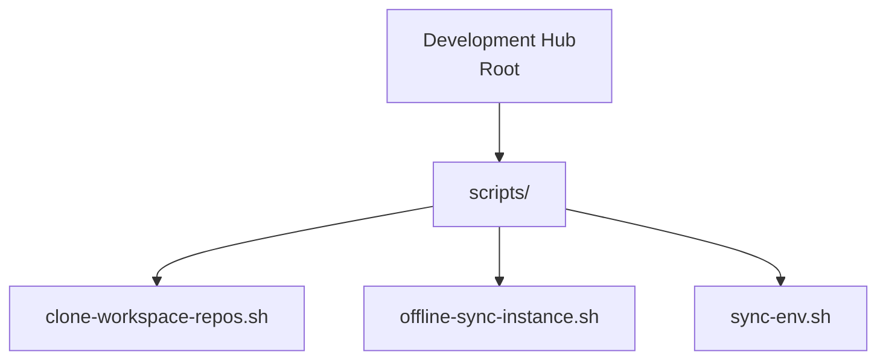
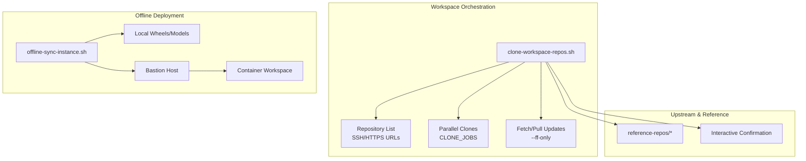
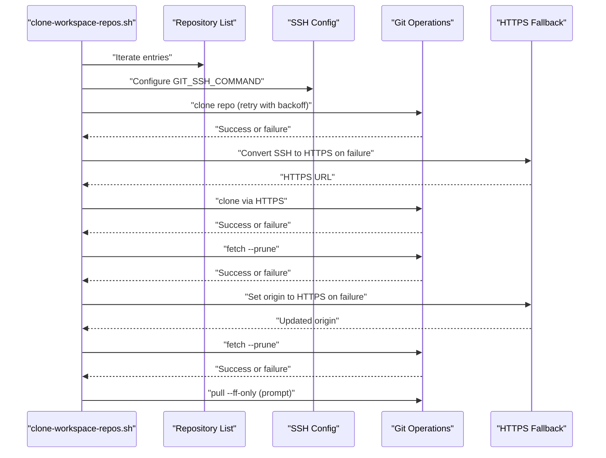
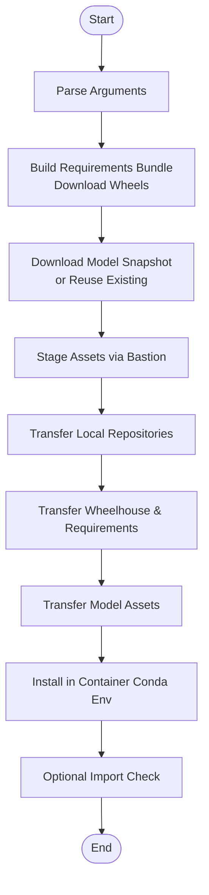
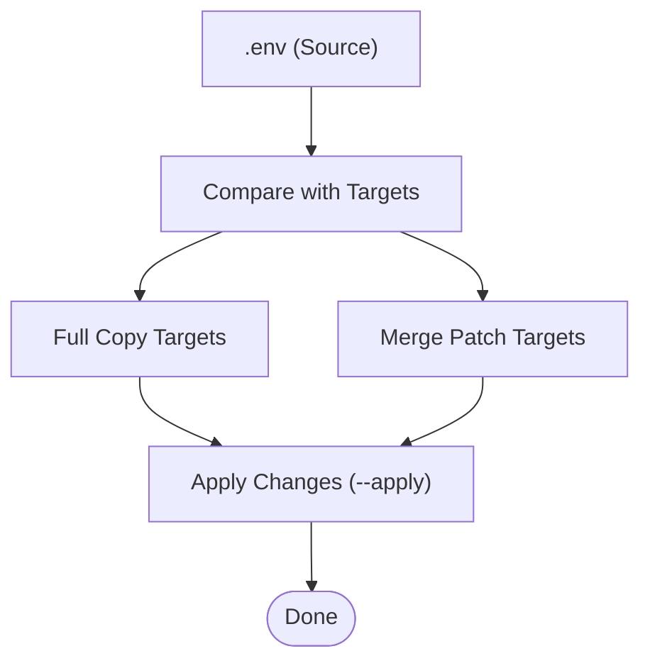
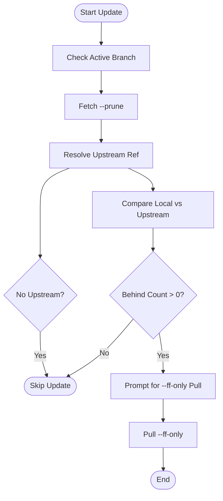
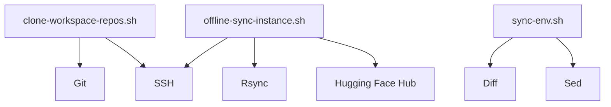

# Repository Synchronization

<cite>
**Referenced Files in This Document**
- [clone-workspace-repos.sh](file://scripts/clone-workspace-repos.sh)
- [offline-sync-instance.sh](file://scripts/offline-sync-instance.sh)
- [sync-env.sh](file://scripts/sync-env.sh)
- [test_clone_workspace_repos.py](file://tests/test_clone_workspace_repos.py)
- [README.md](file://README.md)
- [contribution-git-workflow.md](file://docs/contribution-git-workflow.md)
</cite>

## Table of Contents
1. [Introduction](#introduction)
2. [Project Structure](#project-structure)
3. [Core Components](#core-components)
4. [Architecture Overview](#architecture-overview)
5. [Detailed Component Analysis](#detailed-component-analysis)
6. [Dependency Analysis](#dependency-analysis)
7. [Performance Considerations](#performance-considerations)
8. [Troubleshooting Guide](#troubleshooting-guide)
9. [Conclusion](#conclusion)

## Introduction
This document explains the repository synchronization mechanisms within the VLLM-HUST Development Hub. It focuses on:
- Parallel cloning system for workspace repositories
- Repository update workflows and upstream synchronization
- Conflict resolution strategies and safety guards
- Implementation details of the clone script, including SSH authentication handling, HTTPS fallback, and retry logic
- Configuration options such as CLONE_JOBS, auto-approval settings, and repository filtering
- Relationships with Git operations, remote tracking branches, and upstream synchronization
- Common issues and troubleshooting guidance for large-scale repository management

## Project Structure
The synchronization ecosystem centers around three primary scripts:
- scripts/clone-workspace-repos.sh: Parallel cloning and update orchestration for workspace repositories
- scripts/offline-sync-instance.sh: Offline asset preparation and container-side installation workflow
- scripts/sync-env.sh: Propagation of canonical tokens (.env) across sibling repositories

**Diagram sources**
- [README.md:38-48](file://README.md#L38-L48)

**Section sources**
- [README.md:38-48](file://README.md#L38-L48)

## Core Components
- Parallel cloning and update orchestration:
  - Parses a curated list of repositories, supports SSH and HTTPS fallback, and runs clones in parallel controlled by CLONE_JOBS
  - Detects existing destinations, repairs non-Git directories, and prompts for upstream reference clones
  - Updates existing repositories by fetching, detecting upstream differences, and offering safe pull with --ff-only
- Offline synchronization:
  - Prepares Python wheels and model snapshots locally, then syncs them into a container via a bastion host
  - Installs local repositories in the container’s conda environment without public network access
- Environment token propagation:
  - Copies or patches a canonical .env into sibling repositories, preserving non-token settings

**Section sources**
- [clone-workspace-repos.sh:374-400](file://scripts/clone-workspace-repos.sh#L374-L400)
- [offline-sync-instance.sh:50-56](file://scripts/offline-sync-instance.sh#L50-L56)
- [sync-env.sh:19-47](file://scripts/sync-env.sh#L19-L47)

## Architecture Overview
The synchronization architecture integrates three layers:
- Workspace orchestration: clone-workspace-repos.sh orchestrates parallel cloning and updates
- Upstream and reference management: maintains upstream comparison repos under reference-repos/ and prompts for confirmation before cloning
- Offline container deployment: offline-sync-instance.sh prepares artifacts and deploys them into a container through a bastion host

**Diagram sources**
- [clone-workspace-repos.sh:374-400](file://scripts/clone-workspace-repos.sh#L374-L400)
- [offline-sync-instance.sh:50-56](file://scripts/offline-sync-instance.sh#L50-L56)

## Detailed Component Analysis

### Parallel Cloning System (clone-workspace-repos.sh)
The script implements a robust, parallelized cloning pipeline with safety checks and fallbacks:
- Configuration and environment
  - CLONE_JOBS controls parallelism; defaults to 4
  - AUTO_YES enables non-interactive approval for prompts
  - SSH configuration is built dynamically, preferring workspace-specific identities and known_hosts
- Repository list and filtering
  - Maintains a curated list of repositories, including upstream reference clones under reference-repos/*
  - Skips top-level siblings for upstream comparison repos
- Parallel execution
  - Queues clones as background jobs and waits for completion with bounded concurrency
  - Tracks failures and reports completion status
- Safety and repair
  - Detects existing destinations that are not Git worktrees and offers to move them aside or remove empty directories
  - Prompts for upstream reference clones before proceeding
- Retry and fallback
  - Uses a retry loop with exponential backoff for Git operations
  - On SSH failure, attempts HTTPS fallback by converting SSH URLs to HTTPS equivalents
- Update workflow
  - For existing Git repositories, detects upstream tracking, fetches with prune, compares local vs upstream commits, and offers a safe pull with --ff-only

**Diagram sources**
- [clone-workspace-repos.sh:66-86](file://scripts/clone-workspace-repos.sh#L66-L86)
- [clone-workspace-repos.sh:226-235](file://scripts/clone-workspace-repos.sh#L226-L235)
- [clone-workspace-repos.sh:271-278](file://scripts/clone-workspace-repos.sh#L271-L278)
- [clone-workspace-repos.sh:328-346](file://scripts/clone-workspace-repos.sh#L328-L346)
- [clone-workspace-repos.sh:362-369](file://scripts/clone-workspace-repos.sh#L362-L369)

**Section sources**
- [clone-workspace-repos.sh:8-12](file://scripts/clone-workspace-repos.sh#L8-L12)
- [clone-workspace-repos.sh:149-152](file://scripts/clone-workspace-repos.sh#L149-L152)
- [clone-workspace-repos.sh:19-47](file://scripts/clone-workspace-repos.sh#L19-L47)
- [clone-workspace-repos.sh:202-204](file://scripts/clone-workspace-repos.sh#L202-L204)
- [clone-workspace-repos.sh:260-279](file://scripts/clone-workspace-repos.sh#L260-L279)
- [clone-workspace-repos.sh:281-370](file://scripts/clone-workspace-repos.sh#L281-L370)
- [clone-workspace-repos.sh:374-400](file://scripts/clone-workspace-repos.sh#L374-L400)
- [clone-workspace-repos.sh:406-465](file://scripts/clone-workspace-repos.sh#L406-L465)

### Offline Synchronization Workflow (offline-sync-instance.sh)
This script automates preparing and deploying offline artifacts into a container:
- Artifact preparation
  - Builds a target-specific requirements bundle and downloads wheels for the target platform
  - Downloads a Hugging Face model snapshot locally or reuses an existing directory
- Container deployment
  - Uses bastion host and rsync to stage and transfer assets into the container
  - Installs local repositories into the container’s conda environment without public network access
- Configuration
  - Supports toggles for skipping model, wheelhouse, repository sync, and install steps
  - Provides extensive configuration for container host, ports, environment name, and asset roots

**Diagram sources**
- [offline-sync-instance.sh:50-56](file://scripts/offline-sync-instance.sh#L50-L56)
- [offline-sync-instance.sh:343-481](file://scripts/offline-sync-instance.sh#L343-L481)
- [offline-sync-instance.sh:510-543](file://scripts/offline-sync-instance.sh#L510-L543)
- [offline-sync-instance.sh:550-614](file://scripts/offline-sync-instance.sh#L550-L614)
- [offline-sync-instance.sh:625-639](file://scripts/offline-sync-instance.sh#L625-L639)
- [offline-sync-instance.sh:641-646](file://scripts/offline-sync-instance.sh#L641-L646)
- [offline-sync-instance.sh:648-655](file://scripts/offline-sync-instance.sh#L648-L655)
- [offline-sync-instance.sh:657-733](file://scripts/offline-sync-instance.sh#L657-L733)

**Section sources**
- [offline-sync-instance.sh:50-56](file://scripts/offline-sync-instance.sh#L50-L56)
- [offline-sync-instance.sh:343-481](file://scripts/offline-sync-instance.sh#L343-L481)
- [offline-sync-instance.sh:510-543](file://scripts/offline-sync-instance.sh#L510-L543)
- [offline-sync-instance.sh:550-614](file://scripts/offline-sync-instance.sh#L550-L614)
- [offline-sync-instance.sh:625-639](file://scripts/offline-sync-instance.sh#L625-L639)
- [offline-sync-instance.sh:641-646](file://scripts/offline-sync-instance.sh#L641-L646)
- [offline-sync-instance.sh:648-655](file://scripts/offline-sync-instance.sh#L648-L655)
- [offline-sync-instance.sh:657-733](file://scripts/offline-sync-instance.sh#L657-L733)

### Environment Token Propagation (sync-env.sh)
This script synchronizes a canonical .env across sibling repositories:
- Identifies token keys managed by the dev-hub .env and applies them consistently
- Supports two modes:
  - Full copy: identical copy into target repositories
  - Merge patch: replaces only token lines in existing .env files, preserving other settings
- Provides a dry-run mode to preview changes before applying

**Diagram sources**
- [sync-env.sh:19-47](file://scripts/sync-env.sh#L19-L47)
- [sync-env.sh:58-75](file://scripts/sync-env.sh#L58-L75)
- [sync-env.sh:79-121](file://scripts/sync-env.sh#L79-L121)

**Section sources**
- [sync-env.sh:19-47](file://scripts/sync-env.sh#L19-L47)
- [sync-env.sh:58-75](file://scripts/sync-env.sh#L58-L75)
- [sync-env.sh:79-121](file://scripts/sync-env.sh#L79-L121)

### Upstream Synchronization and Conflict Resolution
- Upstream detection and pruning
  - Fetches with prune to remove deleted remote-tracking branches
  - Resolves upstream ref and compares local vs upstream commits using rev-list --left-right
- Conflict prevention
  - Uses --ff-only pull to prevent merge commits and preserve linear history
  - Skips pull when upstream branch is unavailable or when no upstream tracking is configured
- Safety guards
  - Tests for HEAD and active branch presence before attempting updates
  - Handles missing upstream gracefully and distinguishes between missing upstream and deleted upstream branches

**Diagram sources**
- [clone-workspace-repos.sh:281-370](file://scripts/clone-workspace-repos.sh#L281-L370)

**Section sources**
- [clone-workspace-repos.sh:281-370](file://scripts/clone-workspace-repos.sh#L281-L370)
- [test_clone_workspace_repos.py:65-106](file://tests/test_clone_workspace_repos.py#L65-L106)

## Dependency Analysis
- Internal dependencies
  - clone-workspace-repos.sh depends on Git and SSH availability and constructs GIT_SSH_COMMAND dynamically
  - offline-sync-instance.sh depends on ssh and rsync for bastion and container transfers
  - sync-env.sh depends on diff and sed for token synchronization
- External dependencies
  - GitHub SSH and HTTPS URLs for repository access
  - Hugging Face hub for model downloads
  - Conda environments for offline installation

**Diagram sources**
- [clone-workspace-repos.sh:57-60](file://scripts/clone-workspace-repos.sh#L57-L60)
- [offline-sync-instance.sh:740-742](file://scripts/offline-sync-instance.sh#L740-L742)
- [sync-env.sh:64-74](file://scripts/sync-env.sh#L64-L74)

**Section sources**
- [clone-workspace-repos.sh:57-60](file://scripts/clone-workspace-repos.sh#L57-L60)
- [offline-sync-instance.sh:740-742](file://scripts/offline-sync-instance.sh#L740-L742)
- [sync-env.sh:64-74](file://scripts/sync-env.sh#L64-L74)

## Performance Considerations
- Parallelism tuning
  - Adjust CLONE_JOBS to balance throughput and resource usage; higher values increase concurrency but may saturate network or disk IO
- Network resilience
  - Exponential backoff reduces contention and improves success rates under transient failures
- Offline optimization
  - Preparing wheels and models locally minimizes container-side network usage and speeds up deployment
- Pruning and maintenance
  - Regular fetch --prune keeps remote-tracking branches current and avoids unnecessary merges

[No sources needed since this section provides general guidance]

## Troubleshooting Guide
Common issues and resolutions:
- Authentication failures
  - SSH identity not found: ensure workspace SSH identity files exist under the workspace .ssh directory or provide a config file; the script builds GIT_SSH_COMMAND dynamically
  - HTTPS fallback: the script converts SSH URLs to HTTPS when SSH fails; confirm HTTPS access is available
- Network connectivity problems
  - Transient failures: the retry loop with exponential backoff handles temporary network issues; monitor logs for retry messages
  - Bastion connectivity: verify bastion alias and credentials; ensure rsync and SSH are available on the local machine
- Repository conflicts
  - Upstream unavailable: when upstream branch is deleted or unreachable, the script skips updates and suggests manual intervention
  - Dirty worktree: ensure the working directory is clean before updates; the script validates active branch and upstream presence
- Large-scale management
  - Increase CLONE_JOBS cautiously; monitor system resources and adjust based on network bandwidth and disk IO limits
  - Use dry-run modes where applicable (e.g., sync-env.sh) to preview changes before applying

**Section sources**
- [clone-workspace-repos.sh:19-47](file://scripts/clone-workspace-repos.sh#L19-L47)
- [clone-workspace-repos.sh:226-235](file://scripts/clone-workspace-repos.sh#L226-L235)
- [clone-workspace-repos.sh:328-346](file://scripts/clone-workspace-repos.sh#L328-L346)
- [offline-sync-instance.sh:211-240](file://scripts/offline-sync-instance.sh#L211-L240)
- [test_clone_workspace_repos.py:65-106](file://tests/test_clone_workspace_repos.py#L65-L106)

## Conclusion
The VLLM-HUST Development Hub provides a comprehensive, resilient synchronization framework:
- Parallel cloning with SSH/HTTPS fallback and retry logic
- Safe upstream synchronization using fetch/prune and --ff-only pulls
- Offline deployment automation for container environments
- Consistent token propagation across repositories

These mechanisms collectively support efficient, scalable, and reliable repository management for large-scale development workflows.