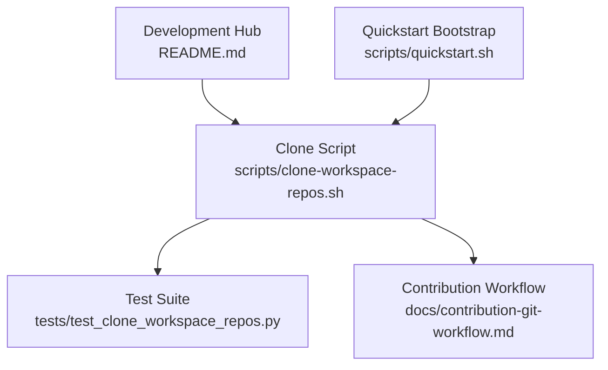
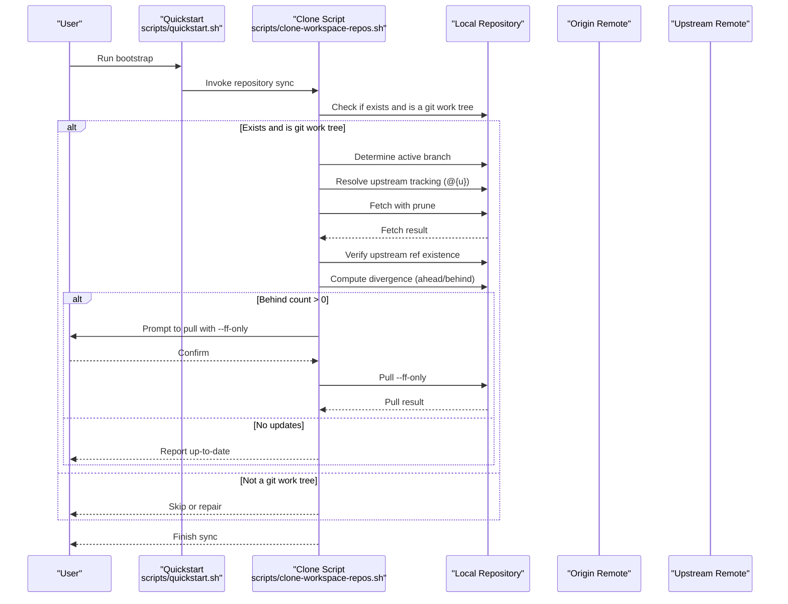
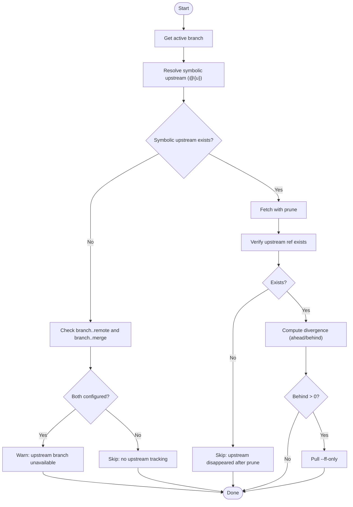
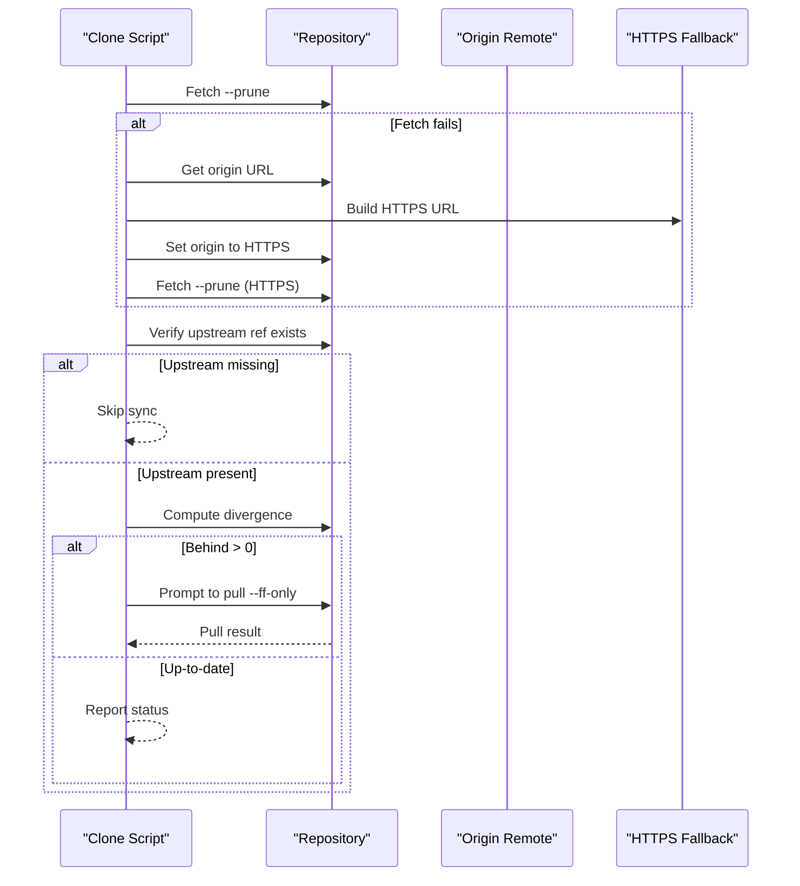
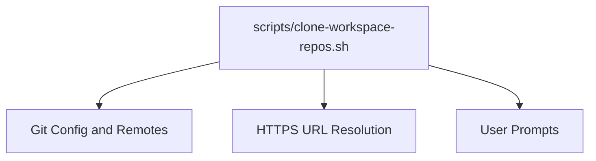

# Upstream Management

<cite>
**Referenced Files in This Document**
- [README.md](file://README.md)
- [clone-workspace-repos.sh](file://scripts/clone-workspace-repos.sh)
- [test_clone_workspace_repos.py](file://tests/test_clone_workspace_repos.py)
- [contribution-git-workflow.md](file://docs/contribution-git-workflow.md)
- [quickstart.sh](file://scripts/quickstart.sh)
</cite>

## Table of Contents
1. [Introduction](#introduction)
2. [Project Structure](#project-structure)
3. [Core Components](#core-components)
4. [Architecture Overview](#architecture-overview)
5. [Detailed Component Analysis](#detailed-component-analysis)
6. [Dependency Analysis](#dependency-analysis)
7. [Performance Considerations](#performance-considerations)
8. [Troubleshooting Guide](#troubleshooting-guide)
9. [Conclusion](#conclusion)

## Introduction
This document explains upstream repository management within the VLLM-HUST Development Hub. It focuses on how upstream reference repositories are identified, synchronized, and tracked; how the hub distinguishes between main development repositories and upstream comparison repositories; and how synchronization workflows maintain version alignment across forks and upstream branches. The content is grounded in the repository’s scripts and documentation, and provides practical guidance for setting up upstream tracking, resolving common issues, and maintaining healthy upstream relationships.

## Project Structure
The upstream management capability centers around a bootstrap and synchronization script that:
- Clones a curated set of repositories, including upstream reference repositories under a dedicated directory
- Detects existing local repositories and synchronizes them with remote updates
- Interactively confirms upstream reference clones
- Validates upstream tracking configuration and handles unavailable or pruned upstream branches
- Attempts pull with a safe strategy when updates are available

**Diagram sources**
- [README.md:15-33](file://README.md#L15-L33)
- [clone-workspace-repos.sh:374-400](file://scripts/clone-workspace-repos.sh#L374-L400)
- [test_clone_workspace_repos.py:33-106](file://tests/test_clone_workspace_repos.py#L33-L106)
- [contribution-git-workflow.md:135-151](file://docs/contribution-git-workflow.md#L135-L151)
- [quickstart.sh:1-20](file://scripts/quickstart.sh#L1-L20)

**Section sources**
- [README.md:15-33](file://README.md#L15-L33)
- [README.md:69-71](file://README.md#L69-L71)
- [README.md:278-287](file://README.md#L278-L287)

## Core Components
- Upstream reference repository catalog: The script defines upstream reference repositories under a dedicated namespace, ensuring they are separated from main development repositories.
- Upstream tracking detection: The script inspects branch-level upstream configuration and resolves the symbolic upstream reference to determine synchronization behavior.
- Synchronization workflow: The script fetches updates, validates upstream availability, computes divergence, and conditionally pulls with a safe strategy.
- Interactive upstream reference cloning: The script prompts users to confirm upstream reference clones, preventing accidental inclusion of upstream repositories in the primary workspace.

Key behaviors:
- Upstream reference repositories are listed separately and placed under a dedicated directory for comparison and sync work.
- The script respects branch-level upstream configuration and gracefully handles missing or pruned upstream branches.
- Pull operations use a safe strategy to avoid unwanted merges.

**Section sources**
- [clone-workspace-repos.sh:374-400](file://scripts/clone-workspace-repos.sh#L374-L400)
- [clone-workspace-repos.sh:281-370](file://scripts/clone-workspace-repos.sh#L281-L370)
- [README.md:278-287](file://README.md#L278-L287)

## Architecture Overview
The upstream management architecture integrates repository discovery, upstream tracking resolution, synchronization, and user interaction.

**Diagram sources**
- [quickstart.sh:1-20](file://scripts/quickstart.sh#L1-L20)
- [clone-workspace-repos.sh:281-370](file://scripts/clone-workspace-repos.sh#L281-L370)

## Detailed Component Analysis

### Upstream Reference Repository Catalog
- Purpose: Maintain a curated set of upstream repositories for comparison and synchronization.
- Location: The catalog is embedded in the clone script and includes upstream projects under a dedicated namespace.
- Behavior: Upstream reference repositories are kept separate from main development repositories and are optionally cloned interactively.

Implementation highlights:
- Repository list includes upstream reference entries under a dedicated namespace.
- Upstream reference clones are subject to user confirmation before cloning.

**Section sources**
- [clone-workspace-repos.sh:374-400](file://scripts/clone-workspace-repos.sh#L374-L400)
- [README.md:278-287](file://README.md#L278-L287)

### Upstream Tracking Detection and Validation
- Purpose: Determine whether a local branch has an upstream tracking relationship and validate its availability.
- Mechanism:
  - Resolve the symbolic upstream reference to detect tracking.
  - If no symbolic upstream is set, inspect branch-level remote and merge configuration.
  - Validate upstream branch existence after fetch/prune.
  - Compute divergence to decide whether to pull.

**Diagram sources**
- [clone-workspace-repos.sh:313-351](file://scripts/clone-workspace-repos.sh#L313-L351)

**Section sources**
- [clone-workspace-repos.sh:313-351](file://scripts/clone-workspace-repos.sh#L313-L351)
- [test_clone_workspace_repos.py:65-106](file://tests/test_clone_workspace_repos.py#L65-L106)

### Synchronization Strategy and Pull Safety
- Strategy: When updates are available, the script prompts the user to pull with a safe strategy designed to avoid unnecessary merges.
- Safety: The pull operation uses a fast-forward-only strategy to preserve linear history and prevent unexpected merge commits.
- Fallbacks: The script attempts SSH cloning and fetching first, with HTTPS fallbacks when SSH fails or is unavailable.

**Diagram sources**
- [clone-workspace-repos.sh:328-370](file://scripts/clone-workspace-repos.sh#L328-L370)

**Section sources**
- [clone-workspace-repos.sh:328-370](file://scripts/clone-workspace-repos.sh#L328-L370)

### Relationship to Main Development Repositories and Version Alignment
- Main development repositories are grouped under the organization’s namespace and are synchronized regularly.
- Upstream reference repositories are separated for comparison and historical alignment.
- The contribution workflow emphasizes syncing main, avoiding direct modifications to main, and using PRs to integrate changes.

**Section sources**
- [README.md:69-71](file://README.md#L69-L71)
- [contribution-git-workflow.md:135-151](file://docs/contribution-git-workflow.md#L135-L151)

## Dependency Analysis
The upstream management logic depends on:
- Git configuration for branch-level upstream tracking
- Remote URL resolution and HTTPS fallbacks
- User prompts for interactive cloning and pulling decisions

**Diagram sources**
- [clone-workspace-repos.sh:313-370](file://scripts/clone-workspace-repos.sh#L313-L370)

**Section sources**
- [clone-workspace-repos.sh:313-370](file://scripts/clone-workspace-repos.sh#L313-L370)

## Performance Considerations
- Parallel cloning: The script supports configurable parallelism to speed up repository initialization.
- Retry logic: Network operations are retried with exponential backoff to improve resilience.
- Pruning: Fetch operations prune remote-tracking branches to keep metadata lean.

Recommendations:
- Adjust the parallelism level to match available bandwidth and CPU resources.
- Monitor network conditions; the built-in retries help mitigate transient failures.

**Section sources**
- [README.md:277-277](file://README.md#L277-L277)
- [clone-workspace-repos.sh:66-86](file://scripts/clone-workspace-repos.sh#L66-L86)
- [clone-workspace-repos.sh:328-346](file://scripts/clone-workspace-repos.sh#L328-L346)

## Troubleshooting Guide
Common upstream management issues and resolutions:

- Missing upstream tracking branch
  - Symptom: The script reports no upstream tracking branch for a repository.
  - Cause: The active branch lacks a symbolic upstream reference and no branch-level tracking is configured.
  - Action: Configure upstream tracking for the branch or switch to a branch with proper tracking.

- Unavailable upstream branch after prune
  - Symptom: The script detects that the upstream branch disappeared after fetch with prune.
  - Cause: The upstream branch was deleted or renamed remotely.
  - Action: Recreate the branch locally or update the tracking reference to a valid upstream branch.

- Deleted upstream branch vs. missing configuration
  - Symptom: The script distinguishes between a deleted upstream branch and a missing configuration.
  - Evidence: Tests demonstrate that the script correctly handles both scenarios differently.

- Fetch failures and SSH/HTTPS fallbacks
  - Symptom: Fetch operations fail due to SSH configuration issues.
  - Action: The script attempts HTTPS fallbacks; ensure HTTPS access is permitted and retry.

- Pull failures during synchronization
  - Symptom: Pull operations fail when attempting to fast-forward.
  - Action: Investigate divergence and conflicts; resolve conflicts locally and retry with a safe strategy.

**Section sources**
- [clone-workspace-repos.sh:313-351](file://scripts/clone-workspace-repos.sh#L313-L351)
- [test_clone_workspace_repos.py:65-106](file://tests/test_clone_workspace_repos.py#L65-L106)
- [clone-workspace-repos.sh:328-370](file://scripts/clone-workspace-repos.sh#L328-L370)

## Conclusion
The VLLM-HUST Development Hub provides a robust, script-driven mechanism for managing upstream repositories. By separating upstream reference repositories, validating upstream tracking, and applying safe synchronization strategies, the system helps maintain accurate version alignment with upstream while keeping main development repositories stable. The included tests and documentation further reinforce reliable upstream workflows, enabling teams to confidently track, synchronize, and troubleshoot upstream relationships.