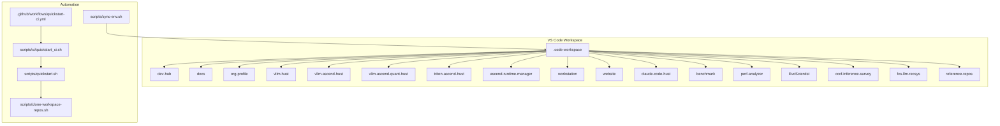
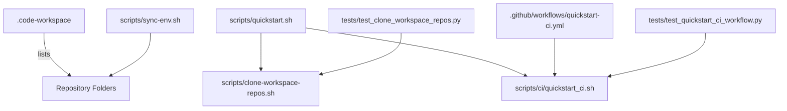

# Workspace Configuration

<cite>
**Referenced Files in This Document**
- [vllm-hust-dev-hub.code-workspace](file://vllm-hust-dev-hub.code-workspace)
- [README.md](file://README.md)
- [scripts/clone-workspace-repos.sh](file://scripts/clone-workspace-repos.sh)
- [scripts/quickstart.sh](file://scripts/quickstart.sh)
- [scripts/sync-env.sh](file://scripts/sync-env.sh)
- [.github/workflows/quickstart-ci.yml](file://.github/workflows/quickstart-ci.yml)
- [scripts/ci/quickstart_ci.sh](file://scripts/ci/quickstart_ci.sh)
- [tests/test_clone_workspace_repos.py](file://tests/test_clone_workspace_repos.py)
- [tests/test_quickstart_ci_workflow.py](file://tests/test_quickstart_ci_workflow.py)
</cite>

## Table of Contents
1. [Introduction](#introduction)
2. [Project Structure](#project-structure)
3. [Core Components](#core-components)
4. [Architecture Overview](#architecture-overview)
5. [Detailed Component Analysis](#detailed-component-analysis)
6. [Dependency Analysis](#dependency-analysis)
7. [Performance Considerations](#performance-considerations)
8. [Troubleshooting Guide](#troubleshooting-guide)
9. [Conclusion](#conclusion)
10. [Appendices](#appendices)

## Introduction
This document explains the workspace configuration for the VLLM-HUST Development Hub, focusing on the VS Code multi-root workspace setup, repository organization, and the .code-workspace file format. It describes how the workspace file defines the development environment layout, including folder mappings, settings inheritance, and multi-repository coordination. It also covers workspace initialization, folder management, and integration with the broader development ecosystem, including CI and team onboarding.

## Project Structure
The VLLM-HUST Development Hub centers around a VS Code multi-root workspace that groups related repositories under a shared parent directory. The workspace file enumerates folders with human-friendly names and relative paths, while scripts automate repository bootstrapping, environment setup, and cross-repo synchronization.

```mermaid
graph TB
DevHub["Dev Hub Repo<br/>.code-workspace"] --> Docs["Docs Repo"]
DevHub --> OrgProfile["Org Profile Repo"]
DevHub --> EngineVLLM["Engine: vllm-hust"]
DevHub --> EngineAscend["Engine: vllm-ascend-hust"]
DevHub --> EngineQuant["Engine: vllm-ascend-quant-hust"]
DevHub --> TritonAscend["Engine: triton-ascend-hust"]
DevHub --> RuntimeMgr["Tool: ascend-runtime-manager"]
DevHub --> WebWorkstation["Web: workstation"]
DevHub --> WebWebsite["Web: website"]
DevHub --> ToolClaude["Tool: claude-code-hust"]
DevHub --> PerfBenchmark["Perf: benchmark"]
DevHub --> PerfAnalyzer["Perf: perf-analyzer"]
DevHub --> ResearchEvo["Research: EvoScientist"]
DevHub --> PaperCCCF["Paper: inference survey"]
DevHub --> PaperFCS["Paper: recsys"]
DevHub --> RefRepos["Reference Repos"]
```

**Diagram sources**
- [vllm-hust-dev-hub.code-workspace](file://vllm-hust-dev-hub.code-workspace)
- [README.md](file://README.md)

**Section sources**
- [vllm-hust-dev-hub.code-workspace](file://vllm-hust-dev-hub.code-workspace)
- [README.md](file://README.md)

## Core Components
- VS Code Multi-root Workspace (.code-workspace): Defines the set of folders and global settings for the development environment.
- Bootstrap Scripts: Automate repository cloning, environment setup, and container workflows.
- CI Integration: Ensures reproducible workspace initialization in automated runners.
- Cross-repo Synchronization: Keeps shared secrets and environment files consistent across sibling repositories.

**Section sources**
- [vllm-hust-dev-hub.code-workspace](file://vllm-hust-dev-hub.code-workspace)
- [README.md](file://README.md)
- [.github/workflows/quickstart-ci.yml](file://.github/workflows/quickstart-ci.yml)

## Architecture Overview
The workspace orchestrates a collection of sibling repositories under a common parent directory. VS Code opens a multi-root workspace that includes both local development repositories and reference/upstream repositories. Scripts coordinate cloning, environment creation, and optional containerized development.

**Diagram sources**
- [vllm-hust-dev-hub.code-workspace](file://vllm-hust-dev-hub.code-workspace)
- [scripts/quickstart.sh](file://scripts/quickstart.sh)
- [scripts/clone-workspace-repos.sh](file://scripts/clone-workspace-repos.sh)
- [scripts/sync-env.sh](file://scripts/sync-env.sh)
- [scripts/ci/quickstart_ci.sh](file://scripts/ci/quickstart_ci.sh)
- [.github/workflows/quickstart-ci.yml](file://.github/workflows/quickstart-ci.yml)

## Detailed Component Analysis

### VS Code Multi-root Workspace (.code-workspace)
- Purpose: Centralizes related repositories for unified editing, debugging, and navigation.
- Folder Mappings: Each entry specifies a display name and a relative path to a sibling repository under the workspace parent.
- Settings Inheritance: Global settings exclude caches and build artifacts across all folders to improve indexing and search performance.

Concrete configuration highlights:
- folders: An array of objects with name and path fields for each repository.
- settings.files.exclude and settings.search.exclude: Globally suppress common cache/build directories.

Operational guidance:
- Open the workspace directly in VS Code using the .code-workspace file.
- Add or remove repositories by editing the folders array.
- Use the included scripts to clone repositories and maintain consistent paths.

**Section sources**
- [vllm-hust-dev-hub.code-workspace](file://vllm-hust-dev-hub.code-workspace)
- [README.md](file://README.md)

### Repository Organization and Grouping Strategies
Repositories are grouped by functional domain:
- Infrastructure: engine, runtime manager, and related components
- Applications: web frontend/backend and workstation tools
- Tooling: benchmarking, performance analyzer, and research utilities
- Papers and Surveys: academic deliverables
- Reference Repositories: upstream projects for comparison

Grouping rationale:
- Co-location under a shared parent simplifies VS Code folder mappings and container mounting.
- Upstream references are separated into a dedicated namespace to avoid confusion with local forks.

**Section sources**
- [vllm-hust-dev-hub.code-workspace](file://vllm-hust-dev-hub.code-workspace)
- [README.md](file://README.md)

### Workspace Initialization and Folder Management
Initialization flow:
- Open the .code-workspace file in VS Code.
- Optionally run the bootstrap script to clone repositories in parallel.
- The script respects existing local clones and offers to pull updates or repair non-Git directories.

Parallel cloning:
- Uses background jobs controlled by a configurable concurrency parameter.
- Applies robust retry logic and SSH/HTTPS fallback for clone and fetch operations.

Folder management:
- The workspace file lists all sibling repositories; adding a new sibling requires updating the .code-workspace file.
- Scripts can be used to synchronize environment tokens across sibling repos.

**Section sources**
- [README.md](file://README.md)
- [scripts/clone-workspace-repos.sh](file://scripts/clone-workspace-repos.sh)
- [scripts/quickstart.sh](file://scripts/quickstart.sh)

### Integration with the Broader Development Ecosystem
- Team Onboarding: The hub README documents recommended bootstrap flows and environment setup.
- CI Workflows: A GitHub Actions workflow runs the CI bootstrap script to validate workspace initialization and test installations.
- Containerized Development: Helper scripts streamline container setup and SSH access for Ascend-enabled development.

**Section sources**
- [README.md](file://README.md)
- [.github/workflows/quickstart-ci.yml](file://.github/workflows/quickstart-ci.yml)
- [scripts/ci/quickstart_ci.sh](file://scripts/ci/quickstart_ci.sh)

### Environment Synchronization Across Repositories
The sync-env script propagates a canonical .env file from the dev-hub repository to sibling repositories:
- Full-copy targets: Replace target .env with the dev-hub .env.
- Merge targets: Patch only token lines in place, preserving other settings.

This ensures consistent secrets across the workspace while allowing per-repo overrides for non-token settings.

**Section sources**
- [scripts/sync-env.sh](file://scripts/sync-env.sh)

### CI and Reproducible Workspace Setup
The CI workflow:
- Checks out the dev-hub repository.
- Installs Miniconda if needed.
- Runs the CI bootstrap script, which invokes the main quickstart script with non-interactive flags.
- Executes smoke tests and validation steps against installed components.

This guarantees that the workspace configuration remains compatible across environments and that multi-repository setups can be reproduced reliably.

**Section sources**
- [.github/workflows/quickstart-ci.yml](file://.github/workflows/quickstart-ci.yml)
- [scripts/ci/quickstart_ci.sh](file://scripts/ci/quickstart_ci.sh)

## Dependency Analysis
The workspace depends on a shared parent directory structure and coordinated automation scripts. The following diagram shows how components depend on each other:

**Diagram sources**
- [vllm-hust-dev-hub.code-workspace](file://vllm-hust-dev-hub.code-workspace)
- [scripts/quickstart.sh](file://scripts/quickstart.sh)
- [scripts/clone-workspace-repos.sh](file://scripts/clone-workspace-repos.sh)
- [scripts/ci/quickstart_ci.sh](file://scripts/ci/quickstart_ci.sh)
- [.github/workflows/quickstart-ci.yml](file://.github/workflows/quickstart-ci.yml)
- [scripts/sync-env.sh](file://scripts/sync-env.sh)
- [tests/test_clone_workspace_repos.py](file://tests/test_clone_workspace_repos.py)
- [tests/test_quickstart_ci_workflow.py](file://tests/test_quickstart_ci_workflow.py)

**Section sources**
- [vllm-hust-dev-hub.code-workspace](file://vllm-hust-dev-hub.code-workspace)
- [scripts/quickstart.sh](file://scripts/quickstart.sh)
- [scripts/clone-workspace-repos.sh](file://scripts/clone-workspace-repos.sh)
- [scripts/ci/quickstart_ci.sh](file://scripts/ci/quickstart_ci.sh)
- [.github/workflows/quickstart-ci.yml](file://.github/workflows/quickstart-ci.yml)
- [scripts/sync-env.sh](file://scripts/sync-env.sh)
- [tests/test_clone_workspace_repos.py](file://tests/test_clone_workspace_repos.py)
- [tests/test_quickstart_ci_workflow.py](file://tests/test_quickstart_ci_workflow.py)

## Performance Considerations
- Parallel cloning reduces total bootstrap time by concurrently fetching multiple repositories.
- Excluding caches and build artifacts in workspace settings improves indexing and search performance.
- CI scripts isolate conda operations and avoid unnecessary environment churn to speed up automated runs.

[No sources needed since this section provides general guidance]

## Troubleshooting Guide
Common issues and resolutions:
- SSH/HTTPS clone failures: The clone script retries failed operations and falls back to HTTPS when SSH is unavailable. Adjust credentials or network settings accordingly.
- Existing non-Git directories: The script repairs or backs up directories that are not Git worktrees before cloning.
- Upstream branch deletion: The script detects deleted upstream branches and avoids leaving literal "@{u}" references.
- CI authentication: The CI workflow supports both HTTPS and SSH modes for cloning; ensure proper secrets are configured for the chosen mode.
- Environment synchronization: Use the sync-env script to propagate tokens consistently across sibling repos, applying either full replacement or targeted token patching.

**Section sources**
- [scripts/clone-workspace-repos.sh](file://scripts/clone-workspace-repos.sh)
- [tests/test_clone_workspace_repos.py](file://tests/test_clone_workspace_repos.py)
- [.github/workflows/quickstart-ci.yml](file://.github/workflows/quickstart-ci.yml)
- [scripts/ci/quickstart_ci.sh](file://scripts/ci/quickstart_ci.sh)
- [scripts/sync-env.sh](file://scripts/sync-env.sh)

## Conclusion
The VLLM-HUST Development Hub’s workspace configuration provides a scalable, reproducible foundation for multi-repository development. By centralizing folder mappings, automating repository bootstrapping, and integrating with CI and containerized workflows, teams can maintain consistency and efficiency across diverse development tasks.

[No sources needed since this section summarizes without analyzing specific files]

## Appendices

### Example Scenarios and Best Practices
- Adding a New Repository:
  - Place the repository as a sibling under the workspace parent.
  - Update the .code-workspace file to include the new folder entry.
  - Optionally run the bootstrap script to clone and integrate the repository.
- Repository Grouping:
  - Keep related repositories close to minimize path complexity.
  - Separate upstream references into a dedicated namespace to avoid confusion.
- Workspace Customization:
  - Extend global settings to tailor ignore patterns or search scopes.
  - Use the sync-env script to propagate tokens across sibling repos.
- Maintaining Consistency:
  - Use CI workflows to validate workspace initialization regularly.
  - Encourage team members to use the provided scripts for reproducible setups.

**Section sources**
- [vllm-hust-dev-hub.code-workspace](file://vllm-hust-dev-hub.code-workspace)
- [README.md](file://README.md)
- [scripts/quickstart.sh](file://scripts/quickstart.sh)
- [scripts/sync-env.sh](file://scripts/sync-env.sh)
- [.github/workflows/quickstart-ci.yml](file://.github/workflows/quickstart-ci.yml)