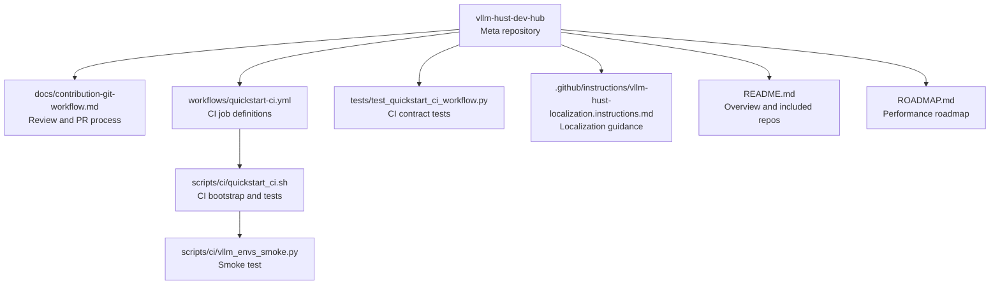
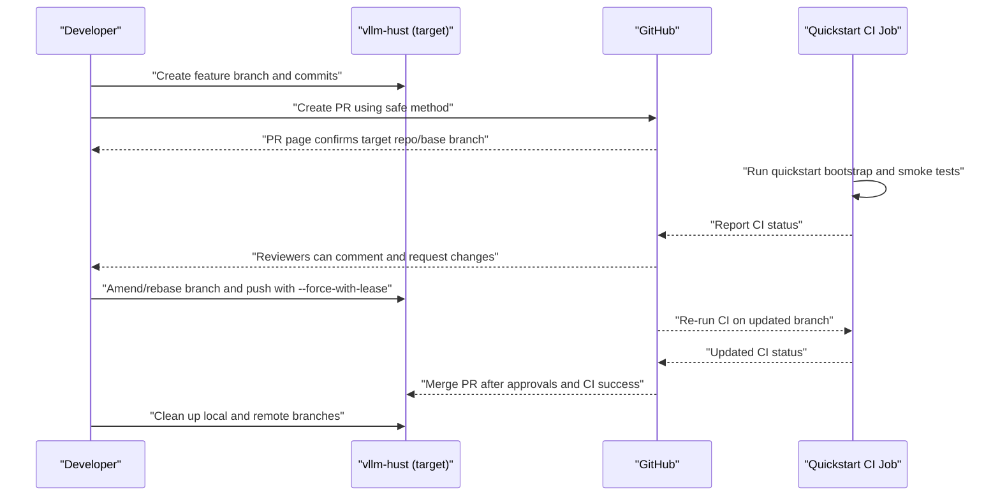
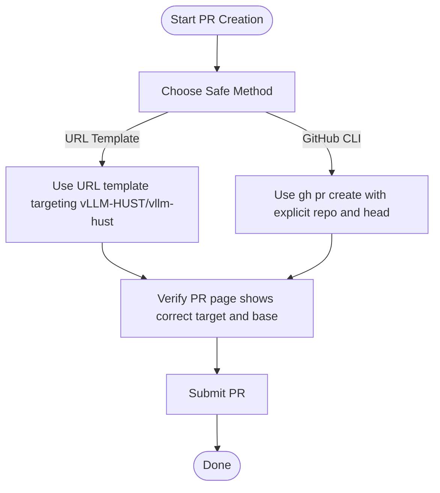
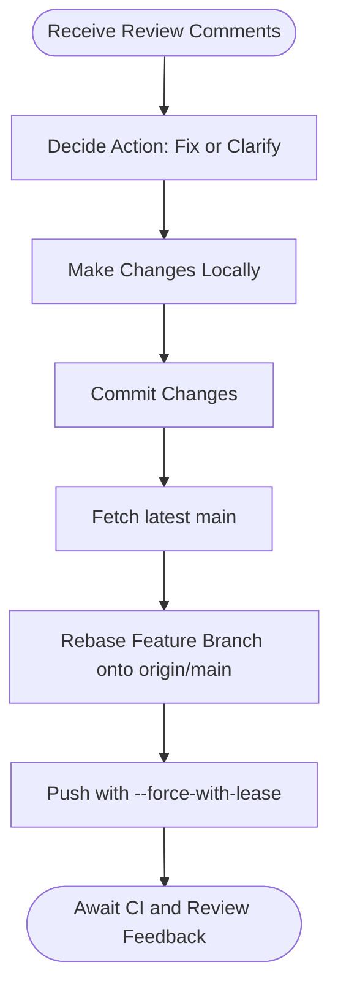
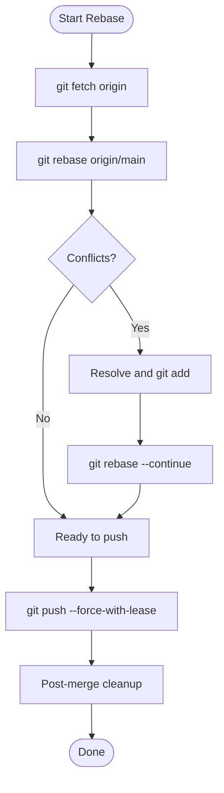
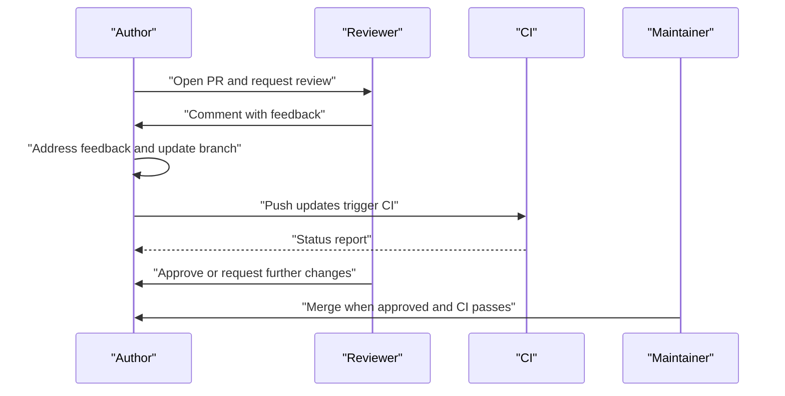
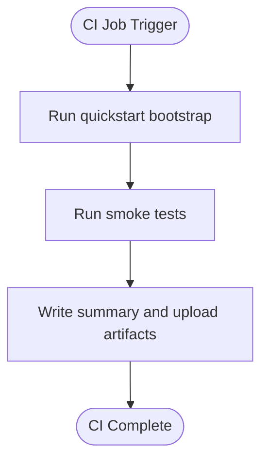
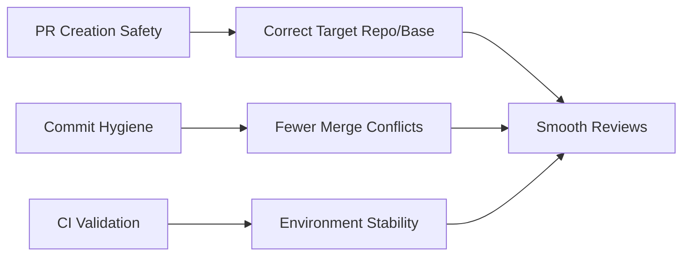

# Code Review Process

<cite>
**Referenced Files in This Document**
- [README.md](file://README.md)
- [ROADMAP.md](file://ROADMAP.md)
- [docs/contribution-git-workflow.md](file://docs/contribution-git-workflow.md)
- [.github/workflows/quickstart-ci.yml](file://.github/workflows/quickstart-ci.yml)
- [scripts/ci/quickstart_ci.sh](file://scripts/ci/quickstart_ci.sh)
- [scripts/ci/vllm_envs_smoke.py](file://scripts/ci/vllm_envs_smoke.py)
- [tests/test_quickstart_ci_workflow.py](file://tests/test_quickstart_ci_workflow.py)
- [.github/instructions/vllm-hust-localization.instructions.md](file://.github/instructions/vllm-hust-localization.instructions.md)
</cite>

## Table of Contents
1. [Introduction](#introduction)
2. [Project Structure](#project-structure)
3. [Core Components](#core-components)
4. [Architecture Overview](#architecture-overview)
5. [Detailed Component Analysis](#detailed-component-analysis)
6. [Dependency Analysis](#dependency-analysis)
7. [Performance Considerations](#performance-considerations)
8. [Troubleshooting Guide](#troubleshooting-guide)
9. [Conclusion](#conclusion)

## Introduction
This document defines the code review process for the VLLM-HUST Development Hub. It explains how to create pull requests safely, how to respond to review comments, and how to maintain a clean commit history. It also documents safety mechanisms to prevent submitting PRs to incorrect repositories, outlines rebase and force-push practices, and provides guidance on timelines and communication during reviews.

## Project Structure
The repository is a meta repository that coordinates development across multiple related repositories and provides automation for environment bootstrapping and CI. The code review process is primarily governed by the contribution workflow documentation and the CI pipeline that validates environment setup and basic smoke tests.

**Diagram sources**
- [README.md:1-288](file://README.md#L1-L288)
- [docs/contribution-git-workflow.md:1-501](file://docs/contribution-git-workflow.md#L1-L501)
- [.github/workflows/quickstart-ci.yml:1-149](file://.github/workflows/quickstart-ci.yml#L1-L149)
- [scripts/ci/quickstart_ci.sh:101-154](file://scripts/ci/quickstart_ci.sh#L101-L154)
- [scripts/ci/vllm_envs_smoke.py:1-69](file://scripts/ci/vllm_envs_smoke.py#L1-L69)
- [tests/test_quickstart_ci_workflow.py:1-142](file://tests/test_quickstart_ci_workflow.py#L1-L142)
- [.github/instructions/vllm-hust-localization.instructions.md:1-31](file://.github/instructions/vllm-hust-localization.instructions.md#L1-L31)
- [ROADMAP.md:1-83](file://ROADMAP.md#L1-L83)

**Section sources**
- [README.md:1-288](file://README.md#L1-L288)
- [ROADMAP.md:1-83](file://ROADMAP.md#L1-L83)

## Core Components
- Contribution and PR workflow: Defines branch naming, PR creation safety, commit hygiene, and post-merge cleanup.
- CI pipeline: Validates environment bootstrap and smoke tests to ensure changes do not break the developer environment.
- Localization guidance: Establishes principles for keeping changes merge-safe and upstream-compatible.
- Performance roadmap: Provides context for prioritizing and scoping changes that affect review scope and timelines.

**Section sources**
- [docs/contribution-git-workflow.md:1-501](file://docs/contribution-git-workflow.md#L1-L501)
- [.github/workflows/quickstart-ci.yml:1-149](file://.github/workflows/quickstart-ci.yml#L1-L149)
- [.github/instructions/vllm-hust-localization.instructions.md:1-31](file://.github/instructions/vllm-hust-localization.instructions.md#L1-L31)
- [ROADMAP.md:1-83](file://ROADMAP.md#L1-L83)

## Architecture Overview
The code review lifecycle integrates local development, PR creation, automated CI validation, and post-merge cleanup. The CI job runs environment bootstrap and smoke tests to guard against regressions introduced by PRs.

**Diagram sources**
- [docs/contribution-git-workflow.md:304-394](file://docs/contribution-git-workflow.md#L304-L394)
- [.github/workflows/quickstart-ci.yml:1-149](file://.github/workflows/quickstart-ci.yml#L1-L149)
- [scripts/ci/quickstart_ci.sh:101-154](file://scripts/ci/quickstart_ci.sh#L101-L154)

## Detailed Component Analysis

### PR Creation Workflow and Safety Mechanisms
- Use a safe PR creation method to ensure the PR targets the intended organization repository and base branch.
- Avoid short links that may default to upstream repositories.
- Confirm PR target and base branch on the PR page before merging.

**Diagram sources**
- [docs/contribution-git-workflow.md:304-351](file://docs/contribution-git-workflow.md#L304-L351)

**Section sources**
- [docs/contribution-git-workflow.md:304-351](file://docs/contribution-git-workflow.md#L304-L351)

### Review Expectations and Response Procedures
- Respond to review comments by amending or adding commits, then rebasing and force-pushing with a safety flag.
- Keep commits focused and clean; avoid pushing to main.
- Maintain a clean worktree and avoid committing untracked or unintended changes.

**Diagram sources**
- [docs/contribution-git-workflow.md:205-223](file://docs/contribution-git-workflow.md#L205-L223)

**Section sources**
- [docs/contribution-git-workflow.md:205-223](file://docs/contribution-git-workflow.md#L205-L223)

### Rebase Workflow and Safe Force Push Practices
- Rebase your branch on top of the latest main to minimize merge conflicts.
- Use a safety-aware force push to avoid overwriting others’ work.
- Clean up local and remote branches after merge.

**Diagram sources**
- [docs/contribution-git-workflow.md:413-426](file://docs/contribution-git-workflow.md#L413-L426)
- [docs/contribution-git-workflow.md:374-394](file://docs/contribution-git-workflow.md#L374-L394)

**Section sources**
- [docs/contribution-git-workflow.md:413-426](file://docs/contribution-git-workflow.md#L413-L426)
- [docs/contribution-git-workflow.md:374-394](file://docs/contribution-git-workflow.md#L374-L394)

### Communication Protocols and Timelines
- Communicate clearly in PR descriptions and review comments; link related issues and include test plans.
- Address review comments promptly and professionally; update PR status accordingly.
- CI jobs run on push and PR; monitor statuses and update branches as needed.

**Diagram sources**
- [docs/contribution-git-workflow.md:352-371](file://docs/contribution-git-workflow.md#L352-L371)
- [.github/workflows/quickstart-ci.yml:1-149](file://.github/workflows/quickstart-ci.yml#L1-L149)

**Section sources**
- [docs/contribution-git-workflow.md:352-371](file://docs/contribution-git-workflow.md#L352-L371)
- [.github/workflows/quickstart-ci.yml:1-149](file://.github/workflows/quickstart-ci.yml#L1-L149)

### CI Validation for Reviews
- The CI job validates environment bootstrap and smoke tests to ensure PRs do not break the developer environment.
- Contract tests verify CI job configurations and modes.

**Diagram sources**
- [.github/workflows/quickstart-ci.yml:14-72](file://.github/workflows/quickstart-ci.yml#L14-L72)
- [scripts/ci/quickstart_ci.sh:101-154](file://scripts/ci/quickstart_ci.sh#L101-L154)
- [tests/test_quickstart_ci_workflow.py:28-96](file://tests/test_quickstart_ci_workflow.py#L28-L96)

**Section sources**
- [.github/workflows/quickstart-ci.yml:14-72](file://.github/workflows/quickstart-ci.yml#L14-L72)
- [scripts/ci/quickstart_ci.sh:101-154](file://scripts/ci/quickstart_ci.sh#L101-L154)
- [tests/test_quickstart_ci_workflow.py:28-96](file://tests/test_quickstart_ci_workflow.py#L28-L96)

### Localization and Upstream Compatibility Guidance
- Keep changes merge-safe and upstream-compatible; prefer extension points over fork-only branches.
- Isolate vendor-specific logic and avoid introducing unrelated dependencies.

**Section sources**
- [.github/instructions/vllm-hust-localization.instructions.md:8-16](file://.github/instructions/vllm-hust-localization.instructions.md#L8-L16)

## Dependency Analysis
The review process depends on:
- Correct PR targeting to avoid sending changes to the wrong repository.
- Clean commit hygiene to minimize rework and conflicts.
- CI validation to catch environment-breaking changes early.

**Diagram sources**
- [docs/contribution-git-workflow.md:304-351](file://docs/contribution-git-workflow.md#L304-L351)
- [docs/contribution-git-workflow.md:205-223](file://docs/contribution-git-workflow.md#L205-L223)
- [.github/workflows/quickstart-ci.yml:1-149](file://.github/workflows/quickstart-ci.yml#L1-L149)

**Section sources**
- [docs/contribution-git-workflow.md:304-351](file://docs/contribution-git-workflow.md#L304-L351)
- [docs/contribution-git-workflow.md:205-223](file://docs/contribution-git-workflow.md#L205-L223)
- [.github/workflows/quickstart-ci.yml:1-149](file://.github/workflows/quickstart-ci.yml#L1-L149)

## Performance Considerations
- Keep PR scope focused to reduce review time and CI overhead.
- Prefer incremental changes and frequent pushes to integrate quickly with CI feedback loops.
- Use the localization guidance to ensure changes align with performance goals and do not introduce unnecessary complexity.

[No sources needed since this section provides general guidance]

## Troubleshooting Guide
Common issues and resolutions:
- Accidentally committing to main: Save commits to a temporary branch and reset main; if already pushed, coordinate with maintainers to remove offending commits from the remote.
- Branch conflicts with main: Rebase onto the latest main, resolve conflicts, and force-with-lease push.
- Unclear PR target: Verify the PR page shows the correct organization and base branch; re-create PR using a safe method if needed.
- Dirty worktree: Use status checks and stashing or discarding as needed before switching branches.

**Section sources**
- [docs/contribution-git-workflow.md:400-426](file://docs/contribution-git-workflow.md#L400-L426)
- [docs/contribution-git-workflow.md:453-462](file://docs/contribution-git-workflow.md#L453-L462)

## Conclusion
The VLLM-HUST Development Hub’s code review process emphasizes safety, cleanliness, and automation. By following the documented PR creation workflow, responding to feedback promptly with clean commits, and leveraging CI validation, contributors can streamline reviews and maintain a healthy development cadence. Adhering to localization and upstream compatibility principles ensures changes remain valuable and mergeable.