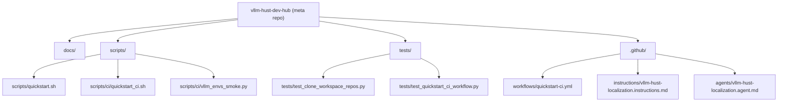
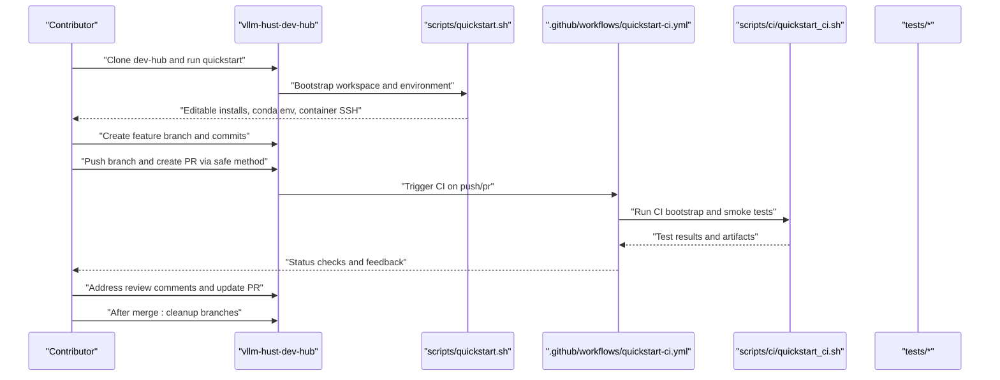
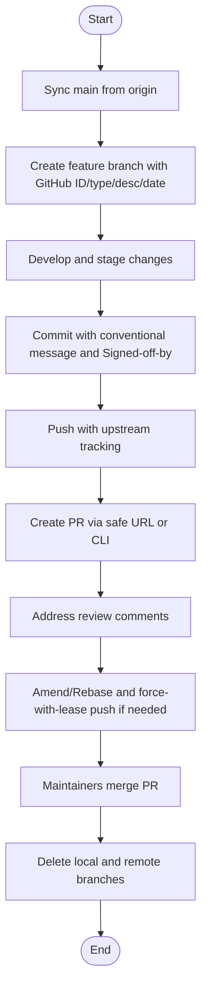
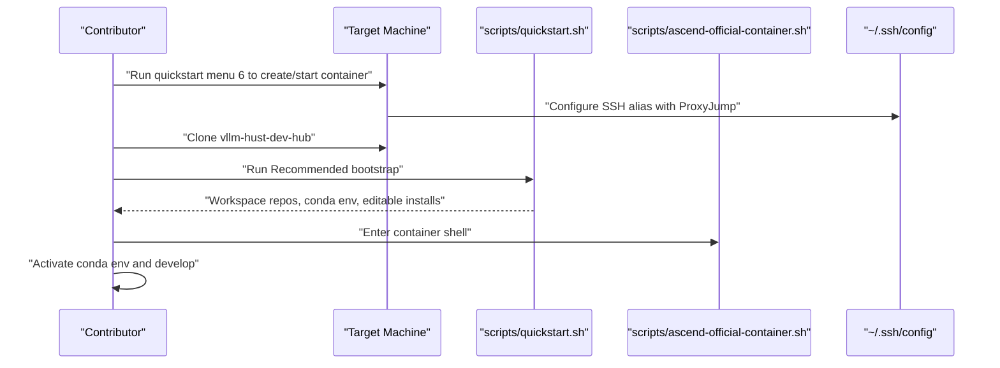
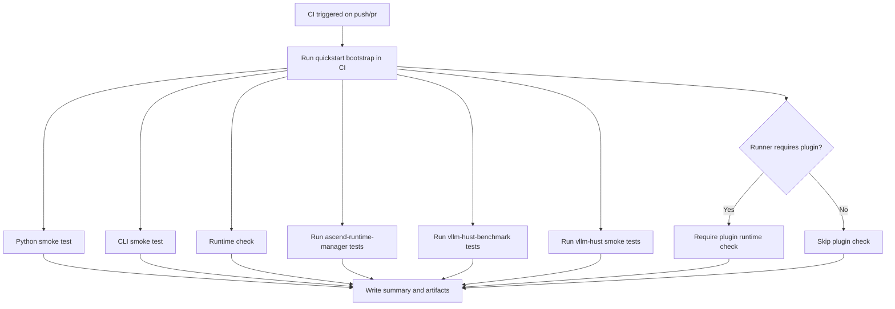
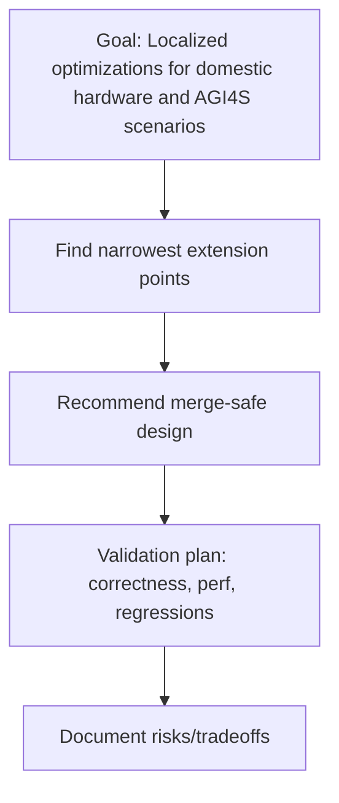
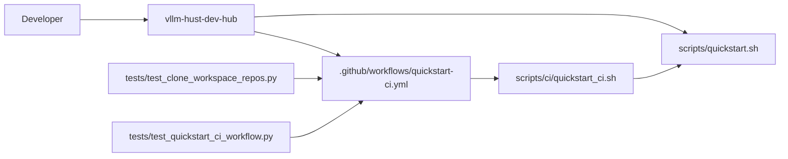

# Contribution Guidelines

<cite>
**Referenced Files in This Document**
- [README.md](file://README.md)
- [docs/contribution-git-workflow.md](file://docs/contribution-git-workflow.md)
- [docs/team-onboarding.md](file://docs/team-onboarding.md)
- [.github/workflows/quickstart-ci.yml](file://.github/workflows/quickstart-ci.yml)
- [scripts/quickstart.sh](file://scripts/quickstart.sh)
- [scripts/ci/quickstart_ci.sh](file://scripts/ci/quickstart_ci.sh)
- [scripts/ci/vllm_envs_smoke.py](file://scripts/ci/vllm_envs_smoke.py)
- [tests/test_clone_workspace_repos.py](file://tests/test_clone_workspace_repos.py)
- [tests/test_quickstart_ci_workflow.py](file://tests/test_quickstart_ci_workflow.py)
- [.github/instructions/vllm-hust-localization.instructions.md](file://.github/instructions/vllm-hust-localization.instructions.md)
- [.github/agents/vllm-hust-localization.agent.md](file://.github/agents/vllm-hust-localization.agent.md)
</cite>

## Table of Contents
1. [Introduction](#introduction)
2. [Project Structure](#project-structure)
3. [Core Components](#core-components)
4. [Architecture Overview](#architecture-overview)
5. [Detailed Component Analysis](#detailed-component-analysis)
6. [Dependency Analysis](#dependency-analysis)
7. [Performance Considerations](#performance-considerations)
8. [Troubleshooting Guide](#troubleshooting-guide)
9. [Conclusion](#conclusion)
10. [Appendices](#appendices)

## Introduction
This document defines the contribution guidelines for the VLLM-HUST Development Hub. It explains the collaborative development model, the Fork Branch + PR workflow used by the organization, and the end-to-end process from environment setup to PR submission. It also documents branch naming conventions, commit message standards, code review expectations, safety practices for PR creation, and best practices for maintaining a clean work tree. The content is designed to be accessible to new contributors while establishing clear standards for experienced developers.

## Project Structure
The Development Hub is a meta repository that orchestrates a multi-repo workspace and provides scripts to bootstrap environments, manage containers, and run CI validations. Key areas relevant to contributions:
- docs: Contribution workflow and onboarding materials
- scripts: Developer bootstrapping, container orchestration, and CI helpers
- tests: Contract tests validating CI and bootstrap behavior
- .github: CI workflows and guidance for localization work

**Diagram sources**
- [README.md:1-288](file://README.md#L1-L288)
- [docs/contribution-git-workflow.md:1-501](file://docs/contribution-git-workflow.md#L1-L501)
- [docs/team-onboarding.md:1-384](file://docs/team-onboarding.md#L1-L384)
- [.github/workflows/quickstart-ci.yml:1-149](file://.github/workflows/quickstart-ci.yml#L1-L149)
- [scripts/quickstart.sh](file://scripts/quickstart.sh)
- [scripts/ci/quickstart_ci.sh:1-321](file://scripts/ci/quickstart_ci.sh#L1-L321)
- [scripts/ci/vllm_envs_smoke.py:1-69](file://scripts/ci/vllm_envs_smoke.py#L1-L69)
- [tests/test_clone_workspace_repos.py:1-110](file://tests/test_clone_workspace_repos.py#L1-L110)
- [tests/test_quickstart_ci_workflow.py:1-142](file://tests/test_quickstart_ci_workflow.py#L1-L142)
- [.github/instructions/vllm-hust-localization.instructions.md:1-31](file://.github/instructions/vllm-hust-localization.instructions.md#L1-L31)
- [.github/agents/vllm-hust-localization.agent.md:1-48](file://.github/agents/vllm-hust-localization.agent.md#L1-L48)

**Section sources**
- [README.md:1-288](file://README.md#L1-L288)
- [docs/contribution-git-workflow.md:1-501](file://docs/contribution-git-workflow.md#L1-L501)
- [docs/team-onboarding.md:1-384](file://docs/team-onboarding.md#L1-L384)
- [.github/workflows/quickstart-ci.yml:1-149](file://.github/workflows/quickstart-ci.yml#L1-L149)

## Core Components
- Contribution workflow and safety practices: documented in the contribution guide
- Environment bootstrap and container workflow: documented in the onboarding guide and driven by quickstart scripts
- CI contract and smoke tests: enforced by CI workflow and unit tests
- Localization guidance: agent and instructions define merge-safe extension points and validation expectations

**Section sources**
- [docs/contribution-git-workflow.md:1-501](file://docs/contribution-git-workflow.md#L1-L501)
- [docs/team-onboarding.md:1-384](file://docs/team-onboarding.md#L1-L384)
- [.github/workflows/quickstart-ci.yml:1-149](file://.github/workflows/quickstart-ci.yml#L1-L149)
- [tests/test_clone_workspace_repos.py:1-110](file://tests/test_clone_workspace_repos.py#L1-L110)
- [tests/test_quickstart_ci_workflow.py:1-142](file://tests/test_quickstart_ci_workflow.py#L1-L142)
- [.github/instructions/vllm-hust-localization.instructions.md:1-31](file://.github/instructions/vllm-hust-localization.instructions.md#L1-L31)
- [.github/agents/vllm-hust-localization.agent.md:1-48](file://.github/agents/vllm-hust-localization.agent.md#L1-L48)

## Architecture Overview
The contribution lifecycle integrates developer workflows, containerized environments, and CI validation:

**Diagram sources**
- [docs/contribution-git-workflow.md:304-371](file://docs/contribution-git-workflow.md#L304-L371)
- [docs/team-onboarding.md:170-220](file://docs/team-onboarding.md#L170-L220)
- [.github/workflows/quickstart-ci.yml:1-149](file://.github/workflows/quickstart-ci.yml#L1-L149)
- [scripts/ci/quickstart_ci.sh:232-321](file://scripts/ci/quickstart_ci.sh#L232-L321)
- [tests/test_quickstart_ci_workflow.py:1-142](file://tests/test_quickstart_ci_workflow.py#L1-L142)

## Detailed Component Analysis

### Contribution Workflow (Fork Branch + PR)
The organization follows a “Fork Branch, not Fork Repo” model within the organization’s repository. Each task is developed on a feature branch named with a GitHub ID prefix, a type, a short description, and a date suffix. PRs are created from the feature branch to the organization’s main branch. The workflow emphasizes:
- Never committing directly to main
- Using descriptive branch names with a GitHub ID prefix
- Creating PRs via a safe method to ensure targeting the correct repository
- Responding to reviews by amending or rebasing and force-with-lease pushing when necessary
- Cleaning up branches after merge

**Diagram sources**
- [docs/contribution-git-workflow.md:135-224](file://docs/contribution-git-workflow.md#L135-L224)
- [docs/contribution-git-workflow.md:304-371](file://docs/contribution-git-workflow.md#L304-L371)
- [docs/contribution-git-workflow.md:374-394](file://docs/contribution-git-workflow.md#L374-L394)

**Section sources**
- [docs/contribution-git-workflow.md:23-47](file://docs/contribution-git-workflow.md#L23-L47)
- [docs/contribution-git-workflow.md:110-132](file://docs/contribution-git-workflow.md#L110-L132)
- [docs/contribution-git-workflow.md:135-224](file://docs/contribution-git-workflow.md#L135-L224)
- [docs/contribution-git-workflow.md:304-371](file://docs/contribution-git-workflow.md#L304-L371)
- [docs/contribution-git-workflow.md:374-394](file://docs/contribution-git-workflow.md#L374-L394)

### Environment Setup and Container Workflow
The recommended path for setting up a development environment and connecting to the official Ascend container is documented in the onboarding guide. It includes:
- Creating or reusing the official Ascend Docker instance
- Configuring SSH with ProxyJump for reliable access
- Cloning the dev-hub and running the quickstart bootstrap
- Activating the conda environment and verifying installations
- Optional manual editable installs only when needed

**Diagram sources**
- [docs/team-onboarding.md:25-100](file://docs/team-onboarding.md#L25-L100)
- [docs/team-onboarding.md:154-220](file://docs/team-onboarding.md#L154-L220)
- [docs/team-onboarding.md:301-313](file://docs/team-onboarding.md#L301-L313)

**Section sources**
- [docs/team-onboarding.md:11-24](file://docs/team-onboarding.md#L11-L24)
- [docs/team-onboarding.md:25-100](file://docs/team-onboarding.md#L25-L100)
- [docs/team-onboarding.md:154-220](file://docs/team-onboarding.md#L154-L220)
- [docs/team-onboarding.md:301-313](file://docs/team-onboarding.md#L301-L313)

### CI Validation and Testing Expectations
The CI workflow validates the bootstrap process and smoke tests across core repositories. It enforces:
- Consistent environment creation and installation scope
- Smoke tests for Python, CLI, runtime checks, and benchmark tests
- Optional plugin validation for self-hosted runners
- Artifact upload and summary reporting

**Diagram sources**
- [.github/workflows/quickstart-ci.yml:1-149](file://.github/workflows/quickstart-ci.yml#L1-L149)
- [scripts/ci/quickstart_ci.sh:232-321](file://scripts/ci/quickstart_ci.sh#L232-L321)
- [scripts/ci/vllm_envs_smoke.py:1-69](file://scripts/ci/vllm_envs_smoke.py#L1-L69)
- [tests/test_quickstart_ci_workflow.py:1-142](file://tests/test_quickstart_ci_workflow.py#L1-L142)

**Section sources**
- [.github/workflows/quickstart-ci.yml:1-149](file://.github/workflows/quickstart-ci.yml#L1-L149)
- [scripts/ci/quickstart_ci.sh:146-178](file://scripts/ci/quickstart_ci.sh#L146-L178)
- [scripts/ci/quickstart_ci.sh:208-216](file://scripts/ci/quickstart_ci.sh#L208-L216)
- [scripts/ci/vllm_envs_smoke.py:1-69](file://scripts/ci/vllm_envs_smoke.py#L1-L69)
- [tests/test_quickstart_ci_workflow.py:28-96](file://tests/test_quickstart_ci_workflow.py#L28-L96)

### Localization Guidance and Merge-Safe Practices
Localization guidance emphasizes:
- Treating the repository as an upstream-compatible fork
- Extending existing abstractions (platform interfaces, registries, backend selectors, plugin hooks)
- Keeping vendor-specific logic isolated behind capability checks and feature flags
- Validating changes with correctness, performance impact, and regression risk
- Following the root AGENTS.md workflow and contribution rules

**Diagram sources**
- [.github/instructions/vllm-hust-localization.instructions.md:6-31](file://.github/instructions/vllm-hust-localization.instructions.md#L6-L31)
- [.github/agents/vllm-hust-localization.agent.md:14-48](file://.github/agents/vllm-hust-localization.agent.md#L14-L48)

**Section sources**
- [.github/instructions/vllm-hust-localization.instructions.md:6-31](file://.github/instructions/vllm-hust-localization.instructions.md#L6-L31)
- [.github/agents/vllm-hust-localization.agent.md:14-48](file://.github/agents/vllm-hust-localization.agent.md#L14-L48)

## Dependency Analysis
The contribution process depends on:
- Developer actions: branch naming, commit messages, PR creation via safe methods
- Scripts: quickstart for environment bootstrap and CI helpers for validation
- CI: workflow orchestrating bootstrap and smoke tests
- Tests: guarding CI behavior and workspace repository handling

**Diagram sources**
- [docs/contribution-git-workflow.md:304-371](file://docs/contribution-git-workflow.md#L304-L371)
- [docs/team-onboarding.md:170-220](file://docs/team-onboarding.md#L170-L220)
- [.github/workflows/quickstart-ci.yml:1-149](file://.github/workflows/quickstart-ci.yml#L1-L149)
- [scripts/ci/quickstart_ci.sh:232-321](file://scripts/ci/quickstart_ci.sh#L232-L321)
- [tests/test_clone_workspace_repos.py:1-110](file://tests/test_clone_workspace_repos.py#L1-L110)
- [tests/test_quickstart_ci_workflow.py:1-142](file://tests/test_quickstart_ci_workflow.py#L1-L142)

**Section sources**
- [docs/contribution-git-workflow.md:304-371](file://docs/contribution-git-workflow.md#L304-L371)
- [docs/team-onboarding.md:170-220](file://docs/team-onboarding.md#L170-L220)
- [.github/workflows/quickstart-ci.yml:1-149](file://.github/workflows/quickstart-ci.yml#L1-L149)
- [scripts/ci/quickstart_ci.sh:232-321](file://scripts/ci/quickstart_ci.sh#L232-L321)
- [tests/test_clone_workspace_repos.py:1-110](file://tests/test_clone_workspace_repos.py#L1-L110)
- [tests/test_quickstart_ci_workflow.py:1-142](file://tests/test_quickstart_ci_workflow.py#L1-L142)

## Performance Considerations
- Keep PRs scoped to a single task to minimize review overhead and CI runtime
- Use the recommended container workflow to avoid environment drift and speed up iteration
- Prefer incremental commits with clear messages to aid bisect and debugging
- Run local smoke tests before pushing to reduce CI failures

## Troubleshooting Guide
Common scenarios and resolutions:
- Accidentally committed to main: create a temporary branch with current commits, reset main from origin, and re-apply commits to a feature branch
- Branch conflicts with main: rebase onto origin/main, resolve conflicts, and force-with-lease push
- Unclean work tree: stash or commit WIP changes, switch branches carefully, and verify clean status afterward
- PR sent to wrong repository: confirm base and head on the PR page or use the safe URL/CLI method to recreate the PR
- Untracked files: inspect with status and clean selectively; use clean -fdx cautiously

**Section sources**
- [docs/contribution-git-workflow.md:398-462](file://docs/contribution-git-workflow.md#L398-L462)
- [docs/contribution-git-workflow.md:226-301](file://docs/contribution-git-workflow.md#L226-L301)

## Conclusion
By following the Fork Branch + PR workflow, adhering to branch naming and commit message standards, and leveraging the documented environment and CI processes, contributors can efficiently collaborate while maintaining a clean and predictable development history. Localization guidance further ensures changes remain merge-safe and aligned with upstream compatibility goals.

## Appendices

### A. Step-by-Step Contribution Checklist
- Environment setup
  - Create/start the official Ascend container and configure SSH
  - Clone vllm-hust-dev-hub and run the recommended bootstrap
  - Activate the conda environment and verify installations
- Daily development
  - Sync main, create a feature branch with the required naming convention
  - Stage and commit changes with conventional messages and Signed-off-by
  - Push with upstream tracking
- PR creation
  - Use the safe URL or CLI method to target the organization repository
  - Fill the PR template checklist and include test coverage notes
- Post-merge
  - Delete local and remote branches and verify a clean work tree

**Section sources**
- [docs/team-onboarding.md:170-220](file://docs/team-onboarding.md#L170-L220)
- [docs/contribution-git-workflow.md:110-132](file://docs/contribution-git-workflow.md#L110-L132)
- [docs/contribution-git-workflow.md:184-190](file://docs/contribution-git-workflow.md#L184-L190)
- [docs/contribution-git-workflow.md:304-371](file://docs/contribution-git-workflow.md#L304-L371)
- [docs/contribution-git-workflow.md:374-394](file://docs/contribution-git-workflow.md#L374-L394)