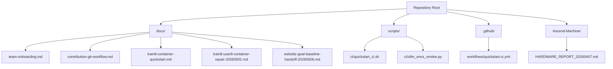
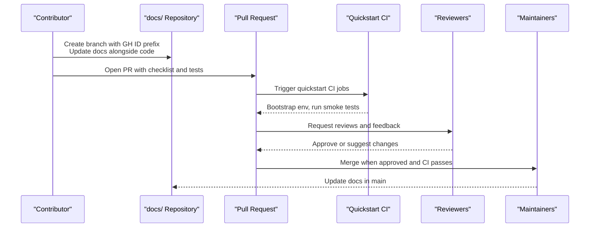
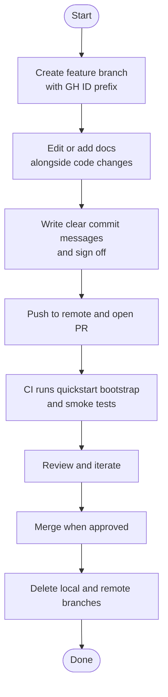
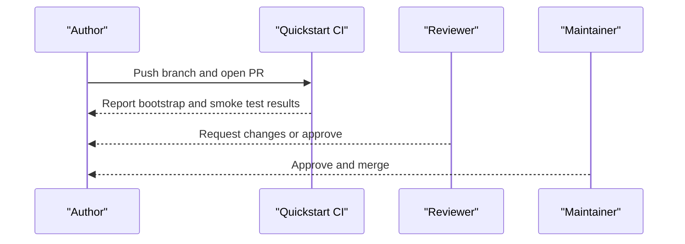
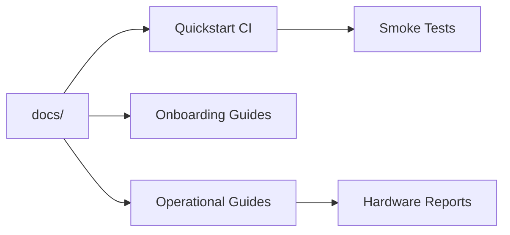

# Documentation Standards

<cite>
**Referenced Files in This Document**
- [README.md](file://README.md)
- [ROADMAP.md](file://ROADMAP.md)
- [docs/contribution-git-workflow.md](file://docs/contribution-git-workflow.md)
- [docs/team-onboarding.md](file://docs/team-onboarding.md)
- [docs/train8-container-quickstart.md](file://docs/train8-container-quickstart.md)
- [docs/train8-user8-container-repair-20260502.md](file://docs/train8-user8-container-repair-20260502.md)
- [docs/website-goal-baseline-handoff-20260506.md](file://docs/website-goal-baseline-handoff-20260506.md)
- [.github/workflows/quickstart-ci.yml](file://.github/workflows/quickstart-ci.yml)
- [scripts/ci/quickstart_ci.sh](file://scripts/ci/quickstart_ci.sh)
- [scripts/ci/vllm_envs_smoke.py](file://scripts/ci/vllm_envs_smoke.py)
- [Ascend-Machine/HARDWARE_REPORT_20260407.md](file://Ascend-Machine/HARDWARE_REPORT_20260407.md)
</cite>

## Table of Contents
1. [Introduction](#introduction)
2. [Project Structure](#project-structure)
3. [Core Components](#core-components)
4. [Architecture Overview](#architecture-overview)
5. [Detailed Component Analysis](#detailed-component-analysis)
6. [Dependency Analysis](#dependency-analysis)
7. [Performance Considerations](#performance-considerations)
8. [Troubleshooting Guide](#troubleshooting-guide)
9. [Conclusion](#conclusion)
10. [Appendices](#appendices)

## Introduction
This document defines documentation standards and practices for the VLLM-HUST Development Hub. It establishes the contribution workflow for updating existing documentation and creating new documentation pages, sets technical writing standards for clarity, consistency, and accessibility, and outlines how documentation should accompany functional changes. It also describes the review and approval process for documentation changes and provides examples of good documentation and common pitfalls to avoid.

## Project Structure
The repository is organized as a meta-repository that coordinates development across multiple related repositories and provides unified onboarding and CI tooling. Documentation is primarily located under the docs/ directory, with supporting operational and performance content under Ascend-Machine/.

**Diagram sources**
- [README.md:1-288](file://README.md#L1-L288)
- [docs/team-onboarding.md:1-384](file://docs/team-onboarding.md#L1-L384)
- [docs/contribution-git-workflow.md:1-501](file://docs/contribution-git-workflow.md#L1-L501)
- [docs/train8-container-quickstart.md:1-404](file://docs/train8-container-quickstart.md#L1-L404)
- [docs/train8-user8-container-repair-20260502.md:1-222](file://docs/train8-user8-container-repair-20260502.md#L1-L222)
- [docs/website-goal-baseline-handoff-20260506.md:1-345](file://docs/website-goal-baseline-handoff-20260506.md#L1-L345)
- [scripts/ci/quickstart_ci.sh:1-321](file://scripts/ci/quickstart_ci.sh#L1-L321)
- [scripts/ci/vllm_envs_smoke.py:1-69](file://scripts/ci/vllm_envs_smoke.py#L1-L69)
- [.github/workflows/quickstart-ci.yml:1-149](file://.github/workflows/quickstart-ci.yml#L1-L149)
- [Ascend-Machine/HARDWARE_REPORT_20260407.md:1-215](file://Ascend-Machine/HARDWARE_REPORT_20260407.md#L1-L215)

**Section sources**
- [README.md:1-288](file://README.md#L1-L288)

## Core Components
- Documentation contribution workflow: Based on the Git workflow documented in docs/contribution-git-workflow.md, contributors create feature branches prefixed with their GitHub ID, update documentation alongside functional changes, and submit Pull Requests with clear descriptions and test coverage.
- Onboarding documentation: docs/team-onboarding.md provides a unified, step-by-step guide for setting up development environments, including container bootstrapping and SSH configuration.
- Operational guides: docs/train8-container-quickstart.md and docs/train8-user8-container-repair-20260502.md define container deployment, maintenance, and incident response procedures.
- Website and benchmark coordination: docs/website-goal-baseline-handoff-20260506.md documents the fixed baseline chain linking benchmark results to website presentation.
- CI and quality gates: .github/workflows/quickstart-ci.yml and scripts/ci/quickstart_ci.sh enforce environment bootstrap correctness and smoke tests across repositories.

**Section sources**
- [docs/contribution-git-workflow.md:1-501](file://docs/contribution-git-workflow.md#L1-L501)
- [docs/team-onboarding.md:1-384](file://docs/team-onboarding.md#L1-L384)
- [docs/train8-container-quickstart.md:1-404](file://docs/train8-container-quickstart.md#L1-L404)
- [docs/train8-user8-container-repair-20260502.md:1-222](file://docs/train8-user8-container-repair-20260502.md#L1-L222)
- [docs/website-goal-baseline-handoff-20260506.md:1-345](file://docs/website-goal-baseline-handoff-20260506.md#L1-L345)
- [.github/workflows/quickstart-ci.yml:1-149](file://.github/workflows/quickstart-ci.yml#L1-L149)
- [scripts/ci/quickstart_ci.sh:1-321](file://scripts/ci/quickstart_ci.sh#L1-L321)

## Architecture Overview
The documentation lifecycle integrates with the development lifecycle and CI:

**Diagram sources**
- [docs/contribution-git-workflow.md:304-371](file://docs/contribution-git-workflow.md#L304-L371)
- [.github/workflows/quickstart-ci.yml:14-72](file://.github/workflows/quickstart-ci.yml#L14-L72)
- [scripts/ci/quickstart_ci.sh:232-321](file://scripts/ci/quickstart_ci.sh#L232-L321)

## Detailed Component Analysis

### Documentation Contribution Workflow
- Branch naming: Use <github-id>/<type>-<short-desc>-<YYYYMMDD> to avoid conflicts and aid sorting.
- Commit messages: Follow conventional formatting with type, short summary, and rationale; include Fixes and Signed-off-by.
- PR creation: Use safe URLs or CLI to target the correct organization repository; include a checklist and test plan.
- Post-merge cleanup: Delete merged branches locally and remotely; keep main clean.

**Diagram sources**
- [docs/contribution-git-workflow.md:110-132](file://docs/contribution-git-workflow.md#L110-L132)
- [docs/contribution-git-workflow.md:174-190](file://docs/contribution-git-workflow.md#L174-L190)
- [docs/contribution-git-workflow.md:304-371](file://docs/contribution-git-workflow.md#L304-L371)
- [scripts/ci/quickstart_ci.sh:232-321](file://scripts/ci/quickstart_ci.sh#L232-L321)

**Section sources**
- [docs/contribution-git-workflow.md:110-132](file://docs/contribution-git-workflow.md#L110-L132)
- [docs/contribution-git-workflow.md:174-190](file://docs/contribution-git-workflow.md#L174-L190)
- [docs/contribution-git-workflow.md:304-371](file://docs/contribution-git-workflow.md#L304-L371)

### Technical Writing Standards
- Clarity: Use concise subject-verb statements; explain what changed and why, not how.
- Consistency: Follow branch naming, commit message, and PR templates consistently across contributors.
- Accessibility: Prefer plain English; avoid jargon; provide context for acronyms and internal references.
- Structure: Use headings, bullet lists, and short paragraphs; link to related docs and CI results.

**Section sources**
- [docs/contribution-git-workflow.md:184-190](file://docs/contribution-git-workflow.md#L184-L190)
- [docs/contribution-git-workflow.md:352-371](file://docs/contribution-git-workflow.md#L352-L371)

### Updating Existing Documentation
- Keep documentation synchronized with code changes; update docs when adding features, fixing bugs, or changing APIs.
- Reference related PRs and issues; link to CI logs and test results where applicable.
- Maintain a changelog-style summary of significant doc changes in PR descriptions.

**Section sources**
- [ROADMAP.md:74-83](file://ROADMAP.md#L74-L83)
- [docs/contribution-git-workflow.md:352-371](file://docs/contribution-git-workflow.md#L352-L371)

### Creating New Documentation Pages
- Place new docs under docs/ with a descriptive filename; include a brief overview and cross-link to related topics.
- Align new pages with existing onboarding and operational guides; ensure they integrate with CI and review processes.

**Section sources**
- [docs/team-onboarding.md:1-30](file://docs/team-onboarding.md#L1-L30)
- [docs/train8-container-quickstart.md:1-20](file://docs/train8-container-quickstart.md#L1-L20)

### Documenting New Features
- Feature pages should describe intent, scope, prerequisites, and usage; include screenshots or command examples where helpful.
- Link to CI artifacts and test coverage; note any breaking changes or migration steps.

**Section sources**
- [docs/website-goal-baseline-handoff-20260506.md:21-31](file://docs/website-goal-baseline-handoff-20260506.md#L21-L31)
- [scripts/ci/quickstart_ci.sh:232-321](file://scripts/ci/quickstart_ci.sh#L232-L321)

### Updating Onboarding Materials
- Ensure onboarding docs reflect the latest container and environment setup; update SSH configurations and quickstart scripts.
- Validate that onboarding steps pass CI bootstrap and produce working environments.

**Section sources**
- [docs/team-onboarding.md:13-24](file://docs/team-onboarding.md#L13-L24)
- [docs/train8-container-quickstart.md:67-100](file://docs/train8-container-quickstart.md#L67-L100)
- [scripts/ci/quickstart_ci.sh:232-321](file://scripts/ci/quickstart_ci.sh#L232-L321)

### Maintaining Documentation Quality
- Use PR checklists to ensure completeness; require at least one approval from maintainers.
- Run CI smoke tests to validate environment assumptions; link to logs in PR descriptions.
- Periodically audit docs for outdated commands or references; update hardware/performance reports accordingly.

**Section sources**
- [docs/contribution-git-workflow.md:364-371](file://docs/contribution-git-workflow.md#L364-L371)
- [.github/workflows/quickstart-ci.yml:14-72](file://.github/workflows/quickstart-ci.yml#L14-L72)
- [Ascend-Machine/HARDWARE_REPORT_20260407.md:154-175](file://Ascend-Machine/HARDWARE_REPORT_20260407.md#L154-L175)

### Relationship Between Code Changes and Documentation Updates
- Principle: Documentation should be updated alongside functional changes; never merge code without corresponding docs.
- Evidence-driven updates: As shown in ROADMAP.md, document decisions, benchmarks, and outcomes after changes are finalized.

**Section sources**
- [ROADMAP.md:74-83](file://ROADMAP.md#L74-L83)

### Examples of Well-Written Documentation
- Team onboarding: Clear, stepwise instructions with rationale and non-interactive alternatives.
- Container quickstart: Practical deployment steps, SSH configuration, and troubleshooting.
- Website baseline handoff: Structured task breakdown, environment setup, and actionable next steps.

**Section sources**
- [docs/team-onboarding.md:13-24](file://docs/team-onboarding.md#L13-L24)
- [docs/train8-container-quickstart.md:67-100](file://docs/train8-container-quickstart.md#L67-L100)
- [docs/website-goal-baseline-handoff-20260506.md:210-248](file://docs/website-goal-baseline-handoff-20260506.md#L210-L248)

### Common Pitfalls to Avoid
- Merging code without docs updates.
- Using ambiguous commit messages or PR descriptions.
- Skipping CI validation or ignoring failing smoke tests.
- Not aligning container images or SSH configurations with documented baselines.

**Section sources**
- [docs/contribution-git-workflow.md:398-462](file://docs/contribution-git-workflow.md#L398-L462)
- [docs/train8-user8-container-repair-20260502.md:177-189](file://docs/train8-user8-container-repair-20260502.md#L177-L189)

### Review Process and Approval Requirements
- Use PR templates and checklists to ensure completeness.
- Require at least one maintainer approval before merging.
- CI must pass environment bootstrap and smoke tests; link to logs in PR.

**Diagram sources**
- [.github/workflows/quickstart-ci.yml:14-72](file://.github/workflows/quickstart-ci.yml#L14-L72)
- [scripts/ci/quickstart_ci.sh:232-321](file://scripts/ci/quickstart_ci.sh#L232-L321)
- [docs/contribution-git-workflow.md:364-371](file://docs/contribution-git-workflow.md#L364-L371)

**Section sources**
- [docs/contribution-git-workflow.md:364-371](file://docs/contribution-git-workflow.md#L364-L371)
- [.github/workflows/quickstart-ci.yml:14-72](file://.github/workflows/quickstart-ci.yml#L14-L72)
- [scripts/ci/quickstart_ci.sh:232-321](file://scripts/ci/quickstart_ci.sh#L232-L321)

## Dependency Analysis
Documentation depends on:
- Correct branch and PR hygiene to ensure timely updates.
- CI bootstrap and smoke tests to validate environment assumptions.
- Operational guides to maintain accurate deployment and troubleshooting steps.

**Diagram sources**
- [.github/workflows/quickstart-ci.yml:14-72](file://.github/workflows/quickstart-ci.yml#L14-L72)
- [scripts/ci/quickstart_ci.sh:232-321](file://scripts/ci/quickstart_ci.sh#L232-L321)
- [docs/team-onboarding.md:1-30](file://docs/team-onboarding.md#L1-L30)
- [docs/train8-container-quickstart.md:1-20](file://docs/train8-container-quickstart.md#L1-L20)
- [Ascend-Machine/HARDWARE_REPORT_20260407.md:1-20](file://Ascend-Machine/HARDWARE_REPORT_20260407.md#L1-L20)

**Section sources**
- [.github/workflows/quickstart-ci.yml:14-72](file://.github/workflows/quickstart-ci.yml#L14-L72)
- [scripts/ci/quickstart_ci.sh:232-321](file://scripts/ci/quickstart_ci.sh#L232-L321)
- [docs/team-onboarding.md:1-30](file://docs/team-onboarding.md#L1-L30)
- [docs/train8-container-quickstart.md:1-20](file://docs/train8-container-quickstart.md#L1-L20)
- [Ascend-Machine/HARDWARE_REPORT_20260407.md:1-20](file://Ascend-Machine/HARDWARE_REPORT_20260407.md#L1-L20)

## Performance Considerations
- Keep documentation concise and scannable; long-form guides should link to detailed sections.
- Use CI to validate environment assumptions; avoid documenting steps that fail in CI.
- Reference hardware/performance reports to ground recommendations in empirical data.

**Section sources**
- [Ascend-Machine/HARDWARE_REPORT_20260407.md:205-215](file://Ascend-Machine/HARDWARE_REPORT_20260407.md#L205-L215)

## Troubleshooting Guide
Common documentation-related issues and resolutions:
- PR sent to wrong repository: Use safe URL or CLI to target the correct organization repository.
- Dirty worktree leading to merge conflicts: Clean or stash changes; verify status before switching branches.
- SSH connectivity problems: Validate container SSH configuration and host key entries; use ProxyJump when needed.
- CI failures: Inspect logs, ensure environment bootstrap succeeds, and rerun smoke tests.

**Section sources**
- [docs/contribution-git-workflow.md:400-462](file://docs/contribution-git-workflow.md#L400-L462)
- [docs/train8-container-quickstart.md:264-289](file://docs/train8-container-quickstart.md#L264-L289)
- [scripts/ci/quickstart_ci.sh:128-145](file://scripts/ci/quickstart_ci.sh#L128-L145)

## Conclusion
Documentation standards in the VLLM-HUST Development Hub emphasize synchronization with code changes, clarity, consistency, and accessibility. Contributors should follow the documented workflow, use PR templates and checklists, and rely on CI to validate environment assumptions. Maintainers should require approvals and ensure documentation remains accurate and actionable.

## Appendices
- Example CI smoke test: scripts/ci/vllm_envs_smoke.py validates environment variable parsing for port configuration.
- Baseline benchmarking: docs/website-goal-baseline-handoff-20260506.md outlines the fixed baseline chain and artifact export process.

**Section sources**
- [scripts/ci/vllm_envs_smoke.py:1-69](file://scripts/ci/vllm_envs_smoke.py#L1-L69)
- [docs/website-goal-baseline-handoff-20260506.md:210-248](file://docs/website-goal-baseline-handoff-20260506.md#L210-L248)